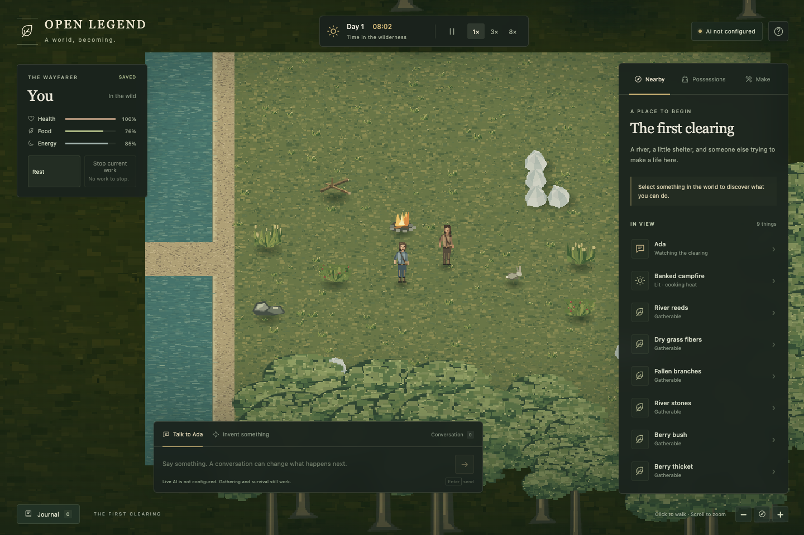

# Open Legend

A shared simulation of people, memory, survival, and worlds whose mechanics can grow through play.

**Create a world by playing it. Share what you discover.**

The first implementation is a **local, single-player wilderness prototype** with an autonomous resident, native survival, durable saves, and a PlayCanvas scene. Live Jev and LLM adapters support conversation, resident reconsideration and the invention of usable recipes. Those live routes require your server-side keys and a spending allowance; without them, native survival works and AI features explicitly report unavailable.

The broader shared-world platform, arbitrary invented physics, hosted worlds, marketplace, memberships and creator fund remain future work. Automated fixture tests are not evidence of live model quality. See [verification status](docs/verification.md).



- [Engine/world boundaries](docs/engine-and-world-boundaries.md), [extensibility roadmap](docs/extensibility-roadmap.md) and [EWF work](docs/maintainers/extensible-world-foundation.md) — shared foundation and staged delivery

## Run locally

Use **Node.js 22.13+** and **pnpm 10.33.0**, pinned in `package.json`. Node 22 LTS is the tested baseline; its built-in SQLite module may print an experimental warning. If pnpm is not installed, use `corepack enable` with Node 22, or follow the [pnpm installation guide](https://pnpm.io/10.x/installation).

```sh
pnpm install --frozen-lockfile
cp .env.example .env
pnpm run dev
```

Open **http://127.0.0.1:3210**. For live AI, follow the [setup guide](docs/live-ai-setup.md): a configured Macrofold key selects that backend; direct Jev/OpenAI keys select the direct path otherwise. Current full NPC conversation requires Macrofold with explicit model/compute allowance. Set a chosen nonzero `AI_BUDGET_USD` and restart only when ready to permit paid work. The default is $50 per agent per UTC calendar month; set zero to disable paid dispatch. Keys never go to the browser. The allowance and usage accounting persist with this world's save, rather than resetting on page reload.

If another app uses that port, run `PORT=3211 pnpm run dev` and open **http://127.0.0.1:3211** instead. Set `PORT=3211` in your existing `.env` to keep that choice across restarts.

Follow the [step-by-step live AI setup guide](docs/live-ai-setup.md) for key creation, local configuration and the first real conversation.

Open Talk through a nearby person or quick suggestion. Until AI is configured, its composer stays editable and **Set up AI** explains what is missing. Enter opens setup without sending a request. Unsent drafts survive a reload within the same browser tab.

Click the ground to walk; click a thing to **Look closer**, or right-click / Control-click for its actions. Object menus stay scoped to that object, self menus contain personal work, and empty-ground menus offer walking. **Show Unavailable Actions** reveals blocked options and saves that preference. Hover or keyboard-focus an action for a one-second explanation with actual material/time facts. Search retains **Search actions or invent something…**: unmatched Enter opens an editable invention draft, and only **Send** dispatches it.

With `OPEN_LEGEND_GOD_MODE=true`, right-click a dead actor to **Revive**, or right-click blank walkable ground and choose **Add something**. The searchable list contains every currently supported placeable world entity, with Person first and the remainder alphabetized; it shows eight rows before scrolling. Creating a person accepts a name, personality, backstory, described trait tags and initial goals. Leaving traits empty assigns the usual three saved random traits. God mode also offers **Grant cognition and speech** for an ordinary animal. Revival fully restores the body even after harvesting; harvested inventory is preserved. These owner-only mutations work while paused and are labeled **God mode**.

Drag with the primary, right or middle mouse button to pan. A stationary right-click opens actions on release. Scroll to zoom or use the camera buttons to zoom and recenter. Dismissing a menu by clicking the world never walks.

The React interface uses the [new design system](apps/client/src/design-system/README.md): Inventory (I), Crafting (C), Character (K), World agent (W), In view (V) and Journal (J). Panels open beside their launchers and share a bottom sheet on narrow screens. **Settings and help** offers Wilderness/Fantasy/Sci-fi skins, 90–130% HUD scale, reduced motion and asset credits. Themes never change game rules. Character traits are sampled from a configurable bank and saved; hover or focus a trait for its description.

Select a resource and Gather. Your character approaches it, completes the work, then adds up to two units to Inventory (merging with an existing stack). Reeds/grass yield Reed fibers, fallen branches yield Supple branch, river stones yield Small stone, and berry bushes yield Wild berries. Work stops while paused; another movement/work command replaces unfinished work. Your inventory includes a few possessions and prepared materials. Talk to Ada, then use **Invent a tool** to describe a physical sling made from cord and prepared fibers. A live model proposes a new recipe; the engine independently checks it. Craft the admitted recipe, equip the launcher, carry stones, hunt, harvest, cook raw meat at the starting fire, and eat. Inventing a bow and then arrows exercises the same ranged rules; bone from a hunted animal can provide a point. Gathering, preparing fibers/cord, eating and resting use ordinary code.

Pause and **0.5× / 1× / 3× / 8×** controls use one simulation clock. At **1×, one real second advances one game minute**: a full game day takes 24 real minutes (48 minutes at 0.5×, 8 minutes at 3×, 3 minutes at 8×). Open **Time settings** beside the speed buttons to change **Pause game when hidden**. It is checked by default and saved to your local player profile. Checked, hiding the tab or moving focus away pauses the game; unchecked, the server continues while a game tab remains connected, even if background heartbeats are throttled. Manual pause always wins. Closing all game connections pauses progression after disconnect detection; server downtime and computer sleep produce no offline catch-up. An already dispatched model request may still incur usage, but a paused world cannot accept its effects.

Open **Game**, directly below **World agent** on the right rail, to save the current world or choose a saved game to load paused. Each named save appears in the menu's Saved games list. Manual saves live in `.data/saves/<save-id>/` as `metadata.json` and `world.json`; `.data/` is gitignored. The server keeps up to 20 manual slots and a “Before last load” recovery slot in `.data/world.sqlite`. Development saves support only the current format; autosaves are not implemented. Stop the server before copying the whole `.data` directory for a local backup, including the save folder. Use another `OPEN_LEGEND_DATA_DIR` for a separate world and save folder. There is no silent save reset or destructive reset button. For a production client build served locally:

```sh
pnpm run build
pnpm start
```

This server binds to loopback. It is not a public multiplayer deployment.

World saves use a transactional change journal with periodic snapshots. Explicit actions save immediately; routine simulation flushes once per real second and on clean shutdown. The browser bootstraps once and receives typed SSE updates. God-mode Person/World Events editors support atomic delta saves, discard, and independent draggable windows; see [current architecture and limits](docs/architecture.md#public-updates-and-owner-editors).

## Try the extensible attribute demo

The optional native `reservoir-demo` preset replaces the player/resident's food and fatigue with charge and a categorical disposition. Open **In view → Charged capacitor → Recharge**. Ada can replenish autonomously from the same finite supply. This demonstrates attribute interfaces; it is not live-model acceptance or an electrical simulation.

Use a separate new data directory and disable paid work:

```sh
OPEN_LEGEND_DATA_DIR=/tmp/openlegend-reservoir-demo OPEN_LEGEND_WORLD_PRESET=reservoir-demo AI_BUDGET_USD=0 PORT=3218 node --import tsx apps/server/src/main.ts
```

Open **http://127.0.0.1:3218**. Pause, save through **Game**, advance, then load to inspect same-version restoration. The preset is used only for creation. Schema 5 rejects older development saves without modifying them; select a fresh directory for either preset. [Implementation and limits](docs/architecture.md#extensible-attribute-foundation).

For the coarse touch-only resident, use a separate data directory and `OPEN_LEGEND_WORLD_PRESET=touch-demo`. The player retains sight; the resident receives only unidentified contacts and short direct probe choices. God inspection is administrative evidence, not the resident's knowledge. See the [implemented limits](docs/architecture.md#registered-senses-and-coarse-contact).

## Develop

```sh
pnpm run format
pnpm run check
pnpm run test:browser
```

The browser check needs Playwright Chromium (`pnpm exec playwright install chromium`) and uses isolated, no-cost saves. See [contributing](CONTRIBUTING.md), [architecture](docs/architecture.md), [extension guidance](docs/extending.md), [AI providers](docs/ai-providers.md), and [verification](docs/verification.md).

| Module              | Responsibility                                                                         |
| ------------------- | -------------------------------------------------------------------------------------- |
| `packages/domain`   | Pure simulation, entities/components, inventory, recipes, events, memory and knowledge |
| `packages/ai`       | Replaceable typed Jev / LLM execution with validated results and receipts              |
| `packages/protocol` | Public client DTOs and command intentions                                              |
| `apps/server`       | Context, routing, durable spending, persistence, admission and HTTP                    |
| `apps/client`       | PlayCanvas world and React / React Aria HUD                                            |

## Explore the project

The [Narrator and conversation design](docs/narration-and-conversations.md) now includes readable actor context, explicit direct-address/overhearing triggers and optional talk/act/think reactions. Supported expressions have no mechanical effects; private thoughts stay private. Its broader [NC01–NC13 tasks](docs/maintainers/narration-and-conversations.md), cover durable group membership and private Narrator prose; broader acceptance remains open and automatic action/effect invention is deferred.

The [agent agency design](docs/agent-agency.md) adds optional repeated decisions, persistent goals and short native plans, and actor-led invention through existing mechanical admission. Its [runtime contract](archive/07-technical-architecture/agent-agency-runtime.md) integrates with the newer [event/reaction intake](docs/events-perception-and-reactions.md); [AG01–AG12](docs/maintainers/agent-agency.md) are uncompleted implementation and acceptance work.

The [perception and attention design](archive/07-technical-architecture/perception-and-attention.md) now has an initial visual experiment: sight reaches 28 map units, with a clear central field and a strongly blurred outer band instead of a dark fog. Previously seen objects can remain as frozen, non-interactive blurred images after leaving sight. Detailed occlusion, distance-specific descriptions, hearing gradients remain future work; scoped semantic attention and embeddings are implemented.

The latest design additions cover [world locks and invention ownership](archive/03-design-proposals/invention-governance-and-ownership.md), [playability and controls](archive/03-design-proposals/playability-and-controls.md), and [world logs and invention workshops](archive/03-design-proposals/world-agent-and-workshop.md). They describe planned extensions beyond the running prototype.

- [Maintainer work index](docs/maintainers/README.md) — navigation to cross-cutting work and the focused [ACT](docs/maintainers/actor-model.md), [CR](docs/maintainers/cognition-redesign.md), [NC](docs/maintainers/narration-and-conversations.md), [INV](docs/maintainers/inventions-and-world-evolution.md) and [production-data](docs/maintainers/production-data.md) trackers
- [Research and design archive](archive/README.md)
- [Save/load design](docs/save-and-load.md) — high-level constraints for future state, simulation and storage design; manual slots implemented; broader qualification and autosaves tracked separately
- [Runtime performance design](docs/performance.md) and [prioritized tasks](docs/maintainers/performance.md) — compact persistence, triggered background work, bounded CPU and the measured scale path; cold event storage, gameplay retry epochs and actor scheduling are implemented; multiplayer and scale qualification remain pending
- [Real-time multiplayer synchronization](archive/07-technical-architecture/realtime-synchronization.md) — batching, prediction, replication and future improvements
- [Production data model](archive/07-technical-architecture/production-data-model.md), [world-agent queries](archive/07-technical-architecture/data-queries-and-mcp.md), and [migration/scale design](archive/07-technical-architecture/data-delivery-and-scale.md) — target design, with active phases in the [production-data tracker](docs/maintainers/production-data.md)
- [Cognition redesign](docs/memory-architecture.md) and [build tasks CR01–CR12](docs/maintainers/cognition-redesign.md) — implemented compact context, attention, cleanup and background reflection, with remaining acceptance tracked explicitly
- [Project decisions](archive/05-project/open-decisions.md) and [implementation status](archive/05-project/implementation-status.md)
- [First playable MVP agreement](archive/05-project/first-playable-mvp.md)
- [Art direction and reference board](art-direction/README.md)
- [Marketing and creator ecosystem](archive/06-marketing/README.md)
- [Patrons, contributors, and world history](archive/06-marketing/patrons-contributors-and-world-history.md)

## License

First-party material in this repository is licensed under **GNU AGPL version 3 only (`AGPL-3.0-only`)**, unless explicitly stated otherwise. See [LICENSE](LICENSE) and [LICENSING.md](LICENSING.md).

The licensing guide explains the intended separation between the shared engine, future permissive SDKs, private world data, and separately licensed mechanics packs. Linked third-party artwork and other external references retain their own rights. The AGPL decision does not change the license of Macrofold or any other repository.

For repeatable native performance experiments, use the [stress profiling guide](docs/maintainers/performance-profiling.md), including the 500-ground-gem scenario.
