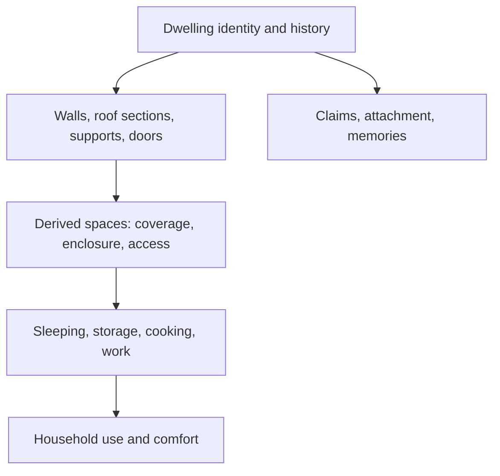

# Evolving materials, modular buildings, and expressive rules

Recorded September 19, 2026. **Accepted direction:** the user approved documenting evolvable properties and buildings assembled from replaceable parts. **Proposed implementation:** component schemas, formulas, script contracts, semantic hooks, migrations, and delivery stages below. Script references were suggested tentatively; no runtime choice or game implementation is authorized. Source: M01–M03 in [design follow-ups](../00-source/design-followups.md).

This extends the [interaction protocol](interaction-protocol.md) and [capability lifecycle](generative-capability-lifecycle.md). It supersedes the earlier single-object shelter example as the intended construction model. [Heat, ignition, and fire spread](heat-and-fire.md) is the worked example of interacting material rules.

M04/M05 refine the scope: [complexity management](simulation-scope-and-complexity.md) favors coarse models, a small explicit set of relationships, and evidence-driven additions. The [world profile](world-rules-and-parameters.md) bounds which proposed effects and causes can exist. Evolving fields and script references cannot silently change those laws; not every descriptive detail requires a new mechanical property.

## Properties, state, and behavior

An entity is composed of typed components. A material definition supplies shared characteristics; a constructed part supplies geometry, workmanship, and connections; its instance stores changing state. A rule reads those records and proposes a change. A label alone does not establish a mechanical property.

| Layer | Examples | Update responsibility |
|---|---|---|
| Material definition | Permeability, moisture capacity, combustion profile, impact resistance | Versioned material registry; composed materials declare their constituents |
| Part specification | Thickness, exposed faces, roof coverage, joints, construction quality | Construction recipe and validated modifications |
| Instance state | Integrity, moisture, local thermal state, remaining fuel | Simulation processes and committed actions |
| Derived result | Rain transmission, resistance to an impact, usable sheltered area | Registered calculation using current dependencies |
| Meaning and use | Family home, treasured roof beam, disputed boundary, abandoned dwelling | Attributed records, agent beliefs, and social processes |

Strength describes resistance to damage; integrity describes accumulated damage/current condition. Moisture is changing state, while absorption and drying characteristics help determine its evolution. Combustibility describes supported fuel behavior, not guaranteed ignition from every source. Derived properties should not be independently editable copies that drift from their inputs.

The first waterproofing approximation can calculate rain transmission per roof section from permeability, coverage gaps, and current damage. For a single section, `transmitted_rain = incident_rain × transmission_fraction`, with compatible units and a fraction in [0,1]. An uncovered area receives the local incident rain. Multiple layers must compose without subtracting the same rain twice; complicated runoff can wait. The moisture process uses actual local exposure and absorption/drying rules. Wall damage can make a gap; a roof patch can repair one. Weather, construction, and ignition consume the same moisture state.

## Extending the property vocabulary

Do not attach every conceivable field to every object. Register small component families as interactions require them, while seeding the fundamental survival properties before play. Every new mechanical field needs an ID, type, units, bounds, applicability, default/unknown semantics, owner, visibility, persistence version, and behavior that reads or updates it. Record provenance for generated definitions and estimates.

Resolve a requested property through explicit instance state/overrides, constructed composition, and the pinned material/component definition. Specify precedence and aggregation rules; two constituent materials must not become one arbitrary averaged flammability score. Unknown is distinct from zero, false, indestructible, and noncombustible.

When a player first attempts an unsupported interaction:

1. Inspect existing parts, materials, and applicable rule families. A fiber roof can reuse fiber combustion; it need not acquire a bespoke burn-roof action.
2. Identify the missing contract: a parameter, component, relationship, algorithm, or engine operation.
3. Generate a candidate extension with relevant counterexamples and affected-definition analysis.
4. Validate it through the usual admission path. Rules already supported continue running while the proposal is evaluated.
5. Activate a pinned version and initialize or migrate affected instances under a declared policy. Recheck the original action against current state before applying it.

A proposed property must not become world truth merely because a model inferred it confidently. Use authored defaults or admitted material classifications where appropriate. Important unknowns can leave an attempt unresolved; bounded adjudication is available only inside an already admitted scope.

Separate material data changes from new engine operations. Registering a new component or expression inside supported schemas is a versioned definition change. New storage types, authority powers, or unsupported host operations still require an engineering release. Preserve instance identity, construction history, damage, and ownership across compatible upgrades. Update applicable material families consistently, not only the first object someone questions.

Dynamic state requires explicit initialization. If historical rainfall was not recorded, do not invent an exact historical moisture value. Record an initialization approximation based on available evidence/current conditions. A migration must define derived-cache invalidation, active-process compatibility, and defaults for unloaded objects. Existing processes remain pinned or migrate explicitly; they never silently adopt `latest` midway through a calculation.

## Declarative definitions with executable extension points

Leave a first-class slot for custom algorithms. A definition may use a supported formula/graph, a registered script reference, or a scoped semantic resolver. There is no need to grow the declarative language into a cumbersome general-purpose programming language just to avoid scripts.

An illustrative contract, not implemented syntax:

```yaml
behavior: thermal.exchange
version: 1
implementation:
  kind: script_ref
  module: thermal.local_exchange
  version: 1
  artifact_digest: REQUIRED_IMMUTABLE_DIGEST
  entrypoint: evaluate
contract:
  inputs: authorized_thermal_snapshot_v1
  output: bounded_effect_proposals_v1
  queries: declared_local_neighbors
  effects: [transfer_heat, evaporate_moisture, consume_fuel, damage_part]
  determinism: supplied_seed_and_simulation_time
  limits: registered_thermal_budget_v1
on_failure: reject_uncommitted_step_and_use_declared_recovery
```

These names refer to contracts that would first need implementation and registration. A pointer identifies an immutable admitted artifact with a compatible input/output interface; it does not fetch and execute a mutable arbitrary URL. This preserves freedom to write custom algorithms while retaining meaningful dependencies, replay, and world authority. Artifact location can change without changing its content identity.

Generated custom code follows G2 isolation: scoped read snapshots, bounded local queries, no provider/network/filesystem authority, explicit execution/output limits, and validated proposed effects. Trusted engine code follows G3 release rules. Both paths preserve atomic commits, resource accounting, and version checks. Declared reads alone are not trusted; the input/query interface must enforce the scope. A script failure cannot consume half a transfer or quietly leave an active process frozen forever: record the failure and apply the family-specific recovery/pause policy.

Authoring a script can use a development harness, including Macrofold if eventually selected. Repeated thermal updates should execute the admitted algorithm directly; each update does not require a new agent workspace or model call. Reserve this contract early; runtime implementation and automatic admission remain open decisions.

## Semantic expression beyond numerical rules

The declarative representation is an extensible execution contract. Freeform actions, descriptions, beliefs, intent, and social meaning remain richer than its current fields. Use semantic reasoning at the points where interpretation adds value:

| Situation | Semantic contribution | Durable consequence |
|---|---|---|
| “Bind these branches into a little house” | Recognize shelter/home intent; retrieve a lean-to construction plan; identify unmet expectations | Construct supported parts and associate a household through valid claims/use |
| A player describes an unusual way of interacting with a damaged object | Resolve the actual parts, contact, sequence, and relevant existing properties | A validated sequence using existing effects; no new law needed if the operations already suffice |
| An object is called a family heirloom | Interpret its significance for a particular person | Attributed attachment, dialogue, appraisal, or a plan; physical strength does not change from the label |
| The material has no relevant thermal behavior | Explain the missing dependency and propose a rule family | Candidate extension; no unsupported successful fire narrated into existence |

A registered semantic resolver can handle a bounded residual question and return an interpretation or limited effect proposal with evidence references, uncertainty, expiry, and dependencies. It can choose among admissible outcomes; it cannot override known material facts, inventory, permissions, or an ongoing physical process. Persist the admitted result so replay does not ask a model to reconsider history. Cache only within the resolver's validated context; words alone are not the key.

Some nuanced actions should be resolved once within an existing envelope without creating a permanent recipe. Repeated useful patterns can later become reusable definitions. High-cost or unsupported outcomes need a new candidate rule or an unresolved result. This keeps expressiveness available without requiring a universal physical model on day one.

Keep physical truth, social facts, and private interpretations distinct. “Our home” can be an attachment or contested claim. Witnessing its destruction may produce different memories and reactions in different residents. Approved semantic appraisals can influence their choices without commanding everyone to have the same emotion.

## Buildings are assemblies, homes are places people use

A lean-to template is a construction plan. It creates persistent parts and their relationships, not a permanently indivisible prefab with a civilization level.



Give each editable part an ID, material composition, geometry/footprint, state, and explicit connections. Maintain separate relations for structural support, spatial enclosure, thermal exposure, and household use; adjacent things need not share all of them. A stone panel can retain combustible bindings or roofing as separate constituents. Mixed construction must not inherit one uniform whole-building material tag.

A wall can contain a bounded set of logs or thermal sections when local damage/fire needs that distinction. Not every twig or atom needs an independent simulation object. Stable part/section references let an actor target a visible weak point and let damage remain local. Parent summaries aggregate child state without duplicating material, fuel, or damage.

Start with a grid, walls on edges, roof sections over cells, doors, and simple support rules. Local modifications invalidate nearby enclosure, coverage, navigation, and exposure calculations. A support rule may identify a newly unsupported roof; whether it falls, becomes unsafe, or requires repair must be explicit and consistent. Detailed stress simulation and arbitrary geometry can wait. Clients render the actual parts, gaps, mixed materials, and damage so the assembly is understandable.

Construction is interruptible work with reservations and declared material-consumption stages. Adding an extension creates new parts; demolition removes selected parts with an explicit salvage rule; replacement consumes the new materials and records what happens to the old part. Recheck support, occupancy, reservations, and geometry before commit. Splitting a wall preserves its state and material budget. Changing its name cannot repair it or create salvage.

Spaces are derived from parts; a dwelling/household retains a stable identity and historical links even as spaces split or merge. “Comfortable occupancy” is a derived estimate based on usable area, sleeping places, exposure, access, and residents' preferences. It is distinct from physical crowding limits, occupancy safety rules, and ownership. Record the estimate's rule version and reasons. Renaming a lean-to a house grants no floor area or rain protection; actually living there can establish meaningful social records.

The intended expansion story is: assemble a lean-to → extend coverage and add walls → create another sleeping place → build an adjacent extension → remove an intervening wall → replace selected walls with stone. The same home persists through these changes. No discrete lean-to-to-house upgrade is required. Semantic retrieval recognizes “little house” as a possible request for the lean-to plan while communicating any unmet requirement, such as full enclosure or enough space for several occupants.

## Staged delivery and evidence

Seed supported materials and modular part identity with the first construction feature. First implement one editable shelter plan, coverage, integrity, simple damage, repair, and replacement. Add richer space/household comfort and partial material behavior as they become useful. Keep script and semantic extension contracts in the design; implementing a general sandbox is not a prerequisite for ordinary shelter construction.

Verify meaningfully different cases: roof present/missing/damaged; wall removed versus renamed; partial stone replacement; interrupted work; simultaneous use of reserved material; added family member; room split/merge; saved damaged parts restored; unknown versus explicitly noncombustible material; newly introduced moisture state; concurrent migration and active work. Include arbitrary wording that should retrieve the same plan and wording that promises capabilities it cannot provide. No such experiments have run.
