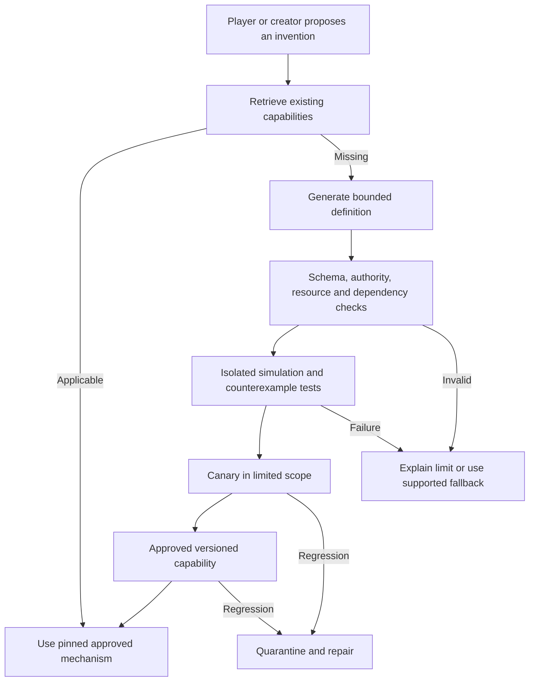

# How the game can learn new capabilities during play

Status: **proposed architecture and rollout**, not implemented. Requirements: F13–F16, F18–F20, F30.

V04 accepts ownership of the generative-rule interface independently of the selected PlayCanvas client (F40–F41). Exact generation tiers, promotion policies and the eventual G2 runtime remain open.

M02/M03 accept documenting evolvable material properties and modular construction. [Evolving materials and construction](evolving-materials-and-construction.md) specifies that direction and proposes script-reference/semantic extension contracts; [heat and fire](heat-and-fire.md) demonstrates a process richer than one combustibility attribute. Script pointers remain a tentative extension direction, not approval to run arbitrary code in the live world.

## Direct answer

Yes: an in-game request can initiate the creation, testing, registration, and use of a new reusable mechanic. The achievable early version is generated **data and compositions of trusted effects**. Allowing newly generated general-purpose code to change a public world's engine live is a much harder tier, with isolation, consistency, economic, and operational costs.

The game should accumulate a versioned capability library rather than casually rewriting its own application source on every request. A development assistant can later propose core-code changes through ordinary review and release workflows. Runtime content growth and source-code evolution are separate paths, both accessible from creator tools.

There is research precedent for reusable generated skills: Voyager stores executable skills and improves them with environmental feedback while operating inside Minecraft. That demonstrates growing agent behavior within an existing world; it does not demonstrate safe creation of arbitrary multiplayer game laws or an automatically balanced economy. [Voyager project and code](https://github.com/minedojo/voyager)

## Four levels of generation

| Level | Output | Example | Proposed timing |
|---|---|---|---|
| G0: expressive content | Dialogue, descriptions, plans using known actions | NPC proposes sharing a meal | First playable wilderness group |
| G1: bounded definitions | Recipes, archetype parameters, status definitions, effect compositions | A wood-and-fiber trap built from known trigger/capture primitives | Early creative prototype |
| G2: sandboxed algorithms | Restricted executable procedures with declared capabilities | A new bounded diffusion or crafting-quality algorithm | After validation and failure tooling |
| G3: engine extensions | New trusted primitives, renderer adapters, schema migrations | Fluid networks or persistent institutions with new invariants | Explicit engineering release |

G1 is already meaningful generativity. Designers need not hand-author every recipe; they define enough primitives and tests for the system to combine them safely. The initial [survival package](survival-baseline.md) supplies dependable basic actions before this generation layer; a novel shelter below is a variant, not the only way to survive exposure. G2 should earn its place when a real desired mechanic cannot be expressed in G1. G3 cannot be made harmless just by calling it a plug-in.

## Engine flexibility and generated execution

Generated recipes, goals, behavior graphs and effect definitions are data consumed by our rule interpreter. That path can work with PlayCanvas, Unity or another renderer. An agent inventing smoke-drying can propose a composition of supported heat, smoke, fuel, labor, food-conversion and spoilage rules; the client depicts approved outcomes with existing assets. If a required physical or biological rule does not exist, the generator must identify that missing dependency rather than imply it has been implemented.

Generating new executable algorithms during play is a distinct G2 requirement. JavaScript/TypeScript integration makes a browser-based stack convenient, but does not authorize evaluating arbitrary scripts in the client or authoritative process. Those algorithms still receive scoped inputs, produce bounded effect proposals and pass through the isolation/promotion path below. New trusted primitives and schema changes remain G3 engineering releases.

Unity is not mechanically restrictive: its standard C# web compilation workflow has dynamic-code-generation limits, not a prohibition on custom rules or generative content. An interpreter, JavaScript bridge or external execution service can support runtime logic when needed. This is an execution/runtime tradeoff, not a reason to build our own graphics engine. [Unity scripting backends](https://docs.unity.com/en-us/engine/6000.0/manual/scripting/compilation-and-code-reload/script-compilation/backends), [Unity 6.0 web limitations](https://docs.unity3d.com/6000.0/Documentation/Manual/webgl-technical-overview.html)

Generated capabilities must target stable simulation queries and effects, never PlayCanvas nodes, shader internals, frame callbacks or browser permissions. Keep source-code authoring during development, runtime definitions and runtime executable code distinct in APIs and project status.

## Lifecycle and state machine

Track draft, validating, rejected, canary, approved, deprecated, and quarantined states. A candidate definition and a deployed definition are different records. Store provenance (request and relevant context), authoring model/prompt version, parent mechanisms, input/output schemas, dependency versions, tests, evaluation results, ownership/visibility, resource envelope, asset bindings, and rollout scope.

Permit automatic admission only inside a small proven envelope: approved operations, strict magnitude limits, no new authority, limited affected entities, no irreversible economy-wide outcome, complete tests, and observable rollback/compensation behavior. Initially, the creator's private sector can accept more experiments than the public world. The exact automatic-versus-reviewed boundary is D06, not a blanket promise that every invention needs manual approval forever.

## Concrete invention session

A player asks, “Can I make a little rain shelter from these branches?” The resolver finds no exact recipe but finds construction, fiber binding, supported parts, and coverage rules. It proposes branch/fiber consumption, labor stages, a small assembly of supports and roofing, and its material/connection specifications. Coverage, rain transmission, and condition derive from the placed parts. “A little house” can retrieve this same construction family while exposing unmet requirements such as full enclosure or enough sleeping space. The completed structure remains editable and can acquire household meaning without a discrete upgrade.

The candidate is run against missing materials, concurrent inventory use, interruption, moving the target site, overlap with protected areas, save/reload, demolition, and repair cases. If valid within the G1 envelope, it becomes a local canary recipe. The player sees a short construction action and a functional shelter. The registry stores the recipe; the player learns it; nearby NPCs only learn it if they observe or are taught. Repeated successful uses provide evidence for broader promotion.

If the generator invents an unsupported force field or a resource exploit, the candidate fails validation. The player receives a useful outcome such as “You can bind a small lean-to with this material; a sealed roof needs something waterproof.” The wording should describe the world constraint, not expose internal compiler terminology.

## Testing a mechanic is more than testing generated code

Validation includes schema correctness, resource accounting, authority constraints, transition legality, finite execution, effect magnitudes, idempotency, serialization, determinism where required, and interactions with existing statuses. Evaluate both normal and adversarial cases. Test semantic distinctions, not merely whether JSON parses.

Use paired examples differing in one relevant factor; property checks such as “total transferred quantity is conserved”; metamorphic checks such as “doubling available fuel does not reduce the maximum burn duration under otherwise identical conditions”; and simulation rollouts looking for exploit loops. A generator should not be the sole judge of its own output. Independent validators and deterministic invariants matter more than confident self-critique.

Generated tests help explore cases but cannot establish complete correctness. Keep some held-out scenarios inaccessible to the generator, include creator-authored examples, and assess interactions across active mechanisms. Start with a tiny library to make this tractable.

## Runtime isolation for G2

Reserve optional typed script references in the declarative contract even before a G2 runtime is implemented. A reference pins a registered module, version/content digest, entry point, inputs, queries, effect outputs, limits, and recovery policy. This allows custom algorithms without forcing everything into formulas. Admitting the pointer does not confer extra authority; mutable arbitrary URLs and undeclared host access are not execution contracts. See the [script and semantic extension proposal](evolving-materials-and-construction.md).

Do not run untrusted generated JavaScript in the live sector process. Node's own documentation states that its `vm` module is not a security mechanism. Worker threads alone also do not create the desired authority boundary. [Node.js VM documentation](https://nodejs.org/api/vm.html)

A later execution service can use a restricted WebAssembly runtime or another audited isolation mechanism with no network, no general filesystem, no secrets, no dynamic package installation, read-only input snapshots, and a narrow effect-output ABI. Bound memory, instruction/fuel usage, wall time, output size, recursion, entity queries, scheduled jobs, and result fan-out. Validate outputs in the authority even if the sandbox completes successfully.

Wasmtime documents fuel-based and epoch-based interruption; fuel can support deterministic interruption, while resource limiters remain relevant to memory bounds. These tools are ingredients in isolation, not proof that arbitrary game logic is safe or balanced. [Wasmtime interruption](https://docs.wasmtime.dev/examples-interrupting-wasm.html), [Wasmtime configuration and limits](https://docs.wasmtime.dev/api/wasmtime/struct.Config.html)

Execution should be pure with respect to authoritative state: provide declared inputs and RNG seed, obtain an effect proposal, validate, then commit once. A trap cannot leave half a resource transfer applied. Host imports must obey limits too; fuel inside the guest does not automatically bound an expensive host query.

## Error handling without runaway repair loops

On invalid output, reject the candidate. On runtime failure, quarantine that version and preserve the current world's valid state. Try an already-approved fallback or return a clear unsupported/failed action. An optional model diagnosis runs asynchronously with a strict retry/cost limit; it creates a new candidate version and re-enters validation.

Do not silently bypass validation because an LLM is the fallback. Do not retry generation indefinitely. Do not guarantee an immediate new mechanic on a live player's timeline. Use a maximum attempt budget, a cooldown, a deduplication key, and a backlog entry for recurring unsupported requests.

For an ongoing fire or disease using a quarantined version, select a declared safe migration/termination policy. For example, stop future propagation while preserving already-committed damage and completing bounded cleanup. This behavior must be specified by the mechanism family; a generic “roll back everything” button is insufficient.

## Versioning a persistent world

Never replace an approved definition in place. An active process pins its version until completion or an explicit migration. Store retired definitions needed for replay. Capability updates can change new uses without changing a bridge built yesterday; if a data migration is necessary, preview its impact and make it a recorded operation.

Maintain dependency graphs: if `burn.v2` depends on `material.v3`, either validate that pairing or refuse activation. Avoid dynamic “latest” resolution during long-running actions. A globally available mechanic and a locally discovered recipe are different registries. World rules can differ between experimental and public sectors, with explicit border rules for incompatible items.

Definitions should converge into canonical families. Otherwise players can produce millions of spelling variants and make retrieval unreliable. Store variants as parameters and metadata where possible. Track usage, failure rate, marginal novelty, dependency count, and maintenance cost; deprecate redundant definitions without erasing historical records.

## Creator mode and “add a dragon”

Creator mode starts a structured proposal: species/archetype, size/navigation footprint, needs, temperament, perception, abilities, spawning location, habitat/resource demand, combat bounds, voice/presentation, population limit, and removal policy. “Dragon” is not enough to infer every rule reliably.

For a first version, a dragon can reuse a large creature body, flying-as-path-mode, a bounded breath cone, a flame overlay, and existing fear/hazard observations. True aerodynamic flight or deformable wings is unnecessary. Preview in an isolated sector, inspect resource and ecological impact, then activate with a recorded creator command.

Ordinary actors cannot acquire creator privileges by asking convincingly. A fictional phone message, ancient scroll, or player conversation cannot modify the capability approval policy. Creator authorization is an application permission separate from in-world status, wealth, or institutions.

## Engineering AI as a development tool

Code assistants can help author primitives, generate counterexample fixtures, build asset manifests, analyze playtest traces, and propose fixes. A runtime failure report can create a development work item containing a minimal replay. The engineering agent can propose a patch and validation evidence. Deploying a new trusted kernel remains a normal versioned release with compatibility checks.

This yields a practical loop: players discover missing affordances → the world records demand → bounded inventions arrive quickly → repeated demand informs deeper engine work. The result can feel like the game is growing from within without making every public session a live experiment in unrestricted source-code execution.
