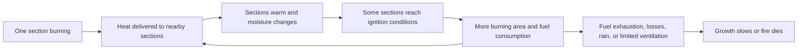

# Heat, ignition, and growing fire in a modular world

Recorded September 19, 2026. **Design proposal, not implemented or physically calibrated.** The user requested a representation of match-versus-twig/wall ignition and fire growing across neighboring building parts. Architecture and formulas below are original game-design sketches, using abstract game units rather than real ignition thresholds. See [evolving materials and construction](evolving-materials-and-construction.md), [interaction protocol](interaction-protocol.md), and [simulation time](time-and-simulation-speed.md).

## Implementation scope after the complexity discussion

M04/M05 accept starting with a coarse, consistent model and refining it for demonstrated gameplay value. The [scope proposal](simulation-scope-and-complexity.md) describes a small initial ignition/spread representation using material/section categories, moisture, source strength/duration, ignition progress with cooling, fuel, and local spread. The more detailed thermal accounting and node representation below are design options and failure-case guidance, not a requirement to implement them all first. Choose one authoritative representation at a time. A [world profile](world-rules-and-parameters.md) determines whether the proposed cause is allowed before any missing fire mechanic is generated; a realistic world does not admit magical ignition merely because its physical-fire implementation is incomplete.

## The distinction the model needs

Combustibility does not answer whether a particular source ignites a particular target. The useful game distinction is between a material's ability to provide fuel, the target surface's current readiness to ignite, and the source's ability to deliver heat over time. A small flame is not automatically a low-temperature flame; temperature alone is therefore insufficient as the source descriptor.

This qualitative distinction is informed by NIST's separation of temperature, heat release, heat transfer, and fire development, and by the Wood Handbook's discussion of surface heating and material-dependent ignition. These sources motivate the variables, not the proposed algorithms or game outcomes. No real construction/fire-safety prediction is promised. [NIST Fire Dynamics](https://www.nist.gov/el/fire-research-division-73300/firegov-fire-service/fire-dynamics), [US Forest Service Wood Handbook, chapter 18](https://research.fs.usda.gov/download/treesearch/62268.pdf).

For the user's intended scenario, tune the selected dry twig to ignite during the small source's lifetime and the selected substantial wooden wall section to remain unignited under that same brief exposure. This is a paired game fixture, not a universal assertion that every twig catches or a match can never ignite any wooden construction. Gaps, thin fibers, coatings, moisture, and existing damage can define different supported targets.

## State at the right scale

Use one thermal node for a small object, and a bounded set of exposed sections for a larger part. One burning log/section need not mark the entire wall as fully burning. A wall need not be heated uniformly through its whole mass before its surface can ignite.

| Record | Suggested content | Purpose |
|---|---|---|
| Material profile | Combustible fuel fraction, thermal response, ignition/sustain profile, moisture behavior, heat yield per fuel unit | Shared definition, not current state |
| Exposed section | Surface/contact area, effective heated layer, geometry, material/connection references | Distinguishes a thin target from a substantial section without a full solid-body solver |
| Dynamic section state | Stored thermal energy or derived temperature, moisture amount, remaining fuel, burning area, phase, integrity | Accumulates exposure, cooling, consumption, and damage |
| Heat source | Available thermal power, remaining lifetime/fuel, contact geometry, supported exposure mode | Separates a brief match-like source from an established burning section |
| Environment | Local conditions, rain/exposure, approximate ventilation, supported wind effects | Shared inputs that can change during an active process |
| Exposure edges | Nearby target sections, occlusion, contact/distance, directional coupling | Local propagation across actual geometry |

Choose one authoritative thermal quantity, such as stored energy, and derive temperature using the selected response model. Do not update temperature and energy independently. Similarly, fuel in a wall summary and its sections is one stock, not two consumable copies. Material/moisture units must be registered and compatible; normalized wetness displays can be derived from stored moisture.

## Accumulated heating and ignition

An ignition attempt applies a bounded source exposure. It does not directly toggle `burning = true`. The source can be consumed even when the target does not catch; a failed ignition still has a truthful outcome and may leave residual warmth or an admitted scorch effect.

One possible per-section game accounting scheme is:

```text
available_heat = absorbed_neighbor_heat + retained_self_heat
heat_for_evaporation = bounded_allocation(available_heat, moisture)
energy_delta = available_heat - heat_for_evaporation - outward_heat - cooling
stored_energy_next = bounded_update(stored_energy, energy_delta)
surface_state = thermal_response(stored_energy_next, effective_heated_layer)
```

All heat terms above are energy over the same elapsed simulation interval. An evaporation rule reduces moisture consistently with its allocated energy. Rain adds moisture through the exposure system. Heat dispersed into the rest of the part can be an explicit sink in an early model; a later model can transfer it to interior nodes. Declare approximations so changing resolution does not accidentally create extra heat.

Here `outward_heat` means a transfer from already stored thermal energy. Newly released combustion heat allocated directly to neighbors is not subtracted from the stored-energy account again. Bound transfers by available energy and account explicitly for any modeled overflow/loss instead of silently clipping it away.

Ignition eligibility combines supported material, remaining fuel, local surface state, moisture, pilot/source requirements for the chosen ignition mode, and ventilation availability. A readiness variable can represent unresolved surface processes if it has a defined physical-game meaning and cools/resets consistently; it must not duplicate heat accumulation as an unexplained second bonus.

The twig fixture reaches its admitted ignition condition during brief exposure. The wall-section fixture does not: the modeled target response and losses prevent that exposure from being enough. A source with higher delivered power or longer sustained exposure can produce a different result under the same rule. Removing a source ends its contribution; warmth and cooling remain stateful. Repeating an action is never an independent chance roll that ignores what happened before.

Use distinct ignition and sustain conditions where useful so a started flame does not flicker on/off at one threshold. Phase transitions can include unlit, heating, burning, cooling, and spent; smoldering is an optional later supported phase, not merely an animation implying an unimplemented heat source.

## Fuel, heat output, and feedback

Once a section burns, a bounded rate rule consumes fuel according to exposed burning area, material profile, moisture, and available ventilation. Integrate only to the next relevant event boundary, such as exhaustion. Burning area grows through admitted local surface/neighbor transitions, up to the section's exposed area. It does not instantly include the entire wall or all its remaining fuel when one patch ignites. A conceptual accounting relationship is:

```text
fuel_consumed = min(remaining_fuel, supported_burn_rate × elapsed_time)
released_heat = fuel_consumed × material_heat_yield
```

Allocate released heat across retained surface heating, transfers to neighbors, and environmental losses. Fractions must obey the declared budget; giving every neighbor the entire source output would multiply energy with neighbor count. If incoming radiation/transfer is represented separately from outgoing release, avoid counting it again as new combustion energy. A simplified model need not simulate every joule, but its declared fuel/heat accounting should still be coherent.

Exposure edges distribute heat to reachable nearby sections. A target can receive contributions from several sources; sum them before evaluating its update. Neighbor selection depends on actual geometry and occlusion, not membership in the same building or household. The fire can cross between assemblies when the admitted spatial rule allows it. A noncombustible panel can block or transmit some heat according to its thermal profile; noncombustible does not mean thermally invisible or an unconditional fire barrier.



The growing area can increase total heat release, which can shorten subsequent ignition delays and create the accelerating spread the user describes. This feedback is conditional. Growth can stop at a gap, wet region, exhausted fuel, or another limiting condition; no global “double fire size every tick” rule is needed. Increasing source count does not automatically increase every flame's temperature. Opening or removing a wall changes exposure and, if modeled, ventilation; reevaluate those links at the time of the change.

Fuel consumption and damage can weaken particular supports. The construction system then evaluates the changed support graph and its declared failure behavior. If a part becomes debris, transfer its remaining material, moisture, and thermal state without duplicating fuel. Fire rendering follows burning area/intensity and actual part condition; it does not determine propagation.

## Where semantics and scripts fit

The semantic layer resolves a freeform request into the actual target section, source, contact/action sequence, and supported properties. “Light the wall” may select a section; ambiguity about a consequential target should be resolved before committing. The same model can recognize that a described action uses an existing family even if the wording is new.

If a material/interaction is missing, semantic reasoning can propose a shared definition or a custom thermal algorithm through the [extension path](evolving-materials-and-construction.md). A bounded semantic adjudicator can resolve an admitted residual choice, but established heat/fuel rules remain authoritative. Nuance should become relevant state or a recorded bounded interpretation, not an unexplained override of the simulation.

The declarative definition selects components, rate profiles, neighbor-query contracts, exposure/damage effects, and lifecycle policy. A pinned script can implement a more involved local heat exchange calculation using that same contract. Both implementations return validated effect proposals. No LLM is called for every flame, neighbor, or simulation step. Retain explanation events such as insufficient heating, moisture removed, sustained ignition, and source of damage; show only observer-appropriate evidence to players and NPCs.

## Time, consistency, and execution limits

Use the shared simulation clock for fuel, moisture, heat, and work. Integrate with substeps or event boundaries at ignition, source removal, fuel exhaustion, weather changes, geometry edits, and threshold crossings. At higher creator speed, batch safe work while preserving these transitions. A loaded sector and an equivalent catch-up should agree within a declared tolerance.

Compute local exchanges from a common snapshot, aggregate contributions, and commit compatible deltas together. Otherwise node iteration order can decide which house catches first. Pin rule/material versions, record causal sources and seeded randomness where used, and persist active thermal state. Caches must include relevant geometry/material/moisture/source dependencies, not simply the phrase “wooden wall.”

Maintain active regions and bounded neighbor queries. Inactive cold regions need no high-frequency thermal loop. Small distant fires may be aggregated only by a defined model that preserves meaningful fuel/heat totals and threshold events. Per-job bounds alone cannot prevent unlimited descendant scheduling; enforce regional/world work budgets across propagation and overlapping sources.

Do not quietly discard elapsed time, fuel use, or pending ignition when an execution budget is reached. Carry simulation debt, reduce permitted acceleration, or visibly pause the affected authoritative simulation under a declared policy. A gameplay limit on affected area is a separate explicit world rule. The simulation must not become secretly less combustible just because the server is busy. Cross-sector thermal propagation needs authority/transfer support before it is enabled at a boundary.

## Proposed implementation sequence and acceptance scenarios

Keep the previous no-spread campfire stage as a limited first survival milestone. The desired extensible world includes spread; the temporary milestone does not define the final fire model. Add source-versus-target heating and moisture, then local section-to-section propagation, then geometry/support coupling. Detailed airflow, smoke chemistry, airborne embers, and full structural fire analysis are not prerequisites for the user's example.

Before enabling spread, test the paired dry twig/substantial wall fixture; wet versus dry targets; source exhaustion/removal; several sources contributing to one target; a locally burning section versus the whole wall; a gap or occluding panel; mixed stone/wood construction; fuel exhaustion; construction/demolition during a fire; save/restore; version migration; no-model availability; varying integration steps/creator speeds; and regional work-budget exhaustion. Check no duplicated fuel, no unlimited heat fan-out, stable ordering, coherent local damage, and explanations based on committed outcomes. These are proposed experiments, not completed tests.
