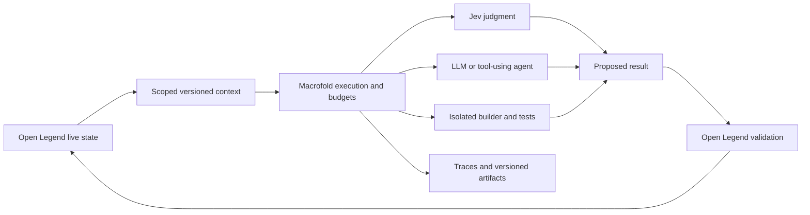

# Macrofold for AI workflows and world context

Status: **proposed architecture**, September 19, 2026, responding to [U10](../00-source/design-followups.md#u10--environment-state-and-general-ai-workflows-in-macrofold). The user owns both products and explicitly wants to consider reusable Macrofold improvements. This is design authorization, not authorization to implement either product. Extends the [shared-worker proposal](macrofold-shared-workers.md); current repository behavior remains documented in the [comparison](../02-research/macrofold-workspaces.md).

## Recommended direction

Treat Open Legend as an application that could use Macrofold for its general AI execution and workflow infrastructure. This includes brief typed judgments, multi-step reasoning, background consolidation and isolated generation/testing. Keep game-specific state transitions, perception, memory semantics and simulation time defined by Open Legend. Owning both products makes investing in a reusable platform more attractive than assuming Open Legend must maintain a second general agent framework.

This distinction concerns responsibility, not server placement. Macrofold may supply storage and compute, and even manage a service running the simulation if an appropriate service lifecycle is added. Open Legend remains the logical authority deciding which game changes are valid. No requirement follows that they must use separate database clusters, hosts or network services.

## What an environment workspace should contain

| Data | Recommended treatment | Why |
|---|---|---|
| World lore, species/material definitions, configuration, approved rule packages, prompts, evaluation cases | Persistent workspace files and versioned artifacts | Inspectable, editable, exportable inputs that change relatively infrequently |
| World/sector snapshots, generated proposals, experiment histories, simulation reports | Immutable versioned artifacts with bounded retention | Useful for reasoning, debugging and controlled branch experiments |
| Live positions, inventory ownership, needs, ongoing actions and resource quantities | Structured state under the simulation's transactional authority, exposed through scoped resource APIs | Many concurrent events require validation and atomic changes rather than agent edits to files |
| NPC memories and beliefs | Structured per-actor records with game-defined recall policy | Rich queries and provenance, while actors remain limited to what they know |

Macrofold's existing workspace API persists files and Git history with one writer per workspace. Reads show the published revision; it does not promise a continuously current, application-consistent view of an active simulation. Revision-conditional file edits are useful, but are not equivalent to a transaction moving inventory between two actors while recording an event. [Workspace implementation](../../../AgentCloud/docs/features/workspaces/implementation.md), [file reads](../../../AgentCloud/docs/features/workspaces/read-files.md).

It is reasonable to evolve a workspace into a resource namespace: files plus references to structured collections, read APIs, snapshots, approved tools and associated jobs. That is a proposed Macrofold feature, not a description of today's workspace. Start by connecting existing application-owned data through narrow tools. If Macrofold later hosts the structured records, preserve schema ownership, atomicity and the same authorized commit boundary. Do not maintain two independent writable copies of world truth.

A world or sector workspace need not contain an editable file for every entity, and an NPC must not inherit read access to the whole world workspace. Shared storage does not imply shared knowledge. Storage-backed context can be loaded on demand; it need not all be copied into each worker or sent to a model.

## Running Jev over environment state

Jev's current API accepts a supplied text/JSON state and questions, returning typed judgments. It does not directly monitor a Macrofold workspace, update a world, or automatically learn persistent game rules from earlier calls. Macrofold would assemble the relevant context and invoke its API through an adapter. [TypeSafe quickstart](https://docs.typesafe.ai/introduction/quickstart), [model reference](https://docs.typesafe.ai/models). These interfaces were rechecked September 19; no API experiment was run.

For a freeform request such as “get that branch burning”:

1. Open Legend resolves the target and constructs a compact snapshot of relevant material/state, available ignition source, eligible mechanisms and required rule versions. The NPC-planning view includes only perceived facts; a separate trusted resolver may access authoritative facts needed to apply a rule.
2. Macrofold executes a versioned judgment definition. Jev might choose a supported ignition mechanism, request clarification, or return unsupported/unknown. Already explicit known actions can bypass semantic inference.
3. The result is a proposed interpretation linked to its input snapshot, model/question version, deadline and relevant entity revisions. Jev selects among defined alternatives; novel dialogue, recipes and executable code use a generative model or harness instead.
4. Open Legend rechecks relevant dependencies when acting. If the branch became wet, the ignition item was consumed or the actor moved out of reach, it rejects or recomputes the stale proposal. An unrelated entity moving elsewhere need not invalidate it.
5. The simulation commits valid effects atomically, records an event, and continues fire/fuel/health progression through approved mechanics. Jev is not called on every fire or movement tick.

The vendor explicitly documents arithmetic and context-sensitivity limitations. Model confidence and correct output shape do not establish physical truth or authorize a state mutation. Keep arithmetic and game invariants in code. [Jev limitations](https://docs.typesafe.ai/model-jaggedness/jev-1.13).

Package each inference input as one immutable context or read all its resources at a consistent version; several unrelated latest-file reads can mix different world revisions. Use idempotent command receipts so a worker crash after a successful action cannot spend the same item twice on retry. A clean Git merge between speculative world branches is not proof that their resource changes are jointly valid.

The nodes represent responsibilities; this does not require deploying a separate service for each box.

## AI workflows to modularize

| Workflow | Execution mode Macrofold could provide | Rules Open Legend supplies |
|---|---|---|
| Intent mapping, bounded applicability judgment, novelty detection | Brief typed inference such as Jev, with an explicit unknown route | Candidate set, relevant context, acceptance and fallback policy |
| NPC dialogue and planning | Shared-worker LLM calls or bounded tool-using loop | Perception, personality, memory access, permitted actions and response deadlines |
| Memory reflection/consolidation | Background job with versioned inputs and proposed record changes | Salience, commitments, attribution, forgetting and conflict policy |
| New mechanics or recipes | Generative reasoning followed by isolated code/tests where needed | Primitive vocabulary, invariants, compatibility, admission and promotion criteria |
| Optional world events or narrative direction | Budgeted scheduled/event-triggered planner | Which events are allowed and who may approve or activate them |
| Later asset production and evaluations | Existing provider tools or isolated artifact jobs, with common traces | Style/asset contracts and game-specific expected behavior |

These are workload categories, not a commitment to deliver every feature in the initial game. Platform infrastructure runs versioned task definitions; the definitions, prompts and criteria can belong to the Open Legend project without becoming hard-coded Macrofold core concepts. A hunger rule and a customer-support urgency rule can use the same execution infrastructure while remaining separate application policies.

## Existing foundations and necessary additions

Macrofold already supplies durable jobs, run identity, scoped model/tool access, budgets, file persistence and run diagnostics. Its model gateway can process non-streaming responses, but it still expects an admitted run and native-harness-oriented configuration. Do not mistake HTTP support for an already implemented Jev adapter or a cheap standalone typed-inference endpoint. [Gateway](../../../AgentCloud/packages/core/src/model-gateway.ts), [current runtime](../../../AgentCloud/docs/features/execution/runtime.md).

The reusable additions worth considering are:

1. **A lightweight typed-inference operation.** Accept a versioned decision specification and bounded context; enforce provider-specific request/output schemas, budgets, deadlines and attribution without booting a sandbox or launching a coding harness. Jev is one adapter, not the definition of this API. Typed schema validation is separate from game correctness.
2. **Shared reasoning workers.** Retain short per-job identities and limits while reusing capacity, as in the [worker proposal](macrofold-shared-workers.md). Avoid compulsory Git/file checkpoint work for a task that only reads structured context and returns a result.
3. **Versioned resource access.** Let a workspace refer to immutable snapshots and authorized queries over external or platform-hosted records. Make permissions, provenance, versions and write ownership explicit. A game supplies its own projection and commit handlers.
4. **Small composable workflows.** Reuse existing queue/lifecycle primitives for sequences such as classify → deliberate if necessary → validate → publish a proposal. Record results, costs and versions; add safe retries and cancellation. A generic visual workflow builder or new distributed database is not a prerequisite.

Current scheduling and automation facilities should not be assumed to be a low-latency simulation event bus. The game filters and coalesces events before submitting work. A brief judgment should not inherit deliberate multi-second phase pauses or a full filesystem lifecycle. Preserve authorization and spending bounds while measuring per-call database/queue/gateway overhead. [Scheduling](../../../AgentCloud/docs/features/execution/scheduling.md), [startup findings](../02-research/macrofold-workspaces.md#vercel-and-slow-startup).

A generic cache may live in Macrofold, but the application defines which inputs and versions make a result reusable. Include tenant/world scope, actor visibility where relevant, actual input fingerprint, model, rubric and policy versions. Semantic similarity alone does not make a previous decision valid. Record nondeterministic results so replay uses what actually happened; requerying the same model is not deterministic replay. Returning a cached result still requires current authorization and live action validation.

## Keep the first integration small

Start with one bounded environmental judgment on an immutable context and one NPC reasoning job using a memory query tool. Trace each from input through cost and result to the game commit. Exercise a stale input, duplicate delivery, provider failure, cancellation and a forbidden context read. Reuse that path for reflection or mechanic generation after it works.

Measure direct-provider latency versus Macrofold total latency, inference tokens, management/storage work and actual infrastructure costs at matched workloads. The platform should not impose a fixed heavyweight job cost on every tiny judgment. Shared workers and context reuse do not automatically reduce provider token charges. Keep native simulation alive when AI is unavailable, and keep the ordinary player UI focused on in-world actions rather than platform jobs.

Prefer adding these bounded, reusable capabilities to Macrofold over building a second general AI operations layer in Open Legend. Keep application-specific rules, authorized state transitions and context selection in the game. Broad state hosting can follow if it proves useful; it does not need to be completed before the first two AI workflows. Adoption, API contracts and physical storage remain open in D28/D30 and R19/R20.
