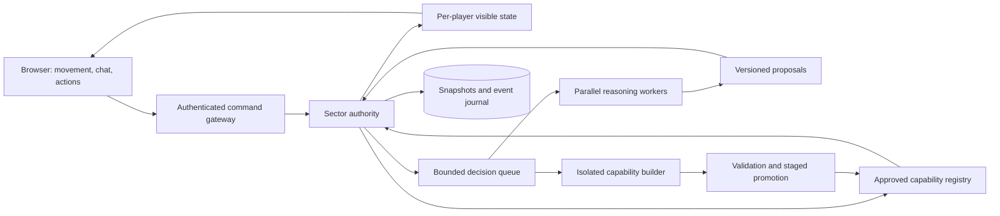

# System architecture — concurrent minds, authoritative world

Status: **accepted architectural direction with proposed implementation details**. PlayCanvas presentation plus an independent custom simulation/generative-rule interface were accepted in V04; other stack candidates remain proposals. No implementation. Research checked September 18–19, 2026. Requirements: F01, F08–F10, F20–F23, F26, F30–F31, F40–F41.

## Recommended shape

The September 19 [technical architecture set](../07-technical-architecture/README.md) now specifies module, persistence, context, declaration and execution contracts in greater detail. This document retains the initial high-level design and engine reasoning; the new set is the current implementation proposal and includes the standalone Macrofold handoff.

Use PlayCanvas for browser presentation and own the simulation independently. The proposed initial integration is TypeScript with the standalone engine; a hosted editor is optional and remains a separate workflow decision. Start with a modular application, one authoritative sector, proposed PostgreSQL persistence, and an asynchronous reasoning worker. Keep the simulation independent of the rendering engine and model provider. Use separate modules before separate services; split processes where independent latency or isolation requires it.

Each NPC has a logical persistent mind with the [canonical memory architecture](../../docs/memory-architecture.md): actor-aware experience, bounded recall, editable inner-world files and one accepted PostgreSQL text snapshot. Full harness execution is required for background reflection, not each immediate thought. The prototype Macrofold adapter exists; file publication and production schema remain CR tasks. The [repository comparison and cost scenarios](../02-research/macrofold-workspaces.md) retain research evidence, not current implementation status.

The reasoning workers may themselves be managed by Macrofold. If it provides efficient shared-worker execution, the [conditional recommendation](macrofold-shared-workers.md) favors reusing its job, budget, model/tool and diagnostic infrastructure for ordinary NPC reasoning too. The game retains world authority and memory semantics; the current sandbox-per-run design is not assumed to be a completed pooled executor.

The proposed integration can extend to other [AI workflows and versioned world context](macrofold-ai-workflows-and-world-state.md): brief Jev judgments, memory consolidation, capability generation and evaluations can share Macrofold infrastructure. Macrofold could also host structured state, while Open Legend defines schemas, perception and authorized atomic changes. Current workspace files/checkpoints suit snapshots and artifacts; they are not assumed to be a live transactional world store. D30 tracks that storage boundary. These responsibilities may share a deployment.

The world changes through validated commands. LLMs, Jev, player clients, and generated capabilities propose commands; none directly edits live state. This is the boundary that makes concurrency, correction, and future renderer changes tractable.

The diagram describes responsibilities. For the first prototype, the gateway and sector may share one process, queues may be database-backed, and the registry may be versioned files plus database metadata. An isolated builder is needed only when actual generated code is introduced.

## Domain model and module boundaries

### Own the simulation; reuse engine infrastructure

Choosing a general-purpose engine does not choose the game's hunger, crafting, inventions, relationships or agent behavior. Reuse PlayCanvas for rendering, lighting, animation, input, audio and asset handling. Our kernel owns object identity, resources, action rules, the simulation clock, persistence and generative extensions. Optional engine physics must not silently become a second authority for gameplay outcomes.

RimWorld is a concrete precedent: Ludeon documents using Unity while implementing its own object and time-handling systems. A custom simulation is compatible with an existing engine; writing a new graphics engine is not a prerequisite for expressive mechanics. [Ludeon technical FAQ](https://ludeon.com/blog/faq/)

Keep the simulation runnable **headlessly**, without a browser, GPU, scene or animation loop. It must be possible to advance a scripted world, checkpoint it and replay recorded outcomes with rendering disabled. This enables pacing experiments and accelerated runs, and preserves the option of server operation. It does not decide the still-open unattended-world/offline policy or guarantee unlimited fast-forward speed.

World snapshots, commands, events and capability definitions use plain versioned data. A presentation adapter maps permitted state to PlayCanvas entities and cues. It translates user input into intents and never lets generated rules hold live scene handles. Do not advance hunger or work from animation callbacks or frame count. The renderer can interpolate movement while simulation time advances at its independently controlled rate.

Build one adapter and the smallest necessary interfaces. Engine replacement would still require new materials, shaders, input, animation and asset integration; a clean boundary reduces that work without eliminating it. The selected engine must prove the [visual direction](visual-direction.md), rather than dictate its style.

### Responsibility map

| Module | Owns | Does not own | Replaceable through |
|---|---|---|---|
| Simulation kernel | Tick/time, IDs, components, events, deterministic RNG streams, invariants | Art, provider calls, natural-language truth | Command/event/state schemas |
| Sector authority | Entity ownership, command ordering, navigation, scheduling, reservations | Remote model execution | Sector transport and persistence interface |
| Perception | Visibility, audibility, known identities, observations | Objective world mutations | Query and observation contracts |
| Agent cognition | Goals, plans, memories, attention, model routing | Authoritative damage or item spawning | Read-only observations and proposed intents |
| Interaction resolver | Candidate mechanism selection, applicability, effect proposals | Unchecked state writes | Interaction protocol |
| Capability registry | Versions, dependency declarations, rollout status, provenance | Unrestricted runtime code loading | Registry lookup and promotion contracts |
| Presentation | PlayCanvas scene adapter, animation, particles, camera, UI, audio playback | World clock, collision authority or private NPC state | Visible state, stable asset IDs and presentation cues |
| Persistence | Snapshots, durable outcomes, identity, inventories, memory retention | Every animation frame | Transactional commit/checkpoint API |
| Creator operations | Spawn/scenario proposals, review, repair, diagnostics | Player permissions | Separate authenticated command scope |

An entity is a stable ID with optional typed components, not a deep class tree. A tree can have transform, material, moisture, fuel, structural integrity, growth, ownership, and visual-state components. A person has the same transform/material interfaces where meaningful, plus anatomy, needs, perception, identity, relationships, and cognition. A dragon adds locomotion and ability definitions without becoming a new top-level engine concept.

Use a small extensible component store first; adopting an optimized ECS library is optional and benchmark-driven. “Everything is a float” is too weak: attributes need units, bounds, authority, visibility, provenance, and allowed operations. Inventories, family relationships, obligations, and body graphs are structured data, not meters.

## One world clock, separate operational cadences

Illustrative tuning targets, to measure rather than promise:

| Activity | Starting cadence | Rationale |
|---|---|---|
| Client rendering | Device-dependent, target 60 frames/s on reference laptop | Smooth presentation independent of cognition |
| Movement/collision authority | 10–20 updates/real second | Non-twitch walking does not require expensive continuous physics; accelerated travel needs separate readability tests |
| State patches | 5–10/real second, plus urgent events | Interpolate within bounded gaps; do not conceal catch-up as continuous observation |
| Needs/environment | Scheduled simulated boundaries, with bounded substeps where interactions require them | Integrate elapsed rates and threshold crossings instead of calling every component every frame |
| Goal reconsideration | Threshold/event plus capped timer | Avoid perpetual replanning |
| Conversation reasoning | On addressed turns, deadlines, relevant interruptions | Interactive latency budget |
| Memory consolidation | Every game hour for raw experience older than six game hours | Separate small-model budget, atomic summaries and bounded dispatch; retained experience does not gate native simulation |
| Inner-world reflection | Safe downtime, significant events or dreams after two continuous sleeping hours | Background level-5 file work; configured energy-based sleep; never block speech or simulation |
| Asset/mechanic generation | Background job | Never stop the world while building |

Accelerated world time and creator/god speed control are the user's direction. The accepted base rate is **one simulated minute per real second (60:1)**, with 0.5×, 1×, 3× and 8× presets applied coherently to work, needs, environment and ordinary aging. Time settings persist a Pause game when hidden checkbox: on by default for hidden/unfocused tabs, with connected background progression when off; manual pause overrides both and downtime is never replayed. Future rates, lifecycle variants and shared/offline policies remain D03/D16 decisions. Creator rate changes take effect at journaled simulation boundaries. Connected sectors share one authoritative world clock and rate; ordinary players cannot change it. API timeouts, retry backoff, rendering, and human reaction intervals use real-time operational clocks. Scheduled processes record last-integrated timestamps, so save/load does not apply healing or fire twice. See [time and simulation speed](time-and-simulation-speed.md) for pause behavior, generation arithmetic, stale-job handling, catch-up, and visible speed limits under load.

## Parallel thinking without concurrent corruption

Suppose 100 residents need to think:

1. The authority produces immutable observations at world tick T, with per-entity or per-component versions.
2. A scheduler admits a bounded number of model jobs, prioritizing player conversations and immediate danger over background reflection.
3. Workers run concurrently. Each sees only its resident's legitimate observations, retrieved memories, relevant state summaries, and tool budget.
4. A worker returns an intent/proposal with the snapshot version, dependencies, deadline, and idempotency key.
5. The authority rechecks applicability against current state. Independent proposals can all succeed; competing proposals are ordered, rejected, or replanned.
6. The authority commits accepted effects atomically and publishes resulting observations. Other minds learn through perception, not database access.

This is **parallel inference with serialized authoritative commits per sector**. It does not make all world operations globally serial. Different sectors process concurrently against the shared world clock, using explicit synchronization for boundary exchanges; expensive reasoning does not hold a sector lock.

Example: Ada and Bo both remember one apple. They can think concurrently. Picking it up requires ownership/version validation at commit. Ada succeeds first; Bo gets “apple no longer available,” updates the plan, and does not receive a duplicate. Reserve scarce items briefly when an action starts if travel or animation requires a commitment; reservations expire and cannot be held across arbitrary model latency.

Validate the proposal's relevant read set, not an entire global snapshot number. The server derives that set from approved mechanism contracts or instrumented queries; it must not trust a generated declaration to omit inconvenient dependencies. A tree growing elsewhere should not invalidate a greeting. A moved target should invalidate a punch unless fresh range checks still succeed. An incoming hazard can cancel queued low-priority work; a late result for a canceled plan is discarded.

A conversation has a per-conversation turn sequence. Two NPC speech generations may run in parallel across different conversations, but a late answer cannot silently appear before the question it answered. Speech can be interrupted, and actions promised in speech still require separate executable intents.

## Queue, provider, and outage behavior

Set budgets per account, NPC, sector, priority, provider, and rolling time window. Cap outstanding jobs per NPC, coalesce repeated stimulus events, apply cooldowns and randomized scheduling offsets, and deduplicate equivalent work. A forest fire should produce one salient hazard observation and a follow-up when circumstances change, not one expensive thought per burning leaf.

Use admission control before paying for work. When overloaded, defer dreams first, simplify offscreen planning next, and keep deterministic movement, eating, resting, and hazard avoidance available. Bound retries with backoff. Provider timeouts must not create a growing queue that consumes the next hour's budget.

Little's Law is useful for capacity estimates: approximate concurrent requests = admitted requests/second × mean service seconds, assuming a stable system. For example, 8 requests/s at a 2.5-second mean needs about 20 concurrent in-flight calls before tail-latency headroom. This is arithmetic, not a provider capability claim. Account for request/token rate limits and p95 latency separately.

No global await-all barrier is needed. A slow resident continues its safe current activity or idles visibly. The model gateway exposes provider-neutral operations such as `interpretIntent`, `plan`, `respond`, and `consolidate`, with structured outcomes, usage data, timeout, and abstention. These are conceptual interfaces, not promised vendor methods.

## Persistence and replay

Persist identities, inventories, accepted capability versions, durable memories, and meaningful committed effects. Keep a bounded journal of accepted commands/outcomes plus periodic sector snapshots. Do not begin with a distributed event-stream platform or journal every rendered footstep forever.

Choose durability by consequence: trades, ownership changes, births, deaths, and paid quota debits need durable transactional acknowledgment; movement can tolerate a defined checkpoint window. In the smallest version, durably record consequential outcomes before acknowledging success. An outbox associates durable events with publication; consumers deduplicate by event ID.

Replay uses recorded model decisions and exact mechanism versions, not a fresh LLM call that might answer differently. Retain RNG seeds/draw identifiers, simulation version, world timestamp, pause/rate state, clock-change events, pending boundaries, and partially completed work. Cross-platform floating point and physics can still obstruct exact replay: prefer bounded fixed units for authoritative resources/rates and validate outcome replay separately from visual playback.

Database transactions help preserve durable invariants, but application retry and idempotency logic are still required. PostgreSQL's serializable isolation can reject transactions that need retry; it does not remove that responsibility. [PostgreSQL transaction isolation](https://www.postgresql.org/docs/17/transaction-iso.html)

Rollback is limited. Before commit, discard a failed proposal. After a public result, use a compensating repair event or a clearly communicated sector restore with explicit scope. Silently rewinding other players' successful trades to fix one mechanic is unacceptable.

## Sector ownership and migration

Each active entity has exactly one authority, identified by a sector and lease/epoch. For a later crossing: reserve destination capacity; write a durable transfer intent with unique transfer ID; freeze ownership-changing actions at source; persist transferable state; atomically commit durable ownership to the destination under a newer epoch; destination activates once under that epoch; finalize source removal; recover incomplete transfers by checking the durable transfer record. Enforce the durable ownership epoch on consequential commits, so an old source process cannot spend inventory after failover. An in-memory lease alone is insufficient. Never let both sectors spend the same inventory.

Keep initial cross-sector interactions limited to messages and boundary transitions. Seamless projectiles, sound, fire spread, and shared construction across sector borders require explicit protocols and should not be implied by a room library. Queue admission must preserve a player's current safe location and support cancellation/reconnect.

Interest management is both bandwidth control and knowledge control. The client receives only nearby visible entities, audible events, and authorized private data. Do not send all NPC memories and merely hide them in the UI. A phone call is an explicit exception to spatial hearing, not global permission to hear the other participant's surroundings.

Colyseus is a plausible transport/room adapter because its documented model lets the server mutate state while clients request changes. Its room/state abstractions do not decide our perception, persistence, or sector handoff policies. [Colyseus state synchronization](https://docs.colyseus.io/state)

## Parallel world versions and presentation layers

Each world also selects an effective [world profile](world-rules-and-parameters.md): causal premise, allowed domains, gameplay permissions, admitted concessions, simulation detail, generation envelope, and feedback behavior. Capability discovery can extend supported behavior within that profile; ordinary actor requests cannot change it. Bind semantic decisions, caches, candidates, and commits to compatible profile revisions. Keep initial society/knowledge, live state, and operational budgets distinct from the world's physical rules.

Future option discussed with the creator: keep an existing 2.5D world running while launching a fresh world with a different presentation, physics, or capabilities. The new version need not port the old world's content or history. This is an architectural option, not an initial-release deliverable.

A **sector** is an area within a world. A **world version** selects compatible simulation rules, capabilities, state/protocol schemas, and presentation clients. Each running world has its own identity, authoritative state, history, and clock.

Both versions can share the semantic model—people, materials, needs, memories, ownership—and reuse compatible modules, storage infrastructure, and capability definitions. Shared concepts do not imply shared live facts: two physics systems must not independently determine conflicting outcomes for the same entity. Generated mechanics declare their dependencies; a crafting recipe may transfer directly, while a physics-dependent interaction may require adaptation.

Different clients or sectors can also use different visual presentations within one world if they faithfully represent its authoritative geometry and interactions. Different gameplay rules require explicit compatibility boundaries. Cross-version character/item transfers are optional and need conversion rules; they are not assumed.

Keep world state scoped by world ID and pin the selected versions. Preserve engine-independent state, event, action-request, and asset-reference contracts. This bounds a future client replacement, but maintaining older runtimes and clients still costs work. Build one version first; retain these boundaries without building a multi-version platform in advance.

## What to keep simple, and where replacement is expensive

Start with one region, one sector process, one database, a bounded job table, simple grid navigation, and a fixed camera. Separate async reasoning from the tick from the beginning. Keep authoritative state independent of engine nodes, browser objects, provider message formats, and human-readable prose.

Changing rendering engines still means rebuilding input, UI, animation, scene authoring, asset import, lighting, and testing. Upgrading an existing world's simulation schema requires migration of its saved state and capabilities; launching a fresh version can leave the old world on its existing rules and schema. Modules lower migration cost; they do not make either change free.

Do not design distributed consensus, seamless global physics, a general-purpose scripting language, a hundred emotion systems, or Kubernetes operations for the first wilderness group. Preserve interfaces for scale while using measured bottlenecks to choose the next service boundary. See [hosting](../02-research/hosting-and-scale.md), [interaction contracts](interaction-protocol.md), and [roadmap](../05-project/roadmap.md).
