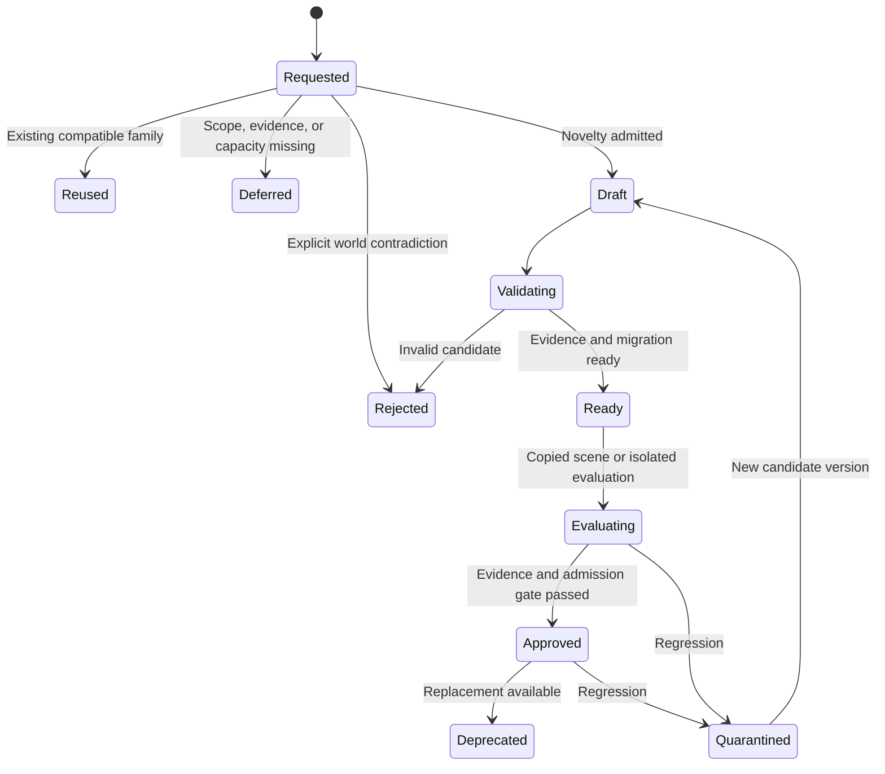

# Declarations, reusable mechanisms, and world evolution

Recorded September 19, 2026. **Technical design proposal; no implementation or finalized format.** M02/M03 accept evolving material properties and editable assemblies; M04/M05 require coarse reusable models and explicit world boundaries. M07/M08 distinguish discovery from changing the world and require responsible state systems with bounded anticipation of future influences. This document translates those directions into proposed contracts. It preserves G0–G3, optional script references, and the unresolved automatic-admission policy. Related foundations: [materials and construction](../03-design-proposals/evolving-materials-and-construction.md), [world profiles](../03-design-proposals/world-rules-and-parameters.md), [interaction protocol](../03-design-proposals/interaction-protocol.md), [capability lifecycle](../03-design-proposals/generative-capability-lifecycle.md), [world creation/discovery](../03-design-proposals/world-creation-and-discovery.md), and [state systems](../03-design-proposals/state-systems-and-future-influences.md).

## What a declaration means

A declaration is a versioned definition the simulation understands: a material profile, component schema, recipe, rule, semantic resolver, or reference to an admitted algorithm. It describes available behavior; it is not permission to execute every conceivable consequence of its prose. Live instances hold changing state. Actors hold beliefs and learned techniques. Keep these distinct even when one platform stores all three.

The practical goal is a small interpreter for registered operations, with extension points. Do not build a universal programming language or attach every possible property to every entity. A new definition earns persistence when it enables a useful choice, corrects a repeated inconsistency, or supports a reusable family. A one-off interpretation may remain an event rather than a permanent mechanic.

| Layer | Example | Authority |
|---|---|---|
| World profile | Ordinary heat needs an admitted physical source | Creator-approved governing revision |
| Definition | Fiber roof material; impact rule; repair recipe | Admitted immutable artifact |
| Instance | Roof section 42 has damage and current wetness | Authoritative simulation |
| Derived value | Rain reaching a sleeping place | Registered calculation and dependency versions |
| Actor knowledge | Ada knows a binding technique | Learning and memory rules |
| Meaning or claim | This beam belonged to Ada's family | Attributed social record or private interpretation |

Calling a roof waterproof does not alter rain transmission. An admitted interpretation may classify a documented coating under an existing material profile; a player's unsupported assertion remains a claim. An heirloom's significance can affect appraisal without strengthening its wood.

## Definition and property contracts

The accepted [hybrid visual direction](../03-design-proposals/procedural-art-and-animation.md#proposed-contracts-caching-and-delivery) adds a separate presentation contract: versioned trusted primitive/rig references, bounded part hierarchies, materials, attachment points, pose/state mappings and density/style parameters. A generated visual description may compose supported shapes or reference approved artwork; it cannot supply executable JavaScript, add physical anatomy, extend reach or alter collision. Mechanical declarations and presentation bindings remain separately validated/versioned. Unsupported visual families use the existing asset fallback/authoring path rather than silently extending the interpreter.

The following fields are illustrative requirements, not implemented syntax. An immutable artifact needs identity/version and digest, kind, typed parameters, compatible schema/runtime, dependency references, applicability, input/query contract, permitted effects, world-domain requirements, resource/work limits, failure policy, and provenance. Tests and admission results attach to the exact artifact digest.

Each mechanical property definition specifies type, units, bounds, applicable component families, owning system, permitted operations, visibility, dependency rules, and initialization semantics. An instance's property resolution should return more than a number:

| Resolution status | Meaning | Required treatment |
|---|---|---|
| Known | Explicit authoritative value or reproducible derivation | Preserve source and relevant versions |
| Admitted estimate/default | An approximation explicitly permitted by a versioned policy | Record method, scope, and uncertainty where relevant |
| Unknown | Applicable, but sufficient evidence/value is unavailable | Follow the consumer's unknown policy |
| Conflicting | Authoritative inputs or interpretations disagree | Reconcile or defer; do not silently choose |
| Not applicable | Schema establishes that this property does not apply | Do not treat as a numeric zero |

Also distinguish a missing component definition from a known component whose instance value is unknown. The former may require a capability extension; the latter may only require observation, initialization, or an approved approximation. Fields omitted from a model context are not evidence that they are absent from the world.

Resolve values through explicit registered precedence: instance override, constructed composition, material definition, or admitted default. Preserve provenance for each resolved value. Composition is property-specific: combustible bindings remain separate from a stone panel; flammability should not become an arbitrary average. Derived values have dependencies and are not independently writable copies.

For partial declarations, list unresolved requirements and supported consumers. Carrying an object need not require its detailed thermal model, but introducing it into a world with active fire requires coverage by an admitted coarse thermal family. Foundational passive processes, such as rain exposure and combustion, need a deterministic unknown/default policy for every applicable admitted object. Record any approximation; never interpret an unknown value as immunity. A consumer may ignore an unknown only when an admitted bound establishes that it cannot affect the selected outcome.

This policy also applies when nobody requests an action and providers are unavailable. Use the admitted family fallback when rain or fire reaches a partially specified object. Defer activation of an unsupported optional domain. Unexpected missing foundational coverage is a technical fault: invoke the declared recovery or pause the affected process/scope visibly, rather than silently skipping the object or asking a model every tick. Such a pause is not a successful fictional outcome. Initial admission tests must exercise passive exposure during a provider outage.

## State ownership and dormant influences

A changing quantity has one authoritative owner, usually a small registered module. Other mechanics submit typed contributions declaring units, rate/event meaning, source identity, applicability, saturation/overflow and resource claims. Coordinated quantities may share an owner; derived display values remain read-only.

The initial one-sector runtime uses fixed simulation steps. Read one immutable start-of-step state; calculate bounded proposals; resolve aggregate resource claims in a stable declared order; then commit accepted contributions and resulting events together. A rain rate integrates once over the step; a discrete splash applies once by contribution identity. No rule observes another rule's partially applied update. Heat affecting drying and dryness affecting burning read the same starting state, with their combined results available next step. Step size is versioned and tested against representative smaller steps; this is a coarse numerical model, not a proof of physical accuracy. Arbitrary same-step feedback solvers are deferred.

Transfers across owners stage debit and credit under one transfer identity. Two individually valid proposals cannot both spend the same water or fuel: aggregate claims are checked against the source budget before either commits. Initial allocation uses stable priority/order and rejects unmet whole claims; a partial rate allocation requires a template that declares how to scale both sides. Environmental sources/sinks must be explicit admitted operations. Bound contributions, affected entities and scheduled descendants per step as well as per invocation.

Before adding a variable or writer, look up registered family IDs and explicit aliases. Semantic matching proposes reuse; it cannot establish equivalence from similar names or compatible units. `Wetness`, `dampness` and `water_saturation` may refer to one quantity or distinct surface/retained-water states. Validate applicability and behavior before merging them. Ownership changes require a migration, not a second writer.

Authoring stores capped notes attached to relevant families: plausible influences/consumers, conditions, uncertainty, compatible profiles, missing dependencies, provenance and a relevance trigger. Keep `anticipated`, `uncertain` and `forbidden` distinct from executable `admitted`. Notes cause no updates, jobs, NPC learning or recursive subsystem generation. Retrieve a small relevant set when needed and follow normal admission. Explicit identities deduplicate records; uncertain matches remain proposals. An immersion note is neither evidence of past immersion nor proof that immersion is impossible until implemented. A separate speculative graph service is unnecessary.

## Generation levels and executable references

| Level | Permitted output | Boundary |
|---|---|---|
| G0 | Speech, interpretation, plans, attributed appraisal | Existing actions and bounded semantic outcomes |
| G1 | Material profiles, component declarations, recipes, formulas, compositions | Supported declarative types and host operations |
| G2 | Restricted executable algorithm | Registered input/effect interface, isolation and execution limits |
| G3 | New host operation, runtime authority, storage representation, or incompatible engine change | Engineering release and explicit migration |

Registering another component schema expressible by an existing generic component store can be G1. Changing database representation, introducing a new privileged operation, or changing the interpreter's meaning is G3. This distinction avoids treating every additional field as an engine release while preserving meaningful limits.

The first automatic G1 path parameterizes or composes a finite set of trusted templates: material profiles, recipes, bounded predicates/formulas, state-owner contributions and source-backed transfers. Templates supply mandatory reads, typed units, legal effects, initialization, failure behavior and finite composition limits. A new field alone provides storage, not a working mechanic. Generated declarations cannot replace their template's validators or invent a resource source by renaming an effect.

The [first playable scope](../05-project/first-playable-mvp.md) requires these templates to support live generation of a usable sling recipe and another invention, with bow-and-arrow as the candidate. Seed material/preparation/assembly, equipment/ammunition and simple projectile families, plus native animal reactions, damage/death, finite harvesting and food preparation/consumption. The requested finished recipe is generated during play and then validated, persisted and reused; a prewritten sling recipe with generated flavor text does not meet this gate. A carrying bundle remains an internal fixture. Missing trusted operations need engineering rather than an unrestricted generated effect.

Parameter changes within an admitted envelope can use its existing acceptance policy. A novel formula may still be G1 when expressible by the supported interpreter, but it is a new behavioral candidate, not automatically a safe parameter change. Require scoped domain evidence and admission before reuse. A calculation beyond the declarative language may use the later G2 runtime if its existing interface suffices; changing the trusted interpreter or host operations is G3. Structural/type checks and enforced resource bounds establish specific invariants. They cannot prove arbitrary physical plausibility, relevance completeness or consistency with every past event. Use trusted operation contracts plus curated counterexamples and scenario comparisons. Author-generated tests supplement these checks rather than certify their own correctness. Exact automatic-versus-reviewed thresholds remain open.

G2 scripts reference immutable artifacts and receive scoped inputs through enforced interfaces, returning bounded effect proposals. An isolated Macrofold authoring/test harness can produce and evaluate them; starting that harness is not the runtime for each game tick. Live G2 requires a separately admitted game isolation runtime with no AI/network access, direct world mutation or ambient clock/randomness. Supply recorded time/random inputs where needed; enforce instruction/time, memory, query, output and scheduled-work limits, and measure execution latency under contention. Until that runtime is demonstrated, reuse G1/native mechanisms or defer G2 execution. Isolation limits authority; it does not establish game-rule correctness.

## Dependency bundles and activation

A useful change often spans artifacts. Adding roof waterproofing may require a material parameter, a rainfall-to-moisture relationship, a coverage calculation, instance initialization, and presentation labels. Activating only one can produce inconsistent behavior.

An illustrative bundle could contain:

```text
bundle: shelter.rain_response / revision 2
requires: world profile revision; supported interpreter ABI
artifacts: material profiles; coverage rule; moisture update rule
migration: initialize wetness using a declared approximation
active processes: migrate/quiesce affected owners and processes; compatible recipes may finish
invalidates: derived exposure; affected semantic and applicability caches
assets: existing wet/damaged presentation bindings and fallbacks
evidence: scenario fixtures; resource checks; migration rehearsal
activation: expected prior bundle and schema revisions
```

Resolve dependencies into a pinned manifest. Check absent artifacts, incompatible units, duplicate owners, contradictory overrides, unsupported operations and cycles. Admitted feedback uses the fixed-step policy above; unbounded recursion or same-step rescheduling is invalid. Trusted operation/query contracts establish mandatory dependencies. Instrumentation records actual reads and can detect undeclared access, but cannot discover a necessary query that an algorithm omitted.

Include relevant committed outcomes and their conditions in compatibility checks. A damp wall resisting a brief flame does not imply universal fire immunity; a recorded wall burning cannot be silently replaced with an incompatible history. New wording must not reroll a law. If a better approximation conflicts with established behavior, use an explicit creator/version correction and migration policy rather than presenting the change as ordinary discovery.

Initial activation targets one sector: prepare and rehearse the bundle, pause at a committed tick boundary, verify the expected manifest, then migrate or quiesce affected state and processes. Preserve elapsed work, accumulators, pending events, contribution identities and already consumed resources under explicit mappings. Commit the new manifest, migrated state and activation receipt atomically before resuming. Preparation failure leaves the old bundle active; restart reads the committed receipt rather than repeating migration. A request cannot observe mixed initialization and definitions.

Only recipes explicitly compatible with the new owner interfaces, units, state meanings and current laws may finish under pinned versions. Old/new authoritative owners never update the same quantity concurrently. An incompatible process must migrate, finish before activation, or enter its declared recovery; activation otherwise waits. Candidate approval and per-world activation are separate records. The receipt identifies old/new manifests, migration digest and effective tick. Larger staged or unloaded-region transitions require additional design and are deferred from this initial policy.

## Candidate lifecycle and deduplication



“Ready” and evaluation do not mutate the live world. Candidate-law experiments use copied scenes or another isolated evaluation environment. Approval makes the bundle eligible for the separate atomic activation operation, which checks the current profile and dependencies again. A candidate tested under yesterday's rules may need reevaluation. Never assign different physical laws to otherwise equivalent live objects solely by player or rollout cohort. Narrow applicability must have a causal basis, such as material family or construction method. A live local prototype can use shared admitted laws; it cannot contain an unadmitted universal law by geography alone.

Deduplicate generation by world compatibility, canonical family, missing contract, relevant source definitions, and generation-policy revision. Ten requests to waterproof the same material should join one bounded job or reuse its result. Each original action still has its own target, permissions, deadline, and resource checks. Different outcomes must not collapse merely because their descriptions sound alike.

Use a lease and stable request identity for authoring work. Retry generation within its limit; publication compares the expected base revision. If another candidate wins, rebase or supersede the loser rather than automatically activating both. Charge and attribute authoring work separately from executing the resulting mechanic.

## One-off semantic resolution

A semantic resolver is itself an admitted versioned definition. It specifies the residual question, eligible outcomes, necessary evidence, unknown handling, relevant dependencies, acceptance policy, maximum consequences, expiration, and fallback. It may interpret a gift's meaning or map an unusual fastening method to existing construction operations. It cannot waive a known rule or fill an essential physical unknown without an admitted estimation policy.

Jev supports supplied choices and ordered rubrics over structured text state; questions sharing a request are evaluated independently. Consequently, it can help choose among eligible interpretations, while novel prose or multi-step design requires a generative model or agent workflow. One question's answer cannot silently supply missing evidence to another in the same call. [TypeSafe primitives](https://docs.typesafe.ai/primitives)

A semantic descriptor such as “oily, tightly woven cloth” may justify retrieving candidate material profiles. Selecting a profile remains a proposal until the classification policy accepts its provenance and scope. Jev's limitations explicitly include arithmetic, distractor context and adversarial steering; do not derive exact strength, ignition time, or permeability from a confident Score. [Jev limitations](https://docs.typesafe.ai/model-jaggedness/jev-1.13)

Record the admitted judgment and actual resulting events. Equivalent future requests can reuse a validated mechanism; they do not automatically inherit the same emotional reaction or physical outcome. Promote recurring one-off interpretations only when reuse is valuable and counterexamples establish an adequate applicability contract.

## Worked case: a roof becomes more useful

An actor asks to bind branches into a little house. Intent resolution retrieves a lean-to family, identifies missing expectations such as enclosure, and selects a supported assembly. Construction creates stable supports and roof sections, consumes declared material, and computes coverage. Household attachment is a separate social consequence. Naming the assembly “house” grants neither area nor waterproofing.

Later, the actor proposes adding a woven coating to keep rain out. First inspect existing material profiles and relations. If the current coverage/rain rule already accepts a supported permeability profile, generate a recipe variant; no new physical subsystem is needed. If the relation is absent, propose the smallest bundle connecting admitted permeability and coverage to local exposure and moisture.

Missing historical wetness requires an explicit initialization approximation. Do not retroactively claim the old roof kept occupants dry or replay all past weather from invented evidence. Activate the bundle only with compatible initialization and cache invalidation. Recheck the actor's proposed construction after activation: the materials may have been used elsewhere while generation ran.

A family expansion adds sections and changes derived space. Replacing a wall with stone preserves dwelling identity but records replacement/salvage, material composition and support changes. Recomputing comfort may include each resident's preferences; it does not change physical capacity. Removing a wall invalidates affected enclosure, rain exposure, navigation and thermal-neighbor results, including cached queries whose result set gains new neighbors.

The same discipline applies to fire: combustibility alone cannot establish ignition. Once a coarse source-strength/duration, moisture, ignition-progress and fuel model is admitted, repeated fire updates execute it directly. Refinement to detailed thermal nodes requires a declared conversion rather than maintaining two contradictory authoritative quantities. See [coarse simulation scope](../03-design-proposals/simulation-scope-and-complexity.md).

## Persistence, invalidation, and replay

Maintain two logical registries: world capabilities and actor knowledge of those capabilities. A successful invention can make a recipe executable without teaching every NPC how to make it. An admitted physical relationship applies to equivalent supported objects under its conditions whether or not characters know it. Observation, practice or testimony updates knowledge with provenance and uncertainty; it does not activate physics. Imported packs likewise do not automatically grant character knowledge or permissions. Library improvements leave existing worlds' pinned revisions unchanged until an explicit compatible transition.

Store definition provenance, creator permissions, dependency digests, initialization/migration evidence, and private/public scope. Pack export selects authorized definitions and assets; it must not include the conversations or private memories that inspired them. Reusable artifacts and historical traces need different retention and access policies.

Cache invalidation follows world/profile, mechanism, material/composition, relevant state, observation scope and query membership. A negative lookup for “no ignition rule” expires when a suitable capability activates. Start with conservative region/registry revisions and fresh critical predicates; optimize to narrower revisions only when every relevant mutation is covered. Semantic similarity retrieves candidates, never proves dependency equality. Snapshot refresh and context acceptance follow the [context contract](context-and-inference.md).

Replay uses recorded admitted judgments, committed effects, pinned artifacts and random draws. A model returning a different answer today cannot rewrite yesterday's history. Keep required retired versions through the chosen replay horizon. A failed new process step commits nothing; previously committed consequences require explicit compensation or a declared recovery policy. Reverting definitions alone cannot safely undo consumed materials, learned information, or demolished parts.

## World admission, creator ownership and workshop revisions

The [U14 governance requirements](../03-design-proposals/invention-governance-and-ownership.md) add a versioned world invention policy with independent agent/NPC and player locks. Carry server-established originating authority and delegation provenance through authoring jobs; execution by an LLM, NPC helper or Macrofold never changes a player-origin request into autonomous NPC invention. Check the applicable lock before dispatch and atomically at admission, alongside expected definition/manifest revisions, across conversation, imports, revisions and background work. Enabling that lock invalidates its in-flight attempts; changing only the other lock requires fresh validation but does not itself forbid admission. Save and restore both settings independently. Existing actions, crafting, learning and NPC cognition remain available; permitted invention by the other group continues. Owner edits require the player lock off unless the separately proposed administrative exception is adopted; no agent receives an implicit exception.

Keep invention identity and immutable versions separate from creator/account attribution, character knowledge, world installations and reuse grants. A host admitting a contribution does not become its author. An account library retains the author's authorized technical contribution and source-world provenance; a world manifest records the exact versions installed there. Neither record grants private-memory access or permission to redistribute dependencies. These are application-owned records, even when a generic artifact service stores their bytes.

The [workshop](../03-design-proposals/world-agent-and-workshop.md) uses this document's existing validation, activation and migration path. Editing creates a candidate version or explicit fork, previews the diff and affected instances/processes, and commits only with current authority and a valid migration. Preserve prior events and versions; a slower-burning revision cannot retroactively restore fuel already consumed. Every world has a complete logical invention-pack inventory; an export release pins versions and dependency closure, and exposes any rights or compatibility blockers instead of silently omitting entries.

## Open policies and acceptance evidence

Before live admission, choose automatic versus reviewed envelopes, family fallback values, step size and allocation priorities, recovery behavior, evaluation requirements, replay retention and work budgets. First implement one profile, a few templates/material families, one sector, one modular shelter and explicit extension records. General pack management, unloaded-region migrations and live G2 follow a working creator loop.

Meaningful acceptance cases include:

- Unknown versus explicitly noncombustible material; passive fire/rain reaching a partial declaration during provider outage.
- A misleading “waterproof” name versus an admitted coating profile; conflicting material claims.
- Two concurrent discoveries of the same missing rule; canceled original actions after successful generation.
- Rain/drying sharing one start-state; no duplicate contribution or repeated splash integration; step-size comparison.
- Two consumers claiming one source budget; atomic debit/credit, saturation and rejection without lost or duplicated resource.
- Dormant wringing notes retrieved later without prior physical effects or leaked character knowledge.
- Equivalent objects obeying shared admitted laws despite different actor knowledge; no player-cohort physics.
- A new definition checked against relevant past outcomes without overgeneralizing one failed experiment.
- Activation failing before commit or crashing afterward; no mixed-version world or repeated migration.
- A live fire-owner upgrade preserving ignition progress; incompatible old processes never writing new state.
- Rain beginning during construction; saved damage and ownership surviving migration.
- A new neighbor or removed wall invalidating an earlier spatial query, even if the original target is unchanged.
- A realistic profile rejecting source-free heat hidden behind a new property name.
- Stable dwelling identity through replacement, expansion, split spaces and salvage accounting.
- An imported capability remaining unknown to NPCs; exported definitions excluding private source history.
- Model outage, exhausted authoring budget, quarantined active process, and replay without fresh inference.
- A well-typed novel formula rejected for missing admission evidence; an omitted mandatory query not excused by instrumentation.
- G2 execution exhausting time/memory/output budgets, leaving no partial effect, with an enforced recovery outcome.

These are proposed evaluation cases, not completed tests or guarantees. The acceptance question is whether the addition yields useful, consistent play within its declared scope—not whether generated prose plausibly explains every possible situation.

## Implementation tracker: from world-agent invention to evolving world mechanics

Added September 19, 2026. This is the canonical **sequenced implementation backlog** for this feature, shared with the [world-agent workshop tracker](../03-design-proposals/world-agent-and-workshop.md#implementation-tracker-world-agent-invention-and-workshop). It does not activate mechanics or authorize a broader agent permission set. Earlier sections describe the target design; this section distinguishes the inspected starting point from work still to do. Update each task with implementation references and evidence when completed. Keep fixture verification and separately authorized live acceptance distinct.

### Destination and the smallest useful first release

The eventual experience is: a player or NPC expresses an intent; the system finds what already exists, identifies the missing capability, authors the smallest compatible addition, validates and activates it under world policy, and makes it available through ordinary interactions. Creator workshop changes can deliberately revise laws; ordinary invention must discover possibilities consistent with the world's premise and relevant established outcomes. An AI discussion, a stored description and a successful provider run are not an executable mechanic.

**The first release should let a right-click Invent request produce a usable, persisted recipe from an existing supported family, inside the world-agent conversation.** It need not wait for world-wide retrieval, generic material simulation, vector search, pack distribution, or executable algorithm generation. It must use the same authoritative invention workflow that later supports those capabilities. Subsequent releases expand what that workflow can admit rather than introducing a separate route for each UI or model.

### Inspected starting point

- [x] **BASE-1 — Existing finite admission:** `packages/domain/src/declarations.ts` validates generated sling/bow/arrow declarations, deduplicates content, commits definition/recipe records and records admission. This is a narrow family contract, not general mechanics generation.
- [x] **BASE-2 — Existing invention execution:** `apps/server/src/ai-director.ts` retrieves known recipes, routes reuse or one of three supported families, generates a typed draft and invokes domain admission. Its player-specific orchestration and family switch need extraction, not duplication.
- [x] **BASE-3 — Existing conversation entry:** `apps/client/src/world-agent.ts` opens a new conversation and submits `Invent this: …`. `apps/server/src/macrofold.ts` runs persistent chat with player-scoped context but explicitly denies mutation tools and only returns text. It does not submit chat inventions to admission.
- [ ] **BASE-4 — Complete live gameplay evidence:** a real world-agent request produces an admitted invention, which is crafted and used after reload. Basic provider/harness connectivity is insufficient evidence for this gate.

### Contracts to establish early, without building a universal framework

Keep these as small typed application/domain interfaces with in-process implementations first. SQLite can remain the repository; Macrofold remains one replaceable execution adapter. Exact field names are implementation decisions, not a new frozen public API.

| Contract | Owns | Must remain separate from |
| --- | --- | --- |
| Invention request | Stable request ID, world/epoch, principal, initiating player/NPC authority, actor if applicable, intent, target evidence, dependencies and budget | Provider run/session identity and browser-authored authority |
| Draft and candidate version | Stable invention ID, schema/family version, immutable candidate digest, provenance, dependencies, assumptions and unresolved requirements | World installation, character knowledge and item instances |
| Authoring executor | Bounded generation, clarification or abstention; evidence and typed proposal output | Rules, permissions and authoritative admission |
| Capability family registry | Trusted validators, applicability, supported effects, execution/action adapters and presentation defaults | A growing central switch over named finished inventions |
| Admission and activation | Current policy, compatibility, deterministic checks, atomic world installation and receipt | Conversation prose and model confidence |
| Learning and action execution | Which actor knows the result; ordinary prerequisites, resource consumption, progress and effects | Merely installing a definition or opening creator chat |
| Conversation and creator queries | Durable conversation state, task references and audience-scoped reads | Canonical world storage and omniscient NPC context |

For initial compatible G1 additions, candidate approval and world activation may occur in **one database transaction**, but keep their identities/outcomes distinct. This permits later preview, revision, delayed activation and migration without changing the meaning of “invented.” A recipe's first version need not require a package manager or a general graph service.

### INV-1 — One shared, authorized invention workflow

**Depends on:** the existing finite admission path. **Unlocks:** a reusable backend service before changing UI behavior.

- [ ] **1.1 Extract the existing pipeline.** Introduce an application-owned invention service for resolve/reuse, author, validate and admit. Adapt the current endpoint and director to it. Carry actor identity explicitly instead of hard-coding `player`; keep typed execution free of game policy.
- [ ] **1.2 Persist request and draft identity.** Store the initiating request, candidate/digest, status and authoritative receipt independently of the bounded event feed, provider result retention and browser localStorage. Reference these from conversations. Use a repository interface over the current database; no distributed infrastructure prerequisite.
- [ ] **1.3 Introduce the common policy gate.** Persist independent player/NPC invention locks and a policy revision; check them before authoring spend and at activation. Preserve origin through delegation and every entry point. Start with player invention allowed and autonomous NPC invention disabled as a proposed prototype default; expose and document both settings when implemented. Owner edits follow the player gate until a separate administrative exception is explicitly adopted.
- [ ] **1.4 Make results truthful and recoverable.** Return typed outcomes for reused, needs clarification, draft ready, activated, unsupported capability, forbidden premise, stale/conflict, cancelled, unavailable and uncertain execution. A pending request can be read after restart without replaying generation. Retain stable mutation IDs and do not add automatic paid retries.
- [ ] **1.5 Bind admission to relevant dependencies.** Recheck world identity, authority, applicable lock history, candidate digest and referenced definition versions. Unrelated simulation ticks should not invalidate a recipe; a revoked request must not become valid merely because a lock later reopens. Reserve authoring cost separately from eventual crafting resources.

**Completion gate:** direct requests and delegated requests reach the same admission policy and durable receipt. Duplicate delivery admits once; invalid proposals leave definitions, knowledge and resources unchanged. Existing crafting and learning still work while invention is locked.

### INV-2 — Make right-click Invent playable through world-agent chat

**Depends on:** INV-1. **This is the first user-facing release; do not wait for later stages.**

- [ ] **2.1 Preserve structured intent.** Send `invent` versus `ask`/`workshop` as an explicit request mode, plus optional clicked entity/location and observed revision. The server verifies references and binds authority. Do not infer authorization solely from an `Invent this:` string or silently turn quoted conversation into authoring.
- [ ] **2.2 Add a bounded invention operation to the world-agent gateway.** It invokes INV-1 under the conversation's server-bound scope. An initial typed final-response envelope plus server dispatch is sufficient; MCP/tool streaming is optional. An explicit Invent request can enter the existing authoring path immediately, without paying for a preliminary assistant turn just to repeat the request. If the agent already produced a valid candidate, submit that candidate rather than commissioning a second generation.
- [ ] **2.3 Render structured progress and receipts in the conversation.** Show reuse, relevant clarification, authoring, validation, blocked and installed outcomes. Give the admitted result an inspectable reference and a Craft/use affordance when appropriate. Assistant prose cannot claim installation before the committed receipt. Keep follow-up drafts attached to the same invention task.
- [ ] **2.4 Define installation versus learning.** A player-character invention can grant knowledge through the existing discovery rule. A creator-only installation does not teach every character or spawn objects. Clicking Craft submits a separate ordinary action with fresh prerequisites; requesting an invention is not permission to consume inventory automatically.
- [ ] **2.5 Close the delivery gaps.** Persist enough server-owned conversation/task linkage to recover pending work and receipts after reload, handle simultaneous tabs and deduplicate double submits. Reopening, switching tabs or reconnecting must not dispatch. A paused world may support discussion/drafting; activation waits for the allowed simulation boundary and revalidation.
- [ ] **2.6 Exercise the real loop separately from fixtures.** Right-click Invent → generate a supported recipe → admit exactly once → display available crafting → gather missing ingredients → craft/use → reload and reuse without regeneration. Also show an unsupported request honestly, with no invented item or fake success.

**Authorization policy for this slice:** the explicit Invent interaction can authorize automatic activation of a new compatible recipe within a declared low-impact G1 envelope. Do not add a confirmation dialog to every normal invention. Shared-law changes, destructive migrations or unclear scope require the distinct workshop policy and a concrete diff. Ask only consequential clarification; use bounded defaults for cosmetic details.

### INV-3 — Expand beyond the three recipes through registered families

**Depends on:** INV-2's functioning loop. **Unlocks:** genuinely different inventions without rewriting chat/admission each time.

- [ ] **3.1 Register capabilities, not finished answers.** Move existing launcher/ammunition families behind versioned descriptors: input schema, material roles, applicability, permitted reads/effects, cost/work limits, validator, execution adapter and failure behavior. Preserve existing saved definitions through an explicit legacy adapter/version migration.
- [ ] **3.2 Generalize the proposal envelope.** Use stable kind/family/version references and bounded family-specific payloads, rather than a universal set of weapon fields. Allow a small dependency bundle such as recipe + output definition + action description. Keep G0 interpretation, G1 declarative changes and unsupported host requirements distinct.
- [ ] **3.3 Make action discovery data-driven.** Families project parameter schemas, target rules, prerequisites and executable bindings into the complete action catalogue, crafting UI and NPC candidates. A newly admitted action becomes discoverable through the existing UI; rendering a new label alone must not make it executable. Visibility, knowledge and target availability remain authoritative filters.
- [ ] **3.4 Add common presentation requirements.** Each invention includes bounded item/action descriptions and a symbolic action representation, with appropriate common target/state variants. Publish custom icons/art asynchronously by artifact/version identity; use a trusted fallback immediately. Presentation failure cannot roll back valid mechanics or change collision, reach or effects.
- [ ] **3.5 Prove extension with a non-weapon family.** Implement a carrying/container assembly or similarly small utility family with real capacity, containment and resource semantics. Generate a new instance of that family through the same conversation pipeline. No name-triggered canned recipe. Choose one useful family at a time; do not build the entire future material system first.

**Completion gate:** adding a trusted family changes its module/registration and necessary engine support, not the conversation protocol or a switch over named inventions. Old saves/recipes still work; unsupported operations remain explicit gaps.

### INV-4 — Give the creator useful, scoped world investigation and workshop tools

**Depends on:** INV-1/2 identities and permissions. Can proceed alongside INV-3.

- [ ] **4.1 Separate creator and embodied audiences.** Introduce server-granted creator query capabilities over the authorized world. Cover entities, definitions, installations, character context and events through bounded typed reads. Never send the whole world snapshot, credentials or other actors' private memories to ordinary player/NPC jobs. Creator-only findings stay out of character knowledge unless learned through a valid in-world event.
- [ ] **4.2 Make history durable and navigable.** Persist the declared event coverage and technical invention artifacts beyond UI scrollback. Support exact lookup and paginated time/entity/version filters with evidence IDs, revisions and honest gaps. Add database indexes when needed; broad semantic search is not required for basic inspection.
- [ ] **4.3 Expose tool-shaped read and draft operations.** Resolve a definition, inspect dependencies, retrieve permitted evidence, get/update a draft and request validation through the same application services used by UI. Macrofold gets bounded capabilities or an equivalent server-mediated loop, never direct database writes or policy-setting authority.
- [ ] **4.4 Add durable multi-turn workshop state.** Record base version, intended scope, draft revisions, unresolved questions and validation reports. Present before/after mechanics and affected objects/processes. Keep conversation sessions replaceable; the canonical draft must survive provider-session loss.
- [ ] **4.5 Enforce revocation and output audiences.** Recheck grants on each query, draft publication and activation. Separate creator explanation from public invention descriptions; private source evidence must not accidentally appear in a recipe, public event or exported artifact.

**Completion gate:** the authorized creator can investigate an invention, cite its actual definition/history and prepare a scoped revision. The same tools called under ordinary player authority cannot reveal private NPC context or grant world-edit privileges.

### INV-5 — Versioned workshop activation and existing-state migration

**Depends on:** INV-3 version/family contract and INV-4 workshop state. **Unlocks:** changing existing inventions safely.

- [ ] **5.1 Separate candidate approval from installation.** Persist immutable versions, parent/fork lineage, pinned dependencies and per-world installation manifests. For a new compatible recipe, keep the simple transaction; for a revision, require an explicit family compatibility/migration result.
- [ ] **5.2 Rehearse affected-state changes.** Identify instances, learned references, pending work and owning systems. Preserve elapsed work, consumed materials, stored contents and pending contributions. Do not let an old owner and a replacement both update the same state.
- [ ] **5.3 Activate at a committed boundary.** Check expected base/profile/policy versions, migrate or quiesce affected processes, then atomically commit definitions, state and receipt. Preparation failure keeps the old installation. Recovery after a crash reads the receipt instead of repeating migration.
- [ ] **5.4 Handle conflicts and retirement.** Concurrent edits report conflict/rebase rather than last-write-wins; retain versions still referenced by instances, processes or the replay horizon. Quarantine affects declared scope and has a visible recovery policy. Rollback is a forward compatible change, not undoing unrelated history.

**Completion gate:** a workshop revision changes actual behavior while preserving existing resources and progress; rejected or interrupted activation never leaves mixed definitions/state.

### INV-6 — Composable materials, assemblies and passive world processes

**Depends on:** INV-3 and INV-5. **Unlocks:** reusable physical interactions rather than more isolated item recipes.

- [ ] **6.1 Add typed properties and ownership incrementally.** Register units, ranges, applicability, defaults, provenance and a single state owner. Distinguish unknown/conflicting/not-applicable; no arbitrary zero or immunity from missing data. Prefer component/material composition over attaching every conceivable field to every object.
- [ ] **6.2 Add bounded declarative composition.** Trusted operations supply mandatory reads, permitted writes, transfer accounting and evaluation limits. Declarative predicates/formulas may compose those operations within finite limits; new prose, property names or JSON keys cannot invent host effects.
- [ ] **6.3 Establish the fixed-step contribution protocol.** Read one start-state, aggregate competing resource claims, then atomically apply bounded contributions/transfers in stable order. Record time/random inputs. Enforce work and scheduled-descendant limits; no unbounded recursive updates or AI per tick.
- [ ] **6.4 Deliver one vertical physical example.** Build a modular shelter with rain/exposure/moisture behavior; then add drying/combustion as separate registered consumers/owners when supported. Cover material defaults, attachment changes, passive exposure during AI outage and version-preserving migration. Avoid implementing a full physics simulator as the first milestone.
- [ ] **6.5 Retain dormant influence notes.** Store capped anticipated consumers/causes with triggers, uncertainty and dependencies, but no executable effect or automatic recursive authoring. An unsupported immersion influence is neither implemented nor forever impossible.

**Completion gate:** two independently invented objects reuse the same admitted law, including unattended environmental effects. Resource accounting and behavior remain coherent without a model connection.

### INV-7 — Discover missing mechanics during play without endless generation

**Depends on:** INV-3; passive-system discovery additionally requires INV-6.

- [ ] **7.1 Introduce a missing-capability request.** An unusual action/environmental interaction records the relevant family, missing contract, evidence, intent, current profile and bounded scope. Classify existing execution, semantic interpretation, supported new declaration, forbidden premise and unsupported host operation separately. Not every new encounter needs a permanent definition.
- [ ] **7.2 Retrieve before authoring.** Start with IDs, aliases, family applicability and lexical lookup behind a replaceable retrieval port; add semantic retrieval later. Jev can select among supplied eligible alternatives or abstain. Similarity never proves equivalent mechanics or changes unknown into impossible.
- [ ] **7.3 Bound autonomous invention.** NPC goals/attention and meaningful blocked-action events may initiate requests under the agent lock. Coalesce compatible concurrent requests, use cooldowns/negative-result expiry and reserve cost before dispatch. Player delegation preserves player origin. Native survival does not wait on generation.
- [ ] **7.4 Revalidate resumption separately.** An activated capability can outlive its initiating request. Before resuming an action, recheck target, actor intent, prerequisites, authority and cancellation; activation alone does not perform it. Invalidate affected lookup/availability caches without regenerating every actor's context.
- [ ] **7.5 Validate consistency and measure value.** Check candidate effects against the profile and relevant past outcomes, without overgeneralizing one observation. Record reuse rate, deferrals, latency, spend and gameplay consequences separately. An error does not trigger an automatic paid repair loop.

**Completion gate:** an eligible unsupported interaction can become a reusable supported behavior, or remain an honest bounded deferral, without per-step inference, duplicate world laws or accidental action execution.

### INV-8 — Portable inventions and later algorithm extensions

**Depends on:** stable identity, activation and permissions. These do not block INV-2 through INV-7.

- [ ] **8.1 Add creator library and complete world-pack inventory.** Separate original authorship, learning, imports and installation; retain exact versions, rights and private-dependency blockers. Begin with a local library, not a marketplace service.
- [ ] **8.2 Export/import immutable manifests.** Pin authorized dependency closure, compatibility and lineage; preview conflicts and activate through INV-5 under the destination's policy. Export definitions, not private memories or a whole save. Partial distributable payloads must be labeled partial.
- [ ] **8.3 Resolve contribution terms before shared publication.** Implement consent, creator retention, free-use eligibility and co-authorship policy before promising complete freely reusable packs. Paid marketplace work follows proven free sharing/import.
- [ ] **8.4 Gate G2 separately if needed.** Only after a concrete mechanic cannot fit admitted G1 operations, evaluate a restricted deterministic algorithm runtime against a fixed query/effect interface. Require isolation, instruction/memory/output limits, replay, quarantine and migration evidence. No `eval`, generated host JavaScript, model-driven engine installation or Macrofold sandbox executing each simulation tick. Activating this future capability requires a separately approved engineering change; it is not available under current runtime rules.
- [ ] **8.5 Keep G3 an engineering release.** A new privileged operation, storage meaning or interpreter behavior requires reviewed host code, compatibility handling and migration. Preserve unsupported requests as design input; never claim the model has silently implemented them.

### How to implement and track the next slice

Implement **INV-1, then INV-2**, in small changes against the existing family adapter. Finish the real crafting/use loop before broadening the ontology. INV-3 and INV-4 then provide independent extension and investigation work; INV-5 precedes edits to active physical systems. Select the next family by a concrete gameplay example, not by trying to predefine all future nouns.

For each task, record: affected interfaces, migration/backward-compatibility choice, remaining limitations, deterministic evidence and (where needed) separately budgeted live evidence. A check mark means the task's stated outcome exists, not merely that an interface or prompt was added. Keep expensive evaluation and fixture batches deliberate. This documentation update adds the roadmap only; it changes no runtime behavior and sends no paid requests.
