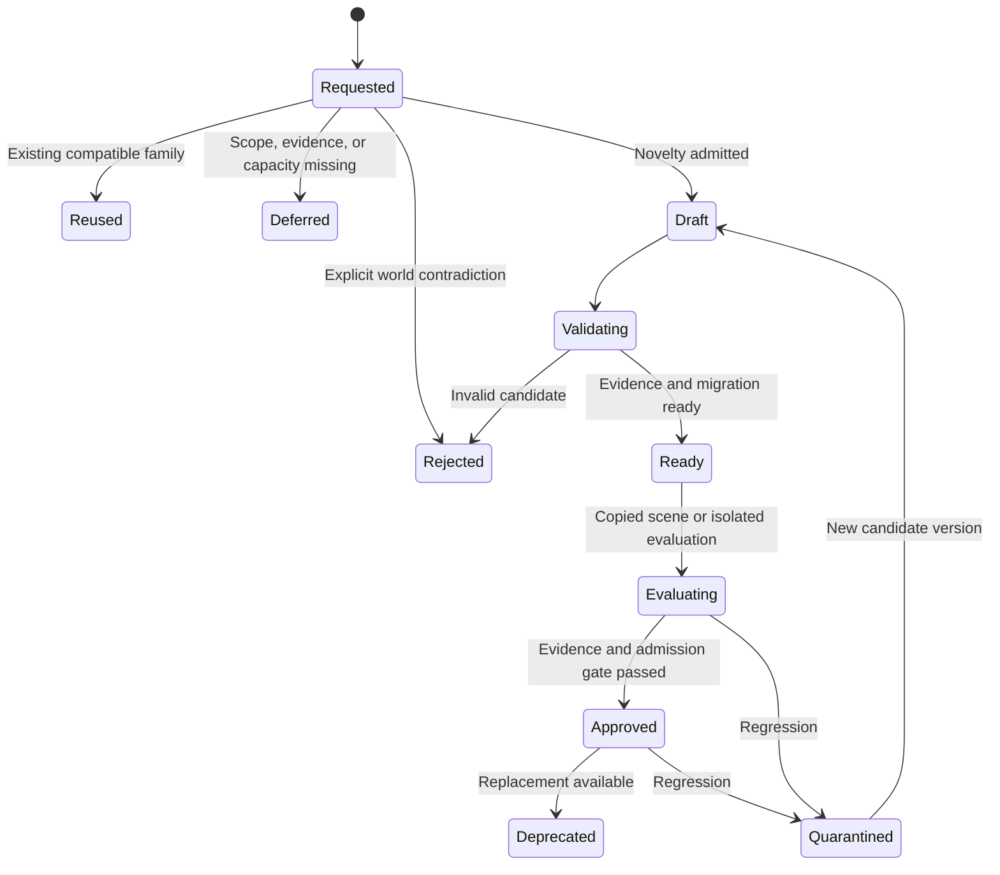

# Declarations, reusable mechanisms, and world evolution

Definition activation, migration and cleanup must respect the [save/load design](../../docs/save-and-load.md), including preservation of dependencies needed by retained worlds.

This is the canonical technical design for declarations, G0–G3 mechanisms, state ownership, admission, activation, migration and mechanic evolution. Current finite-family behavior belongs to [Architecture](../../docs/architecture.md), delivery state to the [invention tracker](../../docs/maintainers/inventions-and-world-evolution.md), governance to [Invention governance](../03-design-proposals/invention-governance-and-ownership.md), creator UX to [World agent and workshop](../03-design-proposals/world-agent-and-workshop.md), and empirical questions to the [Research backlog](../05-project/research-backlog.md).

## What a declaration means

A declaration is a versioned definition the simulation understands: a material profile, component schema, recipe, rule, semantic resolver, or reference to an admitted algorithm. It describes available behavior; it is not permission to execute every conceivable consequence of its prose. Live instances hold changing state. Actors hold beliefs and learned techniques. Keep these distinct even when one platform stores all three.

The practical goal is a small interpreter for registered operations, with extension points. Do not build a universal programming language or attach every possible property to every entity. A new definition earns persistence when it enables a useful choice, corrects a repeated inconsistency, or supports a reusable family. A one-off interpretation may remain an event rather than a permanent mechanic.

| Layer | Example | Authority |
|---|---|---|
| World profile | Ordinary heat needs an admitted physical source | Creator-approved governing revision |
| Definition | Fiber roof material; impact rule; repair recipe | Admitted immutable artifact |
| Instance | Roof section 42 has damage and current wetness | Authoritative simulation |
| Derived value | Rain reaching a sleeping place | Registered calculation and dependency versions |
| Actor knowledge | Ada knows a binding technique | Learning and memory rules |
| Meaning or claim | This beam belonged to Ada's family | Attributed social record or private interpretation |

Calling a roof waterproof does not alter rain transmission. An admitted interpretation may classify a documented coating under an existing material profile; a player's unsupported assertion remains a claim. An heirloom's significance can affect appraisal without strengthening its wood.

## Similar inventions before authoring

Accepted September 20, 2026; planned, not implemented. When a player clicks **Invent** with a described intent, use text embeddings and vector search to retrieve similar existing inventions before generating a new candidate. Embed a bounded description of each invention's purpose, supported behavior, materials and constraints; retain definition/version identity, source digest and embedding model/version so the derived index can be refreshed or rebuilt. Embed the requested intent with the same model. Exact IDs, aliases and applicability filters complement semantic retrieval; similarity is not proof of equivalent mechanics.

Search only records the requester may discover, initially the world's permitted invention registry. Later authorized library search must respect reuse/modification rights and world compatibility. Do not expose hidden inventions or grant character knowledge through search. Return bounded ranked matches with names, concise behavior/material differences and use/modification availability; keep match scores available for inspection rather than presenting them as correctness probabilities.

If similar inventions are found, open a new **Similar inventions** modal asking whether to **Use existing**, **Modify existing**, or **Invent new**; also allow cancellation. Wait for the choice before new candidate authoring. Use existing selects the pinned definition and opens the ordinary use/crafting flow with fresh prerequisites; it does not spawn an item or consume resources on selection. Modify existing carries the selected version and original intent into a derived draft, preserving lineage and permissions; shared-law changes use the workshop's validation/migration path. Invent new explicitly continues the original request. No matches continues normal authoring. A failed or incomplete search is visibly distinct from no matches and offers retry or an explicit continue choice. Closing the modal cancels continuation without generation, and reopening must not duplicate paid work.

This is a reuse choice, not an additional activation-approval dialog. Implement it in INV-2 before authoring dispatch; reuse the retrieval service for later autonomous discovery in INV-7, without showing NPCs a player modal.

## Definition and property contracts

The accepted [hybrid visual direction](../03-design-proposals/procedural-art-and-animation.md#proposed-contracts-caching-and-delivery) adds a separate presentation contract: versioned trusted primitive/rig references, bounded part hierarchies, materials, attachment points, pose/state mappings and density/style parameters. A generated visual description may compose supported shapes or reference approved artwork; it cannot supply executable JavaScript, add physical anatomy, extend reach or alter collision. Mechanical declarations and presentation bindings remain separately validated/versioned. Unsupported visual families use the existing asset fallback/authoring path rather than silently extending the interpreter.

The following fields are illustrative requirements, not implemented syntax. An immutable artifact needs identity/version and digest, kind, typed parameters, compatible schema/runtime, dependency references, applicability, input/query contract, permitted effects, world-domain requirements, resource/work limits, failure policy, and provenance. Tests and admission results attach to the exact artifact digest.

Each mechanical property definition specifies type, units, bounds, applicable component families, owning system, permitted operations, visibility, dependency rules, and initialization semantics. An instance's property resolution should return more than a number:

| Resolution status | Meaning | Required treatment |
|---|---|---|
| Known | Explicit authoritative value or reproducible derivation | Preserve source and relevant versions |
| Admitted estimate/default | An approximation explicitly permitted by a versioned policy | Record method, scope, and uncertainty where relevant |
| Unknown | Applicable, but sufficient evidence/value is unavailable | Follow the consumer's unknown policy |
| Conflicting | Authoritative inputs or interpretations disagree | Reconcile or defer; do not silently choose |
| Not applicable | Schema establishes that this property does not apply | Do not treat as a numeric zero |

Also distinguish a missing component definition from a known component whose instance value is unknown. The former may require a capability extension; the latter may only require observation, initialization, or an approved approximation. Fields omitted from a model context are not evidence that they are absent from the world.

Resolve values through explicit registered precedence: instance override, constructed composition, material definition, or admitted default. Preserve provenance for each resolved value. Composition is property-specific: combustible bindings remain separate from a stone panel; flammability should not become an arbitrary average. Derived values have dependencies and are not independently writable copies.

For partial declarations, list unresolved requirements and supported consumers. Carrying an object need not require its detailed thermal model, but introducing it into a world with active fire requires coverage by an admitted coarse thermal family. Foundational passive processes, such as rain exposure and combustion, need a deterministic unknown/default policy for every applicable admitted object. Record any approximation; never interpret an unknown value as immunity. A consumer may ignore an unknown only when an admitted bound establishes that it cannot affect the selected outcome.

This policy also applies when nobody requests an action and providers are unavailable. Use the admitted family fallback when rain or fire reaches a partially specified object. Defer activation of an unsupported optional domain. Unexpected missing foundational coverage is a technical fault: invoke the declared recovery or pause the affected process/scope visibly, rather than silently skipping the object or asking a model every tick. Such a pause is not a successful fictional outcome. Initial admission tests must exercise passive exposure during a provider outage.

## State ownership and dormant influences

A changing quantity has one authoritative owner, usually a small registered module. Other mechanics submit typed contributions declaring units, rate/event meaning, source identity, applicability, saturation/overflow and resource claims. Coordinated quantities may share an owner; derived display values remain read-only.

The initial one-sector runtime uses fixed simulation steps. Read one immutable start-of-step state; calculate bounded proposals; resolve aggregate resource claims in a stable declared order; then commit accepted contributions and resulting events together. A rain rate integrates once over the step; a discrete splash applies once by contribution identity. No rule observes another rule's partially applied update. Heat affecting drying and dryness affecting burning read the same starting state, with their combined results available next step. Step size is versioned and tested against representative smaller steps; this is a coarse numerical model, not a proof of physical accuracy. Arbitrary same-step feedback solvers are deferred.

Transfers across owners stage debit and credit under one transfer identity. Two individually valid proposals cannot both spend the same water or fuel: aggregate claims are checked against the source budget before either commits. Initial allocation uses stable priority/order and rejects unmet whole claims; a partial rate allocation requires a template that declares how to scale both sides. Environmental sources/sinks must be explicit admitted operations. Bound contributions, affected entities and scheduled descendants per step as well as per invocation.

Before adding a variable or writer, look up registered family IDs and explicit aliases. Semantic matching proposes reuse; it cannot establish equivalence from similar names or compatible units. `Wetness`, `dampness` and `water_saturation` may refer to one quantity or distinct surface/retained-water states. Validate applicability and behavior before merging them. Ownership changes require a migration, not a second writer.

Authoring stores capped notes attached to relevant families: plausible influences/consumers, conditions, uncertainty, compatible profiles, missing dependencies, provenance and a relevance trigger. Keep `anticipated`, `uncertain` and `forbidden` distinct from executable `admitted`. Notes cause no updates, jobs, NPC learning or recursive subsystem generation. Retrieve a small relevant set when needed and follow normal admission. Explicit identities deduplicate records; uncertain matches remain proposals. An immersion note is neither evidence of past immersion nor proof that immersion is impossible until implemented. A separate speculative graph service is unnecessary.

## Generation levels and executable references

| Level | Permitted output | Boundary |
|---|---|---|
| G0 | Speech, interpretation, plans, attributed appraisal | Existing actions and bounded semantic outcomes |
| G1 | Material profiles, component declarations, recipes, formulas, compositions | Supported declarative types and host operations |
| G2 | Restricted executable algorithm | Registered input/effect interface, isolation and execution limits |
| G3 | New host operation, runtime authority, storage representation, or incompatible engine change | Engineering release and explicit migration |

Registering another component schema expressible by an existing generic component store can be G1. Changing database representation, introducing a new privileged operation, or changing the interpreter's meaning is G3. This distinction avoids treating every additional field as an engine release while preserving meaningful limits.

The first automatic G1 path parameterizes or composes a finite set of trusted templates: material profiles, recipes, bounded predicates/formulas, state-owner contributions and source-backed transfers. Templates supply mandatory reads, typed units, legal effects, initialization, failure behavior and finite composition limits. A new field alone provides storage, not a working mechanic. Generated declarations cannot replace their template's validators or invent a resource source by renaming an effect.

The [first playable scope](../05-project/first-playable-mvp.md) requires these templates to support live generation of a usable sling recipe and another invention, with bow-and-arrow as the candidate. Seed material/preparation/assembly, equipment/ammunition and simple projectile families, plus native animal reactions, damage/death, finite harvesting and food preparation/consumption. The requested finished recipe is generated during play and then validated, persisted and reused; a prewritten sling recipe with generated flavor text does not meet this gate. A carrying bundle remains an internal fixture. Missing trusted operations need engineering rather than an unrestricted generated effect.

Parameter changes within an admitted envelope can use its existing acceptance policy. A novel formula may still be G1 when expressible by the supported interpreter, but it is a new behavioral candidate, not automatically a safe parameter change. Require scoped domain evidence and admission before reuse. A calculation beyond the declarative language may use the later G2 runtime if its existing interface suffices; changing the trusted interpreter or host operations is G3. Structural/type checks and enforced resource bounds establish specific invariants. They cannot prove arbitrary physical plausibility, relevance completeness or consistency with every past event. Use trusted operation contracts plus curated counterexamples and scenario comparisons. Author-generated tests supplement these checks rather than certify their own correctness. Exact automatic-versus-reviewed thresholds remain open.

G2 scripts reference immutable artifacts and receive scoped inputs through enforced interfaces, returning bounded effect proposals. An isolated Macrofold authoring/test harness can produce and evaluate them; starting that harness is not the runtime for each game tick. Live G2 requires a separately admitted game isolation runtime with no AI/network access, direct world mutation or ambient clock/randomness. Supply recorded time/random inputs where needed; enforce instruction/time, memory, query, output and scheduled-work limits, and measure execution latency under contention. Until that runtime is demonstrated, reuse G1/native mechanisms or defer G2 execution. Isolation limits authority; it does not establish game-rule correctness.

## Dependency bundles and activation

A useful change often spans artifacts. Adding roof waterproofing may require a material parameter, a rainfall-to-moisture relationship, a coverage calculation, instance initialization, and presentation labels. Activating only one can produce inconsistent behavior.

An illustrative bundle could contain:

```text
bundle: shelter.rain_response / revision 2
requires: world profile revision; supported interpreter ABI
artifacts: material profiles; coverage rule; moisture update rule
migration: initialize wetness using a declared approximation
active processes: migrate/quiesce affected owners and processes; compatible recipes may finish
invalidates: derived exposure; affected semantic and applicability caches
assets: existing wet/damaged presentation bindings and fallbacks
evidence: scenario fixtures; resource checks; migration rehearsal
activation: expected prior bundle and schema revisions
```

Resolve dependencies into a pinned manifest. Check absent artifacts, incompatible units, duplicate owners, contradictory overrides, unsupported operations and cycles. Admitted feedback uses the fixed-step policy above; unbounded recursion or same-step rescheduling is invalid. Trusted operation/query contracts establish mandatory dependencies. Instrumentation records actual reads and can detect undeclared access, but cannot discover a necessary query that an algorithm omitted.

Include relevant committed outcomes and their conditions in compatibility checks. A damp wall resisting a brief flame does not imply universal fire immunity; a recorded wall burning cannot be silently replaced with an incompatible history. New wording must not reroll a law. If a better approximation conflicts with established behavior, use an explicit creator/version correction and migration policy rather than presenting the change as ordinary discovery.

Initial activation targets one sector: prepare and rehearse the bundle, pause at a committed tick boundary, verify the expected manifest, then migrate or quiesce affected state and processes. Preserve elapsed work, accumulators, pending events, contribution identities and already consumed resources under explicit mappings. Commit the new manifest, migrated state and activation receipt atomically before resuming. Preparation failure leaves the old bundle active; restart reads the committed receipt rather than repeating migration. A request cannot observe mixed initialization and definitions.

Only recipes explicitly compatible with the new owner interfaces, units, state meanings and current laws may finish under pinned versions. Old/new authoritative owners never update the same quantity concurrently. An incompatible process must migrate, finish before activation, or enter its declared recovery; activation otherwise waits. Candidate approval and per-world activation are separate records. The receipt identifies old/new manifests, migration digest and effective tick. Larger staged or unloaded-region transitions require additional design and are deferred from this initial policy.

## Candidate lifecycle and deduplication



“Ready” and evaluation do not mutate the live world. Candidate-law experiments use copied scenes or another isolated evaluation environment. Approval makes the bundle eligible for the separate atomic activation operation, which checks the current profile and dependencies again. A candidate tested under yesterday's rules may need reevaluation. Never assign different physical laws to otherwise equivalent live objects solely by player or rollout cohort. Narrow applicability must have a causal basis, such as material family or construction method. A live local prototype can use shared admitted laws; it cannot contain an unadmitted universal law by geography alone.

Deduplicate generation by world compatibility, canonical family, missing contract, relevant source definitions, and generation-policy revision. Ten requests to waterproof the same material should join one bounded job or reuse its result. Each original action still has its own target, permissions, deadline, and resource checks. Different outcomes must not collapse merely because their descriptions sound alike.

Use a lease and stable request identity for authoring work. Retry generation within its limit; publication compares the expected base revision. If another candidate wins, rebase or supersede the loser rather than automatically activating both. Charge and attribute authoring work separately from executing the resulting mechanic.

## One-off semantic resolution

A semantic resolver is itself an admitted versioned definition. It specifies the residual question, eligible outcomes, necessary evidence, unknown handling, relevant dependencies, acceptance policy, maximum consequences, expiration, and fallback. It may interpret a gift's meaning or map an unusual fastening method to existing construction operations. It cannot waive a known rule or fill an essential physical unknown without an admitted estimation policy.

Jev supports supplied choices and ordered rubrics over structured text state; questions sharing a request are evaluated independently. Consequently, it can help choose among eligible interpretations, while novel prose or multi-step design requires a generative model or agent workflow. One question's answer cannot silently supply missing evidence to another in the same call. [TypeSafe primitives](https://docs.typesafe.ai/primitives)

A semantic descriptor such as “oily, tightly woven cloth” may justify retrieving candidate material profiles. Selecting a profile remains a proposal until the classification policy accepts its provenance and scope. Jev's limitations explicitly include arithmetic, distractor context and adversarial steering; do not derive exact strength, ignition time, or permeability from a confident Score. [Jev limitations](https://docs.typesafe.ai/model-jaggedness/jev-1.13)

Record the admitted judgment and actual resulting events. Equivalent future requests can reuse a validated mechanism; they do not automatically inherit the same emotional reaction or physical outcome. Promote recurring one-off interpretations only when reuse is valuable and counterexamples establish an adequate applicability contract.

## Bounded multi-turn authoring and investigation

A harness can be important when the next useful operation depends on a previous result: inspect material properties, retrieve an existing family, discover a missing dependency, draft a composition, inspect validation feedback and refine the proposal. World investigation similarly follows evidence across records; workshop revisions may need repeated dependency and consequence inspection. These are later extensions of the simple INV-2 path, not a requirement to add several model calls to every recipe.

Give each admitted task finite tool, input/output, elapsed-time and spending limits. Tools return scoped evidence, versions, unknowns and validation findings; the harness chooses the next useful call. Refinement inside an explicitly budgeted run is distinct from automatically restarting failed paid work. Exhaustion leaves a retained draft and clear status. Server-owned authorization, trusted validation, confirmation where required and atomic activation remain unchanged. A proposed experiment changes character knowledge only after a real authorized action and observable result; a copied-scene validator is not an NPC's lived experience.

## Worked case: a roof becomes more useful

An actor asks to bind branches into a little house. Intent resolution retrieves a lean-to family, identifies missing expectations such as enclosure, and selects a supported assembly. Construction creates stable supports and roof sections, consumes declared material, and computes coverage. Household attachment is a separate social consequence. Naming the assembly “house” grants neither area nor waterproofing.

Later, the actor proposes adding a woven coating to keep rain out. First inspect existing material profiles and relations. If the current coverage/rain rule already accepts a supported permeability profile, generate a recipe variant; no new physical subsystem is needed. If the relation is absent, propose the smallest bundle connecting admitted permeability and coverage to local exposure and moisture.

Missing historical wetness requires an explicit initialization approximation. Do not retroactively claim the old roof kept occupants dry or replay all past weather from invented evidence. Activate the bundle only with compatible initialization and cache invalidation. Recheck the actor's proposed construction after activation: the materials may have been used elsewhere while generation ran.

A family expansion adds sections and changes derived space. Replacing a wall with stone preserves dwelling identity but records replacement/salvage, material composition and support changes. Recomputing comfort may include each resident's preferences; it does not change physical capacity. Removing a wall invalidates affected enclosure, rain exposure, navigation and thermal-neighbor results, including cached queries whose result set gains new neighbors.

The same discipline applies to fire: combustibility alone cannot establish ignition. Once a coarse source-strength/duration, moisture, ignition-progress and fuel model is admitted, repeated fire updates execute it directly. Refinement to detailed thermal nodes requires a declared conversion rather than maintaining two contradictory authoritative quantities. See [coarse simulation scope](../03-design-proposals/simulation-scope-and-complexity.md).

## Persistence, invalidation, and replay

Maintain two logical registries: world capabilities and actor knowledge of those capabilities. A successful invention can make a recipe executable without teaching every NPC how to make it. An admitted physical relationship applies to equivalent supported objects under its conditions whether or not characters know it. Observation, practice or testimony updates knowledge with provenance and uncertainty; it does not activate physics. Imported packs likewise do not automatically grant character knowledge or permissions. Library improvements leave existing worlds' pinned revisions unchanged until an explicit compatible transition.

Store definition provenance, creator permissions, dependency digests, initialization/migration evidence, and private/public scope. Pack export selects authorized definitions and assets; it must not include the conversations or private memories that inspired them. Reusable artifacts and historical traces need different retention and access policies.

Cache invalidation follows world/profile, mechanism, material/composition, relevant state, observation scope and query membership. A negative lookup for “no ignition rule” expires when a suitable capability activates. Start with conservative region/registry revisions and fresh critical predicates; optimize to narrower revisions only when every relevant mutation is covered. Semantic similarity retrieves candidates, never proves dependency equality. Snapshot refresh and context acceptance follow the [context contract](context-and-inference.md).

Replay uses recorded admitted judgments, committed effects, pinned artifacts and random draws. A model returning a different answer today cannot rewrite yesterday's history. Keep required retired versions through the chosen replay horizon. A failed new process step commits nothing; previously committed consequences require explicit compensation or a declared recovery policy. Reverting definitions alone cannot safely undo consumed materials, learned information, or demolished parts.

## World admission, creator ownership and workshop revisions

The future [NC13 on-the-spot action/effect invention](../../docs/narration-and-conversations.md#11-delivery-boundaries-and-deferred-invention) reuses this admission path. A missing slap rule, for example, may eventually declare a conditional health effect using supported injury predicates, then execute only after validation/activation and fresh target checks. Generated descriptions cannot create new trusted primitives or bypass god-mode-only stat creation. Initial narration instead permits bounded expressive actions with no new mechanical effects; admitting a later rule never retrospectively applies damage to an earlier expression. The Narrator only describes committed outcomes and never authors/adjudicates effects. NC13 remains explicitly deferred from the initial narration slice and links to this document's INV delivery gates.

The [U14 governance requirements](../03-design-proposals/invention-governance-and-ownership.md) add a versioned world invention policy with independent agent/NPC and player locks. Carry server-established originating authority and delegation provenance through authoring jobs; execution by an LLM, NPC helper or Macrofold never changes a player-origin request into autonomous NPC invention. Check the applicable lock before dispatch and atomically at admission, alongside expected definition/manifest revisions, across conversation, imports, revisions and background work. Enabling that lock invalidates its in-flight attempts; changing only the other lock requires fresh validation but does not itself forbid admission. Save and restore both settings independently. Existing actions, crafting, learning and NPC cognition remain available; permitted invention by the other group continues. Owner edits require the player lock off unless the separately proposed administrative exception is adopted; no agent receives an implicit exception.

Keep invention identity and immutable versions separate from creator/account attribution, character knowledge, world installations and reuse grants. A host admitting a contribution does not become its author. An account library retains the author's authorized technical contribution and source-world provenance; a world manifest records the exact versions installed there. Neither record grants private-memory access or permission to redistribute dependencies. These are application-owned records, even when a generic artifact service stores their bytes.

The [workshop](../03-design-proposals/world-agent-and-workshop.md) uses this document's existing validation, activation and migration path. Editing creates a candidate version or explicit fork, previews the diff and affected instances/processes, and commits only with current authority and a valid migration. Preserve prior events and versions; a slower-burning revision cannot retroactively restore fuel already consumed. Every world has a complete logical invention-pack inventory; an export release pins versions and dependency closure, and exposes any rights or compatibility blockers instead of silently omitting entries.

## Open policies and acceptance evidence

Before live admission, choose automatic versus reviewed envelopes, family fallback values, step size and allocation priorities, recovery behavior, evaluation requirements, replay retention and work budgets. First implement one profile, a few templates/material families, one sector, one modular shelter and explicit extension records. General pack management, unloaded-region migrations and live G2 follow a working creator loop.

Meaningful acceptance cases include:

- Unknown versus explicitly noncombustible material; passive fire/rain reaching a partial declaration during provider outage.
- A misleading “waterproof” name versus an admitted coating profile; conflicting material claims.
- Two concurrent discoveries of the same missing rule; canceled original actions after successful generation.
- Rain/drying sharing one start-state; no duplicate contribution or repeated splash integration; step-size comparison.
- Two consumers claiming one source budget; atomic debit/credit, saturation and rejection without lost or duplicated resource.
- Dormant wringing notes retrieved later without prior physical effects or leaked character knowledge.
- Equivalent objects obeying shared admitted laws despite different actor knowledge; no player-cohort physics.
- A new definition checked against relevant past outcomes without overgeneralizing one failed experiment.
- Activation failing before commit or crashing afterward; no mixed-version world or repeated migration.
- A live fire-owner upgrade preserving ignition progress; incompatible old processes never writing new state.
- Rain beginning during construction; saved damage and ownership surviving migration.
- A new neighbor or removed wall invalidating an earlier spatial query, even if the original target is unchanged.
- A realistic profile rejecting source-free heat hidden behind a new property name.
- Stable dwelling identity through replacement, expansion, split spaces and salvage accounting.
- An imported capability remaining unknown to NPCs; exported definitions excluding private source history.
- Model outage, exhausted authoring budget, quarantined active process, and replay without fresh inference.
- A well-typed novel formula rejected for missing admission evidence; an omitted mandatory query not excused by instrumentation.
- G2 execution exhausting time/memory/output budgets, leaving no partial effect, with an enforced recovery outcome.

These are proposed evaluation cases, not completed tests or guarantees. The acceptance question is whether the addition yields useful, consistent play within its declared scope—not whether generated prose plausibly explains every possible situation.

## Implementation tracker

Delivery state, dependencies and exit criteria live in the [Inventions and world evolution implementation tracker](../../docs/maintainers/inventions-and-world-evolution.md).
