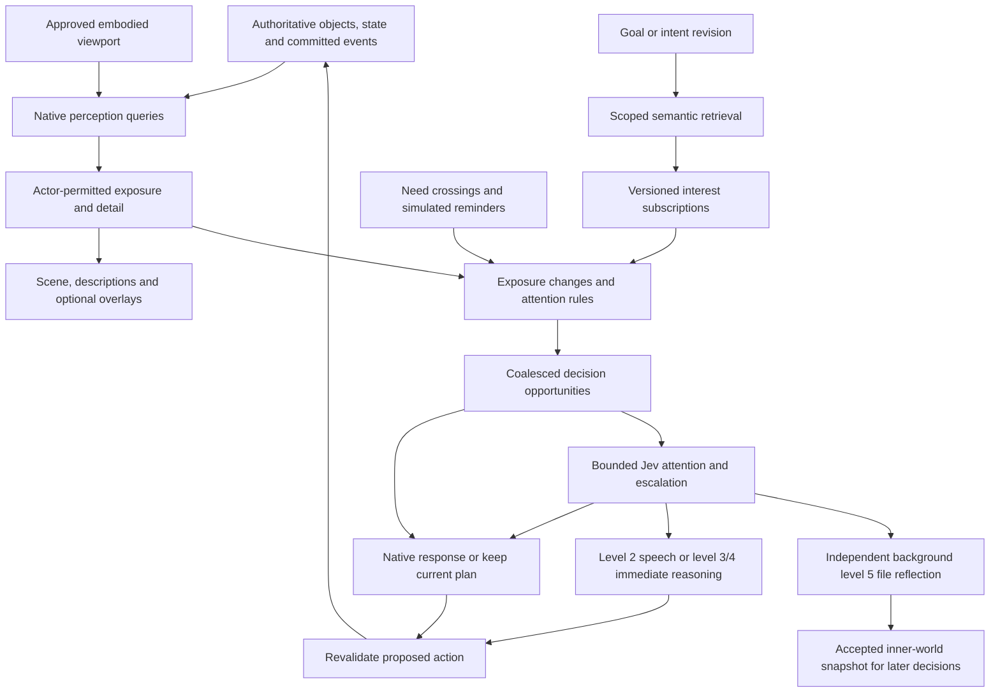

# Perception, descriptions and attention

> **Later cognition direction:** [Memory architecture](../../docs/memory-architecture.md) adds Jev yes/no attention over actor-permitted nearby objects, possessions, known recipes and recall candidates, plus Jev escalation on semantic opportunities. Native scope/index filtering bounds the candidates; batching avoids one call per object or tick. Event-time awareness includes the player. Experiential retention covers witnessed events plus the future [NC notable-unseen exception](../../docs/narration-and-conversations.md#5-external-world-events-and-awareness); retaining an unseen event never grants perception. The contract below preserves mandatory Jev routing for admitted semantic opportunities, sensory scope and immediate native reactions. Build tasks: [CR04–CR06](../../docs/maintainers/cognition-redesign.md), with the narration extension tracked separately as NC01–NC13.

Status: **documentation-only proposal**, September 19, 2026. The [user follow-up](../00-source/perception-and-attention-followup.md) establishes the requested direction; algorithms, record names, tuning and delivery stages below are recommendations. None of this update implements overlays, acoustic propagation, description tiers, semantic indexes or new AI triggers. F62–F67 and D51–D54 record requirements and open choices.

This document owns the proposed perception/attention contract. Read it with [context assembly](context-and-inference.md), the [production data model](production-data-model.md), [memory](../../docs/memory-architecture.md), [state ownership](../03-design-proposals/state-systems-and-future-influences.md), [heat/fire](../03-design-proposals/heat-and-fire.md) and [time](../03-design-proposals/time-and-simulation-speed.md). These are game-owned policies behind replaceable infrastructure ports.

## Implemented visual experiment after the original proposal

A subsequent user request authorized a first visual experiment: remove the visible action-menu title, expand sight from 10 to 28 map units, and use heavy peripheral blur without darkening. The prototype now uses distance-only sight, a player-centered CSS blur field, and up to 128 frozen last-seen images outside sight; these cannot expose live updates or actions. Hearing remains 10 units with its existing rock check. See [implemented architecture](../../docs/architecture.md#context-and-cognition) and [verification](../../docs/verification.md). No semantic description tiers, acoustic field, attention index or viewport-authorized knowledge system were implemented. The proposal below remains the longer-term contract; its original documentation-only instruction was superseded only for this requested visual slice.

## 1. Source audit before the wider-vision experiment

These historical findings describe the code before the visual experiment above. They came from source inspection, not a live playtest; the linked implemented architecture now supersedes their sight/rendering details.

| Concern                | Current behavior and source                                                                                                                                                                                                                                                                                                                                                                                                                                                       | Missing behavior                                                                                                                                                                   |
| ---------------------- | --------------------------------------------------------------------------------------------------------------------------------------------------------------------------------------------------------------------------------------------------------------------------------------------------------------------------------------------------------------------------------------------------------------------------------------------------------------------------------- | ---------------------------------------------------------------------------------------------------------------------------------------------------------------------------------- |
| Vision                 | `visible` allows entities within **10 map units**, using straight-line distance in the ground plane and `hasLineOfSight`. That query samples intervening tiles and rejects `rock` tiles. [Kernel](../../packages/domain/src/kernel.ts), [spatial queries](../../packages/domain/src/spatial.ts)                                                                                                                                                                                   | No near/medium/far detail, facing, lighting or material-aware occlusion; no broad viewport-aware perception                                                                        |
| Hearing/event exposure | Source-associated `emit` events use a separately hardcoded **10-unit radius plus the same line-of-sight test** for living listeners. Targeted speech/teaching also check visibility. Source-less events reach all living actors; a source actor is included in its own event audience. [Events](../../packages/domain/src/events.ts), [kernel](../../packages/domain/src/kernel.ts)                                                                                               | No independent acoustic propagation, loudness, masking, wall transmission or partial speech intelligibility; the existing event audience is not a physical hearing model           |
| Evidence and memory    | Event audiences are fixed when emitted; later arrival does not grant old speech. `observeActor` returns current visible entities and the last 24 permitted journal events. Important events can create memories; non-self speech is marked heard. [Kernel](../../packages/domain/src/kernel.ts), [events](../../packages/domain/src/events.ts)                                                                                                                                    | No modality-specific perceived event payload or historical detail-tier receipt; an admitted event's text is shared across its audience                                             |
| Client view            | The server projects actor-visible entities. Camera pan/zoom stays in the client and does not constrain the actor's observation. Boundary woodland and grass detail include decorative renderer objects, not individual simulated resource entities. [Projection](../../apps/server/src/view.ts), [scene](../../apps/client/src/scene.ts)                                                                                                                                          | No sight/hearing overlay or guaranteed agreement between the camera's screen area and actor knowledge                                                                              |
| Descriptions           | Inventory definitions and action tooltips have prose. Tooltips combine permitted facts with native explanations and saved invention descriptions. [Action descriptions](../../apps/server/src/action-descriptions.ts)                                                                                                                                                                                                                                                             | No universal entity visual profile or distance-specific object-description contract                                                                                                |
| Reconsideration        | The scheduler coalesces actor-aware significant events, encounters, goal/need/policy changes and derived interest matches under real-time cooldowns, default **45 seconds**. Native multi-question Jev selects the immediate reasoning route and independent reflection significance; action admission remains native. [Director](../../apps/server/src/ai-director.ts), [configuration](../../apps/server/src/config.ts) | Finite derived interest subscriptions and encounter hysteresis are implemented; richer exposure-delta tiers and recurring low-need reminder policy remain future work |

Native food/rest urgency already runs without AI. The proposed system extends meaningful awareness; it does not make survival, movement or rendering wait for a provider. Current sight and event radii also need a single versioned policy when replaced, rather than another duplicated constant.

## 2. Separate physical exposure from attention and thought

**Exposure** is evidence the character can currently acquire. **Attention** identifies which changes matter to its goals or demand reconsideration. A **decision opportunity** records that something warrants evaluation; it is not a promise of a separate paid call or visible thought. An object can remain available for inspection without interrupting an actor every tick. Memory preserves selected historical exposures even after current visibility ends.

Use native code for geometry, attenuation, detail selection, novelty bookkeeping, known hazards, meter crossings and executable action checks. Jev evaluates attention and escalation for every admitted semantic opportunity. Level 2 handles ordinary speech, levels 3/4 handle complex immediate reasoning, and level 5 independently handles background file reflection. A declaration builder has its separate generation contract. Generated descriptions, tags and semantic matches never authorize effects.

## 3. Visual footprint, detail and the player's screen

Every meaningful world object needs a reusable visual profile: spatial extent, coarse recognizable features, near/medium/far description variants and bindings to supported state. Distance to an object's exposed extent, apparent size, occlusion and receiver conditions determine detail; distance to its center alone is insufficient for a large building. Begin with coarse distance bands and existing terrain occlusion, then extend the policy without changing the observation contract.

The requested three text levels should differ in **available facts**, not merely adjectives:

| Exposure | Example for a tree                                               | Facts to withhold                                                             |
| -------- | ---------------------------------------------------------------- | ----------------------------------------------------------------------------- |
| Far      | “A tall tree with a broad crown.”                                | Bark detail, small damage, exact resource stock or a hidden carving           |
| Medium   | “A mature tree with a broken lower branch.”                      | Small marks, exact material condition and concealed details                   |
| Near     | “Rough bark surrounds a fresh notch; pale chips lie beneath it.” | Internal state that still needs a supported inspection, such as concealed rot |

These are illustrative authoring examples, not evidence of existing tree mechanics. Detection, recognition and detailed inspection are separate. A distant figure can be perceived as a person without identifying Ada. Nearness does not reveal private thoughts, inventory contents or everything inside an opaque container. A known actor may be recognized sooner under an admitted recognition policy; uncertainty must remain explicit.

### Embodied visual parity

The user requests that the character's current visual knowledge agree with what the player can see. Proposed rule: **server-approved world viewport intersected with character line of sight and supported visual detail**. Objects within that view and LOS should be perceivable; off-screen or occluded objects must not add current visual facts. Tune the broad physical field and embodied camera limits together so a normal screen full of nearby landscape is not arbitrarily cut off by today's 10-unit radius.

The client submits camera/viewport intentions; the server validates their extent, mode and revision. It does not accept client claims that an object is visible. The scene, object inspection, action targeting and model context use a compatible exposure snapshot. Pan/zoom updates must not leave a hidden entity inspectable at its old detailed tier. Use neutral presentation while a new snapshot is pending and revalidate commands that require current visual access. Camera motion must not create a paid call per frame.

“On-screen” should provisionally mean the unobscured world camera viewport, not a test of each HUD pixel or whether a label is covered by a menu. Sprite/building occlusion must agree with the world visibility policy. Exact treatment of overlapping panels, narrow screens, extreme zoom and partially visible objects is D51 work; this proposal does not claim the current renderer enforces it.

NPCs have their own spatial perception and attention; their vision must not depend on where a human pans the camera. God/creator inspection is a separately authorized view and does not teach the embodied character its contents. An off-screen object can still be remembered at its last observed state, or heard through a valid sound exposure. Neither is a current visual observation.

**Background-play tension:** the existing unchecked Pause game when hidden setting permits continued simulation. A hidden tab has no literally visible screen. Recommended interim policy is no new player visual exposure while hidden, while NPCs, sound exposure and native simulation continue; do not replay missed sights on return. Resuming rebuilds current exposure. An alternative is continuing a last approved embodied viewport while hidden, but that relaxes the user's strict screen-parity rule and needs a deliberate product decision. A second tab or a god camera must not silently expand the character's sensory field; designate one active embodied view. This remains unimplemented.

### World objects versus decorative art

The description requirement applies to objects the world represents, including people, animals, resources, structures, possessions and meaningful effects. Shared terrain/vegetation patches may supply coarse visual descriptions without allocating an independently simulated entity to every blade of grass. An individually interactable tree needs an authoritative identity and footprint; a renderer sprite alone cannot become wood stock. Distant decorative woodland should at least correspond to a descriptive landscape region, so recognizable scenery is not inexplicable to the character. Promotion from scenery to an interactive object needs an explicit world transition and consistent identity/resource ownership.

## 4. Sound belongs to emissions and processes

A window smash creates a sound emission with an event-time origin, duration, source profile and permitted descriptive variants. It can outlive the window or have no enduring source object. Do not resolve its historical position from wherever an actor or object happens to be later. A moving sustained source emits from its process's current authoritative position at each evaluated interval.

An attached fire can expose a visible flame effect and a sustained crackling emitter. Host attachment links are optional, versioned and cycle-free. There is one process owning fuel/combustion state; visual and audible projections derive from it. An effect entity and a host property must not independently consume the same fuel, duplicate the same sound or create two identical threat interruptions.

Proposed sound model inputs include source strength/profile, distance, intervening material/openings, ambient masking and listener sensitivity. Detection, broad source recognition, direction/localization and speech intelligibility are separate outputs. A listener might hear “a faint sharp crash to the east” without knowing there was a window, who broke it, exact coordinates, or any spoken words. A heard claim is evidence of speech, not evidence the claim is true.

Start with authored, normalized audibility/clarity scores and distance attenuation, plus simple obstacle penalties. Walls should reduce transmission; doors/openings can provide different paths. Vision occlusion cannot serve as a universal all-or-nothing hearing check. Allow a later room/portal or spatial propagation provider to replace initial queries. Material coefficients, masking, weather, vertical floors and fidelity remain tunable; no calibrated acoustics are claimed.

A decibel display is a possible later presentation. It needs an explicit source reference, units and a compatible propagation model; a normalized percentage should not be labeled dB. The game's audibility model also differs from the user's speaker volume or mute setting. Muting playback should not make the character deaf; accessible captions receive the same permitted sound evidence.

## 5. Compact player perception indicators

Add a small perception control with independently toggleable **Vision** and **Hearing** overlays; save these display preferences to the player profile. They are presentation controls and never turn senses or decision triggers off. Exact location/defaults are open; keep the existing compact right-click menu free of extra controls.

- Vision uses a restrained gradient for decreasing detail, with an optional light dotted outer contour and an unobtrusive near/medium/far legend. The geometry is clipped by permitted sight and the embodied viewport. Render only the information the character is permitted to see.
- Hearing uses a soft gradient and an optional faint outer contour. **Its contour describes a named reference sound**, such as ordinary speech, under current listener conditions. Different source strengths have different reaches; a loud crash can be heard beyond that reference contour. A source-specific indication can appear after an actual permitted sound, without revealing a hidden source identity or its exact location.
- Circles are an acceptable first display approximation, explicitly described as such. Existing rock occlusion must still affect real exposure. Later gradients and contours follow walls, openings and other supported propagation geometry instead of requiring a new UI concept.
- Use distinct labels as well as color, adjustable subtle opacity, and reduced-motion behavior. Overlays do not block clicks. A text inspection path exposes the same authorized clarity/detail information.

The server provides either a permitted sample field/contour or sufficient sanitized parameters for drawing an approximation. The client never needs hidden wall interiors or unperceived emitter locations to render it. Overlay precision cannot exceed the information policy: a hearing preview must not reveal an undiscovered room through its detailed transmission shape. The display can remain approximate until that structure is known.

## 6. Shared descriptions with meaningful state variation

Use an archetype's authored description set for ordinary instances. Compose supported state overlays and, when warranted, a small instance-specific override. An admitted new object or action/effect family includes bounded description variants with a safe fallback. The tree example could use `standing`, `felled` and `burning` states; these names are illustrative, not new executable properties.

Each state overlay declares the facts and detail tiers it can affect. A far observer may see flame or smoke without learning the percentage of remaining fuel. A near observer can receive a scorched-bark description. A chopped tree's profile changes only after an authoritative transition; a falling trunk, stump and harvested resources use whatever identity/conservation contract the relevant family admits. See [state ownership](../03-design-proposals/state-systems-and-future-influences.md).

Composition requires precedence and compatibility rules: avoid “healthy leafy crown” combined with “bare charred stump,” deduplicate a fire described through both host and attachment, and limit text length. Supported state changes select native templates or cached authored variants. Optional generation can enrich a distinctive admitted state, but native fallback must be immediate and truthful. **No generation on movement, hover, every flame tick or each copied tree.** Invalid or delayed prose never delays physical state or exposes a stale description as current.

Cache description projections by definition/description version, relevant state revision or bucket, exposure tier, language and audience policy. Do not re-embed or regenerate on every numeric intensity increment; invalidate when a described fact or meaningful tier changes. Perspective-sensitive text must be produced from permitted facts, not a privileged full-state prompt followed by an instruction to hide details.

Persist historical observation payloads, or sufficient immutable versioned facts to reproduce them. Approaching later creates a new near observation; it does not upgrade yesterday's distant memory retroactively. Correcting a belief links evidence rather than rewriting the source experience. Action tooltips and object descriptions should share this projection discipline while remaining distinct contracts.

## 7. Semantic indexing and interest subscriptions

Build a world-scoped searchable representation of objects, but separate its **canonical coverage** from what any actor may retrieve. An index containing all world objects does not grant every actor knowledge of all objects. Apply audience/knowledge/perception filters before model-facing search, ranking, snippets and counts, as required by [context assembly](context-and-inference.md#2-context-audiences-and-permitted-views).

Recommended layers:

| Layer                  | Indexed content                                                                                                                | Update and cost boundary                                                                               |
| ---------------------- | ------------------------------------------------------------------------------------------------------------------------------ | ------------------------------------------------------------------------------------------------------ |
| Shared definitions     | Recognizable categories, descriptions by permitted tier, materials, supported affordances, aliases and action/effect relations | Reuse one semantic representation per definition/version and disclosure tier; identical trees share it |
| Instance/spatial index | World identity, position/extent, definition ref, supported state tags and distinctive permitted features                       | Native insert/update/remove on committed changes; optional embeddings only for meaningful unique text  |
| Recent signals         | Emissions and consequential events with region, time, expiry and permitted payload                                             | Short-lived spatial/time lookup; aggregate repeated process signals; no embedding per crackle          |
| Personal evidence      | That actor's observations, remembered locations, attributed claims and learned capabilities                                    | Independently scoped memory retrieval; an old location remains historical                              |

The canonical inventory of objects can start as indexed database rows; a vector database is not required for each entity. Keep a semantic retrieval port capable of supporting arbitrary intents. Combine exact IDs, lexical search and admitted tags/affordances with required embedding retrieval for arbitrary intents and paraphrases; a bounded semantic reranker may supplement it. Embed the full intent, reuse definition vectors and selectively index meaningful instance text under the canonical memory lifecycle/budget rules. Embedding only archetypes is insufficient for an instance with a distinctive relevant state; supplement it with state tags and selective instance text. A shared embedding must not encode secret or near-only facts for a far-observer query.

### When an intention changes

1. Commit a new goal/intent revision and retain its original arbitrary wording, priority and relevant known evidence. Explicit player goals may inform suggestions; inferring a hidden player goal must not override player control.
2. Retrieve a small set of **permitted concepts, supported affordances and already known candidates**. “Find something to lash a frame together” can find known flexible/binding materials without requiring a hardcoded goal named `find_rope`. Use bounded Jev inclusion/escalation judgments for the semantic opportunity, with richer immediate reasoning only when warranted and budgeted.
3. Compile a versioned **interest subscription**: concepts/features to watch for, admitted local predicates, priorities, expiry and dependencies. Semantic interpretation proposes interests; trusted validation limits predicates to supported fields/operators. No generated code or client-authorized effects.
4. Evaluate those interests against the actor's **currently exposed** objects immediately, as well as future exposure changes. An actor who starts seeking wood beside a visible tree should not need to walk away and return.
5. Refresh on a meaningful goal, knowledge, definition or relevant state revision. Drop superseded interests and ignore late results for an old goal. A new matching tree can satisfy the same subscription without rerunning an LM for that tree.

This is an index plus a small derived attention plan, rather than a frozen list of every relevant object ID in the world. Intent meaning can be cached; observed positions and permission cannot be inherited from an unrelated actor's cache. A trusted internal index may cover unseen instances, but must not tell an actor there is a uniquely valuable object behind a wall. Interests describe recognizable features it could notice; actions toward a known off-screen object use an explicitly historical belief and still need current execution validation.

Index updates follow committed state through a transactional outbox or equivalent durable delivery key. Version/tombstone checks prevent deleted or replaced objects reappearing through stale search. Index watermarks disclose lag. Fresh exposures and critical native hazards bypass optional semantic indexes, and currently visible recent changes can supplement retrieval. “No match” from a lagging or failed index is not proof that a relevant object does not exist. Rebuilding the index must not require regenerating the world or changing memory.

## 8. Meaningful exposure changes without a call storm

Maintain compact previous-exposure state per actor for nearby candidates. A native spatial broad phase reduces expensive visibility/propagation checks; moving actors, geometry changes and committed emissions invalidate relevant regions. Repeated identical observations need neither a durable memory per frame nor an AI job. New, meaningfully changed or improved-detail evidence can update the current view independently of whether it becomes a lasting memory.

| Situation                                                         | Proposed decision behavior                                                                                                                                                                                                              |
| ----------------------------------------------------------------- | --------------------------------------------------------------------------------------------------------------------------------------------------------------------------------------------------------------------------------------- |
| A person/agent enters view                                        | Always record a logical encounter decision opportunity, even if identity is only “unrecognized person.” Native rules continue urgent activity immediately; bounded Jev routing can retain the current plan for the semantic opportunity; a greeting or LLM thought is not compulsory |
| An ordinary tree enters view, no relevant intent                  | Update exposure/inspectable evidence; no semantic decision merely because it is a tree                                                                                                                                                  |
| A tree enters view while wood is sought                           | A matching interest creates a relevant opportunity; include useful alternatives in a batch                                                                                                                                              |
| A relevant goal begins while matching objects are already visible | Run the attention match immediately against the present exposure set                                                                                                                                                                    |
| A visible tree catches fire, or an audible crash occurs           | Evaluate hazard/salience and current intent; native urgent interruption first when supported, then optional semantic appraisal                                                                                                          |
| Detail improves                                                   | Trigger only if newly available facts matter, such as recognizing a person, finding damage or a sought marking; not each distance increment                                                                                             |
| An object leaves view                                             | Update current evidence; reconsider if it was the current target, a pursued person or an active threat, not for every background disappearance                                                                                          |
| Need crosses a meaningful threshold                               | Record a decision opportunity; native urgency can act immediately                                                                                                                                                                       |

Use stable encounter/episode IDs, enter/exit hysteresis and evidence versions to remove duplicate delivery and boundary flicker. A genuinely new person encounter still creates an opportunity; the cooldown limits processing, not the existence of that record. People continuously in sight do not repeatedly “enter.” Camera scans can create real new exposures, but not a synchronous paid request per revealed person.

Batch related stimuli **per actor and compatible decision purpose** over a bounded interval. A crowd's encounters can be summarized with permitted identities/features and retained delivery references. Do not merge different actors' private contexts into one shared omniscient judgment. Group mundane resource matches by relevant features/location; keep an important differing property instead of reducing everything to “trees.”

Queue limits need a concrete overflow policy: reserve capacity for hazards/directed speech, coalesce repeat episodes, retain a compact decision ledger/watermark, and process bounded batches fairly. If all important details cannot fit, partition the work or defer it with coverage recorded. Do not silently drop person-entry opportunities or pass an unbounded list to Jev. Retention of routine exposures can be short; durable important memories and diagnostic logs have separate retention policies. Candidate scan, context bytes, pending work and paid concurrency all need explicit bounds.

An attention filter is not blindness. Mundane objects can be queried in the current observation when a new question makes them relevant. An actor looking for wood must still react natively to a supported immediate danger. Animals use their own relevant native triggers; the blanket people-entry requirement does not require giving every animal an LLM.

Every admitted semantic opportunity uses the same [sentence-based memory retrieval](../../docs/memory-architecture.md#every-semantic-decision-uses-an-event-or-intent-sentence), including non-speech events. Render only event-time perceived detail, embed the stimulus with relevant context and select permitted recall through Jev. A lightning-struck tree can evoke a retained witnessed death; an unidentified crash cannot confer knowledge of an unseen cause. Native hazard response does not wait for inference.

## 9. Needs, reminders and accelerated time

Use threshold crossings and hysteresis for physical needs and supported emotional appraisals. The prototype's `fullness` increases when fed, so interpret the user's low-20% example as **food reserve/fullness below 20 out of 100**, not low hunger urgency. Emotional meters are future admitted state with their own owners; this proposal does not add arbitrary psychological quantities to the engine.

A proposed persistent-need rule records an initial critical crossing and a renewed decision opportunity at least once per **simulated hour** while that condition remains unresolved. Store the last reminder/due simulation time and need-episode identity. Recovery closes the episode; boundary oscillation should not create repeated hunger alerts. An existing adequate plan can satisfy the reminder by continuing toward food. Escalating risk can interrupt sooner.

At the current rate, an hour is 60 real seconds at 1×, 120 seconds at 0.5×, 20 seconds at 3× and 7.5 seconds at 8×. Reminders follow simulation time; provider cooldowns, concurrency, deadlines and dollar caps follow real time. Manual/effective pause stops simulation reminders and autonomous dispatch; background opt-in otherwise follows the [time policy](../03-design-proposals/time-and-simulation-speed.md).

**The hourly thought example exposes a real tradeoff:** an hourly opportunity or native acknowledgement is affordable; an unconditional fresh LLM thought every game hour for every hungry actor can violate the spending limit at fast speed. Recommended default is to preserve due reminder evidence, coalesce it with the latest need/plan state, and have Jev/LLM work only when useful and admitted. A deterministic reminder must be labeled as native, never as a model-authored private thought. If fresh generated thoughts every game hour become a strict requirement, visibly limit achieved speed/active actors or pause at the capacity boundary; do not silently increase spending. D54 keeps that choice open.

## 10. Modular records, execution and recovery

Illustrative contracts below describe responsibilities, not migrations or new endpoints already available. Reuse existing/proposed entity, event and observation families rather than creating another canonical world database.

| Contract                   | Essential content                                                                                                                                    | Owner                                                                                            |
| -------------------------- | ---------------------------------------------------------------------------------------------------------------------------------------------------- | ------------------------------------------------------------------------------------------------ |
| Sensory profile            | Version, visual footprint and tier descriptors, supported modifiers, optional emission profiles                                                      | Admitted definition registry; native systems own mechanical meaning                              |
| Sound emission             | Event/process ref, event-time origin, interval, strength/profile, optional host attachment                                                           | World transition/process; domain state                                                           |
| Exposure receipt           | Actor, modality, observation sequence/time, permitted perceived handle/facts, detail or audibility, recognition uncertainty, source/evidence binding | Native derivation plus server audience projection; use `mind.event_awareness` for event evidence and `mind.observations` for non-event exposure; no duplicate recallable event copy |
| Perception policy/query    | World/geometry revision, actor pose/sense state, approved viewport revision where relevant, versioned policy; scoped exposure and overlay outputs    | Pure domain query with explicit inputs; server controls scope                                    |
| Interest subscription      | Actor/goal revision, semantic query digest, allowed feature predicates, priority, expiry, definition/index dependencies                              | Application attention planner; persisted or safely rebuilt derived state                         |
| Decision opportunity/batch | Episode/delivery keys, trigger kind, observation watermark, urgency, simulation relevance deadline, coverage, disposition                            | Application scheduler; durable idempotent delivery where needed                                  |
| Decision context           | Compact English current evidence, full accepted About me and selected recall; omissions, versions and authority bindings stay server-side                           | Existing application context contract                                                            |

Sensitive source IDs remain server-side when the actor cannot identify the source. A model/client receives permitted observation references, not hidden entity IDs, exact positions or an unrestricted journal locator. Different detail tiers must also constrain descriptions, search results, labels, action availability explanations, logs and tool responses. A tooltip is not a bypass around a far observation.

Keep geometry/propagation functions pure and deterministic with explicit simulation state and any saved randomness. The server owns spatial/semantic index I/O, permitted context, budget reservations, scheduling and commits. The renderer consumes public DTOs and sends intentions. `packages/ai` remains generic typed execution. Macrofold can host inference, bounded tools, immutable context artifacts and reusable retrieval infrastructure, but Open Legend owns sensory truth, attention policy and action admission. A direct provider adapter or fixture implementation must fit the same contract; a workspace or warm worker is not required per sight or sound.

At dispatch, capture observation, goal/plan, description/policy and relevant world revisions. At completion, validate dependencies appropriate to the proposed action. A reflection about a genuinely experienced past crash can remain historical evidence after the sound ends; aiming at a now-hidden target cannot treat that old sound as current visual authority. Superseded goals, moved targets, changed walls, updated knowledge and lost control grants require rejection or a bounded rebuild. No unbounded refresh or automatic paid retry loop.

A restart must retain or reconstruct exposure/encounter baselines without making every familiar tree/person a brand-new event and repeating paid calls. Record meaningful observations and reminder progress with world commits, then deliver idempotently. If a baseline is unavailable, initialize it explicitly and prioritize still-valid hazards, without claiming that a synthetic re-entry was witnessed. Rendering changes alone never mutate world truth.

## 11. Implementation sequence after authorization

1. **Contracts and evidence boundary.** Unify current range policy, define sensory profiles/tiers and per-modality receipts, identify what is logical scenery, and write authority/description projection fixtures. Preserve old event evidence rather than fabricating missing historical audibility.
2. **Useful visual slice.** Add shared descriptions and native state composition; broad, versioned embodied viewport/LOS projection; simple gradient overlays and saved display preferences. Include entry/exit/detail deltas and consistent UI/context filtering. Choose D51 camera/background defaults before shipping parity claims.
3. **Independent hearing.** Add event-time emissions, distance attenuation, simple wall/opening penalties, intelligibility-aware payloads and a labeled reference-sound overlay. Sustained effects reuse process identity; source-less system messages no longer masquerade as spatial sound.
4. **Attention and native decisions.** Add person encounters, exact feature subscriptions, current-view reevaluation on goal change, need crossings/reminders, coalescing and bounded queue recovery. Immediate survival/hazard handling remains native.
5. **Arbitrary semantic interests and Jev routing.** Add the replaceable shared-definition/instance retrieval projection, required embedding retrieval with optional reranking, intent-to-interest compilation, scoped batches and measured Jev escalation to LLMs. Exact tags alone are an internal milestone, not acceptance of arbitrary-intent semantic retrieval. Include index lag and budget exhaustion behavior.
6. **Evidence-led expansion.** Compare complex room/portal occlusion, lighting/facing, masking/weather, more nuanced recognition and richer state descriptions using the same contracts. Add only the fidelity that improves play; no full acoustic or optical simulator is a prerequisite.

Stages are future delivery checkpoints, not additional completed first-playable evidence or permission to implement now. Prototype each stage with no-cost fixtures, then separately authorize capped live-provider verification for the semantic behavior.

## 12. Verification and observable tradeoffs

Proposed acceptance scenarios, **not tests run by this documentation update**:

- Crossing a view filled with hundreds of ordinary trees creates exposure changes but no per-tree paid calls. Seeking wood, including an unfamiliar paraphrase, finds useful currently visible candidates and notices a newly created matching object without rebuilding every entity's embedding.
- Each new person encounter gets a decision disposition, including crowded scenes and repeat genuine encounters. Small camera/edge jitter causes no duplicate encounter storm; overflow and delayed work have explicit coverage.
- Near, medium and far views expose different facts consistently in screen labels, tooltip text, tools, semantic results, memory and LM input. Leaving the screen/LOS removes current detail; saved memories keep their historical tier.
- A quiet sound behind a wall is weakened; a sufficiently loud crash can exceed the ordinary-speech reference contour. A listener receives no hidden actor identity, exact position or unintelligible transcript. A destroyed/moving source does not relocate an earlier emission.
- A burning/felled state changes only supported descriptions at each tier, with one authoritative process and no duplicate alerts. New admitted definitions have useful fallback descriptions without a hover-time model call.
- A goal change reevaluates already exposed objects; an unrelated goal never suppresses a native hazard. Deleted objects, index lag, unavailable retrieval and stale semantic matches cannot create effects or leak unseen facts.
- Critical fullness crosses once, repeats on simulated deadlines while unresolved, recovers cleanly and respects pause/restart. At 0.5×/1×/3×/8×, paid work stays within the same real-time cap and reports deferrals honestly.
- Provider outage, delayed results and restart leave native senses/survival usable and do not replay paid jobs. Camera changes, multiple tabs, background mode and god inspection follow the selected D51 policy.

Evaluation should connect observable goals, invariants and operating costs to decisions, using deterministic checks where possible and labeled cases for semantic generalization. This approach follows [Langfuse's metric-selection guidance](https://langfuse.com/academy/evaluate/choosing-what-to-evaluate); the game-specific candidates below are proposals, not configured evaluators or measured performance.

| Priority | Status   | Metric                                                                  | Source/evidence                                                 | Decision it informs                                       | Measurability                                                      |
| -------- | -------- | ----------------------------------------------------------------------- | --------------------------------------------------------------- | --------------------------------------------------------- | ------------------------------------------------------------------ |
| P0       | Proposed | Unauthorized sensory facts and retrospective detail upgrades            | Fixture projections, contexts and memory evidence               | Block a release that leaks hidden facts                   | Deterministic expected/forbidden fact checks                       |
| P0       | Proposed | Missing person/critical-need opportunities and duplicate native effects | Episode/delivery ledger against native events                   | Fix admission, coalescing or recovery before live rollout | Counts and delivery/disposition coverage                           |
| P1       | Proposed | Relevant-opportunity recall and unnecessary interruptions               | Held-out arbitrary-intent scenarios plus reviewed live episodes | Tune retrieval, interests and Jev policy                  | Labeled expected opportunities and observed reactions              |
| P1       | Proposed | Calls, dollars and queue latency per real hour by route and speed       | Native scheduling and execution receipts; index/embedding usage | Choose batch sizes, caps, speed limits and infrastructure | Instrumented counters/timing; actual costs only with live receipts |

Expose bounded candidate scores, Jev inclusion judgments, coverage and no-call dispositions in the authorized [god-mode debugger](../../docs/memory-architecture.md#god-mode-cognition-debugger), grouped beneath the originating semantic trigger with progressive detail.

Keep a compact trace from trigger through index/observation versions, native/Jev routing disposition, context coverage and execution receipt to committed result. Log ignored, coalesced, deferred and stale reasons too, so “Ada did nothing” is diagnosable. Avoid exporting whole private minds or hidden world payloads; a generic observability adapter can later target Langfuse or another backend. Keep tuning and held-out cases separate. Fixture checks prove contract behavior; they cannot establish live relevance quality or dollar savings.

## 13. Decisions still open

- **D51 — camera and display policy:** exact broad range, zoom/pan/facing, partial objects, background exposure, one active embodied viewport and overlay defaults. Screen parity is requested; those policies determine how it works.
- **D52 — signal and description fidelity:** detail thresholds, recognition rules, authored sound scale versus calibrated units, wall/opening behavior, supported modifiers and whether a given effect is a component or attached entity. Preserve a single owner of each changing quantity.
- **D53 — arbitrary-intent retrieval and batching:** semantic backend, index size/retention, interest limits, novelty hysteresis, crowd fairness and acceptable semantic misses. Index coverage and authorization precede cost optimization.
- **D54 — persistent needs and generated thoughts:** low-fullness interpretation, threshold bands, reminder cadence and what must happen when an hourly generated-thought target exceeds real-time capacity. Recommended default: native awareness plus budgeted semantic reconsideration.

These choices should be tuned with explicit acceptance cases. They do not prevent establishing the modular contracts above, and no particular vector database, model, Macrofold workspace format or acoustics library is selected by this proposal.
