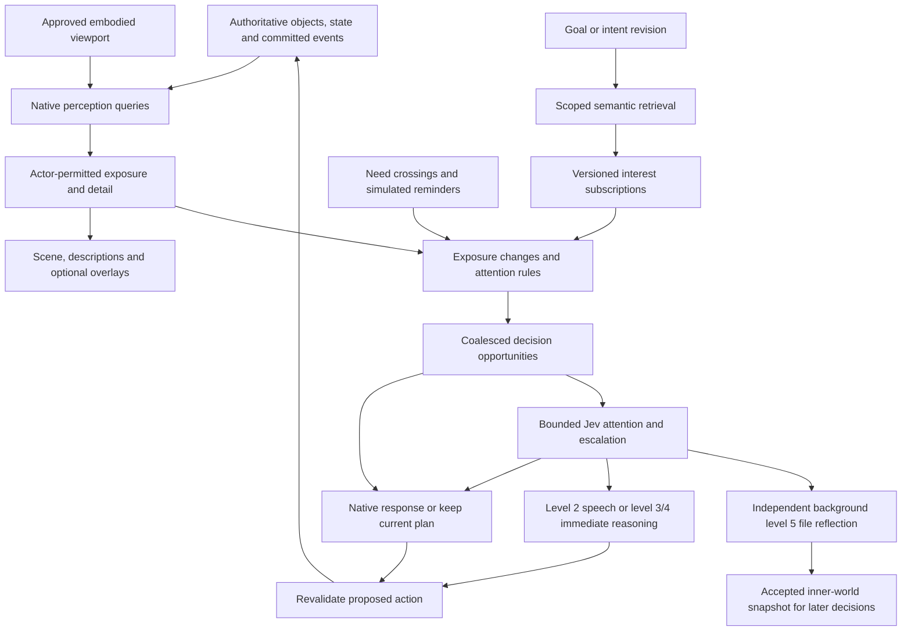

# Perception and sensory evidence

## Spatial input ownership

Common XYZ coordinates, support surfaces, geometric rays/sweeps and navigation belong to the [spatial runtime](spatial-world-runtime.md); this document retains sensory meaning, detail, recognition, localization and intelligibility. Target sight/hearing evaluate body eye/ear anchors against height, extents, floors and openings. Range circles are coarse display aids, not the full propagation volume. Orbit/floor cutaways never move the body or remove its physical occlusion. Playback mute and camera location never change actor hearing. Approved viewport intersection, independent NPC sensing, one active embodied view and D51 hidden-tab/multi-view questions remain intact; the current body-only projection is a documented implementation gap, not a policy reversal. [SW08/SW09](../../docs/maintainers/spatial-world.md) owns new geometric and camera integration; preserve existing sensory acceptance.

This document owns future sensory design: visual exposure, hearing/acoustics, occlusion, detail tiers, player sensory overlays, deterministic propagation and sensory event generation. Current implemented sight/hearing behavior belongs to [Architecture](../../docs/architecture.md); semantic attention and routing belong to [Memory architecture](../../docs/memory-architecture.md). Material choices remain in [Open decisions](../05-project/open-decisions.md), and small implementation gaps may be tracked in the [maintainer TODO](../../docs/maintainers/TODO.md).

[Agency](../../docs/agent-agency.md) contributes private goal/need/result causes through [EPR reaction intake](../../docs/events-perception-and-reactions.md#9-reaction-intake-and-scheduling), without public sensory events. Its goal-derived interests respect actor knowledge and reevaluate bounded current exposures. Actual non-speech sound follows this sensory contract; it must not be relabeled speech to obtain hearing or create a conversation.

## Extensible sense interfaces

Vision and hearing are default supported senses, not the complete list of possible modalities. [World-module runtime](world-module-runtime.md#6-senses-and-observation-interfaces) defines sense registration, shared-source interpretation and typed evidence shapes. This document continues to own detector semantics, sensory quality/recognition, geometry, and disclosure. EPR owns acquisition/episode identity and reaction intake.

A sense may detect an unidentified source, contact surface, region, field or authorized relation rather than a known entity at exact coordinates. Detail dimensions are sense-specific; visual near/medium/far and audible detection/recognition/intelligibility are not one mandatory global scale. Source response may inherit from definitions or be derived, without assigning a new field to every object. Unsupported physical calculations remain explicit host-capability gaps.

## 2. Separate physical exposure from attention and thought

This document owns sensory production. The proposed [events/perception/reactions contract](../../docs/events-perception-and-reactions.md) owns how permitted evidence and perception changes reach reaction intake; the diagram spans these separate responsibilities.

**Exposure** is evidence the character can currently acquire. **Attention** identifies which changes matter to its goals or demand reconsideration. A **decision opportunity** records that something warrants evaluation; it is not a promise of a separate paid call or visible thought. An object can remain available for inspection without interrupting an actor every tick. Memory preserves selected historical exposures even after current visibility ends.

Use native code for geometry, attenuation, detail selection, novelty bookkeeping, known hazards, meter crossings and executable action checks. Jev evaluates attention and escalation for every admitted semantic opportunity. Level 2 handles ordinary speech, levels 3/4 handle complex immediate reasoning, and level 5 independently handles background file reflection. A declaration builder has its separate generation contract. Generated descriptions, tags and semantic matches never authorize effects.

## 3. Visual footprint, detail and the player's screen

Every meaningful world object needs a reusable visual profile: spatial extent, coarse recognizable features, near/medium/far description variants and bindings to supported state. Distance to an object's exposed extent, apparent size, occlusion and receiver conditions determine detail; distance to its center alone is insufficient for a large building. Begin with coarse distance bands and existing terrain occlusion, then extend the policy without changing the observation contract.

The requested three text levels should differ in **available facts**, not merely adjectives:

| Exposure | Example for a tree                                               | Facts to withhold                                                             |
| -------- | ---------------------------------------------------------------- | ----------------------------------------------------------------------------- |
| Far      | “A tall tree with a broad crown.”                                | Bark detail, small damage, exact resource stock or a hidden carving           |
| Medium   | “A mature tree with a broken lower branch.”                      | Small marks, exact material condition and concealed details                   |
| Near     | “Rough bark surrounds a fresh notch; pale chips lie beneath it.” | Internal state that still needs a supported inspection, such as concealed rot |

These are illustrative authoring examples, not evidence of existing tree mechanics. Detection, recognition and detailed inspection are separate. A distant figure can be perceived as a person without identifying Ada. Nearness does not reveal private thoughts, inventory contents or everything inside an opaque container. A known actor may be recognized sooner under an admitted recognition policy; uncertainty must remain explicit.

### Embodied visual parity

The user requests that the character's current visual knowledge agree with what the player can see. Proposed rule: **server-approved world viewport intersected with character line of sight and supported visual detail**. Objects within that view and LOS should be perceivable; off-screen or occluded objects must not add current visual facts. Tune the broad physical field and embodied camera limits together so a normal screen full of nearby landscape is not arbitrarily cut off by today's 10-unit radius.

The client submits camera/viewport intentions; the server validates their extent, mode and revision. It does not accept client claims that an object is visible. The scene, object inspection, action targeting and model context use a compatible exposure snapshot. Pan/zoom updates must not leave a hidden entity inspectable at its old detailed tier. Use neutral presentation while a new snapshot is pending and revalidate commands that require current visual access. Camera motion must not create a paid call per frame.

“On-screen” should provisionally mean the unobscured world camera viewport, not a test of each HUD pixel or whether a label is covered by a menu. Sprite/building occlusion must agree with the world visibility policy. Exact treatment of overlapping panels, narrow screens, extreme zoom and partially visible objects is D51 work; this proposal does not claim the current renderer enforces it.

NPCs have their own spatial perception and attention; their vision must not depend on where a human pans the camera. God/creator inspection is a separately authorized view and does not teach the embodied character its contents. An off-screen object can still be remembered at its last observed state, or heard through a valid sound exposure. Neither is a current visual observation.

**Background-play tension:** the existing unchecked Pause game when hidden setting permits continued simulation. A hidden tab has no literally visible screen. Recommended interim policy is no new player visual exposure while hidden, while NPCs, sound exposure and native simulation continue; do not replay missed sights on return. Resuming rebuilds current exposure. An alternative is continuing a last approved embodied viewport while hidden, but that relaxes the user's strict screen-parity rule and needs a deliberate product decision. A second tab or a god camera must not silently expand the character's sensory field; designate one active embodied view. This remains unimplemented.

### World objects versus decorative art

The description requirement applies to objects the world represents, including people, animals, resources, structures, possessions and meaningful effects. Shared terrain/vegetation patches may supply coarse visual descriptions without allocating an independently simulated entity to every blade of grass. An individually interactable tree needs an authoritative identity and footprint; a renderer sprite alone cannot become wood stock. Distant decorative woodland should at least correspond to a descriptive landscape region, so recognizable scenery is not inexplicable to the character. Promotion from scenery to an interactive object needs an explicit world transition and consistent identity/resource ownership.

## 4. Sound belongs to emissions and processes

A window smash creates a sound emission with an event-time origin, duration, source profile and permitted descriptive variants. It can outlive the window or have no enduring source object. Do not resolve its historical position from wherever an actor or object happens to be later. A moving sustained source emits from its process's current authoritative position at each evaluated interval.

An attached fire can expose a visible flame effect and a sustained crackling emitter. Host attachment links are optional, versioned and cycle-free. There is one process owning fuel/combustion state; visual and audible projections derive from it. An effect entity and a host property must not independently consume the same fuel, duplicate the same sound or create two identical threat interruptions.

Proposed sound model inputs include source strength/profile, distance, intervening material/openings, ambient masking and listener sensitivity. Detection, broad source recognition, direction/localization and speech intelligibility are separate outputs. A listener might hear “a faint sharp crash to the east” without knowing there was a window, who broke it, exact coordinates, or any spoken words. A heard claim is evidence of speech, not evidence the claim is true.

Start with authored, normalized audibility/clarity scores and distance attenuation, plus simple obstacle penalties. Walls should reduce transmission; doors/openings can provide different paths. Vision occlusion cannot serve as a universal all-or-nothing hearing check. Allow a later room/portal or spatial propagation provider to replace initial queries. Material coefficients, masking, weather, vertical floors and fidelity remain tunable; no calibrated acoustics are claimed.

A decibel display is a possible later presentation. It needs an explicit source reference, units and a compatible propagation model; a normalized percentage should not be labeled dB. The game's audibility model also differs from the user's speaker volume or mute setting. Muting playback should not make the character deaf; accessible captions receive the same permitted sound evidence.

## 5. Compact player perception indicators

Add a small perception control with independently toggleable **Vision** and **Hearing** overlays; save these display preferences to the player profile. They are presentation controls and never turn senses or decision triggers off. Exact location/defaults are open; keep the existing compact right-click menu free of extra controls.

- Vision uses a restrained gradient for decreasing detail, with an optional light dotted outer contour and an unobtrusive near/medium/far legend. The geometry is clipped by permitted sight and the embodied viewport. Render only the information the character is permitted to see.
- Hearing uses a soft gradient and an optional faint outer contour. **Its contour describes a named reference sound**, such as ordinary speech, under current listener conditions. Different source strengths have different reaches; a loud crash can be heard beyond that reference contour. A source-specific indication can appear after an actual permitted sound, without revealing a hidden source identity or its exact location.
- Circles are an acceptable first display approximation, explicitly described as such. Existing rock occlusion must still affect real exposure. Later gradients and contours follow walls, openings and other supported propagation geometry instead of requiring a new UI concept.
- Use distinct labels as well as color, adjustable subtle opacity, and reduced-motion behavior. Overlays do not block clicks. A text inspection path exposes the same authorized clarity/detail information.

The server provides either a permitted sample field/contour or sufficient sanitized parameters for drawing an approximation. The client never needs hidden wall interiors or unperceived emitter locations to render it. Overlay precision cannot exceed the information policy: a hearing preview must not reveal an undiscovered room through its detailed transmission shape. The display can remain approximate until that structure is known.

## 6. Shared descriptions with meaningful state variation

Recognition and actor-specific appraisal cannot be replaced by globally cached object importance; see the proposed [shared-source boundary](../../docs/events-perception-and-reactions.md#5-perception-relationships-and-shared-source-work).

Use an archetype's authored description set for ordinary instances. Compose supported state overlays and, when warranted, a small instance-specific override. An admitted new object or action/effect family includes bounded description variants with a safe fallback. The tree example could use `standing`, `felled` and `burning` states; these names are illustrative, not new executable properties.

Each state overlay declares the facts and detail tiers it can affect. A far observer may see flame or smoke without learning the percentage of remaining fuel. A near observer can receive a scorched-bark description. A chopped tree's profile changes only after an authoritative transition; a falling trunk, stump and harvested resources use whatever identity/conservation contract the relevant family admits. See [state ownership](../03-design-proposals/state-systems-and-future-influences.md).

Composition requires precedence and compatibility rules: avoid “healthy leafy crown” combined with “bare charred stump,” deduplicate a fire described through both host and attachment, and limit text length. Supported state changes select native templates or cached authored variants. Optional generation can enrich a distinctive admitted state, but native fallback must be immediate and truthful. **No generation on movement, hover, every flame tick or each copied tree.** Invalid or delayed prose never delays physical state or exposes a stale description as current.

Cache description projections by definition/description version, relevant state revision or bucket, exposure tier, language and audience policy. Do not re-embed or regenerate on every numeric intensity increment; invalidate when a described fact or meaningful tier changes. Perspective-sensitive text must be produced from permitted facts, not a privileged full-state prompt followed by an instruction to hide details.

Persist historical observation payloads, or sufficient immutable versioned facts to reproduce them. Approaching later creates a new near observation; it does not upgrade yesterday's distant memory retroactively. Correcting a belief links evidence rather than rewriting the source experience. Action tooltips and object descriptions should share this projection discipline while remaining distinct contracts.

## 7. Sensory event generation

An external physical occurrence and an individual observer acquiring evidence are distinct. The proposed [private-acquisition boundary](../../docs/events-perception-and-reactions.md#4-scope-and-event-identity) owns their scope and identity.

Deterministic geometry and propagation establish what can reach an actor before any semantic attention step. Exposure changes create bounded typed evidence with source, medium, strength, detail tier, time and audience. Visual and acoustic evidence must remain distinct from belief, memory selection, conversation membership and model attention. Coalesce routine unchanged exposure; preserve meaningful entry, exit, occlusion and state changes without requiring a paid call per object.

## 8. Acceptance criteria

Cross-consumer and private-acquisition coverage belongs to proposed [EPR03](../../docs/maintainers/events-perception-and-reactions.md#epr03--actor-private-perception-acquisition-and-exposure-deltas) and [EPR09](../../docs/maintainers/events-perception-and-reactions.md#epr09--differential-and-performance-acceptance); sensory correctness remains here.

Verify visual and hearing boundaries against deterministic scenes with walls, openings, distance bands, movement and changing sources. Player overlays and actor evidence must derive from the same authoritative geometry while respecting their distinct camera/body scopes. Tests must cover occlusion, partial detail, source disappearance, simultaneous emissions, coalescing, restart and strict exclusion of unseen or unheard facts. Performance evidence must report scene size, moving sources, update cadence and dropped/coalesced events.
