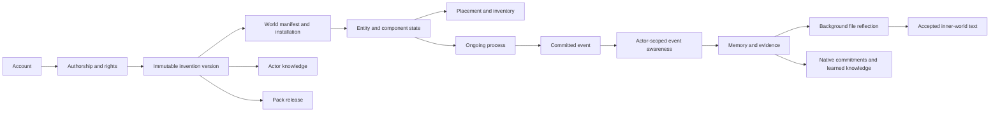

# Production data model

Record ownership, dependencies and transaction design must respect the [gameplay save/load design](../../docs/save-and-load.md). It owns the restoration contract without prescribing these record layouts.

The current personal-world implementation stores whole-world snapshots plus transactional `WorldChanges`, periodic compaction, response receipts and SQLite/PostgreSQL cognition records; PostgreSQL also stores pgvector recall data. [Architecture](../../docs/architecture.md) owns exact current behavior. Records labeled transitional below exist only to bridge that runtime. Normalized production, conversation/story, rights/pack and hosted-operation records remain future target records until implemented.

This document owns target production records, identities, invariants and transaction boundaries. [Data queries and MCP](data-queries-and-mcp.md) owns the durable query interface. [Data delivery and scale](data-delivery-and-scale.md) owns migration, deployment, retention, capacity evaluation and rollout. Existing [declaration](declarations-and-evolution.md), [memory](../../docs/memory-architecture.md), [governance](../03-design-proposals/invention-governance-and-ownership.md), [workshop](../03-design-proposals/world-agent-and-workshop.md) and [billing](billing-and-usage-reporting.md) documents own their product semantics.

## Implementation scope: baseline versus conditional expansion

**Initial target:** one server application, one PostgreSQL database and one authoritative simulation writer per world, with bounded background work. Module names below describe code/data ownership, not separately deployed services. Implement records only for supported gameplay and cognition. Preserve world/actor scope, atomic state changes, durable jobs and receipts, spending reconciliation, versioned migrations and tested recovery from the start.

**Conditional expansion** means retained design guidance, not an immediate implementation obligation. Activate it only for a named feature or measured operational need, recording the trigger and acceptance evidence in the checklist below. The later sections retain the detailed constraints that apply when that capability is enabled.

| Area | Baseline | Conditional expansion and activation condition |
| --- | --- | --- |
| Service and database boundaries | Modules and transactions in one application/database | Separate control/content/work services, cross-service reconciliation and separate credentials/pools when deployment or isolation requires them |
| Authority and placement | One writer per world, expected revision/generation checks and duplicate-command protection | Lease renewal, worker assignment, shard directory/moves and sector transfer protocols when multiple workers can own or take over worlds/sectors |
| Recovery and history | Persist current records atomically; retain required receipts/evidence; test backup/restore | Generic state-change replay, checkpoint watermark vectors and cold archive manifests when historical reconstruction or measured recovery/retention needs justify them |
| Delivery | Same-transaction local updates; bounded durable jobs for asynchronous awareness and paid work | General consumer/outbox infrastructure for independently delivered effects; cross-service messaging when services actually split |
| Content and accounts | Supported definitions, immutable versions, admission and current access checks | Full tenancy, creator libraries, redistribution grants, packs and quarantine protocols when those product features launch |
| Queries and storage | Scoped queries used by current features; ordinary tables and necessary indexes | Broad query compiler/MCP datasets, partitions, replicas, external search and spatial engines when a consumer or measured workload needs them |
| Future mechanics | Records for supported people, possessions, actions and memory | Anatomy, institutions, advanced physical contributions and speculative record families with their consuming mechanics |
| Hosting | A recoverable development deployment | Managed failover, regional placement and release operations before a hosted availability promise or external release requires them |

Cognition keeps its full accepted behavior in [memory architecture](../../docs/memory-architecture.md). These scope labels defer infrastructure, not memory privacy, required embeddings, atomic accepted-text publication or behavioral requirements. Detailed cognition work remains in [CR01–CR12](../../docs/maintainers/cognition-redesign.md); the checklist here owns persistence delivery and links those tasks rather than duplicating them.

## 1. Decisions this design establishes

The companion [real-time synchronization contract](realtime-synchronization.md) explains how in-memory simulation, bounded database batches and browser prediction work together. Its optional future journal-first path requires an explicit persistence-authority migration; it does not weaken the initial PostgreSQL commit-before-confirmation contract below.

1. Use PostgreSQL for the hosted transactional implementation, initially one cluster with separated module schemas and credentials. Target PostgreSQL 18 features; pin an exact supported release and host during implementation. SQLite remains a valid local adapter, using the same logical records and query contracts where supported.
2. Store current entities, inventory, ongoing processes, memories, definitions and history independently. Whole-world JSON is a checkpoint/export format, not the primary operational record or query interface.
3. Use relational columns for identities, ownership, relationships, versions, quantities, status and common filters. Use bounded, schema-versioned JSONB for extensible component/configuration bodies. A new invention creates data under admitted schemas, never arbitrary SQL tables or columns.
4. The simulation works on an in-memory working set. Persist changed records in atomic batches; do not perform an SQL query for every entity on every simulation step.
5. Keep each world's authoritative records together initially. Include `world_id` in all world-local keys and foreign keys so whole worlds can later move between shards. Account services and shared content have separate ownership and distribution boundaries.
6. Present a versioned, permission-aware read model through application APIs and MCP. Consumers do not depend on storage table layouts, shard addresses, or unrestricted model-generated SQL.
7. Separate physical truth, perceived evidence, character belief, creator authorship, platform permissions and accounting. They are different records even when they refer to the same invention or person.
8. Retain committed outcomes and required definition artifacts independently of AI execution traces. Changing simulation time, restoring a checkpoint or copying a world cannot repeat spending or grant account rights.

These are concrete engineering recommendations for the next implementation, not claims that the current code already provides them. Future changes to these decisions require a documented compatibility and migration plan.

## 2. Physical boundaries and module ownership

| Namespace | Canonical owner                            | Initial placement                                | Later separation                                                            |
| --------- | ------------------------------------------ | ------------------------------------------------ | --------------------------------------------------------------------------- |
| `control` | Account/world directory service            | Same PostgreSQL cluster, separate schema         | Account/control database; partition by account or tenant as needed          |
| `sim`     | World authority                            | World shard                                      | Shard by world; multiple simulation workers can own different sectors       |
| `mind`    | Memory service within the game application | Same world shard as `sim`                        | Remains with world initially; actor migration needs an explicit protocol    |
| `journal` | Commit/event service                       | Same world shard                                 | Historical segments can move to archive storage; current commits stay local |
| `content` | Definition and authorship service          | Same cluster, separate schema                    | Content service; immutable authorized copies pinned on world shards         |
| `work`    | Game workflow coordinator                  | Game operations tables, outside rewindable state | Distributed workers/queue behind the same attempt identity                  |
| `read_v1` | Query service                              | Views/projection tables, read-only to consumers  | Replica/search/analytics implementations behind unchanged contracts         |

Namespaces are ownership boundaries, not mandatory services to deploy separately. Cross-module writes pass through their application interfaces. In the initial cluster, use real foreign keys inside each future placement unit. When those modules are deployed across databases, use validated references, immutable local pins, durable outbox messages and reconciliation; do not make shard extraction depend on synchronous cross-database joins. This is conditional expansion: the baseline may use local transactions and constraints without implementing a distributed publication protocol.

When large artifacts or cold archives are needed, object storage holds their immutable bytes; it is not required merely to store ordinary memory text. PostgreSQL holds metadata, authorization and committed references. Redis, a separate vector service, a graph database, Kafka and a warehouse are not launch prerequisites. PostgreSQL full-text search is the initial prose index. Embedding retrieval is required for arbitrary-intent recall; its vector index is derived and rebuildable. Persist source/actor/disclosure scope, source revision and embedding-model version with vectors. The current memory implementation selects OpenAI `text-embedding-3-small`, 512 dimensions, and the PostgreSQL `pgvector` extension. Database-side exact cosine top-N search returns scoped IDs/scores, not the stored vectors; approximate indexing remains conditional on scale and recall measurements. This needs no separate vector service.

Arrows show semantic references and derivation, not synchronous distributed writes. An actor learning a version does not receive its physical output or its account-level rights.

## 3. Identity, time, version and schema conventions

### 3.1 Scope and keys

- `account_id`: authenticated human/platform account, independent of any character. An NPC does not receive a fabricated account.
- `tenant_id`: operational/billing ownership scope. A world belongs to one tenant at a time; tenant transfer is a control-plane operation, not a character action.
- `world_id`: one independently writable simulation namespace, including one chosen timeline. A fork/copy receives a new world ID. `world_lineage_id`, `source_world_id` and `source_checkpoint_id` preserve origin; they confer no write rights.
- `entity_id`: stable object identity within a world, including characters, animals, physical objects, structures and organizations. The canonical reference is `(world_id, entity_id)`. IDs may be retained inside a fork because its world namespace changes; explicit cross-world transfers use fresh destination identities and transfer provenance.
- `sector_id`: world-local simulation ownership/routing boundary. It is not part of an entity's durable identity; moving an entity does not rename it.
- `definition_id`, `version_id`, `artifact_id`: content-service identities. Versions are immutable; hashes identify exact bytes but grant no access.
- `stream_id`: world-local serialized commit authority, such as a sector, a mind or world configuration. `commit_seq` orders commits within that stream. There is no global sequence bottleneck across all worlds.

New opaque IDs use UUIDs generated outside the pure kernel and supplied explicitly, or generated deterministically from saved domain ID state. UUID version choice must not change semantics; timestamps embedded in IDs are never simulation clocks or proof of commit order. Import maps legacy string IDs explicitly. PostgreSQL uses native UUID columns. Wire IDs remain opaque strings.

In table descriptions below, `W` means a required `world_id UUID`, and `id` means the table's UUID identity. A key written `(W,id)` includes both columns in every local reference. Omitting `W` in an illustrative query must never expand access. Global records have their explicit account/tenant/content scope instead.

### 3.2 Common fields

Mutable canonical records carry `row_revision BIGINT`, `created_at TIMESTAMPTZ`, `updated_at TIMESTAMPTZ` and a last commit reference where applicable. Revisions increase under their owner; wall timestamps do not resolve concurrency. Immutable records have creation/provenance and schema versions, not mutable revision counters. Required fields are `NOT NULL`; optional fields are explicitly nullable. Tombstones preserve identity references after death, consumption, destruction or retirement.

Store simulation time as signed `BIGINT` microseconds relative to a world clock origin. `sim_clock_version` pins its interpretation. Birth, age, due dates, elapsed work and fuel use simulation time; memory age, hourly consolidation, daily rest and dream eligibility also use simulation time. Service deadlines, lease expiry, billing and operational archive retention use real UTC timestamps. Pauses and rate changes are committed configuration events. Do not use accelerated time as an event partition key.

Quantities use integral quanta with a pinned unit/scale definition: for example count units or a declared mass quantum. `quantity_q BIGINT >= 0` avoids fractional item ambiguity. Checked conversion/overflow is required; large counters and 64-bit values cross JavaScript/JSON boundaries as decimal strings. Continuous simulation values use the registered component's numeric representation, bounds, precision and units; reject non-finite values. Currency uses exact integers/decimal strings with an explicit currency and scale, never floating-point totals.

Maintain distinct versions for storage migrations, public query contracts, component schemas, definition bodies, simulation builds, context templates and AI execution tasks. An engine upgrade cannot silently reinterpret a saved component or an old recipe.

### 3.3 JSON and extension rules

JSONB belongs on one cohesive component or configuration, not on an entire character biography or world. Each body identifies a registered schema version with size/depth limits, typed references, units, unknown semantics and an update owner. Relationship and identity fields that need joins live in columns or link tables. Avoid a universal entity-attribute-value table for every number, and avoid an unbounded `metadata` escape hatch.

Frequently queried fields are first-class columns, or deliberately indexed expressions/projections. A new optional field can begin in JSONB; promotion to a column uses a backfill and compatible read view. It never changes the public field's meaning in place. Add selective JSON indexes for demonstrated filters, not a broad GIN index on every hot component. PostgreSQL documents the JSONB operators and indexing choices in its [JSON type reference](https://www.postgresql.org/docs/18/datatype-json.html).

Unknown, known, not applicable and unsupported remain distinct values according to the component contract. A missing moisture component is not equivalent to zero moisture. Text descriptions and unregistered JSON fields never acquire simulation authority.

## 4. Accounts, worlds and simulation ownership

**Conditional expansion:** shard locators, tenant membership hierarchies, worker leases and distributed grant propagation apply when hosting/ownership features consume them. Start with the current access model, world identity and one writer. Keep expected revision/generation checks; a lease service is not required for a single writer. The catalog below reserves the larger model without requiring every table initially.

The catalog identifies the complete target record families. Delivery phases specify which are implemented first; reserved families should not become empty speculative tables without a consuming feature.

| Table                                   | Key and essential fields                                                                                                                                           | Invariants / access paths                                                                                                                                             |
| --------------------------------------- | ------------------------------------------------------------------------------------------------------------------------------------------------------------------ | --------------------------------------------------------------------------------------------------------------------------------------------------------------------- |
| `control.accounts`                      | `account_id`; identity-provider subject reference, status, display profile                                                                                         | Unique provider/subject; private authentication data outside game records                                                                                             |
| `control.tenants`, `tenant_memberships` | Tenant ID; `(tenant_id,account_id)`, role/grant revision                                                                                                           | Tenant membership does not automatically reveal NPC memory or confer character control                                                                                |
| `control.world_directory`               | `world_id`; tenant, lineage/source refs, shard locator, placement generation, lifecycle                                                                            | Routes every world query; names/slugs are mutable labels, not keys                                                                                                    |
| `control.world_memberships`             | `(world_id,account_id)`; explicit roles, validity, grant revision                                                                                                  | Index `(account_id,status,world_id)` for account world lists; projected access grants are revoked through a fenced protocol                                           |
| `sim.worlds`                            | `W`; seed/origin, pinned profile/manifest IDs, world policy revision, clock origin/version, manual/absence policy, lifecycle                                       | Local authoritative effective configuration; directory contains a projection, not a competing copy                                                                    |
| `sim.world_policy_versions`             | `(W,policy_version_id)`; independent agent/player invention lock values, explicit owner exception policy, contribution terms refs, admission limits, author/reason | Immutable history; effective pointer changes atomically; default owner exception is disabled until product chooses otherwise                                          |
| `sim.sectors`                           | `(W,sector_id)`; bounds, topology revision, authority stream, committed simulation time, loaded state                                                              | Index world/bounds; starts with one sector; moving boundary requires an explicit migration                                                                            |
| `sim.commit_streams`                    | `(W,stream_id)`; kind, sector/actor ref, head sequence, writer epoch, lease owner/expiry, optional pinned RNG algorithm/state and identity counter                 | One current writer per stream; compare and lock head/epoch in every authoritative transaction; random draws and deterministic ID allocation commit with their effects |
| `sim.controller_leases`                 | `(W,actor_id)`; controller kind, account ref if human, generation, expiry                                                                                          | Shared character model for human/NPC; replace generation on takeover; reject stale intentions                                                                         |
| `sim.actor_progress`                    | `(W,actor_id,milestone_key)`; completed time, evidence, versioned milestone definition                                                                             | Durable onboarding/achievement facts outlive the recent feed; account achievements, if added, are separate projections                                                |
| `sim.region_chunks`                     | `(W,sector_id,chunk_key)`; terrain schema/version, compact tile/height data or blob pin, revision                                                                  | Coarse bounded chunks, not one row per terrain cell; change and stream chunks independently                                                                           |
| `sim.environment_cells`                 | `(W,sector_id,cell_key,family_id)`; family schema, state JSONB, last integrated time                                                                               | Weather/field values stored only when supported; spatial indexes serve relevant cells                                                                                 |

For distributed grant enforcement, effective world grants used for admission are installed with a revision in the world shard. Authorization checks cannot accept an indefinitely stale membership cache. A revocation completes only after active authorities are fenced or acknowledge the new minimum grant revision; unavailable authorities stop accepting relevant commands. Account lookup failure never means broader permissions.

When a separate control authority supplies grants, the local grant projection is `work.world_access_grants`, keyed by `(world_id,principal_kind,principal_id,capability)`, with issuer/tenant reference, source grant revision, status, valid interval and synchronization watermark. It lives beside the world for enforcement but is outside rewindable checkpoints. It is rebuilt from control authority, not independently edited by the simulation. Restore/fork reauthorizes access and controller leases instead of reinstating revoked accounts from a historical save.

## 5. Entities, people, traits and relationships

| Table                   | Key and essential fields                                                                                                          | Invariants / indexes                                                                                                                                                                  |
| ----------------------- | --------------------------------------------------------------------------------------------------------------------------------- | ------------------------------------------------------------------------------------------------------------------------------------------------------------------------------------- |
| `sim.entities`          | `(W,entity_id)`; kind/family ref, name, lifecycle, definition pin, home sector, provenance                                        | Identity header; `(W,home_sector,lifecycle,kind,entity_id)`; lifecycle tombstone does not erase history                                                                               |
| `sim.entity_components` | `(W,entity_id,family_id)`; schema version, payload JSONB, owner rule pin, initialized state, revision                             | At most one authoritative component per canonical family; migrations change schema/owner explicitly                                                                                   |
| `sim.characters`        | `(W,entity_id)`; species/body definition pins, birth/death time, authored background, presentation refs                           | Human and NPC bodies share this table; controller kept separately                                                                                                                     |
| `sim.animals`           | `(W,entity_id)`; species pin, behavior family/state                                                                               | Native animal control need not create an NPC mind                                                                                                                                     |
| `sim.actor_vitals`      | `(W,entity_id)`; health, fullness, energy, incapacity state, integrated time                                                      | Dedicated hot component storage for supported native needs; bounds from pinned contract; entity lifecycle is canonical for death and no duplicate vitals copy lives in component JSON |
| `sim.character_traits`  | `(W,actor_id,trait_definition_id)`; pinned definition, typed value JSONB, source/evidence ref, confidence, change policy          | Sparse stable traits and values; temporary moods and skills have distinct families; fictional traits do not infer real-user attributes                                                |
| `sim.entity_relations`  | `(W,relation_id)`; type pin, source/target entity FKs, role, bounded configuration, effective state                               | Index both directions `(W,source_id,type_id)` and `(W,target_id,type_id)`; relation contract defines symmetry, cardinality and permitted cycles                                       |
| `sim.body_conditions`   | `(W,condition_id)`; actor/part refs, condition definition pin, severity/state, cause/evidence, process ref                        | Future anatomy/injury family; body parts use ordinary entity identities and admitted part relations                                                                                   |
| `sim.group_memberships` | `(W,group_entity_id,member_entity_id,role_id)`; effective interval/status                                                         | Future households/institutions; authoritative membership is distinct from affection or a belief about membership                                                                      |
| `mind.relationships`    | `(W,observer_actor_id,other_entity_id)`; free-text assessment, memory evidence links, accepted-text revision | Sparse directional projection of accepted inner-world text; freely revisable by the observer, no relationship points or score thresholds and no second writable biography |

`entity_components` is an extension store, not a second owner for `actor_vitals`, placement, quantity or inventory. A component registry records the native table adapter or JSON adapter for each family. Query views unify them. Promoting a family to native columns transfers ownership through a migration; both stores never independently update the same quantity.

Separate objective relations (a beam supports a roof; a person belongs to a household) from an actor's belief/appraisal about them. Structured character relations such as blood kinship are unchanging facts represented by typed `sim.entity_relations`; subjective descriptions cannot mutate them. Unstructured relationships follow the accepted [character design](../03-design-proposals/agents-and-social-simulation.md#social-continuity), with memories informing freely editable descriptions. Assembly and support relations use typed roles, ports and configuration under a registered definition. Bounded cycle/cardinality checks run in the same transaction as changes. A database FK proves endpoints exist; it does not prove a structure is physically stable.

Future [player-designed stats](../03-design-proposals/agents-and-social-simulation.md#player-designed-stats) use admitted declarative definitions and versioned character state, not a fixed column or code branch per stat. Definitions own effect parameters, check triggers and resolution. Creation requires god-mode authority; exact schemas and migration rules remain open. Existing `actor_vitals` describes prototype storage, not completion of this target.

## 6. Possessions, inventory, resources and construction

Every independently persistent physical item/stack is an entity. A distinctive tool is normally a quantity-one lot; homogeneous stones can share a stack. This avoids two identities for an object when it moves from terrain into a bag or becomes a roof part.

| Table                         | Key and essential fields                                                                                                  | Invariants / indexes                                                                                                                                                |
| ----------------------------- | ------------------------------------------------------------------------------------------------------------------------- | ------------------------------------------------------------------------------------------------------------------------------------------------------------------- |
| `sim.item_lots`               | `(W,entity_id)`; item/material definition pin, quantity quanta, unit pin, stack-equivalence signature, quality/state refs | Nonnegative quantity; zero quantity retires the lot; never merge items with incompatible state, provenance obligations or pinned mechanics                          |
| `sim.containers`              | `(W,entity_id)`; container definition, capacity rules, inventory revision                                                 | A character body, bag, chest or worksite may expose a container; capacity is checked on mutations                                                                   |
| `sim.entity_placements`       | `(W,entity_id)`; mode, sector/position OR parent container OR attached parent/port; ordering/slot fields                  | Exactly one placement per active physical entity; SQL CHECK enforces mutually exclusive modes; parent FKs are world-local                                           |
| `sim.ownership_interests`     | `(W,interest_id)`; object entity, holder entity, interest type, share/claim data, evidence                                | In-world ownership/claims are separate from physical custody, access policy and account authorship; admitted rule resolves disputes                                 |
| `sim.resource_reservoirs`     | `(W,entity_id,reservoir_id)`; material/unit pin, remaining quanta, renewal process ref                                    | Trees, berry bushes, deposits and carcass yields; finite source debited when output lots are credited                                                               |
| `sim.resource_transfers`      | `(W,transfer_id)`; commit ref, reason/recipe/process, source/sink refs                                                    | Durable discrete transfer evidence; typed source/sink endpoints and quantities in child rows; aggregate quantities are not reconstructed per tick from ledger scans |
| `sim.resource_transfer_lines` | `(W,transfer_id,line_no)`; reservoir/lot/external declared source-sink, quantity/unit, direction                          | World-local FKs where endpoints persist; conversion rules explicitly account for waste/outputs, not universal mass conservation for all game abstractions           |
| `sim.resource_reservations`   | `(W,reservation_id)`; process, source lot/reservoir, quantity, state, expiry                                              | Lock source rows in deterministic ID order; available quantity minus active reservations cannot go negative                                                         |
| `sim.spatial_projection`      | `(W,entity_id)`; sector/cell, effective bounds/position, source placement revision                                        | Derived spatial lookup for contained/attached objects; authoritative validation traverses current placements; source version reveals staleness                      |

Contained or attached objects derive world position from their parent. One canonical placement prevents a cloak simultaneously being worn and serving as a roof. Physical attachment belongs to placement; extra support/contact relationships belong to `entity_relations` and cannot independently move the object. Container/attachment ancestry must be acyclic and depth-bounded. Index `(W,parent_container_id,entity_id)` and `(W,attached_parent_id,port_id)`; enforce slot uniqueness where the container contract requires it.

Inventory is a query over containment, not a separate authoritative JSON list on the character. Equipping is a validated slot/attachment transition. Possessing, owning, knowing how to use, and being permitted to take an object remain separate questions.

A split creates a new lot identity and debits the original in one transaction; a merge retires the source identity with explicit lineage. A quantity-one named or damaged object preserves identity. Crafting, harvesting and eating atomically update quantities, reservations, output identities, process progress, receipts and events. Transfer records explain discrete meaningful changes; continuous fuel drain belongs to saved process/reservoir state and bounded commit changes, not a new accounting row for every simulated microsecond.

Use chunk/cell indexes first; add PostGIS or a different spatial index only behind the spatial query port when actual geometry/radius workloads warrant it. The renderer's mesh, screen coordinates and interpolation never become physical authority.

## 7. Processes, actions and contributions

| Table                       | Key and essential fields                                                                                                                                                                                        | Invariants / indexes                                                                                                                     |
| --------------------------- | --------------------------------------------------------------------------------------------------------------------------------------------------------------------------------------------------------------- | ---------------------------------------------------------------------------------------------------------------------------------------- |
| `sim.processes`             | `(W,process_id)`; sector, initiator/owner entity, action definition pin, state/stage, start/integrated/due simulation times, duration/work remaining, input configuration, plan generation, interruption policy | Partial index `(W,sector_id,due_sim_time,process_id)` for active processes; pinned rules survive definition updates only when compatible |
| `sim.process_participants`  | `(W,process_id,entity_id,role)`; contribution/allocation                                                                                                                                                        | Shared work without inventing a second owner for the result                                                                              |
| `sim.process_bindings`      | `(W,process_id,binding_name)`; typed entity/definition/reservation refs                                                                                                                                         | Exactly one declared target kind; explicit FKs or local definition pins; missing prerequisites cannot hide in prose                      |
| `sim.process_contributions` | `(W,contribution_id)`; process, target entity/family, type, rate/event parameters, source accounting, effective interval                                                                                        | Registered interface and units; unique source/target/stacking key prevents double application                                            |
| `sim.action_receipts`       | `(W,command_id)`; body digest, principal/command epoch/controller generation, application outcome, commit ref, result refs, admitted/expiry times                                                               | One logical command result; an identical retry returns it and a changed body conflicts for 24 hours; expired epochs are rejected, never reevaluated |

Do not store a database row per walking animation frame. Save current path/work state as a bounded process component, and save authoritative placement in the same batch. Completed/canceled process details move to historical storage after their retention horizon; durable receipts and retained event summaries preserve the promised query coverage.

One family owns a changing property. Contributions from rain, drying and contact are resolved from a consistent start-of-step view and applied once. Evolving declarations may add admitted contribution types or state families; they cannot create independent competing owners for wetness or energy. A process consuming fuel preserves elapsed work and remaining fuel through pause, restart and validated migration.

## 8. Minds, evidence, knowledge and conversation

The canonical [memory architecture](../../docs/memory-architecture.md) owns these semantics. These are proposed tables, not a delivered migration. Accepted text, raw experience, summaries and native obligations have distinct owners:

| Table | Key and essential fields | Invariants / indexes |
| --- | --- | --- |
| `mind.event_awareness` | `(W, actor_id, EventRef)`; perceived English text or scoped projection, modality/detail, awareness sequence and game time | One actor/event awareness binding; includes the player; actor/time/sequence and source-event indexes; never an unrestricted join to hidden event payload |
| `mind.inner_world` | `(W, actor_id)`; one current `text` value, revision, accepted workspace snapshot ref, publication job ID | Single current accepted row per actor; atomic publication after bounded file validation; previous text remains readable during reflection |

`mind.memory_entries.narrative` is required English text. Add source coverage and consolidation status sufficient to summarize the union of raw memories and aware events once per actor. `mind.event_awareness` specializes the experiential audience join; existing `journal.event_audiences` must reuse it for actor witnessing rather than maintain a second independent awareness authority. Administrative grants are separate and never confer character knowledge. `mind.observations` can retain non-event exposures/delivery evidence, but must not duplicate every aware event as another recallable raw memory.

Hourly jobs consolidate experiences older than six game hours; raw recall uses the latest six hours, selected alongside eligible summaries. All source IDs, watermarks and revisions remain repository/job metadata. Consolidation does not rewrite the accepted inner-world text: background reflection authors files, then the server publishes their combined text. Existing typed obligations, knowledge and native mechanical facets retain authority independently of prose. The query projections below must not create another writable narrative authority or a required mind-patch response for speech. [CR05–CR07 and CR11](../../docs/maintainers/cognition-redesign.md) cover schema, retention, snapshot recovery and legacy import.

All mind tables are world- and actor-scoped. Character traits describe the fictional person; the mind's goals, memories and appraisals describe its present perspective. Keeping these independently queryable is necessary for retrieval and author inspection without loading every resident.

| Table                          | Key and essential fields                                                                                                                                                   | Invariants / indexes                                                                                                           |
| ------------------------------ | -------------------------------------------------------------------------------------------------------------------------------------------------------------------------- | ------------------------------------------------------------------------------------------------------------------------------ |
| `mind.minds`                   | `(W,actor_id)`; mind stream, revision, observation watermark, plan generation, compact working context, retention policy/version                                           | Small current header, not a biography; no private copy of canonical inventory/health                                           |
| `mind.observations`            | `(W,actor_id,observation_id)`; actor observation sequence, optional source EventRef/delivery binding, non-event perceived payload/schema, source kind, simulation/recording times, confidence, delivery status | Unique `(W,actor_id,source_delivery_key)`; index `(W,actor_id,observation_seq)`; event deliveries reference awareness; do not copy a recallable event payload |
| `mind.memory_entries` | `(W,actor_id,memory_id)`; raw-personal/consolidated kind, source coverage/watermark, observed/heard/inferred/imagined or future `self_thought` attribution, English narrative, salience/confidence, time range, retention/revision; unique response/component source for accepted private thoughts | Index `(W,actor_id,retention_state,kind,sim_time,memory_id)` plus scoped full-text search; narrative/actor byte quotas |
| `mind.memory_entities`         | `(W,actor_id,memory_id,referenced_entity_id,role)`                                                                                                                         | Composite FK to the same actor's memory; index `(W,actor_id,referenced_entity_id,memory_id)`                                   |
| `mind.evidence_sources`        | `(W,actor_id,evidence_id)`; authorized observation/memory ref, provenance summary, optional journal locator, availability/redaction state                                  | Compact source capsule can outlive hot journal payload; a locator is not authorization to read the underlying event            |
| `mind.memory_links`            | `(W,actor_id,link_id)`; source memory, target memory/evidence, relation type                                                                                               | Supports/contradicts/derived-from/supersedes; explicit target-kind CHECK and same-actor FKs                                    |
| `mind.goals`                   | `(W,actor_id,goal_id)`; objective, priority, status, parent goal, evidence, due time                                                                                       | Native executable plan state or a derived index of the accepted inner-world revision; bounded depth; never independent authored prose                                  |
| `mind.commitments`             | `(W,commitment_id)`; attributed promise/obligation, status, due simulation time, evidence, revision                                                                        | No commitment from an unsupported paraphrase; index active due commitments; creation quota protects finite storage             |
| `mind.commitment_participants` | `(W,commitment_id,actor_id,role)`; participant-visible interpretation/access                                                                                               | Each participant's knowledge/access explicit; a secret promise does not become publicly readable through a join                |
| `mind.known_capabilities`      | `(W,actor_id,capability_id,version_id)`; awareness/proficiency, learned time/source, evidence, compatibility state                                                         | Knowing a version is separate from installed support or owning the output; index `(W,actor_id,capability_id)`                  |
| `mind.appraisals`              | `(W,actor_id,appraisal_id)`; type, cause/target refs, intensity, decay, evidence, stacking key                                                                             | Supported native mechanical affect or a derived accepted-text index; separate from stable traits; bounded stacking prevents duplicate fear                     |
| `mind.conversations` | `(W,conversation_id)`; modality, lifecycle, start/end, current generation, timeline head, end reason and optional merged-into conversation | Persistent in-world conversation independent of provider sessions and World Agent tabs; merges do not rewrite history |
| `mind.conversation_participants` | `(W,conversation_id,actor_id,interval_id)`; join/leave boundaries, role/reason and transition ref | Membership intervals separate from awareness; initial one active conversation per actor; hearing alone does not join |
| `mind.conversation_transitions` | `(W,transition_id)`; conversation/source/destination, actor set, start/join/leave/merge kind, sequence and idempotency key | Atomic lifecycle/merge receipts; bookkeeping is not fabricated observable speech |
| `mind.conversation_turns`      | `(W,conversation_id,turn_id)`; speaker, committed speech EventRef, text/artifact ref, turn sequence, interruption state                                                    | Speech committed once; text references the shared event/projection without duplicate recall; private reflection and audio retention are separate                            |
| `mind.conversation_audiences`  | `(W,conversation_id,turn_id,actor_id)`; permitted modality/content scope                                                                                                   | Per-turn view of event awareness; no second audience authority or retroactive access for later joiners                                                        |
| `mind.memory_jobs`             | `(W,actor_id,job_id)`; type, input watermark/revisions, status, result proposal, execution ref                                                                             | Idempotent ingestion/consolidation; job completion never overwrites newer observations                                         |

Directional `mind.relationships` is defined in section 5; evidence joins are actor-scoped like memory links. Subjective beliefs live in `mind.inner_world.text`; attributed raw testimony and consolidated experience remain in the experience stores. Queryable belief fields, goal prose and relationship assessments derive from the accepted snapshot revision if needed, with support/contradiction links retained. Legacy belief rows migrate without loss, rather than remaining a second prose authority. Do not introduce a separate knowledge-graph service initially.

`mind.thought_history` stores world/actor/job identity, accepted snapshot revision, simulation/recording time and bounded presentation thoughts (at most 20 words each, finite count per job). It is god-only and never an extra NPC recall source. Rest/sleep episode identity, accumulated daily rest and continuous sleep time belong to saved native actor state; the daily accounting policy remains an explicit implementation choice.

Inner-world publication atomically validates the staged file set, accepted revision and job identity, replaces the one current text row, and appends its short thought presentation. Failed or duplicate export cannot partially publish, and concurrent raw observations remain untouched. Workspace staging is editable; only accepted PostgreSQL text is used by decisions.

The future [NC response/conversation design](../../docs/narration-and-conversations.md) adds recallable accepted immediate thoughts to `mind.memory_entries`, distinct from reflection's god-only presentation history. Accepted speech/actions use self-awareness rather than copied raw memory. Every speech event has exactly one conversation; an action may have one; global events remain unbound. Founding addressees join with the first speech, later speakers join without retroactive awareness, and last-member departure closes the conversation. A merge atomically closes the source and transfers active participants to the destination; earlier events keep their original IDs/audiences. These are future NC migrations, not claims about deployed CR tables.

### Reliable observation and memory updates

The proposed [EPR scope and intake contract](../../docs/events-perception-and-reactions.md#4-scope-and-event-identity) requires explicit source typing and owner scope for private acquisition/internal records. It does not require a new global table or broadcasting private state; storage and transaction contracts remain here.

The later [perception and attention proposal](perception-and-attention.md#7-sensory-event-generation) specializes these records: event-aware projections and non-event `mind.observations` preserve modality, perceived detail/intelligibility, recognition uncertainty, event-time origin evidence and relevant description/policy revisions. Historical far observations must not acquire today's near detail. Sensory profiles belong to versioned definitions; emission state belongs to committed events/processes. Semantic object/event indexes and actor interest subscriptions are derived, versioned projections with scoped queries and rebuild behavior, not second authoritative inventories or permission grants. Future schema migrations must define reminder/encounter delivery keys and retention explicitly; none are implemented by this documentation addition.

For an event with at least one aware actor, the world commits the shared experiential event and durable actor-awareness delivery envelope together. The future NC04 policy also keeps notable unwitnessed external events using a stored trusted score/reason/policy version, with zero awareness rows. Other unwitnessed transitions commit state/recovery evidence without retaining experiential rows. The envelope records audience and observation policy/version at event time, or an immutable bounded observation payload; it does not recompute yesterday's listeners from today's positions. Ingestion may be asynchronous and is idempotent per actor/delivery key. Active promises and recent addressed speech must be available to context through a bounded pending-delivery overlay or a wait for the actor watermark; search-index lag cannot erase them.

Routine observation ingestion and consolidation lock the relevant mind revision, not the world's global clock. A consolidation proposal records input IDs/revisions and observation watermark. Apply only compatible changes; append-only observations after that watermark remain intact. World actions still go through the world authority even when the mind proposes them.

Memory forgetting removes records from active recall and invalidates derived indexes/provider sessions. Creator audit retention is separate. Protected commitments have an explicit finite limit and resolution policy. No provider's full conversation session is an invisible second memory source.

Historical event links may outlive the event payload. Keep enough attributed evidence to explain the memory honestly and mark original evidence unavailable when removed. Do not use an FK to a time-expiring journal payload as the only representation of a lifelong memory's provenance.

## 9. Inventions, configuration, rules, rights and packs

Definitions are shared immutable content. Installations are world-local permissions and version selections. Physical outputs are entity instances. Character knowledge and account authorship are independent links to those definitions.

| Table                                     | Key and essential fields                                                                                                                     | Invariants / indexes                                                                                                                      |
| ----------------------------------------- | -------------------------------------------------------------------------------------------------------------------------------------------- | ----------------------------------------------------------------------------------------------------------------------------------------- |
| `content.definitions`                     | `definition_id`; kind, namespace, origin world/actor references, lineage root, lifecycle                                                     | Stable invention/material/recipe/state-family identity; names are nonunique searchable labels                                             |
| `content.definition_versions`             | `version_id`; definition, version label, canonical digest, schema/runtime/ABI refs, declaration body JSONB, artifact refs, created by/source | Immutable after creation; unique `(definition_id,version_label)`; digest verified against canonical bytes                                 |
| `content.definition_dependencies`         | `(version_id,dependency_version_id,role)`; compatibility contract                                                                            | Exact version pins and complete closure; bounded graph; algorithm/runtime cycles admitted only under an explicit supported contract       |
| `content.definition_parameters`           | `(version_id,parameter_key)`; type, units, bounds, default/required/unknown policy, visibility, owner                                        | Queryable parameter catalog generated from the canonical declaration in the same publication transaction; not a second editable copy      |
| `content.definition_effects`              | `(version_id,effect_key)`; operation family, read/write family refs, resource contract, preconditions/configuration                          | Declared effects, not a proof of every future consequence; finite trusted operations or gated algorithm refs                              |
| `content.artifacts`                       | `artifact_id`; digest, byte length, media kind, object key, storage state, schema/runtime ref                                                | Immutable bytes after verification; authorization in separate grants; object path/URL is not the identity                                 |
| `content.artifact_references`             | owner kind/ID, artifact ID, retention reason                                                                                                 | Durable pins for versions, packs, checkpoints, admissions; garbage collection requires no live references and a grace/reconciliation pass |
| `content.authorships`                     | `authorship_id`; definition/version, account or explicit NPC-origin identity, role, origin proof, contribution-terms version                 | Attribution does not imply exclusive legal ownership; co-authors allowed; NPC beneficiary policy unresolved                               |
| `content.rights_grants`                   | `grant_id`; issuer/grantee scope, version/pack scope, permitted operations, terms version, effective/revocation conditions                   | Operation, inspect, export, modify and redistribute are distinct; old grants not silently rewritten                                       |
| `content.candidates`                      | `candidate_id`; proposed version/bundle, request/authoring provenance, state, rejection reasons                                              | Draft, validated, rejected and admitted are distinct; generated output alone is not an invention installed anywhere                       |
| `content.validation_runs`                 | `validation_id`; exact candidate digest, validator/build version, fixtures/results, resource tests, migration evidence                       | Evidence attached to exact bytes; distinguish fixture tests from live model evaluation                                                    |
| `sim.definition_pins`                     | `(W,version_id)`; immutable local declaration, digest, dependency/artifact pins, authorized grant evidence                                   | World operates using available validated pins; no per-tick calls to the content service                                                   |
| `sim.world_manifests`, `manifest_entries` | `(W,manifest_id)` and `(W,manifest_id,definition_id)`; versions, effective profile/schema, previous manifest                                 | Immutable complete effective selection; definition pin FK; activation chooses a new manifest atomically                                   |
| `sim.definition_activations`              | `(W,activation_id)`; old/new manifest, candidate/grant refs, author, policy revision, migration receipt, effective commit/time               | Append-only success/failure record; stale policy and lock changes prevent activation                                                      |
| `sim.state_family_registry`               | `(W,family_id)`; canonical aliases, schema/units, active owner version, contribution interface, storage adapter                              | Unique active owner; alias changes do not semantically merge unrelated quantities without validation                                      |
| `sim.anticipated_influences`              | `(W,influence_id)`; family/cause/consumer refs, applicability, missing dependencies, uncertainty, status, evidence                           | Explicitly inactive until admitted; unknown future effects do not participate in physics                                                  |
| `work.workshop_sessions`                  | `session_id`; world, authorized account, objective, base manifest, drafts/diffs, status, execution refs                                      | Separate permission and budget; draft workspace cannot mutate active rules                                                                |
| `content.pack_releases`, `pack_entries`   | `release_id`; source world/manifest, terms and manifest digest; pinned entry versions/dependencies/history index                             | Immutable release; complete inventory distinct from eligible export payload; label blockers/partial exports                               |
| `read_v1.account_inventions`              | Account-scoped projection of authorships, versions, origins, rights and world installations                                                  | Rebuildable index; account access survives leaving a host under recorded retention/rights policy                                          |

`definition_versions` is the canonical declaration body. Parameter/effect tables are exact normalized projections produced and checked on publication, so an inspector can search units and affected systems without parsing every body. Queries expose both structured details and the original authorized configuration/source. A hash never establishes ownership, safety, semantic equivalence or the right to download a private artifact.

A recipe version declares material roles, quantities, work, supported outputs, prerequisites, interruption behavior and operation-family references. Item/material defaults live in definitions; workmanship, wear, wetness and remaining fuel live on instances. Per-instance configuration is permitted only by a pinned definition schema. Altering allowed bounds or adding persistent mechanics creates a new version/admission, rather than hiding a world-rule edit in an instance field.

### Publication and activation across services

**Conditional expansion:** this protocol applies to a separately owned catalog and asynchronous account/pack projections. Initially, supported content admission can use one local transaction with immutable definitions, validation and an activation receipt. Full rights/pack records become required with those features; existing access and admission checks remain mandatory.

1. Store candidate bytes and artifacts durably; validate scope, dependencies, compatibility and contribution terms. Register account attribution/rights and a durable creator capsule before making it eligible for world installation.
2. Stage authorized immutable local pins. Missing content, rights evidence or migration evidence keeps the candidate uninstalled.
3. At a world boundary, validate the current policy/lock and expected manifest, migrate or finish incompatible processes, and commit pins/manifest/activation receipt and events together.
4. Publish the committed installation through the outbox. Account and pack indexes may lag and disclose watermarks; an authorized lookup can consult the origin admission receipt while the index catches up.

There is no distributed transaction between a world and the global catalog. Staged unused versions are harmless retained candidates, not secretly active mechanics. World closure/export must reconcile outstanding publication records before deleting their only evidence. Registry outage can delay new installation while existing pinned gameplay continues. A global safety quarantine uses an explicit revocation/fencing protocol; ordinary content-service unavailability does not silently change laws.

With multiple sectors on one world shard, a world-wide manifest change quiesces and locks affected authority heads in stable order, verifies a common activation boundary and commits migration/pins together. The normal simulation does not take that world-wide lock each tick. Physical sector sharding requires a prepare/commit activation protocol and a consistent manifest epoch in every read; until that protocol is implemented, such changes require a whole-world maintenance pause. Never expose a world whose mutually dependent sectors unknowingly run incompatible definitions.

Retain active versions, versions referenced by instances/processes/checkpoints, and creator-owned capsules under their respective policies. Model-run expiry cannot garbage-collect them. Pack export includes authorized definition closure and attribution; live people, items, private memories, conversation and account permissions require a separate state-copy operation.

## 10. Journal, commits, history and checkpoints

Experiential `journal.world_events` are the logical master catalogue for external occurrences, including speech, expressions, actor/animal actions and natural events. Retain rows with actor awareness or a configured notable importance score; the unseen-notable exception is future NC04 work. Unwitnessed non-notable occurrences still update canonical state and required commit/change/receipt records, but their experiential rows are discarded. Retention grants no actor knowledge; creator queries must label absent history honestly. Private thoughts and Narrator prose are not world events, and system/accounting audit records remain separate.

### Future player-private narration records

The [NC storage specification](../../docs/narration-and-conversations.md#7-proposed-persistence-and-indexes) owns detailed proposed fields and delivery order. Add `story.narrations` for owner-player prose, perspective/mode, optional conversation, stable display anchor, covered time range, voice/template revisions, input digest and idempotent generation receipt. Index player/conversation/order and player/Journal time. Store `story.narration_world_events` as an explicit many-to-many join using complete EventRefs; typed entity, action, transition and restricted private-source joins preserve other provenance. `story.narration_impacts` projects actual effect receipts and never applies effects. Existing player profiles own narrator voice preferences.

These records are descriptions, not external occurrences, awareness or actor recall. Ordinary prose requires authorized event sources; deterministic lifecycle notices instead reference a conversation transition. A global event has no conversation ID and can source separate private narrations in several conversations. Transcript queries combine viewer-permitted conversation events with owned narration; membership is not read authorization. Publication atomically commits prose, sources and impact projections. Retention preserves scoped source capsules or unavailable/redacted locators without exposing hidden payloads; corrections/revocations invalidate affected derived prose. No story tables are implemented by this specification update.

Separate the high-level player/creator journal from current saved state. Generic state-change replay, checkpoint vectors and archive segments below are conditional on offering reconstruction or requiring that recovery strategy; baseline recovery may restore transactional current records from verified backups without replay. Required commit identities, receipts, awareness and retained memory evidence are still durable. When checkpoint replay is enabled, separate its lower-level changes from the high-level journal. An event such as `item.crafted` describes a meaningful committed outcome. A component update such as remaining work is a state change and need not create a visible event each tick.

| Table                       | Key and essential fields                                                                                                                                                  | Invariants / indexes                                                                                                                        |
| --------------------------- | ------------------------------------------------------------------------------------------------------------------------------------------------------------------------- | ------------------------------------------------------------------------------------------------------------------------------------------- |
| `journal.commit_batches`    | `(W,stream_id,commit_seq)`; unique `(W,batch_id)`, digest, writer epoch, previous sequence, simulation interval, recorded time, schema/build versions                     | Durable identity for ambiguous commit reconciliation; compact headers and bounded change payload retained through checkpoint/retry horizons |
| `journal.state_changes`     | `(W,stream_id,commit_seq,change_no)`; typed record key, before/after revision, operation, replacement/patch payload                                                       | Exactly specified replay semantics; FK to retained batch; no generated code in a patch                                                      |
| `journal.world_events` | `(W,journal_month,event_id)`; stream/commit ref, ordinal, simulation/recorded time, type/category, actor, outcome, schema, payload, causation refs, audience policy; future conversation ref (required for speech), response/component/action refs, mechanical flag, importance/reason/policy | `journal_month` is first UTC day of recorded month; time/actor/type and conversation-order indexes; one conversation maximum per event |
| `journal.event_entities`    | `(W,journal_month,event_id,entity_id,role)`                                                                                                                               | Participant/target lookup; index `(W,entity_id,journal_month,event_id)`; same retention segment as event                                    |
| `journal.event_audiences`   | `(W,journal_month,event_id,audience_entry_id)`; administrative grant snapshot/content visibility; actor witnessing is a view of `mind.event_awareness`                                                                                  | Event-time perception and current read permission are both enforced; no broad role label that grants later joiners earlier speech           |
| `journal.delivery_outbox`   | `(W,message_id)`; source commit, type/destination, versioned payload, claim/lease, attempt state                                                                          | Insert with source changes; at-least-once delivery; recipient deduplicates message ID; no claim of exactly-once network delivery            |
| `journal.consumer_receipts` | `(W,consumer_id,message_id)`; outcome/watermark                                                                                                                           | Deduplication retained through redelivery horizon; delivery failure remains inspectable                                                     |
| `journal.checkpoints`       | `(W,checkpoint_id)`; stream watermark vector, manifest/schema/build pins, checksummed chunk refs, lifecycle                                                               | Consistent committed cut; excludes dispatch ledgers and external account rights                                                             |
| `journal.archive_segments`  | `(W,segment_id)`; ranges/types, manifest digest, object refs, coverage/retention/redaction state                                                                          | Maps historic queries to verified objects; history coverage is a contract, not inferred from current row count                              |

An `EventRef` includes world, journal month and event ID, encapsulated by the query API. This permits later time partitioning without pretending PostgreSQL has a global unique key across arbitrary time partitions. Local event uniqueness also includes stream/commit/ordinal within the recorded month; the commit writer derives month once and deduplicates the entire batch before generating events. A replay never chooses a new month for an old event. PostgreSQL requires partition keys in partitioned unique/primary constraints; see [partitioning limitations](https://www.postgresql.org/docs/18/ddl-partitioning.html#DDL-PARTITIONING-DECLARATIVE-LIMITATIONS).

Use ordinary event tables initially. Partition-compatible keys below preserve a possible expansion path; partition administration is conditional on measured volume. When volume warrants it, migrate to monthly partitions, with matching participant/audience retention segments. Do not create a partition per actor or one tiny table per world. Commit headers/state changes can instead hash-partition by world because their uniqueness keys include it; garbage-collect checkpoint-covered ranges in bounded jobs. These are different workloads and need not share a partition scheme.

Long-lived records reference retained evidence capsules or typed journal locators, not hard FKs into expiring event payload partitions. Event child rows are inserted atomically and checked by the journal writer; their retention-coupled link is an explicitly documented application invariant, so archive/detach is possible without cascading away memory. Durable canonical entity/content references retain real local FKs. No arbitrary orphaning is permitted; consistency audits verify archive manifests and child coverage before removal.

Events from one stream have a causal sequence. A world-wide feed across streams uses a stable display sort and a captured watermark vector; wall-clock order alone is not causal order. A future cross-sector snapshot must be a consistent cut with transfer/causation dependencies satisfied, not unrelated latest rows from several databases.

## 11. AI execution, usage and administrative records

`work` records are outside rewindable world checkpoints even if initially stored in the same PostgreSQL cluster.

| Table                                         | Key and essential fields                                                                                                                          | Invariants                                                                                                          |
| --------------------------------------------- | ------------------------------------------------------------------------------------------------------------------------------------------------- | ------------------------------------------------------------------------------------------------------------------- |
| `work.server_sessions`                        | Session ID, service instance, UTC start/end, deployment identity                                                                                  | Billing session is independent of browser session and simulation time                                               |
| `work.context_artifacts`                      | Context ID; world/audience/grant revision, source watermark vector, schema/template version, digest, coverage, optional protected blob, expiry    | Exact scoped evidence; full context retention can be shorter than accepted decision retention                       |
| `work.jobs`                                   | Job ID; world/actor/account scope, purpose, request digest, lifecycle, input versions, deadline, output proposal refs                             | Unique logical request; bounded concurrency; references do not confer privileges                                    |
| `work.execution_attempts`                     | Attempt ID; job, backend/provider, dispatch identity, status, session, model/config pins, dispatched/settled timestamps, receipt                  | One admission per paid attempt; unknown completion stays distinct; restart never automatically resends              |
| `work.budget_accounts`, `budget_reservations` | Budget scope/period/currency/version; attempt hold, amount, state                                                                                 | Atomic conditional reservation against applicable caps; cap changes audited; reporting ranges cannot reset spending |
| `work.usage_facts`, `usage_adjustments`       | Source/receipt unique key, incurred and posted time, world/session/job attribution, category/model, tokens/units, estimated/final/unknown amounts | Direct-provider facts and read-only Macrofold projections identified by source; no competing Macrofold wallet       |
| `sim.accepted_decisions`                      | `(W,decision_id)`; normalized payload/schema, context digest, relevant evidence/version refs, execution identity, application outcome/commit      | Minimal durable game-owned result before effects; provider result URL alone is insufficient                         |
| `work.access_audit`                           | Access ID; principal/tool/task, world/dataset, grant revision, query fingerprint, outcome/count/latency                                           | No secret/prompt body in general telemetry; protected query artifacts follow explicit retention                     |
| `work.schema_migrations`                      | Module/version; digest, status, checkpoints, applied build/time                                                                                   | Idempotent resumable changes; no silent reset or guessed migration                                                  |

Macrofold remains the preferred execution service behind an adapter; it does not own game inventory, memory truth, rights admission or world commits. Usage reports follow [billing and usage reporting](billing-and-usage-reporting.md), including exact money, arbitrary UTC intervals, late adjustments and separate inference/compute/storage categories. The prototype's configured cap currently comes from environment configuration; the proposed budget-account records are new implementation work.

One budgeting service owns all applicable cap rows for a dispatch and reserves them atomically in a stable lock order. Do not independently enforce a shared payer cap on every world shard. If a payer becomes a contention hotspot, allocate disjoint bounded spending allowances to workers/worlds from that same authority; outstanding allocations count against the parent cap, and expiry/reclaim reconciles uncertain usage before reuse. This is a later optimization of the admission contract, not permission to overspend through eventually consistent counters.

## 12. Atomic operations and recovery

### World commit

For the baseline, the authority stream below is the single world writer and its saved revision/generation. Commit changed current records, required receipts/events and pending asynchronous work together. A generic replay patch log, multiple authority heads and a renewable worker-lease protocol are conditional; the transaction, duplicate detection and ambiguous-commit reconciliation are not.

1. Route by world and relevant authority stream. Authenticate the intention and capture current policy/controller/definition versions.
2. Compute deterministic changes from a consistent in-memory state. Supply randomness, time and command identity explicitly. No model/network calls or artifact uploads occur while holding the transaction.
3. Begin a short database transaction; lock the stream head and required inventory/process rows in stable order. Verify writer epoch/lease, expected head, command identity and required revisions. Coordinated operations spanning local streams lock all involved heads in stable order.
4. Insert a unique commit header and apply the bounded entity/process/quantity changes, receipts, meaningful events and outbox records. Stage large immutable artifacts before this transaction and verify their ready pins here.
5. Commit; only then advance the authoritative in-memory/public projection. A lost connection after commit triggers lookup by batch ID/digest. It never means blindly apply again.

Initially use explicit row locks plus expected revisions with PostgreSQL's ordinary transaction isolation for writes; critical range/membership predicates need locked aggregate roots or a proven serializable transaction. A container capacity check locks its inventory root as well as touched lots. An ownership lease is not a substitute for database fencing. Retry safe local transaction computation only with the same identity and no external side effects; paid execution is never included in that retry loop.

### Required operation boundaries

| Operation                          | Must commit together                                                                                                                    |
| ---------------------------------- | --------------------------------------------------------------------------------------------------------------------------------------- |
| Pick up / give / equip             | Placement, affected container revisions/capacity, allowed ownership transition, command receipt, event                                  |
| Gather / harvest / craft / consume | Source debit, reservation/progress, outputs/sinks, lineage/transfer evidence, receipt, event                                            |
| Speech                             | Committed text/turn identity, audience/delivery envelopes, receipt; inferred reflection may follow independently                        |
| Memory ingestion/consolidation     | Actor watermark/revisions, selected memory/link updates, preserved later observations, receipt                                          |
| New declaration / revision         | Current lock and grants, required pins, manifest pointer, affected state migration, accepted decision, activation receipt, event/outbox |
| World pause / ownership takeover   | Effective control state/generation and relevant authority fencing; canceled AI result cannot later apply                                |

A memory job cannot write health; a definition publication cannot transfer inventory; an account-library projection cannot activate a rule. These restrictions are enforced by repository permissions and application interfaces, not comments alone.

When checkpoint replay is enabled, restore current state from checkpoint plus committed changes after its watermark without re-running AI or external effects. Use replay-aware consumers and retained message receipts so restoration does not redeliver old account/billing operations. An intentional timeline rewind creates a new world namespace or explicit new authority generation, while the non-rewindable control and work records persist. Deterministic resimulation requires additional versioned inputs and tests; restoring saved outcomes does not establish it.

## 13. Concrete walkthroughs

**Invent a sling.** A workshop/job produces a candidate recipe version and material dependencies; validation pins exact parameters and finite native operations. Rights and author attribution are recorded. Activation creates local definition pins and a new manifest, an activation event and the player's learned-capability record through a reliable learning delivery. No item exists yet. Crafting later debits actual lots and creates a quantity-one tool entity with its recipe/version provenance. The creator library, world log and inventory answer three different questions using those links.

**Use a cloak as a roof.** Its identity and wetness component remain unchanged when placement becomes attached to a structure port. Support relations and exposure dependencies change. Rain updates the owning wetness component through admitted contributions. Dismantling changes placement back to a container or world position; damage and moisture remain. A new rule version requires migration or compatible pinned execution, never a fresh dry cloak.

**Remember a promise.** Committed speech identifies speaker and listeners. Ada receives an attributed awareness binding to that speech, then a native commitment/evidence record protected by its policy; no duplicate raw event memory is required. The creator can inspect the authorized record; another NPC cannot discover it through a world-wide journal join. Forgetting unrelated episodes does not delete the commitment; archival of the original speech marks source availability without inventing a quote.

**Copy a mechanics pack.** Resolve an immutable release, verify every permitted dependency/artifact, stage pins and activate under the destination's lock/profile policy. Copy definitions and their rights/provenance, not people or private memories. Instantiating starting people belongs to a separately authorized template operation with a new world namespace.

## 14. What is fixed and what can evolve

Fix now: world-scoped identities, independently owned records for supported features, immutable versions and pins, quantity/placement ownership, explicit evidence and audiences, transactional batches and necessary durable asynchronous delivery, scoped stable query interfaces, separate non-rewindable accounting, and a measured migration path. Distributed outboxes, generic replay and service topology follow the conditional scope above.

Remain configurable: numeric game balance, budgets, allowed schemas, indexed optional fields, retention tiers, worker counts, checkpoint frequency and database placement. Changing a schema still requires migration; a replaceable adapter does not make migrations free.

Remain product decisions: human-private-record access by creators, exact sharing licenses/retention obligations, NPC authorship beneficiaries, ordinary lock versus an explicit owner exception, and shared-world time/absence behavior. Default to existing restrictions until those choices are recorded. They do not prevent implementing the structural model, but affected features must not launch with invented permission semantics.

No claim is made that arbitrary globally coupled physics, unlimited mind histories or hundreds of thousands of simultaneous players can run in one transaction domain. The [scale plan](data-delivery-and-scale.md) specifies the feasible growth path and the boundaries that still require new engineering.

## 15. Implementation tracking

Current task state and D0–D6 exit gates live only in the [Production data implementation tracker](../../docs/maintainers/production-data.md).
