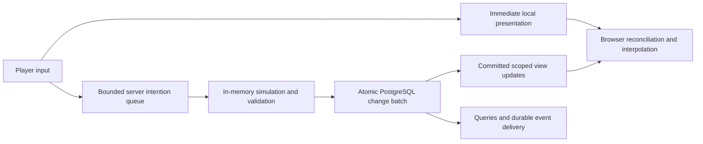

# Real-time synchronization, prediction and persistence

The personal-world runtime already uses GET bootstrap + typed SSE `GamePatch` updates; shared-world synchronization described here is future work. Current transport behavior belongs to [Architecture](../../docs/architecture.md).
Current local runtime note (September 20): the prototype uses a private SQL-transactional change journal with periodic snapshots, and public bootstrap/SSE typed patches with bounded replay. See the [canonical implemented architecture](../../docs/architecture.md#state-and-transitions). This is not the optional future external journal-first authority migration or the complete normalized/multiplayer design below; SQL commit remains the durability boundary, while routine local timer progress may be published before its one-second flush.

Status: **accepted architectural direction; proposed implementation contract**, September 19, 2026. The user approved server-side queued/batched updates, responsive browser prediction, authoritative multiplayer outcomes, selective replication and the future improvement path described here. No networking, storage or gameplay code is implemented by this document. Numerical tuning, transport rollout and capacity remain subject to measurement.

This document owns the real-time command/view protocol, client prediction, reconnect behavior, replication and network queue policies. The [production data model](production-data-model.md) owns canonical records and atomic changes; [data queries and MCP](data-queries-and-mcp.md) owns historical/current data queries; [data delivery and scale](data-delivery-and-scale.md) owns migration, retention, database recovery and shard rollout. These interfaces share identities and commit references without becoming the same protocol.

## 1. Architectural decision

Run the shared simulation on authoritative servers with loaded state in memory. Browsers submit intentions, display immediate local feedback and maintain a permitted replica of committed state. Servers resolve competing actions, persist bounded batches of changes and publish scoped confirmations/deltas. The browser is not an independently writable world that later merges inventory, damage or inventions into the server.

| Layer                  | Responsibilities                                                                                                     | Authority limit                                                                                      |
| ---------------------- | -------------------------------------------------------------------------------------------------------------------- | ---------------------------------------------------------------------------------------------------- |
| Browser                | Input, local movement prediction, interpolation, pending-action feedback, cached assets/settings and permitted state | Cannot grant possessions, decide another actor's damage, advance the shared clock or admit mechanics |
| Connection gateway     | Authentication, protocol negotiation, controller binding, rate/size limits, subscriptions and transport queues       | Routes intentions; cannot bypass simulation validation                                               |
| World/sector authority | Ordered intentions, native simulation, conflict resolution, current loaded state, deterministic change batches       | One fenced writer for each authority stream; no model/database access inside pure rules              |
| Commit adapter         | Atomically persist state changes, receipts, meaningful events and delivery records                                   | Durable completion precedes final authoritative confirmation in the initial implementation           |
| Replication service    | Build permitted views from committed results; track subscriptions and baselines                                      | Sends approved fields and outcomes, never an unfiltered world snapshot                               |
| Query/report service   | Structured inspection, history, memories, definitions and MCP access                                                 | Uses declared commit/freshness watermarks; browser predictions are not queryable world truth         |

The [production scope](production-data-model.md#implementation-scope-baseline-versus-conditional-expansion) starts with one writer per world, saved generation/revision checks and transactional current records. Multiple sector authorities, renewable leases and generic state-change replay are conditional expansions; scoped confirmations and duplicate protection still apply.

These may start in one server application with separate modules and bounded queues. They are not a requirement to deploy six services initially.

## 2. Independent cadences

Separate browser rendering, input collection, server simulation, network replication and database batching. A display rendering 60 frames per second does not require 60 database commits or 60 copies of every entity's state per second.

| Work                   | Scheduling policy                                                                                                                        |
| ---------------------- | ---------------------------------------------------------------------------------------------------------------------------------------- |
| Input collection       | Immediate local feedback; send discrete intentions promptly; coalesce replaceable steering before dispatch                               |
| Simulation             | Fixed game-time steps with the existing explicit clock/RNG contracts; acceleration changes due work, not networking wall-clock deadlines |
| Persistence            | Batch by bounded age, changed bytes/rows and dependency boundaries; flush when any limit is reached                                      |
| Replication            | Coalesce changes between sends; prioritize nearby dynamic entities, the player's own actions and consequential results                   |
| Rendering              | Animate/interpolate each render frame independently of incoming updates                                                                  |
| AI/context/report work | Separate bounded schedules; slow model calls or historical queries do not block the simulation's transaction                             |

For initial experiments, a maximum batch wait around 50 milliseconds and dynamic view updates around 10–20 per real second are tuning candidates, not accepted performance targets or claims about the current prototype. The real budget is input-to-confirmed-outcome latency, including network RTT, queue wait, simulation, database commit and outbound delivery. A batch limit is not a deliberate delay after every command: flush earlier for size limits or a boundary requiring an immediate commit. Avoid a separate flush for every player action that defeats grouping under load.

Expose requested/achieved simulation speed, queue age and storage/network lag separately. Faster fictional time must not create unlimited AI or networking work. If authoritative work cannot keep up, apply bounded backpressure and the world's declared slowdown/pause behavior; do not silently skip hunger, fire or consumed resources.

## 3. Commands, queues and confirmations

### Intention envelope

Define a versioned `ol.realtime/v1` envelope carrying protocol version, world ID, controller/session generation, stable command ID, client input sequence, input kind/body, declared dependencies where needed and a bounded admission/expiry token. Resolve account, actor authority and world scope on the server; supplied IDs cannot widen them. Client timestamps are latency evidence and advisory input timing, not permission to backdate a harvest or rewrite the shared clock.

Use distinct input semantics:

- **Discrete commands:** gather, give, craft, equip, speak, invent and administrative proposals. Preserve identity and order/dependencies as required; each has a terminal receipt. A changed body under the same ID is a conflict.
- **Replaceable steering:** latest movement direction or destination, if supported by that control mode. Coalesce only according to its declared latest-intent semantics. A superseded destination is not a silently canceled craft or queued conversation.
- **Connection/subscription controls:** view acknowledgement, resync, heartbeat and interest changes. They do not become gameplay effects or advance simulation time.

Keep per-controller admission limits and fair scheduling across players. The sector authority establishes the definitive order for conflicts; network arrival does not establish a universal fairness guarantee. Any future latency-compensated ordering policy must be explicit and tested. Independent sectors need not acquire a single world-wide command lock.

An acknowledgement has a precise meaning:

| Status                                | Meaning                                                                                                         |
| ------------------------------------- | --------------------------------------------------------------------------------------------------------------- |
| `received` / `queued`                 | Transient server receipt; may be lost before durable admission; no promised world effect                        |
| `pending`                             | Being evaluated or awaiting a bounded dependency; still not final success                                       |
| `committed`                           | Result and required effects/receipt are durably recorded under the selected commit policy                       |
| `rejected` / `expired` / `superseded` | Explicit terminal outcome; no implied successful physical action                                                |
| `unknown`                             | Connection/storage ambiguity requires reconciliation by original ID; never permission to repeat with a fresh ID |

Separate transport receipt from committed input sequence in prediction acknowledgements. Only a committed movement baseline proves the server has durably processed those inputs. Lightweight steering may use an acknowledged committed sequence instead of retaining a heavyweight receipt per input; discrete economic/gameplay commands retain durable identity protection.

### Example: the final apple

Two players send separate `take` intentions. Their browsers show reaching/pending feedback. The authority checks both against one current inventory/resource state, orders the competing changes and admits at most one successful allocation. The winning transfer, source quantity, placement, receipt and event commit atomically. Both players receive results consistent with that commit. The losing browser never uploads a local inventory increment that can create another apple.

## 4. In-memory simulation and database writes

Load active entities/components/processes and required definition pins into the authority's working set. Apply native rules there. In the commit transaction, verify writer epoch, expected sequence and required concurrent record revisions, then write changed records and receipts together. Memory/cognition can read their independently stored records through the appropriate scoped interfaces; gameplay does not reload every entity from SQL for each movement increment.

Only validated changes enter the dirty batch. Collapsing repeated component writes to a final persisted value is allowed only when intermediate transitions, meaningful events, randomness and promised recovery granularity remain represented. A fire igniting and extinguishing within one batch cannot lose its ignition event merely because the final `lit` value matches the initial value. Splits, transfers and inventory allocations retain conservation and identity evidence.

The initial commit path is:

1. Compute a bounded candidate batch from a committed baseline.
2. Persist the batch and its authoritative receipts atomically in PostgreSQL.
3. Reconcile ambiguous completion by batch ID/digest.
4. Advance the public committed state and publish permitted deltas/receipts.

Use one commit in flight per authority stream initially. Other worlds/sectors can continue independently. Speculative calculation ahead of that commit, if later added, remains bounded and unpublished, and must be discardable if the baseline fails. Long database stalls stop new authoritative advancement; a large unsaved in-memory future is not recovery.

External tools, world-agent proposals and database administration cannot secretly modify live canonical rows behind the running authority's working set. Supported writes go through its command/migration interfaces; an operational repair fences/reloads the authority under an explicit procedure. This is necessary to keep RAM and persistent state coherent.

## 5. Prediction, interpolation and corrections

Predict only interactions whose presentation can be safely corrected. Initially predict the local character's movement using shared portable movement rules, permitted geometry and pinned movement-contract versions. Keep confirmed state separate from predicted state; unacknowledged inputs form a bounded local buffer.

When a server update supplies a committed baseline and last processed input sequence, discard acknowledged inputs, restore that baseline and replay still-valid pending movement inputs. Smooth small visual differences; snap or explicitly reset when required by collision, teleport, death, stale controller generation or incompatible mechanics. Never smooth the underlying authoritative inventory or let cosmetic smoothing authorize reach.

For remote entities, interpolate between committed updates using a short bounded display delay. Bound extrapolation when packets stop; stale characters must not glide indefinitely through walls or continue fictitious interactions. Prediction/interpolation reduce perceived latency while preserving a single confirmed result; they cannot eliminate network delay. [Unity's anticipation documentation](https://docs-multiplayer.unity3d.com/netcode/2.1.1/advanced-topics/client-anticipation/) illustrates the separation between responsive presentation and authoritative values; Open Legend still needs its own tested movement/reconciliation implementation.

| Interaction           | Initial presentation policy                                                                                                 |
| --------------------- | --------------------------------------------------------------------------------------------------------------------------- |
| Local movement/camera | Predict movement within supported rules; camera responds immediately                                                        |
| Remote movement       | Interpolate; bounded extrapolation/freeze during missing updates                                                            |
| Gather/craft/work     | Immediate selection and pending/start animation; confirmed process drives progress                                          |
| Take/give/eat/equip   | Pending feedback until confirmed quantities/placement; unconfirmed gains cannot fund another action                         |
| Combat/death          | Cosmetic anticipation may be allowed; damage, ammunition use and lifecycle remain confirmed server outcomes                 |
| Speech/invention      | Draft/pending status until committed speech/admission; generated prose is not already-spoken dialogue or a working mechanic |

New declarations do not automatically install executable client prediction. Ship an approved, versioned prediction subset in ordinary client code. Unknown/custom mechanics use server outcomes and generic presentation until a compatible prediction contract is available. Prediction receives only client-permitted information, even when hidden state causes a later correction.

## 6. Scoped replication and baselines

Replicate what each player can perceive or is explicitly allowed to inspect: nearby visible/audible entities, owned/accessible inventory, current actions, relevant groups and world announcements. Spatial interest is a candidate filter; perception, field visibility and account/actor rights still decide the payload. Creator-wide reports use the query service rather than subscribing a browser to every raw world update.

Build shared spatial/dormancy indexes instead of checking every entity against every connection from scratch. Unchanged terrain and stationary objects sleep until relevant changes occur. Dynamic nearby objects update more frequently than distant background summaries. Carried objects can share their carrier's replication grouping. Epic describes related spatial and dormancy techniques in its [replication graph](https://dev.epicgames.com/documentation/en-us/unreal-engine/replication-graph-in-unreal-engine).

Entering an interest region sends a permitted baseline. Leaving sends removal-from-view, which is different from the entity dying or being deleted. Permission revocation removes queued unauthorized data and resets the affected scope/baseline. Already transmitted bytes cannot be recalled; avoid disclosing secrets based on camera position alone. Event audience is determined at event time, so a later subscription does not receive a private earlier conversation.

### View envelope

| Message           | Required meaning                                                                                                                                   |
| ----------------- | -------------------------------------------------------------------------------------------------------------------------------------------------- |
| `welcome`         | Negotiated protocol, world/controller generation, effective clock/policy/manifest and permitted capabilities                                       |
| `view_reset`      | New view epoch, scope revision, committed watermark, snapshot ID and complete scoped baseline; chunked transfer has an explicit completion barrier |
| `view_delta`      | View epoch, base sequence, next sequence, committed watermark, entity/component upserts and removals                                               |
| `command_result`  | Original ID, terminal/pending status, committed result refs and watermark when successful                                                          |
| `view_ack`        | Client's last applied view epoch/sequence, not merely bytes received                                                                               |
| `resync_required` | Baseline/gap/compatibility reason and next synchronization step                                                                                    |

View sequence belongs to a connection/subscription stream, not the entire world journal. Private events omitted from that view do not create unexplained sequence gaps or expose private global activity counts. Use opaque permitted commit tokens where underlying stream metadata would leak information.

Apply deltas only to their declared baseline. A missing/mismatched base causes replay of a retained compatible view range or a fresh scoped reset. Suppress duplicate semantic notifications using receipt/event IDs. A large initial snapshot captures one committed cut; buffer bounded later changes and apply them after snapshot completion, or restart the snapshot if its catch-up window is exceeded. Never render a mixture of half an old baseline and unrelated new deltas as confirmed state.

## 7. Browser storage and reconnect

Use browser memory for active confirmed/predicted views. Optional IndexedDB can cache versioned assets, permitted map chunks, settings and a last-known view; it is disposable, scoped by account/world/schema and never the only copy of game progress. Browser persistence supports offline caches but remains subject to storage policies; see [IndexedDB](https://developer.mozilla.org/en-US/docs/Web/API/IndexedDB_API). Keep draft behavior separate from committed speech.

Persist pending discrete command IDs only when useful for reconnect reconciliation, with controller generation, body digest and expiry. Store sensitive text under its explicit retention policy, and clear scoped caches on logout/revocation. Cached private data is not automatically safe because it is local. Failure or eviction of browser storage must not lose committed server inventory or reset command accounting.

On reconnect:

1. Reauthenticate world membership and acquire/renew the intended controller generation; two tabs cannot independently seize the same character.
2. Present the last applied view token and outstanding command IDs.
3. Fetch existing command results before deciding whether any request needs resubmission.
4. If compatible and retained, receive missed scoped updates; otherwise receive a fresh baseline.
5. Discard expired movement/steering and stale predictions. Reissue a still-authorized discrete intention only under the existing ID and explicit retry policy; if its old generation requires a new user action, report that instead.

A disconnected shared-world browser cannot accumulate successful harvesting, inventory edits or simulated time for later upload. A future standalone offline world would use a separate authority namespace and an explicit import/transfer policy; it cannot automatically merge its physical state into a running shared world.

Networking reconnection does not decide whether a disconnected character rests, remains exposed or is removed. That is a recorded world/controller policy. Respect the personal-world hidden/background setting and manual pause contract; multiplayer visibility changes must not automatically pause everyone else's world. Shared pause, abandonment and unattended progression policies require their own product decisions. No network packet triggers offline catch-up implicitly.

## 8. Bounded queues and slow clients

Every queue has count, byte and maximum-age limits: inbound intentions, pending simulation work, uncommitted changes, outbound view updates, snapshot catch-up and background reports. A queue can smooth a burst; it cannot solve sustained throughput below incoming load.

| Queue class                                        | Overload behavior                                                                                                |
| -------------------------------------------------- | ---------------------------------------------------------------------------------------------------------------- |
| Replaceable steering                               | Keep the newest valid unsent intent; report/track supersession semantics                                         |
| Discrete gameplay commands                         | Reject/defer admission with a clear result before the queue becomes unbounded; preserve accepted identity        |
| Uncommitted authoritative state                    | Bound work ahead; slow/pause the affected authority on storage failure; never announce final success first       |
| Unsent visual state                                | Coalesce into a compatible newer state relative to a known baseline, or send `view_reset`                        |
| Reliable action results / meaningful notifications | Retain/deduplicate or recover through receipt/history queries; never silently treat them as disposable positions |
| Slow-client backlog                                | Reduce optional detail, resync, then disconnect if necessary; one slow consumer cannot block every client        |

Coalescing does not mean dropping arbitrary patches. If patch B depends on patch A, deleting A invalidates B. Recompute against an acknowledged baseline or send a replacement snapshot with a new view epoch. Once bytes are handed to a transport, they may no longer be removable; monitor queues before buffering large obsolete messages there.

Start with authenticated WebSocket transport and compact versioned messages, with HTTP for large assets/reports and optional receipt queries. Validate Origin/authentication, frame/body sizes and per-principal rates. The browser WebSocket API does not provide automatic backpressure, so application queue control is required. [MDN WebSocket](https://developer.mozilla.org/en-US/docs/Web/API/WebSocket)

Use JSON while proving semantics, then benchmark compact binary encoding, field masks and compression. Large source artifacts and historical exports travel outside the real-time connection. Prioritize results/control messages so an asset download cannot delay an inventory confirmation.

## 9. Future improvements and their gates

| Improvement                                                | Benefit                                                                                        | Required before adopting                                                                                                   |
| ---------------------------------------------------------- | ---------------------------------------------------------------------------------------------- | -------------------------------------------------------------------------------------------------------------------------- |
| Adaptive replication rates and spatial interest refinement | Spend bandwidth/CPU on perceptible changes; improve crowded-area behavior                      | Relevance/visibility tests, fair per-client budgets, bandwidth/correction measurements                                     |
| Compact binary deltas and compression                      | Reduce bytes and parse overhead                                                                | Profile actual payloads; preserve version negotiation, size limits and debuggable traces                                   |
| Web Workers / selective WASM client routines               | Move decoding or prediction off a busy rendering thread                                        | Target-device profiling and shared-rule correctness; no secret simulation state shipped to clients                         |
| WebTransport reliable streams/datagrams                    | Separate reliable outcomes from supersedable motion traffic and reduce some transport blocking | Actual browser/network/proxy support, fallback, congestion/ordering tests and unchanged authoritative semantics            |
| Dedicated replication gateways                             | Scale connections and fan-out independently of simulation                                      | Rebuildable baselines, scoped subscriptions, writer generation propagation and bounded gateway queues                      |
| More world shards                                          | Distribute independent worlds and regions                                                      | Fenced moves, routing and recovery from the data scale plan                                                                |
| Multiple sectors in a busy world                           | Distribute simulation work within one world                                                    | Explicit transfer/causal boundaries, coherent clock/manifest changes and consistent snapshots                              |
| Lag compensation for combat                                | Fairer interpretation of delayed aiming inputs                                                 | Bounded server history, anti-abuse/fairness policy and tests; never backdate inventory or irreversible economic operations |
| Durable journal before SQL projections                     | Shorten confirmation path if row/index maintenance is the bottleneck                           | Complete change/outcome journal, ownership fencing, materialization watermarks and tested recovery as below                |

WebTransport provides reliable and unreliable communication over HTTP/3; deployment support and fallback must be checked against the actual player fleet when selected. It is an optional adapter, not a prerequisite for this browser game. [MDN WebTransport](https://developer.mozilla.org/en-US/docs/Web/API/WebTransport)

### Optional journal-first persistence

Keep PostgreSQL transactional batches as the initial source of committed truth. If measured storage latency later warrants a different path, an authoritative stream could durably append a complete validated change/outcome batch to a replicated journal, acknowledge that durability, and materialize SQL query tables asynchronously.

That is a change in the persistence authority contract, not a casual background-save queue. It requires:

- one fenced ordered writer and atomic append of all dependent changes and command results;
- required decision outputs, schema/build/definition pins and referenced immutable artifacts available before acknowledgement;
- idempotent SQL materialization by stream/batch identity, with verified coverage and a durable materialization watermark;
- current gameplay reads from the same authority's committed journal-backed state, rather than stale SQL projections;
- MCP/query `at_least` semantics that wait, route to an authoritative reader or explicitly report lag;
- journal retention until covering checkpoints, projections and required consumers can recover;
- crash/failover tests around append, acknowledgement, materialization and duplicate delivery;
- a fenced cutover preserving existing command IDs and query contracts, without two independently writable authorities.

A queue acknowledgement is sufficient only if that queue/log actually meets this durability and recovery contract. Replica acknowledgement requirements and tolerated disaster loss must be selected and tested. Adding Kafka, Redis or another named product alone establishes none of these guarantees. Do not acknowledge success from an ordinary process-memory queue and call it durable.

More servers help thousands of players distributed across places. Thousands all affecting the same small space produce concentrated simulation, visibility, bandwidth and rendering costs. Partitioning cannot remove genuine cross-boundary dependencies. Dense scenes need measured entity/interaction budgets, presentation detail management and explicit overload behavior; no unlimited single-area capacity is promised.

## 10. Implementation sequence and acceptance

1. **Protocol and measurement:** define command/view schemas, acknowledgement semantics, generations, expiry, visibility and latency metrics. Keep simulation, transport and storage adapters separate.
2. **Two-client correctness:** authoritative in-memory simulation, short durable batches, initial snapshot/deltas, duplicate-safe commands and reconnect. Prove the final-apple conflict and interrupted commit before optimizing visuals.
3. **Responsiveness:** local movement prediction/reconciliation, remote interpolation, pending consequential actions and bounded stale-state handling. Test under injected latency/jitter/loss and changing geometry.
4. **Efficient replication:** spatial/dormant subscriptions, versioned baselines, coalescing, queue budgets and slow-client resync. Test on constrained browsers as well as fast desktops.
5. **Hosted scale:** realistic player/NPC/dirty-entity workloads, skew toward one busy sector, report/AI background load, failure recovery and resource headroom. Add gateways/shards/sectors only at their measured boundary.
6. **Optional advanced transport/persistence:** adopt journal-first writes, alternative transport, lag compensation or richer prediction only after the prerequisites above and explicit compatibility review.

Required evidence includes duplicate/reordered intentions; simultaneous final-item pickup; commit success with lost reply; new controller invalidating an old tab; reconnect beyond receipt/view retention; snapshot/delta overlap; permission revocation while updates are queued; changing prediction contract/geometry; a hidden tab with throttled rendering; slow clients and database stalls; sector transfer during pending work; and matching committed query/replication watermarks.

Measure input-to-local-feedback and input-to-confirmed-outcome separately, plus p50/p95/p99 queue/simulation/commit/replication latency, prediction correction frequency/magnitude, bytes per connection, visible entities per client, pending bytes/age, CPU/frame time, resync rate and achieved simulation speed. Zero divergence in a fixture is not evidence of real-world latency or population capacity. The initial load envelope and service objectives must be established by those measurements before external scale claims.
