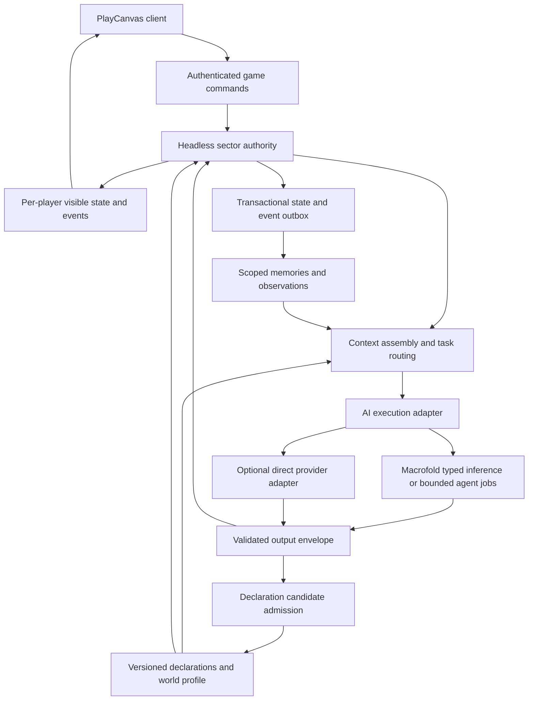

# Open Legend technical architecture

Status: **detailed implementation proposal**, September 19, 2026. No game code is implemented by this document. Accepted product directions remain those in the [product baseline](../01-requirements/product-baseline.md), [design follow-ups](../00-source/design-followups.md), and [community directions](../00-source/open-source-and-community-followups.md), including the latest world-creation and future-influence directions. Supporting technology choices, exact schemas and numerical parameters below are proposed. “Open World” in the architecture request is treated as Open Legend, the existing project.

Read with [context and inference](context-and-inference.md), [declarations and evolution](declarations-and-evolution.md), and the standalone [Macrofold implementation brief](macrofold-implementation-brief.md). This set consolidates the current technical recommendation; earlier design documents retain detailed examples and decision history. If a future decision changes a contract, update this set and its affected design references together.

The [architecture review and delivery plan](review-and-delivery-plan.md) records the critique and owns the revised S0–S5 dependency sequence. This document owns game runtime/storage boundaries; context and declaration documents own their respective contracts; the Macrofold brief owns platform requirements. Keep summaries linked rather than maintaining competing definitions in every roadmap.

## 1. Architecture in one page

Build a headless, authoritative simulation with a versioned declaration registry and a dedicated context assembly module. Players and NPCs request actions; local rules, typed inference, language models or bounded agents interpret and plan as needed. Every consequential result returns through the simulation's command validator. Approved declarations expand what that validator and its executors can express; arbitrary model text never becomes executable authority.

Use Macrofold as the preferred service for general AI execution, subject to the proposed lightweight execution capabilities and measured fit. Open Legend owns its domain schemas, context selection policies, simulation and declaration admission. Macrofold owns execution identity, permitted model/tool access, budgets, lifecycle and diagnostics. Direct model adapters remain available for local development, comparisons and configured deployments; do not create an independent general agent platform inside Open Legend.

These are module boundaries, not a request to deploy a dozen microservices. Start with one game process, one transactional store, the browser client and fixtures. PostgreSQL is the proposed durable server adapter; add object storage for larger artifacts when needed. Independently deployable Macrofold joins when its first inference path passes the application contract. The game and platform may share physical infrastructure with separate schemas/credentials. Existing hosting candidates remain unselected. Use one sector and one world first.

## 2. Constraints carried forward from the latest documents

- PlayCanvas is the accepted presentation direction; gameplay rules and time work without a browser, GPU or scene graph. Mouse movement/selection/context actions are the accepted first control path; later keyboard bindings reach the same command API.
- Start with competent primitive people, accessible resources and possessions, native gathering/eating/resting and other necessary survival fundamentals. NPCs may die; human recovery and absence policies are distinct.
- Time acceleration is supported. The accepted base is 60 simulated seconds per real second, with 0.5×/1×/3×/8× personal-world presets; rates remain a replaceable clock parameter. Model/queue deadlines and human reaction intervals remain real-time concerns.
- Materials and components can evolve. Buildings consist of persistent replaceable parts and relationships. Begin with coarse models and a small explicit dependency graph; the detailed thermal exploration is not a launch checklist.
- A world profile bounds ordinary causality. Plausible but unimplemented, unknown, forbidden, unavailable and temporarily deferred requests are different outcomes. New declarations cannot redefine their own admission policy.
- The registry of physical capabilities is distinct from what each actor knows. Private histories and creator definitions are not implicitly shared across worlds or with every agent.
- AI-assisted world creation composes pinned defaults and asks only consequential questions. Invention reveals or implements the world's permitted behavior; deliberate changes to its premise are creator operations. New state systems record a bounded set of possible future influences without activating them.
- Preserve private/premium/self-hosted worlds, versioned mechanics packs, provenance and export boundaries. Commercial features follow the playable creator loop; token/NFT financing remains exploration.

References: [world profiles](../03-design-proposals/world-rules-and-parameters.md), [complexity](../03-design-proposals/simulation-scope-and-complexity.md), [construction](../03-design-proposals/evolving-materials-and-construction.md), [controls](../03-design-proposals/world-and-player-experience.md#player-controls), [licensing](../../LICENSING.md).

## 3. Modules and replaceable contracts

Prefer TypeScript for the initial game kernel, server adapters and client integration. Keep native records plain and serializable. An optimized ECS, graph store, vector index, transport library or alternative language can follow demonstrated need.

| Module | Owns | Boundary/port |
|---|---|---|
| `simulation` | Clock, entities/components, process scheduling, seeded randomness, invariants | `advance`, `validateCommand`, `computeEffects` |
| `world-authority` | Sector epoch, command order, reservations, atomic consequential commits | Versioned commands, receipts, snapshots and outbox |
| `perception` | Visible/audible/touchable information and known identities | Observation snapshots and bounded scoped queries |
| `context` | Task-specific source selection, dependency closure, evidence and budgets | `ContextRequest → ContextEnvelope` |
| `cognition` | Attention, goals, current plans, native survival controller and decision triggers | Observations → bounded thinking requests → proposed actions |
| `interactions` | Intent/cause interpretation, candidate selection and supported resolution | Typed intent, applicability and effect proposals |
| `declarations` | Immutable definitions, dependency graph, admission, activation and quarantine | Candidate bundles and pinned world manifests |
| `memory` | Awareness/raw/consolidated experience, accepted inner-world text, native commitments/knowledge and recall policy | Actor-scoped retrieval, independent consolidation and atomic file-snapshot publication |
| `ai-execution` | Application-level execution port; Macrofold/direct adapters | Typed decisions, bounded agent tasks, receipts, cancel/status |
| `presentation` | PlayCanvas mapping, assets, animation, input and local interpolation | Permitted view patches and semantic presentation cues |
| `operations` | Creator actions, budgets, diagnostics, repair and later entitlements | Explicit administrative scopes and recorded operations |

Method names are illustrative contracts, not existing APIs. Define only interfaces needed by the first working flows. The application does not import Macrofold's SQL tables or Vercel types. Renderer nodes, provider response objects and raw tool credentials never become fields in canonical game records.

Use a small enforceable package direction, rather than making each module a service:

| Proposed boundary | Permitted dependencies |
|---|---|
| `contracts` | Serializable schemas, IDs, units and wire DTOs; no runtime adapters |
| `simulation` | Contracts and pure rules; supplied clock/RNG/state inputs; no I/O, provider, database or renderer imports |
| `application` folders | Authority, perception, context, memory, interactions and declaration orchestration; contracts, simulation and injected ports |
| `adapters` | PostgreSQL, transport/auth, Macrofold/direct provider and asset storage implementations; compose these at the server entry point |
| `client` | Public view/command contracts and PlayCanvas; no server-private component or memory payloads |

Check import direction in the build. Within the application, memory consumes scoped observations, context reads authorized projections, and creator operations submit commands. None reaches through another module into its tables. Navigation, reach, occupancy and perception query the same authoritative geometry through bounded spatial reads.

The first ports are `WorldStore.load/checkpoint/commit(expectedSequence, epoch, batch)`, a consistent scoped world/spatial read view, `DefinitionStore` for pinned artifacts, `MemoryStore` for actor-scoped queries/versioned patches, observation delivery, and a client view stream. Bind world/tenant scope server-side. `AIExecution` advertises support for `decide`, `boundedAgent` and `isolatedTask`, plus status/cancel and durable receipts. Unsupported operations return an explicit capability result. The initial direct adapter implements decisions only; it is not required to recreate Macrofold's agent loop or isolated runtime. Add other ports only with a consuming flow.

Keep wire protocol major versions separate from task-definition revisions, input/output schema revisions, world storage schema, simulation build and declaration ABI. Negotiate client/server and Open Legend/Macrofold wire compatibility at connection/admission; reject unsupported majors rather than silently coercing payloads. Pin the other revisions per request/process and migrate them explicitly. A new prompt is not a new network protocol, and a compatible protocol does not make an old world schema executable by every runtime.

## 4. World representation and persistence

The [production data model](production-data-model.md) now specifies the concrete record families, keys, versioning, invariants and transaction boundaries behind this overview. Its [query/MCP contract](data-queries-and-mcp.md) is the stable consumer interface; its [delivery and scale plan](data-delivery-and-scale.md) defines import from the prototype, retention/recovery and sharding. Those specifications refine earlier illustrative storage choices; they remain proposed and unimplemented.

Use stable IDs for worlds, sectors, entities, body/assembly parts, processes and definitions. Components have registered schemas, unit conventions, bounds, visibility and an authoritative update owner. Definitions describe material or behavior; instances hold current condition; derived state records its dependencies. Unknown moisture is not dry, zero or noncombustible. Descriptive/social meaning remains prose or attributed records until a supported mechanic needs a new field.

Keep account/operator/tenant identity distinct from world identity, an experimental branch/copy, sector, actor and execution. A world pins separate causal-profile, runtime/schema and content-manifest revisions. A copied scene has a new authority namespace and no production commit rights; source IDs may be retained as provenance, never as permission to write the source world. Compatible worlds can reuse definitions without sharing live objects or private histories.

Changing state has one update owner and a typed contribution interface. A wetness system combines compatible rate contributions over simulation time and applies discrete transfers once, with declared saturation and source/sink accounting. Other rules request changes through that owner. Canonical property families prevent separate competing `wetness` and `dampness` values. Anticipated influences are design records with applicability, missing dependencies and uncertainty; they do not contribute until their implementation is admitted. See [state systems](../03-design-proposals/state-systems-and-future-influences.md).

Use/attachment relations preserve object identity. A cloak used as roofing retains its wetness and damage and cannot simultaneously protect its former wearer. Taking it down returns the same object; cutting, consuming, splitting or joining it uses explicit transformations. Validate this with the cloak → roof → rain → extension/support removal → retrieve/wear → save/reload scenario, including a pending action and characters with different observations.

Proposed logical collections:

| Records | Contents and durability |
|---|---|
| Worlds/manifests/profiles | Effective premise, schema/runtime versions, capability lockfile, time settings; immutable revisions |
| Entities/components/parts/relations | Identity, authoritative state and spatial/support/enclosure/exposure relationships; consequential changes transactional |
| Processes/actions/reservations | Progress, consumed inputs, pinned rules, last-integrated time, interruption and recovery policy |
| Commands/receipts/events/outbox | Idempotency key, actor/scope, causal inputs, committed outcome, event sequence and publication status |
| Observations/minds/memories | Per-actor permitted experience, beliefs, commitments, goals and retention; [canonical design](../../docs/memory-architecture.md) |
| Definitions/candidates/activations | Content digests, schemas, dependencies, tests, provenance, scope and rollout status |
| Anticipated influences/demand | Dormant candidate connections, existing owner/family refs, missing dependencies, counterexamples and bounded priority; separate from active rules |
| Contexts/decision requests/receipts | Input manifest/hash, source revisions, permitted audience, durable submission identity/outbox, execution receipt and separate application outcome; bounded diagnostic retention |
| Assets/packs/licenses | Content identity, presentation bindings, author/provenance and use/export permissions |
| Accounts/entitlements/usage projections | Authentication linkage, world access and application allowances; later commerce stays separate from game inventory |

Begin with ordinary relational tables and schema-governed JSON. Index owner/world/entity/status/time and use full-text search for prose; required semantic-retrieval vectors remain derived indexes and never establish knowledge, rights or truth. The embedding model and storage implementation remain open choices. One transactional store owns the initial world writer's authoritative state, commit batches, receipts and necessary durable asynchronous work. General distributed outboxes, renewable leases and generic checkpoint replay are conditional expansions under the [production scope](production-data-model.md#implementation-scope-baseline-versus-conditional-expansion), not initial service requirements. In-memory state is its working projection, not a competing persistence authority.

Start with a fixed simulation step in registered integer time units, subdivided at meaningful action/threshold boundaries. The requested clock rate determines how many steps become due. Compute a step against consistent state, collect contributions in declared system order, and produce one bounded commit batch for its changed components, authoritative positions, process/time/RNG state, command receipts, events and delivery records. Persist the batch in one database transaction, not one transaction per entity, property or render frame. A bounded group of steps may share a transaction while preserving their event order and boundaries. Rendering/interpolation runs independently from committed view patches.

All coupled owners read the same immutable start-of-step state. Staged contributions and cross-owner resource claims resolve under the [declaration update policy](declarations-and-evolution.md#state-ownership-and-dormant-influences), then become visible together. Bound subdivisions, contributions and propagation; if the step budget is exhausted, reduce achieved speed or pause with backlog visible instead of dropping effects. Initially keep the small sector's authoritative objects loaded; sleeping/unloaded-region simulation requires its own future catch-up and migration policy.

For one writer, `epoch` is a saved authority generation; it does not require a lease service. State changes here can be updates to current records rather than a retained generic replay log. `WorldStore.commit(expectedSequence, epoch, batch)` atomically checks the sole writer's fencing epoch and previous committed sequence, then records a unique batch identity/digest, state changes, receipts and outbox. A duplicate identical batch returns its original receipt; a mismatched body or sequence conflicts. Only then advance the public committed clock and apply/publish its projection. On conflict, refresh state and revalidate; do not blindly replay stale writes. On ambiguous storage completion, pause authoritative advancement and reconcile the batch identity before retrying or accepting dependent work. Losing storage must not let an unpersisted world continue or report invented success. Measure commit/step latency and bounded backlog with native simulation before selecting larger workloads.

Checkpoints capture one committed sequence and the matching entities, positions, processes, pending boundaries, clock/rate, RNG and pinned artifacts. Restore applies batches strictly after that watermark once, without calling a model or re-emitting external side effects. Distinguish three promises: **restore** reconstructs committed state; **outcome replay** presents recorded effects/events with any presentation omissions labeled; **deterministic resimulation** additionally needs the original input schedule, algorithms and random inputs and is a separately tested capability. Do not infer the third from the first two or promise cross-platform floating-point identity.

Before accepting an AI result, copy the minimal normalized decision needed by the game into game-owned durable storage: payload/schema, context digest, accepted evidence references, execution identity and relevant versions. Commit it or an already durable game-owned reference with its effects. An expiring Macrofold result link is not replay evidence. Retain required outcomes/artifacts for the selected restore/replay horizon with appropriate privacy controls; full prompts and diagnostic traces may have shorter retention. If history outside that horizon is unavailable, report that limit rather than regenerate it.

Account entitlements, real-money usage, decision dispatch/usage receipts and patron redemption stay outside rewindable or forkable world snapshots. Restoring a world cannot refund provider usage, resubmit a paid decision, replay a payout, mint a second membership or redeem a dedication twice. A deliberate timeline restore/fork receives a new authority generation that fences old pending results while preserving their accounting records. Reconcile in-world recognition against the external entitlement record using stable claim IDs; a historical scene copy grants no new commercial rights.

Macrofold may later host structured resources, but its current file/checkpoint API is not the live world transaction interface. Start with game-owned schemas and scoped query tools; do not block the game on a generic hosted database product. A world workspace can store manifests, snapshots, definitions and experiments without becoming a second writable source of world truth.

## 5. Commands, time and concurrent work

Every command includes a protocol version, world and actor identity resolved through authenticated scope, command ID, action/target references, intended rule version where relevant, and bounded parameters. The server derives necessary permissions and dependencies; a model cannot declare that an inconvenient dependency does not exist.

For asynchronous work, the resulting proposal carries an input context reference, relevant component/query versions, profile/definition versions, deadline and plan/turn generation. Validate the dependencies actually needed by the admitted operation. A global world tick alone is too strict: an unrelated tree moving should not invalidate a greeting. Conversely, entity versions alone can miss a new neighbor; range, occupancy, inventory membership and exposure queries need a revision token or a fresh authoritative predicate check.

Order conflicting commits within a sector. Two agents can plan to pick up one apple concurrently, but only one valid ownership transition succeeds. Reserve scarce inputs only when starting an admitted action and for a bounded duration; do not hold world locks or long reservations while a model deliberates. Construction records staged consumption and interruption so cancellation cannot duplicate salvage or refund already-used materials.

Use the simulation clock for work, need decay, weather/material processes and ordinary aging. Integrate to important boundaries, including fuel exhaustion, lethal thresholds, geometry changes and action completion. Apply creator speed changes at journaled boundaries. Real time governs provider timeouts, budget windows, reconnects and reaction opportunities. Explicitly choose how human reactions interact with acceleration; a faster calendar must not silently remove their opportunity to respond.

Reasoning jobs remain bounded even when their workers live for hours. Keep a current plan and a small number of pending jobs per actor. Coalesce repeated stimuli, cancel superseded jobs, and prioritize conversation and hazards over reflection. A late answer for a dead actor, an old conversation turn or an invalidated plan is discarded or reinterpreted through a new request. Native survival continues during inference failure. Fixed real-time AI budgets at higher acceleration imply fewer detailed deliberations per simulated day; this is a visible fidelity trade-off.

If deterministic simulation cannot keep up, carry bounded simulation debt, reduce permitted speed or pause under a disclosed policy. Do not discard elapsed hunger or fire work. For the initial personal world, Pause game when hidden defaults on and pauses on hidden/unfocused tabs. Turning it off permits connected background advancement and autonomous scheduling; manual pause still wins and there is no offline catch-up. Cancel unnecessary pending requests when supported, retain usage accounting, and revalidate completed results before resumed effects. Absence detection/grace and conversation pacing remain tuning choices. Fully offline progression, shared-world pause arbitration and richer biological aging require later decisions.

Expose requested and achieved speed, simulation backlog and any reduced reasoning frequency separately. Provider latency is not fictional labor. A failed inference before an action starts cannot create a failed experiment, consumed material or a false memory; genuine partial work already committed remains part of history.

### Connections, control and speech

The [real-time synchronization contract](realtime-synchronization.md) specifies the accepted server batching/browser prediction direction, command acknowledgement states, scoped deltas, reconnect, slow-client handling and optional future journal-first persistence. It refines this overview without changing the initial commit-before-confirmation guarantee or enabling browser-authoritative shared-world edits.

Authenticate the account, authorize world membership and character control, and issue a bounded controller lease/generation. Commands bind to that generation and a stable command ID. Replacing a connection invalidates the old controller; reconnect retrieves prior command receipts instead of replaying every unacknowledged action under new IDs. Initial join and reconnect receive a consistent permitted snapshot plus subsequent sequenced view patches. A gap triggers a fresh scoped snapshot, never a download of the private world. Client prediction is presentation only; select, move, approach and act are rechecked against live geometry, reach and permissions.

Speech has draft, ready, committed and interrupted/cancelled states, with speaker, conversation/turn generation, audience and source decision. Generated prose is not yet something a character said. Commit the utterance at its actual world boundary, then deliver text and any audio through permitted audience channels. For long speech, commit bounded segments as spoken; interruption preserves delivered segments and discards the rest. Late TTS or model output cannot restart a cancelled turn. Explicit promises and transfers have their own validated records; a narrative cannot claim their completion. Keep text complete, and add voice activation, mute/block/report and phone audience rules when media is introduced.

Death/incapacitation cancels incompatible plans, pending speech and actions, releases unused reservations, and applies explicit possession/remains rules. Human recovery preserves identity and social history under a chosen policy; enable player death only after that policy works. Pause blocks gameplay-effect commits, including ready speech/actions, while networking and real-time cancellations continue. Disconnect releases control according to its lease policy; whether the character rests safely or remains exposed is a world/player rule, not a networking accident.

### Event-time observations and learning

Capture perception at the committed event's time. For consequential events, include stable observation IDs and the eligible actors' permitted facts, or retain a bounded versioned snapshot sufficient to compute them deterministically. Delayed outbox processing must not determine who heard a whisper using current positions, newly opened doors or knowledge learned afterward. Audience eligibility and historical facts are fixed; current access revocation can prevent later delivery. Never send the authoritative private event and rely on the receiving model/client to hide fields.

Use distinct lanes: witnessed shared event → actor-awareness projection (or non-event personal observation) → deterministic bounded ingestion/basic learning. Hourly small-model consolidation processes raw experience older than six game hours; independent level-5 reflection edits inner-world files and publishes one accepted PostgreSQL text snapshot. Native evidence-backed skill changes and obligations remain separate from subjective prose; speech does not require a mind patch. Being told creates attributed testimony; observation exposes only visible steps; practice records actual success/failure under its conditions. Protected typed commitments and critical fresh observations bypass optional semantic indexes. Decision context records the ingestion watermark and unresolved gaps, incorporating relevant pending observations or deferring dependent interpretation rather than claiming complete recall. Native hazard responses remain available during memory/model delays.

Consolidation works against memory revisions and an observation watermark, preserving later arrivals. It cannot turn testimony into truth or grant new physical capabilities. Knowledge references stable technique identity plus the version/steps actually learned; a compatible recipe replacement can carry knowledge forward under a declared mapping, while genuinely new steps remain to be learned. Changes to private beliefs, social appraisals and practical proficiency have separate validation and retention policies. Test teaching, partial observation, failed practice, contradictory testimony, a promise during consolidation, and forgotten details absent from subsequent sessions.

## 6. Context and execution are independent responsibilities

The context module is a core part of the game, with reusable transport/resource support from Macrofold. It produces a small evidence package appropriate to a task, not a dump of a world or biography. It separates objective resolver context, subjective NPC context, creator context and public explanation context. Access is enforced before retrieval/ranking and again at use; a successful API call from the platform does not grant an NPC omniscience.

The [memory specification](../../docs/memory-architecture.md) owns NPC semantic levels, attention, full About me inclusion, awareness, retention and reflection/sleep. The [context specification](context-and-inference.md) implements its assembly rules and broader audience authorization, unknown/omitted data, dependency tracking and caching. The execution adapter receives that prepared context and a versioned task definition, not permission to browse arbitrary application storage. Approved tools can fetch additional authorized evidence. The domain module decides what that evidence means.

Macrofold is the preferred integration direction because it can reuse budgets, model and tool grants, durable jobs and diagnostics across this game and other applications. Its latest strategy emphasizes narrow evidence context and selective decision steps; the handoff extends those seams rather than requiring a universal memory engine. Its native harness path remains useful for iterative design and testing. Brief typed calls should not create synthetic workspaces or perform Git checkout/capture.

A direct decision adapter supports fixtures, comparisons and deployments without Macrofold while enforcing the same context/output limits. Configure one execution backend first and check its advertised operations before admitting work; a deployment without an agent executor can defer those tasks. Do not rebuild Macrofold merely to fill an optional port. A backend switch is explicit policy, never a silent paid retry after an uncertain timeout.

For direct calls, a small adapter-owned attempt record can use the game's existing store/outbox for local status, request identity and accepted result. It must disclose when the vendor cannot retrieve or deduplicate an in-flight request. A crash after dispatch can therefore leave `uncertain`, with its allowance retained under the chosen reconciliation policy. Do not invent provider cancellation/idempotency support or automatically resend. This bounded single-call adapter is sufficient; cross-run workflows and general tool execution remain optional platform capabilities.

The game owns a durable decision request and dispatch outbox. In one local transaction, record its immutable body/context digest, application request ID, stable backend idempotency key, deadline, reserved application allowance and originating actor/plan generation. A dispatcher sends that same key/body, stores the returned execution identity and reconciles uncertain submissions using the backend's receipt/idempotency contract. If that contract's retention window has expired and completion remains unknown, surface uncertainty rather than create a fresh billable request automatically. There is no distributed transaction between the game and Macrofold.

Polls/callbacks deduplicate by execution/result identity and digest. Persist the backend receipt, then separately classify the application result as accepted, rejected or stale after current scope/version checks. Accepting a result and creating the associated world command or memory proposal must be duplicate-safe; a repeated callback cannot create another action. The authority finally commits effects through its usual batch. Backend success, application acceptance and world commitment remain separately observable. Cancellation fences local acceptance while reconciling remote completion and late usage; it cannot guarantee that a remote billable call stopped.

If mixed direct and Macrofold routing is added later, one application allowance controller atomically counts outstanding allocations plus reconciled usage across both against the same world/session ceiling. That is admission control, not a second monetary ledger: each provider/executor remains the source for its immutable billable receipts, which the game reconciles once. Explicitly authorized fallback attempts share the aggregate allowance, including costs still uncertain. Failures never widen model/tool grants.

## 7. Evolving declarations connect interpretation to mechanics

The [declaration specification](declarations-and-evolution.md) defines immutable, typed, scoped records for components/materials, recipes/actions, processes, semantic resolvers, actor skills, presentation and packs. A world manifest pins a compatible set; active processes pin their dependencies. Merely storing a new definition does not activate it, teach it to an NPC or make its assets available.

An unfamiliar interaction can reuse a family, instantiate parameters, perform an admitted one-off interpretation, propose a new composition, or expose a genuinely missing primitive. These outcomes do not all create permanent registry entries. Canonicalize equivalent candidates and record unmet demand with bounded retries. A declaration authoring job receives dependency closure and counterexamples; validators independently check syntax, units, authority, causality, resource budgets and behavior.

Those checks establish compliance with implemented contracts and tested cases, not a proof of arbitrary real-world physics or balance. Start automatic admission with a narrow authored template/operation envelope. Missing causal primitives or uncertain material behavior can remain unresolved; a confident model explanation cannot extend the validator's competence. Widen admission only with new supported contracts and evidence.

G1 extends supported declaration contracts. Registering another component made of supported field types is not automatically a core-code release. A new host operation, storage representation or trusted migration mechanism is G3. G2 scripts reference immutable artifacts with typed inputs, enforced query scope, bounded effect outputs and resource limits. The runtime executes admitted rules directly; it does not start an AI agent for every fire update. Detailed physics can replace a coarse model only through explicit state/process migration.

Activate a validated dependency bundle atomically for a compatible scope. Cache/derived-state invalidation follows its dependency indexes. Quarantine prevents new uses and invokes each affected process family's defined recovery; historical damage/trades remain facts. Candidate branches are disposable experiments, not writable forks that can be Git-merged into a live inventory.

Compatible recipe/process instances may finish on pinned versions when they use the same state owner and compatible contribution contracts. Replacing an authoritative owner or changing a field's meaning requires quiescing/migrating affected processes and state together, or delaying activation until they finish. Pinning two incompatible writers does not make them safe to run against one quantity. Initial migrations can use a brief controlled pause; preserve the prior coherent version if preparation fails.

All sectors of a connected world share its governing profile and clock. Test candidate physical laws in copied scenes or isolated world instances, then activate over their defined physical applicability, including affected unloaded objects and processes. Equivalent objects under equivalent conditions must not receive different laws through a player-cohort canary. A recipe, learned technique or permission can remain local; a material law's scope must have a causal definition. Conflicting premises belong in separate worlds unless a future explicit boundary/override protocol is designed. Freely transferring items between incompatible laws is not an initial feature.

World creation is a bounded authoring workflow: retrieve an established premise/default library, separate causal choices from starting population/geography/time/recovery/budget, resolve material contradictions, and present the effective assumptions. Familiar realistic premises need substantial defaults; unfamiliar magic asks a few boundary-defining questions. Readiness checks only the chosen starting experience and its missing-behavior policy. Personal play yields sanitized examples and candidate library improvements; it never silently updates an existing world's pinned rules. See [world creation and discovery](../03-design-proposals/world-creation-and-discovery.md).

## 8. Product systems use those same boundaries

| Product area | Architectural treatment and extension point |
|---|---|
| Embodied survival/anatomy | Shared actor/component model, native need/work controllers, sparse body/condition records; deeper organs and family stages added through versioned systems |
| Emotion/personality/social meaning | Traits, appraisals, beliefs and relationships influence plans; objective state and private interpretations remain distinct |
| Construction/material/fire | Stable part identity and explicit graphs; one owner per dynamic field; coarse moisture/ignition first; local active regions and bounded aggregate work |
| Player actions/controls | Mouse movement/selection first, keyboard movement later; preserve keyboard-accessible menus, focus and cancellation; all paths produce the same validated intents |
| Voice/phones | Text-complete interaction first; future transcription/synthesis behind adapters; media subscriptions follow hearing and explicit call participation |
| Creator interventions | Separate authorized commands for spawning, profile changes, migration, repair and inspection; in-world status does not grant platform access |
| Economy/institutions | Atomic transfers, persistent agreements and explicit roles/permissions; descriptions of a government or business do not create authority automatically |
| Private worlds/packs | World manifests, namespaces, authorized exports and compatibility tests; packs exclude private memories/history by default |
| Memberships/patrons | Account/world entitlements, recorded recognition and separate monetary ledgers; simulated time or NPC activity cannot create human participation payouts |
| Scaling/world versions | Stable IDs, adapter boundaries and explicit manifests now; sector handoff and multiple runtime/client versions only when needed |

The AGPL core and intended independently licensed integration boundaries are recorded in [LICENSING.md](../../LICENSING.md). Keep Macrofold integration behind a documented service protocol and preserve provenance in exports; this architecture does not settle the open rights questions for proprietary executable packs or invent a license exception. New public SDKs, sales, grants and financial mechanisms require their later product work.

### U14: governance, discovery and workshop boundaries

The [governance](../03-design-proposals/invention-governance-and-ownership.md), [controls](../03-design-proposals/playability-and-controls.md) and [world workshop](../03-design-proposals/world-agent-and-workshop.md) requirements extend these modules without moving world authority into an AI service. World policy is a versioned input to admission. An action-catalogue query projects complete permitted options and availability; usage ranking is a derived view of committed executions. Neither client shortcuts nor AI proposals can grant an action.

Persist the durable event journal and installed immutable definition versions with world commits. Account-library, usage and pack projections can follow through idempotent outbox events with freshness watermarks; they must not become competing sources of world truth. Keep creator attribution, reuse grants, actor knowledge and world installations distinct. A complete pack inventory may have explicit export blockers. Preserve promoted technical artifacts independently of provider diagnostics and host-world membership.

A world-agent session uses purpose-scoped read tools and returns a proposal for the existing validation/activation path. Public player DTOs and authorized god inspection DTOs remain separate. Begin with explicit repository/query interfaces in the current application; separate services or additional databases require actual scale or ownership needs. These are future contracts, not implemented multiplayer, account, workshop or Macrofold capabilities.

## 9. Operations, failures and measurable budgets

Correlate intent → context → execution → declaration candidate or action → committed event. Record latency by stage, evidence omissions, cache disposition, provider usage, retries, actual execution cost, rejection reason and visible outcome. Separate execution success, output-schema validity, declaration admission and game-effect commitment. A green completed AI run does not prove that a shelter exists.

Set bounded quotas for contexts, retrieved records, model/tool steps, active jobs, generation attempts, registry growth and aggregate simulation work. World/project real-time spending controls matter more than per-call caps alone. The platform's usage ledger and the game's entitlement/quota projections have distinct purposes; reconcile by immutable execution receipt rather than charging again on callbacks. A single source owns each billable consumption record.

Retain enough private diagnostic evidence to explain a failure within the chosen retention window; store large snapshots once by content identity. General telemetry should contain IDs, categories and timings, not private player messages. Creator diagnostics require authorization. Deleted/forgotten memory must leave future NPC context and session state even when protected operational history has a different retention policy.

Failure responses are domain-specific: timeout → continue native plan or clarify; unknown required property → obtain permitted evidence or defer; invalid definition → reject; quarantined process → declared recovery; stale action → revalidate/replan; provider outage → native survival and queued low-priority work; budget exhaustion → stop novel paid work. None makes an otherwise physical possibility secretly impossible or permits partial resource effects.

## 10. Delivery sequence and acceptance

Use the [S0–S5 delivery sequence](review-and-delivery-plan.md#delivery-order-with-exit-evidence) as the canonical internal order. **S0–S4 together deliver the accepted [first playable MVP](../05-project/first-playable-mvp.md)**: live LLM decisions/conversation, a useful Jev route, generated usable sling crafting, hunting, finite harvesting and preparing/eating food, plus another invention with bow-and-arrow the candidate. No-model survival and bundle fixtures are internal evidence only. S5 adds state-family migration and AI-assisted world creation. Basic controller identity belongs in P1; login/reconnection and a second-client ownership race precede external shared play. Grow the cast after measured continuity and cost.

The first shelter feature must use editable part identity and simple coverage, but full construction is not a prerequisite for the initial native survivor. Choose a modest initial environment where the native loop is complete. P1 needs trusted material preparation/assembly, equipment/ammunition and simple projectiles, animal reactions/damage/death, finite harvesting and food preparation. If that food requires cooking, supply dependable heat/cooking support; add exposure and minimal modular shelter where the scenario needs them. Do not enable lethal unsupported necessities and call the resulting deaths meaningful simulation. Advanced support graphs, spread and renovation have their own later gates.

AI-assisted world creation follows a working context/declaration path: first assemble one familiar pinned default family, expose assumptions, validate readiness and launch a new world. It does not precede the inference adapter it uses. Broader magic presets, packs/private worlds, voice, additional sectors, families and G2 are independent follow-on tracks with explicit prerequisites in [review and delivery plan](review-and-delivery-plan.md); they are neither one giant final milestone nor prerequisites for the first creative loop.

This refines the P1–P7 [roadmap](../05-project/roadmap.md), with the review plan supplying the dependency map and requirement coverage. Macrofold's lightweight inference slice can proceed independently; fixtures or a direct decision adapter let the game progress meanwhile. Broad hosted records, a workflow editor, warm native workers and commerce are not prerequisites.

Run the applicable acceptance cases at each slice: real process death around commit/submission, duplicate delivery, delayed event perception, reconnect/control races, forbidden causal renaming, changed query membership, unknown versus false properties, required-context overflow, learning/consolidation races and no-provider survival. Add migration, private export and isolated-code tests when those features arrive. Record seed, workload, versions, hardware/region and latency/cost distributions. A tested workload is not a promise of thousands of players or deterministic resimulation on every platform.

## 11. Open choices to resolve without freezing extension points

Before live integration: decide D04 spend ceilings, provider credentials/terms and explicit failure budgets; choose a PostgreSQL/transport deployment candidate and a target-device/latency envelope. Initial absence pauses simulation and autonomous AI unless connected background play is explicitly enabled. Before future offline/shared play: revisit D03 clock, aging, absence arbitration and recovery. Before automatic generation: define D06 allowed automatic envelope, risk classes and meaningful canary policy. Before scripts: select and test D20 isolation. Before commerce/pack redistribution: resolve the existing rights, entitlements and payout questions.

New implementation decisions are context budget/ranking evaluation, material unknown initialization, semantic resolver thresholds, fast inference persistence granularity, and compatibility between Open Legend protocol versions and Macrofold execution definitions. Put effective choices in versioned configuration, with limits validated at startup and state migrations explicit. Do not bury them in prompts or provider SDK defaults.

Modularity does not eliminate migration cost. It makes the affected boundary visible: replace the renderer adapter, provider adapter, retrieval index or resource-store adapter while keeping command/evidence semantics; evolve a world schema or capability ABI with compatibility and migration work. Preserve old behavior deliberately where the world still depends on it.
