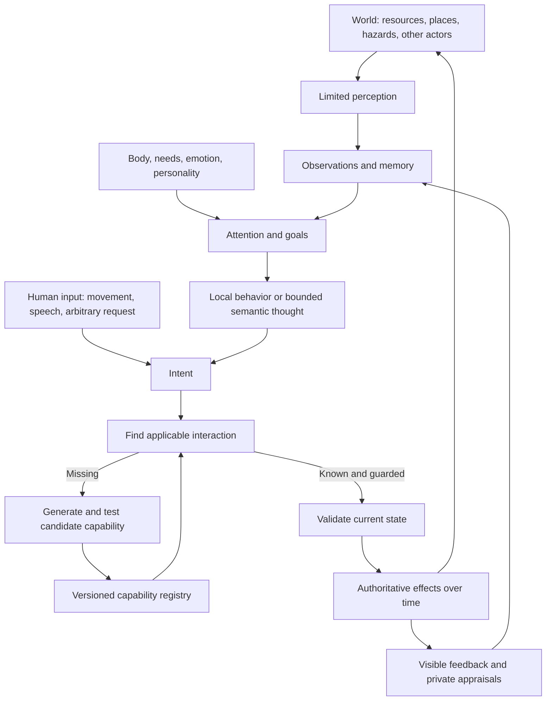

# Open Legend — master map

Status: navigation and traceability. This map connects requirements, proposed systems, research, and delivery. It is not a list of implemented features.

Current accepted start: primitive wilderness people with some survival knowledge, resources and possessions; no established village. NPC death is a valid outcome. Seed essential survival mechanics, and design an accelerated clock with creator controls. The suggested one-hour day remains provisional. [User follow-ups](00-source/design-followups.md)

Accepted technical/visual direction: PlayCanvas browser presentation, an independent headless simulation and generative-rule interface, and grounded modern pixel art with 3D structure. Exact camera, engine version, editor adoption, asset pipeline and target devices remain open. [Visual brief](03-design-proposals/visual-direction.md), [D02/D29](05-project/open-decisions.md)

## Product and technical loops

The world loop produces consequences. The memory loop produces continuity. The capability loop expands what the world can do. Rendering and audio make all three understandable; they do not decide world truth.

## Feature-to-system-to-delivery map

| Domain | Requirement IDs | Main document | First useful slice | Expansion |
|---|---|---|---|---|
| Access and embodiment | F01, F23, F25 | [World/player](03-design-proposals/world-and-player-experience.md) | Login, movement, own meters, forgiving recovery | Camera refinement, character options |
| Needs and anatomy | F02–F04 | [Agents](03-design-proposals/agents-and-social-simulation.md) | Hunger/rest, small body graph | Organs, conditions, aging, families |
| Starting society and native survival | F35–F37, F39 | [Survival baseline](03-design-proposals/survival-baseline.md) | Wilderness group, possessions/knowledge, gather/eat/rest, consequential NPC death | Shelter/crafting variants, settlement and social organization through play |
| Clock and creator speed | F38 | [Time model](03-design-proposals/time-and-simulation-speed.md) | Shared accelerated clock; candidate 24× base; changeable creator speed | Tuned lifecycle/calendar, observed fast-forward, compatible sector clocks |
| Emotion and personality | F05, F07 | [Human models](02-research/human-models-and-memory.md) | Small tendencies, cause-linked affect | Sparse facets and composite UI |
| Memory and social continuity | F06, F09, F21 | [Agents](03-design-proposals/agents-and-social-simulation.md), [storage and retrieval](03-design-proposals/memory-storage-and-retrieval.md), [Macrofold comparison](02-research/macrofold-workspaces.md) | Episodes, attribution, commitments in a logical per-NPC mind | Consolidation, beliefs, richer relationships, optional tool workspaces |
| Perception | F08, F22, F27 | [Architecture](03-design-proposals/system-architecture.md) | Distance/visibility, scoped text | Walls, light, sound, voice |
| Thought and semantic routing | F09–F10, F31 | [Jev](02-research/jev-and-semantic-routing.md) | Rules + asynchronous dialogue/novel reasoning | Evaluated bounded judge, richer harnesses |
| Arbitrary interactions | F11–F13 | [Protocol](03-design-proposals/interaction-protocol.md) | Intent mapping and guarded known actions | Generated mechanism families |
| Runtime growth | F14–F16, F20 | [Capability lifecycle](03-design-proposals/generative-capability-lifecycle.md) | Declarative recipes/effects and creator preview | Isolated algorithms, trusted primitive releases |
| Items and construction | F17–F18, F42 | [World/player](03-design-proposals/world-and-player-experience.md), [evolving materials/buildings](03-design-proposals/evolving-materials-and-construction.md) | Small material library, inventory, simple crafting, editable shelter parts | Continuous expansion/replacement, derived spaces/households, property evolution, [local heat/fire](03-design-proposals/heat-and-fire.md) |
| Institutions and technology | F19 | [World/player](03-design-proposals/world-and-player-experience.md) | Promises, cooperation, learned recipes | Groups, formal organizations, discovered dependency graph |
| Feedback and fairness | F21–F23 | [World/player](03-design-proposals/world-and-player-experience.md) | Local causal feed, anticipation, private NPC state | Better interruption, repair and recovery tools |
| Phones and speech | F24, F27 | [Engine/audio](02-research/engines-art-and-audio.md) | Text dialogue first | Contacts, texts, calls, spatial voice |
| Graphics and environment | F15–F16, F25, F40 | [Visual brief](03-design-proposals/visual-direction.md), [engine/art](02-research/engines-art-and-audio.md) | Compelling PlayCanvas wilderness proof with grounded pixel art, terrain depth, lighting and a repeatable animation family | Richer assets, weather, destruction and optional physics within measured budgets |
| Simulation ownership | F30, F40–F41 | [Architecture](03-design-proposals/system-architecture.md) | Own headless rules, clock and generative interface; reuse engine infrastructure | Measured simulation depth; G2 runtime only when justified |
| World rules and simulation scope | F43–F44 | [World parameters](03-design-proposals/world-rules-and-parameters.md), [complexity](03-design-proposals/simulation-scope-and-complexity.md) | One explicit profile, coarse systems, allowed/missing/forbidden distinctions and friendly feedback | World-compatible invention, measured refinements, explicit profile migrations and domain extensions |
| Hosting and population scale | F26, F30–F31 | [Hosting](02-research/hosting-and-scale.md) | One authority/region, persistence, bounded queues | Sectors, handoff, regional scaling |
| Business and impact | F28–F29 | [Ideation](04-ideation/business-and-future-directions.md) | Measure cost and player value | Paid allowances, private worlds, validated adjacent uses |
| Planning and evidence | F30, F32–F34 | [Roadmap](05-project/roadmap.md) | Research archive only | Decision-driven experiments and implementation |

## Data and authority map

| Record | Owner | Visibility | Key distinction |
|---|---|---|---|
| Entity physical state | Sector authority | Relevant observable projection | World fact differs from an actor's belief |
| NPC memory/thought summary | Actor cognition store | Private; selected speech or cues only | Forgetting does not erase history |
| Relationship | Directional actor assessment | Private unless revealed | Two actors can disagree |
| Capability definition | Versioned registry | Discoverability and execution policy | Engine support differs from actor knowledge |
| Recipe knowledge | Actor or institution | Learned/taught/observed | Not automatically global when created |
| Event journal | Authoritative persistence | Filtered local explanations | Proposed outcome differs from committed outcome |
| Asset | Versioned manifest/storage | Approved client content | Appearance differs from simulation semantics |
| Account entitlement | Application service | Account-specific | Purchase does not grant creator powers |
| Creator operation | Admin permission scope | Audit plus appropriate world observations | Outside emergent in-world governance |

## Dependency order

1. Define authoritative state, clock, observations and command contracts.
2. Prove one compelling PlayCanvas wilderness scene and connect it to headless built-in survival actions, timed work, needs and death; validate the visual family before broad asset production.
3. Add seeded knowledge/possessions, basic autonomous life, dialogue and bounded memory.
4. Add guarded reusable mechanisms and a small generated composition.
5. Extend social/world depth based on playtests.
6. Add voice and sectors when validated demand justifies them.
7. Broaden generativity and expensive visual effects only with measured benefits; core visual appeal belongs in the first scene.

Foundations for all phases: bounded time/work/cost, stable identity, versioned definitions, perception filtering, idempotency, useful debugging, persistence and recovery. These should be minimal implementations when coding begins, not separate infrastructure projects.

## Where each kind of information belongs

- **What the user asked for:** [baseline](01-requirements/product-baseline.md) and [original brief](00-source/original-brief.txt).
- **What external evidence says:** [research guide](02-research/source-guide.md) and linked research documents.
- **How we currently propose building it:** [design overview](03-design-proposals/overview.md) and detailed proposals.
- **What else might be valuable:** [open ideation](04-ideation/business-and-future-directions.md).
- **How the open project and creator ecosystem fit:** [licensing](../LICENSING.md), [creator economy and packs](06-marketing/creator-economy-and-mechanics-packs.md), and [patrons, contributors and history](06-marketing/patrons-contributors-and-world-history.md).
- **What needs a choice:** [decision register](05-project/open-decisions.md).
- **What needs evidence:** [research backlog](05-project/research-backlog.md).
- **What might be implemented next:** [roadmap](05-project/roadmap.md).
- **What actually exists:** [implementation status](05-project/implementation-status.md).
