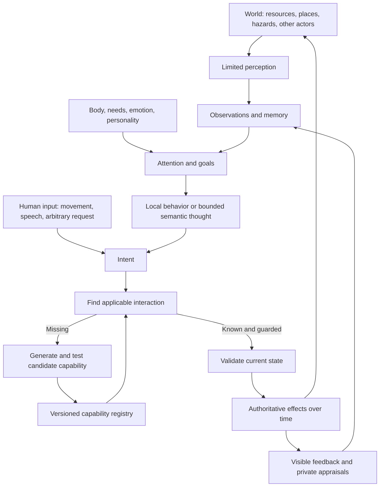

# Open Legend — master map

Status: navigation and traceability. This map connects requirements, proposed systems, research, and delivery. It is not a list of implemented features.

Current accepted start: primitive wilderness people with some survival knowledge, resources and possessions; no established village. NPC death is a valid outcome. Seed essential survival mechanics, and design an accelerated clock with creator controls. The accepted base is 60:1, with 0.5×/1×/3×/8× controls and no offline catch-up. [User follow-ups](00-source/design-followups.md)

Accepted technical/visual direction: PlayCanvas browser presentation, an independent headless simulation and generative-rule interface, and grounded modern pixel art with 3D structure. Exact camera, engine version, editor adoption, asset pipeline and target devices remain open. [Visual brief](03-design-proposals/visual-direction.md), [D02/D29](05-project/open-decisions.md)

## Product and technical loops

[Agent agency](../docs/agent-agency.md) owns optional decisions and operational goals/plans, with [AG delivery](../docs/maintainers/agent-agency.md) and [runtime semantics](07-technical-architecture/agent-agency-runtime.md). The [EPR contract](../docs/events-perception-and-reactions.md) owns reaction intake. [Narration/conversation design](../docs/narration-and-conversations.md) and [NC delivery](../docs/maintainers/narration-and-conversations.md) retain communication and private storytelling; missing mechanics remain INV/NC13 work. [Agency research](02-research/agency-cognition-and-planning.md) explains the design rationale and limits.

The world loop produces consequences. The memory loop produces continuity. The capability loop expands what the world can do. Rendering and audio make all three understandable; they do not decide world truth.

The [detailed technical architecture](07-technical-architecture/README.md) specifies the contracts behind these loops. Context assembly separates permitted evidence, unknowns, dependencies and budgets before choosing code, Jev, a single model call or an agent. Open Legend owns relevance and authoritative effects; the [Macrofold handoff](07-technical-architecture/macrofold-implementation-brief.md) proposes reusable execution infrastructure.

## Feature-to-system-to-delivery map

The [perception and attention contract](07-technical-architecture/perception-and-attention.md) expands the limited-perception and attention stages above. F62–F67/D51–D54 cover overlays and embodied visual parity, exposure-specific descriptions, event-based hearing, arbitrary-intent semantic interests and batched encounter/need decisions. Native exposure does not imply a separate Jev or LLM call. This is a documented future subsystem, with current behavior explicitly audited.

| Domain | Requirement IDs | Main document | First useful slice | Expansion |
|---|---|---|---|---|
| Access and embodiment | F01, F23, F25 | [World/player](03-design-proposals/world-and-player-experience.md) | Login, movement, own meters, forgiving recovery | Camera refinement, character options |
| Needs and anatomy | F02–F04 | [Agents](03-design-proposals/agents-and-social-simulation.md) | Hunger/rest, small body graph | Organs, conditions, aging, families |
| First playable acceptance | F50–F52 | [MVP scope](05-project/first-playable-mvp.md) | Live AI, generated sling, hunting/food, another invention; pause/speed and pause while away | Larger social group and broader discovery after complete creative loop |
| Starting society and native survival | F35–F37, F39 | [Survival baseline](03-design-proposals/survival-baseline.md) | Wilderness group, possessions/knowledge, gather/eat/rest, consequential NPC death | Shelter/crafting variants, settlement and social organization through play |
| Clock and creator speed | F38 | [Time model](03-design-proposals/time-and-simulation-speed.md) | Shared accelerated clock; accepted 60:1 base and 0.5×/1×/3×/8× presets; changeable creator speed | Tuned lifecycle/calendar, observed fast-forward, compatible sector clocks |
| Emotion and personality | F05, F07 | [Human models](02-research/human-models-and-memory.md) | Small tendencies, cause-linked affect | Sparse facets and composite UI |
| Memory and social continuity | F06, F09, F21 | [Agents](03-design-proposals/agents-and-social-simulation.md), [canonical memory architecture](../docs/memory-architecture.md), [Macrofold comparison](02-research/macrofold-workspaces.md) | Awareness-scoped experience, attribution and protected native commitments in a logical per-actor mind | Six-hour raw recall, hourly cleanup, accepted inner-world text, required background file reflection and sleep rules; CR01–CR12 |
| Perception | F08, F22, F27 | [Architecture](03-design-proposals/system-architecture.md) | Distance/visibility, scoped text | Walls, light, sound, voice |
| Thought and semantic routing | F09–F10, F31, F50 | [Context and inference](07-technical-architecture/context-and-inference.md), [Jev](02-research/jev-and-semantic-routing.md) | Live LLM decisions/chat/generation and useful bounded Jev classification; native plan execution | Richer bounded harnesses and measured routing refinements |
| Arbitrary interactions | F11–F13 | [Protocol](03-design-proposals/interaction-protocol.md) | Intent mapping and guarded known actions | Generated mechanism families |
| Runtime growth | F14–F16, F20 | [Capability lifecycle](03-design-proposals/generative-capability-lifecycle.md) | Declarative recipes/effects and creator preview | Isolated algorithms, trusted primitive releases |
| Items and construction | F17–F18, F42 | [World/player](03-design-proposals/world-and-player-experience.md), [evolving materials/buildings](03-design-proposals/evolving-materials-and-construction.md) | Small material library, inventory, simple crafting, editable shelter parts | Continuous expansion/replacement, derived spaces/households, property evolution, [local heat/fire](03-design-proposals/heat-and-fire.md) |
| Institutions and technology | F19 | [World/player](03-design-proposals/world-and-player-experience.md) | Promises, cooperation, learned recipes | Groups, formal organizations, discovered dependency graph |
| Feedback and fairness | F21–F23 | [World/player](03-design-proposals/world-and-player-experience.md) | Local causal feed, anticipation, private NPC state | Better interruption, repair and recovery tools |
| Phones and speech | F24, F27 | [Engine/audio](02-research/engines-art-and-audio.md) | Text dialogue first | Contacts, texts, calls, spatial voice |
| Graphics and environment | F15–F16, F25, F40 | [Visual brief](03-design-proposals/visual-direction.md), [engine/art](02-research/engines-art-and-audio.md) | Compelling PlayCanvas wilderness proof with grounded pixel art, terrain depth, lighting and a repeatable animation family | Richer assets, weather, destruction and optional physics within measured budgets |
| Simulation ownership | F30, F40–F41 | [Architecture](03-design-proposals/system-architecture.md) | Own headless rules, clock and generative interface; reuse engine infrastructure | Measured simulation depth; G2 runtime only when justified |
| World rules and simulation scope | F43–F44 | [World parameters](03-design-proposals/world-rules-and-parameters.md), [complexity](03-design-proposals/simulation-scope-and-complexity.md) | One explicit profile, coarse systems, allowed/missing/forbidden distinctions and friendly feedback | World-compatible invention, measured refinements, explicit profile migrations and domain extensions |
| World creation and discovery experience | F45–F49 | [Creation/discovery](03-design-proposals/world-creation-and-discovery.md), [state/future influences](03-design-proposals/state-systems-and-future-influences.md) | Familiar presets, meaningful defaults, sparse questions, consistent shared rules, natural character learning | Reusable defaults from play; bounded anticipated relationships activated only after validation |
| Hosting and population scale | F26, F30–F31 | [Hosting](02-research/hosting-and-scale.md) | One authority/region, persistence, bounded queues | Sectors, handoff, regional scaling |
| Business and impact | F28–F29 | [Ideation](04-ideation/business-and-future-directions.md) | Measure cost and player value | Paid allowances, private worlds, validated adjacent uses |
| Planning and evidence | F30, F32–F34 | [Roadmap](05-project/roadmap.md) | Research archive only | Decision-driven experiments and implementation |

## U14: invention governance and player tools

| Requirements | Design home | Foundation and expansion |
|---|---|---|
| F53–F55 | [Governance, ownership and packs](03-design-proposals/invention-governance-and-ownership.md) | Persisted admission policy and attribution; account libraries, complete releases, reuse terms and marketplace later |
| F56–F58 | [Playability and controls](03-design-proposals/playability-and-controls.md) | Complete permitted action catalogue and execution counts; configurable drawers, shortcuts and contextual slots |
| F59–F60 | [World agent and workshop](03-design-proposals/world-agent-and-workshop.md) | Durable journal and technical inspection; scoped read tools, candidate revisions and validated activation/migration |

See the [invention implementation tracker](../docs/maintainers/inventions-and-world-evolution.md). These are proposed extensions. Whole-world god access is a separate authorized audience from ordinary actor/private views; it does not disclose private NPC context to other players or models working for them.

## Data and authority map

| Record | Owner | Visibility | Key distinction |
|---|---|---|---|
| Entity physical state | Sector authority | Relevant observable projection | World fact differs from an actor's belief |
| NPC memory/thought summary | Actor cognition store | Private; selected speech or cues only | Forgetting does not erase history |
| Relationship | Directional actor assessment | Private unless revealed | Two actors can disagree |
| Capability definition | Versioned registry | Discoverability and execution policy | Engine support differs from actor knowledge |
| Recipe knowledge | Actor or institution | Learned/taught/observed | Not automatically global when created |
| Event journal | Authoritative persistence | Filtered local explanations | Proposed outcome differs from committed outcome |
| Asset | Versioned manifest/storage | Approved client content | Appearance differs from simulation semantics |
| Account entitlement | Application service | Account-specific | Purchase does not grant creator powers |
| Creator operation | Admin permission scope | Audit plus appropriate world observations | Outside emergent in-world governance |

## Dependency order

M10/M11 make steps 1–4 internal work toward the complete [first playable MVP](05-project/first-playable-mvp.md), not four successive playable releases. P1 includes live AI/Jev, conversation, generated sling/hunting/food and another invention, plus pause/speed and no unattended progression.

1. Define authoritative state, clock, observations and command contracts.
2. Prove one compelling PlayCanvas wilderness scene and connect it to headless built-in survival actions, timed work, needs and death; validate the visual family before broad asset production.
3. Add seeded knowledge/possessions, basic autonomous life, dialogue and bounded memory.
4. Complete live-generated sling crafting, equipment/ammunition, simple hunting, finite harvesting and food preparation/eating; test another invention, with bow-and-arrow the candidate, through shared families.
5. Extend social/world depth based on playtests.
6. Add voice and sectors when validated demand justifies them.
7. Broaden generativity and expensive visual effects only with measured benefits; core visual appeal belongs in the first scene.

Foundations for all phases: bounded time/work/cost, stable identity, versioned definitions, perception filtering, idempotency, useful debugging, persistence and recovery. These should be minimal implementations when coding begins, not separate infrastructure projects.

## Where each kind of information belongs

- **What the user asked for:** [baseline](01-requirements/product-baseline.md) and [original brief](00-source/original-brief.txt).
- **What external evidence says:** [research guide](02-research/source-guide.md) and linked research documents.
- **How we currently propose building it:** [design overview](03-design-proposals/overview.md) and detailed proposals.
- **The implementation contracts and platform handoff:** [technical architecture index](07-technical-architecture/README.md), including context, declaration evolution and Macrofold phases.
- **What else might be valuable:** [open ideation](04-ideation/business-and-future-directions.md).
- **How the open project and creator ecosystem fit:** [licensing](../LICENSING.md), [creator economy and packs](06-marketing/creator-economy-and-mechanics-packs.md), and [patrons, contributors and history](06-marketing/patrons-contributors-and-world-history.md).
- **What needs a choice:** [decision register](05-project/open-decisions.md).
- **What needs evidence:** [research backlog](05-project/research-backlog.md).
- **What might be implemented next:** [roadmap](05-project/roadmap.md).
- **What actually exists:** [implementation status](05-project/implementation-status.md).
