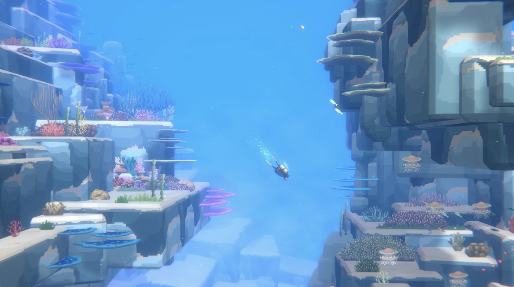
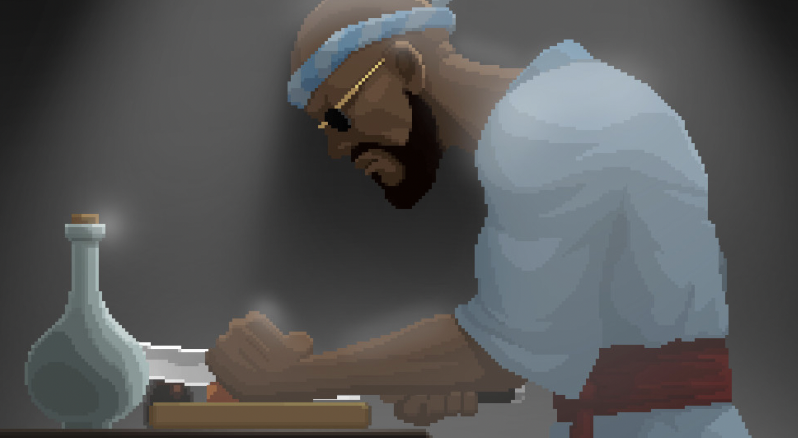
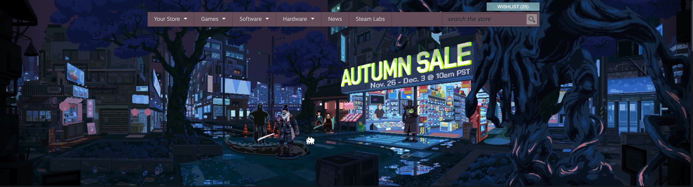
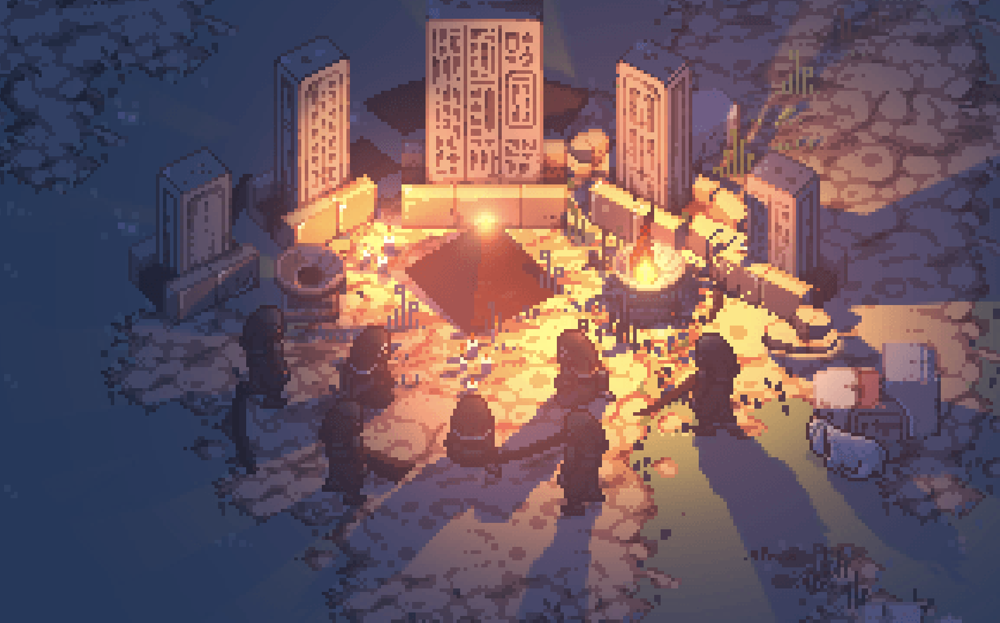
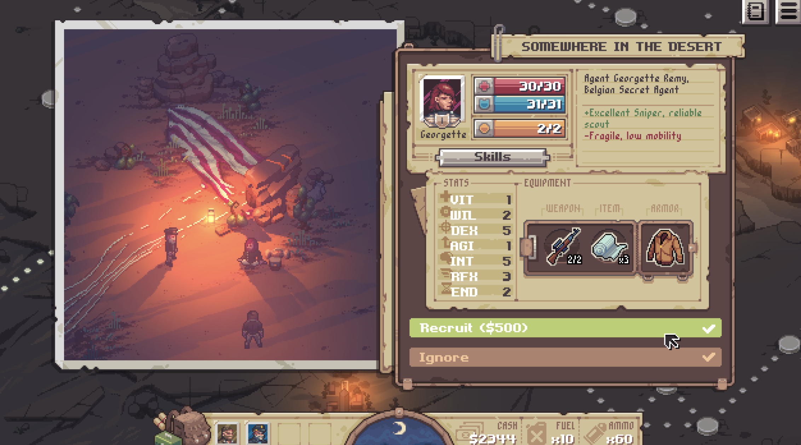

# Open Legend — final creative inspiration board

[Open the visual board](index.html)

Confirmed favorites, with creative interpretation kept distinct from your stated preferences. This is the final curated reference set for this discussion, not a finalized renderer, asset budget or production specification.

## Shared direction

Richly detailed, dimensional worlds; expressive and recognizable people; purposeful light; and an inviting sense of life. Pixel art and illustrated approaches are both valid references. Readable silhouettes and quiet areas matter as much as fine texture. The latest endorsements of Dave the Diver and Hades make clear that stylization can be a positive rather than an automatic rejection.

## The practical brief

- Give the wilderness layered terrain, vegetation and atmospheric depth, without making permanent gloom the default.
- Make body shape, clothing, hair, skin tone and carried equipment readable at gameplay distance. Use profiles and close views for richer face and material detail.
- Let campfires, water and shadows connect people to their surroundings. Compose light around an identifiable source and preserve readable values.
- Add meaningful lived-in objects, not uniform visual noise. Use fine detail where it describes identity, material or use.
- Keep human scale, environment scale and close-up scale explicit when evaluating artwork. A large portrait or promotional illustration is not a runtime feasibility result.

## Favorites and their contributions

### Dave the Diver — Personality at every scale

**Your preference:** Your strongest new endorsement: “I LOVE DAVE THE DIVER ART.” You supplied the underwater scene, character close-up and restaurant as references.

**Visual reading:** The underwater image pairs a small readable diver with enormous layered rock forms, blue atmospheric depth and delicate coral. The chef close-up describes face, fabric folds and a purposeful gesture. In the restaurant, varied bodies and outfits make a busy social scene feel inhabited.

**Creative translation:** Give the wilderness depth and breathing room; make individuals recognizable through body shape, hair, skin tone and equipment. Let closer character views reveal richer faces and material detail while world avatars stay legible.

**Context:** The chef is a close-up, not evidence of facial detail at gameplay distance. Your new endorsement broadens the earlier concerns about cartoon-like proportions: appealing stylization is welcome when the finish and personality work.

Source: User-supplied screenshot

Source: User-supplied screenshot

Source: User-supplied screenshot

### Steam Autumn Sale illustration — The detail benchmark

**Your preference:** You called this exceptional, specifically praising pixel density and character/environment detail.

**Visual reading:** Twisting foreground roots, layered buildings, little storefront objects and differentiated figures make the scene reward close inspection. The brightest shop holds attention; quieter blue silhouettes keep the density organized. Reflections connect the lights to the ground.

**Creative translation:** Use deliberate fine detail for clothing, tools, bark, shelters and small possessions. Compose scenes with foreground framing, readable figures and a clear focal area. A dense world should still have quiet spaces.

**Context:** This is a promotional illustration, not a game. It establishes a visual aspiration, not evidence of runtime performance, animation or procedural generation. Artist and original publication provenance are not verified; preserve the supplied screenshot as reference only.

Source: User-supplied screenshot

### Pathway — Light makes the world dimensional

**Your preference:** You singled out Pathway’s lighting as really great.

**Visual reading:** Amber illumination against blue-violet surroundings models the stone, separates figures and throws long directional shadows. The recruitment view demonstrates a readable world figure paired with a more detailed portrait and equipment display.

**Creative translation:** Make campfires and lanterns cast convincing pools of color and directional shadows. Carry light onto nearby materials and characters. Use profiles to reveal identity and gear without requiring tiny world faces to do everything.

**Context:** The supplied image shows the appearance of lighting, not proof of a particular lighting implementation. Borrow the light/material relationship; the historical setting and parchment UI are not selected requirements.

Source: User-supplied screenshot

Source: User-supplied screenshot

### Hades — The illustrated finish

**Your preference:** You explicitly love Hades and call its art really great.

**Visual reading:** Clear silhouettes and strongly grouped color let an ornate angled world remain readable. Vegetation, water and stone each contribute distinct shapes.

**Creative translation:** Aim for a coherent art direction across people, environment and props; use color grouping to make a rich scene easy to read.

**Context:** Illustrated rather than conventional pixel art. Its mythology, combat effects and exaggerated character design are not automatically part of our brief.

Source: https://guides.gamepressure.com/hades/guide.asp?ID=60343

### Hades II — People worth getting to know

**Your preference:** You explicitly love Hades II and reaffirmed it as a favorite.

**Visual reading:** The small world figures and expressive large portraits serve different jobs. Costumes and silhouettes communicate identity; close views provide face and personality.

**Creative translation:** Create an intentional relationship between recognizable world agents and detailed character profiles. Let clothing and possessions tell personal stories.

**Context:** The dialogue reference is Early Access media. A beautiful portrait alone does not establish that ordinary world avatars meet our identity requirements.

Source: https://www.gamesradar.com/games/hades/hades-2-surface-ward-incantation/

Source: https://www.supergiantgames.com/blog/hades2-early-access-is-here/

### REPLACED — Cinematic pixel craft

**Your preference:** REPLACED was your strongest preference in both earlier rounds, and you reaffirm it here.

**Visual reading:** Fine environmental detail, dimensional lighting and carefully staged space create a cinematic finish rather than a deliberately coarse retro one.

**Creative translation:** Use it as the standard for care in surfaces, clothing, atmosphere and scene composition. Translate that finish into vegetation, wood, stone and primitive possessions.

**Context:** Some reference imagery is promotional. The city, side-view camera, violence and nighttime mood are not selected requirements; a still does not verify animation.

Source: https://www.pcmrace.com/2022/12/09/replaced-se-lanzara-para-pc-xbox-y-game-pass-en-el-2023-nuevos-screenshots-y-trailer-de-gameplay/

### Tails Noir / Backbone — People, materials and atmosphere

**Your preference:** A repeated favorite: you specifically praised water reflections, lighting, character detail and the environment.

**Visual reading:** Readable clothing and dense inhabited surroundings work together. Reflected light ties architecture, water and figures into one convincing place.

**Creative translation:** Give people distinctive outfits and grounded material responses. Carry atmosphere through the entire scene, not just a background layer.

**Context:** Borrow the finish, not the anthropomorphic cast, city setting or noir mood as a permanent default.

Source: https://game-guide.fr/231194-backbone-un-jeu-denquete-en-pixelart/

### Transistor — Color with intention

**Your preference:** You named Transistor among the beautiful games in your final favorites.

**Visual reading:** Repeated shapes, colored light and graphic architectural detail create a unified scene around a distinct protagonist.

**Creative translation:** Choose purposeful palettes and shapes for each place. Let clothing and important objects stand out without turning every element into a bright accent.

**Context:** Urban geometry and science fiction are references for composition, not the wilderness subject matter.

Source: https://www.mobygames.com/game/65869/transistor/screenshots/windows/758398/

### Octopath Traveler II — Intimate light in a large world

**Your preference:** You now name Octopath Traveler as a favorite. Earlier you especially praised lighting, mood and palette while wanting a more modern treatment of people.

**Visual reading:** Warm campfire light against the cool surrounding wilderness makes a small party feel present and protected. The depth gives the setting scale.

**Creative translation:** Use firelight, shade and daylight to change the emotional character of a place. Keep a small human gathering readable within expansive nature.

**Context:** The image is Octopath Traveler II. Miniature figures and strong blur are not mandatory: earlier reservations remain useful component-level guidance.

Source: https://www.square-enix-games.com/en_GB/games/octopath-traveler-ii

### Eastward — A place with life in it

**Your preference:** You love Eastward’s environment, colors, lighting and mood, and include it in the final favorites. Earlier you asked for more detailed bodies and readable gear.

**Visual reading:** Small props, layered architecture and vegetation make the environment seem used and lived in. Color variety adds warmth without making every object equally important.

**Creative translation:** Let camps accumulate meaningful objects: bundles, tools, cooking materials, wear and vegetation. Create richness through the traces of people living there.

**Context:** Liking the whole direction does not require copying its simplified character proportions. Keep clothing and gear legible at our actual camera scale.

Source: https://www.gamesradar.com/eastward-review/

### Ori and the Will of the Wisps — Nature with depth and wonder

**Your preference:** You named Ori as one of the beautiful final favorites.

**Visual reading:** Organic silhouettes and atmospheric layers create deep space. Light separates surfaces and suggests moisture, air and distance.

**Creative translation:** Build a wilderness with layered foliage, clear near/far relationships and luminous moments. Let forests feel alive, including in daylight.

**Context:** Painterly dimensional presentation, not conventional pixel art. The nonhuman protagonist is not a human-character reference. Persistent gloom or heavy blur is not required.

Source: https://www.neoseeker.com/ori-and-the-will-of-the-wisps/Gorlek_Ore

## Provenance and rights

Six screenshots were supplied by the user and copied unchanged into images/ so temporary clipboard files are not dependencies. Other images remain at the credited remote hosts. Artwork belongs to its respective owners; no production reuse rights or AGPL license are asserted for these third-party images. Steam Autumn Sale is identified by the supplied image, with artist/year unverified. Earlier boards, ratings and feedback are preserved.
