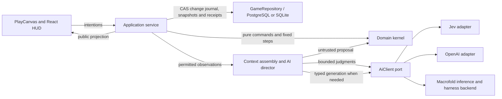

# Implemented architecture

Changes to state ownership or persistence must respect the [save/load design](save-and-load.md). It owns the intended gameplay restoration contract; the mechanisms described here remain the current implementation.

The canonical [memory architecture](memory-architecture.md) owns behavior; [CR01–CR12](maintainers/cognition-redesign.md) track implementation and acceptance. September 20 runtime update: compact decisions, native multi-question Jev, scoped embeddings, awareness/consolidation, PostgreSQL accepted text, background workspace reflection, sleep accounting and grouped god inspection are implemented. Live evidence and remaining acceptance work are tracked in [maintainer TODO](maintainers/TODO.md); implementation is not a claim of complete behavioral acceptance.

The [long-term architecture](../archive/07-technical-architecture/README.md) remains design context. The [production data model](../archive/07-technical-architecture/production-data-model.md) distinguishes implemented single-writer PostgreSQL prerequisites from conditional distributed infrastructure. Current storage commits a transactional change journal with periodic snapshots; it also publishes `mind.inner_world` atomically. This is not the full normalized production schema.

## Manual gameplay saves

Settings & help provides named manual slots in the current authority database (`game_saves`), with 20 manual saves plus one replaceable pre-load recovery slot and a 64 MiB payload limit. `GameSaves` owns packaging/history capture and slot persistence; `WorldService` owns the serialized capture/restore transition. The package serializes the complete current `SavedWorld` and the history repository's tables, preserving cold history and accepted generated world definitions without a separate field registry. Capture flushes native progress and reads history in the same database lane; save publication is transactional.

Loading pauses admission, drains the AI director, retains the current world as “Before last load,” installs history and world in one commit, preserves current forgetting/accounting/external-operation records, rotates command and provider-context identities, resets derived scheduling caches and reopens paused. Captured queued/running narration is cancelled, not redispatched. Browser world-agent sessions and drafts reset on the new timeline; these local drafting sessions are not authoritative game state. Existing attempt/cooldown guards stay outside rewind. Load operation receipts prevent a repeated request from rewinding twice. Operational backup and import include slot rows.

**2026-09-21:** only the current development save format is supported, under the [no-legacy policy](save-and-load.md#active-development-policy). No new migration or compatibility readers are implemented. Old compatibility code predating this feature is not a requirement to maintain or extend. Saves remain local, full snapshots; autosaves, import/export UI, cloud/shared-world restore and performance qualification are not implemented. SQLite native UI evidence is in [Verification](verification.md#manual-saveload-runtime); automated, PostgreSQL and live-provider checks remain deferred in the [TODO](maintainers/TODO.md#manual-saveload-deferred-validation).

## Performance critical path

Ground clicks send movement intentions directly. Native commands and timer transitions share the `WorldService` mutation queue. Explicit commands await repository commit before their results return; routine simulation retains its one-real-second flush policy. Background thought admission and maintenance no longer hold the native timer. Fixed steps preserve their original transition/RNG boundaries; catch-up accepts a prefix and releases mutation ownership before yielding after about eight milliseconds of work; a single expensive step can still exceed that interval.

Durable history uses a domain-proven append path with unique-key conflict rejection. Event encodings are reused; events, audiences and perspectives are inserted in parameterized chunks of at most 900 parameters or approximately 256 KiB, allowing one oversized row. Edits, revocation and forgetting retain their transactional cleanup. History schema readiness is cached only after commit. Actor migrations and trait initialization run at startup; actor creation/capability admission initializes cognition, and ordinary saves no longer scan actors for migration or replace unchanged social policy.

The Narrator wakes from committed queued-story changes, explicit regeneration, startup recovery and resume. It uses one earliest-due timer and one runner, drains durable jobs and retains wakeups arriving during active work. Cancellation is registered before claim I/O and rechecked before reservation; stale selection or source claims go through the repository cancellation boundary. Interrupted running claims remain uncertain rather than being automatically dispatched again. Rollback can cause a conservative extra queue check after a later successful commit, but cannot dispatch rolled-back work. Thought and maintenance scheduling coalesce one ticket per cognitive actor, compare relevant source identities/need thresholds/visibility, and use simulation-time deadlines plus durable wall-time cooldowns. Ordinary animals do not enter that scheduler. Clean tickets skip history/context and integration reads; a small relevance scan still runs at admission opportunities. Startup rebuilds tickets from saved state and schedule records. Scheduling storage failures retain the paused/error boundary.

Public publication coalesces on the next event-loop turn rather than waiting 100 ms. Optional usage, jobs, speech-job status and latest narration refresh independently of gameplay projection, with promise identity checks rejecting superseded results. Conversation text is projected synchronously from scoped events; only reply status waits for optional reads. Its cache compares at most 30 event identities instead of serializing the transcript. Private optional sections clear while invalidated results load; usage retains its last known value, with an estimated zero placeholder before its first read. Player-scoped history revisions exclude ordinary movement starts and advance when narration finishes or is explicitly regenerated. A separate epoch clears retained client history on edits, forgetting and relevant source invalidation. Talk loads on opening or scoped history changes and preserves its opening scroll signal when a refresh supersedes the initial request; Journal signals new entries without periodic history polling. Both preserve explicit older-page loading; destructive invalidation resets retained pages for privacy.

Encounter perception builds a spatial candidate grid after movement, preserves original entity order, then applies exact visibility/hysteresis rules. Immutable observations and player visibility share a spatial index, with exact sight checks after candidate selection. Outstanding commitments use completion-event and due-time indexes; source identities invalidate them after edits or recovery. Navigation caches static walkability and uses numeric breadth-first queues with unchanged direction tie-breaking. Animal simulation retains every native step and RNG draw; dormancy and analytic updates are not implemented. Experience additions check their own source collection instead of materializing every retained collection; source lookup still scans that collection.

Durable history is projected before hot event eviction in the same transaction. The active set retains the latest 512 events plus sources referenced by current awareness, personal records, obligations and knowledge; eviction waits for at least 256 removable records. This bound depends on active memory and population. Cold history remains in indexed SQL tables with paged retrieval. Rare owner saves hydrate the full event dependency graph before applying existing edit/forget rules. Startup checks archived row counts; backup, import and restore preserve the archive. Checkpoint JSON is prepared for a fixed candidate revision before entering the SQL transaction. These operations still use the main process.

New browser gameplay commands include an opaque server-issued `commandEpoch`. Complete results and request fingerprints commit in `gameplay_receipts` alongside world effects, outside simulation state. Each admitted command is retryable for 24 hours, including after restart; a different body conflicts. Epochs rotate after 24 wall-clock hours, with the new generation/token persisted before pruning expired rows from older generations. Unknown retired tokens and expired receipts return `expired` before domain execution. Restore issues a fresh random token so replay cannot become fresh admission after a rewind. Legacy requests without epochs and existing domain receipts remain compatible and unpruned; provider/invention/billing/admin identities are separate. This local mechanism does not implement multiplayer controller admission.

`GET /api/performance` is available through the existing authenticated local-owner boundary. It exposes bounded in-memory stage durations/counts: at most 32 stage names and 256 recent samples per stage, without SQL parameters or per-span database writes. Current stages cover mutation wait, native steps, tick wall/native-work/yield time, persistence diff/encoding/transaction time, world commits, durable commands, public projection, GC pauses, SQLite statements and PostgreSQL statement/lane time. Durations include cumulative count/total/maximum and recent percentiles; nested spans overlap and must not be added together. Runtime counters distinguish requested/accepted simulated time, active real time, excluded long gaps and busy timer callbacks. Pending debt includes in-flight batches until accepted; it excludes real time since the latest timer admission. Bounded latest-value gauges expose process CPU (100% is one core), heap bytes and event-loop sampled delay. The latter uses 20 ms sampling resolution and is not excess timer lateness; `timer.lateness` measures excess over the 50 ms callback interval. Runtime metrics are process-local, reset on restart, and monitors stop on server close. Compare cumulative deltas over the same process uptime interval, including excluded gaps when assessing clock loss. Request arrival, browser render and complete capacity qualification remain unimplemented.

Native encounter projection captures position scalars once after movement and uses stable spatial candidates for people and objects. Prior visibility membership uses sets; unchanged visibility arrays retain their identity. Event emission still uses authoritative draft entities and preserves audience/order/hysteresis rules. Cognitive signature refresh has separate `cognition.thoughtRefresh` and `cognition.maintenanceRefresh` spans. `ActorWork` still visits all memory-capable minds; thought signatures compute nearby visibility before readiness selection. Autonomous admission still has one world-global workflow and a default 45-second global thought interval, in addition to actor cooldowns. This limits many-agent responsiveness independently of native tick speed.

PostgreSQL retains one asynchronous writer/query lane. Extra connections, command grouping, diagnostic batching and workers remain conditional. Active event sources and legacy receipts still reside in world state; checkpoints still serialize in the main process. The host still has one local principal, so multiple tabs are not independent players. The [performance tracker](maintainers/performance.md) retains the incomplete work and [Verification](verification.md#performance-investigation) records limited native observations, not larger-world capacity.

## Dependencies and authority

Future multiplayer synchronization is specified in the [real-time architecture](../archive/07-technical-architecture/realtime-synchronization.md): server batching, browser prediction, scoped replication and reconnect, with separately gated transport/persistence improvements. This is proposed work, not a claim that the current single-player client implements prediction or that multiplayer capacity has been tested.

The domain imports no application, renderer, provider, database or wall-clock code. It owns every physical change. The browser sends intentions and displays an explicit projection; full snapshots and NPC private records never cross that boundary. The AI client exposes typed execution, not world authority. The composition selects the implemented Macrofold backend when its key is configured, otherwise the direct providers. Backend selection does not change simulation authority; current full deliberation requires Macrofold.

The right-side [god-mode cognition debugger](memory-architecture.md#god-mode-cognition-debugger) groups typed semantic triggers, context/retrieval, Jev routing and execution through committed outcomes. Rows stay compact and expose a short stable reference; detail views show the full request and stage IDs. Rendered triggers describe the initiating player message, new experience, interest cue, survival need, reflection or dream job instead of dumping assembled model context. Expanding semantically named stages reveals cost, tokens, useful structured input/output and receipts, while raw JSON retains the full sanitized stimulus. Root-only world-agent calls render their response or failure code/message. Each provider row distinguishes Open Legend's observed request duration from Macrofold execution and queue latency when the receipt supplies those fields; completed HTTP exchanges retain their own timestamps. Application stages record attempt-specific timing so a superseded retry does not overwrite the first attempt. No-call opportunities and unavailable detail remain explicit. Comprehensive interaction/revocation coverage remains in TODO.

God mode also exposes bounded native world editing through same-origin, owner-session POST routes. A dead actor with a compatible body can be revived, and blank walkable ground can receive one entity from the server-projected finite spawn catalogue. `POST /api/god/person` creates a named NPC with authored personality, backstory, selected descriptive traits and initial goals; an empty trait selection uses the saved-RNG three-trait default. `POST /api/god/spawn` creates another supported native entity family, and `POST /api/god/act` accepts `{ action: "revive", targetId }` for the lifecycle transition. The domain validates walkability, occupancy, trait IDs and lifecycle state, emits labeled committed events and initializes actor memory, knowledge, possessions and protected identity atomically. These explicit owner actions may run while simulation time is paused. They do not admit new definitions, generated mechanics or artwork and are distinct from the planned confirmed conjuring workflow.

Future harness use extends beyond reflection where real tool results determine the next step: [creator investigation, complex invention, conjuring and workshop refinement](../archive/07-technical-architecture/declarations-and-evolution.md#bounded-multi-turn-authoring-and-investigation), and [difficult character planning and teaching](maintainers/cognition-redesign.md#later-harness-extensions). These are later tasks, not claims of delivered tools or prerequisites for ordinary decisions. Bounded within-job tool turns are distinct from durable goals resumed across simulation events; canonical state and all effects remain application-owned.

## State and transitions

`WorldState` is versioned JSON: stable entity IDs with explicit components, stable item instances and definitions, a recipe registry, actor-local knowledge, attributed memories, recent committed events, command/declaration receipts, RNG state and simulation time. Recipes reference native material definitions by ID; possessions reference definitions rather than copying behavior. Physical items, knowing a technique, hearing about it and the engine admitting it are distinct facts.

### Actor means any living being

The accepted domain meaning of **actor** is any living being that can participate in world state and effects, including people and animals. Personhood, species, body plan, controller, cognition, speech and inner-world depth are separate capabilities. A deer can remain a deer while later receiving memory, an intelligent controller, an inner world or speech; these capabilities must not require turning it into a human-shaped entity.

Actions and effects should target the smallest relevant capability rather than a human-only type. `Revive` is a lifecycle action whose intended scope is any dead actor, including an animal. Wetness, fire, injury, healing and health changes likewise apply to every actor with the relevant body/state components, with species-specific anatomy or susceptibility expressed as data or rules. This lets one rule affect people and animals consistently without implying that every actor has human cognition or language.

Schema 3 stores lifecycle, health, species, body and independent cognition/memory/inner-world/speech/needs capabilities on `entity.actor`. `entity.animal` now holds only native wandering/fleeing state. The versioned startup migration preserves entity IDs, placement, inventory, memories, knowledge, RNG and time, removes legacy animal lifecycle fields, and records a migration receipt. A dead animal keeps its identity and kind, with finite harvest state on the same entity. Legacy corpses keep their saved names and yields. God revival restores full health, fullness and energy, clears bodily conditions and reconstructs an intact body even after partial or complete harvesting. Already harvested inventory stays with its owner. A later death creates fresh finite yields; god intervention intentionally ignores resource fairness.

`living.ts` owns native body reconciliation and bounded simultaneous effects. Injury, healing, wetness, burning and direct health contributions aggregate deterministically before clamping. Body data supplies maximum health and susceptibilities; injury reduces movement by at most half. Hunting uses this common mutation and records actual damage. God effects require body revisions; revive supports request receipts and body revision checks. These are finite native families, not executable generated prose or a complete medical/environmental simulation.

Ordinary animals retain native behavior without needs drift, memories or provider scheduling. The owner can grant cognition and speech through the action picker or god action route; the same mind/recall/reflection interfaces then apply without changing species, body, inventory or identity. Cognition health thresholds use the body's maximum health. Private appraisals and kinship are separate from subjective relationship text: sparse, cause-linked fear/discomfort decays on simulation time, while immutable creator-authored parent/sibling facts cannot be rewritten by reflection.

`executeCommand`, `advanceWorld` and `admitDeclaration` return new state, outcomes and events. Work reserves/consumes inputs through trusted rules; completion creates outputs once. Competing harvesters cannot multiply a carcass's finite yield. Ranged launchers and ammunition share one family with mechanism, compatibility, range, accuracy and damage constraints. Hits/misses use the saved pseudorandom state. Animal awareness, wandering and fleeing require no models. Interrupted assembly follows documented cancellation rules in the [domain guide](../packages/domain/src/README.md).

The application processes fixed one-simulation-second steps, publishes routine progress on the 50ms simulation cadence, and coalesces routine durability to one real second. Explicit commands/control changes commit immediately; clean shutdown flushes pending progress. An abrupt crash can lose the most recent unflushed routine progress. The renderer interpolates committed positions and has no physics authority. The base rate is 60 simulated seconds per real second; 0.5×, 1×, 3× and 8× multiply it. At 1×, one real second is one game minute and a day takes 24 real minutes. The host detects suspension from gaps of more than two seconds between timer callbacks, including callbacks while a batch is busy. Continuous busy time accumulates debt instead of triggering suspension. Each batch accepts a prefix of fixed steps after about eight milliseconds of native work, retaining the remainder for follow-up batches after yielding to the event loop and releasing mutation ownership between batches. A single step can exceed the budget. Speed changes retain admitted simulation debt; pause/resume and genuine suspension reset it. Missing-callback intervals remain excluded from catch-up. Domain transitions use isolated Immer drafts with unchanged branches shared. The server explicitly deep-freezes loaded/migrated state, accepted command/editor snapshots and each native-step result; freezing skips already-frozen branches. Domain builders remain mutable until server handoff, and auto-freezing remains disabled for compatibility. Domain callers must not mutate a returned snapshot. This avoids whole-world cloning and lets persistence/projection skip unchanged branches; changed collections still require traversal, so this is not a large-population performance claim.

The repository commits a private transactional `WorldChanges` journal and domain receipts with revision compare-and-swap. A full snapshot replaces the journal every 120 durable revisions, or when an encoded change batch reaches 1 MiB of UTF-8 bytes. An independent journal head saved in the same transaction detects a missing final entry, and replay validates operation paths and splice bounds. Changes contain set/remove/splice operations derived from shared snapshots, not replayable game commands. Service commits declare their event intent; unchanged paths reject a replaced collection. The persistence append shortcut additionally requires domain-draft proof that no retained event changed. Proof composes across routine transitions before a flush; edited, replaced, unknown or incompatible forked histories use the normal diff regardless of caller hints. Draft patch generation and array copying still have collection costs. Milestones are evaluated when routine state is accepted, so a later control/editor flush cannot skip them. Startup applies the ordered journal over the snapshot and rejects gaps. Backup and SQLite import materialize the latest journal-backed revision into a compact snapshot before export. PostgreSQL additionally holds a single-writer advisory lock and atomically updates accepted inner-world rows. SQLite supports native/immediate play; workspace publication requires PostgreSQL. Conflicts pause the writer. Saves restore outcomes, not event-sourced re-simulation. Routine actor-aware raw experience becomes eligible for consolidation after six game hours. The newest 512 speech experiences per actor remain verbatim conversation-retrieval sources until displaced by newer speech; the overall 8,192-record backlog still bounds growth. Up to 16 active commitments remain protected. Completed UI milestones persist separately. Gameplay receipt placement and compatibility are described in [Performance critical path](#performance-critical-path); the full controller-generation contract remains in the real-time design.

### Public updates and owner editors

`GET /api/state` establishes the local session and returns one explicit public `GameView`. SSE then sends typed `GamePatch` updates with base/next revisions: partial clock/player/AI fields, entity upserts/removals/order, and replacement arrays for changed recipes, events and conversation. The server memoizes permitted projection sections using shared domain identities and telemetry revisions; it does not build private actor observations for the HUD. `WorldChanges` is private persistence data; `GamePatch` is a separately projected public transport type. Neither grants client authority.

One serialized projection queue retains a current public view plus at most 64 encoded patches within 1 MiB. Missing baselines receive a full public reset. A write returning false is accepted buffered data: delivery resumes on drain, with a 30-second stall timeout. The browser maintains its stream baseline separately from React rendering, rejects stale connection callbacks, clears retry timers, and bootstraps again on connection failure to refresh the session after server restarts. This personal-world implementation is not the full multiplayer subscription/epoch/prediction contract.

God-only Person and World Events editors load compact summaries/hashes and fetch one raw JSON record on selection. Person creation retains creation-only initial goals. The Person editor has a separate contract for the current name, description, personality, backstory, traits, goals, health, fullness and energy; the first goal is the native planning goal, while the complete list is authored identity context. A single control fills all three survival stats to 100. The Person tab reads a snapshot when opened and offers an explicit timestamped refresh; it does not poll or pause simulation. Saving identity fields rewrites the protected identity document and marks accepted inner-world context for reconsideration. Person saves merge at field granularity: untouched simulation-owned stats preserve their latest values, explicitly edited stats override drift since the snapshot, and conflicting edits to authored fields require refresh. Saves send changed entries with expected hashes, merge unrelated simulation additions, and commit the entire validated request atomically. Person memory pages reuse a per-actor sorted reference index until that actor’s collections change; only the requested 100 entries are hashed, and save conflict checks hash only edited entries. Importance-only changes refresh retrieval metadata without removing dependent prose; text changes invalidate derived summaries and mind state. Person memory deletion uses authoritative forgetting: retained evidence and dependent summaries are removed, the forgetting ledger is saved, and derived mind/vector/interest data is invalidated. Active commitments must be resolved first. Global event edits are separate from an actor's awareness; deleting awareness does not delete shared history. Raw JSON editing permits prose and importance changes while preserving identifiers, ownership, evidence links and mechanical fields. Batched experience mutations index and validate the complete request before applying it, and global event edits propagate through the same authoritative mutation path.

Editor windows are independent, draggable, fixed-size and centered on each new opening. Tabs and save/validation/dirty-close controls share `EditorPanel`; Save keeps the window open, Discard restores the loaded baseline, and refresh reports a real-time query timestamp. Opening an editor does not pause play. JSON drafts stay local to the text editor, and typing updates a keyed draft map without rebuilding record lists. The detail pane stays outside the scrolling list. The action picker refreshes explicitly; diagnostics retains its three-second polling cadence.

The player's journal excludes routine movement-start events before selecting its latest 60 entries. Its projection resolves a bounded recent-awareness window through a server-side event index, which is incrementally extended for normal commits and rebuilt after the rare history edit; rendering cost therefore does not grow with retained global history. New action-start events carry structured `actionType` metadata; projection also recognizes legacy movement-start text in existing saves. Internal events and memories remain intact, and other action starts, results and conversations remain eligible for the journal.

## React presentation and character traits

The complete HUD is React/TypeScript with shared React Aria controls. The old imperative DOM panels, custom inline icon renderer and stylesheet have been removed. [Design-system ownership and adaptations](../apps/client/src/design-system/README.md) documents the organized fonts/icons/tokens, three themes, scale and reduced motion, dock/sheet layout, continuous work overlays, fixed-width time bar and 504px conversation panels. The scene owns no HUD components; its status adapter renders React using public screen coordinates. Quick-action rings are reserved for future authoritative cooldowns; current native actions have none.

New actors use `createActor` to sample three distinct traits from the [JSON trait bank](../packages/domain/config/traits.json) using saved RNG. Traits and descriptions are copied into each actor's save. Startup initializes only missing traits, committing the migration with the loaded world; later bank edits do not reroll existing actors. These are descriptive dispositions, without stat bonuses or new automatic AI policy. Only public trait descriptions cross the normal projection. The Character panel reads the player's own awareness/summary memory projection and bounded history; god-only inspection remains separately authorized.

World-agent tabs keep independent session identities and browser-cached transcripts. Macrofold continuations send the existing session identity without resending session configuration (model, harness, billing, provider connection, model parameters, permissions or grants); per-run spending/time limits remain enforced. Existing sessions retain their original configuration, and new conversations adopt current settings. Model availability is checked when creating a session. Hiding retains pending work; closing ends the lane. Transcript restoration creates a fresh conversation identity because backend closure is irreversible. Known recipes and invention jobs have structured cards; question-like prose gets an answer affordance. The existing world agent still has no conjuring or world-mutation tools, and this UI migration does not implement the proposed typed workshop/confirmation backend.

Both conversation composers use a one-line auto-growing textarea. In-flight turns display a message-local animated dot wave; successful turns carry no status label and technical failures show a small red marker inside the message, with the stored failure reason available through hover or keyboard focus. Cancelled and stale replies end pending presentation without becoming failed messages. Character-chat jobs retain the exact originating speech event ID. Durable Talk history includes response-linked accepted actions and expressions between speech messages; private thoughts remain absent. The Talk textarea is disabled when the selected person cannot respond, with the specific availability reason exposed through hover and keyboard focus, while queue names, provider stages and timing estimates remain outside the ordinary conversation UI.

World events and actor awareness carry separate 0–10 importance and urgency scores. Importance describes lasting significance; urgency describes time sensitivity. Ordinary new awareness does not invalidate an in-flight reply. When a newer awareness row reaches both current thresholds (importance 8 and urgency 8), the director aborts the active provider stage, rescans from the original attempt watermark, and rebuilds context once with every qualifying event received before retry as required evidence. Provider and application-stage attempt identities remain distinct. New evidence during the refreshed attempt cannot create another automatic paid retry. Native emergency behavior and deterministic action admission remain authoritative regardless of response refresh.

## Camera input

`WildernessScene` distinguishes a right-click from a right-button pan using a five-CSS-pixel movement threshold. A stationary right-click opens the action browser on release; dragging moves only the local camera and never sends a movement/action command. Primary dragging follows the design system, and middle-button dragging is also supported (Space + primary works through the same primary gesture). Pointer capture carries the gesture across overlay/canvas boundaries, and cancellation, lost capture or window blur releases it and clears the grabbing cursor.

Native `contextmenu` timing differs by platform. During a secondary pointer sequence the scene defers action opening to release and consumes the native event, including a duplicate arriving after release. Control-click and keyboard/native gestures without that secondary sequence retain the context-menu path. Camera changes do not alter the actor's current server-side perception; viewport-aware perception remains proposed below.

## Action discovery and player preferences

The authenticated `/api/actions` query returns the finite catalogue scoped to the selected object or self, including relevant unavailable entries with missing prerequisites. A specific world-object context restricts the catalogue to that target before preview: reeds offer walking/gathering, a person offers walking/conversation/teaching, and a fire offers walking/cooking. Relevant missing prerequisites remain discoverable, such as cooking without raw meat; unrelated work and other targets are excluded. Self context includes personal work. Empty-ground context supplies only a destination for Walk here; personal work is available in self context and panel controls. Private NPC knowledge and unimplemented mechanics are not exposed as usable definitions. Labels, category tags and aliases are searchable without inference or a retrieval top-k cutoff.

`apps/server/src/action-catalogue.ts` enumerates options and uses `WorldService.previewCommand` to run the same command mapping and pure admission transition used by execution. Preview effects, consumed inputs, RNG changes and receipts are discarded. The browser queries on opening and coalesces refreshes while the menu is open; this does not add a catalogue scan to every simulation step. The initial preview approach clones a small world per candidate. Larger worlds should introduce shared pure admission guards or indexed queries with equivalence tests before increasing catalogue scale.

The React `ActionPicker` keeps search and keyed action rows stable across refreshed catalogues. Available entries precede unavailable entries, which appear only under the saved **Show Unavailable Actions** preference. The target header and **Look closer** open descriptions from the current permitted DTO. Right-click and dispatch preserve open panels; primary inspection opens In view. Search retains “Search actions or invent something…”; unmatched Enter or the inline search affordance opens an editable invention draft without a request. Only explicit Send dispatches AI work. There is no separate invention button beneath the list.

`action-descriptions.ts` projects plain descriptions and structured material/time facts from permitted observations and trusted definitions. Berry gathering yields up to two berries in 30 game seconds plus travel; it has no explicit energy charge. Resource, animal, remains and station descriptions come from `entity-description.ts`; they expose no private NPC mind. React renders all generated prose as text. One-second React Aria tooltips support hover and keyboard inspection; disabled entries remain inspectable and handlers reject dispatch. The server independently validates every intention.

The additive SQLite `player_profiles` table persists the local player's preference independently of world snapshots. The same-origin preferences route resolves the local principal server-side, validates the boolean and publishes updates. Revisions prevent older state messages overwriting a newer preference in the menu. The current host has one local player profile per save database, shared across browser tabs; this is not cross-world cloud account synchronization.

## Context and cognition

### Narration and conversation boundary

Immediate response composition, saved conversation lifecycle and bounded generated private narration with deterministic fallback are implemented. Full generated Narrator behavior is specified in [Narration, agent responses and conversations](narration-and-conversations.md) and tracked in the [Narration and conversations implementation tracker](maintainers/narration-and-conversations.md).

### Durable conversations and private history

New speech creates or joins one durable conversation, including self-talk. Membership intervals, generation counters, active membership and transition identities persist with the world. Cross-conversation engagement atomically redirects the source, transfers current members and leaves historical speech attached to its original conversation. Explicit leave, death and loss of hearing range close intervals; an empty group closes. Hiding a composer does not leave. Disconnection closes membership after 60 real seconds without a connection/presence; hiding a connected view does not. Conversations expire after 1,800 simulated seconds without speech, expression or membership activity. Both grace settings are operator-configurable. NPC action selection includes native join/leave intentions.

`/api/history` binds the authenticated local player before querying indexed event-audience and player-owned story rows. Person-scoped Talk pages select direct speech plus response-linked actions performed by that person, preserving their saved order; unrelated journal activity cannot crowd them out. History survives experience consolidation; explicit forgetting revokes affected access. Stable order, a fixed watermark and bounded pages replace scrollback as the durable read path. Speech without legacy conversation provenance remains marked unknown. Source edits/deletions rebuild or remove dependent fallback text in the same transaction. Native merge notices use transition provenance rather than fabricated observable events.

`HistoryRepository` persists event projections, immutable event-time audience joins, actor-permitted source capsules, private narration, typed event/context/transition joins and story jobs on SQLite and PostgreSQL. Event writes, fallback text, source joins and queued work commit together. The pure domain story-selection registry selects permitted evidence before job creation. Names, encounters and cognition scores alone no longer admit prose. Explicit causal grouping coalesces bounded related candidates; stable introduction milestones deduplicate privately. Saved policy revisions invalidate pending selection. The repository accepts server-bound owner/perspective pairs for fan-out; the running local application binds only its single player. No multiplayer authorization is implied.

The Narrator claims a saved job before dispatch, selects mandatory sources plus at most eight recent permitted context entries, and performs one bounded typed generation. Each sentence must reference admitted handles and every mandatory source must be covered. Shape/scope validation does not prove semantic entailment; live review must assess factual fidelity. Unknown handles, omitted mandatory evidence, unavailable generation, budget exhaustion or cancellation retain native fallback. Interrupted running claims become uncertain and never redispatch automatically. Source revision/permission checks, text, covered-source joins and completion receipts publish atomically. Corrections, source edits, deletions and forgetting revoke dependent text and stored job capsules. Consolidation retires recall rows without revoking history.

The Journal and composer use the same paged transcript. New/updated entries are announced through an explicit refresh control to avoid moving a reader. An indexed owner-scoped `story_banners` projection supplies completed eligible standalone text above the scene; the initial client snapshot does not replay history. Legacy and pending evidence are excluded. Restrained, lyrical and wry voices are saved profile preferences that affect future work; explicit regeneration is request-idempotent and creates a new revision without reapplying effects. Cutaway and private-NPC-thought narration are disabled. Source history remains retained by default; archival/expiry is not enabled. Editor pages contain at most 100 records; JSON detail remains on demand.

### Monthly agent spending

`AI_BUDGET_USD` defaults to 50 and cannot exceed $50 per agent per UTC calendar month. Zero disables paid dispatch; larger legacy configured limits are clamped to $50. Each reservation records an immutable actor account and admission month outside simulated time. Character decisions, recall and maintenance charge that character; Narrator and world-agent work use separate accounts. Unknown legacy ownership is conservatively included against each account for its admission month. Reservations and uncertain calls consume allowance, and restart/restore cannot refund them. Monthly reporting shows aggregate usage and individual balances; unused allowance does not roll over. Estimates are bounded before dispatch but provider invoices remain external; configured prices must match the provider. Compute reservations remain conservative allocations rather than automatic renewal.

World commits reconcile response, declaration and accepted-inner-world job completion in the same transaction. Consolidation and native obligation mutations use the authoritative experience path; changed/retired memory rows invalidate vector and interest projections transactionally.

### Current consuming data contracts

All world-local identities are scoped by `world.id`. Entity/item/event/memory/conversation/membership/transition IDs are stable saved identifiers; items retain explicit owner IDs and quantities, and definitions retain their admitted digest/version. Simulation time is seconds; event `order` uses the saved ID sequence and supplies a stable timeline independent of wall time. Older event IDs supply an explicit legacy ordering fallback, without reconstructing missing audiences or membership.

World revision is repository CAS authority; schema version 3 governs physical migration. Bodies and conversations have independent revision/generation checks. Command IDs plus canonical payloads govern effects and revive retries; response IDs govern component receipts. World event, awareness `(actor,event)`, memory ID, summary ID/revision/lineage, commitment memory/obligation revision and correction/forgetting ledger are separate identities. Accepted inner-world revisions remain atomic PostgreSQL publications. Jobs/attempts and accounting use durable request identities and wall-clock dispatch/settlement timestamps outside rewindable state. Player preference revision belongs to the authenticated `local-player` profile.

Story identities are owner-scoped, with event/transition links, saved display order, revision and fallback status. Event audiences and current forgetting restrict history retrieval; membership is not an ACL. Repository interfaces own physical query layouts. Backups include private story/history rows and must remain private. World restoration preserves current spending and forgetting, while empty-target restoration imports the complete backup before recovery validation.

### Diagnostic persistence

`IntelligenceLog.save` sanitizes the entire snapshot, deep-copies mutable input and queues a single FIFO persistence lane. Running workflows use log-owned latest state rather than immediately rereading eventually consistent rows. Failed diagnostic writes log a generic error and do not poison later writes or alter work/billing. Shutdown settles workflows and maintenance, drains diagnostics, then closes storage. World commits, attempts, spending and accepted mind publication retain synchronous durability.

### Current runtime

`decision-context.ts` assembles the actual perceived sentence, complete accepted About me text, readable game time, useful body/goal facts and selected possessions, surroundings, knowledge and recall. Name and traits enter the explicit identity sentence; description, personality, backstory and the full authored goal list live in the protected identity document within About me; the first/current goal is also supplied as the authoritative planning goal. This identity belongs only to that actor's permitted context. Recent observations use their authored `data.text`/awareness content as the decision-facing representation; structured fields that repeat that prose or exist for UI/job correlation remain server-side. Authority IDs, dependency hashes, quotas and evidence coverage likewise remain in server bindings. Immediate response prompts end with a permitted entity/action reference table; the request-scoped provider schema and local parser constrain reference fields to those IDs. Responses may combine speech, an action and a private thought; no inline mind patch is required.

`recall.ts` filters actor-permitted sources before structured ranking and OpenAI `text-embedding-3-small` embeddings (512 dimensions). `vector-store.ts` stores revision-keyed rows in PostgreSQL with pgvector and performs permission-filtered exact cosine search in SQL; only IDs and scores return to the application. Ordinary optional sections reduce to top 24 when needed. Conversation context always admits the newest 32 speech events and may retrieve top 32 older events from the same bounded durably associated conversation before Jev attention. Committed speech schedules best-effort asynchronous indexing of the newest 512 speech sources per actor in batches of at most 32; actor-scoped spending admission prevents cross-actor batching and preserves one full interactive allowance, stale revisions are discarded, and speech persistence never waits for embeddings. Foreground retrieval handles up to 32 remaining misses, avoids duplicating an in-flight background source and reports lag/outage explicitly. It retains 16 query embeddings per actor. Old JSON vector caches migrate inside the database, preserving query caches and avoiding paid regeneration; valid source vectors are no longer evicted at 1,024 entries. SQLite retains native/structured recall but reports semantic retrieval unavailable and uses the bounded structured fallback. One Jev question map judges at most 100 finalists across the optional context sections. Mandatory evidence survives optional attention failure. Relevance uses the yes probability rather than a universal confidence cutoff; scores remain evidence, not truth.

`jev-questions.ts` owns versioned relevance, route/significance and invention rubrics. Immediate routing chooses native, mini/low, complex/low or complex/high; significant reflection and the conservative speech action gate are independent questions in the same request. Urgency does not imply reasoning complexity. Uncertain addressed-speech escalation retains level 2. After attention returns, the server refreshes current body, goal and permitted entity binding. Only an open action gate causes more work: native feasibility is refreshed after routing, then one bounded Jev request filters those current candidates. If that optional filter fails, the bounded feasible set remains available. Native admission validates each proposed action against its current target, range, inventory, costs and plan prerequisites; unrelated changes do not invalidate speech or thought.

`cognition-maintenance.ts` schedules hourly cleanup of routine records older than six game hours while excluding the bounded newest-512 verbatim speech pool, plus an independent, lower-priority reflection lane. Reflection uses fresh harness sessions and scoped `mind/*.md` file access, validates identity/obligations/quotas, and publishes one PostgreSQL accepted text revision. Failed, canceled or stale exports preserve the previous accepted revision. Accepted files are restored before subsequent dispatch; audit sessions never become recall. Background work leaves an interactive allowance reserved and cancels on pause or interactive interruption.

Saved native rest uses calendar days, split-rest credit, eight-hour daily need and modest bounded debt. Sleep begins after fifteen uninterrupted resting minutes; dreams need two hours actually asleep and are deduplicated per episode. Presentation thoughts are imagined/inferred as appropriate and stay out of ordinary context.

The authorized god panel groups traces with context, scored candidates, Jev answers, model/harness input/output, billing receipts and publication/admission stages. Selecting a compact trace replaces the list with a full-width detail view and the standard panel back control. The detail renders trigger, response, Jev questions/choices/decision and speech turns as readable fields. Query-embedding stages show vectorization facts; memory-context stages own the query/table/ranked-result display so the same semantic results are not repeated. A persistent JSON icon on the trace and each stage opens the combined application/provider record in a separate left-side panel; transport exchanges are not presented as numbered peer requests. It includes no-call dispositions, bounded history, filters and follow/pause controls. Diagnostic failure never grants authority. See [verification](verification.md) and [TODO](maintainers/TODO.md) for observed checks and unresolved fixture/acceptance gaps.

## Evolving definitions

Invention first retrieves learned candidate recipes and asks Jev to reuse a compatible one or select a finite supported family. New recipes are actually generated by an LLM, not pre-seeded final sling/bow definitions. Supported G1 families are swing launchers, flex launchers and arrow ammunition. Native preparation covers cleaned fibers and cord. The authoritative declaration contract constrains roles, actual material properties, quantity, work and physical parameters.

Strict provider JSON-schema validation is only the first check. `validateDeclaration` independently checks world policy, material suitability, required mechanism components and bounds. No generated source code, arbitrary effects, free food/fuel or new physics execute. The admitted definition has a content identity, provenance and an idempotent authoring receipt, and grants knowledge to its inventor. Crafting still needs actual materials and time; teaching grants another actor knowledge without giving them an item. Existing final definitions are immutable in this slice. Version replacement and migration are future explicit operations, not in-place edits.

The registry is limited to 64 inventions in this personal prototype. Unsupported and forbidden requests produce distinct feedback. Ambiguous classification or invalid generation does not mutate the world and is not a failed physical experiment. The author can adjust the request rather than triggering a hidden retry chain.

## Paid work, absence and recovery

The director allows one interactive workflow plus independently bounded background maintenance, with no unbounded queue or general automatic paid retries. The one exception is a single response refresh after newly perceived evidence crosses both interruption thresholds. Autonomous cognition does not start unless its configured backend credentials are complete. Before dispatch, the repository durably admits a unique attempt and reserves the greater of a configured reserve and a conservative configured-price/token bound. Usage receipts settle estimates; unknown completion or missing usage retains the reservation as spent. Later definitive receipts can reconcile uncertain accounting. Restart marks interrupted jobs stale and never resends them. Provider transport, timeout, schema failure, refusal and cancellation are distinguishable outcomes; a supersession abort restarts only through that bounded path, while user, pause and shutdown aborts remain cancellations.

The initial allowance defaults to zero and is durable per save. Rates are explicit; changing models requires matching prices. The UI labels estimates. This ledger is an application dispatch cap, not a provider invoice guarantee or account-wide billing control. A provider may bill an aborted request, and pricing assumptions must be maintained. There is no purchase or automatic top-up.

Time settings beside the clock expose the saved `pauseWhenHidden` player preference, checked by default. The additive SQLite column defaults existing profiles to true. Preference requests are validated, nonempty partial updates, so this checkbox cannot overwrite Show Unavailable Actions and vice versa. The client preserves newer profile revisions across concurrent responses. Settings update pause policy immediately, without changing manual pause or the selected speed.

Foreground presence uses per-tab heartbeats every five seconds, immediate window focus/blur and visibility/pagehide notifications, and a twelve-second disconnect grace period. A tab counts as foreground only while both visible and focused. With `pauseWhenHidden: true`, no foreground tab means automatic pause. With it false, any authenticated open event stream also permits progression: a background tab need not keep its JavaScript heartbeat running. The server tracks connections separately and removes them when the response closes. After all connections and foreground leases disappear the game pauses. Restarts begin absent, and neither downtime nor long computer sleep is replayed. Background play is connected server execution, not offline catch-up.

Manual pause and storage failures always freeze advancement, regardless of the preference. Simulation and autonomous inference scheduling follow the same effective pause state. Thus opted-in connected background play permits ordinary NPC scheduling under the existing real-time cadence and budget caps; changing simulation speed does not increase model-call concurrency or change provider deadlines. Background NPC thought is canceled on pause. Explicit chat/invention can finish its admitted provider stage, but successful results wait for resume before another paid stage or commit. A person becoming dead, incapacitated, asleep or otherwise unavailable during generation cancels that response without creating a failed message. Technical failures remain visible; shutdown cancels pending waits. Held-response recovery after process restart is still a pending check. No result applies while paused, and resume does not automatically retry canceled paid work.

An explicit Resume also renews that tab's presence so a delayed heartbeat cannot leave a successful control paused. Heartbeats, hidden notifications and Resume share a per-page sequence; the server ignores older presence updates that arrive late. Renewing presence observes any elapsed absence first, preserving cancellation of old AI work. Changing speed or manually pausing never renews presence.

The composer explains missing providers or an absent/exhausted allowance before other interaction blockers. Its setup action is available while paused and never dispatches AI work. Drafts remain editable and are stored only in tab-local session storage when available, with no automatic submission after reload or configuration.

SQLite and the generic client are replaceable ports. Durable distributed queues, shared-world pause arbitration, cloud authentication, regional streaming and sandboxed G2 mechanics are future modules. The game retains permission, budget and admission authority as the existing Macrofold adapter grows toward pooled execution or context storage.

## Local host boundary

The server binds to `127.0.0.1`, validates Host and same Origin, requires an HttpOnly SameSite cookie for mutations, limits request bodies and rejects unknown fields. Public GET state bootstraps the local session; event streams contain only the public projection. This protects a local personal playtest from ordinary cross-site mutations. It is not multi-user authentication or a production hosting security model. No secrets, arbitrary execution endpoints or client-provided actor authority enter the API.

## Identity bindings

The [identity contract](identity-and-references.md) owns reference semantics. New worlds use opaque seeded person IDs and save an explicit controlled-entity/default-resident binding. Existing saves acquire that binding from controller metadata without rewriting their historical keys or receipts. Server commands, AI scope, milestones, action lookup, narration/history and public projection use the binding. Projection cache dependencies include the controlled ID. Immediate response schemas use request-bound entity/action enums, English context ends with References, and rejection messages include component reasons. Legacy diagnostic payloads remain displayable. Legacy ID renumbering is not implemented.

The Talk panel defaults to saved speech with the selected entity ID, including earlier and ungrouped direct exchanges. Speech and participant filtering happen in the repository before pagination; movement, eating and journal narration remain outside Talk. The original ConversationThread and ConversationMessage components render bubbles, speaker labels, pending/failure states. Earlier messages load inside the thread; its scroll anchor is preserved when prepending. Ending a group does not remove access to earlier transcripts. The generic journal renderer is not used for Talk.

`POST /api/chat/retry` admits an explicit linked chat attempt through the director's existing serialized admission path. It preserves the original speech event and checks terminal workflow status and committed effects before dispatch; uncertain billing reservations remain charged without blocking explicit retry. Public chat messages carry the latest reply request ID; the original renderer supplies its accessible Retry icon and pending status. The response lifecycle is specified in [Narration and conversations](narration-and-conversations.md#explicit-failed-response-retry).

### Story mechanism implementation

`story-selection.ts` owns numeric mechanism-field validation, pure selection and authoritative edits. `WorldState.storyPolicy` pins configuration, while `storyPolicyRevision` invalidates queued/running work. Actor and world-object fields are namespaced and remain outside public DTOs. Existing actor encounters are unchanged; newly visible objects emit zero-importance, zero-urgency evidence without a semantic cognition flag. Older worlds establish object visibility without replaying initial exposures. Places and inventory items have no exposure implementation.

History ranks candidates within each commit, admits at most one waiting passage per viewer, groups explicit response or body-effect IDs and stores frequency state in `story_delivery`. Indexed `story_banners` avoids history scans during public projection. Both tables participate in existing history backup/restore. Legacy jobs without selection metadata are cancelled during recovery and old prose stays history-only. The God World Events panel exposes revision-checked configuration/field JSON editing through owner-authorized routes. Supported rules and extension examples are in [Extending](extending.md#story-selection-and-owner-editing); accepted policy is owned by [Narration](narration-and-conversations.md#replaceable-story-selection).

World Agent messages accept an explicit `retryOf` link validated against the saved message fingerprint (world, conversation, text and original request ID). A conversation admits one message at a time; each original message can claim one subsequent retry, while repeated transport requests reuse their saved result. The client preserves the original bubble and pending transport identity. Typed Macrofold HTTP rejections are persisted separately from ambiguous operations; confirmed rejected workspace/sandbox/run admission can be attempted again with a fresh operation key. Unknown transport outcomes remain blocked and accounting reservations remain conservative. Existing ambiguous journals without recorded rejection evidence are not cleared automatically. Execution-disabled feedback names the provider configuration issue instead of asking players to reconcile internals.
