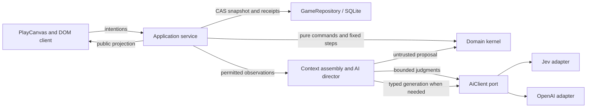

# Implemented architecture

The canonical target for memory and NPC cognition is [Memory architecture](memory-architecture.md), including its current-code audit and sequenced TODOs. That target includes the 300-entry recent window, tiered cognition and dreams; the smaller executable subset below is not evidence that those extensions are implemented.

This document describes the executable first version. The [long-term architecture](../archive/07-technical-architecture/README.md) remains the design context; its larger distributed infrastructure is not all implemented. The [first-playable agreement](../archive/05-project/first-playable-mvp.md) defines product acceptance, including live-provider evidence.

The proposed [production data model](../archive/07-technical-architecture/production-data-model.md), [query/MCP contract](../archive/07-technical-architecture/data-queries-and-mcp.md), and [migration/scale plan](../archive/07-technical-architecture/data-delivery-and-scale.md) define the next persistence implementation. They do not change the current SQLite snapshot behavior described below.

## Dependencies and authority

Future multiplayer synchronization is specified in the [real-time architecture](../archive/07-technical-architecture/realtime-synchronization.md): server batching, browser prediction, scoped replication and reconnect, with separately gated transport/persistence improvements. This is proposed work, not a claim that the current single-player client implements prediction or that multiplayer capacity has been tested.

The domain imports no application, renderer, provider, database or wall-clock code. It owns every physical change. The browser sends intentions and displays an explicit projection; full snapshots and NPC private records never cross that boundary. The AI client exposes typed execution, not world authority. The initial composition uses direct providers; a Macrofold implementation can replace `AiClient` without changing simulation rules.

## State and transitions

`WorldState` is versioned JSON: stable entity IDs with explicit components, stable item instances and definitions, a recipe registry, actor-local knowledge, attributed memories, recent committed events, command/declaration receipts, RNG state and simulation time. Recipes reference native material definitions by ID; possessions reference definitions rather than copying behavior. Physical items, knowing a technique, hearing about it and the engine admitting it are distinct facts.

`executeCommand`, `advanceWorld` and `admitDeclaration` return new state, outcomes and events. Work reserves/consumes inputs through trusted rules; completion creates outputs once. Competing harvesters cannot multiply a carcass's finite yield. Ranged launchers and ammunition share one family with mechanism, compatibility, range, accuracy and damage constraints. Hits/misses use the saved pseudorandom state. Animal awareness, wandering and fleeing require no models. Interrupted assembly follows documented cancellation rules in the [domain guide](../packages/domain/src/README.md).

The application processes fixed one-simulation-second steps and atomically saves a batch every timer turn. The renderer interpolates committed positions and has no physics authority. The base rate is 60 simulated seconds per real second; 0.5×, 1×, 3× and 8× multiply it. At 1×, one real second is one game minute and a day takes 24 real minutes. Timer gaps of at most two seconds produce at most 960 fixed steps; longer process suspension discards wall-clock catch-up. This small-map implementation clones JSON state between transitions; it is intentionally simple, not a large-population performance claim.

SQLite commits the world snapshot and domain idempotency receipts together, using a monotonically increasing revision and compare-and-swap. A second writer causes the service to pause rather than overwrite. Saves restore outcomes, not an event-sourced re-simulation: the event feed is bounded to 300 entries, ordinary memories to 80 per actor plus up to 16 active commitments. Completed UI milestones persist separately. Command receipts currently grow with this personal save; production retention/compaction needs an explicit retry horizon before deletion is safe.

The player's journal excludes routine movement-start events before selecting its latest 60 entries. New action-start events carry structured `actionType` metadata; projection also recognizes legacy movement-start text in existing saves. Internal events and memories remain intact, and other action starts, results and conversations remain eligible for the journal.

## Camera input

`WildernessScene` distinguishes a right-click from a right-button pan using a five-CSS-pixel movement threshold. A stationary right-click opens the action browser on release; dragging moves only the local camera and never sends a movement/action command. Middle-button and Space + primary dragging remain supported. Pointer capture carries the gesture across overlay/canvas boundaries, and cancellation, lost capture or window blur releases it and clears the grabbing cursor.

Native `contextmenu` timing differs by platform. During a secondary pointer sequence the scene defers action opening to release and consumes the native event, including a duplicate arriving after release. Control-click and keyboard/native gestures without that secondary sequence retain the context-menu path. Camera changes do not alter the actor's current server-side perception; viewport-aware perception remains proposed below.

## Action discovery and player preferences

The authenticated `/api/actions` query returns the complete finite catalogue for the player's learned recipes, owned inventory and currently perceived targets, plus unavailable entries for supported native families with missing prerequisites. A specific world-object context restricts the catalogue to that target before preview: reeds offer walking/gathering, a person offers walking/conversation/teaching, and a fire offers walking/cooking. Relevant missing prerequisites remain discoverable, such as cooking without raw meat; unrelated work and other targets are excluded. Self context includes personal work. Empty-ground context supplies a destination for Walk here and browses the broader catalogue. Private NPC knowledge and unimplemented mechanics are not exposed as usable definitions. Labels, category tags and aliases are searchable without inference or a retrieval top-k cutoff.

`apps/server/src/action-catalogue.ts` enumerates options and uses `WorldService.previewCommand` to run the same command mapping and pure admission transition used by execution. Preview effects, consumed inputs, RNG changes and receipts are discarded. The browser queries on opening and coalesces refreshes while the menu is open; this does not add a catalogue scan to every simulation step. The initial preview approach clones a small world per candidate. Larger worlds should introduce shared pure admission guards or indexed queries with equivalence tests before increasing catalogue scale.

`ActionBrowser` keeps the search field and keyed action nodes stable through updates. Available entries precede unavailable entries; the latter participate in browsing and search only when Show Unavailable Actions is enabled. The toggle reads **Show Unavailable Actions** when collapsed and **Hide Unavailable Actions** when expanded, including after reopening/reload. Right-click selection and action dispatch preserve the current notebook tab, including Possessions; primary-click inspection can still open Nearby. The server still validates every dispatched command against current state. The compact menu uses a small search field and single-line action/category rows, with categories aligned right. It has no visible title, field label, result counts, row subtitles or invention button. The target name remains a screen-reader label; the close button shares the search row. Empty results and load failures still have concise status text. Talk opens its editable composer; invention remains in the main Invent tab, governed by the existing explicit Send path and its readiness/budget checks.

Each `CatalogueAction.description` is plain text projected by `action-descriptions.ts` from the player's permitted observation. Common native explanations cover missing-target families; concrete options add relevant facts such as remaining resources, current fullness, equipped ammunition, known recipe inputs or a listener's name. Crafting and equipment explanations reuse the recipe/item descriptions already saved at invention admission. Availability reasons stay separate and authoritative. No model call runs on hover or catalogue refresh.

The client reveals the description after one second of uninterrupted hover or keyboard focus, including for blocked options. It uses `textContent`, never generated markup. Keyed rows keep focus and hover timers across world updates, while visible explanations pick up the latest description and blocker. Search, scrolling, dismissal and context changes cancel stale details. The tooltip sits outside the scroll container, stays within the viewport, and permits pointer entry/scrolling for long descriptions. Unavailable buttons use `aria-disabled` to allow keyboard inspection; their handlers reject dispatch and the server remains the final authority.

The additive SQLite `player_profiles` table persists the local player's preference independently of world snapshots. The same-origin preferences route resolves the local principal server-side, validates the boolean and publishes updates. Revisions prevent older state messages overwriting a newer preference in the menu. The current host has one local player profile per save database, shared across browser tabs; this is not cross-world cloud account synchronization.

## Context and cognition

Current sight is distance-only within **28 map units**, shared by native actor observations and action admission through `perception.ts`. This replaces the old 10-unit sight/rock-occlusion rule for the visual experiment. Hearing and source-event audiences retain 10 units and the existing rock line-of-sight check through a separate `canHear` query; targeted speech and teaching use that same hearing rule. Source-less events still reach all living actors. Navigation and projectile obstruction are unchanged. The simulation rule version is now 2; existing saves retain their coordinates/history and use the new rules on subsequent operations.

The public DTO includes `vision.radius`. `VisionBlur` projects that world-space circle around the rendered player into the fixed camera's screen ellipse, following player interpolation, pan, zoom and resize. A transparent CSS backdrop blur removes spatial detail without darkening the scene: the inner 60% stays clear and the outer band reaches full 14-pixel blur at 72%, before entities can cross the authoritative boundary. The previous decorative dark vignette is removed. The layer excludes UI and intercepts no input. This is a visual prototype, not a near/medium/far semantic-description system or a calibrated physical field.

When an entity leaves sight as the player moves away, the scene can retain its last permitted image outside the current radius, frozen and blurred. Remembered images cannot be picked, hovered, selected or used as live action targets. They receive no hidden position, condition or animation updates. Reentering sight refreshes the image from the new DTO; absence at a remembered location inside current sight removes it. The session cache retains at most 128 unseen images, clears on world change/reload, and does not create AI memory. Previously unseen entities are not sent to the client as blurred live objects.

Scene picking, hover identification and keyboard selection anchors also stop at the fully obscured boundary (72% of the radius, shared with the CSS mask through `VISION_FOCUS`). Stationary hover labels are revalidated during movement and camera updates and cleared on pointer exit or focus loss. This presentation restriction narrows map interaction; it does not change server observation/AI context or implement semantic detail tiers. The Nearby list remains a projection of server observation.

Camera pan/zoom still does not change server observation authority. Broad sight makes ordinary on-screen objects perceivable on this small map; exact viewport parity, occlusion-shaped fields, independent acoustic attenuation, detail-tier descriptions and semantic attention remain in the [perception proposal](../archive/07-technical-architecture/perception-and-attention.md).

`observeActor` uses the current distance-based sight query. Event audiences are fixed at event time; entering an area later does not reveal its old conversations. `buildContext` includes the actor's state, permitted nearby facts, owned inventory, learned recipes, recent perceived events and a bounded relevance-ranked memory selection. It strips other actors' private needs, goals and plans. Recipe retrieval ranks the complete known registry and sends up to 24 relevant candidates; this is bounded retrieval, not a guarantee of finding every semantic paraphrase in a large history. Observations, heard claims and inferred reflections keep distinct provenance. A conversation commitment requires an actual attributed promise quote in that exchange's committed speech; an unchecked model summary cannot become an observed fact. Model text stays data, including instructions embedded in a remembered statement.

Native urgency handles food and rest immediately. A wall-clock scheduler considers a resident at most once per configured interval, coalescing changes in need bands, current activity, goals, speech and knowledge. Jev selects among supplied actions or requests deeper reflection. Only the latter invokes an LLM for a new goal and next action. Ordinary walking, gathering, work increments and consumption never wait for AI. A changed plan invalidates an old suggestion; the command is also validated against current state.

Context is capped at 20,000 UTF-8 JSON bytes before provider instructions/schema are added; complete provider requests are independently capped at 40,000 bytes. The assembler preserves the current request, actor state and owned item/material mechanics, compacts descriptive prose, then removes whole lower-priority history/recipe records. Coverage counts disclose omissions. Mandatory facts that cannot fit cause an explicit failure before dispatch of that context, rather than truncated JSON or silently missing prerequisites.

Conversation is a deliberate language-model use: Jev routes/defer-checks it, then an LLM forms an evidence-grounded response and private appraisal. This is an initial routing policy, not proof that a classifier call is valuable before every future conversational turn. Quality/cost traces should inform later bypasses and thresholds.

## Evolving definitions

Invention first retrieves learned candidate recipes and asks Jev to reuse a compatible one or select a finite supported family. New recipes are actually generated by an LLM, not pre-seeded final sling/bow definitions. Supported G1 families are swing launchers, flex launchers and arrow ammunition. Native preparation covers cleaned fibers and cord. The authoritative declaration contract constrains roles, actual material properties, quantity, work and physical parameters.

Strict provider JSON-schema validation is only the first check. `validateDeclaration` independently checks world policy, material suitability, required mechanism components and bounds. No generated source code, arbitrary effects, free food/fuel or new physics execute. The admitted definition has a content identity, provenance and an idempotent authoring receipt, and grants knowledge to its inventor. Crafting still needs actual materials and time; teaching grants another actor knowledge without giving them an item. Existing final definitions are immutable in this slice. Version replacement and migration are future explicit operations, not in-place edits.

The registry is limited to 64 inventions in this personal prototype. Unsupported and forbidden requests produce distinct feedback. Ambiguous classification or invalid generation does not mutate the world and is not a failed physical experiment. The author can adjust the request rather than triggering a hidden retry chain.

## Paid work, absence and recovery

The AI director allows one in-flight workflow, with no unbounded queue or automatic retries. Before dispatch, SQLite durably admits a unique attempt and reserves the greater of a configured reserve and a conservative configured-price/token bound. Usage receipts settle estimates; unknown completion or missing usage retains the reservation as spent. Later definitive receipts can reconcile uncertain accounting. Restart marks interrupted jobs stale and never resends them. Provider transport, timeout, schema failure, refusal and cancellation are distinguishable outcomes.

The initial allowance defaults to zero and is durable per save. Rates are explicit; changing models requires matching prices. The UI labels estimates. This ledger is an application dispatch cap, not a provider invoice guarantee or account-wide billing control. A provider may bill an aborted request, and pricing assumptions must be maintained. There is no purchase or automatic top-up.

Time settings beside the clock expose the saved `pauseWhenHidden` player preference, checked by default. The additive SQLite column defaults existing profiles to true. Preference requests are validated, nonempty partial updates, so this checkbox cannot overwrite Show Unavailable Actions and vice versa. The client preserves newer profile revisions across concurrent responses. Settings update pause policy immediately, without changing manual pause or the selected speed.

Foreground presence uses per-tab heartbeats every five seconds, immediate window focus/blur and visibility/pagehide notifications, and a twelve-second disconnect grace period. A tab counts as foreground only while both visible and focused. With `pauseWhenHidden: true`, no foreground tab means automatic pause. With it false, any authenticated open event stream also permits progression: a background tab need not keep its JavaScript heartbeat running. The server tracks connections separately and removes them when the response closes. After all connections and foreground leases disappear the game pauses. Restarts begin absent, and neither downtime nor long computer sleep is replayed. Background play is connected server execution, not offline catch-up.

Manual pause and storage failures always freeze advancement, regardless of the preference. Simulation and autonomous inference scheduling follow the same effective pause state. Thus opted-in connected background play permits ordinary NPC scheduling under the existing real-time cadence and budget caps; changing simulation speed does not increase model-call concurrency or change provider deadlines. Cancellation is requested on pending AI work when the world pauses; provider completion/accounting may finish, but no result applies while paused. Canceled results are discarded rather than silently replayed on resume.

An explicit Resume also renews that tab's presence so a delayed heartbeat cannot leave a successful control paused. Heartbeats, hidden notifications and Resume share a per-page sequence; the server ignores older presence updates that arrive late. Renewing presence observes any elapsed absence first, preserving cancellation of old AI work. Changing speed or manually pausing never renews presence.

The composer explains missing providers or an absent/exhausted allowance before other interaction blockers. Its setup action is available while paused and never dispatches AI work. Drafts remain editable and are stored only in tab-local session storage when available, with no automatic submission after reload or configuration.

SQLite and the generic client are replaceable ports. Durable distributed queues, shared-world pause arbitration, cloud authentication, vector retrieval, long-term memory consolidation, regional streaming and sandboxed G2 mechanics are future modules. The game retains permission, budget and admission authority if a future Macrofold adapter provides pooled execution or context storage.

## Planned governance and creator tools

The [governance](../archive/03-design-proposals/invention-governance-and-ownership.md), [controls](../archive/03-design-proposals/playability-and-controls.md) and [world workshop](../archive/03-design-proposals/world-agent-and-workshop.md) proposals specify later invention locks, account ownership, complete packs, configurable slots, durable logs and authorized world-agent tools. These are not features of this implementation. Their [delivery track](../archive/07-technical-architecture/review-and-delivery-plan.md#u14-delivery-track-governance-controls-and-the-workshop) retains application-owned admission, immutable versions and explicit migrations; the bounded event feed must not be mistaken for the planned durable journal.

The planned [billing interface](../archive/03-design-proposals/playability-and-controls.md#billing-menu-and-cost-breakdown) will use a [scoped reporting adapter](../archive/07-technical-architecture/billing-and-usage-reporting.md) to query Macrofold for historical LLM/Jev costs and arbitrary periods. The implemented local cumulative estimate and dispatch cap do not supply that billing report. Reporting remains separate from simulation time and spending admission.

## Local host boundary

The server binds to `127.0.0.1`, validates Host and same Origin, requires an HttpOnly SameSite cookie for mutations, limits request bodies and rejects unknown fields. Public GET state bootstraps the local session; event streams contain only the public projection. This protects a local personal playtest from ordinary cross-site mutations. It is not multi-user authentication or a production hosting security model. No secrets, arbitrary execution endpoints or client-provided actor authority enter the API.
