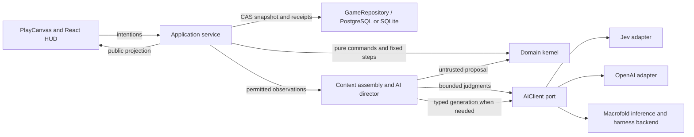

# Implemented architecture

The canonical [memory architecture](memory-architecture.md) owns behavior; [CR01–CR12](maintainers/cognition-redesign.md) track implementation and acceptance. September 20 runtime update: compact decisions, native multi-question Jev, scoped embeddings, awareness/consolidation, PostgreSQL accepted text, background workspace reflection, sleep accounting and grouped god inspection are implemented. Live evidence and remaining acceptance work are tracked in [maintainer TODO](maintainers/TODO.md); implementation is not a claim of complete behavioral acceptance.

The [long-term architecture](../archive/07-technical-architecture/README.md) remains design context. The [production data model](../archive/07-technical-architecture/production-data-model.md) distinguishes implemented single-writer PostgreSQL prerequisites from conditional distributed infrastructure. Current storage still commits bounded world snapshots; it also publishes `mind.inner_world` atomically. This is not the full normalized production schema.

## Dependencies and authority

Future multiplayer synchronization is specified in the [real-time architecture](../archive/07-technical-architecture/realtime-synchronization.md): server batching, browser prediction, scoped replication and reconnect, with separately gated transport/persistence improvements. This is proposed work, not a claim that the current single-player client implements prediction or that multiplayer capacity has been tested.

The domain imports no application, renderer, provider, database or wall-clock code. It owns every physical change. The browser sends intentions and displays an explicit projection; full snapshots and NPC private records never cross that boundary. The AI client exposes typed execution, not world authority. The composition selects the implemented Macrofold backend when its key is configured, otherwise the direct providers. Backend selection does not change simulation authority; current full deliberation requires Macrofold.

The right-side [god-mode cognition debugger](memory-architecture.md#god-mode-cognition-debugger) groups semantic triggers, context/retrieval, Jev routing and execution through committed outcomes. Rows stay compact; expanding stages reveals cost, tokens, latency, actual input/output and receipts. No-call opportunities and unavailable detail remain explicit. Comprehensive interaction/revocation coverage remains in TODO.

God mode also exposes bounded native world editing through same-origin, owner-session POST routes. A dead person-style actor can be revived, and blank walkable ground can receive one entity from the server-projected finite spawn catalogue. `POST /api/god/person` creates a named NPC with authored personality, backstory, selected descriptive traits and initial goals; an empty trait selection uses the saved-RNG three-trait default. `POST /api/god/spawn` creates another supported native entity family, and `POST /api/god/act` accepts `{ action: "revive", targetId }` for the lifecycle transition. The domain validates walkability, occupancy, trait IDs and lifecycle state, emits labeled committed events and initializes actor memory, knowledge, possessions and protected identity atomically. These explicit owner actions may run while simulation time is paused. They do not admit new definitions, generated mechanics or artwork and are distinct from the planned confirmed conjuring workflow.

Future harness use extends beyond reflection where real tool results determine the next step: [creator investigation, complex invention, conjuring and workshop refinement](../archive/07-technical-architecture/declarations-and-evolution.md#bounded-multi-turn-authoring-and-investigation), and [difficult character planning and teaching](maintainers/cognition-redesign.md#later-harness-extensions). These are later tasks, not claims of delivered tools or prerequisites for ordinary decisions. Bounded within-job tool turns are distinct from durable goals resumed across simulation events; canonical state and all effects remain application-owned.

## State and transitions

`WorldState` is versioned JSON: stable entity IDs with explicit components, stable item instances and definitions, a recipe registry, actor-local knowledge, attributed memories, recent committed events, command/declaration receipts, RNG state and simulation time. Recipes reference native material definitions by ID; possessions reference definitions rather than copying behavior. Physical items, knowing a technique, hearing about it and the engine admitting it are distinct facts.

### Actor means any living being

The accepted domain meaning of **actor** is any living being that can participate in world state and effects, including people and animals. Personhood, species, body plan, controller, cognition, speech and inner-world depth are separate capabilities. A deer can remain a deer while later receiving memory, an intelligent controller, an inner world or speech; these capabilities must not require turning it into a human-shaped entity.

Actions and effects should target the smallest relevant capability rather than a human-only type. `Revive` is a lifecycle action whose intended scope is any dead actor, including an animal. Wetness, fire, injury, healing and health changes likewise apply to every actor with the relevant body/state components, with species-specific anatomy or susceptibility expressed as data or rules. This lets one rule affect people and animals consistently without implying that every actor has human cognition or language.

This is an active migration boundary rather than current runtime behavior. The prototype still stores people in `entity.actor` and animals in a separate `entity.animal` component. Its god-mode revival transition accepts only a dead person-style actor, and animal death converts the animal to harvestable remains. Unifying those representations, preserving animal identity through death/revival and adding shared body effects require an explicit save migration. Delivery is tracked in the [living actor tracker](maintainers/actor-model.md).

`executeCommand`, `advanceWorld` and `admitDeclaration` return new state, outcomes and events. Work reserves/consumes inputs through trusted rules; completion creates outputs once. Competing harvesters cannot multiply a carcass's finite yield. Ranged launchers and ammunition share one family with mechanism, compatibility, range, accuracy and damage constraints. Hits/misses use the saved pseudorandom state. Animal awareness, wandering and fleeing require no models. Interrupted assembly follows documented cancellation rules in the [domain guide](../packages/domain/src/README.md).

The application processes fixed one-simulation-second steps, publishes routine progress on the 250ms simulation cadence, and coalesces routine durability to one real second. Explicit commands/control changes commit immediately; clean shutdown flushes pending progress. An abrupt crash can lose the most recent unflushed routine progress. The renderer interpolates committed positions and has no physics authority. The base rate is 60 simulated seconds per real second; 0.5×, 1×, 3× and 8× multiply it. At 1×, one real second is one game minute and a day takes 24 real minutes. Timer gaps of at most two seconds produce at most 960 fixed steps; longer process suspension discards wall-clock catch-up. Domain transitions use isolated Immer drafts and return immutable-by-contract snapshots with unchanged branches shared. Domain callers must not mutate a returned snapshot. This avoids whole-world cloning and lets persistence/projection skip unchanged branches; changed collections still require traversal, so this is not a large-population performance claim.

The repository commits a private transactional `WorldChanges` journal and domain receipts with revision compare-and-swap. A full snapshot replaces the journal every 120 durable revisions, or when an encoded change batch reaches 1 MiB. Changes contain set/remove/splice operations derived from shared snapshots, not replayable game commands. Startup applies the ordered journal over the snapshot and rejects gaps. Backup and SQLite import materialize the latest journal-backed revision into a compact snapshot before export. PostgreSQL additionally holds a single-writer advisory lock and atomically updates accepted inner-world rows. SQLite supports native/immediate play; workspace publication requires PostgreSQL. Conflicts pause the writer. Saves restore outcomes, not event-sourced re-simulation. Actor-aware raw experience lasts six game hours before consolidation; an 8,192-record backlog pauses growth instead of discarding evidence. Up to 16 active commitments remain protected. Completed UI milestones persist separately. Command receipts currently grow with this personal save; production retention/compaction needs an explicit retry horizon before deletion is safe.

### Public updates and owner editors

`GET /api/state` establishes the local session and returns one explicit public `GameView`. SSE then sends typed `GamePatch` updates with base/next revisions: partial clock/player/AI fields, entity upserts/removals/order, and replacement arrays for changed recipes, events and conversation. The server memoizes permitted projection sections using shared domain identities and telemetry revisions; it does not build private actor observations for the HUD. `WorldChanges` is private persistence data; `GamePatch` is a separately projected public transport type. Neither grants client authority.

One serialized projection queue retains a current public view plus at most 64 encoded patches within 1 MiB. Missing baselines receive a full public reset. A write returning false is accepted buffered data: delivery resumes on drain, with a 30-second stall timeout. The browser maintains its stream baseline separately from React rendering, rejects stale connection callbacks, clears retry timers, and bootstraps again on connection failure to refresh the session after server restarts. This personal-world implementation is not the full multiplayer subscription/epoch/prediction contract.

God-only Person and World Events editors load compact summaries/hashes and fetch one raw JSON record on selection. Saves send changed entries with expected hashes, merge unrelated simulation additions, and commit the entire validated request atomically. Person memory deletion uses authoritative forgetting: retained evidence and dependent summaries are removed, the forgetting ledger is saved, and derived mind/vector/interest data is invalidated. Active commitments must be resolved first. Global event edits are separate from an actor's awareness; deleting awareness does not delete shared history. Raw JSON editing still requires stronger cross-record validation for identity/source-link changes; this remains tracked in [maintainer TODO](maintainers/TODO.md), rather than a claim of unrestricted safe graph editing.

Editor windows are independent, draggable, fixed-size and centered on each new opening. Tabs and save/validation/dirty-close controls share `EditorPanel`; Save keeps the window open, Discard restores the loaded baseline, and refresh reports a real-time query timestamp. Opening an editor does not pause play. JSON drafts stay local to the text editor, and typing updates a keyed draft map without rebuilding record lists. The detail pane stays outside the scrolling list. The action picker refreshes explicitly; diagnostics retains its three-second polling cadence.

The player's journal excludes routine movement-start events before selecting its latest 60 entries. New action-start events carry structured `actionType` metadata; projection also recognizes legacy movement-start text in existing saves. Internal events and memories remain intact, and other action starts, results and conversations remain eligible for the journal.

## React presentation and character traits

The complete HUD is React/TypeScript with shared React Aria controls. The old imperative DOM panels, custom inline icon renderer and stylesheet have been removed. [Design-system ownership and adaptations](../apps/client/src/design-system/README.md) documents the organized fonts/icons/tokens, three themes, scale and reduced motion, dock/sheet layout, continuous work overlays, fixed-width time bar and 504px conversation panels. The scene owns no HUD components; its status adapter renders React using public screen coordinates. Quick-action rings are reserved for future authoritative cooldowns; current native actions have none.

New actors use `createActor` to sample three distinct traits from the [JSON trait bank](../packages/domain/config/traits.json) using saved RNG. Traits and descriptions are copied into each actor's save. Startup initializes only missing traits, committing the migration with the loaded world; later bank edits do not reroll existing actors. These are descriptive dispositions, without stat bonuses or new automatic AI policy. Only public trait descriptions cross the normal projection. The Character panel reads the player's own awareness/summary memory projection and bounded history; god-only inspection remains separately authorized.

World-agent tabs keep independent session identities and browser-cached transcripts. Hiding retains pending work; closing ends the lane. Transcript restoration creates a fresh conversation identity because backend closure is irreversible. Known recipes and invention jobs have structured cards; question-like prose gets an answer affordance. The existing world agent still has no conjuring or world-mutation tools, and this UI migration does not implement the proposed typed workshop/confirmation backend.

Both conversation composers use a one-line auto-growing textarea. In-flight turns display a message-local animated dot wave; successful turns carry no status label and true failures show a small red marker inside the message, with the stored failure reason available through hover or keyboard focus. Character-chat jobs retain the exact originating speech event ID. Cancelled or stale replies project their stored interruption reason as narration beside that turn, while queue names, provider stages and timing estimates remain outside the ordinary conversation UI.

## Camera input

`WildernessScene` distinguishes a right-click from a right-button pan using a five-CSS-pixel movement threshold. A stationary right-click opens the action browser on release; dragging moves only the local camera and never sends a movement/action command. Primary dragging follows the design system, and middle-button dragging is also supported (Space + primary works through the same primary gesture). Pointer capture carries the gesture across overlay/canvas boundaries, and cancellation, lost capture or window blur releases it and clears the grabbing cursor.

Native `contextmenu` timing differs by platform. During a secondary pointer sequence the scene defers action opening to release and consumes the native event, including a duplicate arriving after release. Control-click and keyboard/native gestures without that secondary sequence retain the context-menu path. Camera changes do not alter the actor's current server-side perception; viewport-aware perception remains proposed below.

## Action discovery and player preferences

The authenticated `/api/actions` query returns the finite catalogue scoped to the selected object or self, including relevant unavailable entries with missing prerequisites. A specific world-object context restricts the catalogue to that target before preview: reeds offer walking/gathering, a person offers walking/conversation/teaching, and a fire offers walking/cooking. Relevant missing prerequisites remain discoverable, such as cooking without raw meat; unrelated work and other targets are excluded. Self context includes personal work. Empty-ground context supplies only a destination for Walk here; personal work is available in self context and panel controls. Private NPC knowledge and unimplemented mechanics are not exposed as usable definitions. Labels, category tags and aliases are searchable without inference or a retrieval top-k cutoff.

`apps/server/src/action-catalogue.ts` enumerates options and uses `WorldService.previewCommand` to run the same command mapping and pure admission transition used by execution. Preview effects, consumed inputs, RNG changes and receipts are discarded. The browser queries on opening and coalesces refreshes while the menu is open; this does not add a catalogue scan to every simulation step. The initial preview approach clones a small world per candidate. Larger worlds should introduce shared pure admission guards or indexed queries with equivalence tests before increasing catalogue scale.

The React `ActionPicker` keeps search and keyed action rows stable across refreshed catalogues. Available entries precede unavailable entries, which appear only under the saved **Show Unavailable Actions** preference. The target header and **Look closer** open descriptions from the current permitted DTO. Right-click and dispatch preserve open panels; primary inspection opens In view. Search retains “Search actions or invent something…”; unmatched Enter or the inline search affordance opens an editable invention draft without a request. Only explicit Send dispatches AI work. There is no separate invention button beneath the list.

`action-descriptions.ts` projects plain descriptions and structured material/time facts from permitted observations and trusted definitions. Berry gathering yields up to two berries in 30 game seconds plus travel; it has no explicit energy charge. Resource, animal, remains and station descriptions come from `entity-description.ts`; they expose no private NPC mind. React renders all generated prose as text. One-second React Aria tooltips support hover and keyboard inspection; disabled entries remain inspectable and handlers reject dispatch. The server independently validates every intention.

The additive SQLite `player_profiles` table persists the local player's preference independently of world snapshots. The same-origin preferences route resolves the local principal server-side, validates the boolean and publishes updates. Revisions prevent older state messages overwriting a newer preference in the menu. The current host has one local player profile per save database, shared across browser tabs; this is not cross-world cloud account synchronization.

## Context and cognition

### Narration and conversation boundary

Immediate response composition is implemented. Durable conversation lifecycle and Narrator behavior are specified in [Narration, agent responses and conversations](narration-and-conversations.md) and tracked in the [Narration and conversations implementation tracker](maintainers/narration-and-conversations.md).

### Current runtime

`decision-context.ts` assembles the actual perceived sentence, complete accepted About me text, readable game time, useful body/goal facts and selected possessions, surroundings, knowledge and recall. Authority IDs, dependency hashes, quotas and evidence coverage remain in server bindings. Only short offered action handles enter immediate action requests. Ordinary output is speech alone or one action handle; no inline mind patch is required.

`recall.ts` filters actor-permitted sources before structured ranking and OpenAI `text-embedding-3-small` embeddings (512 dimensions). `vector-store.ts` stores revision-keyed rows in PostgreSQL with pgvector and performs permission-filtered exact cosine top-24 search in SQL; only IDs and scores return to the application. It indexes at most 32 changed sources per call, retains 16 query embeddings per actor, and reports lag/outage explicitly. Old JSON vector caches migrate inside the database, preserving query caches and avoiding paid regeneration; valid source vectors are no longer evicted at 1,024 entries. SQLite retains native/structured recall but reports semantic retrieval unavailable. One native Jev question map judges up to 24 candidates independently. Mandatory evidence survives optional attention failure. Relevance uses the yes probability rather than a universal confidence cutoff; scores remain evidence, not truth.

`jev-questions.ts` owns versioned relevance, route/significance and invention rubrics. Immediate routing chooses native, mini/low, complex/low or complex/high; significant reflection is an independent question in the same request. Urgency does not imply reasoning complexity. Uncertain addressed-speech escalation retains level 2. After attention returns, the server rebuilds current body, goal, surroundings, possessions and offered actions, then binds later admission to that refreshed dependency snapshot. Native admission validates every action and stale dependency before effects.

`cognition-maintenance.ts` schedules hourly cleanup of records older than six game hours and an independent, lower-priority reflection lane. Reflection uses fresh harness sessions and scoped `mind/*.md` file access, validates identity/obligations/quotas, and publishes one PostgreSQL accepted text revision. Failed, canceled or stale exports preserve the previous accepted revision. Accepted files are restored before subsequent dispatch; audit sessions never become recall. Background work leaves an interactive allowance reserved and cancels on pause or interactive interruption.

Saved native rest uses calendar days, split-rest credit, eight-hour daily need and modest bounded debt. Sleep begins after fifteen uninterrupted resting minutes; dreams need two hours actually asleep and are deduplicated per episode. Presentation thoughts are imagined/inferred as appropriate and stay out of ordinary context.

The authorized god panel groups triggers with context, scored candidates, Jev answers, model/harness input/output, billing receipts and publication/admission stages. Selecting a compact trigger replaces the list with a full-width detail view and the standard panel back control. The detail renders trigger, response, Jev questions/choices/decision, speech turns and embedding query/table/ranked results as readable fields. A persistent JSON icon on the request and each stage opens the combined application/provider record in a separate left-side panel; transport exchanges are not presented as numbered peer requests. It includes no-call dispositions, bounded history, filters and follow/pause controls. Diagnostic failure never grants authority. See [verification](verification.md) and [TODO](maintainers/TODO.md) for observed checks and unresolved fixture/acceptance gaps.

## Evolving definitions

Invention first retrieves learned candidate recipes and asks Jev to reuse a compatible one or select a finite supported family. New recipes are actually generated by an LLM, not pre-seeded final sling/bow definitions. Supported G1 families are swing launchers, flex launchers and arrow ammunition. Native preparation covers cleaned fibers and cord. The authoritative declaration contract constrains roles, actual material properties, quantity, work and physical parameters.

Strict provider JSON-schema validation is only the first check. `validateDeclaration` independently checks world policy, material suitability, required mechanism components and bounds. No generated source code, arbitrary effects, free food/fuel or new physics execute. The admitted definition has a content identity, provenance and an idempotent authoring receipt, and grants knowledge to its inventor. Crafting still needs actual materials and time; teaching grants another actor knowledge without giving them an item. Existing final definitions are immutable in this slice. Version replacement and migration are future explicit operations, not in-place edits.

The registry is limited to 64 inventions in this personal prototype. Unsupported and forbidden requests produce distinct feedback. Ambiguous classification or invalid generation does not mutate the world and is not a failed physical experiment. The author can adjust the request rather than triggering a hidden retry chain.

## Paid work, absence and recovery

The director allows one interactive workflow plus independently bounded background maintenance, with no unbounded queue or automatic paid retries. Autonomous cognition does not start unless its configured backend credentials are complete. Before dispatch, the repository durably admits a unique attempt and reserves the greater of a configured reserve and a conservative configured-price/token bound. Usage receipts settle estimates; unknown completion or missing usage retains the reservation as spent. Later definitive receipts can reconcile uncertain accounting. Restart marks interrupted jobs stale and never resends them. Provider transport, timeout, schema failure, refusal and cancellation are distinguishable outcomes; an abort raised from any stage remains cancellation rather than becoming a generic workflow failure.

The initial allowance defaults to zero and is durable per save. Rates are explicit; changing models requires matching prices. The UI labels estimates. This ledger is an application dispatch cap, not a provider invoice guarantee or account-wide billing control. A provider may bill an aborted request, and pricing assumptions must be maintained. There is no purchase or automatic top-up.

Time settings beside the clock expose the saved `pauseWhenHidden` player preference, checked by default. The additive SQLite column defaults existing profiles to true. Preference requests are validated, nonempty partial updates, so this checkbox cannot overwrite Show Unavailable Actions and vice versa. The client preserves newer profile revisions across concurrent responses. Settings update pause policy immediately, without changing manual pause or the selected speed.

Foreground presence uses per-tab heartbeats every five seconds, immediate window focus/blur and visibility/pagehide notifications, and a twelve-second disconnect grace period. A tab counts as foreground only while both visible and focused. With `pauseWhenHidden: true`, no foreground tab means automatic pause. With it false, any authenticated open event stream also permits progression: a background tab need not keep its JavaScript heartbeat running. The server tracks connections separately and removes them when the response closes. After all connections and foreground leases disappear the game pauses. Restarts begin absent, and neither downtime nor long computer sleep is replayed. Background play is connected server execution, not offline catch-up.

Manual pause and storage failures always freeze advancement, regardless of the preference. Simulation and autonomous inference scheduling follow the same effective pause state. Thus opted-in connected background play permits ordinary NPC scheduling under the existing real-time cadence and budget caps; changing simulation speed does not increase model-call concurrency or change provider deadlines. Background NPC thought is canceled on pause. Explicit chat/invention can finish its admitted provider stage, but successful results wait for resume before another paid stage or commit. Failures remain visible; shutdown cancels pending waits. Held-response recovery after process restart is still a pending check. No result applies while paused, and resume does not automatically retry canceled paid work.

An explicit Resume also renews that tab's presence so a delayed heartbeat cannot leave a successful control paused. Heartbeats, hidden notifications and Resume share a per-page sequence; the server ignores older presence updates that arrive late. Renewing presence observes any elapsed absence first, preserving cancellation of old AI work. Changing speed or manually pausing never renews presence.

The composer explains missing providers or an absent/exhausted allowance before other interaction blockers. Its setup action is available while paused and never dispatches AI work. Drafts remain editable and are stored only in tab-local session storage when available, with no automatic submission after reload or configuration.

SQLite and the generic client are replaceable ports. Durable distributed queues, shared-world pause arbitration, cloud authentication, regional streaming and sandboxed G2 mechanics are future modules. The game retains permission, budget and admission authority as the existing Macrofold adapter grows toward pooled execution or context storage.

## Local host boundary

The server binds to `127.0.0.1`, validates Host and same Origin, requires an HttpOnly SameSite cookie for mutations, limits request bodies and rejects unknown fields. Public GET state bootstraps the local session; event streams contain only the public projection. This protects a local personal playtest from ordinary cross-site mutations. It is not multi-user authentication or a production hosting security model. No secrets, arbitrary execution endpoints or client-provided actor authority enter the API.
