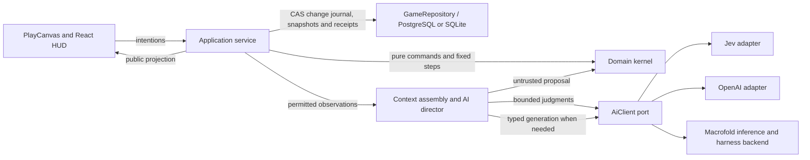

# Implemented architecture

## Spatial world foundation

The current world carries development schema **10** and public view schema **2**; admission validates the current state shape rather than requiring a new world per feature. `packages/spatial` is renderer-free and dependency-free. Entities have required XYZ positions, semantic support references, body profiles and heading; current units retain one map unit per metre and the existing simulation clock/speeds. The starter map has a three-metre lookout deck, filled ramp, accessible underpass, solid posts/wall, elevated gatherable crate and one native flying bird.

Walking uses a cached bounded layered-surface A\* graph with strict destination-surface identity and continuous 3D native route following. Finite convex clipping supplies wall/floor rays and conservative upright-body sweeps. Grounded work, contact/ranged checks, sensory audience creation, public observations and native animal movement account for height. A short route is not completed by teleporting its final point. Current geometry is checked during movement; a changed obstruction stops work without refunding consumed materials. Dynamic actor avoidance and general structural destruction are not implemented.

Static geometry uses immutable full-extent AABB trees and support-ID lookup; split axes follow variation in object centers so wide stacked decks partition along Y. Exact clipping/sweeps retain mechanical authority. Boolean stance/sweep queries stop at a decisive blocker without allocating sorted hit lists; acoustic crossings remain ordered. Navigation groups possibly connected supports using conservative plane-height overlap and allocates bounded lattice metadata for the requested group. Exact standability and outgoing edges are evaluated lazily as A\* needs them, not baked across every floor before a short query. Same-surface reversible edges reuse their checked reverse; exact-coincident seams retain a zero-cost star and tolerance-height seams retain directed checks. A validated two-leg change of support can bypass graph construction where an endpoint is shared. The finite cardinal-grid heuristic accounts for actual endpoint connectors and vertical distance; equal-estimate ties prefer progress then stable identity. Four graph-local closed-region byte sets retain only negative reachability proved by a fully exhausted search; a budget-limited query cannot create such a proof. Conservative surface groups replace the old eagerly computed weak graph labels. Synchronous search scratch and lazy geometry facts are map/profile-bound and never saved. Candidate metadata, native expansion/output limits and worst-case exact work remain bounded, not eliminated. No capacity beyond the unchanged authored-world bounds is claimed. The source map is captured once for multi-occupant validation rather than repeatedly materializing an edited Immer map.

Exactly identical public movement patches share a navigation representative, not a physical object. Equality includes patch bounds, plane, thickness, solid base and movement material; derived rock supports stay distinct. Every acoustic/physical solid and semantic record remains intact. Native zero-length seam checks retain the requested start/destination support IDs in returned paths. Different geometry is not rounded together. Future private, one-way or permission-bearing supports must not inherit this equivalence without extending its contract. Saved routes are not rewritten.

Frozen lattice points reuse exact stance results via weak point keys in prepared geometry, checked against radius, height and slope capability. Geometry revision/replacement invalidates those entries; mutable points take the full query path. Cache eviction or collection only recomputes work. Independent domain JSON copying reduces intermediate entry/tuple arrays without aliasing mutable evidence, losing sparse-array holes or interpreting a JSON `__proto__` key as a prototype setter.

Visibility binds one post-movement snapshot per observer and memoizes only frozen geometry/poses with bounded per-observer storage. Geometry and installed sense definitions invalidate the public visible-entity cache; hearing rejects distant listeners before barrier work. Landing occupancy is indexed within one native movement phase and updated as animals move. It checks physical vertical overlap even on differently named coplanar surfaces. General actor collision avoidance, first-exposure event/audience fan-out and cold-navigation preparation remain explicit scaling work.

The default visual detector is `vision-geometry-v1`, with body-eye origins, range and coarse target-height samples. `hearing-db-v1` uses 3D ears, one energy-transmission contribution per crossed slab/blocker and a pinned acoustic policy. [Speech evidence and captions](#hearing-captions-and-perceived-events) now distinguish partial/indistinct hearing and unidentified voices. Room propagation and general non-speech sound processes remain EPR/SW08 work. Event origin is copied at emission. Public starter geometry is explicitly known; private NPC future flight paths are not projected. Actor-scoped observations also strip other actors' future path/destination records rather than letting cognition infer unseen future behavior. They assemble permitted shallow records before one final deep copy, rather than cloning private plans only to delete them and then cloning the result again; returned observations remain independent of world state.

`WorldRenderer` separates React/game intentions from the PlayCanvas implementation. A pure camera controller supports orbit, pitch, pan, zoom, level focus, projection switching and optional yaw locking while paused. Default orthographic framing supports camera-facing generated sprites beside simple meshes. Physical deck/ramp/posts and rock-cell geometry are rendered directly; a native crate provides mixed mesh/sprite content. Sprite frames/materials and their alpha-picking masks are cached per visual definition; no asset/provider request is made by turning the camera. A geometry-only change no longer destroys every actor asset. Static shadow/card transforms are reused; stationary hover checks are throttled and duplicate React callbacks suppressed, while clicks remain immediate. Picking intersects actual visible surfaces and carries `{x,y,z,surfaceId}` through HTTP admission. Floor cutaways hide presentation only. The existing body-permitted entity projection remains in use: the target server-approved viewport/active-view lease and D51 details are **not** implemented by this camera change.

Flight is one finite native bird family, following saved prevalidated public corridors with selected perch support, vertical takeoff/landing, real altitude and landing occupancy. A dead/incapacitated airborne bird descends to support without duplicating its body or inventory. General airborne combat, arbitrary biological invention, moving supports and free-volume flight are not implemented.

Same-version saves include spatial geometry, accepted paths, flight/fall progress and support state through the existing snapshot/transaction owner. Incompatible old saves fail explicitly; there is no conversion/reset. Use a **separate** data directory to retain an old development world. Recast, Rapier, ngraph, GLB loading, background nav workers and a second physics authority were deliberately not added to the initial provider. See [target behavior](spatial-world.md), [runtime/provider rationale](../archive/07-technical-architecture/spatial-world-runtime.md#initial-native-provider), [remaining work](maintainers/spatial-world.md), and [actual evidence](verification.md#spatial-world-runtime).

Changes to state ownership or persistence must respect the [save/load design](save-and-load.md). It owns the intended gameplay restoration contract; the mechanisms described here remain the current implementation.

The canonical [memory architecture](memory-architecture.md) owns memory and attention behavior; [Agent agency](agent-agency.md) specifies the target operational extension; [CR01–CR12](maintainers/cognition-redesign.md) track implementation and acceptance. September 20 runtime update: compact decisions, native multi-question Jev, scoped embeddings, awareness/consolidation, PostgreSQL accepted text, background workspace reflection, sleep accounting and grouped god inspection are implemented. Live evidence and remaining acceptance work are tracked in [maintainer TODO](maintainers/TODO.md); implementation is not a claim of complete behavioral acceptance.

The [long-term architecture](../archive/07-technical-architecture/README.md) remains design context. The [production data model](../archive/07-technical-architecture/production-data-model.md) distinguishes implemented single-writer PostgreSQL prerequisites from conditional distributed infrastructure. Current storage commits a transactional change journal with periodic snapshots; it also publishes `mind.inner_world` atomically. This is not the full normalized production schema.

The September 25 [data-design review](maintainers/production-data.md#delivery-slices-and-exit-evidence) specifies independent operational records, database-first scoped retrieval, explicit restore/source fencing and shared-world regional delivery. It changes no runtime here: memory retrieval still prepares candidates from in-memory state, and D1/D2 record migration remains open. New human-private access and retention requirements are target contracts, not verified multiplayer enforcement.

The [engine/world boundary](engine-and-world-boundaries.md) and [world-module runtime](../archive/07-technical-architecture/world-module-runtime.md) describe the target extensibility foundation. The attribute and coarse-contact slices below are implemented; current code still uses finite native families and fixed body/action contracts; [EWF](maintainers/extensible-world-foundation.md) tracks that gap.

## Extensible attribute foundation

`world-modules.ts` validates a saved schema-8 manifest with exact attribute definitions, content pins and reviewed host implementation IDs. The first supported interfaces are native health/fullness/energy adapters, bounded numeric reservoirs and categorical attributes. Native quantities retain their original storage; new quantities live only in sparse actor state. `worlds/base/needs.ts` owns the unchanged native rates and shared need mutations. There is no dynamic code loading, general module graph, alternative body solver or arbitrary effects map.

`projectAttributes` supplies applicable values, actual ranges/units and permitted concerns to the HUD, public entity inspection, owner inspection and decision context. Public entity projection omits owner-only attributes; the native actor observation strips sparse state from other actors. The existing native urgency thresholds remain distinct from context and meter thresholds. Additional need crossings emit owner-private `attribute-concern` evidence through the existing event/awareness path, with a saved hysteresis flag and a recovery margin of 5% of the configured range. Narrator selection excludes private scope. ActorWork observes concern bands, not each quantity revision; the general EPR episode service, dirty intake and reminders remain unimplemented.

The opt-in `reservoir-demo` creation preset gives the controlled actor and resident a 0–240 charge reservoir and a categorical disposition, without fullness, fatigue or sleep state. Its capacitor contains finite charge supply. `replenish` uses the existing timed-action lane: approach a perceived compatible source, debit and credit each native step, stop at capacity or the bounded duration, and retain actual transfers on cancellation. The resident can start this native response while idle without a goal or model call. Player catalogue, object-detail actions and NPC suggestions share current admission. Charge is an abstract reservoir: zero charge does not yet disable locomotion, and no electrical solver is claimed. The default wilderness preset is unchanged.

God-only attribute authoring uses `admitAttributeDeclaration` in the declaration boundary. It admits bounded definitions, permits presentation-only sequential revisions when no dependent action is active or queued, and rejects removal with live instance/source/action/frontier dependencies. Whole definition bytes are captured in saves, so retained saves retain their own pins. Atomic owner edits/initialization require manifest and per-attribute revisions; server admission also requires the current restore generation. No raw path, native-owner replacement or unit/resource reinterpretation is accepted. These are native technical APIs, not the proposed natural-language workshop. Definition edits follow the [invention policy boundary](#invention-policy-boundary); ordinary attribute state edits do not create definitions.

Current same-version capture/load validates manifest pins, supported implementations, applicable sparse state, source resource identity and pending action versions before replacing authority. Old development schemas are rejected without migration or deletion. General construct invocations, effect expiry, mechanical definition transformations and portable packs remain future INV/EWF work. The native two-world attribute reuse exercise is recorded in [Verification](verification.md#extensible-attribute-runtime); it is not EX04/EX10 construct or marketplace acceptance.

### Registered senses and coarse contact

The same manifest pins reviewed vision-radius, obstructed-hearing and body-contact descriptors, with one owner per supported detector and no separate definition-count ceiling. Actors select exact installed IDs or the world's default bindings. Vision geometry is unchanged; hearing uses the pinned dB policy described below. Admission, speech/teaching recipients, event audiences, observation, NPC suggestions and scheduling visibility consult the receiver's bindings. Immutable manifest resolution is cached across native drafts; the post-movement contact query uses the existing spatial candidate implementation and is built only when needed.

The opt-in `touch-demo` preset keeps the player sighted and gives the charge-powered resident only physical body-contact sensing. [Physical contact](spatial-world.md#physical-contact) uses body surfaces and height overlap, never a proximity radius. All acquired receiver-private contact episodes retain stable IDs and onset/change times. Detail is only present/moving, derived from actual position changes; texture, identity and precise location are not inferred. Onset, motion-detail change and end enter existing awareness as private `felt` evidence. Internal reservoir crossings use `internal` modality. Both remain outside Narrator selection. Contact context contains opaque episode IDs and permitted text; source entity IDs stay in private episode state and are stripped even from the actor's own model-facing entity projection.

A touch-only actor receives no visible objects or audible speech. The native movement adapter permits direct probes of at most one tile with collision checks, never hidden shortest-route planning; ordinary NPC suggestions offer four 0.75-tile probes without prefiltering hidden walkability. Object identification/targeted tactile manipulation, remembered routes, source-specific material responses and a touch-only player renderer are not delivered. Sense authoring currently uses reviewed native presets, not a god or world-agent editor. Persistent contacts are saved and unchanged contact creates no new evidence after restore. Broad vision/hearing acquisition semantics, explicit general reaction cursors and reminder policies remain EPR work.

## Hearing, captions and perceived events

The domain's `acoustics.ts` and `hearing-db-v1` sense resolve the [hearing contract](hearing-and-speech.md) through the existing ordered spatial queries. The manifest stores exact acoustic definitions/pins and receiver hearing floors. Development state admission uses `upgradeWorldState` and current validation. The manual envelope retains `development-2026-09-22-spatial1`; it is not a hearing-specific compatibility gate. Known contact, item and status shapes upgrade in place. Pre-hearing manifests/perspectives still require the narrow structural upgrade tracked in HE05; no past speech is remasked, no raw-text fallback is added, and no world is automatically reset. The public schema remains 2 with coordinated server/client field extensions.

The authored source presets, uniform background and thresholds are gameplay tuning, not calibrated hearing measurements. Distance rejection precedes barrier queries; there is no old 10-metre audience cap. Starter timber/deck transmission values are retained as authored energy ratios (0.4/0.45), the ramp uses 0.25 and derived rock uses 0.15; zero-transmission terrain blocks the direct path. They are not measured material absorption. Source volume affects acoustic reach, while ordinary clear-hearing helpers retain their strong meaning for teaching and explicit join eligibility. Conversational continuity considers the strongest supported voice so an established shouted exchange is not closed by ordinary range. No indirect room propagation, frequency bands, voice recognition, language simulation, waking or sound injury is introduced.

`perceiveSpeech` creates one listener-specific capsule during `recordEvent`: permitted fragments, event-time identity, perceptible delivery, coarse bearing and the listener's own acquisition pose. Unknown voices never expose the raw source ID/location. The source is tokenized once per emission; partial fragments use a local versioned deterministic stream without perturbing world RNG. Self-expression remains known without a hearing sense; other dead/asleep/incapacitated actors do not acquire speech. Visible but unheard speech is observed evidence without words or delivery information, not an overhearing trigger.

`projectEventEvidence` uses those capsules for hot observations and durable perspectives. Public events, Talk, World Events, context, recall/embedding sources and Narrator inputs use permitted words instead of recovering full quotes through raw event joins. An incomplete quote remains incomplete in later reasoning and summaries; existing native obligations derive only from the speaker's own explicit promise, not an overhearer's missing fragments. Administrative raw-event inspection remains separately authorized. New speech missing its required perspective fails explicitly rather than falling back to full text. The historically named `migrateCognition` now only initializes newly capable actors; it never backfills absent identities or content from raw events. Generic event/awareness editors reject committed speech text rewrites, while guarded deletion and awareness-importance edits remain available. Dedicated re-authoring is deferred under [D63](../archive/05-project/open-decisions.md#d63--re-authoring-committed-speech).

Player and strict model talk payloads support whisper/normal/shout. Request identities and reply fallback preserve volume. Native admission permits a valid utterance that misses its intended recipient; it does not fabricate delivery or silently raise volume. The director records such a player's utterance as completed without dispatching an interactive model request when the target has no intelligible heard evidence, including detected speech with no understood words. Before a chat decision, the exact original event must still have intelligible actor-scoped evidence; missing hot evidence makes the job stale rather than recovering raw text or matching another identical utterance. Technical provider diagnostics remain separate from actor evidence. Existing provider configuration and spending gates for Talk are unchanged.

`SpeechCaptions` owns a bounded React overlay with at most eight active entries, 24 pending entries and three messages per recognized speaker. It renders only public text, segmented into at most 160-grapheme chunks, and reserves space for existing work notices. Known currently identifiable speakers use the existing sprite-top anchor. Other heard speech uses an eight-sector listener-centered ring or neutral fallback. The ring never uses hidden coordinates; listener translation beyond 0.5 metres removes the historical directional cue. Camera movement, floor selection and mute do not affect hearing authorization. The renderer rejects behind-camera head anchors and tries smaller directional-ring radii to fit the measured caption before using a neutral fallback. Predominantly vertical sources do not receive a misleading horizontal bearing. Overlap handling is small bounded stacking, not a complete label-layout solver; only fitted entries occupy stack space. Pending self/direct speech has stable priority without interrupting active captions. One-word partial speech has a deterministic reveal-or-gap outcome, and an empty linguistic result is marked unintelligible.

The pure `ProgressRing` and `ui-lifetime.ts` implement [timed UI](timed-ui.md). One scene-sampled presentation clock advances reading time independently of simulation speed. React changes on entry/content/lifecycle updates, while existing frame callbacks update transforms and ring attributes. ResizeObserver caches label dimensions. A chunk starts its lifetime only once it fits and is displayed; time hidden by layout does not consume its reading budget. Chunk counters distinguish long utterances, and later chunks do not repeat the full utterance through the live region. Local hide/pause/reading-multiplier preferences and stepped reduced-motion progress are implemented; timers are not world state or physical speech duration. Scope changes and reconnect establish a fresh caption baseline, and hidden-tab backlogs are not replayed. Overflow stays in durable history.

`GET /api/world-events` reads the existing event/audience/perspective tables. It binds the controlled actor, filters scope/type before keyset pagination, uses an initial high-watermark, and rejects changed filter/scope/epoch cursors. The All view includes perceived events suppressed by Journal; the Speech view spans conversations. Own contact/body-sensation occurrences are included, while thoughts, private plans, diagnostics and Narrator prose are excluded. A separate cheap `worldEventsRevision` notifies the read-only panel without polling. The memoized panel receives only scope/revision props, remounts its scoped contents on actor/timeline/filter changes in the same render, aborts obsolete fetches, memoizes row content, and uses set-based page deduplication. The current UI offers a finite set of existing exact event-type filters; a dynamic registry-driven filter catalogue is not implemented. All still includes other authorized types, and the server accepts bounded, parameterized exact-type queries.

Actor/time and actor/type/time expression indexes on the existing durable perspectives match the query expressions and support keyset range seeks; no new writable event log or historical backfill is added. Persistence resolves needed awareness once per actor from the recent end, hashes each shared event once, and skips old-evidence comparison allocation for append-only updates. Durable perspective edits include importance changes. Editing a retained non-speech event after hot consolidation reuses its existing permitted perspective rather than failing or recreating hot awareness. The remaining shared-prefix traversal and general event/recipient candidate scans are not constant-time mature-history or population capacity.

Talk and Journal use the same actor-perspective order/type expressions as World Events for indexed reads, including an actor-scoped history watermark. They no longer walk unrelated global history to fill a small transcript page. `speech-recall.ts` centralizes the linguistic source pool for consolidation and background indexing; seen speaking and heard-but-unintelligible cues remain normal evidence without displacing understood turns or occupying the automatic dialogue window. Empty linguistic pools skip recall materialization. Empty vector source batches return without database work; query-vector and limit validation still apply.

Background speech indexing caches completed immutable actor inputs (awareness, forgetting and corrections) within the current generation/world/model. An unchanged NPC avoids candidate reconstruction, hashing and SQL reconciliation. The roster still receives cheap reference checks; this is not a general dirty-actor scheduler. Attempt fences are stored per actor and pruned with absent/non-NPC actors. The shared `awarenessMemory` projection and `retainedSpeech` pool build only the needed linguistic records. Actor budget denial skips that actor, while provider failure stops the pass. Newest evidence is processed first.

`embeddingBatches` shares `EMBEDDING_LIMITS` with the AI adapter and bounds background speech and foreground recall by encoded bytes as well as source count; a query prefix reserves its own capacity. Oversized optional records keep structured fallback. Background dispatch checks current source revisions after storage/diagnostic awaits. `WorldService.publishRecall` provides a fresh mutation turn, explicitly leaving any inherited asynchronous reentrancy context; only bounded publication, never provider inference, joins the lane. Its background `publishSpeechVectors` caller reuses the source validation, while foreground recall fences generation and the forgetting/correction snapshot before publishing vectors and query-cache data. Late results cannot repopulate speech vectors after a queued forgetting transition. This gate covers background speech and foreground recall publication, not every derived writer in the application.

The Talk/Journal HTTP response checks actor/timeline/history scope after all awaited reads, including message-job lookup. An active-conversation query also checks that its selected conversation is still active. A changed scope rejects the stale response rather than returning pre-revocation text; World Events keeps its existing corresponding fence.

Caption queues are bounded in residence as well as count. A caption pending or continuously layout-hidden for 60 unpaused presentation seconds is removed from the overlay only; visible captions retain their reading policy, and game/presentation pause or a hidden document freezes staleness. This does not add a timer to the domain or remove retained events. The remaining lack of an explicit dropped-caption notice and advanced priority/layout negotiation is tracked in HE rather than claimed complete.

[Third-review evidence](verification.md#hearing-third-review) covers completed-actor skip cost, independent budget admission, byte-aware batches, dispatch cancellation, inherited-context publication/forgetting ordering, HTTP revocation and native stress. These runtime observations do not establish PostgreSQL, live-provider, graphical or sustained fleet capacity.

[Second-review evidence](verification.md#hearing-second-review) records scoped transcript experiments, the no-word retention case, empty-vector I/O gating, stale-queue component execution and repeated native stress. Native domain sources were unchanged by this review; it does not qualify the concurrent-main combined tree.

[Review evidence](verification.md#hearing-review-hardening) adds privacy/editor, indexed history, SQL fan-out and offline lifetime/scope observations. [Initial manual evidence](verification.md#hearing-runtime-and-performance) covers native/SQLite/HTTP behavior, same-format restart, offline DOM rendering and native stress. Actual PlayCanvas camera/anchor behavior, production PostgreSQL queries, live provider compatibility and full accessibility/scale acceptance remain unqualified in [HE05](maintainers/hearing-and-speech.md#he05--runtime-and-performance-qualification). No automated suites were written or run.

### Accelerated native and hearing execution

The native participant roster indexes supply IDs by resource definition once per execution slice. NPC survival reads only matching candidates; live quantity, visibility and approach validation retain their previous order and authority. The roster refreshes after nested command transitions; future native membership/component changes must refresh it too. Empty supplies do not cause every hungry actor to proxy the scenery each simulated second.

Receiver trees hold immutable pose/body/sense inputs and IDs, not entity records. Nonspatial health/activity changes can reuse matching geometry after a current membership/order check; results rebind to current entities before hearing, recognition and live capability checks. Mutable poses take the uncached path. Spatial rays bind scalar axis/body setup once per query, with unchanged division/epsilon and exact-shape decisions. Neither optimization alters the audible audience or stores new world truth.

The existing profiler now supports reference single-step and actual bounded native-slice execution with measured consumed time and slice counts. [Accelerated-play evidence](verification.md#hearing-8x-runtime-qualification) records a disk-backed 344-entity, eight-utterance-per-real-second run that kept up with 8× over eight simulated hours, and a separate dense workload that did not. These are workload-specific measurements, not unrestricted population, graphical or live-AI capacity. The visual acquisition compromise remains [RP03](maintainers/revisitable-policies.md#rp03--base-world-visual-discovery-cadence); speech is still immediate and recipient-complete.

## Manual gameplay saves

The Game panel directly below World agent on the right rail provides named manual saves and a saved-game list. Named saves have no fixed count ceiling; one replaceable pre-load recovery slot and a 64 MiB per-payload limit remain. `GameSaves` owns packaging/history capture; `SaveFiles` owns local manual-slot publication; `WorldService` owns the serialized capture/restore transition. The package serializes the complete current `SavedWorld` and the history repository's tables, preserving cold history and accepted generated world definitions without a separate field registry. Capture flushes native progress and reads history in the same database lane, then releases the database transaction before writing files.

Manual saves live beside the configured runtime database, normally `.data/saves/<save-id>/`, including when the authority uses PostgreSQL. Each slot contains a small `metadata.json` plus `world.json`; listing reads metadata only. Private files are flushed in a temporary directory before an atomic directory rename publishes the complete slot. Interrupted temporary candidates remain unlisted. `.data/` is gitignored. The internal “Before last load” slot remains in `game_saves` so recovery capture and world replacement share one SQL commit. Earlier database-only development manual slots are not migrated or listed.

Loading pauses admission, drains the AI director, retains the current world as “Before last load,” installs history and world in one commit, preserves current forgetting/accounting/external-operation records, rotates command and provider-context identities, resets derived scheduling caches and reopens paused. Captured queued/running narration is cancelled, not redispatched. Browser world-agent sessions and drafts reset on the new timeline; these local drafting sessions are not authoritative game state. Existing attempt/cooldown guards stay outside rewind. Load operation receipts prevent a repeated request from rewinding twice. Operational database backup/import include the recovery slot, but manual save directories must be copied separately while the server is stopped. File selection/import from arbitrary locations and switching independent world identities are not part of this menu.

**2026-09-21:** only the current development save format is supported, under the [no-legacy policy](save-and-load.md#active-development-policy). No new migration or compatibility readers are implemented. Old compatibility code predating this feature is not a requirement to maintain or extend. Saves remain local, full snapshots; autosaves, import/export UI, cloud/shared-world restore and performance qualification are not implemented. SQLite native UI evidence is in [Verification](verification.md#manual-saveload-runtime); automated, PostgreSQL and live-provider checks remain deferred in the [TODO](maintainers/TODO.md#manual-saveload-deferred-validation).

## Performance critical path

The offline [native stress runner](maintainers/performance-profiling.md) extends the CPU profiler with disposable population/object fixtures and a parent-process deadline. It measures native capacity without database, browser or provider execution.

Read-only attribute definitions bypass Immer draft traversal under the same replace-on-admission contract as sense/status definitions. Bounded sight memoization retains admitted stable transforms when a dense scan exceeds target capacity; extra targets still receive exact geometry queries. Display usage shares one pending snapshot until a successful reservation, settlement, recovery or UTC month change invalidates it; spending admission always reads the authoritative ledger. These remove repeated work without changing simulation cadence or permissions. Current comparisons are in [the simulation/cognition audit](verification.md#simulation-and-cognition-audit).

Ground clicks send movement intentions directly. Native commands and timer transitions share the `WorldService` mutation queue. Explicit commands await repository commit before their results return; routine simulation retains its one-real-second flush policy. Background thought admission and maintenance no longer hold the native timer. Fixed steps preserve their original transition/RNG boundaries; catch-up accepts a prefix and releases mutation ownership before yielding after about eight milliseconds of work; a single expensive step can still exceed that interval.

Durable history uses a domain-proven append path with unique-key conflict rejection. Event encodings are reused; events, audiences and perspectives are inserted in parameterized chunks of at most 900 parameters or approximately 256 KiB, allowing one oversized row. Edits, revocation and forgetting retain their transactional cleanup. History schema readiness is cached only after commit. Actor migrations and trait initialization run at startup; actor creation/capability admission initializes cognition, and ordinary saves no longer scan actors for migration or replace unchanged social policy.

The Narrator wakes from committed queued-story changes, explicit regeneration, startup recovery and resume. It uses one earliest-due timer and one runner, drains durable jobs and retains wakeups arriving during active work. Cancellation is registered before claim I/O and rechecked before reservation; stale selection or source claims go through the repository cancellation boundary. Interrupted running claims remain uncertain rather than being automatically dispatched again. Rollback can cause a conservative extra queue check after a later successful commit, but cannot dispatch rolled-back work. Thought and maintenance scheduling coalesce one ticket per cognitive actor, compare relevant source identities/need thresholds/visibility, and use simulation-time deadlines and provider-failure backoff. Autonomous cognition has no actor cooldown or global post-completion interval. Ordinary animals do not enter that scheduler. Clean tickets skip history/context and integration reads; a small relevance scan still runs at admission opportunities. Startup rebuilds tickets from saved state and schedule records. Scheduling storage failures retain the paused/error boundary.

Public publication coalesces on the next event-loop turn rather than waiting 100 ms. Optional usage, jobs, speech-job status and latest narration refresh independently of gameplay projection, with promise identity checks rejecting superseded results. Conversation text is projected synchronously from scoped events; only reply status waits for optional reads. Its cache compares at most 30 event identities instead of serializing the transcript. Private optional sections clear while invalidated results load; usage retains its last known value, with an estimated zero placeholder before its first read. Player-scoped history revisions exclude ordinary movement starts and advance when narration finishes or is explicitly regenerated. A separate epoch clears retained client history on edits, forgetting and relevant source invalidation. Talk loads on opening or scoped history changes and preserves its opening scroll signal when a refresh supersedes the initial request; Journal signals new entries without periodic history polling. Both preserve explicit older-page loading; destructive invalidation resets retained pages for privacy.

Encounter perception builds a spatial candidate grid after movement, preserves original entity order, then applies exact visibility/hysteresis rules. Immutable observations and player visibility share a spatial index, with exact sight checks after candidate selection. Outstanding commitments use completion-event and due-time indexes; source identities invalidate them after edits or recovery. Navigation now caches layered surface graphs by immutable map/profile and uses bounded 3D A\*; source-level tie/order rules are covered by spatial fixtures. Animal simulation retains every native step and RNG draw; dormancy and analytic updates are not implemented. Experience additions use a mutation-owner, draft-local ID membership index for their source collection. Each draft indexes its retained IDs once and extends the index after accepted appends, avoiding a full history scan for every event. Non-add mutations invalidate the index; replacement arrays and independent drafts cannot share it. Unowned mutable builders and full-record reads still inspect their live source collection.

Durable history is projected before hot event eviction in the same transaction. The active set retains the latest 512 events plus sources referenced by current awareness, personal records, obligations and knowledge; eviction waits for at least 256 removable records. This bound depends on active memory and population. Cold history remains in indexed SQL tables with paged retrieval. Rare owner saves hydrate the full event dependency graph before applying existing edit/forget rules. Startup checks archived row counts; backup, import and restore preserve the archive. Checkpoint JSON is prepared for a fixed candidate revision before entering the SQL transaction. These operations still use the main process.

New browser gameplay commands include an opaque server-issued `commandEpoch`. Complete results and request fingerprints commit in `gameplay_receipts` alongside world effects, outside simulation state. Each admitted command is retryable for 24 hours, including after restart; a different body conflicts. Epochs rotate after 24 wall-clock hours, with the new generation/token persisted before pruning expired rows from older generations. Unknown retired tokens and expired receipts return `expired` before domain execution. Restore issues a fresh random token so replay cannot become fresh admission after a rewind. Legacy requests without epochs and existing domain receipts remain compatible and unpruned; provider/invention/billing/admin identities are separate. This local mechanism does not implement multiplayer controller admission.

`GET /api/performance` is available through the existing authenticated local-owner boundary. It exposes bounded in-memory stage durations/counts: at most 32 stage names and 256 recent samples per stage, without SQL parameters or per-span database writes. Current stages cover mutation wait, native steps, tick wall/native-work/yield time, persistence diff/encoding/transaction time, world commits, durable commands, public projection, GC pauses, SQLite statements and PostgreSQL statement/lane time. Durations include cumulative count/total/maximum and recent percentiles; nested spans overlap and must not be added together. Runtime counters distinguish requested/accepted simulated time, active real time, excluded long gaps and busy timer callbacks. Pending debt includes in-flight batches until accepted; it excludes real time since the latest timer admission. Bounded latest-value gauges expose process CPU (100% is one core), heap bytes and event-loop sampled delay. The latter uses 20 ms sampling resolution and is not excess timer lateness; `timer.lateness` measures excess over the 50 ms callback interval. Runtime metrics are process-local, reset on restart, and monitors stop on server close. Compare cumulative deltas over the same process uptime interval, including excluded gaps when assessing clock loss. Request arrival, browser render and complete capacity qualification remain unimplemented.

Native encounter projection captures position scalars once after movement and uses stable spatial candidates for people and objects. Prior visibility membership uses sets; unchanged visibility arrays retain their identity. Perception-acquisition encounters are private to their observer; they use the normal event mutation boundary without scanning for witnesses. Ordinary external emission resolves its current sensory audience. Every occurrence still passes through the same ledger/experience/commitment mutation path with an independent audience array; event count, order and hysteresis are not reduced. Encounter awareness retains the observed modality while its audience is owner-only. EPR03 broader exposure deltas, recognition and hysteresis work remains pending. Cognitive signature refresh has separate `cognition.thoughtRefresh` and `cognition.maintenanceRefresh` spans. `ActorWork` still visits all memory-capable minds; thought signatures compute nearby visibility before readiness selection. Autonomous admission has one shared workflow, with no global post-completion delay or actor cooldown. This limits many-agent responsiveness independently of native tick speed.

PostgreSQL retains one asynchronous writer/query lane. Extra connections, command grouping, diagnostic batching and workers remain conditional. Active event sources and legacy receipts still reside in world state; checkpoints still serialize in the main process. The host still has one local principal, so multiple tabs are not independent players. The [performance tracker](maintainers/performance.md) retains the incomplete work and [Verification](verification.md#performance-investigation) records limited native observations, not larger-world capacity.

`upgrade-world.ts` converts missing status-effect state before current-model validation on startup and manual-save loading. Startup diffs against the persisted pre-upgrade shape so the conversion is included in the normal atomic commit. World/action identities, elapsed dream time, energy, history and external records remain in place. Save envelope labels are checked for metadata/payload agreement, not used as per-feature version gates; actual content is validated on load. Existing registries and journal integrity errors are not bypassed. See [development updates](save-and-load.md#active-development-policy).

## Dependencies and authority

Future multiplayer synchronization is specified in the [real-time architecture](../archive/07-technical-architecture/realtime-synchronization.md): server batching, browser prediction, scoped replication and reconnect, with separately gated transport/persistence improvements. This is proposed work, not a claim that the current single-player client implements prediction or that multiplayer capacity has been tested.

The domain imports no application, renderer, provider, database or wall-clock code. It owns every physical change. The browser sends intentions and displays an explicit projection; full snapshots and NPC private records never cross that boundary. The AI client exposes typed execution, not world authority. The composition selects the implemented Macrofold backend when its key is configured, otherwise the direct providers. Backend selection does not change simulation authority; current full deliberation requires Macrofold.

The right-side [god-mode cognition debugger](memory-architecture.md#god-mode-cognition-debugger) groups typed semantic triggers, context/retrieval, Jev routing and execution through committed outcomes. Rows prioritize actor/trigger icons, normalized trigger text, bottom-right wall time, visible trigger subtype/semantic level, proposed speech/thought/actions with structured hover/focus previews and accessible outcome indicators; detail views show world time and full request/stage IDs. Shared desktop panels support dragging and vertical resizing. Collapsed stages summarize input/output; matched action selection, routing disposition and accounting are nested under their consuming call. Jev results have counted answer filters, and provider billing refresh renders structured results and explicit errors. List reads project compact operation/receipt fields rather than provider exchanges; a parent/time expression index supports stage lookup. Follow-off polling reads only the newest root reference. Rendered triggers describe the initiating player message, new experience, interest cue, survival need, reflection or dream job instead of dumping assembled model context. Expanding semantically named stages reveals cost, tokens, useful structured input/output and receipts, while raw JSON retains the full sanitized stimulus. Root-only world-agent calls render their response or failure code/message. Each provider row distinguishes Open Legend's observed request duration from Macrofold execution and queue latency when the receipt supplies those fields; completed HTTP exchanges retain their own timestamps. Application stages record attempt-specific timing so a superseded retry does not overwrite the first attempt. No-call opportunities and unavailable detail remain explicit. Comprehensive interaction/revocation coverage remains in TODO.

God mode also exposes bounded native world editing through same-origin, owner-session POST routes. The person editor separates Character, Inventory and Identity. Inventory edits use existing world item definitions and the authoritative person-edit transition, preserving retained stack IDs and clearing equipment when its stack is removed. Changed inventory drafts require an unchanged source inventory and no active work; other unchanged fields are merged from current state. Inventory remains in the existing saved item storage. Character panels expose applicable revival, cognition grants, person editing and private-mind inspection in a labeled God mode section; the context menu shares mutation handlers and availability rules. A dead actor with a compatible body can be revived, and blank walkable ground can receive one entity from the server-projected finite spawn catalogue. `POST /api/god/person` creates a named NPC with authored personality, backstory, selected descriptive traits and initial goals; an empty trait selection uses the saved-RNG three-trait default. `POST /api/god/spawn` creates another supported native entity family, and `POST /api/god/act` accepts `{ action: "revive", targetId }` for the lifecycle transition. The domain validates walkability, occupancy, trait IDs and lifecycle state, emits labeled committed events and initializes actor memory, knowledge, possessions and protected identity atomically. These explicit owner actions may run while simulation time is paused. They do not admit new definitions, generated mechanics or artwork and are distinct from the planned confirmed conjuring workflow.

Future harness use extends beyond reflection where real tool results determine the next step: [creator investigation, complex invention, conjuring and workshop refinement](../archive/07-technical-architecture/declarations-and-evolution.md#bounded-multi-turn-authoring-and-investigation), and [difficult character planning and teaching](maintainers/cognition-redesign.md#later-harness-extensions). These are later tasks, not claims of delivered tools or prerequisites for ordinary decisions. Bounded within-job tool turns are distinct from durable goals resumed across simulation events; canonical state and all effects remain application-owned.

## State and transitions

`WorldState` is versioned JSON: stable entity IDs with explicit components, stable item instances and definitions, a recipe registry, actor-local knowledge, attributed memories, recent committed events, command/declaration receipts, RNG state and simulation time. Recipes reference native material definitions by ID; possessions reference definitions rather than copying behavior. Physical items, knowing a technique, hearing about it and the engine admitting it are distinct facts.

### Actor means any living being

The accepted domain meaning of **actor** is any living being that can participate in world state and effects, including people and animals. Personhood, species, body plan, controller, cognition, speech and inner-world depth are separate capabilities. A deer can remain a deer while later receiving memory, an intelligent controller, an inner world or speech; these capabilities must not require turning it into a human-shaped entity.

Actions and effects should target the smallest relevant capability rather than a human-only type. `Revive` is a lifecycle action whose intended scope is any dead actor, including an animal. Wetness, fire, injury, healing and health changes likewise apply to every actor with the relevant body/state components, with species-specific anatomy or susceptibility expressed as data or rules. This lets one rule affect people and animals consistently without implying that every actor has human cognition or language.

Schema 8 stores lifecycle, health, species, body and independent cognition/memory/inner-world/speech/needs capabilities on `entity.actor`, plus the installed attribute manifest. `entity.animal` holds only native wandering/fleeing state. New worlds use this format; development updates follow the in-place save policy and current-state validation. A dead animal keeps its identity and kind, with finite harvest state on the same entity. God revival restores full health and applicable wilderness needs, clears bodily conditions and reconstructs an intact body even after partial or complete harvesting. Already harvested inventory stays with its owner. A later death creates fresh finite yields; god intervention intentionally ignores resource fairness. Finite body plans now also include a biped construct with scalar health and no harvest yield; general anatomy remains future work.

`living.ts` owns native body reconciliation and bounded simultaneous effects. Injury, healing, wetness, burning and direct health contributions aggregate deterministically before clamping. Body data supplies maximum health and susceptibilities; injury reduces movement by at most half. Hunting uses this common mutation and records actual damage. God effects require body revisions; revive supports request receipts and body revision checks. These are finite native families, not executable generated prose or a complete medical/environmental simulation.

Ordinary animals retain native behavior without needs drift, memories or provider scheduling. The owner can grant cognition and speech through the action picker or god action route; the same mind/recall/reflection interfaces then apply without changing species, body, inventory or identity. Cognition health thresholds use the body's maximum health. Private appraisals and kinship are separate from subjective relationship text: sparse, cause-linked fear/discomfort decays on simulation time, while immutable creator-authored parent/sibling facts cannot be rewritten by reflection.

`executeCommand`, `advanceWorld` and `admitDeclaration` return new state, outcomes and events. Work reserves/consumes inputs through trusted rules; completion creates outputs once. Competing harvesters cannot multiply a carcass's finite yield. Ranged launchers and ammunition share one family with mechanism, compatibility, range, accuracy and damage constraints. Hits/misses use the saved pseudorandom state. Animal awareness, wandering and fleeing require no models. Interrupted assembly follows documented cancellation rules in the [domain guide](../packages/domain/src/README.md).

The application processes fixed one-simulation-second steps, publishes routine progress on the 50ms simulation cadence, and coalesces routine durability to one real second. Explicit commands/control changes commit immediately; clean shutdown flushes pending progress. An abrupt crash can lose the most recent unflushed routine progress. The renderer interpolates committed positions and has no physics authority. The base rate is 60 simulated seconds per real second; 0.5×, 1×, 3× and 8× multiply it. At 1×, one real second is one game minute and a day takes 24 real minutes. The host detects suspension from gaps of more than two seconds between timer callbacks, including callbacks while a batch is busy. Continuous busy time accumulates debt instead of triggering suspension. Each batch accepts a prefix of fixed steps after about eight milliseconds of native work, retaining the remainder for follow-up batches after yielding to the event loop and releasing mutation ownership between batches. A single step can exceed the budget. Speed changes retain admitted simulation debt; pause/resume and genuine suspension reset it. Missing-callback intervals remain excluded from catch-up. Domain transitions use isolated Immer drafts with unchanged branches shared. The server explicitly deep-freezes loaded/migrated state, accepted command/editor snapshots and each native-step result; freezing skips already-frozen branches. Domain builders remain mutable until server handoff, and auto-freezing remains disabled for compatibility. Domain callers must not mutate a returned snapshot. This avoids whole-world cloning and lets persistence/projection skip unchanged branches; changed collections still require traversal, so this is not a large-population performance claim.

The repository commits a private transactional `WorldChanges` journal and domain receipts with revision compare-and-swap. A full snapshot replaces the journal every 120 durable revisions, or when an encoded change batch reaches 1 MiB of UTF-8 bytes. An independent journal head saved in the same transaction detects a missing final entry, and replay validates operation paths and splice bounds. Changes contain set/remove/splice operations derived from shared snapshots, not replayable game commands. Service commits declare their event intent; unchanged paths reject a replaced collection. The persistence append shortcut additionally requires domain-draft proof that no retained event changed. Proof composes across routine transitions before a flush; edited, replaced, unknown or incompatible forked histories use the normal diff regardless of caller hints. Draft patch generation and array copying still have collection costs. Milestones are evaluated when routine state is accepted, so a later control/editor flush cannot skip them. Startup applies the ordered journal over the snapshot and rejects gaps. Backup and SQLite import materialize the latest journal-backed revision into a compact snapshot before export. PostgreSQL additionally holds a single-writer advisory lock and atomically updates accepted inner-world rows. SQLite supports native/immediate play; workspace publication requires PostgreSQL. Conflicts pause the writer. Saves restore outcomes, not event-sourced re-simulation. Routine actor-aware raw experience becomes eligible for consolidation after six game hours. The newest 512 speech experiences per actor remain verbatim conversation-retrieval sources until displaced by newer speech; 8,192 retained awareness records (or 8,208 personal memories, allowing for protected commitments) signal background consolidation pressure without stopping the simulation. Retained sources stay intact until accepted consolidation or explicit forgetting; this threshold is not a storage cap. Up to 16 active commitments remain protected. Completed UI milestones persist separately. Gameplay receipt placement and compatibility are described in [Performance critical path](#performance-critical-path); the full controller-generation contract remains in the real-time design.

### Public updates and owner editors

`GET /api/state` establishes the local session and returns one explicit public `GameView`. SSE then sends typed `GamePatch` updates with base/next revisions: partial clock/player/AI fields, entity upserts/removals/order, and replacement arrays for changed recipes, events and conversation. The server memoizes permitted projection sections using shared domain identities and telemetry revisions; it does not build private actor observations for the HUD. `WorldChanges` is private persistence data; `GamePatch` is a separately projected public transport type. Neither grants client authority.

One serialized projection queue retains a current public view plus at most 64 encoded patches within 1 MiB. Missing baselines receive a full public reset. A write returning false is accepted buffered data: delivery resumes on drain, with a 30-second stall timeout. The browser maintains its stream baseline separately from React rendering, rejects stale connection callbacks, clears retry timers, and bootstraps again on connection failure to refresh the session after server restarts. This personal-world implementation is not the full multiplayer subscription/epoch/prediction contract.

God-only Person and World Events editors load compact summaries/hashes and fetch one raw JSON record on selection. Person creation retains creation-only initial goals. The Person editor has a separate contract for the current name, description, personality, backstory, traits, goals, health, fullness and energy; the first goal is the native planning goal, while the complete list is authored identity context. A single control fills the applicable native stats to 100. The Person tab reads a snapshot when opened and offers an explicit timestamped refresh; it does not poll or pause simulation. Saving identity fields rewrites the protected identity document and marks accepted inner-world context for reconsideration. Person saves merge at field granularity: untouched simulation-owned stats preserve their latest values, explicitly edited stats override drift since the snapshot, and conflicting edits to authored fields require refresh. Saves send changed entries with expected hashes, merge unrelated simulation additions, and commit the entire validated request atomically. Person memory pages reuse a per-actor sorted reference index until that actor’s collections change; only the requested 100 entries are hashed, and save conflict checks hash only edited entries. Importance-only changes refresh retrieval metadata without removing dependent prose; text changes invalidate derived summaries and mind state. Person memory deletion uses authoritative forgetting: retained evidence and dependent summaries are removed, the forgetting ledger is saved, and derived mind/vector/interest data is invalidated. Active commitments must be resolved first. Global event edits are separate from an actor's awareness; deleting awareness does not delete shared history. Raw JSON editing permits prose and importance changes while preserving identifiers, ownership, evidence links and mechanical fields. Batched experience mutations index and validate the complete request before applying it, and global event edits propagate through the same authoritative mutation path.

Editor windows are independent, draggable, fixed-size and centered on each new opening. Tabs and save/validation/dirty-close controls share `EditorPanel`; Save keeps the window open, Discard restores the loaded baseline, and refresh reports a real-time query timestamp. Opening an editor does not pause play. JSON drafts stay local to the text editor, and typing updates a keyed draft map without rebuilding record lists. The detail pane stays outside the scrolling list. The action picker refreshes explicitly; diagnostics retains its three-second polling cadence.

The player's journal excludes routine movement-start events before selecting its latest 60 entries. Its projection resolves a bounded recent-awareness window through a server-side event index, which is incrementally extended for normal commits and rebuilt after the rare history edit; rendering cost therefore does not grow with retained global history. New action-start events carry structured `actionType` metadata; projection also recognizes legacy movement-start text in existing saves. Internal events and memories remain intact, and other action starts, results and conversations remain eligible for the journal.

## React presentation and character traits

The public player/entity projection carries labels and presentation from the saved [status-effect registry](status-effects.md). The generic renderer supports horizontal billboards and reusable floating text particles without changing physical bodies. [Default sleep content](worlds/base/sleep.md) authors those visuals, energy conditions, rates and past-tense narration. Status effects live on entities, support explicit attribute targets (including another bound object), and restrict capabilities consumed by command admission, native locomotion, perception and pending-response cancellation. Player/NPC action discovery uses the same authored labels and bindings. Only the existing creator boundary can replace admitted definitions. The world-agent authoring surface remains pending.

The complete HUD is React/TypeScript with shared React Aria controls. The old imperative DOM panels, custom inline icon renderer and stylesheet have been removed. [Design-system ownership and adaptations](../apps/client/src/design-system/README.md) documents the organized fonts/icons/tokens, three themes, scale and reduced motion, dock/sheet layout, continuous work overlays, fixed-width time bar and 504px conversation panels. The scene owns no HUD components; its status adapter renders React using public screen coordinates. Quick-action rings are reserved for future authoritative cooldowns; current native actions have none.

New actors use `createActor` to sample three distinct traits from the [JSON trait bank](../packages/domain/src/worlds/base/config/traits.json) using saved RNG. Traits and descriptions are copied into each actor's save. Startup initializes only missing traits, committing the migration with the loaded world; later bank edits do not reroll existing actors. These are descriptive dispositions, without stat bonuses or new automatic AI policy. Only public trait descriptions cross the normal projection. The Character panel reads the player's own awareness/summary memory projection and bounded history; god-only inspection remains separately authorized.

World-agent tabs keep independent session identities and browser-cached transcripts. Macrofold continuations send the existing session identity without resending session configuration (model, harness, billing, provider connection, model parameters, permissions or grants); per-run spending/time limits remain enforced. Existing sessions retain their original configuration, and new conversations adopt current settings. Model availability is checked when creating a session. Hiding retains pending work; closing ends the lane. Transcript restoration creates a fresh conversation identity because backend closure is irreversible. Known recipes and invention jobs have structured cards; question-like prose gets an answer affordance. The existing world agent still has no conjuring or world-mutation tools, and this UI migration does not implement the proposed typed workshop/confirmation backend.

Both conversation composers use a one-line auto-growing textarea. In-flight turns display a message-local animated dot wave; successful turns carry no status label and technical failures show a small red marker inside the message, with the stored failure reason available through hover or keyboard focus. Cancelled and stale replies end pending presentation without becoming failed messages. Character-chat jobs retain the exact originating speech event ID. Durable Talk history includes response-linked accepted actions and expressions between speech messages; private thoughts remain absent. The Talk textarea is disabled when the selected person cannot respond, with the specific availability reason exposed through hover and keyboard focus, while queue names, provider stages and timing estimates remain outside the ordinary conversation UI.

World events and actor awareness carry separate 0–10 importance and urgency scores. Importance describes lasting significance; urgency describes time sensitivity. Ordinary new awareness does not invalidate an in-flight reply. When a newer awareness row reaches both current thresholds (importance 8 and urgency 8), the director aborts the active provider stage, rescans from the original attempt watermark, and rebuilds context once with every qualifying event received before retry as required evidence. Provider and application-stage attempt identities remain distinct. New evidence during the refreshed attempt cannot create another automatic paid retry. Native emergency behavior and deterministic action admission remain authoritative regardless of response refresh.

## Camera input

The bottom-right camera toolbar exposes icon controls directly, with hover/focus labels and shortcut help. Its follow-player toggle tracks the interpolated rendered position without per-frame React updates or preference writes. Follow is a saved local preference; pan and floor selection disable it. The behavior owner is [Picking and controls](spatial-world.md#picking-and-controls).

`WildernessScene` distinguishes a right-click from a right-button pan using a five-CSS-pixel movement threshold. A stationary right-click opens the action browser on release; dragging moves only the local camera and never sends a movement/action command. Primary dragging follows the design system, and middle-button dragging is also supported (Space + primary works through the same primary gesture). Pointer capture carries the gesture across overlay/canvas boundaries, and cancellation, lost capture or window blur releases it and clears the grabbing cursor.

Native `contextmenu` timing differs by platform. During a secondary pointer sequence the scene defers action opening to release and consumes the native event, including a duplicate arriving after release. Control-click and keyboard/native gestures without that secondary sequence retain the context-menu path. Camera changes do not alter the actor's current server-side perception; viewport-aware perception remains proposed below.

## Action discovery and player preferences

The authenticated `/api/actions` query returns the finite catalogue scoped to the selected object or self, including relevant unavailable entries with missing prerequisites. A specific world-object context restricts the catalogue to that target before preview: reeds offer walking/gathering, a person offers walking/conversation/teaching, and a fire offers walking/cooking. Relevant missing prerequisites remain discoverable, such as cooking without raw meat; unrelated work and other targets are excluded. Self context includes personal work. Empty-ground context supplies only a destination for Walk here; personal work is available in self context and panel controls. Private NPC knowledge and unimplemented mechanics are not exposed as usable definitions. Labels, category tags and aliases are searchable without inference or a retrieval top-k cutoff.

`apps/server/src/action-catalogue.ts` enumerates options and uses `WorldService.previewCommand` to run the same command mapping and pure admission transition used by execution. Preview effects, consumed inputs, RNG changes and receipts are discarded. The browser queries on opening and coalesces refreshes while the menu is open; this does not add a catalogue scan to every simulation step. Scheduled-work previews stop after the same scope, path, work and interruption admission used by execution, before recording action-start events or receipts. Scope checks use the immutable source snapshot so perception caches are shared across candidates. Immediate-command preview mutations remain confined to disposable drafts; execution revalidates current state.

The React `ActionPicker` keeps search and keyed action rows stable across refreshed catalogues. Available entries precede unavailable entries, which appear only under the saved **Show Unavailable Actions** preference. The target header and **Look closer** open descriptions from the current permitted DTO. Right-click and dispatch preserve open panels; primary inspection opens In view. Search retains “Search actions or invent something…”; unmatched Enter or the inline search affordance opens an editable invention draft without a request. Only explicit Send dispatches AI work. There is no separate invention button beneath the list.

`action-descriptions.ts` projects plain descriptions and structured material/time facts from permitted observations and trusted definitions. Berry gathering yields up to two berries in 30 game seconds plus travel; it has no explicit energy charge. Resource, animal, remains and station descriptions come from `entity-description.ts`; they expose no private NPC mind. React renders all generated prose as text. One-second React Aria tooltips support hover and keyboard inspection; disabled entries remain inspectable and handlers reject dispatch. The server independently validates every intention.

The additive SQLite `player_profiles` table persists the local player's preference independently of world snapshots. The same-origin preferences route resolves the local principal server-side, validates the boolean and publishes updates. Revisions prevent older state messages overwriting a newer preference in the menu. The current host has one local player profile per save database, shared across browser tabs; this is not cross-world cloud account synchronization.

## Context and cognition

The [events, perception, and reactions proposal](events-perception-and-reactions.md) describes future stimulus-scope and intake integration; it is not implemented behavior or acceptance evidence.

### Narration and conversation boundary

Immediate response composition, saved conversation lifecycle and bounded generated private narration with deterministic fallback are implemented. Full generated Narrator behavior is specified in [Narration, agent responses and conversations](narration-and-conversations.md) and tracked in the [Narration and conversations implementation tracker](maintainers/narration-and-conversations.md).

### Durable conversations and private history

New speech creates or joins one durable conversation, including self-talk. Membership intervals, generation counters, active membership and transition identities persist with the world. Cross-conversation engagement atomically redirects the source, transfers current members and leaves historical speech attached to its original conversation. Explicit leave, death and loss of every supported-volume communication link close intervals; an empty group closes. A targeted utterance only automatically engages a recipient whose evidence supports being addressed; an unheard whisper does not join the recipient. Membership still grants no access to words. Hiding a composer does not leave. Disconnection closes membership after 60 real seconds without a connection/presence; hiding a connected view does not. Conversations expire after 1,800 simulated seconds without speech, expression or membership activity. Both grace settings are operator-configurable. NPC action selection includes native join/leave intentions.

`/api/history` binds the authenticated local player before querying indexed event-audience and player-owned story rows. Person-scoped Talk pages select direct speech plus response-linked actions performed by that person, preserving their saved order; unrelated journal activity cannot crowd them out. History survives experience consolidation; explicit forgetting revokes affected access. Stable order, a fixed watermark and bounded pages replace scrollback as the durable read path. Speech without legacy conversation provenance remains marked unknown. Source edits/deletions rebuild or remove dependent fallback text in the same transaction. Native merge notices use transition provenance rather than fabricated observable events.

`HistoryRepository` persists event projections, immutable event-time audience joins, actor-permitted source capsules, private narration, typed event/context/transition joins and story jobs on SQLite and PostgreSQL. Event writes, fallback text, source joins and queued work commit together. The pure domain story-selection registry selects permitted evidence before job creation. Names, encounters and cognition scores alone no longer admit prose. Explicit causal grouping coalesces bounded related candidates; stable introduction milestones deduplicate privately. Saved policy revisions invalidate pending selection. The repository accepts server-bound owner/perspective pairs for fan-out; the running local application binds only its single player. No multiplayer authorization is implied.

The Narrator claims a saved job before dispatch, selects mandatory sources plus at most eight recent permitted context entries, and performs one bounded typed generation. Each sentence must reference admitted handles and every mandatory source must be covered. Shape/scope validation does not prove semantic entailment; live review must assess factual fidelity. Unknown handles, omitted mandatory evidence, unavailable generation, budget exhaustion or cancellation retain native fallback. Interrupted running claims become uncertain and never redispatch automatically. Source revision/permission checks, text, covered-source joins and completion receipts publish atomically. Corrections, source edits, deletions and forgetting revoke dependent text and stored job capsules. Consolidation retires recall rows without revoking history.

The Journal and composer use the same paged transcript. New/updated entries are announced through an explicit refresh control to avoid moving a reader. An indexed owner-scoped `story_banners` projection supplies completed eligible standalone text above the scene; the initial client snapshot does not replay history. Legacy and pending evidence are excluded. Restrained, lyrical and wry voices are saved profile preferences that affect future work; explicit regeneration is request-idempotent and creates a new revision without reapplying effects. Cutaway and private-NPC-thought narration are disabled. Source history remains retained by default; archival/expiry is not enabled. Editor pages contain at most 100 records; JSON detail remains on demand.

### Monthly agent spending

`AI_BUDGET_USD` defaults to 50 and cannot exceed $50 per agent per UTC calendar month. Zero disables paid dispatch; larger legacy configured limits are clamped to $50. Each reservation records an immutable actor account and admission month outside simulated time. Character decisions, recall and maintenance charge that character; Narrator and world-agent work use separate accounts. Unknown legacy ownership is conservatively included against each account for its admission month. Reservations and uncertain calls consume allowance, and restart/restore cannot refund them. Monthly reporting shows aggregate usage and individual balances; unused allowance does not roll over. Estimates are bounded before dispatch but provider invoices remain external; configured prices must match the provider. Compute reservations remain conservative allocations rather than automatic renewal.

A verified terminal Macrofold harness failure is reported as failed, with its bounded provider failure code and run identity for inspection. Missing billing does not turn that known execution failure into an unknown completion: settlement still consumes the full reservation until authoritative usage arrives. No retry follows automatically. Unverified persistence or transport completion retains the existing uncertain disposition.

World commits reconcile response, declaration and accepted-inner-world job completion in the same transaction. Consolidation and native obligation mutations use the authoritative experience path; changed/retired memory rows invalidate vector and interest projections transactionally.

### Current consuming data contracts

All world-local identities are scoped by `world.id`. Entity/item/event/memory/conversation/membership/transition IDs are stable saved identifiers; items retain explicit owner IDs and quantities, and definitions retain their admitted digest/version. Simulation time is seconds; event `order` uses the saved ID sequence and supplies a stable timeline independent of wall time. Older event IDs supply an explicit legacy ordering fallback, without reconstructing missing audiences or membership.

World revision is repository CAS authority; schema version 7 rejects incompatible development worlds without migration. Bodies and conversations have independent revision/generation checks. Command IDs plus canonical payloads govern effects and revive retries; response IDs govern component receipts. World event, awareness `(actor,event)`, memory ID, summary ID/revision/lineage, commitment memory/obligation revision and correction/forgetting ledger are separate identities. Accepted inner-world revisions remain atomic PostgreSQL publications. Jobs/attempts and accounting use durable request identities and wall-clock dispatch/settlement timestamps outside rewindable state. Player preference revision belongs to the authenticated `local-player` profile.

Story identities are owner-scoped, with event/transition links, saved display order, revision and fallback status. Event audiences and current forgetting restrict history retrieval; membership is not an ACL. Repository interfaces own physical query layouts. Backups include private story/history rows and must remain private. World restoration preserves current spending and forgetting, while empty-target restoration imports the complete backup before recovery validation.

### Diagnostic persistence

`IntelligenceLog.save` sanitizes the entire snapshot, deep-copies mutable input and queues a single FIFO persistence lane. Running workflows use log-owned latest state rather than immediately rereading eventually consistent rows. Failed diagnostic writes log a generic error and do not poison later writes or alter work/billing. Shutdown settles workflows and maintenance, drains diagnostics, then closes storage. World commits, attempts, spending and accepted mind publication retain synchronous durability.

The existing personal-perspective conversion in `experience.ts` uses rule-based wording changes, preserves event IDs/acquisition and advances affected summary/inner-world revisions. It is an implemented historical conversion, not an obligation to maintain old-save support. Arbitrary retained prose and model-authored attribution still need the [perspective acceptance checks](maintainers/cognition-redesign.md#individual-memory-perspective).

### Actor agency foundation

Cognition offers one-shot native approaches to currently visible entities independently of hand/tool capability, preserving target identity when destinations coincide. The response provider schema permits one operation kind per entry and excludes unsupported speech/gestures; deterministic parsing validates cross-operation constraints before interpretation. See [agency intent](agent-agency.md#5-trying-something-outside-the-shortlist) and [validation](memory-architecture.md#validation-and-recovery).

Immediate responses use a bounded `operations` list. Each operation has a stable local alias, earlier admission dependencies, and one selected payload (`talk`, `act`, `think`, `goal`, `plan`, `note` or the bundled world's `name`); the provider encoding keeps unused payloads null. The current envelope permits 16 operations and 40,000 UTF-8 bytes. Speech, thoughts and proposals retain their 1,200/240/500-character limits. Malformed envelopes fail before mutation; independent well-formed operations receive individual outcomes. Empty decisions preserve work. Domain receipts retain 300 recent bodies/outcomes, while the serialized server admission checks durable jobs before accepting identities outside that window. Admission and job completion share the existing repository transaction.

`ActorComponent.agency` is the sole operational goal store. Creator seeds initialize it once; player commands, god edits, immediate actor decisions and reflection use the same typed mutation boundary. Goals have private author/source identity, individual revisions, same-actor acyclic parents and active/paused/completed/abandoned status. Completion is explicitly actor-declared and grants no reward. Current bounds are eight active/paused goals and 24 total retained goals; pruning cannot remove a parent or a goal referenced by the current frontier. Identity prose describes initial goals rather than mirroring later intentions. The old writable `goal`/`goals` fields are absent.

One actor-selected frontier contains at most eight ordered physical steps, each carrying a server-bound native command and its actual disposition. It may exist without a goal. Enqueue preserves existing physical work; explicit replacement/cancellation follows native cancellation without refunding consumed inputs. One ready step starts per actor per fixed step, after native emergency handling. Later steps wait for successful native completion and recheck live prerequisites through `executeCommand`. An interruption or failure blocks the frontier and records one private internal experience; it cannot repeatedly execute the remaining steps. Goal pause/termination prevents future dispatch and does not undo already-started work. The last 32 retired step receipts supplement normal durable history. No model call occurs inside continuation.

Plan commands can reference the item receipt of an earlier step. Gather, prepare, craft and cook record the actual resulting inventory item/stack ID on completion. The domain resolves typed equip/eat/cook references immediately before native dispatch, which still checks possession and prerequisites. Missing or consumed outputs block the frontier; references cannot point forward, across actors, or to a multi-output harvest. Inventory merges retain the actual merged stack ID, not a fictional separate object. The decision envelope offers equip/eat consumers using zero-based earlier step indexes; cook is currently available only through trusted native plan construction. Saved receipts and references survive restart. General output ports, quantities, cross-frontier bindings and recipe-output references remain outside this finite seam.

Current manual-work families and gestures require a reviewed biped body; enabling cognition does not grant hands. Known preparations, perceived gathering targets and bounded known recipes are available as planning vocabulary even before materials are carried. The expensive relevance gate controls additional suggestions, not permission to think, change a goal or propose an unlisted attempt. Exact normalized request-bound descriptions reuse native bindings without inference. Other proposals may use one optional fast interpretation call within the existing response job and spending ledger: at most four new intents, 64 scoped native choices, 32 KiB of context and eight ordered command handles per intent. The interpreter can select existing commands/compositions, never author effects, arguments or definitions. Native admission and completion remain authoritative. Gather/preparation/craft descriptions expose their native batch/material/time facts; duplicate identical bindings are removed before exact matching. The optional relevance gate does not remove this path.

Failed, ambiguous or unavailable interpretation preserves other response components and retains the intent privately as `needs-interpretation`. Four unresolved slots bound growth. The same normalized text and manifest revision cannot trigger another interpretation; full slots suppress further interpretation spend until explicitly withdrawn. Private `w` handles withdraw a pending intent through the native command boundary without cancelling current work. Successful binding retires matching deferred text; durable response/command receipts still own replay. Mechanics changes during interpretation discard its new bindings. There is no automatic interpreter loop, semantic paraphrase cache, clarification dialogue, player intent-management UI or actor invention bridge yet. Retention does not imply physical impossibility or successful action.

Decision context includes current goals/frontier/outcomes once, separately from immutable starting identity. Existing interests also derive finite material requirements from known queued preparations/crafts/cooking; matching still uses actor-perceived candidates. Arbitrary goal prose is not interpreted as a dependency graph. A goal edit alone does not change the autonomous response fingerprint. Failed native steps use existing experience intake and unchanged-opportunity suppression. Critical hunger/exhaustion defers cognition only while a concrete native food/rest response is adequate; sleep and actual incapacity still block it. Native deferral preserves the evidence watermark, so unconsidered evidence can be revisited later. Native food seeking distinguishes gathering food from unrelated gathering.

Schema 8 and manual format `development-2026-09-22-plan-outputs1` persist intentions, queued/running work and deferred attempts. Startup/load validates their bounds and references and rejects incompatible development worlds without migration. Queued replenishment dependencies also block definition revision/removal. Observations strip other actors' agency and initial-goal seeds; normal client projections omit them. Authorized god editing reads active intentions from the same store.

Multiple stored frontiers, general family-specific suspension/resumption, general unlisted-method investigation and actor-led invention remain undelivered. The player gateway binds the initiating character; the shared invention service carries that explicit scope. Declaration admission still emits through the ordinary event path. Shared EPR intake and general non-speech audio remain separate work. The [AG tracker](maintainers/agent-agency.md) records delivery boundaries; [verification](verification.md#actor-agency-runtime) distinguishes local execution from provider compatibility and behavioral acceptance.

### Current runtime

`decision-context.ts` assembles the actual perceived sentence, complete accepted About me text, readable game time, useful body/goal facts and selected possessions, surroundings, knowledge and recall. Name and traits enter the explicit identity sentence; description, personality, backstory and initial goal seeds live in the protected identity document within About me; current operational intentions are supplied separately from agency state. This identity belongs only to that actor's permitted context. Recent observations use their authored `data.text`/awareness content as the decision-facing representation; structured fields that repeat that prose or exist for UI/job correlation remain server-side. Authority IDs, dependency hashes, quotas and evidence coverage likewise remain in server bindings. Immediate response prompts end with a permitted entity/action reference table; the request-scoped provider schema and local parser constrain reference fields to those IDs. Responses may repeat optional operations and maintain intentions without an inline mind rewrite.

`bodyContext` retains owner-visible numeric attribute values, declared units/ranges and supplementary concern text; the native food meter explicitly identifies fullness and its direction.

`entity-references.ts` supplies collision-checked opaque IDs for actor-context labels and targeted action options. Each prepared response carries a server-only permitted reverse map; the provider schema admits those tokens and `ai-director.ts` resolves them before native response admission. Explicit annotations in persistent intentions retain canonical identities and are reprojected when constructing later context. Existing domain IDs, saves and command authority are unchanged. The current species-label fallback does not implement observer-specific learned names.

`perceived-context.ts` supplies shared readable observation and inventory descriptions and section grouping for recall attention and decision assembly. Entity embedding text excludes changing relative geometry, while Jev and the final model receive current distances/bearings/elevation. Recall checks the privacy boundary after optional attention, including failure fallback; current-state facts and interest subscriptions use the refreshed permitted selection. See [model-facing context](memory-architecture.md#3-one-compact-model-facing-context).

`recall.ts` filters actor-permitted sources before structured ranking and OpenAI `text-embedding-3-small` embeddings (512 dimensions). `vector-store.ts` stores revision-keyed rows in PostgreSQL with pgvector and performs permission-filtered exact cosine search in SQL; only IDs and scores return to the application. Ordinary optional sections reduce to semantic top 300 when needed. Conversation context admits all available actor-aware turns in the selected conversation through the decision snapshot, including replies after the original trigger, without Jev filtering or a turn-count cutoff. Required-context overflow fails explicitly. Autonomous scheduling uses the existing durable speech-job lookup to exclude events already handled by completed direct responses for that actor; unrelated/new evidence remains eligible. Committed speech schedules best-effort asynchronous indexing of the newest 512 speech sources per actor in batches of at most 32; actor-scoped spending admission prevents cross-actor batching and preserves one full interactive allowance, stale revisions are discarded, and speech persistence never waits for embeddings. Foreground retrieval handles up to 32 remaining misses, avoids duplicating an in-flight background source and reports lag/outage explicitly. It retains 16 query embeddings per actor. Old JSON vector caches migrate inside the database, preserving query caches and avoiding paid regeneration; valid source vectors are no longer evicted at 1,024 entries. SQLite retains native/structured recall but reports semantic retrieval unavailable and uses the bounded structured fallback. One size-bounded Jev map judges optional context finalists without a question-count cap. The ordered hard-query baselines in [Memory architecture](memory-architecture.md#4-jev-attention-before-context-inclusion) survive optional attention failure on every trigger. Relevance uses compact Noul questions and one shared rubric, with P(yes) rather than a confidence cutoff; scores remain evidence, not truth. Action relevance receives structured decision facts rather than the generative response prompt.

`jev-questions.ts` owns versioned relevance, route/significance and invention rubrics. Immediate routing chooses native, mini/low, complex/low or complex/high; significant reflection and the conservative speech action gate are independent questions in the same request. Urgency does not imply reasoning complexity. Uncertain addressed-speech escalation retains level 2. After attention returns, the server refreshes current body, goal and permitted entity binding. Only an open action gate causes more work: native feasibility is refreshed after routing, then `action-retrieval.ts` searches the complete permitted native/planning library for up to 300 candidates and one size-bounded Jev request filters them. Libraries of at most 300 bypass embeddings. Unavailable search has an explicit incomplete deterministic fallback. If that optional filter fails, the bounded feasible set remains available. Native admission validates each proposed action against its current target, range, inventory, costs and plan prerequisites; unrelated changes do not invalidate speech or thought.

`cognition-maintenance.ts` schedules hourly cleanup of routine records older than six game hours while excluding the bounded newest-512 verbatim speech pool, plus an independent, lower-priority reflection lane. Reflection uses fresh harness sessions and scoped `mind/*.md` file access, validates identity/obligations/quotas, and publishes one accepted text revision plus any typed goal changes atomically through the existing repository. Failed, canceled or stale exports preserve the previous accepted revision. Accepted files are restored before subsequent dispatch; audit sessions never become recall. Background work leaves an interactive allowance reserved (including one optional native interpretation call) and cancels on pause or interactive interruption.

The saved [status-effect registry](status-effects.md) executes [default sleep content](worlds/base/sleep.md) across applicable entities. Players activate that content voluntarily. Cognition policy separately binds dreams to a status-effect ID and continuous elapsed-time threshold, deduplicated per episode. Presentation thoughts are imagined/inferred as appropriate and stay out of ordinary context.

The authorized god panel groups traces with context, scored candidates, Jev answers, model/harness input/output, billing receipts and publication/admission stages. Selecting a compact trace replaces the list with a full-width detail view and the standard panel back control. The detail renders trigger, response, Jev questions/choices/decision and speech turns as readable fields. Query-embedding stages show vectorization facts; memory-context stages own the query/table/ranked-result display so the same semantic results are not repeated. A persistent JSON icon on the trace and each stage opens the combined application/provider record in a separate left-side panel; transport exchanges are not presented as numbered peer requests. It includes no-call dispositions, bounded history, filters and follow/pause controls. Diagnostic failure never grants authority. See [verification](verification.md) and [TODO](maintainers/TODO.md) for observed checks and unresolved fixture/acceptance gaps.

## Evolving definitions

Invention first searches learned recipes and pauses for an explicit reuse/modify/new choice when matches exist. Jev selects a finite supported family only when authoring proceeds. New recipes are actually generated by an LLM, not pre-seeded final sling/bow definitions. Supported G1 families are swing launchers, flex launchers and arrow ammunition. Native preparation covers cleaned fibers and cord. The authoritative declaration contract constrains roles, actual material properties, quantity, work and physical parameters.

Strict provider JSON-schema validation is only the first check. `validateDeclaration` independently checks world policy, material suitability, required mechanism components and bounds. No generated source code, arbitrary effects, free food/fuel or new physics execute. The admitted definition has a content identity, provenance and an idempotent authoring receipt, and grants knowledge to its inventor. Crafting still needs actual materials and time; teaching grants another actor knowledge without giving them an item. Existing final definitions are immutable in this slice. Version replacement and migration are future explicit operations, not in-place edits.

The registry is limited to 64 inventions in this personal prototype. Unsupported and forbidden requests produce distinct feedback. Ambiguous classification or invalid generation does not mutate the world and is not a failed physical experiment. The author can adjust the request rather than triggering a hidden retry chain.

## Paid work, absence and recovery

The director allows one interactive workflow plus independently bounded background maintenance, with no unbounded queue or general automatic paid retries. The one exception is a single response refresh after newly perceived evidence crosses both interruption thresholds. Autonomous cognition does not start unless its configured backend credentials are complete. Before dispatch, the repository durably admits a unique attempt and reserves the greater of a configured reserve and a conservative configured-price/token bound. Usage receipts settle estimates; unknown completion or missing usage retains the reservation as spent. Later definitive receipts can reconcile uncertain accounting. Restart marks interrupted jobs stale and never resends them. Provider transport, timeout, schema failure, refusal and cancellation are distinguishable outcomes; a supersession abort restarts only through that bounded path, while user, pause and shutdown aborts remain cancellations.

The initial allowance defaults to zero and is durable per save. Rates are explicit; changing models requires matching prices. The UI labels estimates. This ledger is an application dispatch cap, not a provider invoice guarantee or account-wide billing control. A provider may bill an aborted request, and pricing assumptions must be maintained. There is no purchase or automatic top-up.

Time settings beside the clock expose the saved `pauseWhenHidden` player preference, checked by default. The additive SQLite column defaults existing profiles to true. Preference requests are validated, nonempty partial updates, so this checkbox cannot overwrite Show Unavailable Actions and vice versa. The client preserves newer profile revisions across concurrent responses. Settings update pause policy immediately, without changing manual pause or the selected speed.

Foreground presence uses per-tab heartbeats every five seconds, immediate window focus/blur and visibility/pagehide notifications, and a twelve-second disconnect grace period. A tab counts as foreground only while both visible and focused. With `pauseWhenHidden: true`, no foreground tab means automatic pause. With it false, any authenticated open event stream also permits progression: a background tab need not keep its JavaScript heartbeat running. The server tracks connections separately and removes them when the response closes. After all connections and foreground leases disappear the game pauses. Restarts begin absent, and neither downtime nor long computer sleep is replayed. Background play is connected server execution, not offline catch-up.

Manual pause and storage failures always freeze advancement, regardless of the preference. Simulation and autonomous inference scheduling follow the same effective pause state. Thus opted-in connected background play permits ordinary NPC scheduling under the existing real-time cadence and budget caps; changing simulation speed does not increase model-call concurrency or change provider deadlines. Background NPC thought is canceled on pause. Explicit chat/invention can finish its admitted provider stage, but successful results wait for resume before another paid stage or commit. A person becoming dead, incapacitated, asleep or otherwise unavailable during generation cancels that response without creating a failed message. Technical failures remain visible; shutdown cancels pending waits. Held-response recovery after process restart is still a pending check. No result applies while paused, and resume does not automatically retry canceled paid work.

An explicit Resume also renews that tab's presence so a delayed heartbeat cannot leave a successful control paused. Heartbeats, hidden notifications and Resume share a per-page sequence; the server ignores older presence updates that arrive late. Renewing presence observes any elapsed absence first, preserving cancellation of old AI work. Changing speed or manually pausing never renews presence.

The composer explains missing providers or an absent/exhausted allowance before other interaction blockers. Its setup action is available while paused and never dispatches AI work. Drafts remain editable and are stored only in tab-local session storage when available, with no automatic submission after reload or configuration.

SQLite and the generic client are replaceable ports. Durable distributed queues, shared-world pause arbitration, cloud authentication, regional streaming and sandboxed G2 mechanics are future modules. The game retains permission, budget and admission authority as the existing Macrofold adapter grows toward pooled execution or context storage.

## Local host boundary

The server binds to `127.0.0.1`, validates Host and same Origin, requires an HttpOnly SameSite cookie for mutations, limits request bodies and rejects unknown fields. Public GET state bootstraps the local session; event streams contain only the public projection. This protects a local personal playtest from ordinary cross-site mutations. It is not multi-user authentication or a production hosting security model. No secrets, arbitrary execution endpoints or client-provided actor authority enter the API.

## Identity bindings

The [identity contract](identity-and-references.md) owns reference semantics. New worlds use opaque seeded person IDs and save an explicit controlled-entity/default-resident binding. Existing saves acquire that binding from controller metadata without rewriting their historical keys or receipts. Server commands, AI scope, milestones, action lookup, narration/history and public projection use the binding. Projection cache dependencies include the controlled ID. Immediate response schemas use request-bound entity/action enums, English context ends with References, and rejection messages include component reasons. Legacy diagnostic payloads remain displayable. Legacy ID renumbering is not implemented.

The Talk panel defaults to saved speech with the selected entity ID, including earlier and ungrouped direct exchanges. Speech and participant filtering happen in the repository before pagination; movement, eating and journal narration remain outside Talk. The original ConversationThread and ConversationMessage components render bubbles, speaker labels, pending/failure states. Earlier messages load inside the thread; its scroll anchor is preserved when prepending. Ending a group does not remove access to earlier transcripts. The generic journal renderer is not used for Talk.

`POST /api/chat/retry` admits an explicit linked chat attempt through the director's existing serialized admission path. It preserves the original speech event and checks terminal workflow status and committed effects before dispatch; uncertain billing reservations remain charged without blocking explicit retry. Public chat messages carry the latest reply request ID; the original renderer supplies its accessible Retry icon and pending status. The response lifecycle is specified in [Narration and conversations](narration-and-conversations.md#explicit-failed-response-retry).

### Story mechanism implementation

`story-selection.ts` owns numeric mechanism-field validation, pure selection and authoritative edits. `WorldState.storyPolicy` pins configuration, while `storyPolicyRevision` invalidates queued/running work. Actor and world-object fields are namespaced and remain outside public DTOs. Existing actor encounters are unchanged; newly visible objects emit zero-importance, zero-urgency evidence without a semantic cognition flag. Older worlds establish object visibility without replaying initial exposures. Places and inventory items have no exposure implementation.

History ranks candidates within each commit, admits at most one waiting passage per viewer, groups explicit response or body-effect IDs and stores frequency state in `story_delivery`. Indexed `story_banners` avoids history scans during public projection. Both tables participate in existing history backup/restore. Legacy jobs without selection metadata are cancelled during recovery and old prose stays history-only. The God World Events panel exposes revision-checked configuration/field JSON editing through owner-authorized routes. Supported rules and extension examples are in [Extending](extending.md#story-selection-and-owner-editing); accepted policy is owned by [Narration](narration-and-conversations.md#replaceable-story-selection).

World Agent messages accept an explicit `retryOf` link validated against the saved message fingerprint (world, conversation, text and original request ID). A conversation admits one message at a time; each original message can claim one subsequent retry, while repeated transport requests reuse their saved result. The client preserves the original bubble and pending transport identity. Typed Macrofold HTTP rejections are persisted separately from ambiguous operations; confirmed rejected run admission can be attempted again with a fresh operation key. Unknown run transport outcomes remain blocked and accounting reservations remain conservative. Workspace and sandbox creation use the stable identities described below. Existing ambiguous workspace journals without the original request body require manual reconciliation. Execution-disabled feedback names the provider configuration issue instead of asking players to reconcile internals.

### Macrofold worker ownership

Open Legend persists one sandbox ID per explicitly owned worktree, scoped by provider endpoint and world. The worker registry and its compute reservation remain outside save timelines; restored worlds use fresh sessions while reusing that worktree's worker. Actor cognition and reflection share compute when they use the same worktree. Separate actor/conversation worktrees retain separate workers because Macrofold binds each sandbox to its worktree. Ordinary inference calls do not allocate workers.

Workspace and sandbox creation record their exact request body and stable idempotency key before dispatch. A later explicit call after a lost creation response repeats that same creation identity, without another allocation reservation. Concurrent local creation requests share the pending creation. Compute-allocation recovery accepts an existing ledger entry only for the same Macrofold worker allocation ID, provider and amount; its original accounting scope remains unchanged. This closes the crash gap between ledger admission, settlement and the operational marker. Ordinary duplicate model-call reservations remain rejected.

Runs always send the saved `sandbox_id` with `queue_if_busy: false`; model-run replay rules remain unchanged. Only a sandbox ID explicitly recorded by an application lane can initialize worker ownership; there is no container discovery or arbitrary worktree-based adoption. A paused worker with an authoritative zero compute rate can resume using an idempotency key tied to its observed pause timestamp, once per readiness check. Paid renewal, destroyed-worker replacement and busy workers require explicit lifecycle handling rather than silent allocation. Closing a conversation retains its existing worker-destruction behavior; server shutdown leaves reusable long-running workers intact.

## Invention policy boundary

`invention-policy.ts` owns two saved locks, one policy revision and each group's last locking revision. Player invention starts open, preserving the prototype's current behavior; agent invention starts locked. A server-established origin/revision and inventor ID are retained in invention jobs and recipe provenance. The director checks before routing/generation and again at admission; a lock change requests cancellation and late usage still settles. Reopening cannot revive an earlier revoked request. A change to the other group's lock does not itself revoke permission. Existing crafting, learning, item creation and native work continue.

`admitDeclaration`, owner attribute-definition admission, cognition-policy admission and changed story-mechanism definitions use this common gate. Owner state/instance edits remain distinct from definition changes. Owner changes currently follow the player lock; there is no administrative exception. Settings use revision and restore-generation checks inside the serialized mutation lane, including while paused. The policy records the last changing principal, simulation time and reason; it is part of the world save, while pending jobs are cancelled across restore and accounting remains external to rewind.

Settings & help projects both values and lets local god mode change either lock. NPC invention remains locked by default; unlocking enables only the bounded private proposal path below. Player delegation, historical policy audit and general workshop continuations remain [INV-1 work](maintainers/inventions-and-world-evolution.md#inv-1--one-shared-authorized-invention-workflow). Macrofold harness recovery is independent of this implementation.

## Invention attribution foundation

`invention-attribution.ts` derives creation attribution from saved world creator accounts and actor-to-player-account bindings. The application supplies creator/player accounts to the pure world-creation factory; each preset passes them through. The local prototype binds its sole player and creator to its `local-player` profile; this is not hosted account authentication. Each successful declaration receipt holds the originating world, inventor actor, explicit NPC-created flag, optional inventing player account and unique owner accounts. NPC creations belong to world creators; player creations also belong to that player. These are creation-time snapshots, separate from the lock's initiating authority and from executable recipe content.

Identical declarations can share one recipe while retaining separate admission/attribution receipts. A duplicate request cannot change its attribution. Reusing or learning an existing recipe grants no ownership. Known-recipe projection selects the actor's own independent invention receipt when available, otherwise the original creation receipt. It exposes only the NPC-created flag, not account identifiers or undiscovered recipes. Crafting offers Everyone/Players/NPCs filters. Technical account bindings and full attribution remain server-side; ownership grants no in-world knowledge or mechanical permission.

Schema 8 and its manual save marker require these records and validate recipe-to-receipt references on load. No migration or old-save repair exists. Account libraries, ownership transfer, collaborative authorship, licensing and marketplace operations remain unimplemented. The design rule belongs to [Governance](../archive/03-design-proposals/invention-governance-and-ownership.md#separate-authority-authorship-and-knowledge); delivery remains in INV-8.

## Shared invention workflow

`invention-service.ts` owns supported-family routing/reuse, scoped authoring, candidate checks and declaration admission. Direct Invent, explicit world-agent Invent and server-bound NPC proposals share this service. Browsers cannot select the inventor or origin. Explicit player-to-NPC authoring delegation remains unimplemented. Invention grants a technique, never an item or automatic construction.

Complete structured proposals supplied through Invent's expandable proposal field or the server gateway pass knowledge checks and domain validation without another search, routing or generation call. Only null, unused output components are normalized away; materials, quantities, work and mechanics are not rewritten. `supplied-proposal` provenance identifies this route. Independently proposed equivalent content retains its own attribution receipt. Freeform requests retain the search and generation flow below.

`actor-invention.ts` adds an optional complete candidate and private purpose to ordinary actor decisions, supplying the finite contract, known materials and three recent private results. One fresh actor choice may dispatch after its ordinary response commits; no second invention-generation call occurs. Policy revision is captured before deliberation and rechecked at dispatch/admission. Revisions share the eight-follow-up limit and one-child claim. Unchanged methods among the latest 50 current-timeline requests reuse their saved result. Reopening never replays dispatch; a crash before child persistence leaves the choice undispatched.

Rejected NPC proposals produce idempotent private feedback through normal experience/events. A later eligible actor decision may revise or stop under the existing duplicate-suppression and spending rules; no provider attempt is automatically retried. Admission events are private too, and NPC invention jobs are excluded from the player's status feed. Result arrival neither constructs an item nor revives an abandoned plan.

Generated and supplied proposals enforce the same knowledge checks for ingredients and gathering targets. Actor invention metadata is separated from the native response envelope before action interpretation and commit. Child dispatch remains tracked until registration finishes, so idle/shutdown waits include it; a dispatch storage failure pauses simulation without replaying the choice.

The fourth finite family is a gathering tool: a rigid, flexible body with binding, a known existing resource definition and yield of 2–4. `gathering.ts` owns the wilderness rule that the best compatible carried tool supplies one batch yield, without stacking or exceeding remaining supply. Execution and action facts use this shared rule; native gathering debits exactly the units credited. Ordinary crafting and same-version persistence apply. This v1 needs no equip slot, durability, container state or universal effects interpreter; a concrete equipment/durability consumer is the expansion trigger.

Existing `jobs` rows retain intent, world/timeline/actor/conversation scope, candidate JSON and its digest, status, coded disposition and recipe receipt. The candidate is checkpointed before admission; the accepted receipt and job completion commit atomically with the world. Cancellation is rechecked inside the serialized writer before admission. Restart marks unfinished jobs interrupted or uncertain without replaying paid work; uncertain reservations remain conservative. An indexed, actor-scoped history query pages 50 records using timestamp and ID, independently of event and browser retention. Historical results survive save rewind; projection separately reports whether their recipe is currently installed and known and whether the request belongs to the current timeline. No cross-character history endpoint is exposed.

The World agent panel separates Discuss from Invent. Invent searches the character's learned recipes before authoring. `invention-search.ts` reuses the existing embedding adapter, durable spending reservations and PostgreSQL vector store. Source pins include recipe ID/version/digest, description format, configured embedding model and dimensions. Only missing sources are embedded, in batches of eight; exact scoped cosine ranking returns at most five matches above the initial 0.25 similarity threshold, with exact ID/name matches prioritized. This threshold favors offering a comparison and is not a mechanical equivalence claim. SQLite or missing embedding configuration reports unavailable search; the player may retry or explicitly continue without it. No new vector service or background indexing queue was added.

Similar inventions presents actual materials, supported behavior, work and inspectable ranking, with Use existing, Modify existing, Invent new and Cancel. Closing it dispatches nothing; the saved choice can be reopened. Use existing needs no model call and consumes no resources. Modify existing pins the selected recipe and generates a separate candidate; the domain rechecks that base at admission and retains derivation in provenance. Existing recipes and item instances stay immutable. Search itself cannot teach undiscovered recipes. Saved match projection rechecks current knowledge, definitions and timeline.

Freeform authoring runs at most one bounded Jev routing call and one strict ordinary-inference generation (`complex`, 1,800 output tokens), with no preliminary chat turn or full harness. Jev judges the supplied world's material contract without requiring unspecified engineering detail; its confidence threshold remains 0.55. `invention-families.ts` holds descriptions and mechanical contracts for sling, bow, arrow and gathering-tool consumers beside native validation; it is not a general plugin interpreter.

Clarification and revision are explicit linked jobs preserving root identity, prior intent/candidate/feedback, selected modification base and original authority. A search choice preserves that context. A parent can claim one child atomically, preventing concurrent tabs or a lost response from buying duplicate follow-ups. Chains permit eight follow-ups and never reset spending: freeform player authoring uses the world-agent ledger; NPC proposals originate in that actor's already-accounted decision. Revocation and save-timeline changes reject old continuations. Restart recovers interrupted work without dispatch, including uncertain embeddings. Historical candidates remain inspectable. Derivation metadata is validated on load, without migration or repair; incomplete job scopes cannot be continued. Broader freeform method investigation and player delegation remain pending.

Results expose native Craft actions with current ingredient quantities and blockers. Craft, equip and hunting remain separate ordinary commands. Drafts retain transport identity; delayed responses cannot erase a newer draft, polling preserves older loaded pages, and reopening never authorizes paid work. Technical candidates are expandable; ordinary summaries do not grant effects.

The generic strict-schema walker distinguishes property-name maps from schema nodes and literal data. Caller schema validation precedes Macrofold generation, preventing invalid contracts from consuming a paid request. This adds no invention policy to the AI package. The current narrow implementation and remaining acceptance work are tracked under [INV-1/2](maintainers/inventions-and-world-evolution.md#inv-1--one-shared-authorized-invention-workflow); observed runtime evidence is in [Verification](verification.md#shared-inventions-and-plan-outputs).

Autonomous cognition snapshots advance their wakeup watermark over current observed evidence, rather than draining retained history eight events at a time. Goal changes participate in the opportunity signature. Jobs store one `triggerEvidenceId` separately from coalesced context evidence; trigger rendering accepts only that event (or the latest superseding interruption), while required recall retains the other events. Diagnostics render typed response operations (including goals/plans and explicit empty continuation), local validation failures and dispatch status.

## Targeted strikes

`strikes.ts` defines the default world's declarative Punch in a finite native strike family. Commands and saved action state carry a definition ID/version and target ID. The existing kernel approach path and body-effect mutation own movement and impact; the catalogue and NPC options discover the same definition. `action-animation.ts` projects public motion progress/direction and the renderer presents a sprite-arm punch sequence. No generated effect scripts or automatic aggression are admitted. See [Targeted actions](targeted-actions.md) for the contract and current extension boundary.

## Authored status-effect configuration

Default status-effect data comes from `packages/domain/src/worlds/base/config/status-effects.yaml`, validated and compiled to JSON by `scripts/generate-status-effects.ts` before dev/start/build. The pure domain imports the generated artifact. Player and NPC action discovery consume the same authored labels and target permissions; waking another entity uses generic effect deactivation and existing reach admission. See [Sleep and waking](worlds/base/sleep.md) and [Status effects](status-effects.md#configuration).

### Cognition attribution and pacing

Autonomous decisions share a serial execution slot with oldest-opportunity fairness and no actor cooldown or global post-completion delay. The former `NPC_THOUGHT_INTERVAL_SECONDS` setting is removed; new qualifying changes become eligible on the next scheduler pass. Saved worlds drop the retired cooldown field in place. Request diagnostics expose admission reason and game-time trigger age. Selected context separates perceived event roles from current visibility and conditionally encourages replies only to directed speech. Trigger facts use the shared JSON value type, omit inapplicable speech roles and pass strict request validation before provider dispatch. Recall keeps named actors' episodes separate and groups generic species episodes without individual handles, while retaining source evidence internally. See [memory ownership](memory-architecture.md#named-and-generic-memory-subjects).

Speech fallback preserves intended-recipient metadata separately from admitted directed engagement and actual listeners. Awareness stores only perceptible attribution, and initialization preserves intentional omissions. This is additive saved data; old missing intent remains unknown and no world reset is required. See [speech intent](narration-and-conversations.md#speech-intent-and-audience).

## Bundled world and item custody

Authored base content now resides under `packages/domain/src/worlds/base/`; its [world specifications](worlds/base/README.md) own selected mechanics. Stable domain composition exports retain existing consumers. Generic status-effect, spatial, command, persistence and transfer execution remain outside. Mandatory native wilderness adapter contracts remain; this is not an external world loader.

`item-handling.ts` owns God item creation and native transfers. `ItemInstance.ownerId` is custody: an actor or an `item-pile` entity. Ground piles contain no duplicate inventory list. Pickup uses the existing approach/work lane; drop transfers a chosen quantity on the current support after active work ends. Whole-stack moves retain identity unless merging, and full equipped-stack release clears equipment. Item portability and the saved handling policy supply eligibility. Installed definitions supply the God catalogue; owner/origin/generation checks stay at the existing HTTP/transaction boundary. Existing development worlds gain missing policy/property data in place.

Domain inventory lookup indexes custody once per frozen item-map snapshot, with weak lifetime and fresh scans for mutable builders or drafts. This derived index is not saved state. Public projections index item contents by custodian once per changed inventory snapshot and expose only visible piles. The renderer uses bounded representative collage art, while hover/inspection expose full visible quantities. Player inventory has a God Add item control; creation and pickup reuse categorized/searchable pullouts. Concrete NPC candidates use the same commands; freeform parameter grounding awaits action-foundation merge integration.

Consolidation has no fixed summary-count ceiling in selection, response parsing or domain acceptance. Hourly six-hour/day neighborhoods and daily reviews are split into chronological requests using a 220,000-character input allowance and a 24,576-character estimated singleton-output allowance (75% of the existing 8,192-token output budget at four characters/token). Input framing reserves 4,096 characters. These are conservative execution estimates, not exact token counts or storage quotas; generated expansion can still exhaust output. Every chunk validates before one atomic source-replacement transition, preserving originals on any failure. Existing age-based retention, protected incidents, source lineage and per-group 1,200-byte text validation remain unchanged.

## Editable knowledge and observer identities

`knowledge.ts` owns revisioned general/subject canvas edits. Serial world state and `knowledge_documents` rows commit together; row projection skips unchanged maps and checks restart consistency. Existing external-understanding files move into the general pad only when lossless within its limit. About me and event memory retain separate owners. Optional note/name response operations and reflection arrays use the same mutations; god inspection provides a private editor with revision/generation checks. General knowledge and recognized involved-subject pads survive optional relevance failure; other pads reuse scoped retrieval. Interest signatures include knowledge revision.

The [base-world policy](worlds/base/knowledge.md) supplies the generated YAML limits and `givenName` behavior. Native exposure updates retain saved encounter episodes. Observer labels require an explicit record; a global entity name is not learned by sight. Recognition initially supports continuous encounters and authored acquaintances, with episode-scoped unknown references. General visual/voice re-identification and cold/aggregate storage are not implemented; see CR13/BW09. Dynamic actor knowledge is database state, not YAML. [Knowledge](knowledge.md) owns the contract.

Generated speech carries optional self-introduction meaning into the committed event. The base-world reception policy updates permitted listeners' observer names through the same mutation, so a player can learn a speaker's stated name without running autonomous cognition. It adds no separate inference call. See [spoken introductions](worlds/base/knowledge.md#spoken-introductions).

## Content counts and request limits

Stored recipe counts, recipe-output property counts, attribute definitions and actor attribute counts, categorical choices, sense counts, significant-event type counts, flight-route/waypoint counts and narration field/rule counts have no independent numeric ceilings. Supported mechanics, material provenance, unique sense-detector ownership, exact dependency pins, valid values, minimum flight-route length and corridor geometry remain validated. These removals do not add new detector implementations or invention families. Larger definitions and routes increase validation and simulation cost; they are not a claim of unlimited supported scale.

Memory creation preserves every supplied permitted reference to the beings and objects involved. Interest subscriptions retain all derived interests and matching visible entities; touch perception retains every acquired contact. This changes neither observation permission nor the meanings of identities and private contact episodes.

Planning vocabulary uses the existing complete model-input allowance instead of a sixteen-option cutoff. Planning diagnostics report available, included and size-omitted counts. Nearby conversation actions have no separate four-conversation cutoff; they still pass through normal action retrieval and native conversation admission. The existing action retrieval count, request-size limits and optional-context selection rules remain. Duplicate memory-query quota metadata and unused reasoning-level input/display entries are absent; actual memory queries and immediate output-token limits remain enforced by their owners.

AI allowance configuration honors its existing accepted range of $0–$100 per agent without a second hidden $50 clamp; the default remains $50. Actual paid work still requires authorized funding and reservation. Named-save behavior is described in [Manual gameplay saves](#manual-gameplay-saves). Validation and request sizes remain finite even where stored content has no small count ceiling.
