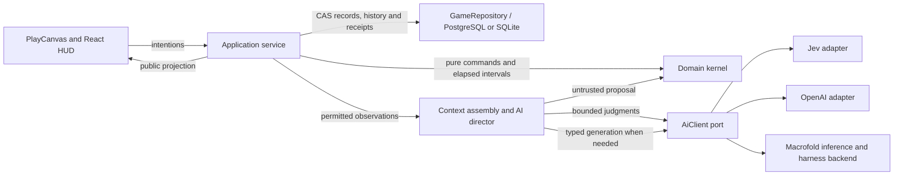

# Implemented architecture

## Spatial world foundation

The current development format is **schema 10**. World positions are continuous right-handed Y-up metres with semantic support IDs and shared body profiles. A standing actor's position is its physical foot/support anchor, not a navmesh voxel or sprite center. `map.height` still means horizontal Z depth. Optional placement snapping is not required for movement. Current finite slabs, filled ramps and boxes support the lookout, underpass, native bird corridor and mixed simple meshes/sprites; arbitrary structures and general flight planning remain gated.

Live entities have one tagged world, contained or attached placement. Only world roots carry XYZ/support coordinates; contained/attached positions resolve through the semantic placement owner. The public view schema remains **2**.

Ground routing uses server-side **Recast/Detour 0.43.1** on reusable mechanical triangle geometry. The previous layered lattice A\* is removed, not kept as a second authoritative planner. A validated direct segment needs no worker. Otherwise a saved native action requests bounded route data; Recast returns proposed polygon corridors, which are straightened, mapped onto exact semantic supports, split at seams and checked against the physical body before admission. Same-support shortcuts check the full body. Movement follows arbitrary-angle segments, consumes at most its native distance allowance and tolerates a small final residual rather than zigzagging among grid nodes.

### Navigation preparation

One persistent worker owns up to six prepared body-profile meshes for the current map. At most 64 saved action requests enter its active queue; additional actions remain pending. Previews do not enqueue work. Geometry/timeline changes fence old results and terminate obsolete active work before replacing the worker. A 20-second watchdog reports unavailable; failures do not become automatic unbounded retries. Preparation and query timing/queue gauges are exposed through existing performance diagnostics. No worker or WASM world is created per actor.

Required pending navigation is a **technical simulation barrier**: game time does not advance while a valid current action awaits geometry/route preparation, and that real wait is counted separately instead of being charged to hunger or creating catch-up debt. The service releases its mutation lane while the worker runs; cancellation, pause, restore, preference changes and reads remain available. Existing admitted time debt is preserved; after preparation normal ordered elapsed integration resumes. This single-world barrier favors deterministic early-game fairness; scheduling independent regions is future work, not a second clock added now. Startup prewarming without a pending action does not freeze the world.

Results commit through the existing writer and verify world/timeline/map identity, action/request, live body and source pose. Accepted routes are plain saved points, not polygon refs. Route invalidation requests bounded native replanning (two attempts), never another LLM. Partial/capacity/unsafe/unavailable results do not authorize motion or consumption. Whole-revision rebuilding is implemented; affected-tile updates, multiple workers and general permission-bearing links are not.
The default visual detector is `vision-geometry-v1`, with body-eye origins, range and coarse target-height samples. `hearing-db-v1` uses 3D ears, one energy-transmission contribution per crossed slab/blocker and a pinned acoustic policy. [Speech evidence and captions](#hearing-captions-and-perceived-events) now distinguish partial/indistinct hearing and unidentified voices. Room propagation and general non-speech sound processes remain EPR/SW08 work. Event origin is copied at emission. Public starter geometry is explicitly known; private NPC future flight paths are not projected. Actor-scoped observations also strip other actors' future path/destination records rather than letting cognition infer unseen future behavior. They assemble permitted shallow records before one final deep copy, rather than cloning private plans only to delete them and then cloning the result again; returned observations remain independent of world state.

### Collision authority

**Rapier 0.20.0 shape-level queries** provide round-body overlap and continuous sweeps behind the spatial body-query interface. The host initializes WASM once before creating/restoring worlds. Browser/shared DTO imports do not load it. The domain invokes initialized deterministic geometry operations but owns positions, support, time and effects. Human bodies are upright capsules; bodies shorter than their diameter use a cylinder. Radius/height and a 1 cm clearance skin are shared with Recast's clearance conversion. No separate mutable Rapier World or stepping broad phase is used: our prepared full-extent AABB tree narrows static solids, avoiding stale collider-index results. Analytic support, sight and ordered acoustic crossings remain specialized native queries.

The 1.5 cm support tolerance is a numerical/contact comparison, **not placement precision or a snapping grid**. Current Recast resolution is 8 cm horizontal / 5 cm vertical with a separate 20 cm maximum candidate reprojection window. Physical feet still lie on the selected support. Resolution was tightened after a measured 80 cm passage disappeared at 10 cm; no body shrinking, sqrt(2) radius inflation or relaxed floor-switch permission was used. Raster climb connects slope samples and grants no new physical step ability. Full Rapier character-controller sliding/step policy, dynamic rigid bodies and crowd physics remain unimplemented.

Spatial geometry, accepted paths, flight/fall progress and support state now have canonical records under the existing transaction owner. Development compatibility follows the [root policy](../AGENTS.md#development-save-policy).

Static queries retain full-extent immutable indexes, frozen-stance/pose memoization, geometry/sense invalidation, range-first hearing and ordered acoustic transmission. Landing uses phase-local occupied extents, not general crowd arbitration. Senses never call a navmesh walkability raycast. Current body-authorized entities remain the disclosure boundary. EPR03's initial visual acquisition is observer-private; richer exposure deltas and D51's multi-view/viewport work remain open.

### Presentation and restoration

`WorldRenderer` keeps PlayCanvas out of simulation and protocol. [World presentation](world-presentation.md) owns current arbitrary camera movement, fully camera-facing lit sprites with separate upright depth, actual mesh/proxy shadows, configurable local authorized read-through and picking. Right-drag orbits yaw/pitch; primary/middle drag pans. Recast does not determine drawing order or camera sight. Camera cutaways retain physical/acoustic/shadow geometry; the read-through pass redraws authorized hidden target fragments rather than making holes onto unknown background content.

The [long-term architecture](../archive/07-technical-architecture/README.md) remains design context. The supported-gameplay data foundation now uses independent canonical SQL records, atomic revision fencing, scoped recall and source-version history. The [production data tracker](maintainers/production-data.md) distinguishes this implementation from unqualified first-release capacity and future regional execution, public queries and hosted operations.

The September 25 [data foundation](maintainers/production-data.md#delivery-slices-and-exit-evidence) delivers independent supported-gameplay records, SQL recall and explicit source/restore fencing. Local game interfaces deny another human-controlled character’s private mind to creator inspection. Verified OIDC account scopes now support the first shared-world implementation; regional distribution and release-scale/security qualification remain later work. A database administrator is outside the game-level privacy guarantee.

The [engine/world boundary](engine-and-world-boundaries.md) and [world-module runtime](../archive/07-technical-architecture/world-module-runtime.md) describe the target extensibility foundation. The attribute and coarse-contact slices below are implemented; current code still uses finite native families and fixed body/action contracts; [EWF](maintainers/extensible-world-foundation.md) tracks that gap.

Gameplay saves retain XYZ/support, pending/accepted route actions, replan state and native flight/fall through existing owners. Player reveal settings use the account profile owner outside gameplay rewind. Rebuild disposable worker meshes and collision data on load; rotate timeline/command epochs and reopen paused. Supported older worlds migrate in place; unsupported shapes are rejected without modifying them. [SW](maintainers/spatial-world.md) owns deferred requirements and [verification](verification/recast-integration.md) distinguishes application observations and stress samples from automated qualification.

## Extensible attribute foundation

`world-modules.ts` validates the saved module manifest with exact attribute definitions, content pins and reviewed host implementation IDs. The first supported interfaces are native health/fullness/energy adapters, bounded numeric reservoirs and categorical attributes. Native quantities retain their original storage; new quantities live only in sparse actor state. `worlds/base/needs.ts` owns the unchanged native rates and shared need mutations. There is no dynamic code loading, general module graph, alternative body solver or arbitrary effects map.

`projectAttributes` supplies applicable values, actual ranges/units and permitted concerns to the HUD, public entity inspection, owner inspection and decision context. Public entity projection omits owner-only attributes; the native actor observation strips sparse state from other actors. The existing native urgency thresholds remain distinct from context and meter thresholds. Additional need crossings emit owner-private `attribute-concern` evidence through the existing event/awareness path, with a saved hysteresis flag and a recovery margin of 5% of the configured range. Private attribute concerns remain excluded from narrator selection. ActorWork observes concern bands, not each quantity revision; the general EPR episode service, dirty intake and reminders remain unimplemented.

The opt-in `reservoir-demo` creation preset gives the controlled actor and resident a 0–240 charge reservoir and a categorical disposition, without fullness, fatigue or sleep state. Its capacitor contains finite charge supply. `replenish` uses the existing timed-action lane: approach a perceived compatible source, debit and credit each native step, stop at capacity or the bounded duration, and retain actual transfers on cancellation. The resident can start this native response while idle without a goal or model call. Player catalogue, object-detail actions and NPC suggestions share current admission. Charge is an abstract reservoir: zero charge does not yet disable locomotion, and no electrical solver is claimed. The default wilderness preset is unchanged.

God-only attribute authoring uses `admitAttributeDeclaration` in the declaration boundary. It admits bounded definitions, permits presentation-only sequential revisions when no dependent action is active or queued, and rejects removal with live instance/source/action/frontier dependencies. Whole definition bytes are captured in saves, so retained saves retain their own pins. Atomic owner edits/initialization require manifest and per-attribute revisions; server admission also requires the current restore generation. No raw path, native-owner replacement or unit/resource reinterpretation is accepted. These are native technical APIs, not the proposed natural-language workshop. Definition edits follow the [invention policy boundary](#invention-policy-boundary); ordinary attribute state edits do not create definitions.

Current same-version capture/load validates manifest pins, supported implementations, applicable sparse state, source resource identity and pending action versions before replacing authority. Existing conversions run before installation; unknown shapes are rejected without deletion. Independent capability contributions have explicit native lifetimes. General construct invocations, mechanical definition transformations and portable packs remain future INV/EWF work. The native two-world attribute reuse exercise is recorded in [Verification](verification.md#extensible-attribute-runtime); it is not EX04/EX10 construct or marketplace acceptance.

### Typed state, claims and aggregate work

`state-owners.ts` resolves closed native or pinned sparse addresses. Body health and wilderness needs retain their native storage/order; sparse attributes remain under the manifest owner. Reads distinguish known, unknown, uninitialized, inapplicable and unsupported state. `resource-claims.ts` validates a named phase's proposal groups against one start state and availability ledger, then applies accepted atomic groups through those owners. Charge permits bounded partial fulfillment with unchanged continuous precision; item and gathering stock use checked whole units. Saved holds bind a real action/process, release once and never mint stock on cancellation. Their derived actor/module/world/host occupancy includes retained receipts; legacy holds without claimant evidence retain world/host charges.

Independent capability contributions extend the existing status owner with exact source identity and supported lifetime. Removing one cannot undo stock history or another block. Fixed and source-sustained evaluation charges its admitted recurring root. Terminal independent records become cold only after commit; completeness metadata and canonical ordinals preserve exact replay, policy pins and complete save capture. Native singleton cooldown state remains hot. Source-reference indexes prevent merging away a live contributor.

`dependencies.ts` and `queries.ts` supply finite semantic changes and explicit complete/unavailable/budget-exhausted reads, including empty-result membership. Spatial reads retain old/new placement and conservative collection/geometry/sense dependencies; inventory uses parent/ancestor revisions. ActorWork installs only current subscriptions and acknowledges the captured dirty generation. New evidence arriving during asynchronous work stays pending. No second scheduler or writable dependency graph was introduced.

`work-budget.ts` supplies checked nested cost composition, root lineage, live/retained allocations and positive-time recurring interval/burst limits. Native command/advance/query/effect ports share the enclosing meter. Mandatory exhaustion discards the candidate step, preserves simulation debt and pauses with an explicit error. Current installation and pending world commits share process-wide `HostWork` admission; distributed admission remains future work. Operational ceilings are containment, not measured capacity. [SC](maintainers/state-contributions.md), [DI](maintainers/dependency-invalidation.md) and [Verification](verification.md#foundation-priorities-15--implementation-evidence) own acceptance and measurements.

### Registered senses and coarse contact

The same manifest pins reviewed vision-radius, obstructed-hearing and body-contact descriptors, with one owner per supported detector and no separate definition-count ceiling. Actors select exact installed IDs or the world's default bindings. Vision geometry is unchanged; hearing uses the pinned dB policy described below. Admission, speech/teaching recipients, event audiences, observation, NPC suggestions and scheduling visibility consult the receiver's bindings. Immutable manifest resolution is cached across native drafts; the post-movement contact query uses the existing spatial candidate implementation and is built only when needed.

The opt-in `touch-demo` preset keeps the player sighted and gives the charge-powered resident only physical body-contact sensing. [Physical contact](spatial-world.md#physical-contact) uses body surfaces and height overlap, never a proximity radius. All acquired receiver-private contact episodes retain stable IDs and onset/change times. Detail is only present/moving, derived from actual position changes; texture, identity and precise location are not inferred. Onset, motion-detail change and end enter existing awareness as private `felt` evidence. Internal reservoir crossings use `internal` modality. Both remain outside Narrator selection. Contact context contains opaque episode IDs and permitted text; source entity IDs stay in private episode state and are stripped even from the actor's own model-facing entity projection.

A touch-only actor receives no visible objects or audible speech. The native movement adapter permits direct probes of at most one tile with collision checks, never hidden shortest-route planning; ordinary NPC suggestions offer four 0.75-tile probes without prefiltering hidden walkability. Object identification/targeted tactile manipulation, remembered routes, source-specific material responses and a touch-only player renderer are not delivered. Sense authoring currently uses reviewed native presets, not a god or world-agent editor. Persistent contacts are saved and unchanged contact creates no new evidence after restore. Broad vision/hearing acquisition semantics, explicit general reaction cursors and reminder policies remain EPR work.

## Hearing, captions and perceived events

The domain's `acoustics.ts` and `hearing-db-v1` sense resolve the [hearing contract](hearing-and-speech.md) through ordered spatial queries. The manifest stores exact acoustic definitions/pins and receiver hearing floors. Existing state admission, manual-save envelope and unrelated main migrations remain; the public schema is 2 with coordinated client/server extensions. Pre-hearing manifests/perspectives are not converted; development compatibility follows the [root policy](../AGENTS.md#development-save-policy). Current-format persistence and restore retain identity and listener evidence; unsupported state is never silently reset.

The authored source presets, uniform background and thresholds are gameplay tuning, not calibrated hearing measurements. Distance rejection precedes barrier queries; there is no old 10-metre audience cap. Starter timber/deck transmission values are retained as authored energy ratios (0.4/0.45), the ramp uses 0.25 and derived rock uses 0.15; zero-transmission terrain blocks the direct path. They are not measured material absorption. Source volume affects acoustic reach, while ordinary clear-hearing helpers retain their strong meaning for teaching and explicit join eligibility. Conversational continuity considers the strongest supported voice so an established shouted exchange is not closed by ordinary range. No indirect room propagation, frequency bands, voice recognition, language simulation, waking or sound injury is introduced.

`perceiveSpeech` creates one listener-specific capsule during `recordEvent`: permitted fragments, event-time identity, perceptible delivery, coarse bearing and the listener's own acquisition pose. Unknown voices never expose the raw source ID/location. The source is tokenized once per emission; partial fragments use a local versioned deterministic stream without perturbing world RNG. Self-expression remains known without a hearing sense; other dead/asleep/incapacitated actors do not acquire speech. Visible but unheard speech is observed evidence without words or delivery information, not an overhearing trigger.

`projectEventEvidence` uses those capsules for hot observations and durable perspectives. Public events, Talk, World Events, context, recall/embedding sources and Narrator inputs use permitted words instead of recovering full quotes through raw event joins. An incomplete quote remains incomplete in later reasoning and summaries; existing native obligations derive only from the speaker's own explicit promise, not an overhearer's missing fragments. Administrative raw-event inspection remains separately authorized. New speech missing its required perspective fails explicitly rather than falling back to full text. The historically named `migrateCognition` now only initializes newly capable actors; it never backfills absent identities or content from raw events. Generic event/awareness editors reject committed speech text rewrites, while guarded deletion and awareness-importance edits remain available. Dedicated re-authoring is deferred under [D66](../archive/05-project/open-decisions.md#d66--re-authoring-committed-speech).

Player and strict model talk payloads support whisper/normal/shout. Request identities and reply fallback preserve volume. Native admission permits a valid utterance that misses its intended recipient; it does not fabricate delivery or silently raise volume. The director records such a player's utterance as completed without dispatching an interactive model request when the target has no intelligible heard evidence, including detected speech with no understood words. Before a chat decision, the exact original event must still have intelligible actor-scoped evidence; main’s actor-scoped cold-memory repository can hydrate that exact evidence, while absent/revoked evidence makes the job stale rather than recovering raw text or matching another identical utterance. Technical provider diagnostics remain separate from actor evidence. Existing provider configuration and spending gates for Talk are unchanged.

`SpeechCaptions` owns a bounded React overlay with at most eight active entries, 24 pending entries and three messages per recognized speaker. It renders only public text, segmented into at most 160-grapheme chunks, and reserves space for existing work notices. Known currently identifiable speakers use the existing sprite-top anchor. Other heard speech uses an eight-sector listener-centered ring or neutral fallback. The ring never uses hidden coordinates; listener translation beyond 0.5 metres removes the historical directional cue. Camera movement, floor selection and mute do not affect hearing authorization. The renderer rejects behind-camera head anchors and tries smaller directional-ring radii to fit the measured caption before using a neutral fallback. Predominantly vertical sources do not receive a misleading horizontal bearing. Overlap handling is small bounded stacking, not a complete label-layout solver; only fitted entries occupy stack space. Pending self/direct speech has stable priority without interrupting active captions. One-word partial speech has a deterministic reveal-or-gap outcome, and an empty linguistic result is marked unintelligible.

The pure `ProgressRing` and `ui-lifetime.ts` implement [timed UI](timed-ui.md). One scene-sampled presentation clock advances reading time independently of simulation speed. React changes on entry/content/lifecycle updates, while existing frame callbacks update transforms and ring attributes. ResizeObserver caches label dimensions. A chunk starts its lifetime only once it fits and is displayed; time hidden by layout does not consume its reading budget. Chunk counters distinguish long utterances, and later chunks do not repeat the full utterance through the live region. Local hide/pause/reading-multiplier preferences and stepped reduced-motion progress are implemented; timers are not world state or physical speech duration. Scope changes and reconnect establish a fresh caption baseline, and hidden-tab backlogs are not replayed. Overflow stays in durable history.

`GET /api/world-events` reads the existing event/audience/perspective tables. It binds the controlled actor, filters scope/type before keyset pagination, uses an initial high-watermark, and rejects changed filter/scope/epoch cursors. The All view includes perceived events suppressed by Journal; the Speech view spans conversations. Own encounter/contact/body-sensation occurrences are included, while thoughts, private plans, diagnostics and Narrator prose are excluded. A separate actor-scoped `worldEventsRevision` notifies the read-only panel without polling. The memoized panel receives only scope/revision props, remounts its scoped contents on actor/timeline/filter changes in the same render, aborts obsolete fetches, memoizes row content, and uses set-based page deduplication. The current UI offers a finite set of existing exact event-type filters; a dynamic registry-driven filter catalogue is not implemented. All still includes other authorized types, and the server accepts bounded, parameterized exact-type queries.

Actor/time and actor/type/time expression indexes on the existing durable perspectives match the query expressions and support keyset range seeks; no new writable event log or historical backfill is added. Persistence resolves needed awareness once per actor from the recent end, hashes each shared event once, and skips old-evidence comparison allocation for append-only updates. Durable perspective edits include importance changes. Editing a retained non-speech event after hot consolidation reuses its existing permitted perspective rather than failing or recreating hot awareness. The remaining shared-prefix traversal and general event/recipient candidate scans are not constant-time mature-history or population capacity.

Talk and Journal use the same actor-perspective order/type expressions as World Events for indexed reads and an actor-scoped watermark. SQL and hot-memory selection reserve the automatic dialogue/verbatim pool for self/heard speech with understood words; no-word cues remain ordinary evidence. Empty vector source batches avoid SQL while retaining query-vector/limit validation.

Background indexing uses main’s durable `MemoryRepository` eligibility/source-revision queue and publication notifications across all supported memory families. The older speech-only indexer is removed. Actors take turns in bounded batches; one actor’s denied budget does not stop the next actor, while provider failure stops the pass. Current eligible evidence, controller, cancellation and generation are rechecked at actual dispatch.

`embeddingBatches` shares adapter count, text-byte and encoded-request-byte limits. Query prefixes reserve capacity; oversized optional records retain structured fallback. `WorldService.publishRecall` enters a fresh mutation turn outside inherited asynchronous context. Dispatch starts there after current evidence checks but provider completion is awaited outside the lane; bounded vector/query-cache publication rejoins it and rechecks current scope and source eligibility. Forgetting, correction and restore cannot republish obsolete results. This is not an application-wide audit of every derived writer.

The Talk/Journal HTTP response checks actor/timeline/history scope after all awaited reads, including message-job lookup. An active-conversation query also checks that its selected conversation is still active. A changed scope rejects the stale response rather than returning pre-revocation text; World Events keeps its existing corresponding fence.

Caption queues are bounded in residence as well as count. A caption pending or continuously layout-hidden for 60 unpaused presentation seconds is removed from the overlay only; visible captions retain their reading policy, and game/presentation pause or a hidden document freezes staleness. This does not add a timer to the domain or remove retained events. The remaining lack of an explicit dropped-caption notice and advanced priority/layout negotiation is tracked in HE rather than claimed complete.

[Third-review evidence](verification.md#hearing-third-review) covers completed-actor skip cost, independent budget admission, byte-aware batches, dispatch cancellation, inherited-context publication/forgetting ordering, HTTP revocation and native stress. These runtime observations do not establish PostgreSQL, live-provider, graphical or sustained fleet capacity.

[Second-review evidence](verification.md#hearing-second-review) records scoped transcript experiments, the no-word retention case, empty-vector I/O gating, stale-queue component execution and repeated native stress. Native domain sources were unchanged by this review; it does not qualify the concurrent-main combined tree.

[Review evidence](verification.md#hearing-review-hardening) adds privacy/editor, indexed history, SQL fan-out and offline lifetime/scope observations. [Initial manual evidence](verification.md#hearing-runtime-and-performance) covers native/SQLite/HTTP behavior, same-format restart, offline DOM rendering and native stress. Actual PlayCanvas camera/anchor behavior, production PostgreSQL queries, live provider compatibility and full accessibility/scale acceptance remain unqualified in [HE05](maintainers/hearing-and-speech.md#he05--runtime-and-performance-qualification). No automated suites were written or run.

### Accelerated native and hearing execution

The native participant roster indexes supply IDs by resource definition once per execution slice. NPC survival reads only matching candidates; live quantity, visibility and approach validation retain their previous order and authority. The roster refreshes after nested command transitions; future native membership/component changes must refresh it too. Empty supplies do not cause every hungry actor to proxy the scenery each simulated second.

Receiver trees hold immutable pose/body/sense inputs and IDs, not entity records. Nonspatial health/activity changes can reuse matching geometry after a current membership/order check; results rebind to current entities before hearing, recognition and live capability checks. Mutable poses take the uncached path. Spatial rays bind scalar axis/body setup once per query, with unchanged division/epsilon and exact-shape decisions. Neither optimization alters the audible audience or stores new world truth.

The native profiler uses main’s requested `intervalSeconds` and reports actual progressed time and interval counts. Its zero-progress navigation outcome is not throughput. `stress-hearing.ts` independently offers speech while the real service advances elapsed time and commits to SQLite. [Combined evidence](verification/hearing-main-integration.md) qualifies this tree; old fixed-step/slice measurements remain historical. Main’s [RP06](maintainers/revisitable-policies.md#rp06--elapsed-time-fidelity-and-integration-limits) owns fidelity, while speech remains immediate and recipient-complete.

## Manual gameplay saves

The Game panel directly below World agent is available only with the current save grant and provides named manual saves, rolling autosaves, a saved-game list and completion/failure status. Named saves have no fixed count ceiling. `GameSaves` coordinates coherent capture, `SaveFiles` owns immutable synchronized publication, and `WorldService` owns the revision barrier and restore transition. The package preserves the complete canonical world, cold history and accepted generated definitions. See [save allowances](save-and-load.md#current-history-capture-boundary).

Manual saves live beside the configured runtime database, normally `.data/saves/<save-id>/`, including when the authority uses PostgreSQL. Each slot contains a small `metadata.json` plus `world.jsonl` (legacy slots use `world.json`); listing reads metadata and checks payload size. Private files are flushed in a temporary directory before an atomic directory rename publishes the complete slot. Interrupted temporary candidates remain unlisted. `.data/` is gitignored. The internal “Before last load” row in `game_saves` holds an integrity-checked pointer to a durable recovery file; pointer replacement and world replacement share one SQL commit. Earlier database-only development manual slots are not migrated or listed.

Loading pauses admission, drains the AI director, retains the current world as “Before last load,” installs history and world in one commit, preserves current forgetting/accounting/external-operation records, rotates command and provider-context identities, resets derived scheduling caches and reopens paused. Captured queued/running narration is cancelled, not redispatched. Browser world-agent sessions and drafts reset on the new timeline; these local drafting sessions are not authoritative game state. Existing attempt/cooldown guards stay outside rewind. Load operation receipts prevent a repeated request from rewinding twice. Operational backup/import tools include retained manual/auto/recovery files with their database dependencies; the server must be stopped for the filesystem/catalog cut. File selection/import from arbitrary locations and switching independent world identities are not part of this menu.

Capture uses the canonical record catalog directly, including full cold history, retired sources and source annotations. `CheckpointWorker` establishes its independent reader at startup. The worker and operational snapshots reuse one canonical capture helper to stream SQLite WAL/PostgreSQL read-only keyset pages into `SaveFiles`; world bodies never travel through a worker message. `WorldService` waits only for the snapshot revision barrier, then native commands/ticks continue. Per-record/package/count/time/worker-memory allowances fail safely. The read path reconstructs via the same record assembler and current migrations, with integrity/coverage checks before installation. It runs after the explicit load pause and background drain.

`Autosaves` advances on running wall time, coalesces busy work and retains three verified points through the same save path. Pre-load recovery is an immutable file published before the transaction switches its database pointer; two verified recovery files are retained. Manual slots are never rotation candidates. Operational backup directories carry gameplay records, the complete external-authority table stream and referenced immutable slots; backup/import/restore share one authority-table catalog, validate recovery pointers against retained files, require a stopped server and refuse conflicting targets. [Recovery instructions and evidence](verification.md#bounded-history-checkpoints-and-recovery) state measured limits.

The [development save policy](../AGENTS.md#development-save-policy) governs future state/storage changes; existing record extraction and content conversions are implementation history. Saves remain local, portable full snapshots; import/export UI remains unimplemented. Rolling autosaves are host-owned whole-world checkpoints, independent of player sessions; ordinary players never initiate automatic or manual world saves. Shared-world save and restore require the current save grant and preserve current account bindings, historical human privacy ownership and control generations outside rewind. Configured OIDC identities receive explicit grants; save permission does not grant another human’s private inspection. [Manual UI evidence](verification.md#manual-saveload-runtime), [data recovery drills](verification.md#data-foundation-runtime) and remaining [SL qualification](maintainers/save-and-load.md) are distinct.

## Performance critical path

The [20-agent/20-animal/100-object investigation](verification/three-times-scene-performance.md) measures server and browser separately. PostgreSQL single-statement SELECTs use the existing bounded read connection without a transaction round trip; explicit multi-statement reads retain repeatable-read snapshots. Writes and locking reads retain the writer, and publication validates session/grant/control together in one SQL statement. Player preferences are cached per account, replaced by their mutation owner and bounded by connection capacity; authority is still checked independently.

Cognition source preparation flushes pending sources for the selected actor, rather than unrelated movement/need updates. After attention, proven source appends do not invalidate selected evidence; edits, forgetting, generation and selected revisions still fence it. Resident trigger evidence needs no save-and-reload. Maintenance scheduling reads the last durable snapshot, coalesces each actor’s advisory inspections to at most once per real second, and wakes on committed actor revisions; actual source selection still flushes. Known spending shortfalls stop before context preparation, without replacing transactional reservation. In PostgreSQL, each small changed-source batch computes eligibility once for record, vector and embedding-queue reconciliation; unchanged queue entries are retained. Advisory maintenance-read failures back off for 60 seconds without pausing native play; failed authoritative writes retain their existing failure handling. Diagnostic updates coalesce by call ID within the [bounded backlog](limits/observability.md#diagnostic-write-backlog); accounting and reliable outcomes use their own durable paths.

The offline [native stress runner](maintainers/performance-profiling.md) extends the CPU profiler with disposable population/object fixtures and a parent-process deadline. It measures native capacity without database, browser or provider execution.

Read-only attribute definitions bypass Immer draft traversal under the same replace-on-admission contract as sense/status definitions. Bounded sight memoization retains admitted stable transforms when a dense scan exceeds target capacity; extra targets still receive exact geometry queries. Display usage shares one pending snapshot until a successful reservation, settlement, recovery or UTC month change invalidates it; spending admission always reads the authoritative ledger. These remove repeated work without changing simulation cadence or permissions. Current comparisons are in [the simulation/cognition audit](verification.md#simulation-and-cognition-audit).

Ground clicks send movement intentions directly. Native commands and timer transitions share the `WorldService` mutation queue. Explicit commands await repository commit before their results return; routine simulation retains its one-real-second flush policy. Background thought admission and maintenance no longer hold the native timer. Elapsed intervals preserve their accepted start/rate/end semantics and saved RNG; catch-up accepts a bounded prefix and releases mutation ownership before yielding after about eight milliseconds of work; a single expensive step can still exceed that interval.

Durable history uses a domain-proven append path with unique-key conflict rejection. Event encodings are reused; events, audiences and perspectives are inserted in parameterized chunks of at most 10,000 PostgreSQL parameters (900 for SQLite) or approximately 256 KiB, allowing one oversized row. Edits, revocation and forgetting retain their transactional cleanup. History schema readiness is cached only after commit. Actor migrations and trait initialization run at startup; actor creation/capability admission initializes cognition, and ordinary saves no longer scan actors for migration or replace unchanged social policy.

The Narrator wakes from committed queued-story changes, explicit regeneration, startup recovery and resume. It uses one earliest-due timer and one runner, drains durable jobs and retains wakeups arriving during active work. Cancellation is registered before claim I/O and rechecked before reservation; stale selection or source claims go through the repository cancellation boundary. Interrupted running claims remain uncertain rather than being automatically dispatched again. Rollback can cause a conservative extra queue check after a later successful commit, but cannot dispatch rolled-back work. Thought and maintenance scheduling coalesce one ticket per cognitive actor, compare relevant source identities/need thresholds/visibility rather than every entity-record replacement, and use simulation-time deadlines and provider-failure backoff. Autonomous cognition has no actor cooldown or global post-completion interval. Ordinary animals do not enter that scheduler. Clean tickets skip history/context and integration reads; a small relevance scan still runs at admission opportunities. Startup rebuilds tickets from saved state and schedule records. Scheduling storage failures retain the paused/error boundary.

Public publication coalesces committed revisions for 50 ms and yields between viewers after roughly 8 ms of projection work; the measured 100-player burst justified avoiding redundant intermediate projections. Individual command responses still follow durable commit. Optional usage, jobs, speech-job status and latest narration refresh independently of gameplay projection, with promise identity checks rejecting superseded results. Conversation text is projected synchronously from scoped events; only reply status waits for optional reads. Its cache compares at most 30 event identities instead of serializing the transcript. Private optional sections clear while invalidated results load; usage retains its last known value, with an estimated zero placeholder before its first read. Player-scoped history revisions exclude ordinary movement starts and advance when narration finishes or is explicitly regenerated. A separate epoch clears retained client history on edits, forgetting and relevant source invalidation. Talk loads on opening or scoped history changes and preserves its opening scroll signal when a refresh supersedes the initial request; Journal signals new entries without periodic history polling. Both preserve explicit older-page loading; destructive invalidation resets retained pages for privacy.

Encounter perception snapshots current root inputs after movement, spatially filters changed sources and preserves original entity order before exact visibility/hysteresis checks. Visibility caches copy scalar dependencies; changed objects invalidate only potentially affected observers. External audiences use receiver-volume candidates with exact sensing, and only explicitly fixed flight-evidence phases skip repeated input validation. Immutable observations and player visibility share a spatial index, with exact sight checks after candidate selection. Outstanding commitments use completion-event and due-time indexes; source identities invalidate them after edits or recovery. Navigation uses worker-owned Recast meshes and capsule-validated semantic routes; see [navigation preparation](#navigation-preparation). Historical native-grid fixtures do not qualify this backend. Native animal timers retain elapsed remainder and due-time/ID draw order. Current bounded wander and flight integration are documented in the base-world time policy; regional dormancy and universal random-event scheduling are not implemented. Experience additions use a mutation-owner, draft-local ID membership index for their source collection. Each draft indexes its retained IDs once and extends the index after accepted appends, avoiding a full history scan for every event. Non-add mutations invalidate the index; replacement arrays and independent drafts cannot share it. Unowned mutable builders and full-record reads still inspect their live source collection.

Durable history is projected before hot event eviction in the same transaction. The active set retains the latest 512 events plus sources referenced by current awareness, personal records, obligations and knowledge; eviction waits for at least 256 removable records. This bound depends on active memory and population. Cold history remains in indexed SQL tables with paged retrieval. Rare owner saves hydrate the full event dependency graph before applying existing edit/forget rules. Startup checks archived row counts; backup, import and restore preserve the archive. Record deltas are prepared in the main process for a fixed candidate revision before entering the SQL transaction. Normal configured server checkpoint capture streams through a dedicated worker and independent database reader; workerless operational callers use the same codec in their own process. The read snapshot stays open through file publication, so releasing the gameplay capture barrier does not release the database snapshot. Explicit load reconstruction still runs while play is paused. See [capture boundaries](save-and-load.md#current-history-capture-boundary).

New browser gameplay commands include an opaque server-issued `commandEpoch`. Complete results and request fingerprints commit in `gameplay_receipts` alongside world effects, outside simulation state. Each admitted command is retryable for 24 hours, including after restart; a different body conflicts. Epochs rotate after 24 wall-clock hours, with the new generation/token persisted before pruning expired rows from older generations. Unknown retired tokens and expired receipts return `expired` before domain execution. Restore issues a fresh random token so replay cannot become fresh admission after a rewind. Legacy requests without epochs and existing domain receipts remain compatible and unpruned; provider/invention/billing/admin identities are separate. Current account/control scope separately fences admission and receipt ownership; an epoch never grants authority.

`GET /api/performance` requires the current inspection grant (or explicit local-owner mode). It exposes bounded in-memory stage durations/counts: at most 32 stage names and 256 recent samples per stage, without SQL parameters or per-span database writes. Current stages cover mutation wait, native steps, tick wall/native-work/yield time, record preparation/transaction time, world commits, durable commands, public projection, GC pauses, SQLite statements and PostgreSQL statement/lane time. Durations include cumulative count/total/maximum and recent percentiles; nested spans overlap and must not be added together. Runtime counters distinguish requested/accepted simulated time, active real time, excluded long gaps and busy timer callbacks. Pending debt includes in-flight batches until accepted; it excludes real time since the latest timer admission. Bounded latest-value gauges expose process CPU (100% is one core), heap bytes and event-loop sampled delay. The latter uses 20 ms sampling resolution and is not excess timer lateness; `timer.lateness` measures excess over the 50 ms callback interval. Runtime metrics are process-local, reset on restart, and monitors stop on server close. Compare cumulative deltas over the same process uptime interval, including excluded gaps when assessing clock loss. Request arrival, browser render and complete capacity qualification remain unimplemented.

Native encounter projection captures position scalars once after movement and uses stable spatial candidates for people and objects. Prior visibility membership uses sets; unchanged visibility arrays retain identity. Native visual acquisition goes through `recordVisualAcquisition` and the existing ledger/experience owner, with only the observer in its private audience and observed modality. Sleepers acquire no new visual evidence. Living-source entry keeps its existing cognition importance; ordinary object entry does not force a cognition call. The story selector permits a designated introduction from the viewer's own sole-recipient visual acquisition, while excluding private thoughts and other actors' evidence. External speech/action events still resolve their actual event-time audiences; acquisition is no longer an audience-resolver cache consumer. Richer exposure deltas and encounter hysteresis remain EPR work. Cognitive signature refresh has separate `cognition.thoughtRefresh` and `cognition.maintenanceRefresh` spans. `ActorWork` still visits all memory-capable minds; thought signatures compute nearby visibility before readiness selection. Autonomous admission has one shared workflow, with no global post-completion delay or actor cooldown. This limits many-agent responsiveness independently of native tick speed.

PostgreSQL has one serialized writer connection and one serialized read connection. Memory selection and record recovery use repeatable read snapshots; a large search does not occupy the writer connection. Both lanes are asynchronous and bounded to one active operation. Reads retain a five-second statement timeout; atomic writes allow thirty seconds for cold extraction and restore. No query or paid attempt is automatically retried. Active simulation loads current physical state and recent actor evidence; inactive memory, awareness and summaries remain in SQL. Scoped retrieval and explicit maintenance/edit/save materialization preserve cold-source access. Dense recent evidence and initial perception fan-out remain material costs; [residency](performance.md#inactive-history-residency) owns the exact boundary. Checkpoints still serialize in the main process. The OIDC host derives independent account/actor scopes; multiple tabs of one account still share one embodiment and explicit control generation. See [performance work](maintainers/performance.md) and [measured foundation evidence](verification.md#data-foundation-runtime).

`upgrade-world.ts` converts missing status-effect state before current-model validation on startup and manual-save loading. Startup diffs against the persisted pre-upgrade shape so the conversion is included in the normal atomic commit. World/action identities, elapsed dream time, energy, history and external records remain in place. Save envelope labels are checked for metadata/payload agreement, not used as per-feature version gates; actual content is validated on load. Existing registries and journal integrity errors are not bypassed. This describes the existing conversion; future work follows the [development save policy](../AGENTS.md#development-save-policy).

## Dependencies and authority

The first shared-world authority implementation is described below. Further synchronization in the [real-time architecture](../archive/07-technical-architecture/realtime-synchronization.md), including browser prediction and regional replication, remains separately gated. Local two-account evidence does not qualify hosted multiplayer capacity.

```mermaid
flowchart LR
  Browser[PlayCanvas and React HUD] -->|intentions| App[Application service]
  App -->|pure commands and elapsed intervals| Domain[Domain kernel]
  App -->|CAS records, history and receipts| Store[GameRepository / PostgreSQL or SQLite]
  App -->|permitted observations| Context[Context assembly and AI director]
  Context -->|bounded judgments| AI[AiClient port]
  Context -->|typed generation when needed| AI
  AI --> Jev[Jev adapter]
  AI --> LLM[OpenAI adapter]
  AI --> Macrofold[Macrofold inference and harness backend]
  Context -->|untrusted proposal| Domain
  App -->|public projection| Browser
```

The domain imports no application, renderer, provider, database or wall-clock code. It owns every physical change. The browser sends intentions and displays an explicit projection; full snapshots and NPC private records never cross that boundary. The AI client exposes typed execution, not world authority. The composition selects the implemented Macrofold backend when its key is configured, otherwise the direct providers. Backend selection does not change simulation authority; current full deliberation requires Macrofold.

The right-side [god-mode cognition debugger](memory-architecture.md#god-mode-cognition-debugger) groups typed semantic triggers, context/retrieval, Jev routing and execution through committed outcomes. Rows prioritize actor/trigger icons, normalized trigger text, bottom-right wall time, visible trigger subtype/semantic level, proposed speech/thought/actions with structured hover/focus previews and accessible outcome indicators; detail views show world time and full request/stage IDs. Shared desktop panels support dragging and vertical resizing. Collapsed stages summarize input/output; matched action selection, routing disposition and accounting are nested under their consuming call. Jev results have counted answer filters, and provider billing refresh renders structured results and explicit errors. List reads project compact operation/receipt fields rather than provider exchanges; a parent/time expression index supports stage lookup. Follow-off polling reads only the newest root reference. Rendered triggers describe the initiating player message, new experience, interest cue, survival need, reflection or dream job instead of dumping assembled model context. Expanding semantically named stages reveals cost, tokens, useful structured input/output and receipts, while raw JSON retains the full sanitized stimulus. Root-only world-agent calls render their response or failure code/message. Each provider row distinguishes Open Legend's observed request duration from Macrofold execution and queue latency when the receipt supplies those fields; completed HTTP exchanges retain their own timestamps. Application stages record attempt-specific timing so a superseded retry does not overwrite the first attempt. No-call opportunities and unavailable detail remain explicit. Comprehensive interaction/revocation coverage remains in TODO.

God mode also exposes bounded native world editing through same-origin, owner-session POST routes. The person editor separates Character, Inventory and Identity. Inventory edits use existing world item definitions and the authoritative person-edit transition, preserving retained lot IDs. Type-total edits refuse ambiguous split, individual, declared-owner or reserved possessions; those require the exact possession operations. Changed inventory drafts require an unchanged source inventory and no active work; other unchanged fields are merged from current state. Inventory persists through entity components and placement records. Character panels expose applicable revival, cognition grants, person editing and private-mind inspection in a labeled God mode section; the context menu shares mutation handlers and availability rules. A dead actor with a compatible body can be revived, and blank walkable ground can receive one entity from the server-projected finite spawn catalogue. `POST /api/god/person` creates a named NPC with authored personality, backstory, selected descriptive traits and initial goals; an empty trait selection uses the saved-RNG three-trait default. `POST /api/god/spawn` creates another supported native entity family, and `POST /api/god/act` accepts `{ action: "revive", targetId }` for the lifecycle transition. The domain validates walkability, occupancy, trait IDs and lifecycle state, emits labeled committed events and initializes actor memory, knowledge, possessions and protected identity atomically. These explicit owner actions may run while simulation time is paused. They do not admit new definitions, generated mechanics or artwork and are distinct from the planned confirmed conjuring workflow.

Future harness use extends beyond reflection where real tool results determine the next step: [creator investigation, complex invention, conjuring and workshop refinement](../archive/07-technical-architecture/declarations-and-evolution.md#bounded-multi-turn-authoring-and-investigation), and [difficult character planning and teaching](maintainers/cognition-redesign.md#later-harness-extensions). These are later tasks, not claims of delivered tools or prerequisites for ordinary decisions. Bounded within-job tool turns are distinct from durable goals resumed across simulation events; canonical state and all effects remain application-owned.

## Account authority and participation

`AuthorityRepository` owns verified issuer/subject mappings, opaque server sessions, scoped
world grants, monotonic actor control generations, exit attempts and audited binding changes.
These records are outside gameplay rewind. OIDC uses the pinned maintained `openid-client`
adapter with authorization code, PKCE, browser-bound one-use state and nonce/signature checks.
Bootstrap operator mappings establish access once; restart never reverses revocation or a
later rebind. Explicit local mode remains a guarded single-account composition root.

Shared entrypoints receive immutable `RequestScope` values rather than changing a global
current player. The existing mutation queue rechecks session/grant/control/timeline before
execution; the SQL publication transaction checks them again. Gameplay and control receipts
are principal-scoped and reject changed bodies. Async private results keep their originating
scope. Creator inspection cannot read another human's private character state. Rebinding is
separately authorized and audited, retains historical human privacy ownership, settles both
bodies, and requires fresh control. Restoring a grant does not restore a revoked control lease.

One tab explicitly controls an embodiment; other tabs are followers. The domain owns
active/exiting/inactive participation and safe action interruption. The server supplies a
single real-time exit deadline, so pause cannot postpone departure indefinitely. Inactivity
preserves identity/history/contained possessions while excluding the body from active hazards
and spatial participation. Return validates saved support, then the authored safe anchor,
and remains unavailable if neither is admissible. Human-targeted harmful native actions
remain denied under the current cooperative policy. Shared unattended pause considers current
controlling connections and each account's foreground preference; it is separate from absence.

Player-to-player conversation uses the normal native speech command, receipts and actual
perception audience through the ordinary composer; it requires no provider setup. NPC reply
work retains its existing provider admission. Current implementation and exact native/OIDC
browser evidence are tracked in [MP01/MP04](maintainers/multiplayer.md#execution-notes--september-26-2026).
Hosted security, regional/distributed ownership and full-load acceptance remain open.

The current rendering adapter shares billboard depth/CPU picking transforms, removes shadow-only proxies from color layers, batches decorative plank seams and reuses reveal uniforms. Navigation support projection queries only spatially relevant candidate surfaces. A supercover terrain traversal checks every crossed terrain cell, including short diagonal water crossings; continuous coordinates remain independent of that representation. Worker failure and shutdown rules are in [performance](performance.md#navigation-failure-and-shutdown).

## State and transitions

`WorldState` is versioned JSON: stable entity IDs with explicit components, stable item instances and definitions, a recipe registry, actor-local knowledge, attributed memories, recent committed events, command/declaration receipts, RNG state and simulation time. Recipes reference native material definitions by ID; possessions reference definitions rather than copying behavior. Physical items, knowing a technique, hearing about it and the engine admitting it are distinct facts.

### Actor means any living being

The accepted domain meaning of **actor** is any living being that can participate in world state and effects, including people and animals. Personhood, species, body plan, controller, cognition, speech and inner-world depth are separate capabilities. A deer can remain a deer while later receiving memory, an intelligent controller, an inner world or speech; these capabilities must not require turning it into a human-shaped entity.

Actions and effects should target the smallest relevant capability rather than a human-only type. `Revive` is a lifecycle action whose intended scope is any dead actor, including an animal. Wetness, fire, injury, healing and health changes likewise apply to every actor with the relevant body/state components, with species-specific anatomy or susceptibility expressed as data or rules. This lets one rule affect people and animals consistently without implying that every actor has human cognition or language.

The current model stores lifecycle, health, species, body and independent cognition/memory/inner-world/speech/needs capabilities on `entity.actor`, plus the installed attribute manifest. `entity.animal` holds only native wandering/fleeing state. New worlds use this format; development updates follow the [development save policy](../AGENTS.md#development-save-policy) and current-state validation. A dead animal keeps its identity and kind, with finite harvest state on the same entity. God revival restores full health and applicable wilderness needs, clears bodily conditions and reconstructs an intact body even after partial or complete harvesting. Already harvested inventory stays with its owner. A later death creates fresh finite yields; god intervention intentionally ignores resource fairness. Finite body plans now also include a biped construct with scalar health and no harvest yield; general anatomy remains future work.

`living.ts` owns native body reconciliation and bounded simultaneous effects. Injury, healing, wetness, burning and direct health contributions aggregate deterministically before clamping. Body data supplies maximum health and susceptibilities; injury reduces movement by at most half. Hunting uses this common mutation and records actual damage. God effects require body revisions; revive supports request receipts and body revision checks. These are finite native families, not executable generated prose or a complete medical/environmental simulation.

Ordinary animals retain native behavior without needs drift, memories or provider scheduling. The owner can grant cognition and speech through the action picker or god action route; the same mind/recall/reflection interfaces then apply without changing species, body, inventory or identity. Cognition health thresholds use the body's maximum health. Private appraisals and kinship are separate from directional relationship text. [Bundled social rules](worlds/base/social.md) document current family/promise specializations and their extension seams; [gameplay availability](../archive/05-project/implementation-status.md#gameplay-availability) distinguishes native support from actual player/creator controls. `appraisals.ts` owns stable, revisioned private instances with exact installed policy pins and typed causes; `worlds/base/appraisals.ts` owns wilderness labels, damage mappings and explicit decay. Fear/discomfort retains its native anchors and magnitude. Opt-in grief is qualitative and persistent; reviewed condition/disposition enrollment supplies sustained or recurring internal examples without interpreting personality prose or kinship as a mechanic. Persistent inert state reserves capacity but has no periodic write, RNG draw or provider call. Due transitions use a derived index and emit owner-private evidence.

Subject relationship text is the existing revisioned knowledge document, surfaced through bounded private character pages and the same note editor. It never changes another actor’s view, immutable creator-authored parent/sibling facts or operational obligations. Reflection optionally proposes typed appraisal changes through its existing atomic note/name/goal/mind publication boundary. Current source versions, timeline, private ownership, knowledge/appraisal revisions and cancellation are checked before publication; reusing a publication identity with changed output is rejected. Conservative forgetting clears private appraisal causes, targets and receipt bodies along with accepted mental text. Terminal appraisal rows remain cold in canonical `mind_appraisals`; explicit residency completeness and exact scoped prior-outcome checks prevent a partial working set from deleting history or recreating resolved causes. Complete saves rehydrate those rows, and restore reapplies current privacy overlays. [ACT07/ACT08](maintainers/actor-model.md#foundation-execution-notes--september-26-2026) records completed foundation evidence and broader characterization limits.

`executeCommand`, `advanceWorld` and `admitDeclaration` return new state, outcomes and events. Work reserves/consumes inputs through trusted rules; completion creates outputs once. Competing harvesters cannot multiply a carcass's finite yield. Ranged launchers and ammunition share one family with mechanism, compatibility, range, accuracy and damage constraints. Hits/misses use the saved pseudorandom state. Animal awareness, wandering and fleeing require no models. Interrupted assembly follows documented cancellation rules in the [domain guide](../packages/domain/src/README.md).

The application uses [boundary-limited elapsed integration](simulation-time.md), publishes routine progress on its 50 ms host wake cadence, and coalesces routine durability to one real second. The host wake frequency, game-clock rate and browser frame cadence are independent; there are no mandatory 60 or 480 whole-world ticks per real second. Explicit commands/control changes commit immediately; clean shutdown flushes pending progress. An abrupt crash can lose the most recent unflushed routine progress. The renderer interpolates committed positions and has no physics authority. The base rate is 60 simulated seconds per real second; 0.5×, 1×, 3× and 8× multiply it. At 1×, one real second is one game minute and a day takes 24 real minutes. The host detects suspension from gaps of more than two seconds between timer callbacks, including callbacks while a batch is busy. Continuous busy time accumulates debt instead of triggering suspension. Each batch accepts a prefix of elapsed integration intervals after about eight milliseconds of native work, retaining the remainder for follow-up batches after yielding to the event loop and releasing mutation ownership between batches. Private motion slices reuse mechanical predictions; the server can stop at a coherent slice boundary after that budget. One slice or finalization can still exceed the budget. Speed changes retain admitted simulation debt; pause/resume and genuine suspension reset it. Missing-callback intervals remain excluded from catch-up. Domain transitions use isolated Immer drafts with unchanged branches shared. The server explicitly deep-freezes loaded/migrated state, accepted command/editor snapshots and each accepted interval result; freezing skips already-frozen branches. Domain builders remain mutable until server handoff, and auto-freezing remains disabled for compatibility. Domain callers must not mutate a returned snapshot. This avoids whole-world cloning and lets persistence/projection skip unchanged branches; changed collections still require traversal, so this is not a large-population performance claim.

`WorldRecords` persists supported gameplay through the explicit catalog in `world-record-schema.ts`. World control, entities, placement, actors, processes, agency, inventory, definitions, knowledge, memories, awareness, summaries, conversation membership, accepted inner-world text/files, recognition and receipts have independently addressable records. JSON contains one owned record; it no longer contains the operational world or an actor's whole history. Parent foreign keys and indexes preserve ownership and scoped lookup. Indexed quantities use integer columns; native owners still validate effects, references and physical rules.

A `world_head` compare-and-swap fences each transaction. The same transaction writes changed records, action receipts, durable history/outbox, source eligibility, forgetting/correction invalidation and job completion. Restore issues a fresh generation. Domain-proven append lineage skips unchanged history; unknown/replaced/forked collections use a full record diff. After-commit notifications wait for the outermost transaction, and rollback invalidates tentative repository baselines. Startup reconstructs and validates the simulation working set; ordinary recall/editor queries select rows directly.

Legacy `world` plus `world_journal` is an input-only migration path. Startup verifies its head and projections, extracts records in place, reconstructs the complete saved value, and retires the old writable rows only inside the successful transaction. `knowledge_documents` and `mind.inner_world` are retired projections; current authority is `mind_knowledge_documents` and `mind_inner_worlds`. Backups and manual checkpoints still use a portable serialized envelope, assembled from a consistent cut; this is export/recovery data, not runtime storage authority. SQLite supports native/immediate play; workspace publication retains its PostgreSQL requirement. Conflicts pause the writer. Saves restore accepted outcomes rather than repeating paid reasoning.

Existing cognition semantics remain: six-game-hour raw consolidation eligibility, existing summary retention, consolidation pressure and protected commitments. The SQL recall path searches all currently eligible retained sources; the old 512 speech preparation pool is no longer its search boundary. This foundation adds no semantic importance classifier, grouping algorithm or content-specific deletion rule. [Memory architecture](memory-architecture.md#implemented-retrieval-and-storage) owns source/index/selection behavior.

### Public updates and owner editors

`GET /api/state` returns a scope-specific `GameView` after authentication (or explicit local bootstrap). SSE then sends typed `GamePatch` updates with base/next revisions: partial clock/player/AI fields, entity upserts/removals/order, and replacement arrays for changed recipes, events and conversation. The server memoizes permitted projection sections using shared domain identities and telemetry revisions; it does not build private actor observations for the HUD. `WorldChanges` is the legacy private migration format; `GamePatch` is a separately projected public transport type. Neither grants client authority.

One serialized projection queue retains at most 32 scoped channels, each with a current permitted view and at most 64 encoded patches within 1 MiB; at most eight active HTTP event streams are admitted. Missing baselines receive a full public reset. A write returning false is accepted buffered data: delivery resumes on drain, with a 30-second stall timeout. The browser maintains its stream baseline separately from React rendering, rejects stale connection callbacks, clears retry timers, and bootstraps again on connection failure to refresh the session after server restarts. Grant revocation closes/reset-notifies affected streams; control/timeline changes remount private panels and clear pending intentions. This does not implement regional subscriptions or browser prediction.

God-only Person and World Events editors load compact summaries/hashes and fetch one raw JSON record on selection. Person creation retains creation-only initial goals. The Person editor has a separate contract for the current name, description, personality, backstory, traits, goals, health, fullness and energy; the first goal is the native planning goal, while the complete list is authored identity context. A single control fills the applicable native stats to 100. The Person tab reads a snapshot when opened and offers an explicit timestamped refresh; it does not poll or pause simulation. Saving identity fields rewrites the protected identity document and marks accepted inner-world context for reconsideration. Person saves merge at field granularity: untouched simulation-owned stats preserve their latest values, explicitly edited stats override drift since the snapshot, and conflicting edits to authored fields require refresh. Saves send changed entries with expected hashes, merge unrelated simulation additions, and commit the entire validated request atomically. Person memory pages use actor-scoped SQL pagination; only the requested 100 entries are formatted/hashed, and save conflict checks hash only edited entries. Creator inspection cannot read or edit another human-controlled character’s private mind. Importance-only changes refresh retrieval metadata without removing dependent prose; text changes invalidate derived summaries and mind state. Person memory deletion uses authoritative forgetting: retained evidence and dependent summaries are removed, the forgetting ledger is saved, and derived mind/vector/interest data is invalidated. Active commitments must be resolved first. Global event edits are separate from an actor's awareness; deleting awareness does not delete shared history. Raw JSON editing permits prose and importance changes while preserving identifiers, ownership, evidence links and mechanical fields. Batched experience mutations index and validate the complete request before applying it, and global event edits propagate through the same authoritative mutation path.

Editor windows are independent, draggable, fixed-size and centered on each new opening. Tabs and save/validation/dirty-close controls share `EditorPanel`; Save keeps the window open, Discard restores the loaded baseline, and refresh reports a real-time query timestamp. Opening an editor does not pause play. JSON drafts stay local to the text editor, and typing updates a keyed draft map without rebuilding record lists. The detail pane stays outside the scrolling list. The action picker refreshes explicitly; diagnostics retains its three-second polling cadence.

The player's journal excludes routine movement-start events before selecting its latest 60 entries. Its projection resolves a bounded recent-awareness window through a server-side event index, which is incrementally extended for normal commits and rebuilt after the rare history edit; rendering cost therefore does not grow with retained global history. New action-start events carry structured `actionType` metadata; projection also recognizes legacy movement-start text in existing saves. Internal events and memories remain intact, and other action starts, results and conversations remain eligible for the journal.

## React presentation and character traits

The public player/entity projection carries labels and presentation from the saved [status-effect registry](status-effects.md). The generic renderer supports horizontal billboards and reusable floating text particles without changing physical bodies. [Default sleep content](worlds/base/sleep.md) authors those visuals, energy conditions, rates and past-tense narration. Status effects live on entities, support explicit attribute targets (including another bound object), and restrict capabilities consumed by command admission, native locomotion, perception and pending-response cancellation. Player/NPC action discovery uses the same authored labels and bindings. Only the existing creator boundary can replace admitted definitions. The world-agent authoring surface remains pending.

The complete HUD is React/TypeScript with shared React Aria controls. The old imperative DOM panels, custom inline icon renderer and stylesheet have been removed. [Design-system ownership and adaptations](../apps/client/src/design-system/README.md) documents the organized fonts/icons/tokens, three themes, scale and reduced motion, dock/sheet layout, continuous work overlays, fixed-width time bar and 504px conversation panels. The scene owns no HUD components; its status adapter renders React using public screen coordinates. Quick-action rings are reserved for future authoritative cooldowns; current native actions have none.

New actors use `createActor` to sample three distinct traits from the [JSON trait bank](../packages/domain/src/worlds/base/config/traits.json) using saved RNG. Traits and descriptions are copied into each actor's save. Startup initializes only missing traits, committing the migration with the loaded world; later bank edits do not reroll existing actors. These are descriptive dispositions, without stat bonuses or new automatic AI policy. Only public trait descriptions cross the normal projection. The Character panel reads the player's own awareness/summary memory projection and bounded history; god-only inspection remains separately authorized.

World-agent tabs keep independent session identities and browser-cached transcripts. Macrofold continuations send the existing session identity without resending session configuration (model, harness, billing, provider connection, model parameters, permissions or grants); per-run spending/time limits remain enforced. Existing sessions retain their original configuration, and new conversations adopt current settings. Model availability is checked when creating a session. Hiding retains pending work; closing ends the lane. Transcript restoration creates a fresh conversation identity because backend closure is irreversible. Known recipes and invention jobs have structured cards; question-like prose gets an answer affordance. The existing world agent still has no conjuring or world-mutation tools, and this UI migration does not implement the proposed typed workshop/confirmation backend.

Both conversation composers use a one-line auto-growing textarea. In-flight turns display a message-local animated dot wave; successful turns carry no status label and technical failures show a small red marker inside the message, with the stored failure reason available through hover or keyboard focus. Cancelled and stale replies end pending presentation without becoming failed messages. Character-chat jobs retain the exact originating speech event ID. Durable Talk history includes response-linked accepted actions and expressions between speech messages; private thoughts remain absent. The Talk textarea is disabled when the selected person cannot respond, with the specific availability reason exposed through hover and keyboard focus, while queue names, provider stages and timing estimates remain outside the ordinary conversation UI.

World events and actor awareness carry separate 0–10 importance and urgency scores. Importance describes lasting significance; urgency describes time sensitivity. Ordinary new awareness does not invalidate an in-flight reply. When a newer awareness row reaches both current thresholds (importance 8 and urgency 8), the director aborts the active provider stage, rescans from the original attempt watermark, and rebuilds context once with every qualifying event received before retry as required evidence. Provider and application-stage attempt identities remain distinct. New evidence during the refreshed attempt cannot create another automatic paid retry. Native emergency behavior and deterministic action admission remain authoritative regardless of response refresh.

## Camera input

The bottom-right camera toolbar exposes icon controls directly, with hover/focus labels and shortcut help. Its follow-player toggle tracks the interpolated rendered position without per-frame React updates or preference writes. Follow is a saved local preference; pan and floor selection disable it. The behavior owner is [Picking and controls](spatial-world.md#picking-and-controls).

`WildernessScene` distinguishes a right-click from a right-button orbit using a five-CSS-pixel movement threshold. A stationary right-click opens the action browser on release; dragging moves only the local camera and never sends a movement/action command. Primary dragging follows the design system, and middle-button dragging is also supported (Space + primary works through the same primary gesture). Pointer capture carries the gesture across overlay/canvas boundaries, and cancellation, lost capture or window blur releases it and clears the grabbing cursor.

Native `contextmenu` timing differs by platform. During a secondary pointer sequence the scene defers action opening to release and consumes the native event, including a duplicate arriving after release. Control-click and keyboard/native gestures without that secondary sequence retain the context-menu path. Camera changes do not alter the actor's current server-side perception; viewport-aware perception remains proposed below.

## Action discovery and player preferences

The authenticated `/api/actions` query returns the finite catalogue scoped to the selected object or self, including relevant unavailable entries with missing prerequisites. A specific world-object context restricts the catalogue to that target before preview: reeds offer walking/gathering, a person offers walking/conversation/teaching, and a fire offers walking/cooking. Relevant missing prerequisites remain discoverable, such as cooking without raw meat; unrelated work and other targets are excluded. Self context includes personal work. Empty-ground context supplies only a destination for Walk here; personal work is available in self context and panel controls. Private NPC knowledge and unimplemented mechanics are not exposed as usable definitions. Labels, category tags and aliases are searchable without inference or a retrieval top-k cutoff.

`apps/server/src/action-catalogue.ts` enumerates options and uses `WorldService.previewCommand` to run the same command mapping and pure admission transition used by execution. Preview effects, consumed inputs, RNG changes and receipts are discarded. The browser queries on opening and coalesces refreshes while the menu is open; this does not add a catalogue scan to every simulation step. Scheduled-work previews stop after the same scope, path, work and interruption admission used by execution, before recording action-start events or receipts. Scope checks use the immutable source snapshot so perception caches are shared across candidates. Immediate-command preview mutations remain confined to disposable drafts; execution revalidates current state.

The React `ActionPicker` keeps search and keyed action rows stable across refreshed catalogues. Available entries precede unavailable entries, which appear only under the saved **Show Unavailable Actions** preference. The target header and **Look closer** open descriptions from the current permitted DTO. Right-click and dispatch preserve open panels; primary inspection opens In view. Search retains “Search actions or invent something…”; unmatched Enter or the inline search affordance opens an editable invention draft without a request. Only explicit Send dispatches AI work. There is no separate invention button beneath the list.

`action-descriptions.ts` projects plain descriptions and structured material/time facts from permitted observations and trusted definitions. Berry gathering yields up to two berries in 30 game seconds plus travel; it has no explicit energy charge. Resource, animal, remains and station descriptions come from `entity-description.ts`; they expose no private NPC mind. React renders all generated prose as text. One-second React Aria tooltips support hover and keyboard inspection; disabled entries remain inspectable and handlers reject dispatch. The server independently validates every intention.

The canonical `player_profiles` table persists account preferences independently of gameplay snapshots on both adapters. The same-origin preferences route resolves its account from verified scope. Revisions prevent older messages overwriting newer preferences, and tabs of one account share the profile. Actor milestones remain with the embodiment; no cross-world cloud profile synchronization is implied.

## Context and cognition

The [events, perception, and reactions proposal](events-perception-and-reactions.md) describes future stimulus-scope and intake integration; it is not implemented behavior or acceptance evidence.

### Narration and conversation boundary

Immediate response composition, saved conversation lifecycle and bounded generated private narration with deterministic fallback are implemented. Full generated Narrator behavior is specified in [Narration, agent responses and conversations](narration-and-conversations.md) and tracked in the [Narration and conversations implementation tracker](maintainers/narration-and-conversations.md).

### Durable conversations and private history

New speech creates or joins one durable conversation, including self-talk. Membership intervals, generation counters, active membership and transition identities persist with the world. Cross-conversation engagement atomically redirects the source, transfers current members and leaves historical speech attached to its original conversation. A targeted utterance engages only a recipient whose listener evidence supports being addressed; membership never grants access to missed words. Explicit leave, death and loss of every supported-volume communication link close intervals; an empty group closes. Hiding a composer does not leave. In OIDC mode, committed departure closes membership under the bounded participation lifecycle; hiding a connected view does not. Explicit local mode retains its configurable 60-second conversation-disconnect grace. Conversations expire after 1,800 simulated seconds without speech, expression or membership activity. Both grace settings are operator-configurable. NPC action selection includes native join/leave intentions.

`/api/history` binds the verified account and embodied actor before querying indexed event-audience and account-owned story rows. Speaker labels and utterances use the observer's permitted perspective; the reader does not join hidden global names or raw speech behind that boundary. Person-scoped Talk pages select direct speech plus response-linked actions performed by that person, preserving their saved order; unrelated journal activity cannot crowd them out. History survives experience consolidation; explicit forgetting revokes affected access. Stable order, a fixed watermark and bounded pages replace scrollback as the durable read path. Speech without legacy conversation provenance remains marked unknown. Source edits/deletions rebuild or remove dependent fallback text in the same transaction. Native merge notices use transition provenance rather than fabricated observable events.

`HistoryRepository` persists event projections, immutable event-time audience joins, actor-permitted source capsules, private narration, typed event/context/transition joins and story jobs on SQLite and PostgreSQL. Event writes, fallback text, source joins and queued work commit together. The pure domain story-selection registry selects permitted evidence before job creation. Names, encounters and cognition scores alone no longer admit prose. Explicit causal grouping coalesces bounded related candidates; stable introduction milestones deduplicate privately. Saved policy revisions invalidate pending selection. The repository accepts server-bound owner/perspective pairs for fan-out. Current human bindings supply account ownership; HTTP reads independently recheck current session, grant and timeline. Historical human privacy ownership is retained when an account changes embodiment.

The Narrator claims a saved job before dispatch, selects mandatory sources plus at most eight recent permitted context entries, and performs one bounded typed generation. Each sentence must reference admitted handles and every mandatory source must be covered. Shape/scope validation does not prove semantic entailment; live review must assess factual fidelity. Unknown handles, omitted mandatory evidence, unavailable generation, budget exhaustion or cancellation retain native fallback. Interrupted running claims become uncertain and never redispatch automatically. Source revision/permission checks, text, covered-source joins and completion receipts publish atomically. Corrections, source edits, deletions and forgetting revoke dependent text and stored job capsules. Consolidation retires recall rows without revoking history.

The Journal and composer use the same paged transcript. New/updated entries are announced through an explicit refresh control to avoid moving a reader. An indexed owner-scoped `story_banners` projection supplies completed eligible standalone text above the scene; the initial client snapshot does not replay history. Legacy and pending evidence are excluded. Restrained, lyrical and wry voices are saved profile preferences that affect future work; explicit regeneration is request-idempotent and creates a new revision without reapplying effects. Cutaway and private-NPC-thought narration are disabled. Source history remains retained by default; archival/expiry is not enabled. Editor pages contain at most 100 records; JSON detail remains on demand.

### Monthly agent spending

`AI_BUDGET_USD` defaults to 50 and cannot exceed $50 per agent per UTC calendar month. Zero disables paid dispatch; larger legacy configured limits are clamped to $50. Each reservation records an immutable actor account and admission month outside simulated time. Character decisions, recall and maintenance charge that character; Narrator and world-agent work use separate accounts. Unknown legacy ownership is conservatively included against each account for its admission month. Reservations and uncertain calls consume allowance, and restart/restore cannot refund them. Monthly reporting shows aggregate usage and individual balances; unused allowance does not roll over. Estimates are bounded before dispatch but provider invoices remain external; configured prices must match the provider. Compute reservations remain conservative allocations rather than automatic renewal.

A verified terminal Macrofold harness failure is reported as failed, with its bounded provider failure code and run identity for inspection. Missing billing does not turn that known execution failure into an unknown completion: settlement still consumes the full reservation until authoritative usage arrives. No retry follows automatically. Unverified persistence or transport completion retains the existing uncertain disposition.

World commits reconcile response, declaration and accepted-inner-world job completion in the same transaction. Consolidation and native obligation mutations use the authoritative experience path; changed/retired memory rows invalidate vector and interest projections transactionally.

### Current consuming data contracts

All world-local identities are scoped by `world.id`. Entity/item/event/memory/conversation/membership/transition IDs are stable saved identifiers; items retain explicit owner IDs and quantities, and definitions retain their admitted digest/version. Simulation time is seconds; event `order` uses the saved ID sequence and supplies a stable timeline independent of wall time. Older event IDs supply an explicit legacy ordering fallback, without reconstructing missing audiences or membership.

World revision is repository CAS authority, and a fresh record generation fences restore. Existing startup conversions precede current-model validation; their presence does not define development compatibility, which follows the [root policy](../AGENTS.md#development-save-policy). Bodies and conversations retain independent revision/generation checks. Command IDs plus canonical payloads govern effects; response IDs govern component receipts. World occurrence, actor awareness, personal memory, summary/source lineage and commitment identity remain distinct. Accepted inner-world and knowledge records commit atomically with their owning changes. Jobs, spending, dispatch claims and reusable vector versions remain outside gameplay rewind. Player preferences belong to the authenticated local profile.

Story identities are owner-scoped, with event/transition links, saved display order, revision and fallback status. Event audiences and current forgetting restrict history retrieval; membership is not an ACL. Repository interfaces own physical query layouts. Backups include private story/history rows and must remain private. World restoration preserves current spending and forgetting, while empty-target restoration imports the complete backup before recovery validation.

### Diagnostic persistence

`IntelligenceLog.save` sanitizes the entire snapshot, deep-copies mutable input and queues a single FIFO persistence lane. Running workflows use log-owned latest state rather than immediately rereading eventually consistent rows. Failed diagnostic writes log a generic error and do not poison later writes or alter work/billing. Shutdown settles workflows and maintenance, drains diagnostics, then closes storage. World commits, attempts, spending and accepted mind publication retain synchronous durability.

The existing personal-perspective conversion in `experience.ts` uses rule-based wording changes, preserves event IDs/acquisition and advances affected summary/inner-world revisions. It is an implemented historical conversion, not an obligation to maintain old-save support. Arbitrary retained prose and model-authored attribution still need the [perspective acceptance checks](maintainers/cognition-redesign.md#individual-memory-perspective).

### Actor agency foundation

Cognition offers one-shot native approaches to currently visible entities independently of hand/tool capability, preserving target identity when destinations coincide. The response provider schema permits one operation kind per entry and excludes unsupported speech/gestures; deterministic parsing validates cross-operation constraints before interpretation. See [agency intent](agent-agency.md#5-trying-something-outside-the-shortlist) and [validation](memory-architecture.md#validation-and-recovery).

Immediate responses use a bounded `operations` list. Each operation has a stable local alias, earlier admission dependencies, and one selected payload (`talk`, `act`, `think`, `goal`, `plan`, `note` or the bundled world's `name`); the provider encoding keeps unused payloads null. The current envelope permits 16 operations and 40,000 UTF-8 bytes. Speech, thoughts and proposals retain their 1,200/240/500-character limits. Malformed envelopes fail before mutation; independent well-formed operations receive individual outcomes. Empty decisions preserve work. Domain receipts retain 300 recent bodies/outcomes, while the serialized server admission checks durable jobs before accepting identities outside that window. Admission and job completion share the existing repository transaction.

`ActorComponent.agency` is the sole operational goal store. Creator seeds initialize it once; player commands, god edits, immediate actor decisions and reflection use the same typed mutation boundary. Goals have private author/source identity, individual revisions, same-actor acyclic parents and active/paused/completed/abandoned status. Completion is explicitly actor-declared and grants no reward. Current bounds are eight active/paused goals and 24 total retained goals; pruning cannot remove a parent or a goal referenced by the current frontier. Identity prose describes initial goals rather than mirroring later intentions. The old writable `goal`/`goals` fields are absent.

One actor-selected frontier contains at most eight ordered physical steps, each carrying a server-bound native command and its actual disposition. It may exist without a goal. Enqueue preserves existing physical work; explicit replacement/cancellation follows native cancellation without refunding consumed inputs. One ready step starts per actor per accepted interval, after native emergency handling. Later steps wait for successful native completion and recheck live prerequisites through `executeCommand`. An interruption or failure blocks the frontier and records one private internal experience; it cannot repeatedly execute the remaining steps. Goal pause/termination prevents future dispatch and does not undo already-started work. The last 32 retired step receipts supplement normal durable history. No model call occurs inside continuation.

Plan commands can reference the item receipt of an earlier step. Gather, prepare, craft and cook record the actual resulting inventory item/stack ID on completion. The domain resolves typed equip/eat/cook references immediately before native dispatch, which still checks possession and prerequisites. Missing or consumed outputs block the frontier; references cannot point forward, across actors, or to a multi-output harvest. Inventory merges retain the actual merged stack ID, not a fictional separate object. The decision envelope offers equip/eat consumers using zero-based earlier step indexes; cook is currently available only through trusted native plan construction. Saved receipts and references survive restart. General output ports, quantities, cross-frontier bindings and recipe-output references remain outside this finite seam.

Current manual-work families and gestures require a reviewed biped body; cognition does not grant hands. Known preparations, perceived gathering targets and bounded known recipes remain planning vocabulary before materials are carried. The relevance gate controls suggestions, not permission to propose an unlisted action. Player action text and NPC proposals use the shared grounding and admission path below; installed mechanics and scoped evidence remain the execution boundary.

Failed, ambiguous or unavailable interpretation preserves other response components and a private `needs-interpretation` intent. Four pending slots bound growth. Matching text, explicit target, queue mode and manifest revision identify a pending request; an awaiting-confirmation request cannot silently be reinterpreted. NPC repetition does not buy another interpretation. A player may explicitly retry unresolved wording. When slots are full, new requests cannot purchase interpretation; exact no-cost forms remain usable. Accept/withdraw are immediate private native controls, never physical plan steps. Retention proves neither impossibility nor success.

Decision context includes current goals/frontier/outcomes once, separately from immutable starting identity. Existing interests also derive finite material requirements from known queued preparations/crafts/cooking; matching still uses actor-perceived candidates. Arbitrary goal prose is not interpreted as a dependency graph. Current goals and learned techniques participate in the autonomous opportunity fingerprint; an ordinary reconsideration opportunity does not itself purchase generation. Failed native steps use existing experience intake and unchanged-opportunity suppression. Critical hunger/exhaustion defers cognition only while a concrete native food/rest response is adequate; sleep and actual incapacity still block it. Native deferral preserves the evidence watermark, so unconsidered evidence can be revisited later. Native food seeking distinguishes gathering food from unrelated gathering.

Current records and manual saves persist intentions, queued/running work and deferred attempts. Startup/load validates their bounds and references after existing initialization/conversion hooks; unsupported shapes are refused without changing the save. Queued replenishment dependencies also block definition revision/removal. Observations strip other actors' agency and initial-goal seeds; normal client projections omit them. Authorized god editing reads active intentions from the same store.

Multiple stored frontiers, general family-specific suspension/resumption and general unlisted-method investigation remain undelivered. The finite actor invention path described under shared invention workflow remains available. The player gateway binds the initiating character; the shared invention service carries that explicit scope. Declaration admission still emits through the ordinary event path. Shared EPR intake and general non-speech audio remain separate work. The [AG tracker](maintainers/agent-agency.md) records delivery boundaries; [verification](verification.md#actor-agency-runtime) distinguishes local execution from provider compatibility and behavioral acceptance.

### Jev-first action grounding

`action-grounding.ts` handles at most four proposal operations per response. Complete coordinate movement, unqualified uniquely resolved visible-target follow and unambiguous exact authored action descriptions bind without inference; qualifiers are never stripped to create an exact match. Otherwise Jev classifies the complete permitted single-command choice set and visible follow choices. Catalogue order does not truncate those choices; oversize scoped context is refused before inference. A winning probability of 0.8 is an initial uncalibrated threshold. An exact selected handle retains its arguments. Structured interpretation can choose up to eight native steps or supply finite move/follow parameters, within 100,000 encoded context bytes. Optional entity details include 64 entries with available/included coverage and explicit targets first. It cannot author definitions or effects. Generated candidates receive a second Jev assessment of decoded native behavior unless they already request confirmation. Low confidence becomes initiator review; unavailable calls do not automatically retry.

### Action fulfillment and revision approval

Each binding carries the original operation ID/text, manifest revision, target encounter pins and an explicit fulfillment report. Useful partial execution discloses omissions; uncertain or material substitutions remain an immutable private alternative until the initiating actor accepts. Replace-mode approval checks the expected work generation and previews current native admission before cancelling work. Enqueue rechecks target/manifest scope and the current frontier. Later dispatch still validates physics, resources and perception through the ordinary executor. A follow step has no successful finite completion; generated compositions cannot advertise a successor after it.

The Character panel offers action text, an optional currently visible target, enqueue/replace and Accept/Decline controls. Drafts are account/world/timeline/actor scoped; asynchronous UI state is remounted on access/control changes. The server binds requests to authenticated control, namespaces durable IDs by account/world and rejects revoked or restored scopes. Job identity comes from the server. NPCs receive scoped accept/withdraw handles; optional relevance failure retains those choices. No new registry, plan owner or automatic invention loop is introduced.

### Reviewed action binding and approval boundaries

Provider references are decoded before grounding. Identical prose in another operation is not authority. Pending revisions preserve exact commands, omissions, mode and target episodes in normal saves. Anonymous actor references expire with their continuous encounter; creator-authored acquaintances retain their existing identity rule. A stored ID alone does not authorize tracking, disclosure or another actor's approval. Other actors' agency, follow targets/routes and pending alternatives are absent from ordinary observation.

### Native follow activity

The finite follow family maintains proximity to one currently visible living actor using the current placement/body/support APIs and shared navigation worker. Holding remains active, and target movement resumes approach with authored hysteresis and repath policy. Lost sight, target death/nonparticipation, lost action/locomotion capability or route failure stops it honestly. A lost follow predicate cannot hold the world behind obsolete pending navigation. Movement uses elapsed native integration; a hold-to-approach change grants future movement, never retroactive travel. Tuning belongs to [base navigation](worlds/base/navigation.md#native-follow). Stealth, scent, footprints, formations and sunset termination remain unimplemented.

### Change-driven exposure and reaction intake

Main's scalar sensing and regional changed-source/object caches remain the exposure owners. A finite outward-feature signature adds fire, depletion and coarse body/life changes to invalidation; it is not private physiology or arbitrary component hashing. Saved feature baselines preserve continuity across restart. Physical contact uses exact body overlap and line of effect with a grid sized from body extents. Detector replacement/removal clears continuous contact authority; losing perception clears visual episodes. Contact mutation uses the live draft, while read-only phase captures remain disposable.

`ActorWork` retains dependency captures, load generations and acknowledgement fences, with at most 64 eligible schedule reads and rotation after inspection. Incomplete spatial queries are excluded before filling that batch. Current spatial queries feed relevance; saved exposure membership cannot substitute for fresh authorized observations. Main's resident/cold history and memory-query owners remain intact. The superseded branch-only raw-array cursor/order invariant and separate fixed-step server driver are removed.

### Private perception and evidence batches

Visual acquisition is private evidence for the observer, not an outward event witnessed by other actors. Ordinary objects do not independently trigger paid reasoning; meaningful living contacts retain existing policy. The event/experience owner batches at most 128 new awareness entries, freezes only its owned copies and seals new native evidence after the final phase. This is a construction bound, not a sensory quota. Actual speech, gestures and physical effects retain event-time recipients. History preparation shares exact immutable candidate indexes, preserves perspective/intelligibility and forgetting, and streams bounded SQL rows within main's atomic record-store transaction.

### Cooperative native burst handling

Main's boundary-limited elapsed integration, private motion slices, native work admission and navigation preparation remain authoritative. Cooperative yields expose no partial candidate; coherent accepted prefixes and durability follow [simulation time](simulation-time.md) and [performance](performance.md). Batch construction and local SQLite worker isolation reduce host blocking without discarding evidence. Indivisible geometry/finalization/encoding and genuine dense fan-out still require measured qualification.

### Current runtime

`decision-context.ts` assembles the actual perceived sentence, complete accepted About me text, readable game time, useful body/goal facts and selected possessions, surroundings, knowledge and recall. Name and traits enter the explicit identity sentence; description, personality, backstory and initial goal seeds live in the protected identity document within About me; current operational intentions are supplied separately from agency state. This identity belongs only to that actor's permitted context. Recent observations use their authored `data.text`/awareness content as the decision-facing representation; structured fields that repeat that prose or exist for UI/job correlation remain server-side. Authority IDs, dependency hashes, quotas and evidence coverage likewise remain in server bindings. Immediate response prompts end with a permitted entity/action reference table; the request-scoped provider schema and local parser constrain reference fields to those IDs. Responses may repeat optional operations and maintain intentions without an inline mind rewrite.

`bodyContext` retains owner-visible numeric attribute values, declared units/ranges and supplementary concern text; the native food meter explicitly identifies fullness and its direction.

`entity-references.ts` supplies collision-checked opaque IDs for actor-context labels and targeted action options. Each prepared response carries a server-only permitted reverse map; the provider schema admits those tokens and `ai-director.ts` resolves them before native response admission. Explicit annotations in persistent intentions retain canonical identities and are reprojected when constructing later context. Existing domain IDs, saves and command authority are unchanged. The current species-label fallback does not implement observer-specific learned names.

`perceived-context.ts` supplies shared readable observation and inventory descriptions and section grouping for recall attention and decision assembly. Entity embedding text excludes changing relative geometry, while Jev and the final model receive current distances/bearings/elevation. Recall checks the privacy boundary after optional attention, including failure fallback; current-state facts and interest subscriptions use the refreshed permitted selection. See [model-facing context](memory-architecture.md#3-one-compact-model-facing-context).

`MemoryRepository` filters world/actor/generation and current source eligibility in SQL before optional top-300 selection and bounded hydration. Exact pgvector cosine search uses only currently eligible revision/model-compatible vectors. Required evidence and the complete available current conversation bypass optional selection. Indexed branches retrieve commitments/corrections; physical observations and action discovery skip the old duplicate memory preparation. `RecallService` retains Jev attention, structured fallback and coverage diagnostics, while durable background queues index all eligible retained sources in actor-fair batches. Source versions are checked again after attention. [Memory architecture](memory-architecture.md#implemented-retrieval-and-storage) owns the detailed contract; other optional entity/recipe/action families retain `vector-store.ts` and their existing bounded path. Background consolidation reads an actor-scoped durable history snapshot and revalidates hydrated sources on publication. Invention/world-assistant context and the optional player memory panel also select from SQL. Inactive history is released after commit; regional physical-state loading remains unimplemented.

`jev-questions.ts` owns versioned relevance, route/significance and invention rubrics. Immediate routing chooses native, mini/low, complex/low or complex/high; significant reflection and the conservative speech action gate are independent questions in the same request. Urgency does not imply reasoning complexity. Uncertain addressed-speech escalation retains level 2. After attention returns, the server refreshes current body, goal and permitted entity binding. Only an open action gate causes more work: native feasibility is refreshed after routing, then `action-retrieval.ts` searches the complete permitted native/planning library for up to 300 candidates and one size-bounded Jev request filters them. Libraries of at most 300 bypass embeddings. Unavailable search has an explicit incomplete deterministic fallback. If that optional filter fails, the bounded feasible set remains available. Native admission validates each proposed action against its current target, range, inventory, costs and plan prerequisites; unrelated changes do not invalidate speech or thought.

`cognition-maintenance.ts` schedules hourly cleanup of routine records older than six game hours while excluding the bounded newest-512 verbatim speech pool, plus an independent, lower-priority reflection lane. Reflection uses fresh harness sessions and scoped `mind/*.md` file access, validates identity/obligations/quotas, and publishes one accepted text revision plus any typed goal changes atomically through the existing repository. Failed, canceled or stale exports preserve the previous accepted revision. Accepted files are restored before subsequent dispatch; audit sessions never become recall. Background work leaves an interactive allowance reserved (including one optional native interpretation call) and cancels on pause or interactive interruption.

The saved [status-effect registry](status-effects.md) executes [default sleep content](worlds/base/sleep.md) across applicable entities. Players activate that content voluntarily. Cognition policy separately binds dreams to a status-effect ID and continuous elapsed-time threshold, deduplicated per episode. Presentation thoughts are imagined/inferred as appropriate and stay out of ordinary context.

The authorized god panel groups traces with context, scored candidates, Jev answers, model/harness input/output, billing receipts and publication/admission stages. Selecting a compact trace replaces the list with a full-width detail view and the standard panel back control. The detail renders trigger, response, Jev questions/choices/decision and speech turns as readable fields. Query-embedding stages show vectorization facts; memory-context stages own the query/table/ranked-result display so the same semantic results are not repeated. A persistent JSON icon on the trace and each stage opens the combined application/provider record in a separate left-side panel; transport exchanges are not presented as numbered peer requests. It includes no-call dispositions, bounded history, filters and follow/pause controls. Diagnostic failure never grants authority. See [verification](verification.md) and [TODO](maintainers/TODO.md) for observed checks and unresolved fixture/acceptance gaps.

## Evolving definitions

Invention first searches learned recipes and pauses for an explicit reuse/modify/new choice when matches exist. Jev selects a finite supported family only when authoring proceeds. New recipes are actually generated by an LLM, not pre-seeded final sling/bow definitions. Supported G1 families are swing launchers, flex launchers and arrow ammunition. Native preparation covers cleaned fibers and cord. The authoritative declaration contract constrains roles, actual material properties, quantity, work and physical parameters.

Strict provider JSON-schema validation is only the first check. `validateDeclaration` independently checks world policy, material suitability, required mechanism components and bounds. No generated source code, arbitrary effects, free food/fuel or new physics execute. The admitted definition has a content identity, provenance and an idempotent authoring receipt, and grants knowledge to its inventor. Crafting still needs actual materials and time; teaching grants another actor knowledge without giving them an item. Existing final definitions are immutable in this slice. Version replacement and migration are future explicit operations, not in-place edits.

The registry is limited to 64 inventions in this personal prototype. Unsupported and forbidden requests produce distinct feedback. Ambiguous classification or invalid generation does not mutate the world and is not a failed physical experiment. The author can adjust the request rather than triggering a hidden retry chain.

## Paid work, absence and recovery

The director allows one interactive workflow plus independently bounded background maintenance, with no unbounded queue or general automatic paid retries. The one exception is a single response refresh after newly perceived evidence crosses both interruption thresholds. Autonomous cognition does not start unless its configured backend credentials are complete. Before dispatch, the repository durably admits a unique attempt and reserves the greater of a configured reserve and a conservative configured-price/token bound. Usage receipts settle estimates; unknown completion or missing usage retains the reservation as spent. Later definitive receipts can reconcile uncertain accounting. Restart marks interrupted jobs stale and never resends them. Provider transport, timeout, schema failure, refusal and cancellation are distinguishable outcomes; a supersession abort restarts only through that bounded path, while user, pause and shutdown aborts remain cancellations.

The initial allowance defaults to zero and is durable per save. Rates are explicit; changing models requires matching prices. The UI labels estimates. This ledger is an application dispatch cap, not a provider invoice guarantee or account-wide billing control. A provider may bill an aborted request, and pricing assumptions must be maintained. There is no purchase or automatic top-up.

Time settings beside the clock expose the saved `pauseWhenHidden` player preference, checked by default. The additive SQLite column defaults existing profiles to true. Preference requests are validated, nonempty partial updates, so this checkbox cannot overwrite Show Unavailable Actions and vice versa. The client preserves newer profile revisions across concurrent responses. Settings update pause policy immediately, without changing manual pause or the selected speed.

Foreground presence uses per-tab heartbeats every five seconds, immediate window focus/blur and visibility/pagehide notifications, and a twelve-second disconnect grace period. A tab counts as foreground only while both visible and focused. With `pauseWhenHidden: true`, no foreground tab means automatic pause. With it false, any authenticated open event stream also permits progression: a background tab need not keep its JavaScript heartbeat running. The server tracks connections separately and removes them when the response closes. After all connections and foreground leases disappear the game pauses. Restarts begin absent, and neither downtime nor long computer sleep is replayed. Background play is connected server execution, not offline catch-up.

Manual pause and storage failures always freeze advancement, regardless of the preference. Simulation and autonomous inference scheduling follow the same effective pause state. Thus opted-in connected background play permits ordinary NPC scheduling under the existing real-time cadence and budget caps; changing simulation speed does not increase model-call concurrency or change provider deadlines. Background NPC thought is canceled on pause. Explicit chat/invention can finish its admitted provider stage, but successful results wait for resume before another paid stage or commit. A person becoming dead, incapacitated, asleep or otherwise unavailable during generation cancels that response without creating a failed message. Technical failures remain visible; shutdown cancels pending waits. Held-response recovery after process restart is still a pending check. No result applies while paused, and resume does not automatically retry canceled paid work.

An explicit Resume also renews that tab's presence so a delayed heartbeat cannot leave a successful control paused. Heartbeats, hidden notifications and Resume share a per-page sequence; the server ignores older presence updates that arrive late. Renewing presence observes any elapsed absence first, preserving cancellation of old AI work. Changing speed or manually pausing never renews presence.

The composer explains missing providers or an absent/exhausted allowance before other interaction blockers. Its setup action is available while paused and never dispatches AI work. Drafts remain editable and are stored only in tab-local session storage when available, with no automatic submission after reload or configuration.

SQLite and the generic client are replaceable ports. Durable distributed queues, regional streaming, hosted operations and sandboxed G2 mechanics remain future modules. Current OIDC scope and shared unattended-pause aggregation are described in the account authority boundary. The game retains permission, budget and admission authority as the existing Macrofold adapter grows toward pooled execution or context storage.

## Local host boundary

Explicit local mode binds only to loopback and bootstraps its single session through `GET /api/state`. OIDC mode requires verified login before any game projection. [README setup](../README.md#configure-authenticated-shared-play) owns operator configuration. Both enforce Host/origin, opaque HttpOnly SameSite session cookies, bounded request bodies and closed input fields. Hosted OIDC requires HTTPS; insecure HTTP is a separately enabled loopback development setting. No provider credential or client-selected actor authority enters the API. The local authentication evidence does not qualify hosted security or operations.

## Identity bindings

The [identity contract](identity-and-references.md) owns reference semantics. New worlds use opaque seeded person IDs and save an explicit controlled-entity/default-resident binding. Existing saves acquire that binding from controller metadata without rewriting their historical keys or receipts. Server commands, AI scope, milestones, action lookup, narration/history and public projection use the binding. Projection cache dependencies include the controlled ID. Immediate response schemas use request-bound entity/action enums, English context ends with References, and rejection messages include component reasons. Legacy diagnostic payloads remain displayable. Legacy ID renumbering is not implemented.

The Talk panel defaults to saved speech with the selected entity ID, including earlier and ungrouped direct exchanges. Speech and participant filtering happen in the repository before pagination; movement, eating and journal narration remain outside Talk. The original ConversationThread and ConversationMessage components render bubbles, speaker labels, pending/failure states. Earlier messages load inside the thread; its scroll anchor is preserved when prepending. Ending a group does not remove access to earlier transcripts. The generic journal renderer is not used for Talk.

`POST /api/chat/retry` admits an explicit linked chat attempt through the director's existing serialized admission path. It preserves the original speech event and checks terminal workflow status and committed effects before dispatch; uncertain billing reservations remain charged without blocking explicit retry. Public chat messages carry the latest reply request ID; the original renderer supplies its accessible Retry icon and pending status. The response lifecycle is specified in [Narration and conversations](narration-and-conversations.md#explicit-failed-response-retry).

### Story mechanism implementation

`story-selection.ts` owns numeric mechanism-field validation, pure selection and authoritative edits. `WorldState.storyPolicy` pins configuration, while `storyPolicyRevision` invalidates queued/running work. Actor and world-object fields are namespaced and remain outside public DTOs. Existing actor encounters are unchanged; newly visible objects emit zero-importance, zero-urgency evidence without a semantic cognition flag. Older worlds establish object visibility without replaying initial exposures. Places and inventory items have no exposure implementation.

History ranks candidates within each commit, admits at most one waiting passage per viewer, groups explicit response or body-effect IDs and stores frequency state in `story_delivery`. Indexed `story_banners` avoids history scans during public projection. Both tables participate in existing history backup/restore. Legacy jobs without selection metadata are cancelled during recovery and old prose stays history-only. The God World Events panel exposes revision-checked configuration/field JSON editing through owner-authorized routes. Supported rules and extension examples are in [Extending](extending.md#story-selection-and-owner-editing); accepted policy is owned by [Narration](narration-and-conversations.md#replaceable-story-selection).

World Agent messages accept an explicit `retryOf` link validated against the saved message fingerprint (world, conversation, text and original request ID). A conversation admits one message at a time; each original message can claim one subsequent retry, while repeated transport requests reuse their saved result. The client preserves the original bubble and pending transport identity. Typed Macrofold HTTP rejections are persisted separately from ambiguous operations; confirmed rejected run admission can be attempted again with a fresh operation key. Unknown run transport outcomes remain blocked and accounting reservations remain conservative. Workspace creation and native Run admission use the stable identities described below. Existing ambiguous workspace journals without the original request body require manual reconciliation. Execution-disabled feedback names the provider configuration issue instead of asking players to reconcile internals.

### Macrofold worker ownership

The application/world operator selects an existing `MACROFOLD_WORKER_ID` in trusted server configuration. `MacrofoldBackend` sends this target on every native Run but never allocates or manages compute. All actor/conversation Worktrees remain independently authorized; persistent conversation Sessions continue unchanged, while full cognition/reflection retain fresh-history behavior. See [provider setup and cutover](ai-providers.md#shared-worker-setup-and-cutover) for permissions, economics and the coordinated deployment procedure.

Worker selection is operational configuration, not rewindable world state or lane ownership. Existing actor provisioning keys and stored Worktree/Session identities remain unchanged. Legacy per-Worktree Sandbox registry entries, exact creation bodies and compute reservations are preserved as history; the new caller neither interprets them as Worker identities nor renews/refunds them. The finite `MACROFOLD_COMPUTE_MAX_USD` setting and obsolete Sandbox-recovery script are removed. Shared Worker costs are controlled and reconciled by the compute owner separately from per-agent Run admission, never reserved once per lane or inferred to be zero from a Run receipt.

Native submission creates demand before any readiness observation. A zero-baseline sleeping Worker can accept work and wake; the caller polls its accepted Run within existing queue/execution deadlines. `queue_if_busy: false` refuses same-Worktree follow-ups, not shared Worker-capacity queuing. The caller validates the returned Worker, Worktree and continued Session identities before consuming output, retaining a returned Run ID for cancellation even if another response field is invalid.

The original Run idempotency/fingerprint journal still prevents ambiguous paid replay. Only known native pre-admission conflict codes (`worker_paused`, `worker_expired`, `worker_destroyed`, `worker_lifetime`, `worktree_busy`) are treated as definitive 409 rejections; an unknown conflict or transport/5xx failure remains fenced. A later explicit request may retry a definitively rejected admission, never an automatic fallback or renewal. Actor Workspace provisioning continues to journal/recover its exact body/key independently of compute. Missing original creation bodies still require manual reconciliation.

Conversation closure writes a separate timeline-scoped tombstone so late lane persistence cannot erase it, aborts the local controller and cancels only that conversation's known Run. Admission rechecks caller cancellation after the final journal write and immediately before HTTP dispatch. Cancellation at that boundary records a definitive local rejection and releases the lane/reservation; once sent, the request is bounded only by its timeout so a late acceptance still yields a cancellable Run ID. Acceptance/completion recheck closure; concurrent close/error cancellation shares one local in-flight cancellation. Published Worktree/Session state and shared compute survive. An accepted response lost before its Run ID is known cannot be cancelled by guessing; retain the blocked operation for explicit reconciliation. After a confirmed queued cancellation or failure (including queue expiry), with matching execution outcome, no `started_at` and `persistence_status: not_required`, a non-closed lane may admit fresh work; started or ambiguous unpublished work still needs verified persistence. Server shutdown does not pause or destroy the Worker.

## Invention policy boundary

`invention-policy.ts` owns two saved locks, one policy revision and each group's last locking revision. Player invention starts open, preserving the prototype's current behavior; agent invention starts locked. A server-established origin/revision and inventor ID are retained in invention jobs and recipe provenance. The director checks before routing/generation and again at admission; a lock change requests cancellation and late usage still settles. Reopening cannot revive an earlier revoked request. A change to the other group's lock does not itself revoke permission. Existing crafting, learning, item creation and native work continue.

`admitDeclaration`, owner attribute-definition admission, cognition-policy admission and changed story-mechanism definitions use this common gate. Owner state/instance edits remain distinct from definition changes. Owner changes currently follow the player lock; there is no administrative exception. Settings use revision and restore-generation checks inside the serialized mutation lane, including while paused. The policy records the last changing principal, simulation time and reason; it is part of the world save, while pending jobs are cancelled across restore and accounting remains external to rewind.

Settings & help projects both values and lets local god mode change either lock. NPC invention remains locked by default; unlocking enables only the bounded private proposal path below. Player delegation, historical policy audit and general workshop continuations remain [INV-1 work](maintainers/inventions-and-world-evolution.md#inv-1--one-shared-authorized-invention-workflow). Macrofold harness recovery is independent of this implementation.

## Invention attribution foundation

`invention-attribution.ts` derives creation attribution from saved world creator accounts and actor-to-player-account bindings. The application supplies creator/player accounts to the pure world-creation factory; each preset passes them through. Local mode explicitly binds `local-player`; OIDC operator mappings establish verified account bindings without awarding the world to a first login or matching a display name. Each successful declaration receipt holds the originating world, inventor actor, explicit NPC-created flag, optional inventing player account and unique owner accounts. NPC creations belong to world creators; player creations also belong to that player. These are creation-time snapshots, separate from the lock's initiating authority and from executable recipe content.

Identical declarations can share one recipe while retaining separate admission/attribution receipts. A duplicate request cannot change its attribution. Reusing or learning an existing recipe grants no ownership. Known-recipe projection selects the actor's own independent invention receipt when available, otherwise the original creation receipt. It exposes only the NPC-created flag, not account identifiers or undiscovered recipes. Crafting offers Everyone/Players/NPCs filters. Technical account bindings and full attribution remain server-side; ownership grants no in-world knowledge or mechanical permission.

Current records and manual saves validate recipe-to-receipt references on load. Supported development upgrades preserve those identities and receipts; unsupported provenance is never invented. Account libraries, ownership transfer, collaborative authorship, licensing and marketplace operations remain unimplemented. The design rule belongs to [Governance](../archive/03-design-proposals/invention-governance-and-ownership.md#separate-authority-authorship-and-knowledge); delivery remains in INV-8.

## Shared invention workflow

`invention-service.ts` owns supported-family routing/reuse, scoped authoring, candidate checks and declaration admission. Direct Invent, explicit world-agent Invent and server-bound NPC proposals share this service. Browsers cannot select the inventor or origin. Explicit player-to-NPC authoring delegation remains unimplemented. Invention grants a technique, never an item or automatic construction.

Complete structured proposals supplied through Invent's expandable proposal field or the server gateway pass knowledge checks and domain validation without another search, routing or generation call. Only null, unused output components are normalized away; materials, quantities, work and mechanics are not rewritten. `supplied-proposal` provenance identifies this route. Independently proposed equivalent content retains its own attribution receipt. Freeform requests retain the search and generation flow below.

`actor-invention.ts` adds an optional complete candidate and private purpose to ordinary actor decisions, supplying the finite contract, known materials and three recent private results. One fresh actor choice may dispatch after its ordinary response commits; no second invention-generation call occurs. Policy revision is captured before deliberation and rechecked at dispatch/admission. Revisions share the eight-follow-up limit and one-child claim. Unchanged methods among the latest 50 current-timeline requests reuse their saved result. Reopening never replays dispatch; a crash before child persistence leaves the choice undispatched.

Rejected NPC proposals produce idempotent private feedback through normal experience/events. A later eligible actor decision may revise or stop under the existing duplicate-suppression and spending rules; no provider attempt is automatically retried. Admission events are private too, and NPC invention jobs are excluded from the player's status feed. Result arrival neither constructs an item nor revives an abandoned plan.

Generated and supplied proposals enforce the same knowledge checks for ingredients and gathering targets. Actor invention metadata is separated from the native response envelope before action interpretation and commit. Child dispatch remains tracked until registration finishes, so idle/shutdown waits include it; a dispatch storage failure pauses simulation without replaying the choice.

The fourth finite family is a gathering tool: a rigid, flexible body with binding, a known existing resource definition and yield of 2–4. `gathering.ts` owns the wilderness rule that the best compatible carried tool supplies one batch yield, without stacking or exceeding remaining supply. Execution and action facts use this shared rule; native gathering debits exactly the units credited. Ordinary crafting and same-version persistence apply. Gathering retains its best-carried-tool rule; the object owner can also individualize and equip a tool without adding a gathering bonus. Tool durability and a universal effects interpreter remain future consumer-driven extensions.

Existing `jobs` rows retain intent, world/timeline/actor/conversation scope, candidate JSON and its digest, status, coded disposition and recipe receipt. The candidate is checkpointed before admission; the accepted receipt and job completion commit atomically with the world. Cancellation is rechecked inside the serialized writer before admission. Restart marks unfinished jobs interrupted or uncertain without replaying paid work; uncertain reservations remain conservative. An indexed, actor-scoped history query pages 50 records using timestamp and ID, independently of event and browser retention. Historical results survive save rewind; projection separately reports whether their recipe is currently installed and known and whether the request belongs to the current timeline. No cross-character history endpoint is exposed.

The World agent panel separates Discuss from Invent. Invent searches the character's learned recipes before authoring. `invention-search.ts` reuses the existing embedding adapter, durable spending reservations and PostgreSQL vector store. Source pins include recipe ID/version/digest, description format, configured embedding model and dimensions. Only missing sources are embedded, in batches of eight; exact scoped cosine ranking returns at most five matches above the initial 0.25 similarity threshold, with exact ID/name matches prioritized. This threshold favors offering a comparison and is not a mechanical equivalence claim. SQLite or missing embedding configuration reports unavailable search; the player may retry or explicitly continue without it. No new vector service or background indexing queue was added.

Similar inventions presents actual materials, supported behavior, work and inspectable ranking, with Use existing, Modify existing, Invent new and Cancel. Closing it dispatches nothing; the saved choice can be reopened. Use existing needs no model call and consumes no resources. Modify existing pins the selected recipe and generates a separate candidate; the domain rechecks that base at admission and retains derivation in provenance. Existing recipes and item instances stay immutable. Search itself cannot teach undiscovered recipes. Saved match projection rechecks current knowledge, definitions and timeline.

Freeform authoring runs at most one bounded Jev routing call and one strict ordinary-inference generation (`complex`, 1,800 output tokens), with no preliminary chat turn or full harness. Jev judges the supplied world's material contract without requiring unspecified engineering detail; its confidence threshold remains 0.55. `invention-families.ts` holds descriptions and mechanical contracts for sling, bow, arrow and gathering-tool consumers beside native validation; it is not a general plugin interpreter.

Clarification and revision are explicit linked jobs preserving root identity, prior intent/candidate/feedback, selected modification base and original authority. A search choice preserves that context. A parent can claim one child atomically, preventing concurrent tabs or a lost response from buying duplicate follow-ups. Chains permit eight follow-ups and never reset spending: freeform player authoring uses the world-agent ledger; NPC proposals originate in that actor's already-accounted decision. Revocation and save-timeline changes reject old continuations. Restart recovers interrupted work without dispatch, including uncertain embeddings. Historical candidates remain inspectable. Derivation metadata is validated on load, without migration or repair; incomplete job scopes cannot be continued. Broader freeform method investigation and player delegation remain pending.

Results expose native Craft actions with current ingredient quantities and blockers. Craft, equip and hunting remain separate ordinary commands. Drafts retain transport identity; delayed responses cannot erase a newer draft, polling preserves older loaded pages, and reopening never authorizes paid work. Technical candidates are expandable; ordinary summaries do not grant effects.

The generic strict-schema walker distinguishes property-name maps from schema nodes and literal data. Caller schema validation precedes Macrofold generation, preventing invalid contracts from consuming a paid request. This adds no invention policy to the AI package. The current narrow implementation and remaining acceptance work are tracked under [INV-1/2](maintainers/inventions-and-world-evolution.md#inv-1--one-shared-authorized-invention-workflow); observed runtime evidence is in [Verification](verification.md#shared-inventions-and-plan-outputs).

Autonomous cognition snapshots advance their wakeup watermark over current observed evidence, rather than draining retained history eight events at a time. Goal changes participate in the opportunity signature. Jobs store one `triggerEvidenceId` separately from coalesced context evidence; trigger rendering accepts only that event (or the latest superseding interruption), while required recall retains the other events. Diagnostics render typed response operations (including goals/plans and explicit empty continuation), local validation failures and dispatch status.

## Targeted strikes

`strikes.ts` defines the default world's declarative Punch in a finite native strike family. Commands and saved action state carry a definition ID/version and target ID. The existing kernel approach path and body-effect mutation own movement and impact; the catalogue and NPC options discover the same definition. `action-animation.ts` projects public motion progress/direction and the renderer presents a sprite-arm punch sequence. No generated effect scripts or automatic aggression are admitted. See [Targeted actions](targeted-actions.md) for the contract and current extension boundary.

## Authored status-effect configuration

Default status-effect data comes from `packages/domain/src/worlds/base/config/status-effects.yaml`, validated and compiled to JSON by `scripts/generate-status-effects.ts` before dev/start/build. The pure domain imports the generated artifact. Player and NPC action discovery consume the same authored labels and target permissions; waking another entity uses generic effect deactivation and existing reach admission. See [Sleep and waking](worlds/base/sleep.md) and [Status effects](status-effects.md#configuration).

### Cognition attribution and pacing

Autonomous decisions share a serial execution slot with oldest-opportunity fairness and no actor cooldown or global post-completion delay. The former `NPC_THOUGHT_INTERVAL_SECONDS` setting is removed; new qualifying changes become eligible on the next scheduler pass. Saved worlds drop the retired cooldown field in place. Request diagnostics expose admission reason and game-time trigger age. Selected context separates perceived event roles from current visibility and conditionally encourages replies only to directed speech. Trigger facts use the shared JSON value type, omit inapplicable speech roles and pass strict request validation before provider dispatch. Recall keeps named actors' episodes separate and groups generic species episodes without individual handles, while retaining source evidence internally. See [memory ownership](memory-architecture.md#named-and-generic-memory-subjects).

Speech fallback preserves intended-recipient metadata separately from admitted directed engagement and actual listeners. Awareness stores only perceptible attribution, and initialization preserves intentional omissions. This is additive saved data; old missing intent remains unknown and no world reset is required. See [speech intent](narration-and-conversations.md#speech-intent-and-audience).

## Bundled world and item custody

Authored base content now resides under `packages/domain/src/worlds/base/`; its [world specifications](worlds/base/README.md) own selected mechanics. Stable domain composition exports retain existing consumers. Generic status-effect, spatial, command, persistence and transfer execution remain outside. Mandatory native wilderness adapter contracts remain; this is not an external world loader.

`item-handling.ts` owns God item creation and native transfers. `ItemInstance.ownerId` is a read-only immediate-custody projection of the tagged placement: an actor, bag or `item-pile` entity. Ground piles contain no duplicate inventory list. Pickup uses the existing approach/work lane; drop transfers a chosen quantity on the current support after active work ends. Whole-lot moves retain identity unless merging; equipment is an individual attached entity and exact release clears the attachment. Item portability and the saved handling policy supply eligibility. Installed definitions supply the God catalogue; owner/origin/generation checks stay at the existing HTTP/transaction boundary. The existing initializer supplies missing policy/property data; it does not establish future compatibility requirements beyond the [development save policy](../AGENTS.md#development-save-policy).

Domain inventory lookup uses a persistent ordered direct-child index derived from entity placements, with draft updates and a complete rebuild fallback. Ancestor inventory revisions fence nested pages and availability; moving a whole container does not rewrite descendants. These indexes are not saved authority. Public projections expose direct contents only for visible piles and the current actor; authorized nested contents use bounded pages. The renderer uses bounded representative collage art, while hover/inspection expose full visible quantities. Player inventory has a God Add item control; creation and pickup reuse categorized/searchable pullouts. Concrete NPC candidates use the same commands; freeform grounding can select these exact offered commands; generated pickup/drop quantity codecs remain BW05, beyond the finite move/follow adapter.

Consolidation has no fixed summary-count ceiling in selection, response parsing or domain acceptance. Hourly six-hour/day neighborhoods and daily reviews are split into chronological requests using a 220,000-character input allowance and a 24,576-character estimated singleton-output allowance (75% of the existing 8,192-token output budget at four characters/token). Input framing reserves 4,096 characters. These are conservative execution estimates, not exact token counts or storage quotas; generated expansion can still exhaust output. Every chunk validates before one atomic source-replacement transition, preserving originals on any failure. Existing age-based retention, protected incidents, source lineage and per-group 1,200-byte text validation remain unchanged.

## Editable knowledge and observer identities

`knowledge.ts` owns revisioned general/subject canvas edits. Serial world state and `knowledge_documents` rows commit together; row projection skips unchanged maps and checks restart consistency. Existing external-understanding files move into the general pad only when lossless within its limit. About me and event memory retain separate owners. Optional note/name response operations and reflection arrays use the same mutations; god inspection provides a private editor with revision/generation checks. General knowledge and recognized involved-subject pads survive optional relevance failure; other pads reuse scoped retrieval. Interest signatures include knowledge revision.

The [base-world policy](worlds/base/knowledge.md) supplies the generated YAML limits and `givenName` behavior. Native exposure updates retain saved encounter episodes. Observer labels require an explicit record; a global entity name is not learned by sight. Recognition initially supports continuous encounters and authored acquaintances, with episode-scoped unknown references. General visual/voice re-identification and cold/aggregate storage are not implemented; see CR13/BW09. Dynamic actor knowledge is database state, not YAML. [Knowledge](knowledge.md) owns the contract.

Generated speech carries optional self-introduction meaning into the committed event. The base-world reception policy updates permitted listeners' observer names through the same mutation, so a player can learn a speaker's stated name without running autonomous cognition. It adds no separate inference call. See [spoken introductions](worlds/base/knowledge.md#spoken-introductions).

## Content counts and request limits

Stored recipe counts, recipe-output property counts, attribute definitions and actor attribute counts, categorical choices, sense counts, significant-event type counts, flight-route/waypoint counts and narration field/rule counts have no independent numeric ceilings. Supported mechanics, material provenance, unique sense-detector ownership, exact dependency pins, valid values, minimum flight-route length and corridor geometry remain validated. These removals do not add new detector implementations or invention families. Larger definitions and routes increase validation and simulation cost; they are not a claim of unlimited supported scale.

Memory creation preserves every supplied permitted reference to the beings and objects involved. Interest subscriptions retain all derived interests and matching visible entities; touch perception retains every acquired contact. This changes neither observation permission nor the meanings of identities and private contact episodes.

Planning vocabulary uses the existing complete model-input allowance instead of a sixteen-option cutoff. Planning diagnostics report available, included and size-omitted counts. Nearby conversation actions have no separate four-conversation cutoff; they still pass through normal action retrieval and native conversation admission. The existing action retrieval count, request-size limits and optional-context selection rules remain. Duplicate memory-query quota metadata and unused reasoning-level input/display entries are absent; actual memory queries and immediate output-token limits remain enforced by their owners.

AI allowance configuration honors its existing accepted range of $0–$100 per agent without a second hidden $50 clamp; the default remains $50. Actual paid work still requires authorized funding and reservation. Named-save behavior is described in [Manual gameplay saves](#manual-gameplay-saves). Validation and request sizes remain finite even where stored content has no small count ceiling.

## Maintained records

- Implementation: [Subsystem work index](maintainers/README.md).
- Limits and constraints: [All feature inventories](openlegend-limits-decisions.md).

### Immediate gameplay-limit implementation

[Performance](performance.md#bounded-admission) owns coordinated player/queue admission,
change-fed exposure reuse, private native-step yields and bounded awareness residency.
[Memory architecture](memory-architecture.md#retrieval-preparation-admission) owns
pre-hydration checks and revision-bound retrieval caches. [Items](worlds/base/items.md)
owns shared reachable containers, explicit access restrictions, giving and recursive
possession use. These reuse current transitions, records, immutable publication and scoped
projections. Capacity settings and implementation do not close the [measured release gates](verification.md#immediate-gameplay-limits).

## Spatial rebase integration

The spatial branch is reconciled with main's base-world package, status-effect capability gates, generic item handling/strikes, observer-scoped names, follow camera and in-place save updates. Horizontal status artwork retains its screen dimensions in the fully camera-facing/depth/picking contract. Configuration generation and the existing native profiler initialize the collision adapter at their composition boundary; the profiler reports actual advanced time and a blocked result explicitly.

Acoustic transmission now collects only the required crossing scalars and may reject a minimum threshold immediately when any admitted factor is smaller. Returned numeric values and callers requesting complete transmission still use canonical crossing order. Distance/receiver availability and word-disclosure rules are unchanged. [Evidence](verification/spatial-rebase-eightx.md) distinguishes the small running-server result, dense 8x failure and microbenchmark. [PF12](maintainers/performance.md#pf12--eight-times-spatial-and-sensory-execution) holds the remaining program; Static-object exposure reuse and main’s unchanged-exposure invalidation are implemented; region-local exposure updates, graded listener indexing and render instancing remain separate work.

## Elapsed-time simulation

`advanceWorld` accepts elapsed game seconds and a finite interval budget, returning actual progressed time. Start-state status/conditions and native decisions are resolved before all rate bindings are captured; only work active at that start receives the interval. End-state completions, fuel/depletion, status changes, observations and deadlines occur before another interval is selected. The finite base-world policy supplies a 60-game-second ceiling, motion/sensory displacement bounds and conservative coupled-rate fallbacks. This is not a universal event scheduler or exact fleeting-exposure detector. Rendering remains at browser/device cadence and interpolates permitted state; no 20 FPS cap was introduced.

The service subtracts actual progress from existing simulation debt and yields between bounded chunks. Memory maintenance cannot block native progression or become a storage error. Cadence changes introduce no database, save-format version or replacement world. [PF13](maintainers/simulation-time.md#pf13--elapsed-time-simulation) owns delivered scope and remaining acceptance; the [boundary catalogue](maintainers/simulation-boundaries.md) records future exact/local scheduling opportunities. [Runtime evidence](verification/simulation-cadence.md) separates the short real-server 8x results from native microbenchmarks, unqualified GPU behavior and future dense/coupled cases.
