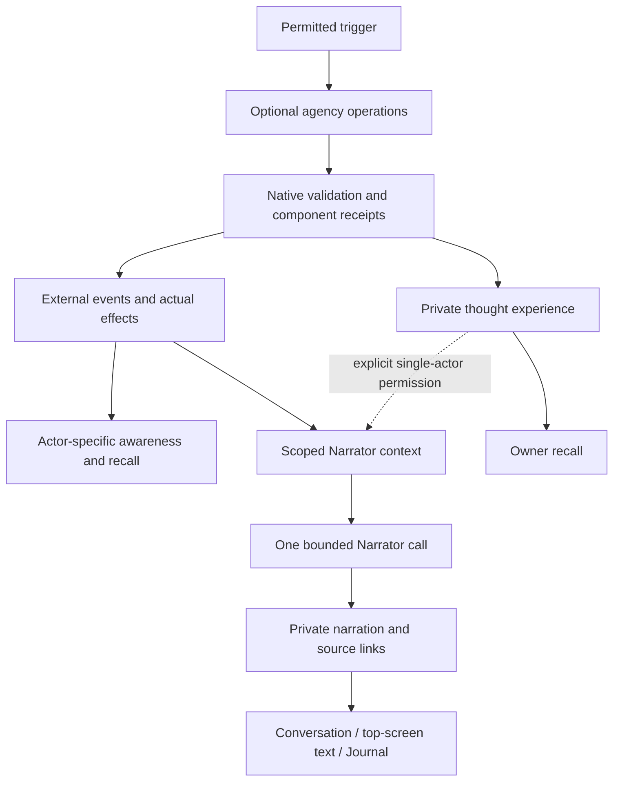

# Narration, agent responses and conversations

## Spatial evidence

[Spatial queries](../archive/07-technical-architecture/spatial-world-runtime.md) supply current sensory geometry and emission-time XYZ origins. The sensory projection still determines the actual audience; narration cannot infer hidden positions from technical geometry or camera changes. Cutaways, sprite interpolation and model animation are presentation, not new world occurrences or proof of an action’s result.

Conversation, source-history and narration storage must respect the [save/load design](save-and-load.md), including coherent timeline restoration and external-work fencing.

Current implementation and delivery limits are recorded in [Architecture](architecture.md#durable-conversations-and-private-history).

This specification owns accepted narration, speech delivery and conversation behavior. Delivery gates remain in the [sole NC tracker](maintainers/narration-and-conversations.md).

This document owns conversation lifecycle and Narrator contracts. [Agent agency](agent-agency.md) owns universal decision composition and operational goals/plans, with encoding and admission in its [runtime contract](../archive/07-technical-architecture/agent-agency-runtime.md). [Memory architecture](memory-architecture.md) owns recall/privacy/consolidation; the [production data model](../archive/07-technical-architecture/production-data-model.md) owns shared storage conventions; [declaration admission](../archive/07-technical-architecture/declarations-and-evolution.md) owns mechanical invention. Feature UX lives in [agents](narration-and-conversations.md#3-talk-act-and-think-response-contract), [world/player experience](../archive/03-design-proposals/world-and-player-experience.md#the-narrator-and-personal-story) and the [UI brief](ui-design-brief.md#future-narration-and-conversation-history).

Story-policy registration shares [module metadata](../archive/07-technical-architecture/world-module-runtime.md#3-definition-envelope-and-composition); NC retains communication/selection ownership. Future [mental/disclosure families](../archive/07-technical-architecture/world-module-runtime.md#shared-minds-fictional-memory-and-evidence-separation) need scoped appearance/disclosure projections; physical truth, altered perception and platform erasure remain distinct. This enables no telepathy, cutaways or private-thought disclosure.

## 1. Scope and current gap

Speech, expressions and private thoughts participate in the agency decision contract. Conversation identity, membership, audience history, self-talk, interruption and narration remain governed here. Known actions retain their actual effects. Missing mechanics use the separately gated INV/NC13 path; unsupported proposals never become invented success. Current response limits and delivered conversation/Narrator behavior are recorded in [Architecture](architecture.md#durable-conversations-and-private-history).

### Explicit triggers and readable context

Action relevance asks whether each candidate is a reasonable action for the actor to consider now given the trigger, current situation and goals. Keep uncertain plausible choices; this is a shortlist judgment, not selection or execution authority. Memory/context relevance retains its separate inclusion question.

The server derives triggers from committed events and the recipient's event-time awareness, never from the wording of a player's message. Each awareness row stores the stable event type, source, target, trigger kind and permitted content needed to preserve the trigger after the bounded recent-event feed rotates. Preserve source metadata through same-version restore; genuinely unavailable historical detail remains unavailable. Incompatible development formats are rejected under the save/load policy. Distinguish **addressed speech**, **overheard speech**, **an action directed at me**, **an observed event**, and **a change in my needs or current situation**. Preserve event handles and simulation times internally. For intelligible addressed speech write `Mike (player) said to me: "Hello" (Day 1, 08:00)`. State explicitly that I am being addressed. For overhearing state that the speaker addressed someone else or spoke nearby; hearing alone does not make me a participant. Use a name only when the awareness record recognizes the speaker; do not add uncertainty to a recognized identity. Unknown identity is independent of whether speech addresses me.

Present bounded English sections: **Me**, **Trigger**, **Task**, **Conversation so far**, **Current time**, **Recent memories**, optional **Actions**, **Nearby actors and objects**, **Inventory**, **Knowledge**, and **Response format**. Include the complete accepted inner world and current body/activity/goal. Put permitted IDs and mappings in a final **References** section, following the [identity contract](identity-and-references.md). Conversation context uses durable association and actor-permitted event-time awareness. Missing legacy association remains explicit; a later join never grants earlier speech. Preserve the newest 512 speech experiences per actor as a bounded verbatim retrieval pool. Store speech before scheduling its best-effort asynchronous embedding; provider failure cannot reject or delay the speech event. Include the complete available conversation through the current decision snapshot under the [canonical hard-query context policy](memory-architecture.md#4-jev-attention-before-context-inclusion), including committed replies after the original trigger. Conversation history bypasses optional relevance filtering. Required triggering evidence survives optional retrieval failure. Preserve uncertainty and acquisition labels in memories, without requiring spoken replies to recite those labels. Dialogue is natural in-character speech to its addressee, not a report about having heard speech.

The task permits the optional operations defined by [agency](agent-agency.md#2-a-decision-may-produce-nothing-one-thing-or-several-things), including no new response. Injury, resting and an empty action shortlist do not mean the character can only speak. Actual capability and urgency checks decide what can commit. An existing task may continue during speech or thought.

For speech triggers, ask Jev alongside route and reflection whether there is any plausible chance the actor may want to act or visibly react. Record that result as the semantic trigger's `checkActionSelection` property in routing diagnostics and the persisted job result. This is a preliminary context gate, not the action choice: only a confident `no` (at least 0.8 probability) closes it, while missing or uncertain judgment opens it. When closed, skip suggestion construction and omit the Actions section; open attempts and goal/plan operations remain available under ordinary admission. Context gating does not determine per-response optionality. When open, prepare bounded native-feasible candidates under the shared [level-1 selection and routing contract](../archive/07-technical-architecture/agent-agency-runtime.md#24-level-1-selection-without-generative-escalation). Generative responses may use a separate batched relevance filter to present useful options with exact handles; relevance filtering is not a prerequisite for every direct level-1 selection. Non-speech semantic decisions open the gate. A failure in this optional action-relevance request conservatively presents the fresh bounded candidates, so helper availability cannot silently remove agency. The shortlist is assistance, not an instruction to perform work or a preference against an unlisted action. A freeform proposal cannot grant new mechanics: resolve existing actions through AG05, or return an honest component outcome; missing definitions use INV/NC13.

When generation is needed, use one immediate generation for the composed response. If newer actor awareness reaches both the importance and urgency interruption thresholds, abort the active provider stage, rescan from the original attempt watermark, rebuild context with every qualifying event received before retry and retry at most once under distinct attempt identities. Ordinary world changes do not discard speech or thought, and later qualifying events cannot create another paid retry. Before commit, validate action-specific targets, range, possession, costs and plan prerequisites; an invalid action can fail independently while valid speech or thought survives. The agency runtime owns component receipts and private-experience admission; reuse existing stores without a per-candidate database query or foreign-key graph. The normalized story tables and indexes in section 7 remain prerequisites for durable multi-party narration, not for rendering this prompt. Same-version recovery and future production storage changes must preserve response identity and owner scope; no old-development-save migration is required.

## 2. Three kinds of truth

| Record             | What it means                                                                                               | Who can use it                                                                                                         |
| ------------------ | ----------------------------------------------------------------------------------------------------------- | ---------------------------------------------------------------------------------------------------------------------- |
| World event        | An accepted external occurrence: speech, expression, action stage/outcome, animal behavior or natural event | Actors receive only event-time awareness projections; authorized story modes may select retained notable unseen events |
| Private experience | An actor's intentionally authored in-character thought, or other legitimate personal memory                 | Its owner for recall; explicitly authorized inspection or single-actor narration                                       |
| Narration          | A player's prose rendering of permitted facts, linked to its sources                                        | That player; never automatically another actor's perception or memory                                                  |

Narration cannot cause injury, create items, reveal a hidden cause, or establish an emotion as objective truth. “Ada frowns” may be observed; “Ada secretly despises you” requires private access and is excluded from shared conversation narration. Embellishment changes rhythm, imagery and tone, not identities, outcomes, causal links or knowledge. Narrator output is not a new semantic trigger: only committed underlying occurrences can elicit another agent response.

## 3. Talk, act and think response contract

Universal decision composition and operational goal/plan behavior are defined in [Agent agency](agent-agency.md), with encoding, admission and execution in the [runtime contract](../archive/07-technical-architecture/agent-agency-runtime.md#2-decision-envelope-and-translation). Speech remains an external communicative act with the conversation, audience and narration rules in this document. Private thought remains owner-only experience. Multiple requests do not imply simultaneous or completed physical actions. A thought-only or empty decision must finish the response indicator without an empty speech bubble.

### Admission, ordering and memory

The [agency admission and receipts contract](../archive/07-technical-architecture/agent-agency-runtime.md#4-admission-ordering-and-physical-execution) owns independent rejection, cancellation, exactly-once experience, action-stage identity and recovery. Conversation generation and event-time speech audiences remain additional speech-specific bindings. Reflection presentation stays separate from recallable intentional thought; this section is a forwarding anchor, not a second response schema.

## 4. Expressive and mechanical actions

| Mode                             | Admission and result                                                                                                                                     |
| -------------------------------- | -------------------------------------------------------------------------------------------------------------------------------------------------------- |
| Known mechanical action          | Select a server-offered action/version and validated arguments. Execute trusted rules; record actual resource/stat/condition changes and outcomes.       |
| Expressive action, first slice   | Record a bounded observable gesture/reaction with actor/targets. No physical state, numerical relationship, injury, inventory or new definition effects. |
| Missing mechanical action, later | Submit an invention candidate through policy, budget, validation and activation; execute only after admission and fresh prerequisite checks.             |

The implemented expressions are nod, smile, frown, wave, shrug, shake_head and slap, rendered by trusted templates with no model-authored outcome clauses. A slap requires contact range and line of sight. Other unlisted proposals receive an unsupported-action receipt; generalized expression admission and mechanical invention remain pending. Expressive actions allow a frown or a slap as enacted fiction without pretending a damage mechanic exists. The event explicitly has `mechanical=false`; no `-1 Health` is displayed. It can still be witnessed, remembered and influence a later character decision. That cognitive consequence is distinct from directly changing a relationship score or bodily state. The presentation uses a subtle “Expression · no mechanical effects” affordance, outside the prose, when the distinction matters.

Freeform expression cannot become a bypass for known costs or consequential claims: “I transfer my gold,” “I kill Ada,” or “I teleport” cannot be admitted as completed physical outcomes. Native scope checks govern contact/reach and available participants; rejected or unresolved contact can be described as an attempt only when that attempt itself was accepted. Known actions use their authoritative route, not an expressive duplicate. The initial expression contract permits gestures/contact fiction but forbids unsupported result clauses such as injury, forced movement, possession transfer or another character's private feelings. Constrain output to an action description; strict validation plus grounded rendering remains necessary, with semantic overclaiming an explicit acceptance risk.

The later slap example might resolve an existing head injury under an admitted conditional rule and emit a health change plus bleeding condition. Only then may narration read:

> Ada slaps you. Your eye wound from yesterday starts bleeding.

Below it, smaller distinct text: **−1 Health**. “From yesterday” requires permitted evidence of that injury's age; “starts bleeding” requires a committed condition change; attribution to the slap requires a causal link. Without the mechanics, the first slice says only “Ada slaps you” and shows no impact. A generic head-injury predicate does not itself prove the injured part is an eye.

Voice speech carries audible linguistic content and conversation semantics. Other sounds need not create conversations; [sensory evidence](../archive/07-technical-architecture/perception-and-attention.md) and [EPR scope/intake](events-perception-and-reactions.md) own their projection. Private thoughts and invention results do not enter the external event feed by default.

## 5. External world events and awareness

Use the existing proposed `journal.world_events` as the single logical master table of external event categories. Every external occurrence passes through the same emission/retention policy: people and animals acting, speech, trees falling, weather and other natural events. This is a semantic event catalogue, not a promise to log every component tick forever. Only speech/action occurrences admitted as real or explicitly expressive enter it; private thoughts and narrator prose do not.

Retain an experiential row when at least one actor perceived it **or** its trusted importance score meets a configured notable-event threshold. Store score, reasons and scoring-policy version at commit time. Native event families supply bounded deterministic scoring initially; a model cannot mark its own unsupported claim important to gain persistence or disclosure. Exact weights/thresholds are tuning settings, not hard-coded plot events. Zero-witness, non-notable experiential rows are discarded after audience/importance determination; authoritative state, spending, recovery receipts and required causal evidence still persist independently.

Store urgency separately from importance. Importance describes lasting significance and retention eligibility; urgency describes whether newly perceived evidence is time-sensitive enough to supersede an in-flight immediate response. A high-importance, low-urgency event can shape later attention or reflection without interrupting current speech. A response refresh requires that the recipient's new awareness meet both configured thresholds, currently 8/10 for importance and 8/10 for urgency, and may happen only once for that response. Urgency does not widen an event's audience, reveal an unseen event, or make it notable for retention.

`mind.event_awareness` remains the one actor/event join: modality, permitted detail, recognized identities, attribution, observation time, importance and urgency. Self-awareness records the actor's accepted speech/action. Hearing is independent of participation. No audience is reconstructed from current positions or a conversation's current member list. Partial hearing cannot expose full quotes; unknown causes stay unknown. Retained notable unseen events have zero awareness rows until a separate later discovery/testimony event creates new knowledge.

Notability is retention eligibility, not disclosure permission. An optional dramatic world-narration mode can expose a policy-approved distant event (“Far away, a demon awakens”) privately to a human player. Label it as a story cutaway, keep it out of actor recall and shared conversation, and do not expose hidden names/locations beyond the approved teaser. Ordinary actor-perspective narration cannot use it. Cross-player fairness and spoiler policy must be chosen before enabling cutaways in a shared world.

## 6. Durable conversation lifecycle

Conversations are in-world interaction identities, independent of provider sessions, World Agent/workshop tabs or Narrator jobs. Opening a Talk panel alone does not fabricate speech. First committed directed speech creates a conversation with the speaker and eligible addressed actor(s); self-talk creates a one-person conversation. A subsequent bystander joins by committing speech into that conversation, not by opening UI, listening, gesturing or thinking. NPCs have native join/leave intents rather than needing UI tabs. A directed invitation alone does not silently merge a second existing conversation; accepted cross-conversation engagement does.

Store participant intervals, not a single lifetime membership set. Departure closes that interval, others may continue, and a later return opens a new interval. The conversation ends when no active participants remain. Closing one's conversation is an explicit leave; merely hiding/minimizing its panel is not. Death, unavailable participants and departure beyond the supported communication channel need native closure rules. Proposed disconnect behavior: retain membership through a bounded real-time reconnect grace, then leave; NPC departure uses a configured simulation-time inactivity/proximity policy. These timings are implementation tuning, not permission to leave immortal conversations. Paused worlds do not accumulate simulated inactivity.

Every committed speech event has exactly one non-null `conversation_id`. An action/expression event may have one when it occurs as part of that exchange. Ambient/global events remain unbound even when relevant to several conversations. Intent bindings and current context determine association, not text similarity or whichever tab happens to be visible. The first slice permits one active conversation per actor; listening to several is allowed. Channel-specific simultaneous participation is a later extension.

Person-scoped Talk history renders response-linked accepted actions and expressions in their saved order between speech messages. These entries come from the same authorized event/audience history as speech rather than transient client state. Private thoughts never enter this projection.

### Joining, leaving and awareness

A conversation can grow from two participants to five and finish with two entirely different participants. Membership gives future routing context, not earlier knowledge. A late joiner's transcript includes earlier speech only if their event-time awareness permits it (for example, they were already within earshot). Hearing does not grant access to anyone else's private narration. Silent recipients may be founding members; after creation, speaking and the explicit merge rule below are the routes for joining. Leaving membership does not erase already witnessed evidence.

### Merging conversations

When an actor from A first commits speech engaging active conversation B, B is the destination. In one serialized transaction, lock both conversation identities in stable order, revalidate their generations and participants, end A with reason `merged`, set `merged_into=B`, close A's active intervals and open/deduplicate those members in B. Associate the bridging speech with B. Store a deterministic player-private terminal narration, “Joined conversation #123”, for eligible viewers of A, linking the merge transition and destination. This lifecycle notice requires no model call and is distinct from observable speech.

All currently participating members of A move, including silent participants; this is the explicit exception to speech-based joining. Former members do not move. Earlier speech/actions/narrations retain A's ID; do not relabel history or union its audience into B. The first accepted engagement wins a simultaneous A→B/B→A race; stale requests re-resolve to the surviving conversation or are rejected. Redirects must be acyclic and bounded. Duplicate merge commands return the original receipt. Existing pending replies must validate the new generation and audience before committing, rather than landing in a closed thread.

## 7. Proposed persistence and indexes

Reuse existing planned `mind.conversations` and event-awareness families rather than create competing stores. Names below describe target storage, not a claim that these exact tables are deployed. All references include world scope; `EventRef` includes the journal partition key under the production model. Keep composite foreign keys or explicit retention tombstones consistent with that model.

| Record                            | Essential fields and invariant                                                                                                                                                                                                                          |
| --------------------------------- | ------------------------------------------------------------------------------------------------------------------------------------------------------------------------------------------------------------------------------------------------------- |
| `mind.conversations`              | World/id, modality, lifecycle/generation, started/ended simulation and recorded times, end reason, optional `merged_into`, timeline sequence head                                                                                                       |
| `mind.conversation_participants`  | World/conversation/actor/interval ID, joined/left boundary, role, reason and source transition; one active interval per actor in the initial slice                                                                                                      |
| `mind.conversation_transitions`   | Immutable start/join/leave/merge receipt, source/destination IDs, actor set, authoritative ordering and idempotency key; lifecycle bookkeeping, not invented perceptible world events                                                                   |
| `journal.world_events` additions  | Optional conversation FK (required for speech), response/component/action execution links, mechanical/expressive kind, separate bounded importance and urgency scores, scoring reason/policy, causal parent refs                                        |
| `mind.conversation_turns`         | Existing planned speech EventRef projection plus stable conversation order; no independently writable speech text                                                                                                                                       |
| `mind.conversation_audiences`     | View of speech event awareness, not another authority or membership-derived ACL                                                                                                                                                                         |
| `mind.memory_entries` additions   | `self_thought` acquisition and unique response/component source for private accepted thoughts; entity links use `mind.memory_entities`                                                                                                                  |
| `story.narrations`                | World/id, authenticated owner player, perspective actor(s), mode, nullable conversation, text, status/revision, voice/template versions, input digest, trigger/dedup key, job receipt, display anchor/order, covered simulation range, created UTC time |
| `story.narration_world_events`    | World/narration/EventRef, source role and permitted-source revision; many-to-many and unique per source binding                                                                                                                                         |
| `story.narration_entities`        | World/narration/entity/role for participants, targets and place; pointers never grant visibility                                                                                                                                                        |
| `story.narration_actions`         | World/narration/committed action receipt or process reference; never references a model proposal as a completed deed                                                                                                                                    |
| `story.narration_transitions`     | World/narration/conversation-transition reference, including merge notices with no external event source                                                                                                                                                |
| `story.narration_private_sources` | Optional actor-scoped memory/accepted-text revision refs, only for explicitly permitted single-actor mode; inaccessible to public provenance routes                                                                                                     |
| `story.narration_impacts`         | Narration/effect receipt/affected entity/stat or condition, actual delta/unit and event source; derived display records, never applied effects                                                                                                          |
| Player preference extension       | Narrator voice/version and presentation/cutaway preferences on the existing player profile, scoped by authenticated owner                                                                                                                               |

Index world events by conversation and authoritative event order; participants by active actor and conversation interval; narration by `(world, owner_player, conversation, display_order, id)` and `(world, owner_player, mode, created_at, id)`. Index source joins in both directions for audit/correction and deduplicate response components, effect receipts and narration trigger keys. Use typed joins for source kinds instead of an unchecked polymorphic `object_id` blob. The server sets player ownership; neither prompts nor client-supplied IDs confer access.

Accepted world effects/events/awareness and a narration delivery trigger commit together through the existing outbox pattern. Generating prose happens afterward. Publishing text, source links, impact projections and its completed receipt is atomic. Every normal narrative must have at least one authorized event source; a lifecycle notice instead has a transition source. A source may support many narrations and a narration may summarize many sources. Pin compact authorized source capsules/tombstones when raw event retention expires; expose unavailable/redacted source status, and invalidate derived text if its disclosure is revoked. Narration must not keep otherwise forbidden raw evidence secretly accessible.

## 8. The Narrator and context assembly

Runtime wakeups, causal-batch deadlines and durable-job recovery follow the [performance scheduling contract](performance.md#narrator). This specification retains ownership of which evidence merits narration and what may be disclosed.

The Narrator is a presentation role executed as one bounded LLM call, not an autonomous world controller or a persistent omniscient conversation. No action tools or reflection workspace are required. Reuse provider execution, durable spending, cancellation and receipts. Reuse actor-scoped source selection, sentence projection and vector retrieval behind a parameterized context builder; do not copy the entire NPC context and merely remove an action field.

Proposed server-only request: authenticated owner, world, mode (`conversation`, `world`, `single_actor`, optional `cutaway`), perspective actor IDs, optional conversation ID, trigger EventRefs/transition, source boundary, type/time filters, relevance query, voice version, context/output budgets and explicit private-source grant. These are bindings; model-facing context stays compact permitted prose with local source handles.

Selection order:

1. Resolve viewer authorization and perspective from the server; bind a consistent source boundary and effective permissions. A set of perspective actors does not grant a human the union of their private knowledge.
2. Load mandatory trigger events and committed consequences, using recipient-permitted awareness text. For conversation mode, include scoped participant speech plus relevant aware external events. Ordinary shared-group prose can use the intersection of participants' permitted facts; player-private variants may use that player's own actor awareness. Never use the unredacted union. Explicit authorized ensemble/creator modes may combine perspectives with clear attribution, and must not be sent to ordinary participants.
3. Retrieve optional recent/related evidence with actor/purpose/type filters before semantic/vector ranking. Reuse the attention/relevance service where useful, with finite budgets and mandatory causal sources surviving optional search failure. The Narrator itself needs one generation call; retrieval may reuse admitted embeddings/Jev and its costs must be counted separately.
4. Include private thoughts only with a specific single-actor grant and a permitted recipient. Ordinary conversation always excludes them. Include notable unseen events only in the separately admitted cutaway mode, never because an event scored highly in retrieval.
5. Render source facts, observed uncertainty, causally supported order and supplied impacts separately from trusted voice/style instructions. Do not automatically include an NPC's complete About me, all conversation history or other actors' inner worlds. Record omissions and input/source revisions outside the prose prompt.

Proposed response: bounded `sentences`, each containing `text` and local `source_handles`. The server resolves handles, checks their admitted subset and assembles prose. The model does not choose ownership, conversation association, effects or stat deltas. Sentence grounding does not prove entailment: fixtures validate shape/scope; held-out/live review must assess invented causal claims and style drift. A rejected or unavailable generation falls back to deterministic permitted event descriptions, without buying a repair call.

Voice is a player setting (for example restrained, lyrical or wry), implemented as bounded versioned style choices. It never changes source scope, action outcomes or other players' text. Store the voice version on each narration; changing it affects future entries and does not silently regenerate history or spend money. Freeform custom voices, if later added, remain untrusted style input.

## 9. Triggers, ordering and transcript reconstruction

Conversation and standalone prose both require a decision from the active world story-selection mechanism. Ordinary encounters, named entities, movement, routine actions, event retention importance, urgency and semantic cognition triggers do not independently qualify. Conversation lifecycle notices remain deterministic and separate. See [replaceable story selection](#replaceable-story-selection).

For a meteor, commit one global event with no conversation ID. Find affected active conversations through event-time awareness, not a scan that treats every participant as omniscient. Enqueue separate private narration variants for eligible players in those conversations; every row links to the same EventRef. A player who only heard a crash gets that account, not a secretly known meteor identity. The transcript needs the stored scoped narration and impacts, not a raw meteor payload query.

Allocate a stable timeline anchor when narration is scheduled. Use simulation time plus authoritative sequence and component ordinal, with a stable ID tie-breaker; wall-clock timestamp alone is insufficient when several events occur in one tick or the world is paused. Store generation time separately. Anchor a combined narrative after its latest covered event, and retain per-conversation timeline ordering. In the initial single-writer implementation a saved world event sequence plus per-conversation item order is sufficient; multiple writers require an explicit conversation ordering authority before rollout.

Transcript query: select events with this conversation ID and the viewer's permitted awareness; select narrations with this conversation ID and owner player; merge into the stable display order and paginate at a fixed watermark. Speech renders as speech; action events normally render through their linked narration or deterministic fallback, not twice. Suppression depends on covered source IDs for that viewer, never text matching. Return item type/ID, speaker if applicable, scoped content, time/order and supported impact metadata. Never include private thoughts or inaccessible provenance.

Narration pending slots may resolve in place without moving speech or stealing scroll/focus. A transcript version/new-entry marker makes late insertion visible. Closing membership stops future conversational delivery, but an already authorized historical narration may finish at its original anchor if the player still has read permission. New events after departure cannot be pulled into it. A merged thread keeps its terminal notice after all its pre-merge anchors. On outages, surface fallback prose and record failure; no automatic paid retry, restart dispatch or hidden regeneration. A later explicit regeneration creates a revision of the same logical entry and cannot reapply impacts.

## 10. Presentation and privacy

Conversation narration is distinct prose between speech bubbles, with no fake speaker. Private thoughts do not appear there, including when the agent selected all three response components. Put actual impacts underneath in smaller, readable, visually distinct text; derive sign, quantity and unit from committed receipts. A narration of an effect is never a second stat mutation. Multiple causes and delayed effects keep causal references and timestamps; only explicitly narrated changes appear as impacts, not all unrelated stat drift during the call.

Standalone world narration appears across the top of the screen with book-like typography and a restrained entrance; it remains privately accessible in the Journal with other eligible events. Respect UI scale, contrast, reduced motion, keyboard dismissal and accessible live-region announcements. Do not block controls, force camera movement or interrupt reading. Use one logical narration when the same player sees it in both Journal and conversation; rendering it twice is not duplicate generation or duplicate memory. Coalesce simultaneous toasts and preserve a discoverable unread entry.

Existing overhead “Hmm” concepts should become optional short presentations of an accepted speech/expression. They may fade visually but their underlying accepted occurrence remains remembered under normal retention. Loading dots remain technical status with no event or memory. This replaces the earlier proposal that a real contextual character reaction could be observable yet never remembered.

Player narration privacy applies to API reads, streams, indexes, backups/exports and provenance inspection. An administrator's separately granted inspection does not become NPC or ordinary-player knowledge. Explicit single-actor inner-thought narration is a special permissioned mode; targeting another NPC or changing voice does not enable it. A cutaway is audience knowledge, not character knowledge, unless a later legitimate experience establishes it.

## 11. Delivery boundaries and deferred invention

Use existing module responsibilities: domain validates response components, expressive events, mechanical rules and conversation transitions; server assembles awareness, persists projections, schedules/narrates, authorizes queries and owns spending; AI executes generic typed requests; protocol carries scoped intentions/results; React renders transcript/narration/impact UI. PostgreSQL owns durable normalized story records. Keep the current repository adapter boundary and an explicit SQLite capability/current-format policy; do not pretend a snapshot-only adapter supports these tables.

Preserve known speech, event-time audiences, source order and separately scoped reflection presentation through same-version capture/restore. Missing associations remain explicit gaps; never infer participants, private thoughts or unseen speech. Verify atomic restoration, rollback and current revocation/forgetting without model dispatch or lost accounting. Reject incompatible development saves under the active policy rather than adding legacy import/backfill paths.

Later on-the-spot invention reuses compatible admitted definitions before generating a missing action/effect candidate. Carry actor/player origin, independent invention locks, world profile, learned capability policy, spending cap, definition versions and provenance through the normal declaration workflow. A generated “−1 health if a head injury exists” is data for supported predicates/effects; it cannot install arbitrary code, invent an unsupported body system or create new stats outside the existing god-mode rule. If admission is unavailable/forbidden/unsupported, retain an honest expressive outcome where allowed; do not claim physical success.

New mechanics take effect only after explicit activation and rechecking the current target, injury, resources and range. Never retrospectively damage someone for an old expressive slap when a rule later becomes available. The Narrator describes final committed outcomes and cannot perform invention or decide damage itself. Conditional action/effect invention remains deferred to the [declaration design](../archive/07-technical-architecture/declarations-and-evolution.md) and [invention tracker](maintainers/inventions-and-world-evolution.md).

## 12. Acceptance and open tuning choices

AG11 owns the broader operation/goal/plan matrix. NC fixtures must cover speech/expression/thought integration and no response under that contract; first-person memory and target attribution; all supported trigger classes; thought privacy; rejected/partial/stale responses; action starts versus completion; known effects versus expressive zero-effects; restart/idempotency; pause/cancellation; two-to-five-to-two membership; self-talk; late join versus overhearing; merge races; one meteor with several scoped narrations; retention of notable unseen events without awareness; denied cutaway/private modes; source correction/expiry; ordering, pagination and delayed prose; no double rendering/damage; narrator failure and zero budget; settings and accessibility. Use synthetic fixtures with no external requests.

Held-out, separately authorized capped live checks assess whether a silent frown fits context, memories influence later behavior, narration grounds each claim, unseen/private details stay hidden, voices remain distinct without inventing effects, and latency/cost remain acceptable. Record actual provider receipts separately from fixture evidence. Keep optional observability vendor choice out of this feature; existing diagnostics can link trigger, scoped context, component admissions, generation and publication.

Before implementation, tune finite response/text limits, event-importance weights/thresholds, narrator batching window, disconnect/inactivity grace, historical story retention and initial voice choices. First slice defaults: one optional component of each kind, one active conversation per actor, actor-scoped private prose, cutaways disabled until disclosure policy is configured, and no new mechanical invention. Exact values belong to admitted configuration with documented acceptance evidence.

## 13. Implementation tracker

Delivery state, dependencies and exit criteria live in the [Narration and conversations implementation tracker](maintainers/narration-and-conversations.md).

## Explicit failed-response retry

A failed chat response offers an icon labeled Retry beside its failure status. Retry keeps the original player bubble and speech event; it creates a new paid workflow with a new request ID linked through `retryOf` and the original speech event ID. The server retrieves text and recipient from the saved request, validates the local player's ownership and permits only the latest failed attempt without accepted effects. Duplicate submissions of the same retry ID return its existing status. A second retry of an already superseded failure is rejected. Response generation uses current permitted context; original speech is not emitted again. Pending UI replaces the failure indicator, and completion/failure updates the same bubble. All attempts and accounting remain retained. Uncertain provider charges keep their reservations but do not block an explicit retry of a terminal failed workflow. Active workflows remain protected by serialized admission; a currently sleeping, incapacitated or dead recipient is rejected before dispatch. This operation does not retry invention or world-agent requests.

## Replaceable story selection

The proposed [EPR consumer contract](events-perception-and-reactions.md#10-transactions-subscriptions-and-secondary-consumers) may supply scoped candidate notifications, but the existing story selector remains the sole Narrator admission policy. Generic cognition importance, ordinary encounters and private internal stimuli do not automatically create story jobs. Existing durable story jobs remain the queue.

Story selection follows committed occurrence → audience/perspective filtering → pure trusted evaluator → candidate admission, grouping and frequency → durable job → grounded prose or eligible fallback. Story importance grants no awareness, cognition trigger, memory-retention change or physical effect. The Narrator does not decide whether raw events deserve generation.

A world pins one mechanism ID, version and trusted evaluator with validated numeric field declarations, introduction settings, finite event rules and delivery settings. Missing fields resolve to declared defaults. The default `story_importance` namespace declares actor/object importance from 0 to 10, default zero, and introduction threshold 7. Its event rules are empty. A declared field never gains executable meaning unless a trusted evaluator consumes it. Disabled or unavailable evaluators are silent; unknown or invalid configuration is rejected visibly at admission. Supported places must acquire real entity and exposure evidence before place rules are admitted.

A qualifying introduction requires the viewer's own perceived encounter, sufficient permitted text and a designated target meeting the threshold. Stable `encounter:<entity-id>` milestones deduplicate privately across policy/version replacement, reentry, reconnect and restart. Other consequential events require explicit rules over supported committed types, roles and structured facts; an ordinary entity may qualify through such a rule. Routine activity involving a designated entity remains silent. Neither names nor arbitrary prose imply a consequential mechanic.

Selection returns silence or bounded candidate significance, reason, evidence IDs, a semantic milestone and grouping identity. The server supplies only relevant entities and permitted source evidence. Evaluation performs no I/O, mutation or provider call. Configuration and field edits use one validating mutation that increments a saved policy revision; edits affect future selection and invalidate pending work without rewriting published history.

Delivery defaults are eight mandatory sources per passage, 300 game seconds between admissions and 600 game seconds maximum waiting age. Related events share an explicit response or body-effect identity; unrelated same-tick events do not automatically merge. Competing candidates are ranked by significance, then stable event order. A viewer has at most one queued/running passage; candidates blocked by cooldown or capacity are dropped, without consuming introduction milestones. There is no critical-event bypass or secondary candidate queue. This simulation-time policy is separate from the short wall-time generation batching delay. Milestones, frequency state and jobs commit atomically with source projection.

Jobs record selecting mechanism, version, policy revision and configuration digest. Dispatch rechecks selection, age and source authorization; revoked work cancels silently. Configuration changes cancel pending work conservatively. Already dispatched paid work is never resent automatically, and its accounting/receipts survive cancellation. Fallback may only publish for admitted candidates. Pending raw evidence stays out of the top-screen surface.

Top-screen delivery uses an indexed owner-scoped projection of completed eligible standalone passages. The first client snapshot establishes history rather than replaying a banner; new passages support dismissal. Conversation notices and conversational actions do not enter that projection. Initialize zero-default configuration with ordinary entities unmarked. Current-format recovery cancels pending work whose selection authority is missing and preserves scoped retained history; it cannot regenerate historical stories, dispatch providers or reset awareness, memories or accounting. Incompatible development formats are rejected; earlier conversion behavior is documented only in Architecture.

## Speech intent and audience

Speech intent and delivery are separate. A committed utterance retains its intended recipient in event metadata even when native admission falls back to speaking aloud because the recipient cannot receive directed speech. The event audience records actual memory-capable listeners; an absent intended recipient is never added to that audience or enrolled in a conversation. The existing target field continues to represent admitted directed engagement. Invalid/deleted recipients remain explicit failures rather than invented identities.

Actor awareness captures intended-recipient identity only for the speaker, the recipient when hearing it, or an observer who can see both participants at event time. Other listeners receive the utterance with unknown recipient identity. These event-time facts persist; loading a save must not infer hidden recipients from current positions or refill deliberately absent attribution. Earlier events missing speech intent cannot be reconstructed reliably and remain unknown. Cognition presentation follows the [memory context specification](memory-architecture.md#named-and-generic-memory-subjects).
