# Open Legend implementation screenshots

**Reviewed October 7, 2026.** These 72 original capture records (71 distinct image hashes) show the whole-interface implementation candidate and observed defects that prompted corrections. They are separate from the [98 external game screenshots](../screenshots/gallery.md) and [nine design proposals](../wireframes/README.md). Each image retains its captured bytes; [the manifest](manifest.json) records dimensions, hashes and capture-specific source identities. This gallery explains the visible decisions; the [verification report](../../verification/game-interaction-redesign.md#whole-interface-runtime) owns actual results, earlier failures and remaining acceptance.

## How to read the images

Images 01–09 render the production App and PlayCanvas scene after main merge `164e43` and picker correction `ba33c1c`, including the subsequent conditional shortcut-overlay rule. They use current native public views with controlled access, HTTP history, inventory-page transport and an empty action catalogue. They are actual implemented UI, not drawings; the transport is not authenticated PostgreSQL gameplay.

Images 10–17 and 19 show production components in their focused implementation checks before the final main merge. The empty background and any small test-navigation buttons belong to that isolated check, not the game's navigation. These captures illustrate their inspected composition and failure states, not the final whole-App placement. Image 18 uses the current merged native projection in the actual activity component. Dummy names, tokens, dialogue and reviews are controlled example data; no provider or account operation was performed.

Images 20–23 show the October 6 narrow-layout corrections. Images 20, 21 and 23 use the actual App/PlayCanvas with controlled native public views and HTTP transport; image 22 uses the actual creator components in a bounded Panel host. Their exact source hashes are separate from the older captures. Image 23 includes the keyboard-outline correction at `296ae67`. The creator question image predates the later local choice-strip focus correction and retains that source identity; it is not relabeled as a final full-App capture.

Images 24–27 show one actual App/PlayCanvas, native server and PostgreSQL session with local development sign-in. After the player entered, fixture preparation supplied a full woven bag and placed two existing characters nearby. One died through the existing native death transition and retained a permitted and a restricted bag; the other remained alive. The six original UI commands were Drop, the refused six-stone move, take/put exactly three branches, and take/put one bone fragment. Each has a resolved native receipt. Separate permitted reads check capacity and custody integrity, private/living inventory refusal and out-of-reach refusal; fixture relocation does not establish walking or arrival.

The [native interaction record](../../verification/game-interaction-redesign.md#native-inventory-and-focus-fixture-continuation) distinguishes these outcomes from the earlier controlled captures. The branch revision is `d8f0b4`; the [CI job](https://github.com/Macrofold/OpenLegend/actions/runs/37433166390/job/112168569322) checked out merge `3731b364a82d89818d66380437d2c1c4c69d970a` on `main` at `0a3ab79b7a698a7f1941dc23722f89220d1ba425`. The manifest retains artifact `11398327568`, its archive hash, the native report hash and exact source/built-asset hashes. These four captures do not establish that the entire browser job or all interface journeys passed.

Images 28–31 come from the next native App/server/PostgreSQL continuation at branch `d1315ea`, actual CI checkout `1f3faa833208b532cf99a15ca7b22939e1d0e77f` against the same main commit. Both installed alternate worlds use their existing native source, residents and possessions at seed 73 without fixture edits. Start, partial recharge, Stop and reopening each same database pass. Images 29 and 31 intentionally preserve the redundant active-task preparation that the visual review found; they are not illustrations of the later correction. The [native result](../../verification/game-interaction-redesign.md#native-alternate-world-continuation-and-remaining-gates) and manifest retain the exact source, build and artifact identities.

Images 32–33 show the corrected task component from commit `8903595612ca60dc08b4c97dcb48c67dad7e8221`, cropped to the actual Panel in a focused host. They use native in-memory task discovery, preview, execution and status with a controlled partial view and command delivery. They do not contain the production App, PlayCanvas scene, authenticated HTTP session or PostgreSQL persistence. The manifest identifies task source `406b2efc…`, domain source `47939664…`, the passing report and the exact scenario sources. The two earlier failed attempts remain recorded separately: an amount-field selector failed before Start, then an invalid second enqueue was correctly refused before the fixture used deliberate replacement. These two images do not replace or relabel the native defects preserved in 29 and 31.

Images 34–37 retain the four original creator captures from the same branch revision `8903595`, native CI checkout `45db87d7cef957cdabe8fe02c43162c4eac3c503`. The actual App/server/PostgreSQL session uses a supplied compatible recipe and passes Preview, Save revision 2, rejection, approval and recovery of one original committed Apply. The native record establishes one learned recipe and unchanged carried items; installing a technique does not craft an item. These screenshots also preserve the repeated explanation and narrow heading-scroll defects found during visual review. The [native creator record](../../verification/game-interaction-redesign.md#native-creator-recovery-and-current-required-checks) records the successful stage separately from the failed whole workflow.

Images 38–41 show the subsequent creator presentation correction, now committed at `db6b65b`, in the actual review and shared preparation components. They use exact saved native review values from that earlier trace with controlled delivery; two identical controlled Apply requests exercise original-result presentation without installing another recipe. The component source hashes are `24bfadbb…`, `b929d234…` and `be2787b2…`. The 320×568 image uses 130% **body typography** tokens (18.2px text and 26px line height), rather than whole-interface scaling or browser zoom. The large background label belongs to the isolated host. The manifest retains the passed component report, native-record provenance and exact scenario sources; it does not treat these images as full-App or native acceptance.

Images 42–43 show the shared item/person/environment creation recovery from commit `2d535b50290a21d1b55c44115bbc28632d39b634` in the actual recovery and creation components. They use the recorded native item/spawn/trait catalogue from the earlier creator trace, with explicitly controlled storage failures, transport outcomes and owner lifetimes. The passing seven-second observation makes nine controlled deliveries across four bounded groups; it runs no native world and creates no actual item, person or object. The five source hashes, original catalogue provenance and exact result are retained in the manifest. These images do not replace the separate native creation or whole-App acceptance.

Image 44 comes from the native owner continuation at branch `6ede5f0`, actual CI checkout `b0288cd65c209100b62a4f39e9c19a65f4613ea2`. The actual App/server/PostgreSQL session reads an installed definition and relation, creates a named checkpoint and saves one deliberate person-name change. The image shows the dirty editor; the recorded confirmation interaction is separate evidence. The later checkpoint load encounters a native storage failure, and the following creation stage never runs. The [native result](../../verification/game-interaction-redesign.md#latest-native-continuation-at-6ede5f0) and manifest retain artifact `11405158827`, its archive hash, exact source/build identities and the failed cleanup result.

Images 45–48 show the completed native camp journey at branch `0e25bc5`, actual CI checkout `9689866a827609da9103433283890c8c76b5ce6e`. The actual App/server/PostgreSQL session uses ordinary player mode and a camp fixture prepared after entry. Ten player commands and their original receipts pass through taking supplies, equipping, gathering, fueling, cooking, offering food and returning leftovers. Two recipient decisions are supplied through the NPC's native options; no model or human supplies a live reply. Conversation retains its recipient and draft through the unconfigured setup route without sending speech. The [CI job](https://github.com/Macrofold/OpenLegend/actions/runs/37454635793/job/112239117499) and manifest retain artifact `11408962541`, the exact source/build identity and the four unchanged captures. This camp stage passes; the later care stage and combined invocation still fail separately.

The screenshots establish what was visible in those states. Keyboard operation, retained drafts, request identity and native work behavior require the linked interaction evidence. Real operating-system IME, assistive devices, broader displays and uncoached player observation remain open.

Images 49–55 come from branch `847bba8`, actual CI checkout `a117730be83e6314e388e0a0f43565b6173c4077`. The first four show a passing ordinary-player object/care/crafting session: deliberate approach, an original transfer result recovered after reload, longer-care progress/replacement/Stop and an actual crafted/equipped Sling. The last three show a passing native item/person/environment recovery session in God mode. Those three pixels show the **unconfirmed original request before Retry**, even though the original artifact filenames contain “recovered”; subsequent native/interaction assertions establish the successful exact retries. Both stages use actual App/server/PostgreSQL with zero provider calls. The [CI job](https://github.com/Macrofold/OpenLegend/actions/runs/37457945393/job/112250061692), [native evidence](../../verification/game-interaction-redesign.md#native-carecrafting-and-creation-recovery-at-847bba8--october-6-2026) and manifest retain artifact `11410463281`, original images and exact source/build identities. The separate owner return and Time checks still fail, so this is not a whole-workflow pass.

Images 56–57 retain the two original captures from the passing native owner continuation at branch `a4e02cc`, actual CI checkout `46f82ead6e31c055b18d10a72a397b6b1dde7785`. The seven observations and four deliberate UI writes connect installed-definition reading, dirty-name editing, two protected loads, Operations/Maintenance/catalogue reading and the real Return link. The first image shows the unsaved Identity draft; its close-confirmation interaction is separately recorded. The second shows the named **Before last load** confirmation before the second load commits. Neither image depicts the later Operations or returned character. The [native evidence](../../verification/game-interaction-redesign.md#native-owner-return-at-a4e02cc--october-6-2026), [CI job](https://github.com/Macrofold/OpenLegend/actions/runs/37460819991/job/112259640282) and manifest retain all native outcomes, exact source/build identities and artifact `11411348995`. This owner invocation passes with clean saving; the original God editor and Time browser gates still fail separately.

Image 59 preserves the earlier narrow Inventory hierarchy at `3bbfc7b`. Images 60–62 show the compact-header correction at `32cd1af`; they precede the two controlled refusal/unknown-result deliveries. Images 63–64 show the passing finite Activity focus/task-switch observation on that same source. These five current images use the actual App and recorded native data with controlled transport, not a new native server session. Their captions distinguish visible layout from later interaction assertions. Records 44 and 56 came from separate native captures but have identical original bytes; both source records are retained and count once among the 71 distinct hashes.

Images 69–72 preserve two native observations at branch `0f449430`, actual CI merge `ee04c033c34c0525ad1e6f86b176683b04b33ddd`. Care reaches its chosen stopping time and does not restart; its completed screenshot exposes stale heading/time wording. The two-account inventory contest and subsequent access checks complete, but its third screenshot times out and the observation remains failed. The later privacy result is recorded in the report, not shown in these two inventory pictures. Their source, report and artifact identities remain separate in the manifest.

## Playing and choosing an action

### 01 — World and character first

**1440×1000, App.** The upper-left summary answers who is being controlled, where they are and which conditions matter. Simulation time, camera controls and the two action groups have distinct places. Task launchers leave the world visible. This is the current base-world content; the labels and meters are supplied by that world. A screenshot cannot establish discovery by a new player, and the scene's current art/lighting is not a new visual-quality claim.

### 02 — Choose the subject in the world

**1440×1000, App.** Choosing an action's subject temporarily clears the task panels so the player can point at the object. In view provides a readable, keyboard-accessible alternative. Selecting prepares the exact subject; it does not execute. Cancel restores the previous task and words. This applies the research principle that spatial selection needs the spatial scene, rather than another large selection worksheet.

### 03 — Optional words, explicit commitment

**1440×1000, App.** Routine actions already live with their object, item or capability. The optional intention task exposes the player's words and the exact subject without a target/item/tool/recipient/amount worksheet. The primary action and Cancel remain reachable beneath the scrolling field area. The final letter in the example was entered while checking that typing P does not pause the world; the displayed response configuration belongs to the controlled check.

## Belongings and work

### 04 — An item's menu belongs above its inventory

**1440×1000, App.** The inventory starts from belongings and a storage object opened in the world. Here no external object is open, so the second pane explains that next step. A secondary click or Shift+F10 opens the exact carried item's context; Close and Escape return focus to that item. The empty action result is deliberately controlled to test menu ownership and focus, not evidence that the real stone has no actions. The earlier hidden-menu defect was corrected in the shared overlay owner.

### 05 — Stable shortcuts have a local editor

**1440×1000, App.** Shortcut assignment is a small task attached to its numbered slot. Its searchable catalogue stays above an expanded workspace and returns focus on close. Ordinary suggestions and the player's three retained assignments remain distinct. This image exercises the overlay correction; it does not show native execution of an assigned action.

### 18 — Work can exist while action is unavailable

**470×311, native projection and component.** An incapacitated character still has waiting work. The UI shows the work, the material/time facts and the native reason Stop all work is unavailable. The cancellation consequence is explicit: paused work is discarded, completed effects remain. Actual native admission and body effects supplied this projection; pointer attempts emitted no commands. This bounded result does not qualify the complete authenticated camp journey.

### 24 — Opened storage stays beside belongings

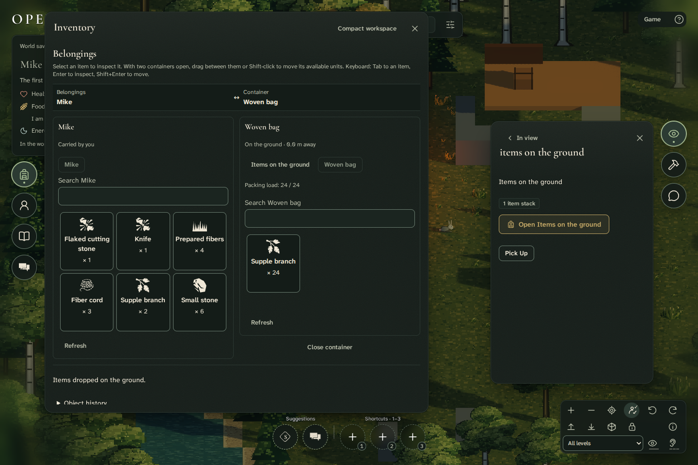

**1440×960, native App/server/PostgreSQL.** The player dropped the supplied filled bag, opened the resulting ground pile and opened the bag inside it. Both collections remain named above their item grids. The ground location, distance, breadcrumb and packing load explain which bag is open and why its contents are relevant. This applies the object-first inventory design: the opposite open collection supplies the destination for a move. The expanded workspace consumes much of the screen, leaving the world and selected ground pile mainly to its right; this desktop capture does not establish a comfortable layout at every width.

### 25 — A full bag refuses without losing items

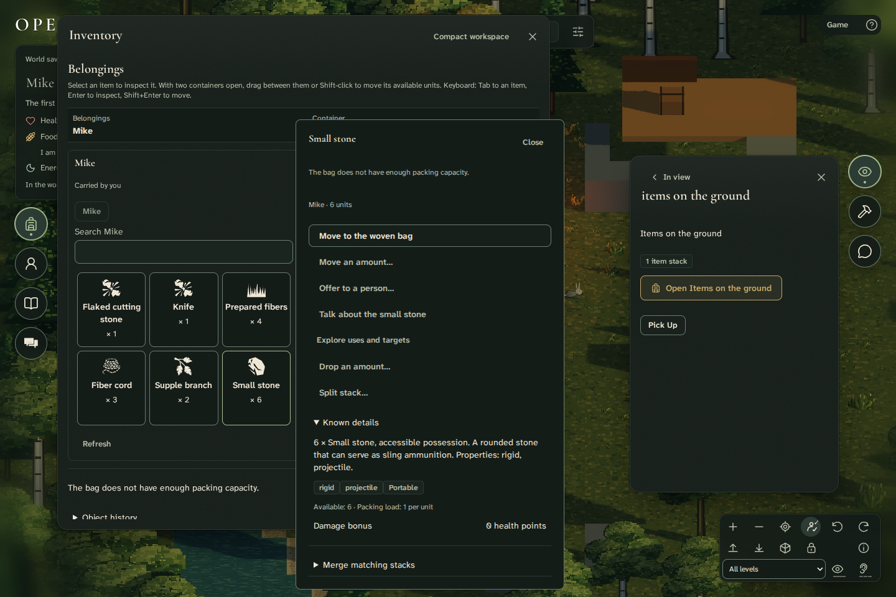

**1440×960, native App/server/PostgreSQL.** The native move refuses all six stones because the bag is full. The reason stays both in the item detail and the workspace status, and the named destination remains available for deliberate reconsideration. The interaction record verifies unchanged quantities, custody and bag contents after refusal, including the existing 24 branches and load of 24/24; the screenshot alone cannot prove that integrity. The detail panel covers much of the second collection. Keeping the two names above it preserves orientation, but simultaneous comparison of both grids is reduced while the panel is open.

### 26 — Exact amounts return a recorded result

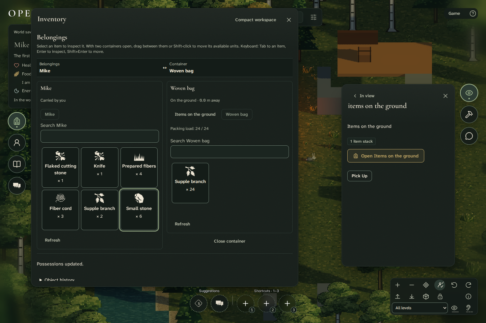

**1440×960, native App/server/PostgreSQL.** Taking three branches changed the player/bag totals from 2/24 to 5/21; putting three back restored 2/24. The native command bodies and resolved receipts establish both exact moves. The local quantity control kept the chosen item and opposite collection, and ordinary transfers made no destination-discovery request. For the return, the script focused **Move amount** and pressed Enter. That input is established by the script and receipt record, not by the visible outline, which is around **Small stone** in this later capture. This image demonstrates the returned totals and persistent result; it does not demonstrate focus on the transferred branch cell or broader keyboard usability.

### 27 — Remains retain identity and permission boundaries

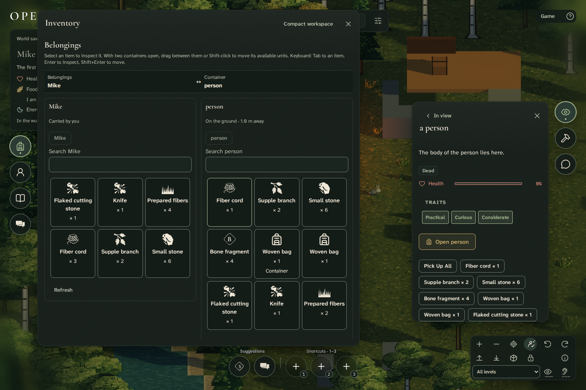

**1440×960, native App/server/PostgreSQL.** The same paired workspace opens the nearby body and shows its permitted possessions. The character used by the fixture is Ada, but the player has not learned that name, so the UI correctly calls the target **person**. Taking one bone fragment and returning it leaves the visible stack at four; both native commands have resolved receipts. Separate native access checks allow the permitted bag, refuse restricted-bag contents, expose no storage route into the living person’s inventory, and refuse the body’s contents after it is moved beyond reach by the fixture. Those refusals are established by the interaction record, not by this successful opening image. Two identically named woven bags still require context and available actions to distinguish; only the permitted bag shows the **Container** affordance here. Opening the body grants no general access to private or living inventories. No player death, walking, arrival or consent-acceptance journey is claimed.

## Reading and conversation

### 06 — A Journal with a reachable end

**1440×1000, App.** Promises, Beginnings and Your story remain distinct. The World Events route explains that it contains what the character perceived. The reader controls stay above its own scroller, and the final row of the 40-entry example stays inside the panel. The adjacent action draft remains intact. The prose is controlled layout content, not newly generated narration or native history-search evidence.

### 10 — Conversation keeps the recipient and message together

**1160×880, component.** The selected person and hearing reminder frame the transcript; volume has its own narrow control, and the message stays with Send. The long example name checks wrapping. Interaction checks separately cover composition, explicit send and retaining an uncertain original message when another recipient receives a successful send. The small top-edge buttons are fixture navigation, not product controls.

## Settings, entry and recovery

### 07 — Enlarged text changes the arrangement

**320×740, 130% interface scale, App.** Category names use two columns instead of a tall one-column list, with the selected task and Close retained. Settings scroll beneath the header; they are not all visible at once. The shown controls stay within the viewport, and Game stays above the open-task tabs. This is one observed width/scale combination, not a mobile or assistive-technology certification.

### 08 — A short window uses the task scroller

**1180×420, App.** Scrolling brings the caption-reading control and its consequence into view without moving the game page. The control was measured inside the panel's visible bounds. A short viewport has little simultaneous context; this capture demonstrates reachability of this setting, not ideal reading space for every possible combination of controls and text.

### 20 — Camera and shortcuts share available space

**390×844, 130% interface scale, App.** Suggestions and retained numbered shortcuts remain distinct, and the existing camera controls fit inside one lower scrolling region. Their earlier independent positions overlapped and pushed configuration controls beyond the viewport. The correction gives layout ownership to their common region while retaining every capability. This view still devotes much of a narrow screen to the HUD; some launchers and shortcuts require horizontal scrolling. The benefit is reliable access and separation, not a claim that all controls are visible or that this density has passed new-player observation.

### 21 — A short viewport exposes the scrolling tradeoff

**320×568, 130% interface scale, App.** The plain tooltip stays attached to the shortcut and can appear outside the lower region's clipping. It names both the action and its selected source. Actual wheel/keyboard checks reach the other controls through the local scrollers without moving the camera. The camera is below the visible part of that region in this capture, and the decorative title wraps beneath the HUD. This is a deliberately constrained case: it demonstrates a bounded overflow strategy and a visible explanation, while making the remaining density problem explicit. Tooltips supplement reachable action details; they do not supply an essential instruction that exists only on hover.

### 23 — Closing a task returns visible keyboard focus

**320×740, 130% interface scale, App.** Enter on Hide Inventory returns focus to the Inventory launcher and reveals it in the horizontal strip. Its complete outline remains inside the scroll boundary. The green Conversation launcher describes the still-open task, so selected/open state and keyboard focus remain visibly distinct. The earlier outward outline was clipped even though focus ownership was correct; this is why a focus assertion alone was insufficient. The retained conversation is controlled example content, and this image establishes no successful message send. The [focused interaction record](../../verification/game-interaction-redesign.md#narrow-controls-and-creator-reading) records the unchanged toolbar reentry behavior and exact bounds.

### 11 — Saving and recovering have different meanings

**1180×900, component.** Named checkpoints are separate from ordinary automatic saving. Loading replaces the current world and starts it paused. A protection failure remains visible; acknowledging it only dismisses the notice and does not pretend to repair storage. The catalogue and creation controls continue in the panel scroller. Exact original-request recovery and named load/delete confirmation are interaction checks, not outcomes established by this one image.

### 19 — A past invitation does not prove current access

**320×568, component.** The invitation receipt and current permission answer different questions. The screen retains the historical receipt but clearly states that this account cannot currently enter, with a deliberate access check. Other entry actions continue below through the existing scroller. The fixture did not create or revoke a real invitation or account.

## Creation and private inspection

### 14 — Create has recognizable destinations

**1366×900, component.** The player's workshop, authorized world authoring and inspection have separate routes. A new idea stays intact when visiting learned recipes or saved requests. The request explains that learning a supported recipe does not itself craft the item, and review is an explicit choice. The meter is the abstract usage allowance supplied by the fixture; no model request was made.

### 15 — Review, approve and apply are different actions

**1366×900, component.** A review names the actual saved revision, original purpose and affected records. Details remain inspectable, while the distinction between approval and Apply is explicit. The example's native-check statement is controlled report data, not a live validation or generated-invention claim. This is an appropriate structured creator decision; routine gameplay does not inherit the review form.

### 16 — A newer record does not erase an edit

**1366×900, component.** The player can see which saved revision their edit is based on and compare the newer text. Reapplying or discarding is deliberate. A refused refresh retains the loaded editor and words. Only currently permitted private knowledge is eligible for this workspace; visible controls do not grant access. The example is controlled data, and native concurrent editing remains a separate gate.

### 17 — Diagnostics explain evidence honestly

**1366×900, component.** Investigation detail is separated from ordinary play. The view identifies what happened and keeps stage detail behind an explicit disclosure; unavailable usage is labeled Unknown, not shown as zero. Focus and tooltip triggers use native elements. The visible trace is fixture data and says nothing about live model quality or measured cost.

### 22 — A new-reply cue must not cover an answer

**320×568, 130% interface scale, two panels open, component.** The question has been scrolled to its Save answer action. The unread cue now occupies the existing Conversation/Work row instead of floating across that action. The complete answer button is visible, and Stop remains in the separate footer. The optional Workspace and Session controls share one row; their collapsed state saves reading space. The available reader is only about 62 physical pixels high in this extreme case, so the full question requires scrolling. That is a material compromise, not comfortable paragraph reading. The interaction check traverses the full question and verifies the complete button target, retained unread state and exact request recovery. The small Settings/Create controls above the panel belong to the isolated host, not proposed game navigation.

## Operating and authoring different worlds

### 12 — World operations has its own task hierarchy

**1180×900, component.** The operator can return to the character directly. Current status comes before administration; invitations, access, maintenance and checkpoints have distinct destinations. The original selected character stays named when access changes. These are meaningful administration fields rather than fields required to perform an in-world action. No invitation or account mutation was performed outside the fixture.

### 13 — Maintenance status precedes schedule editing

**1180×900, component.** The announced end is an estimate, and the current pause is clear. The authorized Ready action is separate from editing the estimate. Announced and local time are labeled, while schedule editing stays secondary. This capture uses controlled times and revisions; it does not qualify native scheduling, timezone edge cases or a real service restart.

### 09 — World rules supply their own presentation

**1440×1000, App.** The existing reservoir world supplies its own location, time wording and character attributes to the shared shell. Its recharge task uses the existing native replenishment operation through the newly installed finite task presentation. A focused App check verified the old world's scene-label elements were removed; native checks separately cover charge transfer, stopping, duplicate commands and current-record restoration. Shared scene content does not make this arbitrary-world qualification, and the observed switch did not satisfy the separate five-second CI entry deadline.

### 28 — The shared inventory in a native clockwork world

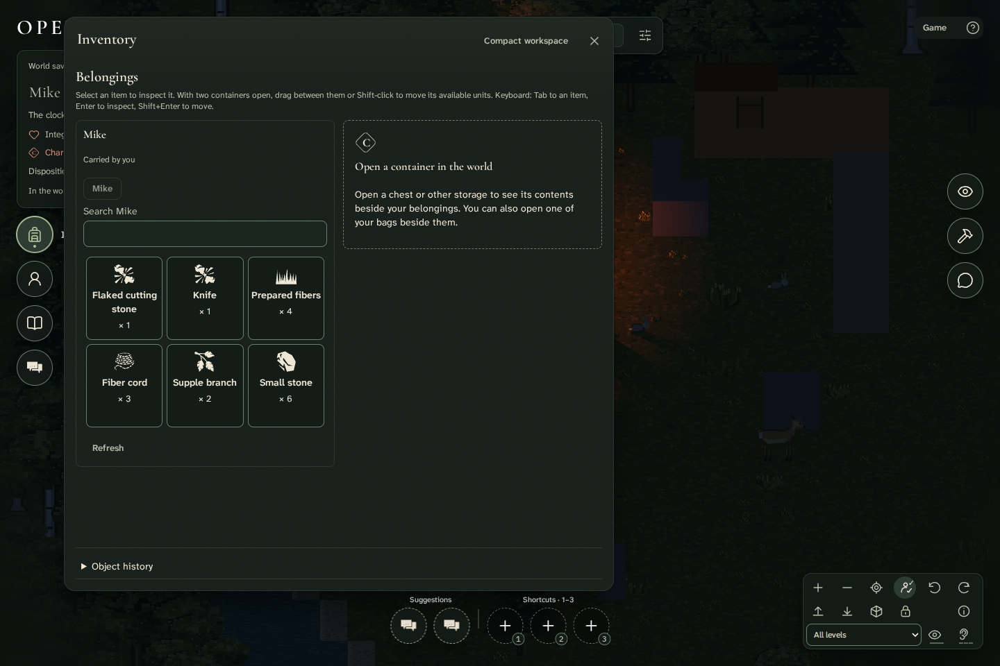

**1440×960, native App/server/PostgreSQL.** The player sees recognizable item pictures, names and exact quantities. The neighboring empty collection tells the player to open an object in the world, preserving the object-first transfer model. The existing world shares these six starting item kinds with the base world; their familiar names are actual authored content, not evidence of different equipment rules. The search field and roomy tiles are easy to distinguish, but this small six-item sample cannot establish large-inventory density or navigation quality. Reopening the same database retained the exact possessions and the world's Charge/Integrity values.

### 29 — Successful work can still have poor presentation

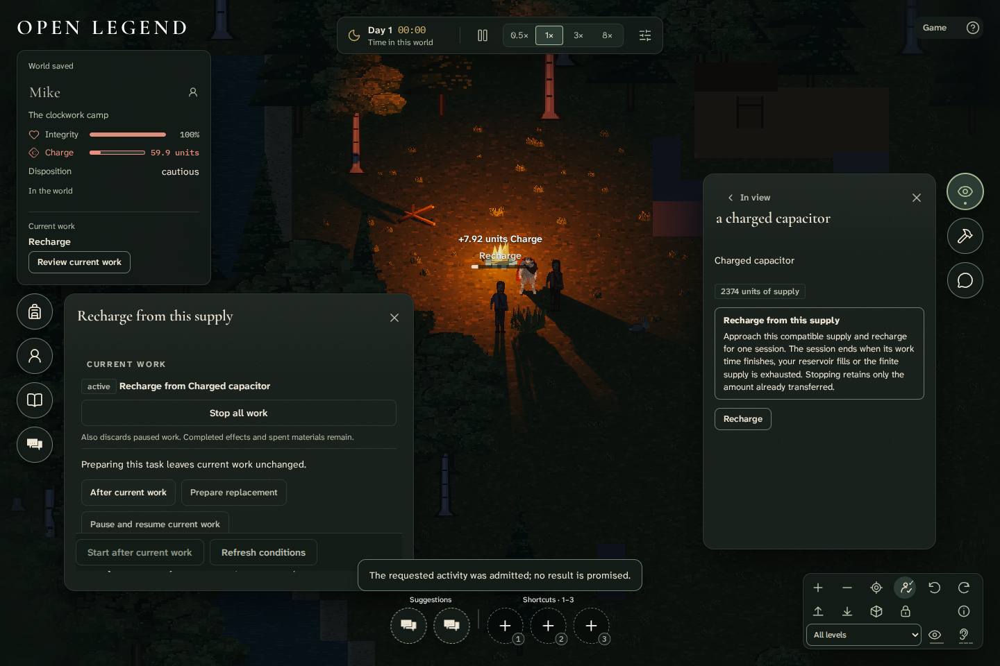

**1440×960, native App/server/PostgreSQL.** Current work names the real supply, Stop is available, and the source's inspected quantity agrees with actual native spending. Those are useful connections between the world and the menu. The lower panel is nevertheless crowded by scheduling choices and another Start, even though the player just started this work. The technical success toast adds little and competes with the panel. The lesson is to switch the panel's emphasis after commitment: monitor current work first and deliberately reopen preparation. Native success does not make this layout satisfactory.

### 30 — Shared UI does not require identical character senses

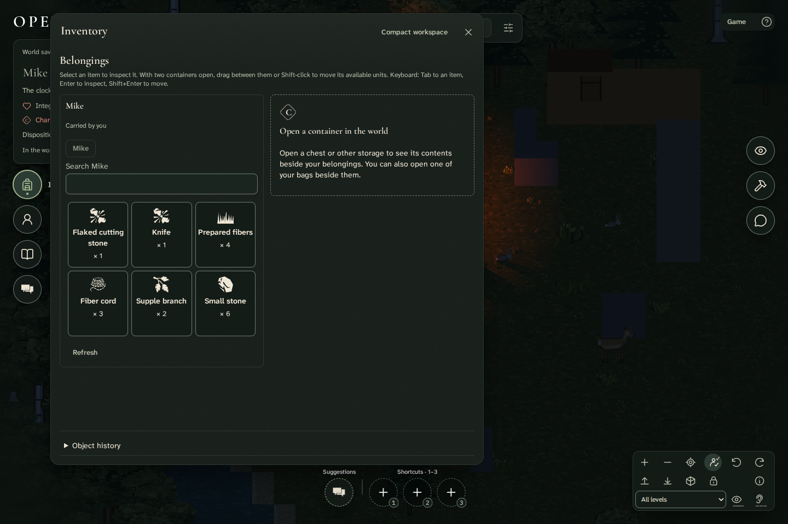

**1440×960, native App/server/PostgreSQL.** This intentionally resembles image 28: the controlled player retains ordinary sight and the same six starting item kinds. The world's other resident uses contact-based perception and cannot see the distant supply; that difference is established by native permitted reads, not inferred from this screenshot. The useful design property is that inventory does not need a separate implementation for that world. This is neither touchscreen testing nor proof that any arbitrary world or equipment schema is supported.

### 31 — The narrow view exposes the active-task problem clearly

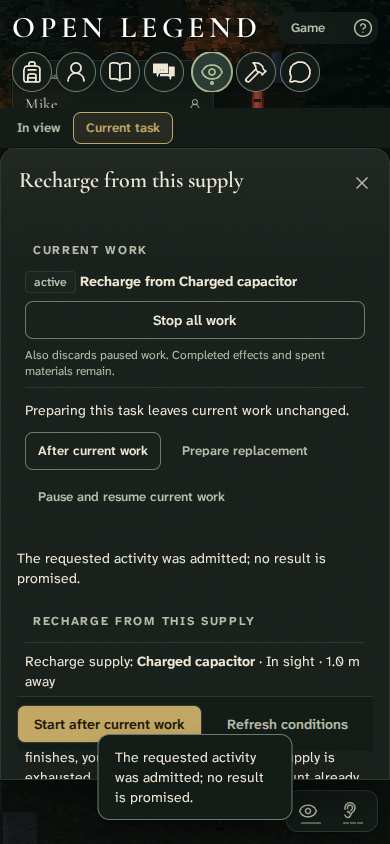

**390×844, native App/server/PostgreSQL, before the correction.** The selected task and Stop fit, but the rest of the screen repeats choices that the player has already made. The acknowledgement appears both inline and as a toast; the sticky Start row crosses the repeated task description. Keeping a button technically reachable is insufficient when the screen no longer makes the current decision clear. The accepted correction folds preparation after a confirmed start, retains its values behind **Prepare another task**, uses plain acknowledgements and preserves refusal or uncertain-result recovery. This original capture remains a record of the defect; a later screenshot must identify the actual corrected source separately.

## Current work after a confirmed start

### 32 — Monitoring replaces repeated preparation

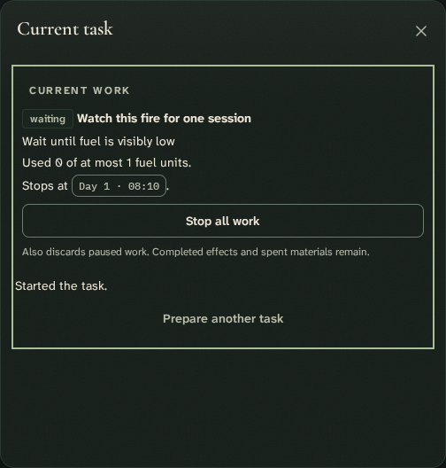

**504×528 Panel crop from a 1280×900 host, component.** After a confirmed start, the player's immediate decision is whether to let this work continue or stop it. The task name, waiting reason, budget and deadline stay together above **Stop all work**. **Prepare another task** makes further planning deliberate and restores the saved values; it does not submit another request. Removing the repeated supply/time editors, scheduling modes and second Start makes that decision easier to find. The visible space below the controls is the result of removing repetition within the existing Panel, not evidence that the full game layout or native journey is accepted. The focus boundary shows the group reached after keyboard Start in this check.

### 33 — The narrow task keeps the same clear decision

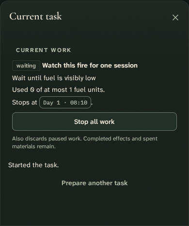

**390×465 Panel crop from a 390×844 host, component.** The current work and its two relevant next steps remain readable at this width. The cancellation explanation wraps beneath Stop, while preparation stays behind its own deliberate button. The accompanying interaction record separately verifies that a delayed acknowledgement of a successful Start can arrive after this component is hidden and shown without taking focus back; the absence of an outline in this image alone cannot establish that behavior. That hidden interval used the component's real visibility input, not a native panel-hide journey.

The passing component scenario took 10.28 seconds, made five in-memory native activity submissions and read two original receipts without replay. It also checked retained values and explicit blanks, refusal, uncertain delivery and recovering task A while task B remained in preparation. The world clock was not advanced, so the shown fire care does not establish fuel consumption, continuous attendance or completion. The [manifest](manifest.json) records report SHA256 `a014e50928de50cb8a33c9f897fc95f68958fac9a1f36370fcd4ee329a4da298`, source identities and all three attempt scopes. Full-App placement, native persistence and wider usability remain with the [verification report](../../verification/game-interaction-redesign.md#whole-interface-runtime).

## Creator review: native results and corrected reading

### 34 — Native findings need a concise reading order

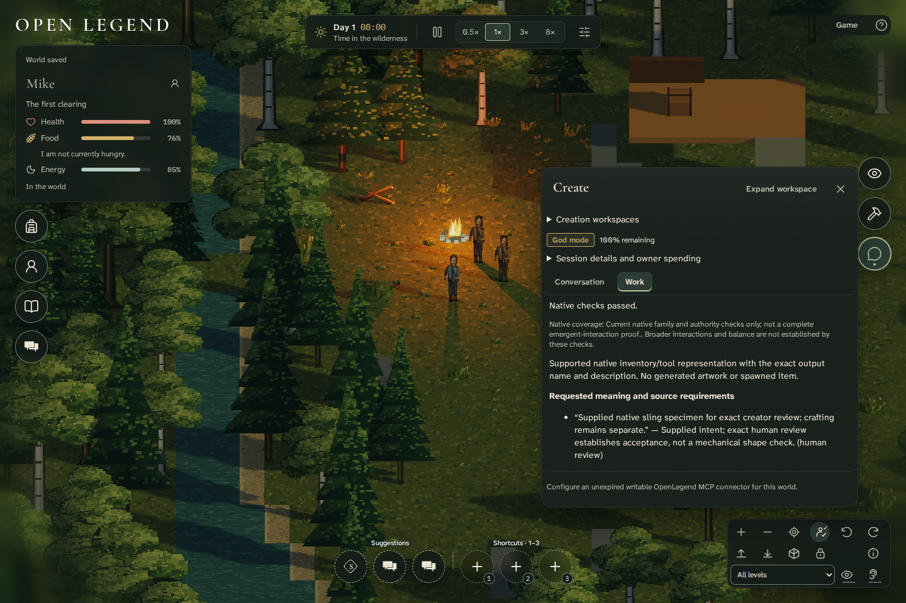

**1440×960, native App/server/PostgreSQL, before the presentation correction.** The selected Work tab keeps the recipe task inside the game, and the preview clearly limits what the native checks establish. In the accompanying journey the player changed crafting time from 60 to 72 game seconds before saving. This particular image shows the findings portion of the scroller, so it cannot demonstrate that the recipe facts and editing controls are simultaneously visible. Long check explanations and a technical connection reminder consume much of the panel. The useful lesson is to lead with the proposed consequence and keep supporting passed evidence deliberately available, while leaving unmet requirements and limitations readable. No model generated this supplied recipe.

### 35 — A reachable Close does not keep the heading visible

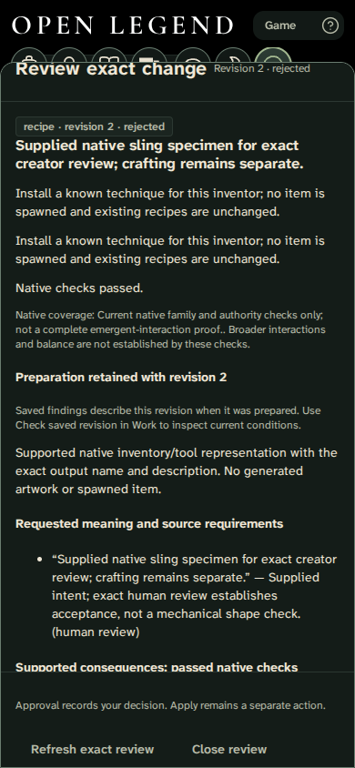

**390×844, native App/server/PostgreSQL, before the correction.** Revision 2 and its rejected status are repeated in the heading and tag, and the same installation paragraph appears twice. More seriously, the heading has moved into the modal's top edge. The saved trace records 30 pixels of outer scrolling: the inner review allowed 820 pixels of height while its outer container allowed about 776.5. The existing Close and outer-bounds checks passed, but the player lost a stable title while reaching them. The [scoped correction](../../projects/game-interaction-redesign-tech-design.md#creator-review-repetition-and-narrow-scrolling) gives the heading, body and footer one height allowance and leaves ordinary scrolling to the body. This original defect remains visible here.

### 36 — Uncertain delivery retains the original action

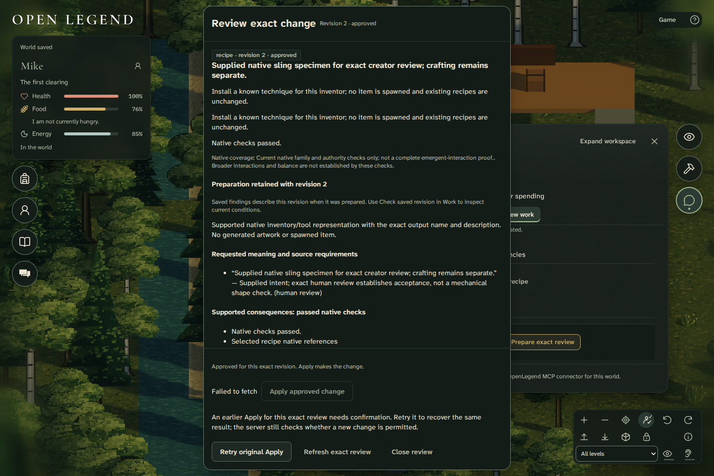

**1440×960, native App/server/PostgreSQL.** The server has committed the recipe installation, but this client has not received confirmation. The UI retains the original review and offers **Retry original Apply** with its recovery explanation; the ordinary Apply control is disabled. The native record, rather than this image alone, establishes that delivery was interrupted only after a successful commit. The generic **Failed to fetch** text contributes little; the nearby explanation supplies the action's meaning. Above it, duplicated installation text and expanded passed checks still occupy most of the reading area. Recovery is functionally careful, but that does not make the surrounding hierarchy clear.

### 37 — A successful result should be easier to find

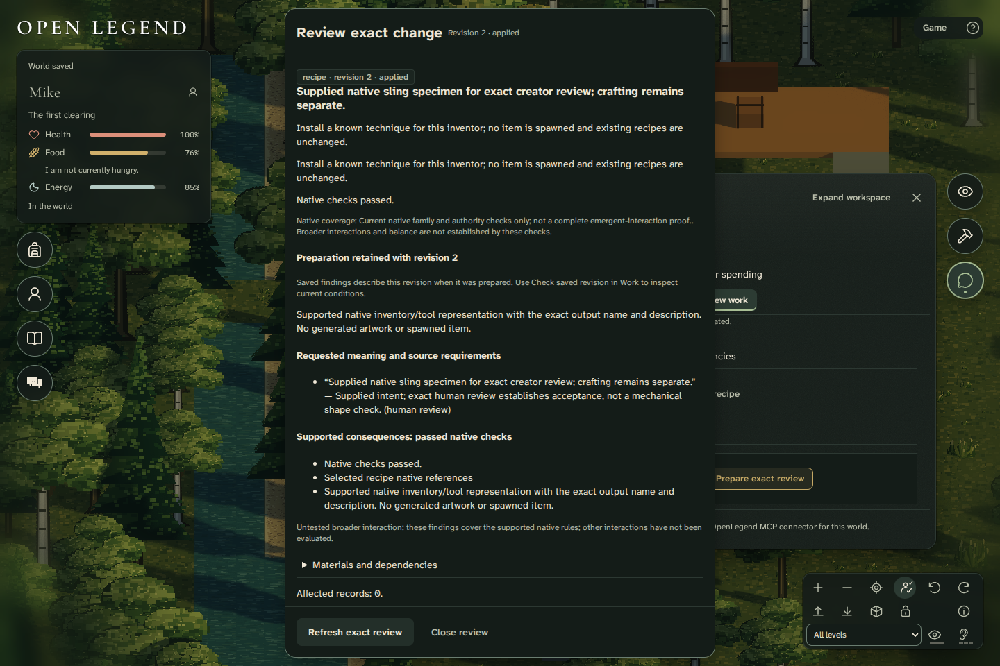

**1440×960, native App/server/PostgreSQL.** **Retry original Apply** returned the unchanged native receipt, and exactly one learned recipe exists. The header correctly says **applied**. The actual technique result, however, sits below the visible portion of this long body; repeated semantics and passed findings appear first. The player should encounter what changed before reading all of its supporting evidence. The native journey also verifies that the six carried item records remain unchanged and the learned recipe persists in storage. It creates no physical Sling and does not qualify Crafting or the later corrected layout.

### 38 — The decision precedes expandable passed evidence

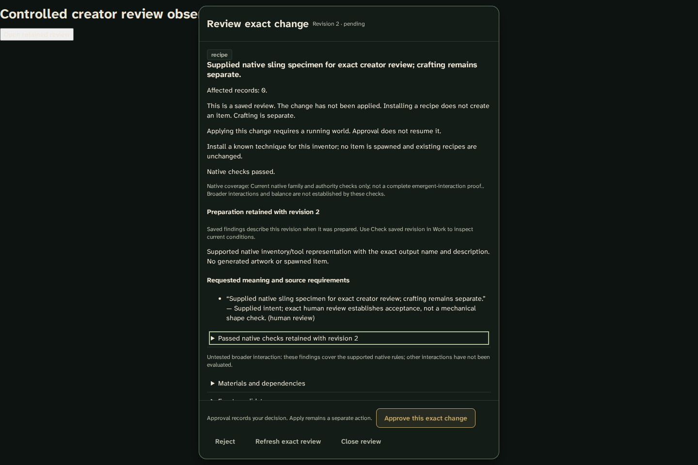

**1440×960, component.** Revision and status have one place in the heading. The body leads with affected records, whether the change has been applied and the running-world requirement. The repeated installation paragraph has been removed. Passed checks sit in **Passed native checks retained with revision 2**; the visible focus boundary identifies that disclosure. The companion interaction expanded it by keyboard without making a write. Source requirements, validation and coverage limits remain outside it. The review is still text-heavy, and some optional details need scrolling, but the proposed consequence and approval choice are clearer. These are recorded native values in a controlled component host.

### 39 — The narrow review keeps its title and exit

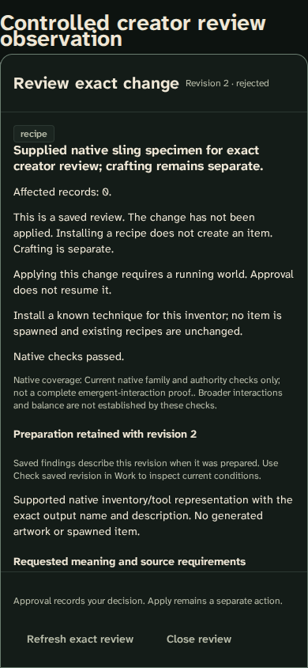

**390×844, component.** The rejected state, complete heading and Close control now fit within the same modal. This image shows the body returned to its top after a scrolling check. That check wheels the body from 0 to 350 pixels while the heading and footer keep identical rectangles. Outer overflow and outer scroll remain zero. That addresses the specific lost-heading behavior in image 35 without forcing the scroller back to its top. The long source requirements still need ordinary body scrolling; this does not establish comfortable reading at every text size or full-App placement.

### 40 — Clearer reading preserves uncertain-result recovery

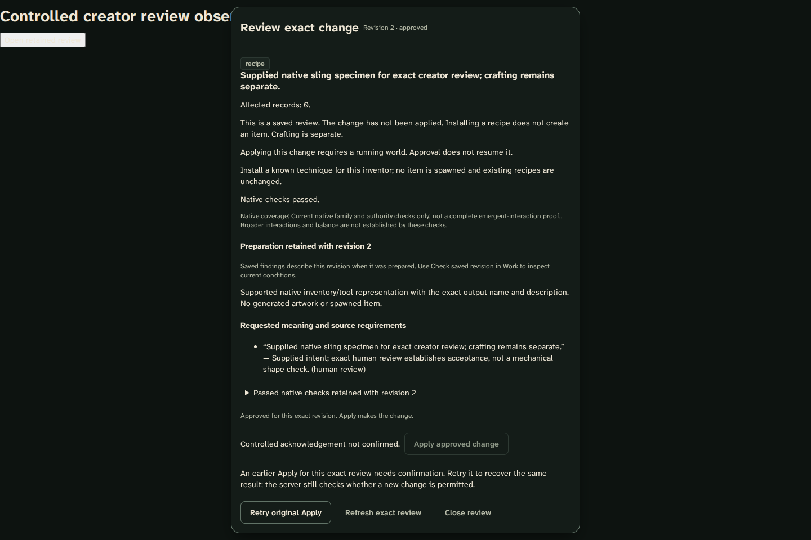

**1440×960, component.** The body that leads with consequences and its collapsed passed evidence coexist with the existing original-result recovery controls. The footer retains the unconfirmed outcome, the reason to recover the original review, and **Retry original Apply**. Its message explicitly names the controlled acknowledgement used by this check; that text is fixture delivery, not proposed production copy. The two recorded Apply request bodies match exactly, after which the saved applied receipt is shown. This verifies the component's request and presentation continuity. The native one-installation evidence belongs to images 36–37 and their earlier report.

### 41 — The applied receipt remains reachable with larger body text

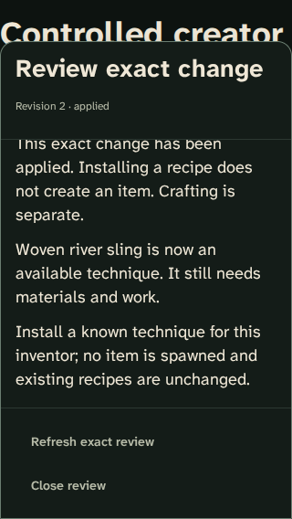

**320×568, 18.2px body text with 26px line height, component.** The body has been scrolled to the recorded receipt: **Woven river sling is now an available technique. It still needs materials and work.** The heading retains revision 2 and **applied**, while the footer keeps Refresh and Close fully visible. Part of the preceding paragraph clips at the body's top boundary because the reader has scrolled; the heading itself stays in place. Only body typography was enlarged to 130% in this controlled case. It is not a browser-zoom or whole-interface-scale test. The available reading area remains small, so this demonstrates reachable content and stable controls, not broad reading comfort.

The native creator report has SHA-256 `333b5e64a73bdc1f4bbdd413dbd829a3d7dc3dc516063e4958791dcaaa84c4b8`. The subsequent component report has SHA-256 `f6a2678a98ebce6532549f999f8df34c11c29f02c0d417752e5b8ea8b0a7fa44` and passes six bounded groups, including controlled failed/pending/missing findings and newer refused validation beside older retained evidence. Those additional states are recorded checks, not all shown in these four component images. The [manifest](manifest.json) preserves both records and their separate source identities. Neither set establishes operating-system IME, assistive-device or uncoached-player usability.

## Creation recovery across different entries

### 42 — An unknown result keeps its original details

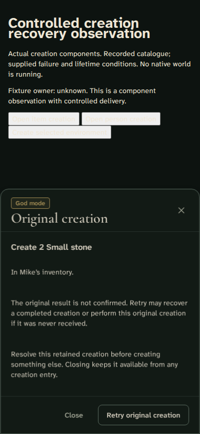

**390×844, component.** The quantity and destination remain together, so the player can identify the creation they are recovering. The explanation states both possible consequences of retry: it may recover a creation that already happened or perform the same original creation if it never arrived. **Close** preserves this unresolved request; opening a different creation entry reveals it again. In the accompanying check, this item request survives a later refusal and reload before an actual focused Enter gesture retries its unchanged identity and body. The image does not itself establish that gesture or native exactly-once creation. This is a recovery sheet for an uncertain result; ordinary successful environment creation does not add a form. The extra explanation costs vertical space, but replacing it with a generic failure notice would leave the next action ambiguous.

### 43 — Known success needs a different recovery action

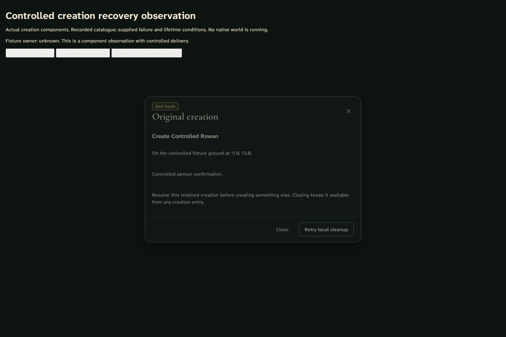

**1440×960, component.** The supplied person result is confirmed, but the browser could not remove its saved recovery record. After reload and entry through item creation, the original person and known result remain visible. **Retry local cleanup** handles the browser record without sending a creation request; the original-mutation retry is absent. The lesson is to distinguish uncertainty about a world change from failure to tidy up a local recovery record, so the player does not repeat a known successful action. The large background heading and entry buttons belong to the isolated host. This image was taken promptly after opening and appears dimmer; it is evidence of the shown content and controls, not final-opacity or contrast qualification. “Controlled person confirmation” is supplied test delivery, not production copy.

The first and only controlled run passed all four groups in 7.177 seconds, with nine deliberately supplied POST deliveries, two captures, no page errors and no unexpected requests. Storage read/write failures and corrupt or oversized records sent nothing; original retries retained exact bodies; confirmed-result cleanup sent nothing; and old private-scope or unmounted-owner replies could not clear newer work. The owned browser and host closed, and all five production source hashes remained unchanged. The [manifest](manifest.json) retains report SHA-256 `cc1123aa58b486efe0c9608a2ce1f2efdc3eb9bfb01fe1e3bf5541226fe2c966` and the distinct recorded-catalogue provenance. The [creation recovery design](../../projects/game-interaction-redesign-tech-design.md#recover-item-person-and-environment-creation) owns the behavior; the [verification report](../../verification/game-interaction-redesign.md#whole-interface-runtime) keeps native creation, full-App integration and wider usability acceptance separate.

## Editing one selected person

### 44 — A dirty edit keeps its subject and commitment visible

**1440×960, native App/server/PostgreSQL.** The window still names **Mike**, while the Name field holds **Owner UI checkpoint check** and the footer says **Unsaved changes**. Keeping the saved subject distinct from the draft helps the owner understand which person will change. The Identity tab groups related authoring fields, and the bounded scroll area leaves the explicit Discard and Save controls visible. This form belongs to deliberate owner editing; ordinary play should continue to act on people and objects through their relevant game controls.

The PNG does **not** visibly show the close-confirmation dialog. The recorded browser document before and after capture contains that dialog, and the later native interaction retains the draft through **Keep editing**, then saves only the name through **Save and Close**, exactly once. Those interactions establish the behavior; this image does not establish the confirmation's appearance or a new stacking defect. The subsequent checkpoint Load returns success but produces a native storage error, and final shutdown reports an unsaved world. Protected recovery, Operations, the return-to-character check and the following creation stage remain unqualified. The [native report](../../verification/game-interaction-redesign.md#latest-native-continuation-at-6ede5f0) keeps these results and failures together.

## A complete finite camp journey

### 45 — Open storage stays beside belongings

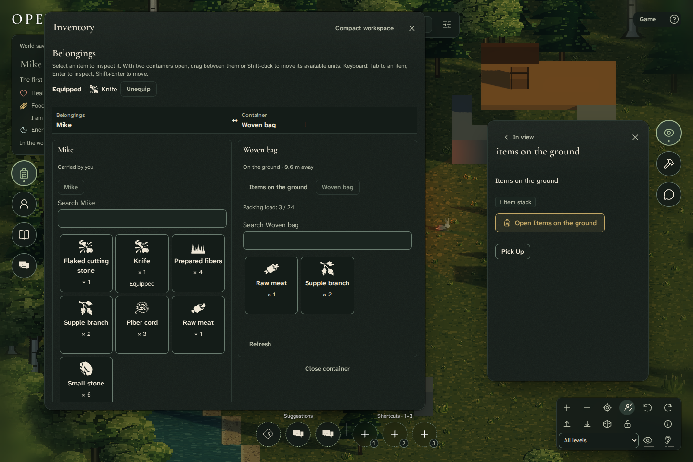

**1440×960, native App/server/PostgreSQL.** Mike and the woven bag remain visible as the two sides of one inventory. The bag names its ground location and packing load, with a breadcrumb back to the pile. Equipped appears on the same knife cell and in the equipment strip. The player can understand where a stack is and which tool is held while moving supplies between these exact owners. The native journey opened the ground object and its bag, took the knife, two branches and one raw portion, then equipped the knife; each command has its original receipt. No ordinary transfer destination chooser is needed. The expanded workspace still covers much of the world and the last carried row continues below the visible scroller; this image does not qualify whole-list visibility or discovery by a new player.

### 46 — Input and output have different moments

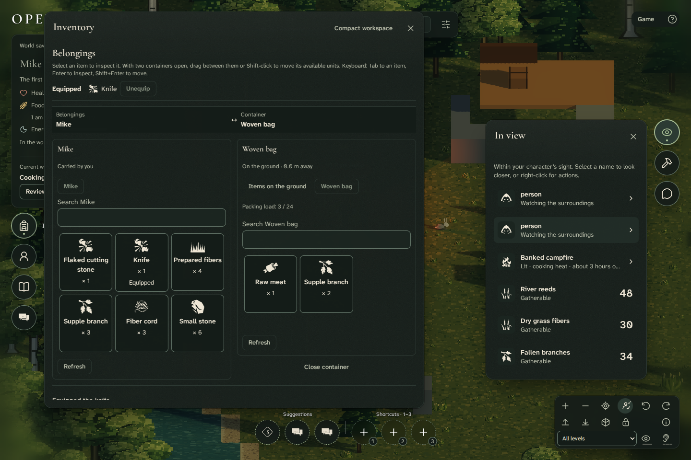

**1440×960, native App/server/PostgreSQL.** Ownership stays clear even when the same material exists elsewhere: the raw portion used for cooking has left Mike’s belongings, while the bag’s separate portion remains. The branch source is now 34 and the carried stack is three. These quantities connect ordinary object actions to the inventory without another activity worksheet. The native record checks halfway progress and exact completion: gathering produces two branches, fueling spends one at completion, and cooking spends its raw input at start before producing one cooked portion at completion. Only part of the Cooking notice is visible behind the inventory, so this screenshot does not show the complete progress control or independently establish those timings. The equipped knife is retained; the session claims no knife gathering bonus.

### 47 — Consent leaves a character-readable record

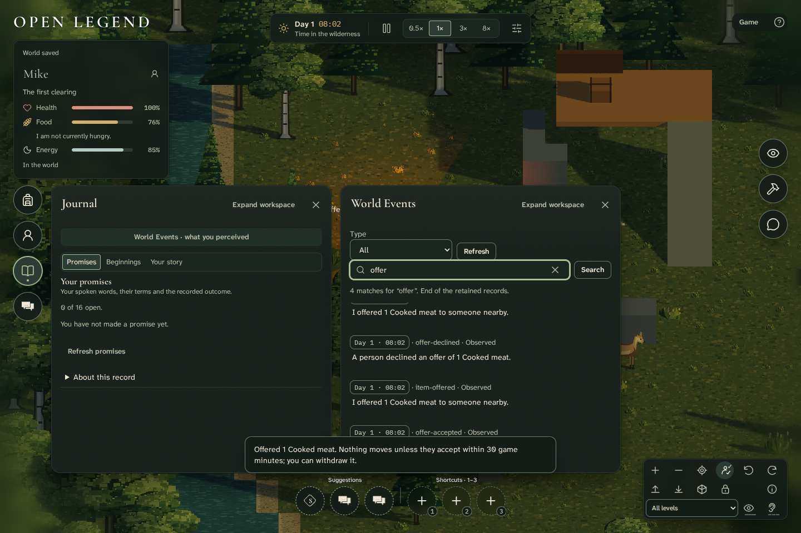

**1440×960, native App/server/PostgreSQL.** Journal opens the events the character perceived, and search brings the relevant offers together. The public record calls the recipient **a person**, preserving the character’s knowledge rather than exposing the fixture’s name. The native journey verifies that making an offer moves nothing, a supplied decline leaves custody unchanged, and a supplied acceptance transfers exactly one cooked portion. Both resulting public event texts pass the interaction checks. Here the transient **Offered 1 Cooked meat** receipt overlaps the full acceptance text; the image therefore shows the search context and acceptance tag, not both complete outcomes simultaneously. A persistent searchable record is useful for reviewing consent, but transient notices should not obscure that reading. This session uses supplied native NPC decisions and does not establish generated judgement, live conversation or a human recipient experience.

### 48 — Conversation retains who and what

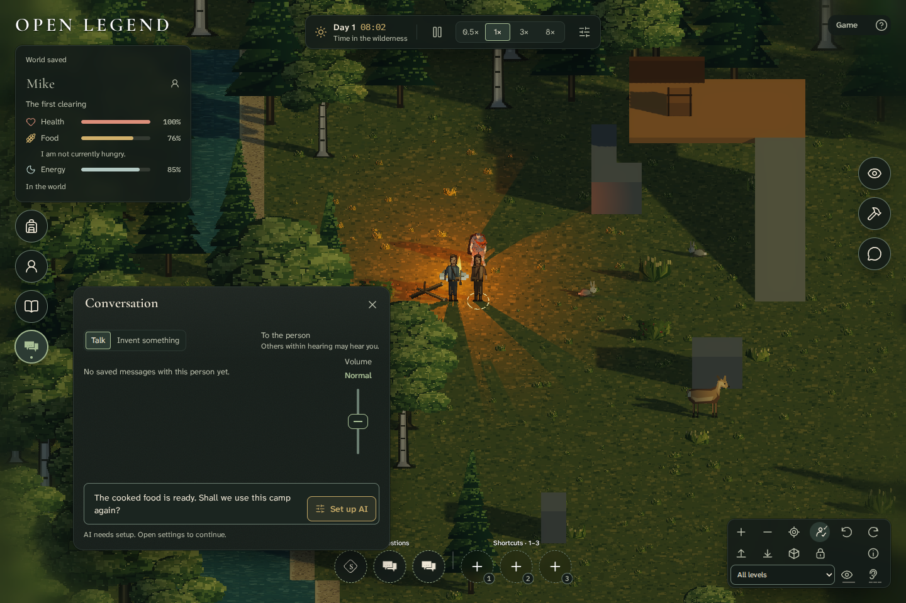

**1440×960, native App/server/PostgreSQL.** The recipient and the warning that others within hearing may hear the player remain above the draft. The message is intact after hiding Conversation, opening the unconfigured setup route and returning. **Set up AI** explains the next available action; the UI does not pretend the words have been sent. The interaction record separately checks the ordinary-player **Intelligence is unavailable** explanation in the setup panel, then the same recipient and draft on return. That panel is already closed in this image. No chat POST, speech event or generated reply occurs. After this capture, focused Enter returns all three leftover branches to the same opened bag; the final native state is five stored branches, one stored raw portion, one accepted cooked portion with the recipient and the equipped knife still with the player.

All four original captures succeed without retry. The complete finite sequence advances 152 game seconds, records ten player commands and resolved receipts, and shuts down with saved revision 21 and no problems. The supplied setup Drop and two recipient decisions are separate native fixture work. This qualifies the recorded camp connection and conversation boundary, not complete J13/J14/J16 acceptance, longer care, original-result recovery or OS/human usability. Earlier scroll/popover and capture failures remain recorded; this later pass does not identify their cause or establish a performance fix.

## Deliberate approach, current work and a physical crafted result

### 49 — An unknown transfer keeps its original identity

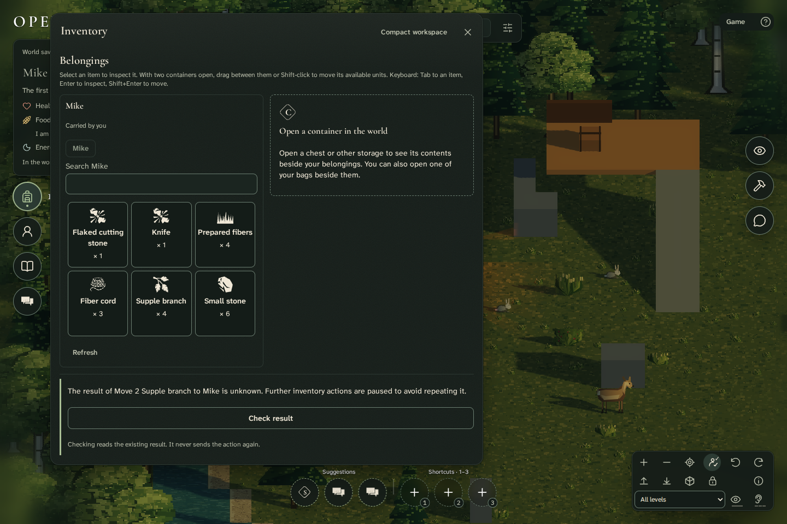

**1440×960, native App/server/PostgreSQL.** The player has deliberately walked to and opened the ground bag, moved two branches and reloaded after only the successful reply was lost. The banner retains the exact action and names **Check result**. The other collection is now empty after reload; this image does not show the earlier paired bag. The native observer already knows that the move committed, while the player-facing result remains unknown. After this capture, one deliberate receipt read returns the original success and clears the retained request without another transfer. Keeping uncertainty visible prevents a second move from becoming the accidental recovery action. The stage checks custody and revisions separately from these pixels.

### 50 — Current work leads with the task and its limits

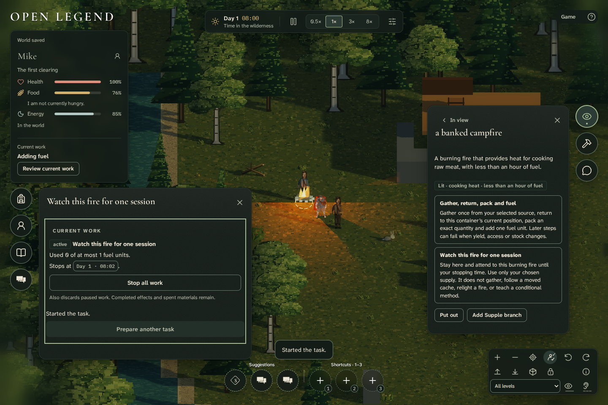

**1440×960, native App/server/PostgreSQL.** Confirmed Start replaces preparation with the active task, its resource budget and stopping time. **Stop all work** and **Prepare another task** remain visible near that status. This avoids asking the player to complete the same preparation again while work is already running. The screenshot is taken ten seconds into a twenty-second fuel action: native public progress is 0.5 and the branch remains unspent. Those numerical progress and custody assertions come from the native record; this image does not independently measure a visual progress fill. Completing that action spends one branch, produces one fuel event and leaves the longer task waiting for low fuel.

### 51 — A changed task keeps its stopping control reachable

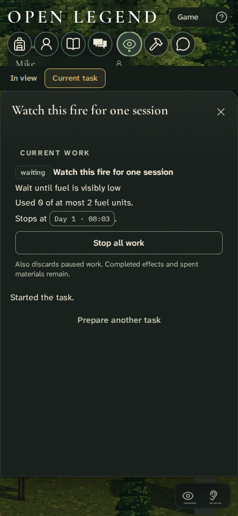

**390×844, native App/server/PostgreSQL.** The player deliberately reopened the same fire's task, revealed its retained preparation, changed the maximum fuel budget and duration, then confirmed replacement. The new task shows those limits and its actual waiting reason. **Stop all work** fits inside the narrow sheet beside the task it affects. This capture precedes the actual keyboard action: the script next focuses Stop and presses Enter. Native checks confirm that active and suspended work clear and another second spends no material. This demonstrates one reachable narrow arrangement; it does not qualify every text scale, viewport or assistive input.

### 52 — Crafting ends in an inspectable, equipped object

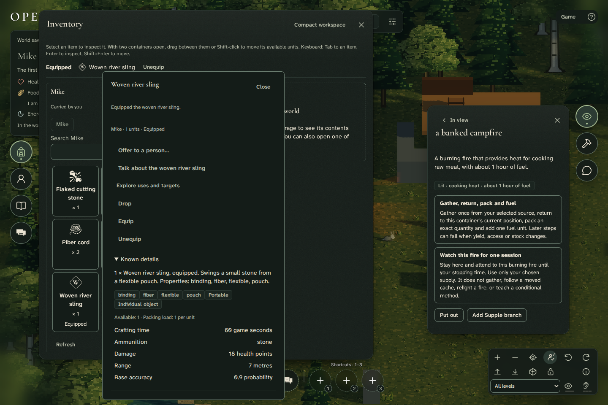

**1440×960, native App/server/PostgreSQL.** The finished Sling has the same ordinary cell, inspection and equipment actions as other belongings. Its readable **W** fallback remains usable without generated art, and the equipped badge and equipment strip connect the detailed object to what the character holds. The native journey starts the known recipe from Crafting, consumes one cord and two prepared fibers at start, creates one physical Sling after sixty game seconds, and equips that exact result. Its inspected launcher properties include stone ammunition, damage 18, range 7 and accuracy 0.9. The detail covers part of the grid; these pixels show the completed item, not the crafting progress or all simultaneous inventory rows. The known declaration was supplied through the existing native admission/knowledge fixture after entry, with no production recipe seed or generated invention.

All seven gameplay commands retain original native receipts. Five finite clock offers total 110 game seconds; one setup Drop is separate from ordinary play. Four captures succeed once within their unchanged ten-second allowance, and shutdown saves revision 23/time 110 with clean owned browser/database cleanup. Earlier screenshot and reopening-selector failures remain historical; this pass supplies no graphics or timing-fix claim. The task's single fuel action completes, but the longer task is deliberately replaced and stopped rather than allowed to reach its deadline.

## Retained original creations across entry points

### 53 — A different entry still shows the unresolved item

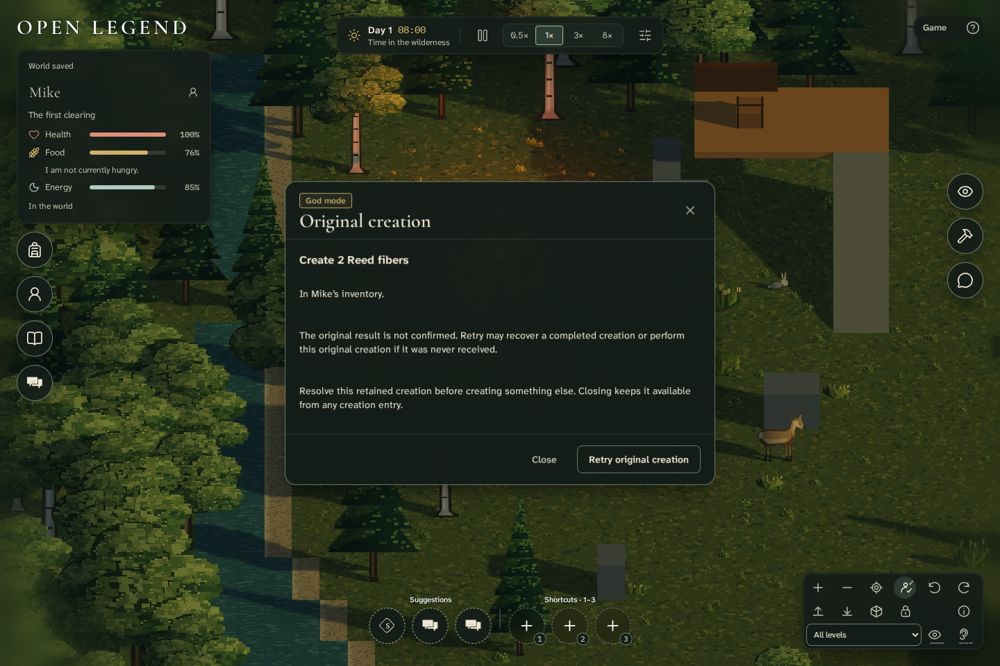

**1440×960, native App/server/PostgreSQL, God mode.** After the item request's native commit succeeds but its reply is lost, closing and reloading keep the exact request private to the same owner, world, timeline and actor. Choosing an environment entry opens this original item recovery instead of creating another object. Its title, quantity and destination explain what Retry can affect; the text explicitly distinguishes uncertainty from failure and explains that closing retains the request. This screenshot is **before Retry**, not a visible success result. The subsequent focused-Enter retry returns the original two Reed fibers and clears the request without creating more. The original artifact name contains “recovered”; its unchanged pixels and this caption preserve the actual earlier moment.

### 54 — Person recovery keeps the selected place and blocks another creation

**1440×960, native App/server/PostgreSQL, God mode.** The same recovery appears when the player opens **Add item** while Mira's creation is unresolved. It preserves the person's name and selected location instead of replacing them with a fresh item form. The dimmed Inventory provides the entry context while the centered dialog holds the consequential decision. Again, the pixels show uncertainty **before the successful keyboard retry**. Native assertions establish one person, the same three randomly assigned traits, one starting tool and three berries, with no second spawn, extra starting possessions or random-state change on retry. Those properties are not visible in this image. The typed person draft and actual selected ground require no model or placement fixture.

### 55 — Reload preserves an environment request without silently sending it

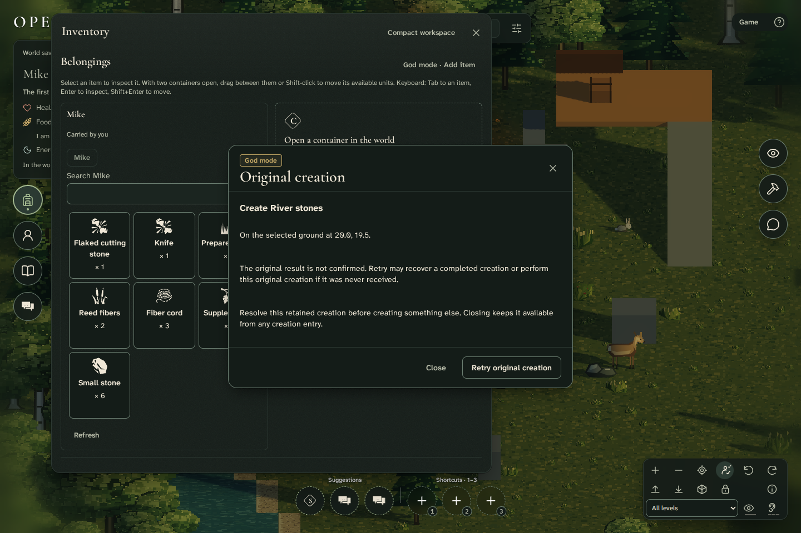

**1440×960, native App/server/PostgreSQL, God mode.** The environment choice originally sends through its ordinary world menu. After success-only reply loss and same-owner reload, opening Inventory's creation entry returns to the retained River stones request. It neither repeats the write on open nor substitutes a different destination. The complete dialog and both bottom controls fit in this capture. The following focused-Enter retry recovers the original resource object at the same supported position, with its original sixty stones and one spawn event. The screenshot itself remains an **unconfirmed pre-retry view**; the native result and SQL observations supply the completed recovery evidence.

The session makes exactly three original creation POSTs and three explicit exact-id/body retries. For each creation, current PostgreSQL reads find one original receipt and one recorded created entity both before and after retry. The complete native world is identical immediately across each retry, including random state; item/environment reloads introduce intervening entry state, so whole-session hash equality is not claimed. No walking, fixture transition, game-time advance or provider request occurs. All three captures pass once, and shutdown saves revision 23/time 0 with clean owned cleanup. This qualifies the recorded original-result recovery for these three kinds. Controlled storage-denial/lifetime checks, other access/refusal paths and full J40/input/human acceptance remain separately scoped. The preceding owner stage's second-load App failure still makes their combined invocation fail.

## Owner editing and protected return

### 56 — The draft stays distinct from the saved person

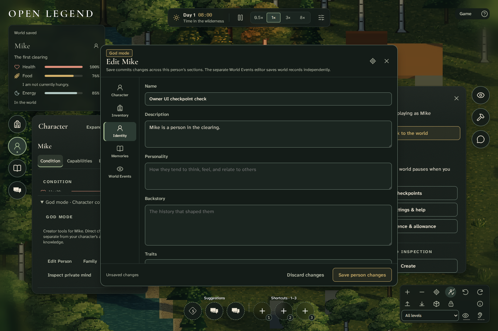

**1440×960, native App/server/PostgreSQL.** Identity groups the precise person fields in the owner's editor. The changed name and **Unsaved changes** footer distinguish the local draft from the character still named Mike in the surrounding HUD; Discard and Save name the available commitments. This is an appropriate structured authoring task. The captured desktop composition also retains the overlapping Game and Character panels; it does not establish an uncluttered narrow layout. The screenshot call follows a passing close-confirmation assertion, but that overlay is absent from these original pixels. The separate interaction record establishes **Keep editing**, the retained draft, then exactly one **Save and Close** with every other native person field unchanged. No native save, confirmation overlay or completed checkpoint return is inferred from this image alone.

### 57 — The recovery load names its consequence

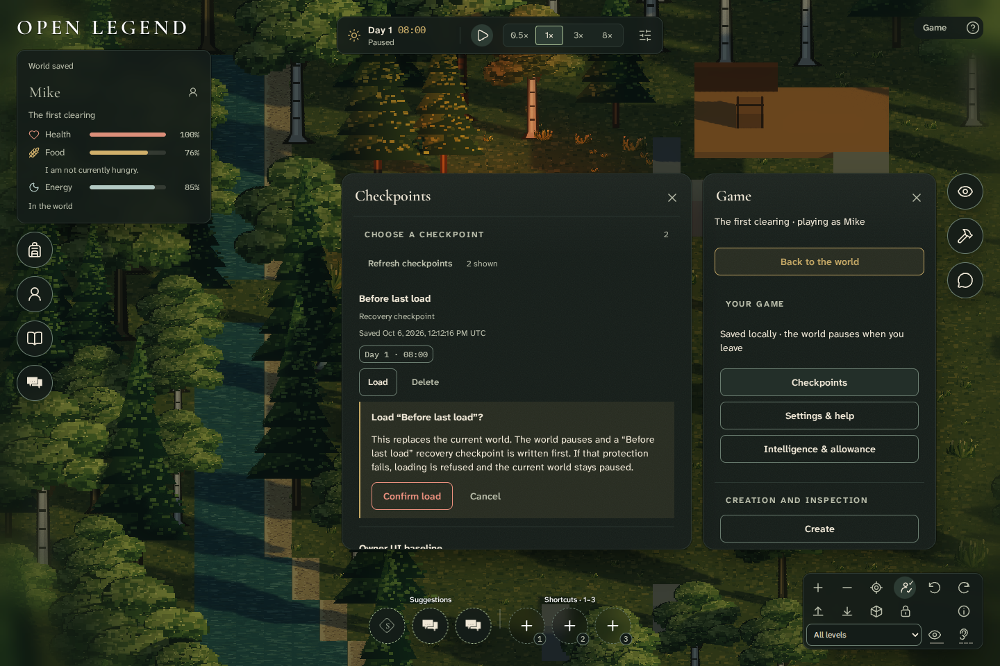

**1440×960, native App/server/PostgreSQL.** The confirmation names **Before last load**, identifies its real saved time and explains that loading replaces the current world, pauses it and first preserves the current state. **Confirm load** and **Cancel** are adjacent to that consequence. This applies the research principle that a consequential operation should identify its exact subject rather than present an anonymous confirmation. The list continues below the visible area; this image does not demonstrate every checkpoint row or a narrow viewport. It is captured before the second Confirm action. Later native and App assertions establish the restored edited name, a new timeline, manual pause, the new protective record and the real Operations return; those later states are not shown here.

## Inventory space before the final correction

### 58 — A successful action does not excuse wasted inventory space

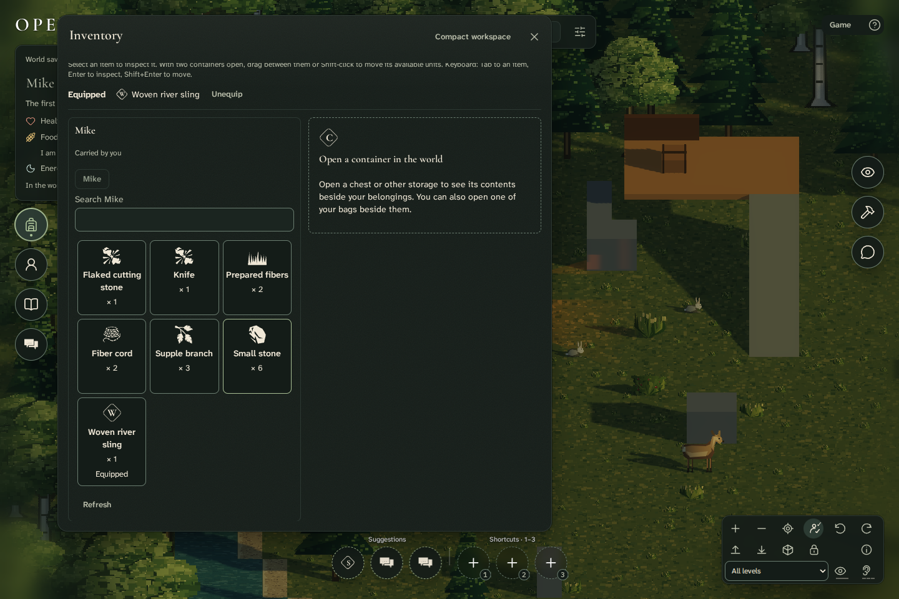

**1440×960, actual App with controlled recorded native data.** The equipped object and its badge are visible, and no global success notice covers the world. The separate interaction record establishes the local receipt and focus returning to My belongings; neither is proved by these pixels, and the receipt footer is below this scroll position. The image also exposes the remaining design problem: only three large item cells fit per row, a disabled root breadcrumb repeats Mike, and unopened storage reserves half the workspace. Readable names, quantities and fallback symbols are useful; this space allocation is not an accepted requirement. The [focused correction](../../projects/game-interaction-redesign-tech-design.md#use-inventory-space-for-the-open-collections) gives a single collection the available width, keeps useful nested navigation and lets cells fit their content. Two open collections still need clear paired endpoints.

The observation uses original native public views, Inventory pages and an Equip receipt as controlled presentation inputs. Its visible-success and held-success-after-Hide phases pass, but a third Equip click loses its popover before dispatch, so the whole observation remains failed and refusal/unknown cases are unrun. No new native move, equipment effect, permission or provider result is claimed. This original before-image is retained to assess the subsequent layout, not counted as a completed redesign. [Exact feedback/focus evidence](../../verification/game-interaction-redesign.md#controlled-inventory-feedback-and-focus-follow-through)

### 59 — Horizontal fit still leaves the items too low

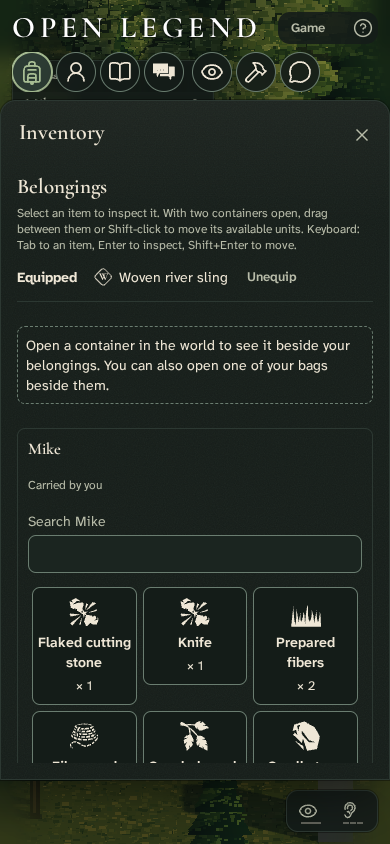

**390×844, actual App with controlled recorded native data, source `3bbfc7b`.** The equipment summary, exact names, search and first-row quantities remain readable. The single collection uses the full available width. But two headings and two instruction blocks precede the items; the first row starts at **y=587**, and lower cells and the local receipt lie below the captured scroll view. Fitting horizontally does not establish useful information order or density. The [compact-header correction](../../projects/game-interaction-redesign-tech-design.md#put-belongings-before-repeated-inventory-instructions) keeps the existing Inventory title, places optional instructions in **Inventory controls**, and preserves equipment and collection context. This original image precedes that correction and does not qualify its result.

The [separate interaction record](../../verification/game-interaction-redesign.md#inventory-focus-width-and-header-follow-through) establishes the 356-of-356px width check, collection focus and two controlled successful command deliveries, including preservation of a newer Search interaction. Its later ordinary pointer Close waits five seconds without dispatch, so the complete observation remains failed and refusal/unknown deliveries are unrun. That failure occurs after this capture; these pixels show neither the quantity draft nor the Close attempt. No new native effect, permission, OS-input or uncoached-usability acceptance follows from this image.

## Compact inventory headers keep the contents in view

### 60 — Paired contents keep useful context close

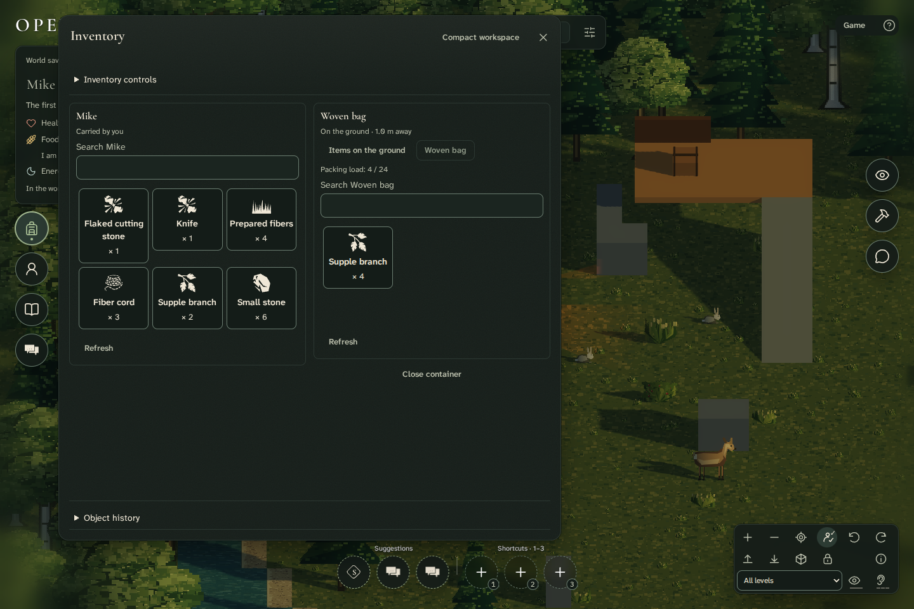

**1440×960, actual App with controlled recorded native data.** The two collection headers identify the endpoints without repeating them in a separate wide strip. The bag still says **On the ground · 1.0 m away**, retains the path through **Items on the ground**, and shows **Packing load: 4 / 24**. Those details explain where the object is and what its contents occupy; they remain next to the corresponding items. **Inventory controls** keeps the detailed gestures available through deliberate help. The actual object-opening path and native recorded pages are unchanged. Both columns fit, with complete item names and quantities, but the expanded panel still covers a substantial part of the world. This capture precedes both controlled commands and shows no new transfer or receipt.

### 61 — One collection uses the available width

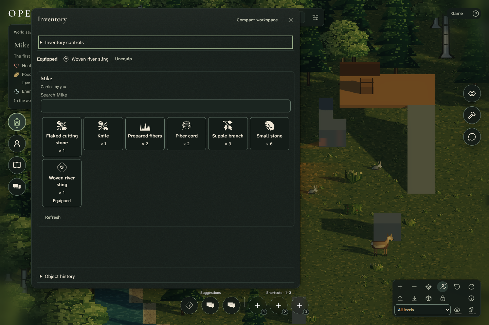

**1440×960, actual App with controlled recorded native data.** All seven lots fit in the pictured collection. Their full names and quantities remain readable at the existing 14px item text size; the sling retains its **W** fallback and **Equipped** badge. The separate equipment strip keeps **Unequip** beside the equipped item. The empty destination half and redundant Belongings heading are gone, so the space serves the contents actually open. The visible outline belongs to **Inventory controls** after opening and closing that native disclosure with Enter; it is not a post-command focus result. The shared Inventory title still names the panel. The image uses the original already-equipped projection, not a new successful Equip, and has no command receipt.

### 62 — Fewer repeated instructions expose more of the narrow inventory

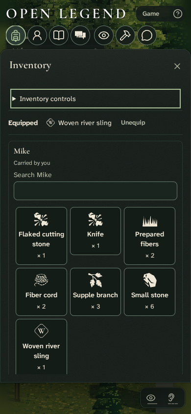

**390×844, actual App with controlled recorded native data.** The first item row begins at **y422**, 165 pixels above the earlier y587 arrangement preserved in image 59. Two complete rows now show six lots while keeping equipment, the exact owner and Search directly visible. The long gesture tutorial and unopened-container explanation remain behind **Inventory controls**, instead of occupying the first screen whenever Inventory opens. The third-row sling is still partial: its lower **Equipped** badge, the local receipt area and Object history lie below this captured fold. Ordinary scrolling remains necessary, so this is a concrete improvement in default hierarchy rather than a claim that every item or status is visible at once. Its full name, quantity and W fallback remain in the collection; the equipment strip already identifies it as equipped.

The accompanying actual-App continuation passes all five bounded steps in 60.088 seconds, with exactly two commands and three original captures. After these images, a real keyboard Close dismisses an unsent amount of three Small stones without sending it. One controlled refusal preserves the existing global and local messages. A later unreadable result preserves the exact original request through Hide/reopen and exposes a focusable narrow **Check result**, without a receipt request or replay. Those outcomes are recorded interactions, not visible states in these pre-command images. All owned trace/context/browser/host cleanup passes and all 20 source pins remain unchanged. The earlier pointer Close timeout is still an unresolved historical failure; this keyboard path does not repair or waive it. The [compact-header plan](../../projects/game-interaction-redesign-tech-design.md#put-belongings-before-repeated-inventory-instructions) and the matching manifest retain the separate source, native-input and controlled-delivery boundaries.

## Activity focus and original-result ownership

### 63 — Task preparation with a stable keyboard focus

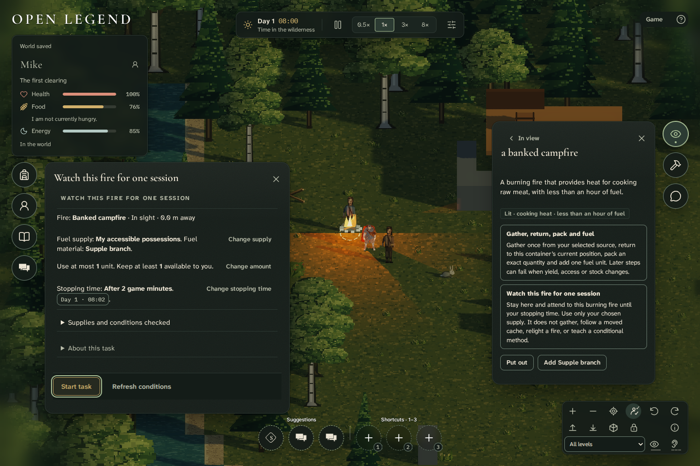

**1440 × 960; actual App with controlled transport and recorded native care views.** Source is commit `32cd1af8851fb2db115ce8cd999655dca2964afb`. This is the first original PNG from the passing finite Activity observation.

The world object supplies the fire target, and the current draft reads as a short summary: possession source, chosen material, amount/reserve and a two-minute stopping time. Each Change control opens the relevant editor. The checked-condition and explanatory disclosures stay collapsed here, leaving the primary Start action easy to distinguish. Its visible keyboard outline shows where the next input will go. The title is still repeated in the panel header and body; that repetition consumes space without adding information.

The surrounding interaction checked ordinary Cancel return, a real material choice, newer Done focus, ordinary editor returns and newer Start focus across normal browser frames. The picture itself shows only the final prepared state. It does not show those intermediate focus transitions or establish a newly executed native task. The useful lesson is to keep the chosen object and current choices legible while allowing focused edits, with one clear place for the next action.

### 64 — Original work remains identified after choosing another task

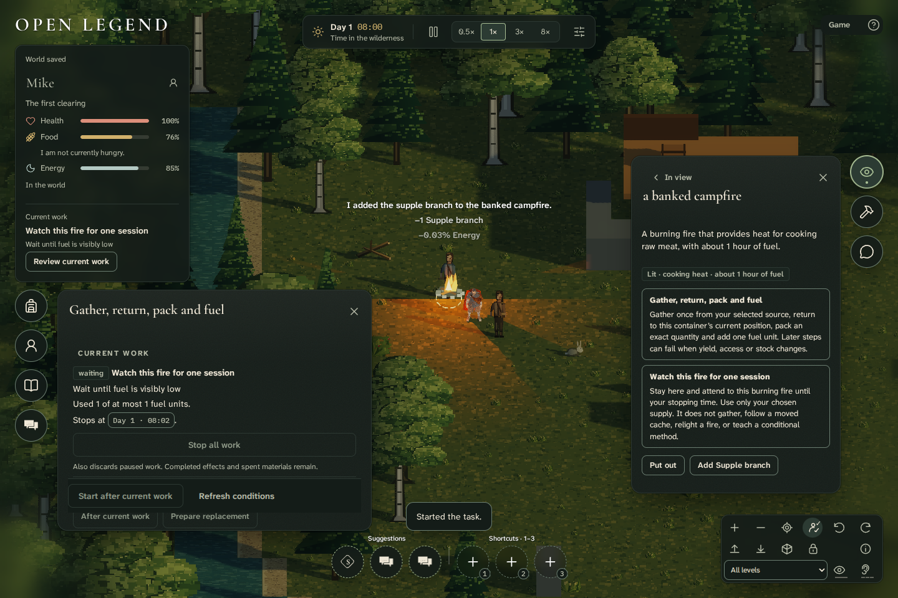

**1440 × 960; actual App with controlled transport and recorded native care views.** This is the second original PNG from the same passing observation. One original Start was held while the player opened the other task; its recorded success and working view were then delivered.

The new preparation is named in the panel heading, while Current work still names the original fire task. One global “Started the task.” notice reports the result after its original local receiver has gone. The new task did not receive that local success or have its preparation folded. The trace separately verifies the exact original pending request remained and its recovery control was rendered, without a receipt read or another command.

The first-screen reading order is limited: original current work occupies most of the shortened left panel, the recovery reader is below the captured fold, and the sticky Start footer partly covers the lower work-mode row. The body remains scrollable, with the recovery block before the final sticky action item; the saved view is at the top, and no maximum-scroll failure proves these controls unreachable. Scroll reachability was not exercised or accepted in this sequence. This image therefore supports a reading-space critique, not a claim of easy or fully visible recovery. A useful direction is to give the pending result and new preparation more prominence while keeping the current-work summary concise.

The world caption and current-work values come from a previously recorded native view. This observation checks client focus, acknowledgement ownership and request retention, not new native effects, the second task's admission, completed receipt recovery or whole-interface acceptance. Both screenshots are byte-for-byte copies of the original captures; they are runtime evidence and do not add to the external-game research count.

A later corrected observation is preserved in [65 — Recover the original action before preparing another](#65--recover-the-original-action-before-preparing-another).

### 65 — Recover the original action before preparing another

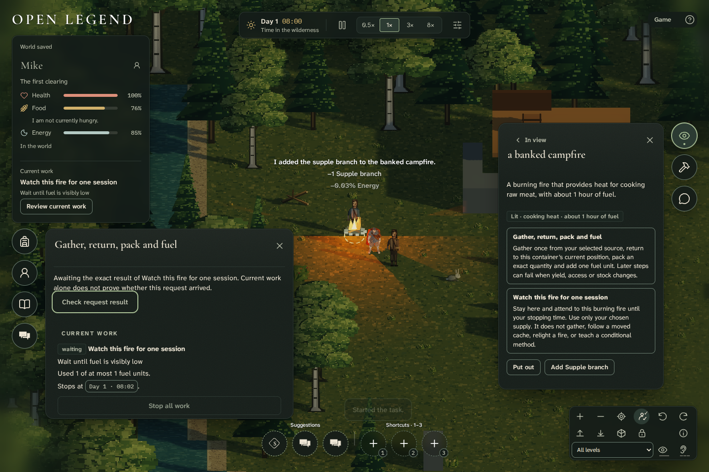

**1440 × 960; actual App with controlled transport and recorded native care views.** Source is commit `bb537aaa46f4d772022d0f153c0819f5413b2561`. This original PNG comes from the passing 28.007-second observation: one Start, zero receipt reads or command replays, and one capture. The [verification record](../../verification/game-interaction-redesign.md#desktop-recovery-reading-at-bb537aaa) preserves the exact result and the earlier failed preparation on `ee1da9a`.

The player has opened **Gather, return, pack and fuel**, but the unresolved request still names **Watch this fire for one session**. Its full explanation and **Check request result** now appear before Current work. That order helps the player identify the action whose outcome needs checking before preparing another. The new task keeps its own preparation; receiving the earlier result neither assigns that success to the new task nor removes the original request. While that request is unresolved, the final preparation actions stay in ordinary flow instead of covering the work-mode row.

The explanation and recovery button were wholly inside the panel before focus or scrolling: y542–645 and y595–633 respectively, within the body at y526–851. The runner then initialized focus on the existing Hide control and used one ordinary Tab to reach **Check request result**. Its clear focus outline is visible here, with the panel still at scrollTop 0. This is a local keyboard transition; the recovery action was not pressed.

The 325px-high body still requires scrolling through Current work and the full new preparation. After this screenshot, four ordinary wheel gestures reached the complete 587px scroll range and exposed all three work-mode buttons, **Start after current work** and **Refresh conditions**, without overlap from the final action row. Those later positions are recorded in the report and trace; this first-screen image does not depict all controls. The tradeoff is deliberate: the unresolved outcome gets the first reading space, while the remaining preparation stays available by scrolling.

The same immediate keyboard material choice also passed the original five-second dialog-hidden assertion after the scoped picker-exit correction. This finite observation retains the original request exactly and confirms owned cleanup; it adds no native effect, second-task choices or admission, completed receipt recovery, performance explanation, operating-system input or uncoached-player acceptance. The fading global toast is not used as evidence of readable text in these pixels. All earlier failed observations remain preserved.

## Inventory detail stays inside the viewport

### 66 — Pointer Close passes but the narrow detail is clipped

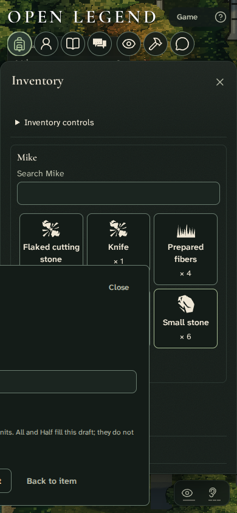

**390×844, actual App with controlled recorded native data, source `da67d557e1e5e394c7ff32b8910f9c5ec415f6b9`.** The item detail is 366px wide but starts at **x=−120**, so its left side lies outside the screen. The player cannot read the complete subject, amount label or Drop action. Keeping one hittable Close button does not make the panel usable. This is a placement defect: beside-the-item positioning can choose a side even when neither side has enough horizontal room.

The preceding ordinary pointer Close and focus-return assertions pass. This capture is taken after reopening the same stone and choosing Drop an amount again, which starts with the available six; the offscreen value is established by the interaction record, not these pixels. The first observation did not assert full popover containment, so its passing interaction groups coexist with this visible defect. The older five-second pre-dispatch pointer failure at `3bbfc7b` remains separately recorded and undiagnosed.

### 67 — Narrow detail keeps the complete item and controls visible

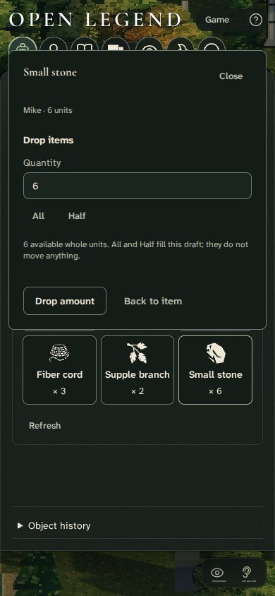

**390×844, actual App with controlled recorded native data, source `af369fc2c7ba55d6621d49c18cff47f7513f7bf4`.** The same 366px-wide detail now fits from **x=12 to x=378**, with the complete item heading, quantity editor and both actions visible. The App’s existing sheet decision selects vertical placement for the existing popover; its overlay owner can then keep the detail inside the viewport width. The regular desktop keeps its side placement. This small change preserves the selected item and amount rather than constructing another detail owner when the layout changes.

The observation sets an unsent amount of three before narrowing the viewport and confirms it remains three afterward. A normal pointer Close then dismisses the editor and returns focus to the stone without a command or receipt. This original image follows that Close and reopen, so it shows the fresh available amount of **six**, not the retained three. Full popover, heading, Quantity, Drop and Close bounds are asserted separately. The desktop capture from this corrected run is byte-identical to the earlier desktop capture and is not added as another gallery image.

### 68 — A short screen keeps the unsent three-unit amount

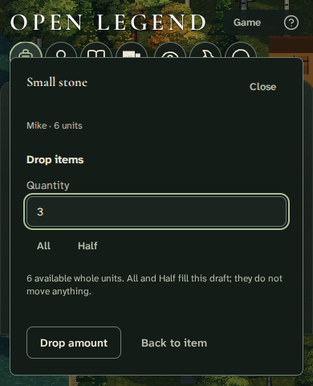

**390×480, actual App with the same controlled inputs and corrected source.** Reducing the viewport height preserves the unsent **three** and keeps the entire detail between y=71 and y=467. The item heading, Quantity, Drop and Close remain visible together. An ordinary upward wheel leaves the existing scroller at its top; this scene requires no scrolling to expose those controls. The image is captured before the final pointer Close, whose later assertion confirms dismissal and focus returning to the same stone. Drop is never committed.

The [verification record](../../verification/game-interaction-redesign.md#inventory-detail-placement--october-7-2026) owns the finite result: the corrected observation passes all three groups in 26.994 seconds with the original five-second pointer deadline. It records zero commands, receipt reads, unexpected API requests or canvas pointer/click events during these Inventory controls, with clean trace/context/browser/host cleanup. It does not include an exposed-world outside-dismissal click. These observations use the real built App and PlayCanvas, byte-exact recorded native `/api/state`, and an explicitly controlled Inventory collection envelope around that view’s native inventory data. Entry/presence acknowledgements are controlled. There is no current native server, database, provider request or newly accepted game effect.

The [manifest](manifest.json) pins each source, all recorded inputs, 20 source files, 16 production assets and the unchanged original PNG bytes. Raw reports and traces remain outside the repository. The original observation’s report SHA-256 is `8fbf6da7ac8d70dac4f054be7fcc608d9f9b8e5556685af8c49064f873aa7760`, and its trace is `f908855dc9a09bca28cc3a9e91bce04d505f76e9f37ac0fd5c91ac90701490d4`. The corrected report is `186e758cc9b43f17b9f3c5bf39fb570c1ae1a40a6e9672062cdf8172c4c41515`, and its trace is `c36c442487297c4c935934df22e26066c42088c3987debbfd1b4bf2632f189c1`. Both complete trace archives pass CRC inspection. These three implementation pictures do not increase the 98 external-game references or close broader input, display, native-journey or uncoached-player acceptance.

## Native completion and two-player storage

### 69 — One second before the chosen stopping time

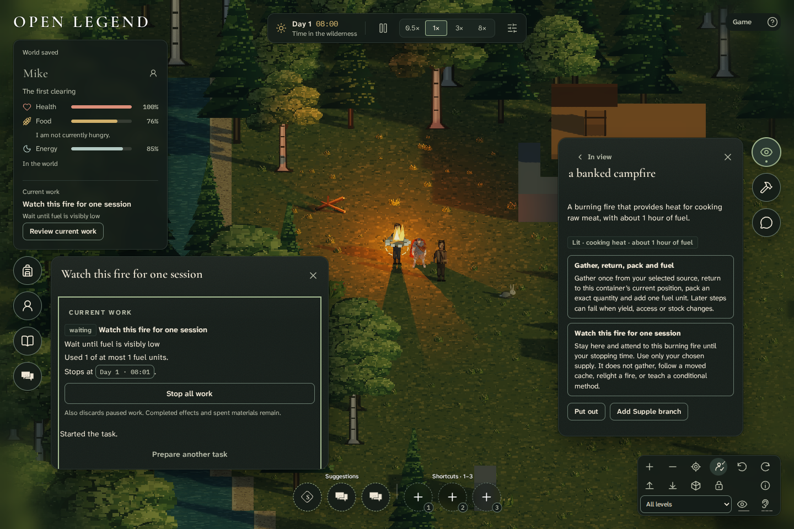

**1440×960, actual App/server/PostgreSQL, branch `0f449430`, native CI checkout `ee04c033c34c0525ad1e6f86b176683b04b33ddd`.** At simulation time 59, the task remains waiting until its chosen deadline of 60. The panel names the fire-watch task, reports one of at most one fuel units used and keeps **Stop all work** available. The HUD also identifies the ongoing work. The player can read the current state and consequence without reopening the preparation fields.

The native observation starts once through the actual UI, reads that original receipt and completes one fuel action, leaving one of the player's two branches. It supplies a reachable player stance and 600 seconds of fire fuel as fixture setup, then offers native time explicitly. This qualifies the resulting task presentation and deadline connection; it is not evidence of walking or wall-clock pacing. The image precedes the natural completion shown next.

### 70 — Care completes, while the retained panel wording lags

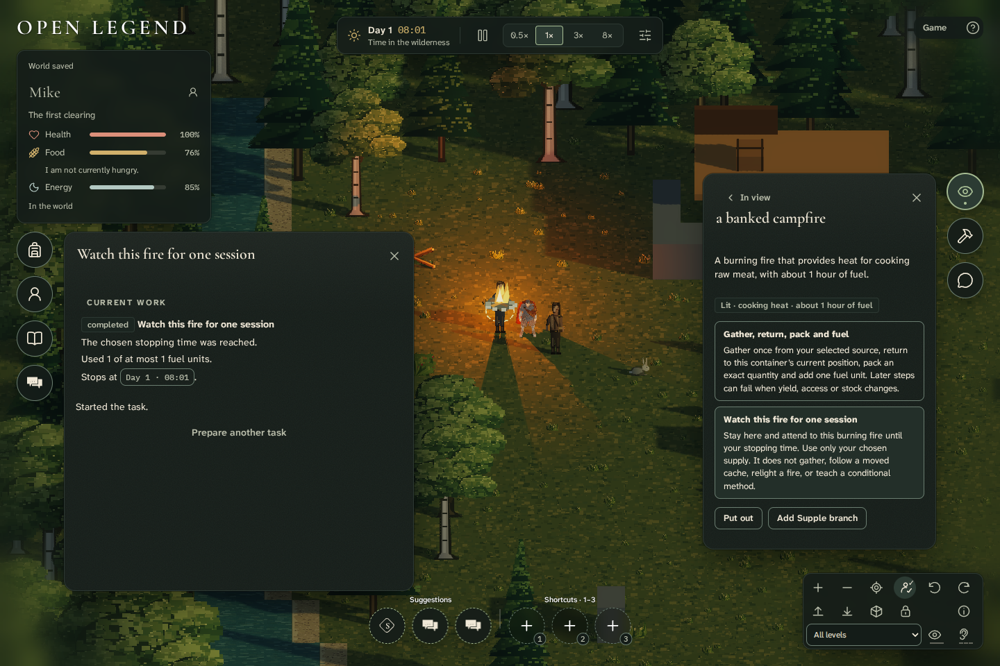

**1440×960, same native observation, original wording preserved.** The task completes at exactly simulation time 60 without a Stop or replacement command. Its **completed** status and “The chosen stopping time was reached” reason are truthful; **Stop all work** is absent, and the HUD no longer advertises current work. Reopening the same fire task does not restart it. These are useful completion behaviors, but the retained panel still calls itself **Current work** and says **Stops at** as if the deadline were ahead. Those labels should agree with the completed state. This capture preserves the inconsistency before its separate correction.

The visible **Started the task** line is the earlier acknowledgement, not evidence of another Start. The later interaction record confirms that deliberate preparation retains the one-unit budget, one-unit reserve and one-minute duration, while native time reaches 61 without another command or debit. The [native care record](../../verification/game-interaction-redesign.md#native-care-completion--october-7-2026) passes in **41.156 seconds** with one Start, one original receipt, one attempt and one fuel event. Shutdown saves revision 10/time 61, all owned cleanup passes and native provider usage/jobs remain zero. This pass does not qualify native assistive input or uncoached use.

### 71 — One branch reaches Mike and both panes refresh

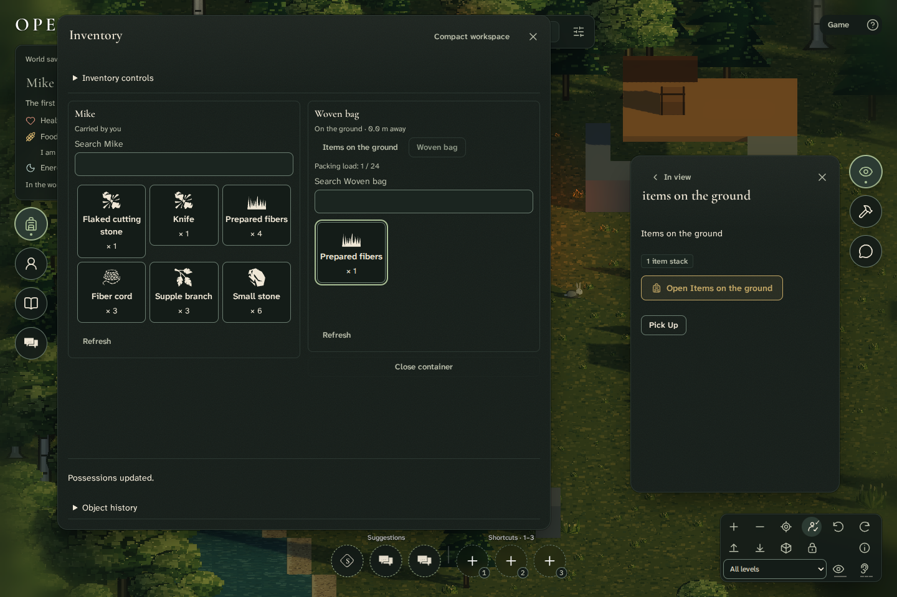

**1440×960, actual App/server/PostgreSQL, separate shared-storage observation at the same branch and native checkout.** Mike and Ada use distinct authenticated fixture accounts, characters, browser contexts and native scopes. Both open the same native bag from its ground pile. Two ordinary **Shift+Enter** gestures request the same last branch; only transport timing is coordinated before the real requests reach the native owner. Mike's transfer succeeds and merges into his existing carried lot, changing its quantity from two to **three**. The bag refreshes to show only its untouched prepared-fiber marker, and the original success appears below the collections.

The adjacent named collections make the changed custody visible without asking for a destination dropdown. The original native receipt matches this one transfer. The bag, one branch, marker and second actor's reachable stance are supplied fixture setup; they do not establish gathering, walking or access-grant UI. The second identity uses existing durable enrollment/session owners, so this is independent gameplay authority without an external identity-provider qualification.

### 72 — Ada receives the exact competing refusal

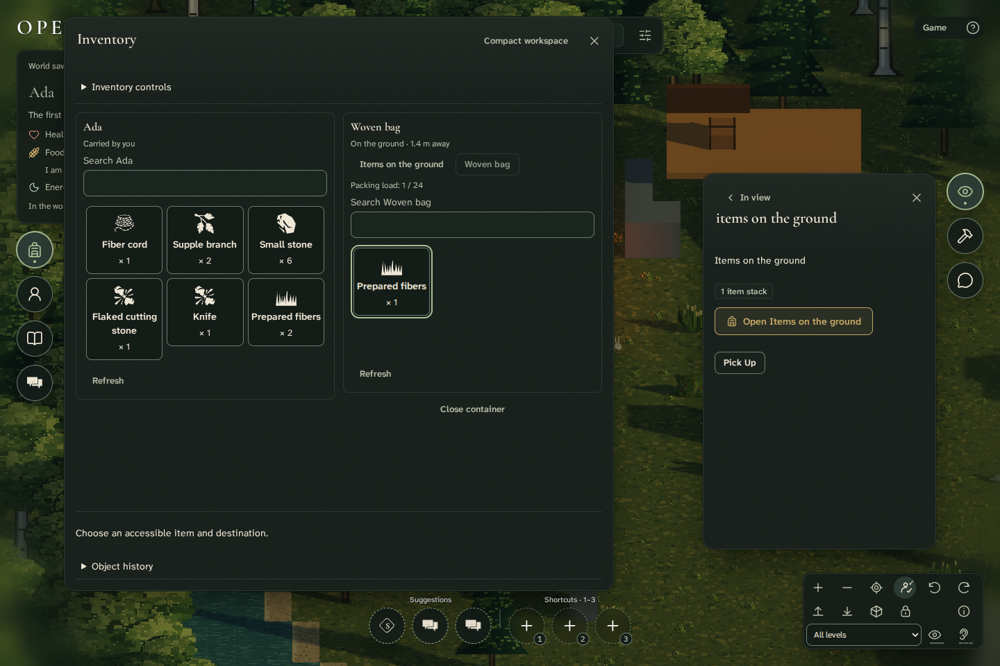

**1440×960, the other actual account and character in the same observation.** Ada keeps her original **two** branches and receives the native message “Choose an accessible item and destination.” Her original request resolves to that refusal; it creates no second transfer. Both views show the bag's branch has gone. Together the native count assertions establish five total branches before and after the contest: two carried by each actor plus one in the bag become three, two and zero. The feedback is accurate but generic; the refreshed source collection supplies the visible explanation that the last branch is no longer there.

After these pictures, the runner revokes Mike's **bag access** while its marker is visible. His rows disappear and a fresh native read returns **HTTP 400**, without contents; Ada retains access. After restoration, one genuinely permitted native response is fetched and held across another revocation. Its transport fulfillment completes, but its browser request has already been canceled with **net::ERR_ABORTED**. The current denial and zero displayed rows remain. This establishes cancellation and current denial, not consumption of an older payload; it does not test revoking the account's world grant.

**The shared observation remains failed.** Its third, revoked-pane screenshot times out at the original **10-second** capture limit and is absent. The preceding contest and access checks complete, but the final post-capture quantity/control/command-count/native-AI sweep is not reached. The two captured images are the actual contest states and do not illustrate the later denial. Total elapsed time is **77.967 seconds**; shutdown saves revision 16/time 0 with no reported problems, and both traces/contexts, server, repository, browser and owned database close. Startup asserts zero provider budget and empty credentials; the unexecuted final usage sweep is not promoted to a pass. The [native shared-storage record](../../verification/game-interaction-redesign.md#native-shared-storage--october-7-2026) retains that failure and its original scope; no screenshot or performance cause is established.

The [CI job](https://github.com/Macrofold/OpenLegend/actions/runs/37575596132/job/112643659537) preserves all ordinary required checks. The **temporary-native-ui-observations** artifact `11462598153` contains these four original PNGs and both reports: 3,505,720 bytes, SHA-256 `a0eb9990ca7c1b3e0eff678697b81a1a164e32507a87f9975764bac8064dca28`, with digest and archive CRC verified. Care report SHA-256 is `8d39549e77d1f1fd3a74b56d29724d18eb48cedf9b31e8dd1f521c15f8ccaf58`; shared report SHA-256 is `d01adf23ec89ad943844085f7a7c38ecac08f3061fae159021e2f92c810902e1`. Full native traces remain in the separate original **spatial-browser-evidence** artifact `11462513214`; those trace archives have not been downloaded or inspected for this gallery. The manifest pins the source, actual merge checkout, runner/build entry, reports, artifacts and each unchanged PNG. These additions leave the external research count at 98 and do not close whole-interface or uncoached-player acceptance.

## Remaining acceptance

The [current implementation map](../interface-coverage.md#current-runtime-candidate) identifies changed and reused controls across 60 surface groups, preserving the 58-group historical audit and its original evidence. The [UIUX tracker](../../maintainers/ui-ux.md#uiux08) retains the remaining complete inventory/camp/consent and creator journeys, real operating-system IME and assistive devices, broader text/display combinations and uncoached player observation. Captures 24–27 and their native record qualify the bounded bag/remains session; 28–31 qualify the separately described alternate-world session and expose an active-task presentation defect. Captures 32–33 show the subsequent component correction within the limits described above. Captures 34–37 preserve the native creator result and its presentation defects; 38–41 show the subsequent controlled-component correction, with native values reused only within the stated scope. Captures 42–43 add the bounded controlled creation-recovery evidence described above. Capture 44 adds the visibly dirty native editor and its separately recorded one-name save; its later restore and cleanup fail. Captures 45–48 add the passing finite native camp connection, supplied consent decisions and retained conversation draft within the limits described above. Captures 49–52 add the passing deliberate approach, exact transfer-result recovery, care replacement/Stop and physical Sling connection. Captures 53–55 show the retained unconfirmed creation requests whose subsequent exact native retries pass. Captures 56–57 show the unsaved person draft and explicit protective-load confirmation from the later passing owner session; its native record qualifies both protected App returns and the Operations/Return connection. Capture 58 preserves the oversized Inventory before its separate space/focus correction; its two passing feedback phases do not make the interrupted observation a pass. Image 59 preserves the later narrow hierarchy problem; images 60–62 show the corrected header, with the recorded refusal/unknown sequence qualified separately from their pixels. Images 63–64 qualify their finite focus/task-switch sequence while retaining the reading-space critique. Image 65 qualifies the subsequent desktop recovery-first layout, local Tab route and separate scroll exposure within the stated controlled scope. Images 66–68 preserve the later clipped Inventory detail and corrected desktop/narrow/short pointer-and-quantity observation within its controlled presentation scope; the earlier pre-dispatch pointer failure remains undiagnosed. The original God editor width and Time failures at `a4e02cc`, all-seven passes at `4e92101`/`949806c`, and later Time failures at `3bbfc7b`/`32cd1af` retain their own source-specific scope. The [recorded checks at `bb537aaa`](../../verification/game-interaction-redesign.md#ordinary-checks-at-bb537aaa--october-6-2026) pass the ordinary required workflows with their unchanged gates; each earlier failure retains its own source and result. Images 69–72 retain the native completion and two-account contest within their separate passing care and failed shared-observation scopes. These observations do not close the broader gates.
