# Open Legend implementation screenshots

**Reviewed October 6, 2026.** These 23 original screenshots show the whole-interface implementation candidate. They are separate from the [98 external game screenshots](../screenshots/gallery.md) and [nine design proposals](../wireframes/README.md). Each image retains its captured bytes; [the manifest](manifest.json) records dimensions, hashes and capture-specific source identities. This gallery explains the visible decisions; the [verification report](../../verification/game-interaction-redesign.md#whole-interface-runtime) owns actual results, earlier failures and remaining acceptance.

## How to read the images

Images 01–09 render the production App and PlayCanvas scene after main merge `164e43` and picker correction `ba33c1c`, including the subsequent conditional shortcut-overlay rule. They use current native public views with controlled access, HTTP history, inventory-page transport and an empty action catalogue. They are actual implemented UI, not drawings; the transport is not authenticated PostgreSQL gameplay.

Images 10–17 and 19 show production components in their focused implementation checks before the final main merge. The empty background and any small test-navigation buttons belong to that isolated check, not the game's navigation. These captures illustrate their inspected composition and failure states, not the final whole-App placement. Image 18 uses the current merged native projection in the actual activity component. Dummy names, tokens, dialogue and reviews are controlled example data; no provider or account operation was performed.

Images 20–23 show the October 6 narrow-layout corrections. Images 20, 21 and 23 use the actual App/PlayCanvas with controlled native public views and HTTP transport; image 22 uses the actual creator components in a bounded Panel host. Their exact source hashes are separate from the older captures. Image 23 includes the keyboard-outline correction at `296ae67`. The creator question image predates the later local choice-strip focus correction and retains that source identity; it is not relabeled as a final full-App capture.

The screenshots establish what was visible in those states. Keyboard operation, retained drafts, request identity and native work behavior require the linked interaction evidence. Real operating-system IME, assistive devices, broader displays and uncoached player observation remain open.

## Playing and choosing an action

### 01 — World and character first

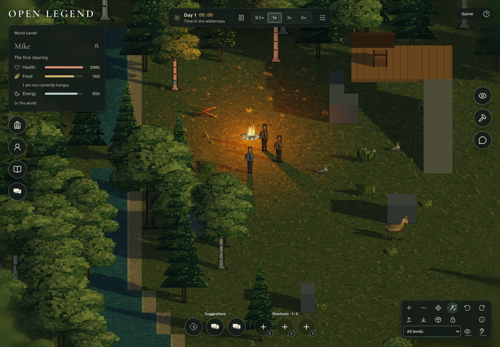

**1440×1000, App.** The upper-left summary answers who is being controlled, where they are and which conditions matter. Simulation time, camera controls and the two action groups have distinct places. Task launchers leave the world visible. This is the current base-world content; the labels and meters are supplied by that world. A screenshot cannot establish discovery by a new player, and the scene's current art/lighting is not a new visual-quality claim.

### 02 — Choose the subject in the world

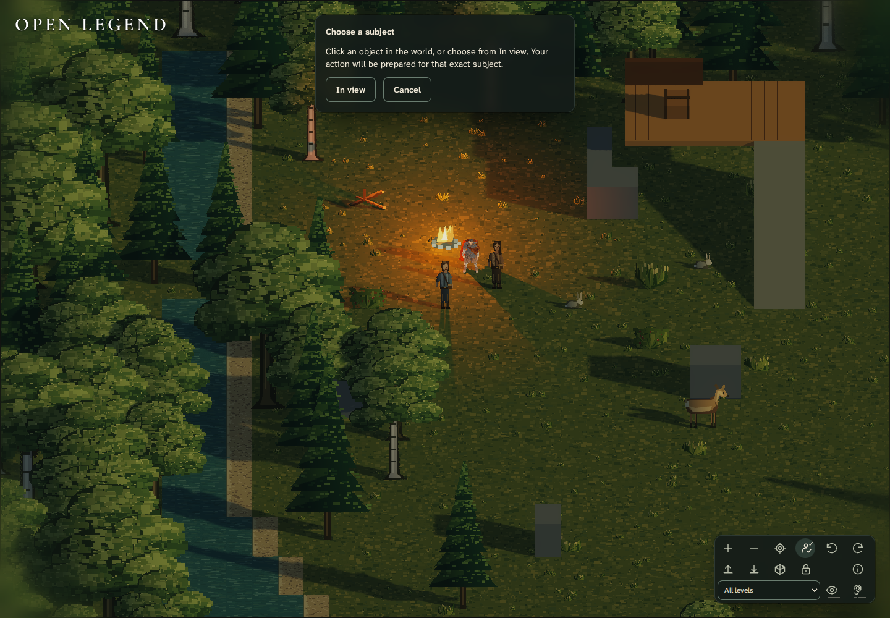

**1440×1000, App.** Choosing an action's subject temporarily clears the task panels so the player can point at the object. In view provides a readable, keyboard-accessible alternative. Selecting prepares the exact subject; it does not execute. Cancel restores the previous task and words. This applies the research principle that spatial selection needs the spatial scene, rather than another large selection worksheet.

### 03 — Optional words, explicit commitment

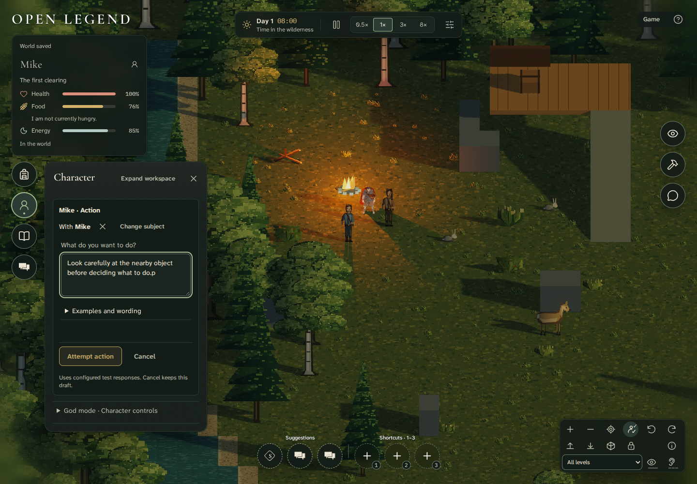

**1440×1000, App.** Routine actions already live with their object, item or capability. The optional intention task exposes the player's words and the exact subject without a target/item/tool/recipient/amount worksheet. The primary action and Cancel remain reachable beneath the scrolling field area. The final letter in the example was entered while checking that typing P does not pause the world; the displayed response configuration belongs to the controlled check.

## Belongings and work

### 04 — An item's menu belongs above its inventory

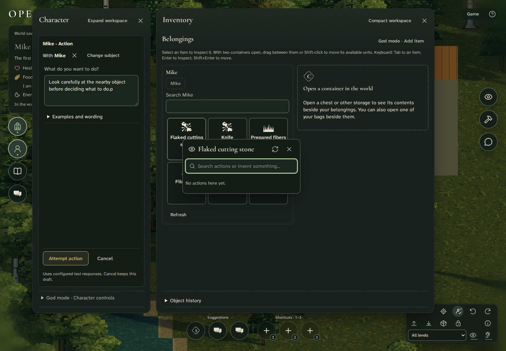

**1440×1000, App.** The inventory starts from belongings and a storage object opened in the world. Here no external object is open, so the second pane explains that next step. A secondary click or Shift+F10 opens the exact carried item's context; Close and Escape return focus to that item. The empty action result is deliberately controlled to test menu ownership and focus, not evidence that the real stone has no actions. The earlier hidden-menu defect was corrected in the shared overlay owner.

### 05 — Stable shortcuts have a local editor

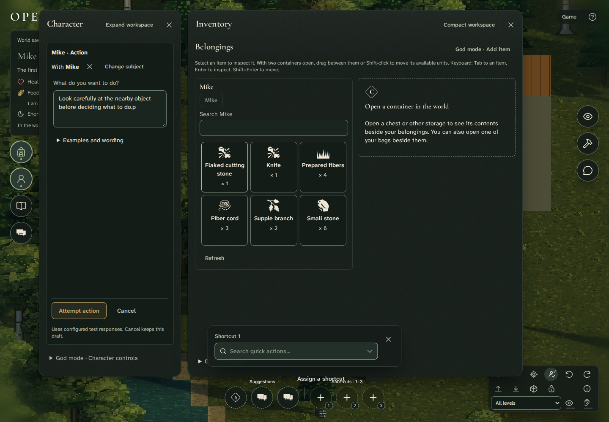

**1440×1000, App.** Shortcut assignment is a small task attached to its numbered slot. Its searchable catalogue stays above an expanded workspace and returns focus on close. Ordinary suggestions and the player's three retained assignments remain distinct. This image exercises the overlay correction; it does not show native execution of an assigned action.

### 18 — Work can exist while action is unavailable

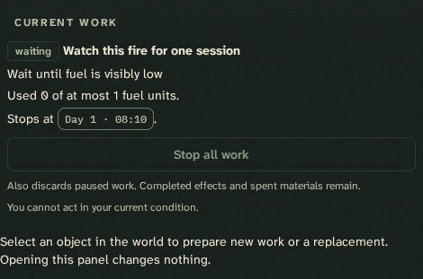

**470×311, native projection and component.** An incapacitated character still has waiting work. The UI shows the work, the material/time facts and the native reason Stop all work is unavailable. The cancellation consequence is explicit: paused work is discarded, completed effects remain. Actual native admission and body effects supplied this projection; pointer attempts emitted no commands. This bounded result does not qualify the complete authenticated camp journey.

## Reading and conversation

### 06 — A Journal with a reachable end

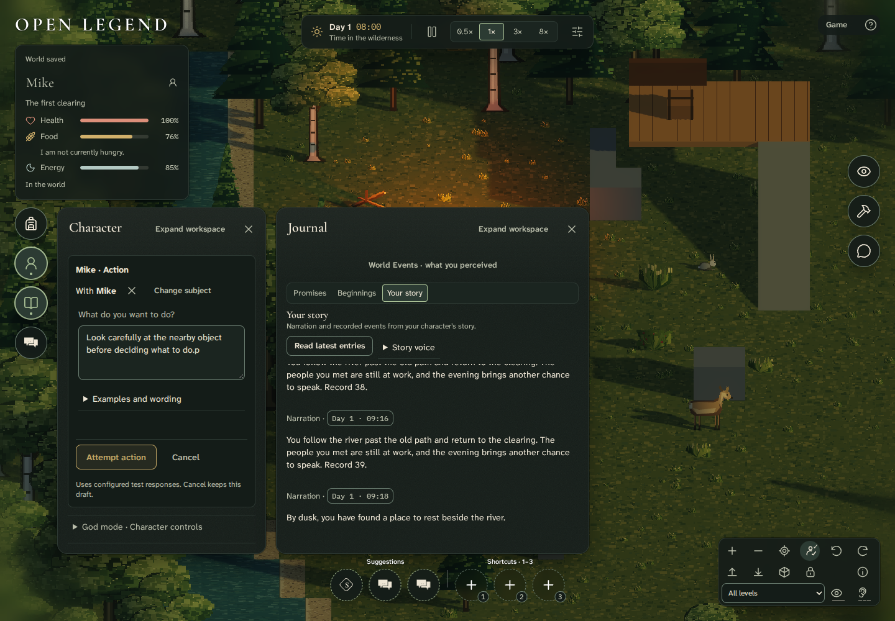

**1440×1000, App.** Promises, Beginnings and Your story remain distinct. The World Events route explains that it contains what the character perceived. The reader controls stay above its own scroller, and the final row of the 40-entry example stays inside the panel. The adjacent action draft remains intact. The prose is controlled layout content, not newly generated narration or native history-search evidence.

### 10 — Conversation keeps the recipient and message together

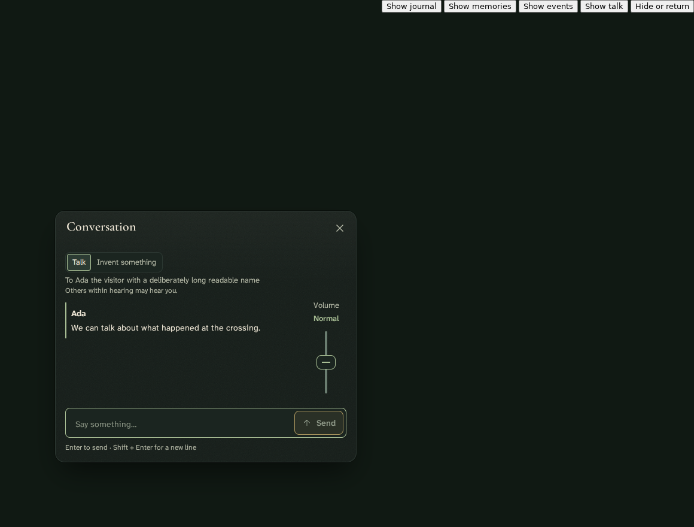

**1160×880, component.** The selected person and hearing reminder frame the transcript; volume has its own narrow control, and the message stays with Send. The long example name checks wrapping. Interaction checks separately cover composition, explicit send and retaining an uncertain original message when another recipient receives a successful send. The small top-edge buttons are fixture navigation, not product controls.

## Settings, entry and recovery

### 07 — Enlarged text changes the arrangement

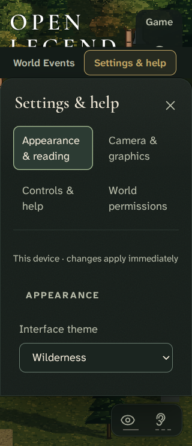

**320×740, 130% interface scale, App.** Category names use two columns instead of a tall one-column list, with the selected task and Close retained. Settings scroll beneath the header; they are not all visible at once. The shown controls stay within the viewport, and Game stays above the open-task tabs. This is one observed width/scale combination, not a mobile or assistive-technology certification.

### 08 — A short window uses the task scroller

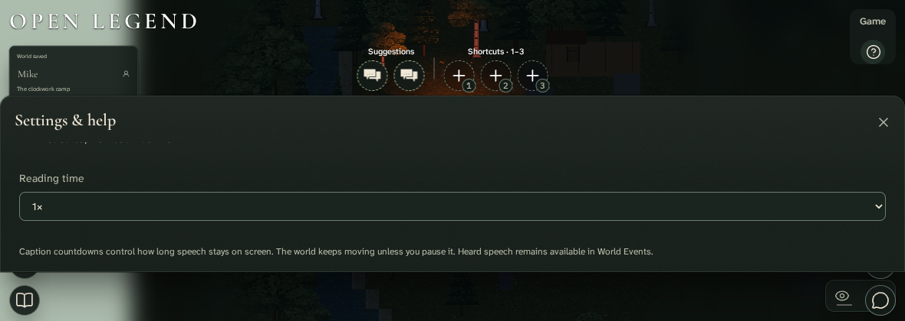

**1180×420, App.** Scrolling brings the caption-reading control and its consequence into view without moving the game page. The control was measured inside the panel's visible bounds. A short viewport has little simultaneous context; this capture demonstrates reachability of this setting, not ideal reading space for every possible combination of controls and text.

### 20 — Camera and shortcuts share available space

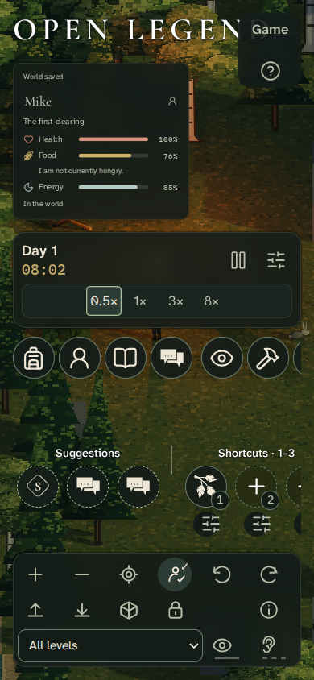

**390×844, 130% interface scale, App.** Suggestions and retained numbered shortcuts remain distinct, and the existing camera controls fit inside one lower scrolling region. Their earlier independent positions overlapped and pushed configuration controls beyond the viewport. The correction gives layout ownership to their common region while retaining every capability. This view still devotes much of a narrow screen to the HUD; some launchers and shortcuts require horizontal scrolling. The benefit is reliable access and separation, not a claim that all controls are visible or that this density has passed new-player observation.

### 21 — A short viewport exposes the scrolling tradeoff

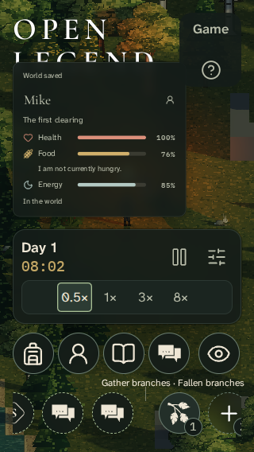

**320×568, 130% interface scale, App.** The plain tooltip stays attached to the shortcut and can appear outside the lower region's clipping. It names both the action and its selected source. Actual wheel/keyboard checks reach the other controls through the local scrollers without moving the camera. The camera is below the visible part of that region in this capture, and the decorative title wraps beneath the HUD. This is a deliberately constrained case: it demonstrates a bounded overflow strategy and a visible explanation, while making the remaining density problem explicit. Tooltips supplement reachable action details; they do not supply an essential instruction that exists only on hover.

### 23 — Closing a task returns visible keyboard focus

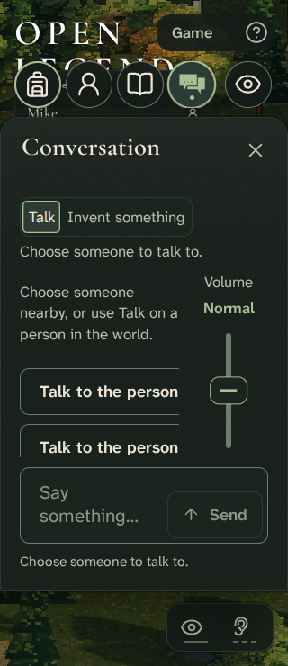

**320×740, 130% interface scale, App.** Enter on Hide Inventory returns focus to the Inventory launcher and reveals it in the horizontal strip. Its complete outline remains inside the scroll boundary. The green Conversation launcher describes the still-open task, so selected/open state and keyboard focus remain visibly distinct. The earlier outward outline was clipped even though focus ownership was correct; this is why a focus assertion alone was insufficient. The retained conversation is controlled example content, and this image establishes no successful message send. The [focused interaction record](../../verification/game-interaction-redesign.md#narrow-controls-and-creator-reading) records the unchanged toolbar reentry behavior and exact bounds.

### 11 — Saving and recovering have different meanings

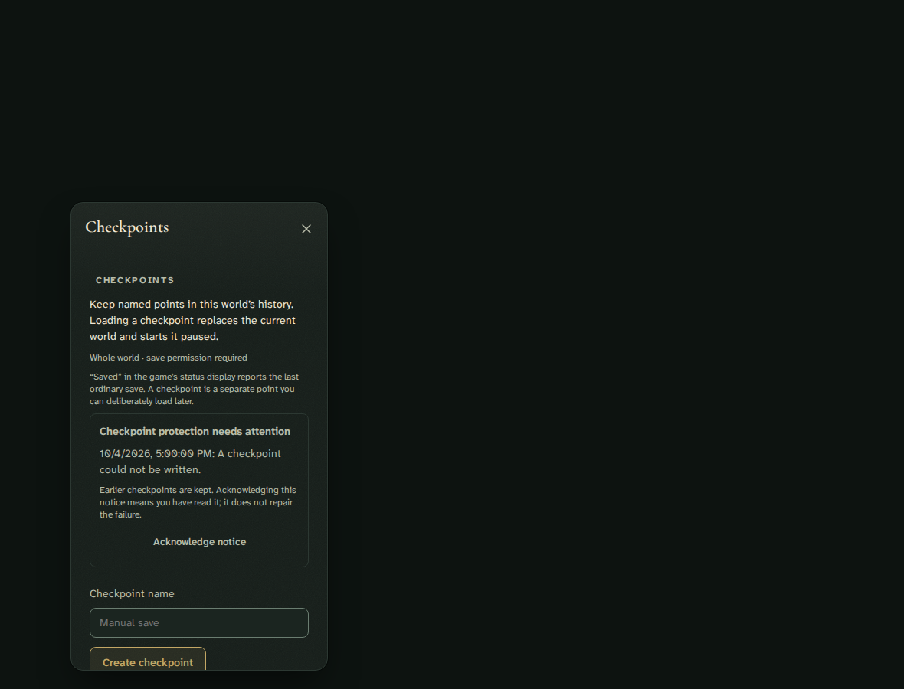

**1180×900, component.** Named checkpoints are separate from ordinary automatic saving. Loading replaces the current world and starts it paused. A protection failure remains visible; acknowledging it only dismisses the notice and does not pretend to repair storage. The catalogue and creation controls continue in the panel scroller. Exact original-request recovery and named load/delete confirmation are interaction checks, not outcomes established by this one image.

### 19 — A past invitation does not prove current access

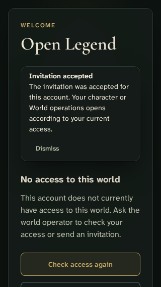

**320×568, component.** The invitation receipt and current permission answer different questions. The screen retains the historical receipt but clearly states that this account cannot currently enter, with a deliberate access check. Other entry actions continue below through the existing scroller. The fixture did not create or revoke a real invitation or account.

## Creation and private inspection

### 14 — Create has recognizable destinations

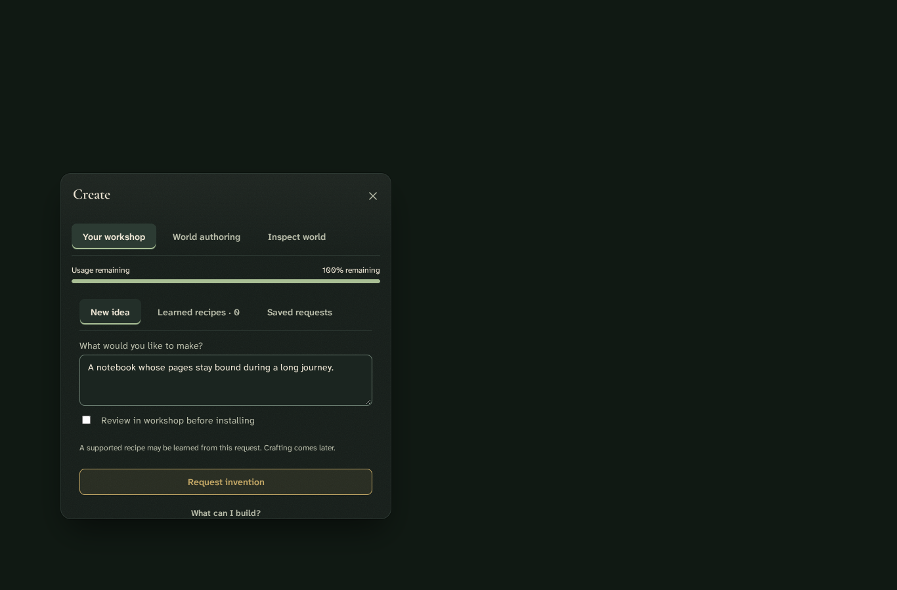

**1366×900, component.** The player's workshop, authorized world authoring and inspection have separate routes. A new idea stays intact when visiting learned recipes or saved requests. The request explains that learning a supported recipe does not itself craft the item, and review is an explicit choice. The meter is the abstract usage allowance supplied by the fixture; no model request was made.

### 15 — Review, approve and apply are different actions

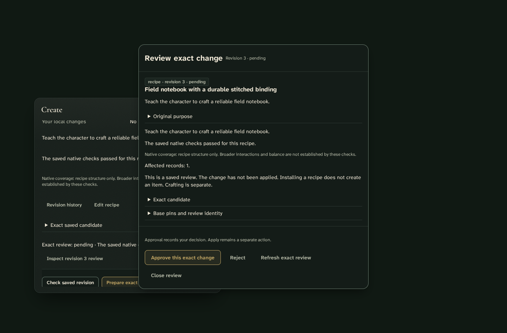

**1366×900, component.** A review names the actual saved revision, original purpose and affected records. Details remain inspectable, while the distinction between approval and Apply is explicit. The example's native-check statement is controlled report data, not a live validation or generated-invention claim. This is an appropriate structured creator decision; routine gameplay does not inherit the review form.

### 16 — A newer record does not erase an edit

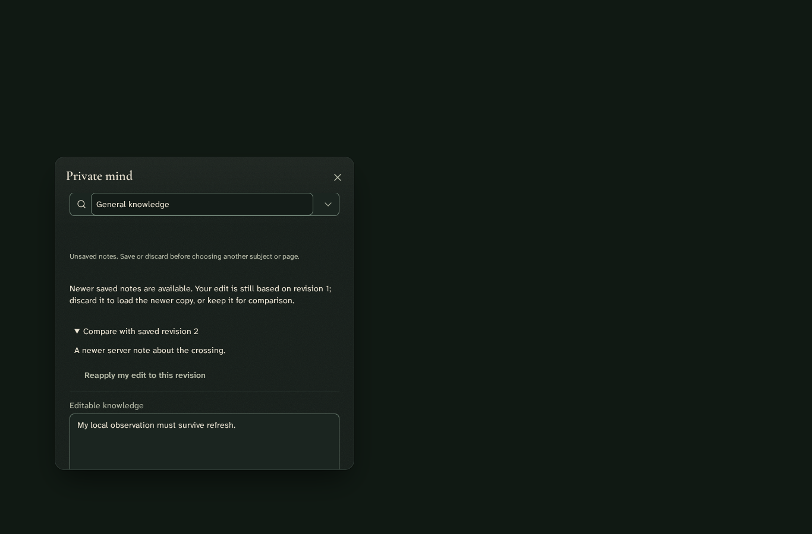

**1366×900, component.** The player can see which saved revision their edit is based on and compare the newer text. Reapplying or discarding is deliberate. A refused refresh retains the loaded editor and words. Only currently permitted private knowledge is eligible for this workspace; visible controls do not grant access. The example is controlled data, and native concurrent editing remains a separate gate.

### 17 — Diagnostics explain evidence honestly

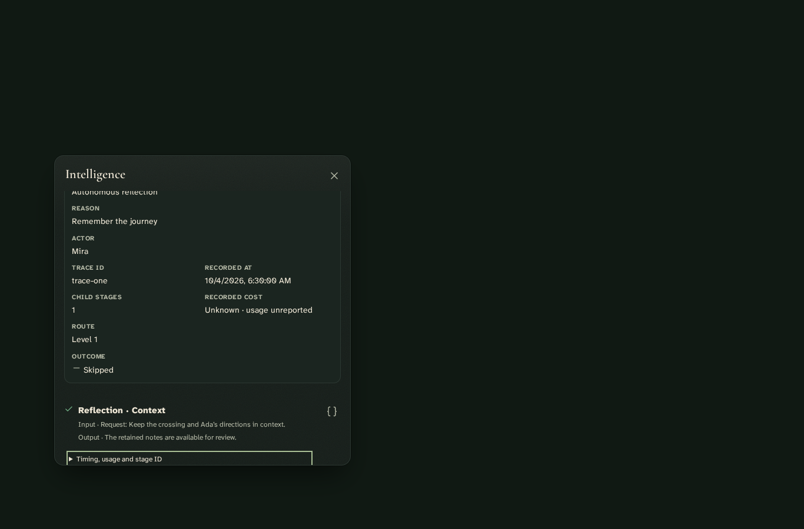

**1366×900, component.** Investigation detail is separated from ordinary play. The view identifies what happened and keeps stage detail behind an explicit disclosure; unavailable usage is labeled Unknown, not shown as zero. Focus and tooltip triggers use native elements. The visible trace is fixture data and says nothing about live model quality or measured cost.

### 22 — A new-reply cue must not cover an answer

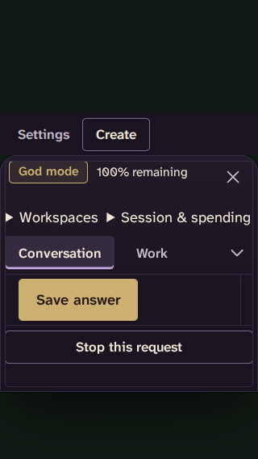

**320×568, 130% interface scale, two panels open, component.** The question has been scrolled to its Save answer action. The unread cue now occupies the existing Conversation/Work row instead of floating across that action. The complete answer button is visible, and Stop remains in the separate footer. The optional Workspace and Session controls share one row; their collapsed state saves reading space. The available reader is only about 62 physical pixels high in this extreme case, so the full question requires scrolling. That is a material compromise, not comfortable paragraph reading. The interaction check traverses the full question and verifies the complete button target, retained unread state and exact request recovery. The small Settings/Create controls above the panel belong to the isolated host, not proposed game navigation.

## Operating and authoring different worlds

### 12 — World operations has its own task hierarchy

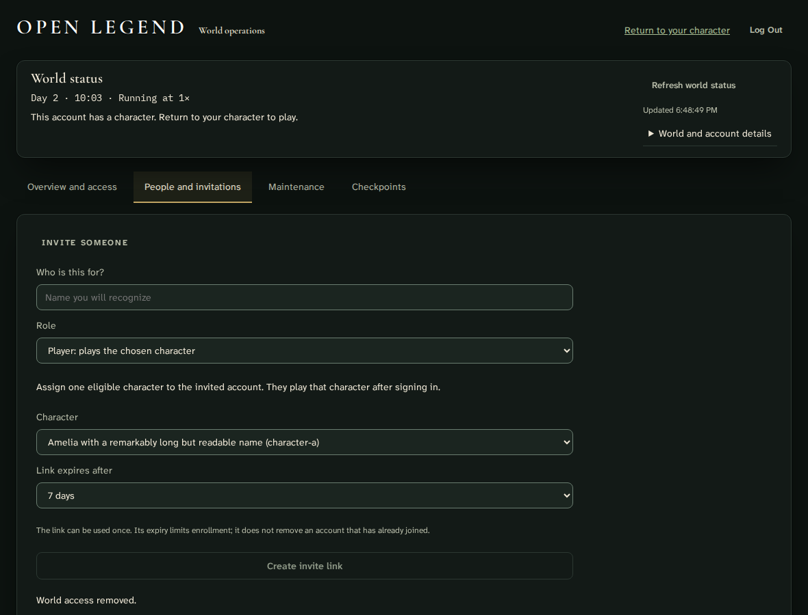

**1180×900, component.** The operator can return to the character directly. Current status comes before administration; invitations, access, maintenance and checkpoints have distinct destinations. The original selected character stays named when access changes. These are meaningful administration fields rather than fields required to perform an in-world action. No invitation or account mutation was performed outside the fixture.

### 13 — Maintenance status precedes schedule editing

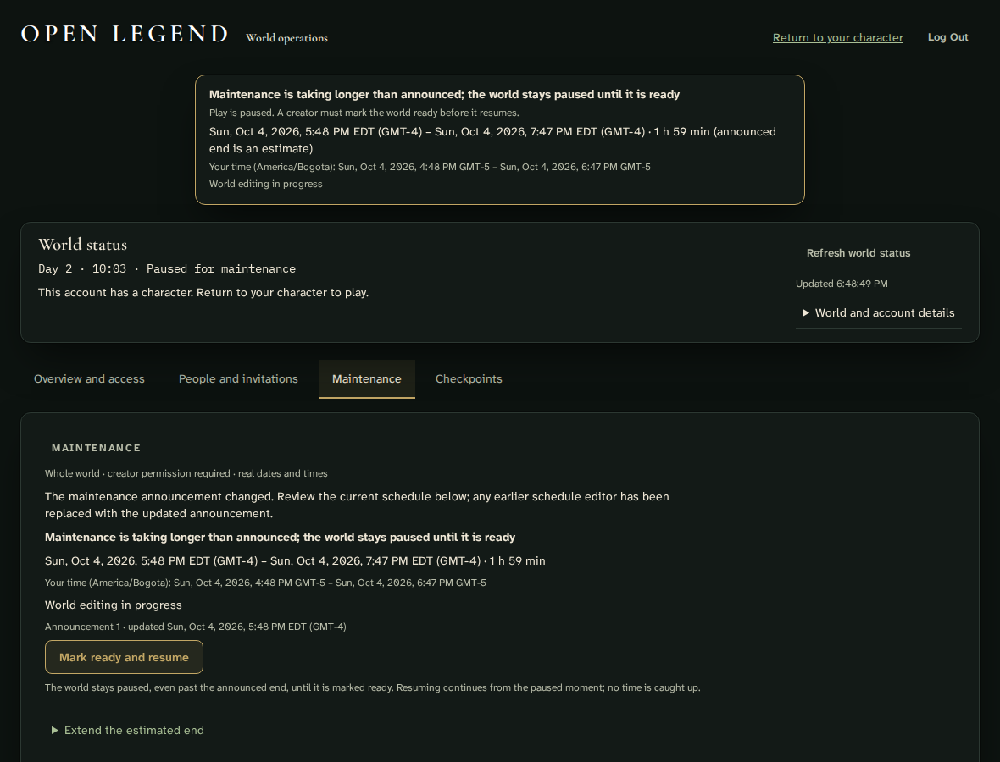

**1180×900, component.** The announced end is an estimate, and the current pause is clear. The authorized Ready action is separate from editing the estimate. Announced and local time are labeled, while schedule editing stays secondary. This capture uses controlled times and revisions; it does not qualify native scheduling, timezone edge cases or a real service restart.

### 09 — World rules supply their own presentation

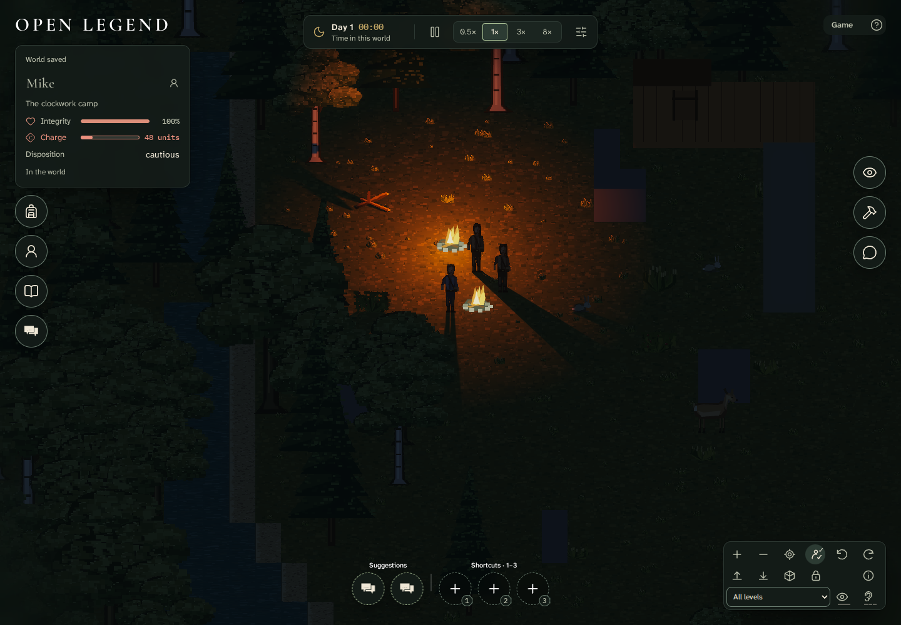

**1440×1000, App.** The existing reservoir world supplies its own location, time wording and character attributes to the shared shell. Its recharge task uses the existing native replenishment operation through the newly installed finite task presentation. A focused App check verified the old world's scene-label elements were removed; native checks separately cover charge transfer, stopping, duplicate commands and current-record restoration. Shared scene content does not make this arbitrary-world qualification, and the observed switch did not satisfy the separate five-second CI entry deadline.

## Remaining acceptance

The [current implementation map](../interface-coverage.md#current-runtime-candidate) identifies changed and reused controls across all 58 surface groups. The [UIUX tracker](../../maintainers/ui-ux.md#uiux08) retains authenticated gameplay/storage, complete inventory/camp/consent and creator journeys, real IME and assistive devices, broader text/display combinations and uncoached player observation. Screenshots and controlled interaction evidence do not close those gates.
