# Game interface screenshot gallery

**98 distinct digital UI screenshots from 12 games**, plus one explicitly excluded display photograph. Every image has a detailed critique in its linked dossier. The [atlas index](../games/README.md) explains selection and evidence; [index.json](index.json) records the verified count.

This expanded collection covers exploration and HUDs, object interaction, inventory, equipment and progression, actions and combat feedback, crafting and building, maps and journals, conversation, entry and help. Coverage varies by game; the dossiers identify gaps and distinguish documented behavior from visible layout and proposed lessons.

Original game imagery remains third-party reference material. Historical versions, developer previews, source crops and optional modifications are identified in the dossiers and per-game manifests. The nine original Open Legend proposal wireframes are separate and not counted.

[Baldur's Gate 3](#baldurs-gate-3) · [Divinity: Original Sin 2](#divinity-original-sin-2) · [Minecraft](#minecraft) · [Valheim](#valheim) · [Terraria](#terraria) · [Factorio](#factorio) · [Stardew Valley](#stardew-valley) · [Project Zomboid](#project-zomboid) · [Final Fantasy XIV](#final-fantasy-xiv) · [Guild Wars 2](#guild-wars-2) · [World of Warcraft](#world-of-warcraft) · [Disco Elysium](#disco-elysium)

## Baldur's Gate 3

[Detailed controls, workflows and critique](../games/baldurs-gate-3.md) · 16 digital screenshots

### BG3-01 — Single character inventory beside equipment

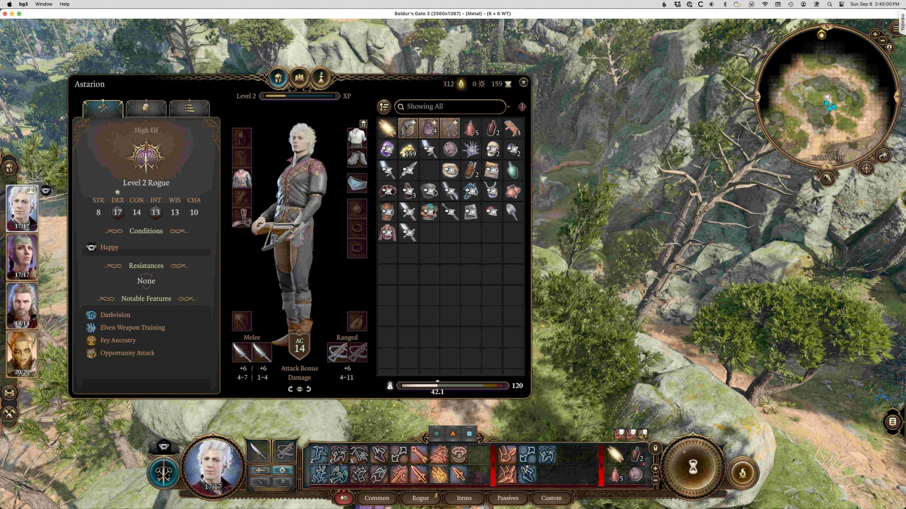

[Source page](https://argothald.com/2024/09/09/bg3-on-the-mac/) · [Detailed analysis](../games/baldurs-gate-3.md) · [Image provenance](bg3/manifest.json)

### BG3-02 — Four party inventories with equipment tooltip

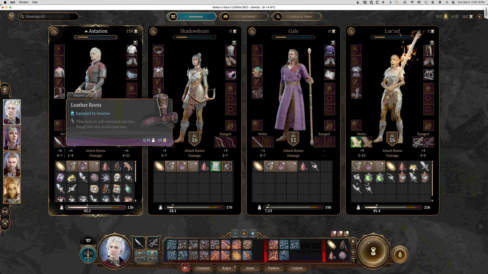

[Source page](https://argothald.com/2024/09/09/bg3-on-the-mac/) · [Detailed analysis](../games/baldurs-gate-3.md) · [Image provenance](bg3/manifest.json)

### BG3-03 — PS5 stacked party inventories and selected character equipment

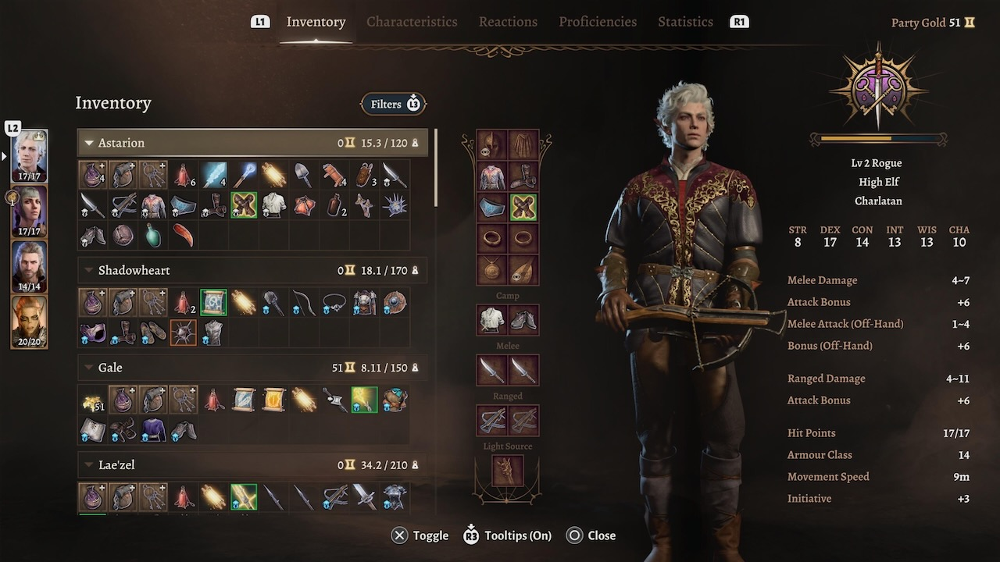

[Source page](https://argothald.com/2024/09/09/bg3-on-the-mac/) · [Detailed analysis](../games/baldurs-gate-3.md) · [Image provenance](bg3/manifest.json)

### BG3-04 — Item context menu for dye

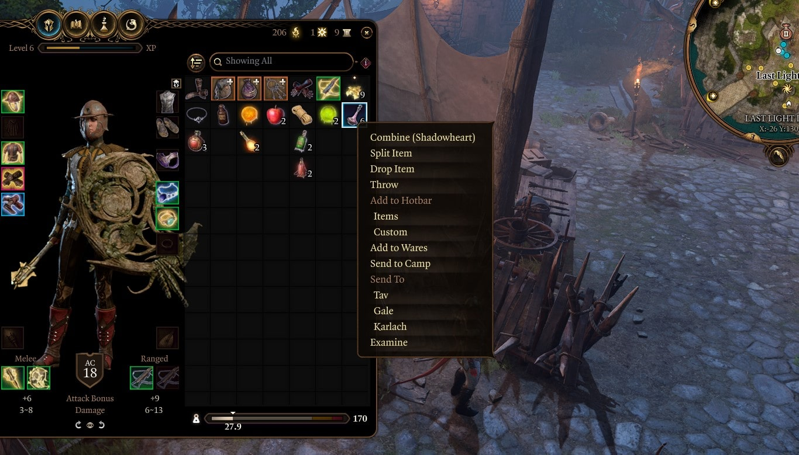

[Source page](https://gaymingmag.com/2023/08/how-to-dye-clothes-and-armor-in-baldurs-gate-3/) · [Detailed analysis](../games/baldurs-gate-3.md) · [Image provenance](bg3/manifest.json)

### BG3-05 — Player inventory and Traveller's Chest open side by side

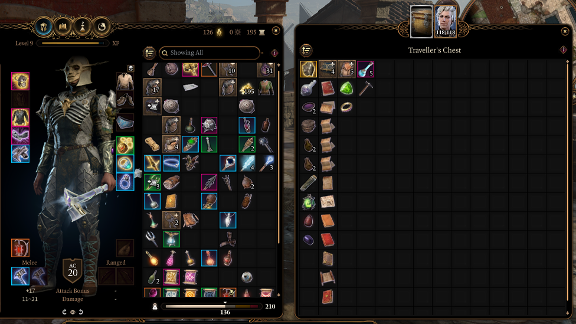

[Source page](https://scalacube.com/blog/baldurs-gate-3/travellers-chest-in-baldurs-gate-3) · [Detailed analysis](../games/baldurs-gate-3.md) · [Image provenance](bg3/manifest.json)

### BG3-06 — PS5 action radials over the world

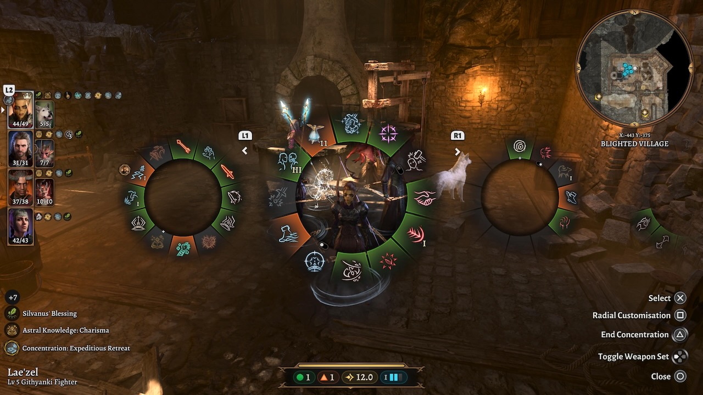

[Source page](https://argothald.com/2024/09/09/bg3-on-the-mac/) · [Detailed analysis](../games/baldurs-gate-3.md) · [Image provenance](bg3/manifest.json)

### BG3-07 — Alchemy recipe, ingredients, quantity, and craft controls

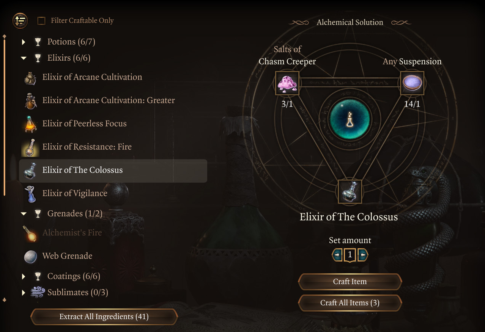

[Source page](https://bg3.wiki/wiki/File:Alchemy_window.png) · [Detailed analysis](../games/baldurs-gate-3.md) · [Image provenance](bg3/manifest.json)

### BG3-08 — Throw action item selector in the hotbar

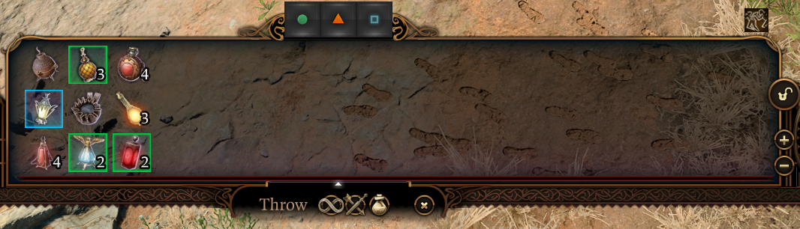

[Source page](https://bg3.wiki/wiki/File:Throw_UI_Inventory_Menu.png) · [Detailed analysis](../games/baldurs-gate-3.md) · [Image provenance](bg3/manifest.json)

### BG3-09 — Dye and armour in a focused Combine Items panel

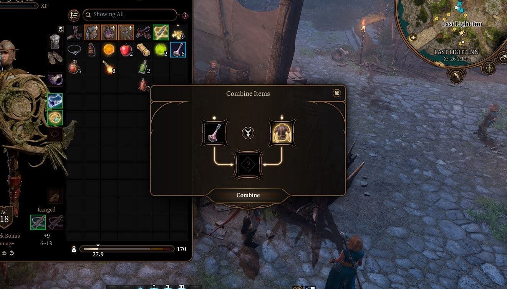

[Source page](https://gaymingmag.com/2023/08/how-to-dye-clothes-and-armor-in-baldurs-gate-3/) · [Detailed analysis](../games/baldurs-gate-3.md) · [Image provenance](bg3/manifest.json)

### BG3-10 — Launch-era player and merchant trade grids

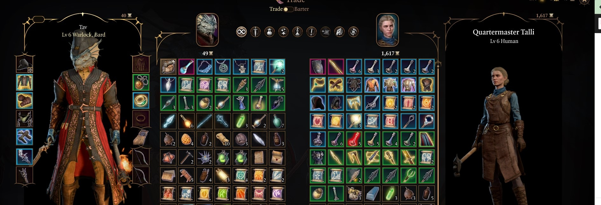

[Source page](https://gaymingmag.com/2023/08/how-to-dye-clothes-and-armor-in-baldurs-gate-3/) · [Detailed analysis](../games/baldurs-gate-3.md) · [Image provenance](bg3/manifest.json)

### BG3-11 — Looted longbow compared with equipped longbow

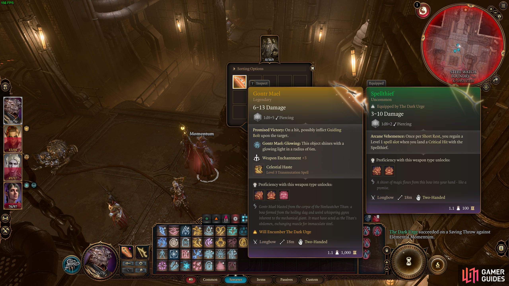

[Source page](https://www.gamerguides.com/baldurs-gate-3/database/weapons/longbow) · [Detailed analysis](../games/baldurs-gate-3.md) · [Image provenance](bg3/manifest.json)

### BG3-12 — NPC cinematic dialogue with persistent utility icons

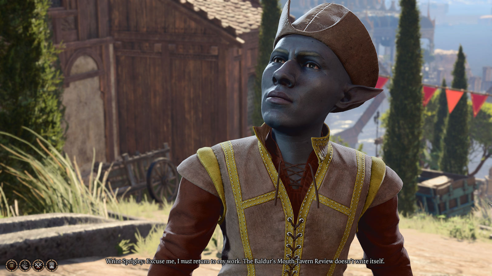

[Source page](https://baldursgate3.game/news/community-update-22-wield-the-power-of-a-mind-flayer_75) · [Detailed analysis](../games/baldurs-gate-3.md) · [Image provenance](bg3/manifest.json)

### BG3-13 — PS5 active search keeps selected object tied to the scene

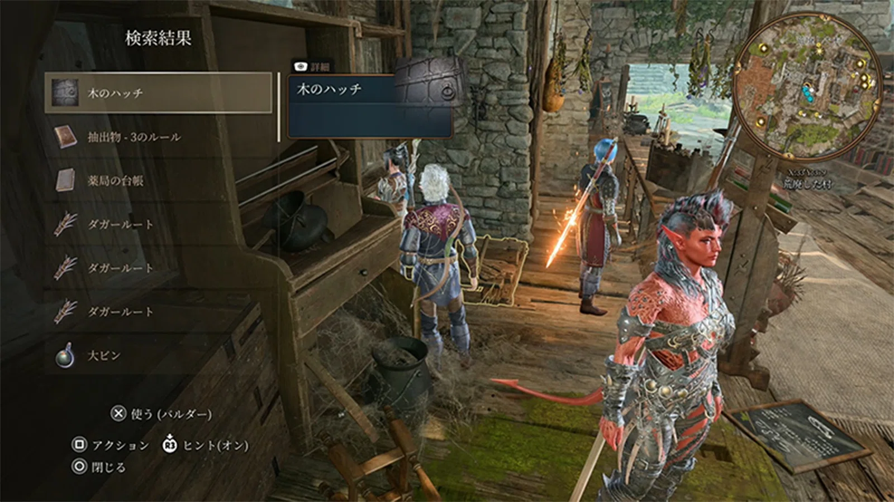

[Source page](https://www.spike-chunsoft.co.jp/pages/baldursgate3/guide1/) · [Detailed analysis](../games/baldurs-gate-3.md) · [Image provenance](bg3/manifest.json)

### BG3-14 — Annotated PS5 combat HUD: actor, target, turn queue and resources

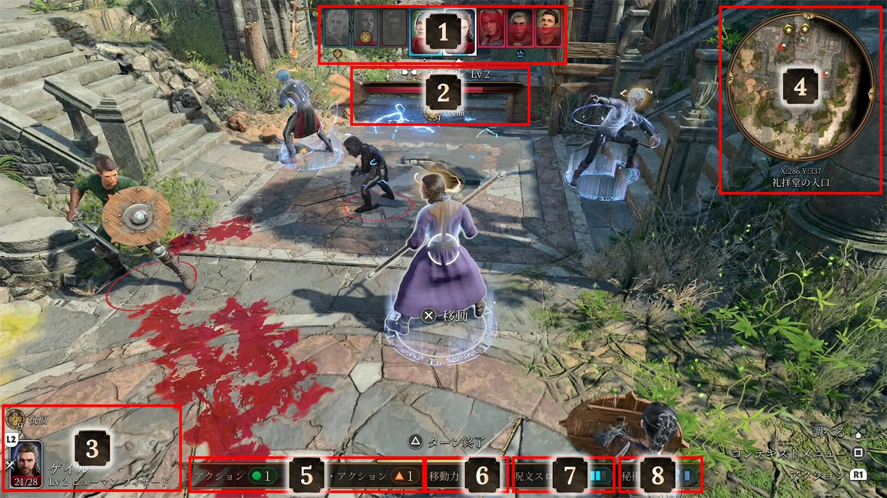

[Source page](https://www.spike-chunsoft.co.jp/pages/baldursgate3/guide2/) · [Detailed analysis](../games/baldurs-gate-3.md) · [Image provenance](bg3/manifest.json)

### BG3-15 — Level-up summary with explicit unfinished choice and acceptance

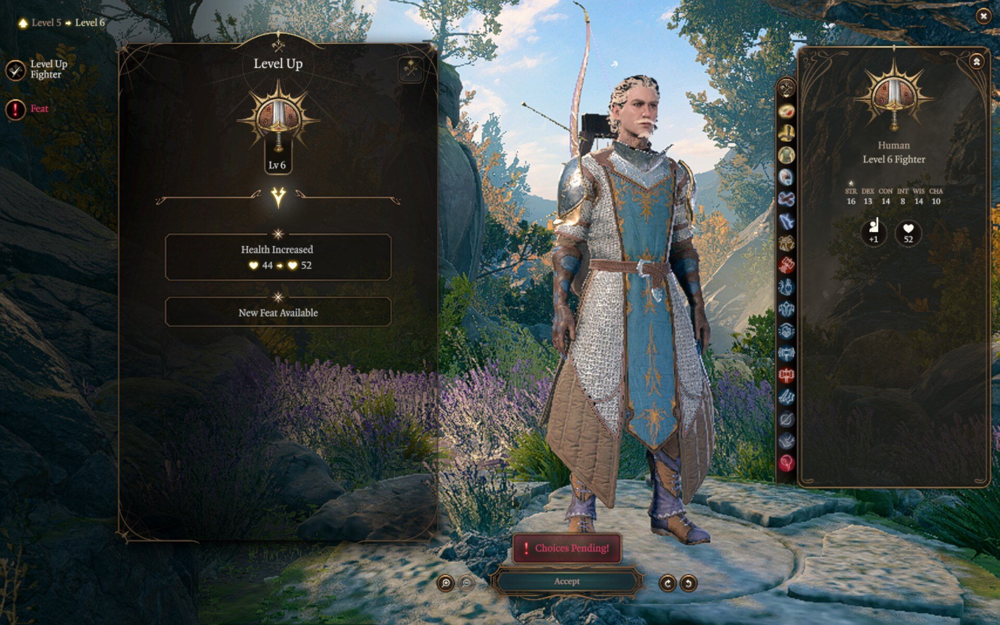

[Source page](https://www.shacknews.com/article/136852/how-to-level-up-baldurs-gate-3) · [Detailed analysis](../games/baldurs-gate-3.md) · [Image provenance](bg3/manifest.json)

### BG3-16 — Quest journal categories, subquests and objective history

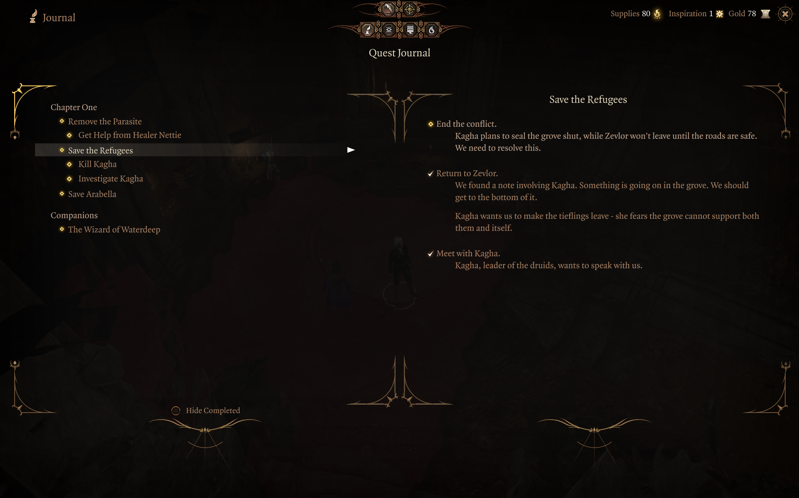

[Source page](https://docs.baldursgate3.game/index.php?title=Journal_Structure_Overview) · [Detailed analysis](../games/baldurs-gate-3.md) · [Image provenance](bg3/manifest.json)

## Divinity: Original Sin 2

[Detailed controls, workflows and critique](../games/divinity-original-sin-2.md) · 10 digital screenshots

### DOS2-01 — Historical alpha barter offer staging

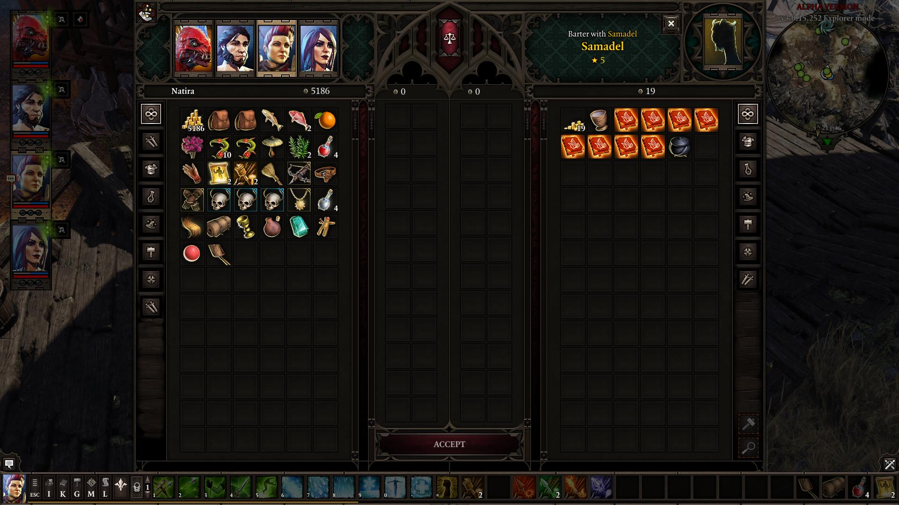

[Source page](https://www.rpguides.de/divinity-original-sin-2/fundorte/pyrokinet-pyrokinetic-fertigkeitenbucher.htm) · [Detailed analysis](../games/divinity-original-sin-2.md) · [Image provenance](dos2/manifest.json)

### DOS2-02 — World chest with a compact loot grid

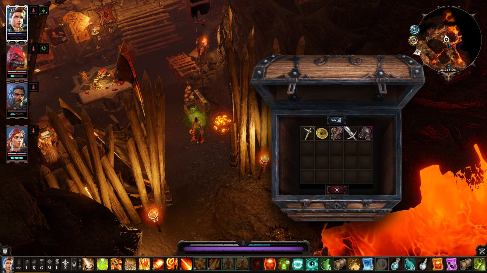

[Source page](https://www.neoseeker.com/divinity-original-sin-ii/walkthrough/The_Key_to_Freedom) · [Detailed analysis](../games/divinity-original-sin-2.md) · [Image provenance](dos2/manifest.json)

### DOS2-03 — PS4 party inventories with a bag context menu

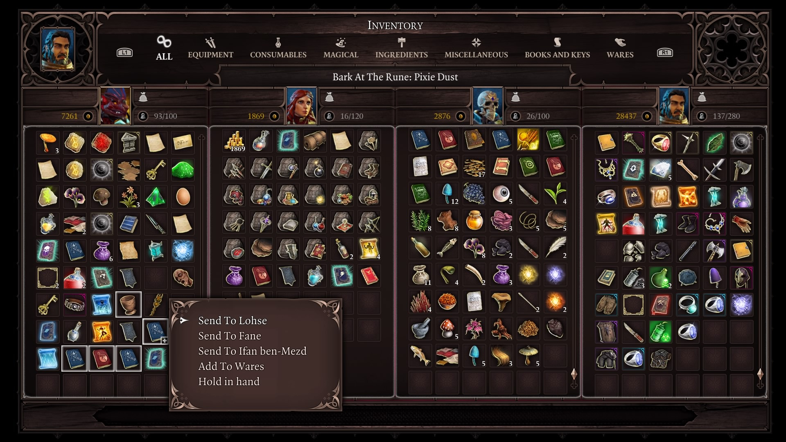

[Source page](https://raphleroy18.wixsite.com/gamingux/post/divinity-original-sin-ii-on-ps4-menus-usability-and-information-visualization) · [Detailed analysis](../games/divinity-original-sin-2.md) · [Image provenance](dos2/manifest.json)

### DOS2-04 — PS4 experimental crafting with organization bags in the selector

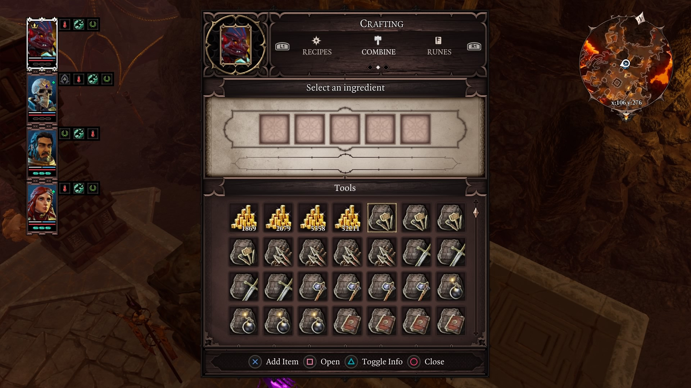

[Source page](https://raphleroy18.wixsite.com/gamingux/post/divinity-original-sin-ii-on-ps4-menus-usability-and-information-visualization) · [Detailed analysis](../games/divinity-original-sin-2.md) · [Image provenance](dos2/manifest.json)

### DOS2-05 — Quest log with category hierarchy, selection and tracking

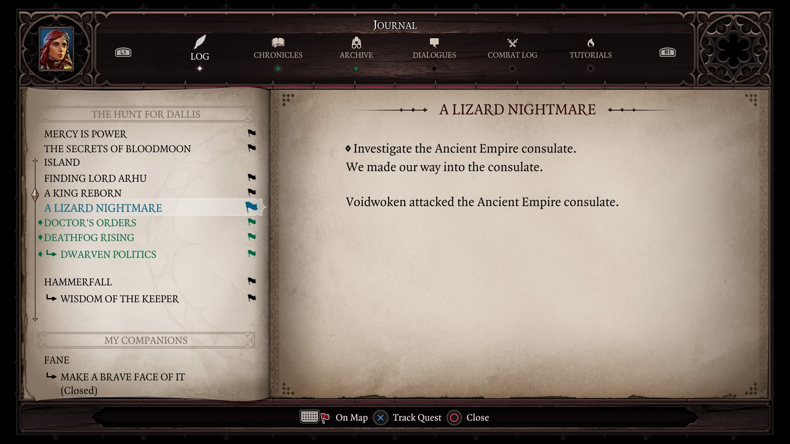

[Source page](https://raphleroy18.wixsite.com/gamingux/post/divinity-original-sin-ii-on-ps4-menus-usability-and-information-visualization) · [Detailed analysis](../games/divinity-original-sin-2.md) · [Image provenance](dos2/manifest.json)

### DOS2-06 — Dialogue history grouped by time and conversation partner

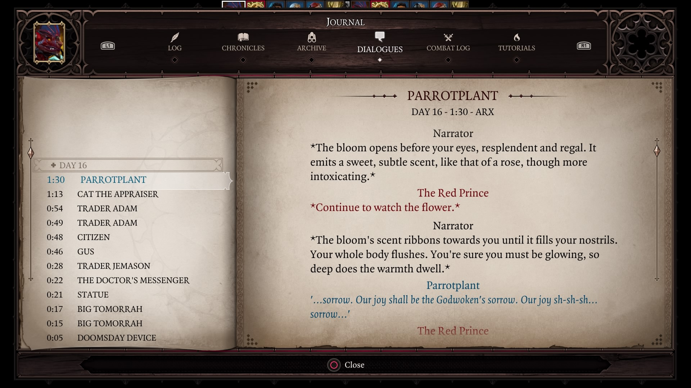

[Source page](https://raphleroy18.wixsite.com/gamingux/post/divinity-original-sin-ii-on-ps4-menus-usability-and-information-visualization) · [Detailed analysis](../games/divinity-original-sin-2.md) · [Image provenance](dos2/manifest.json)

### DOS2-07 — Named waypoint destination selection over the world

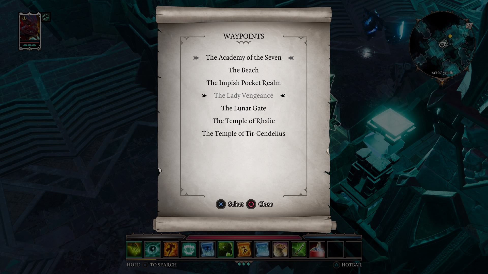

[Source page](https://raphleroy18.wixsite.com/gamingux/post/divinity-original-sin-ii-on-ps4-menus-usability-and-information-visualization) · [Detailed analysis](../games/divinity-original-sin-2.md) · [Image provenance](dos2/manifest.json)

### DOS2-08 — Skills, prepared memory slots, innate skills and item-granted skills

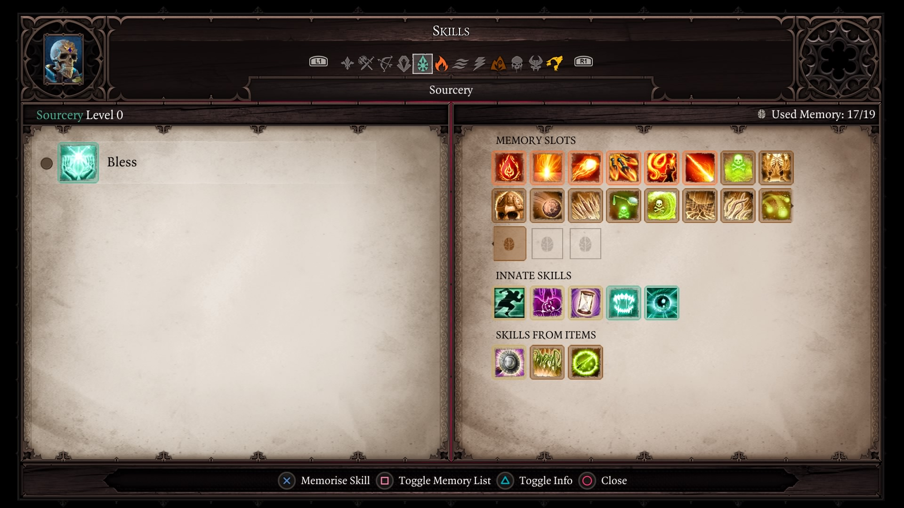

[Source page](https://raphleroy18.wixsite.com/gamingux/post/divinity-original-sin-ii-on-ps4-menus-usability-and-information-visualization) · [Detailed analysis](../games/divinity-original-sin-2.md) · [Image provenance](dos2/manifest.json)

### DOS2-09 — Exploration HUD keeps party condition and actions at the edges

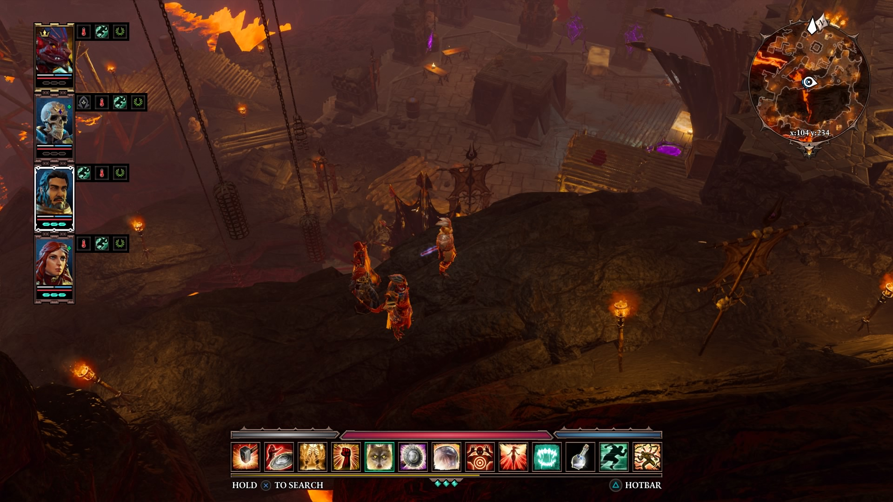

[Source page](https://raphleroy18.wixsite.com/gamingux/post/divinity-original-sin-ii-on-ps4-menus-usability-and-information-visualization) · [Detailed analysis](../games/divinity-original-sin-2.md) · [Image provenance](dos2/manifest.json)

### DOS2-10 — Main menu with story, continue and local joining

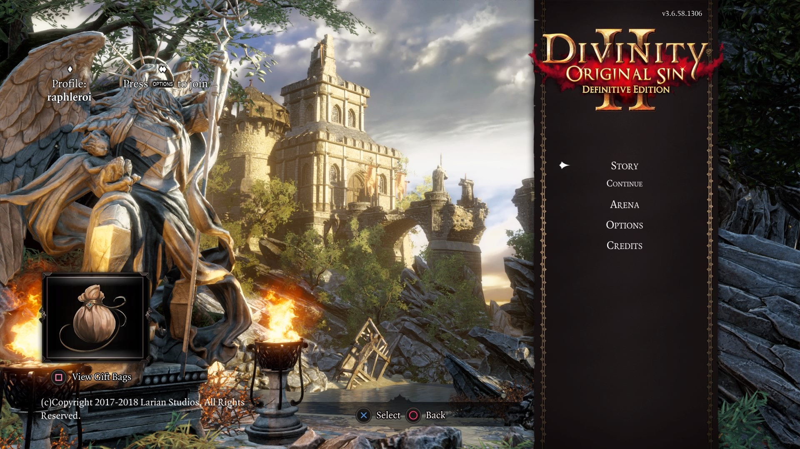

[Source page](https://raphleroy18.wixsite.com/gamingux/post/divinity-original-sin-ii-on-ps4-menus-usability-and-information-visualization) · [Detailed analysis](../games/divinity-original-sin-2.md) · [Image provenance](dos2/manifest.json)

## Minecraft

[Detailed controls, workflows and critique](../games/minecraft.md) · 8 digital screenshots

### MC01 — Creative/category inventory with Nature catalog, equipment, personal crafting and carried cells.

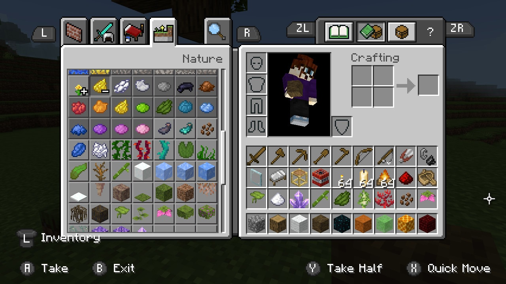

[Source page](https://www.minecraft.net/en-us/article/how-craft) · [Detailed analysis](../games/minecraft.md) · [Image provenance](minecraft/manifest.json)

### MC02 — Construction recipe book with unavailable red entries, craftable filter and crafting preview.

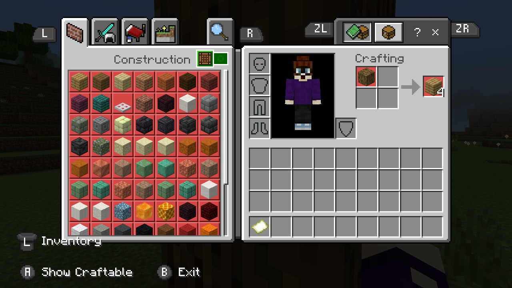

[Source page](https://www.minecraft.net/en-us/article/how-craft) · [Detailed analysis](../games/minecraft.md) · [Image provenance](minecraft/manifest.json)

### MC03 — Four planks occupy the personal crafting grid and produce a crafting table.

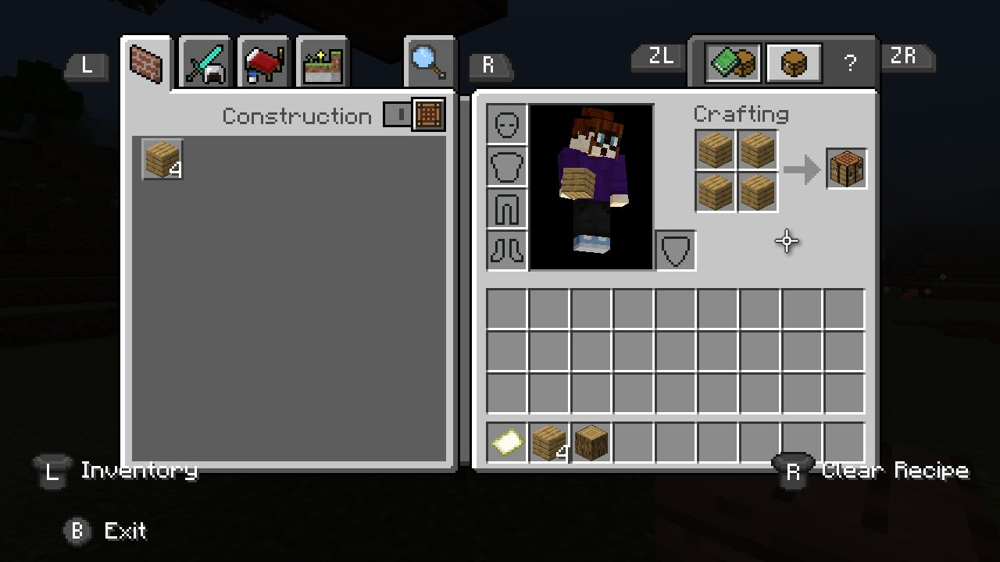

[Source page](https://www.minecraft.net/en-us/article/how-craft) · [Detailed analysis](../games/minecraft.md) · [Image provenance](minecraft/manifest.json)

### MC04 — Large Chest grid of 54 cells above carried inventory and hotbar.

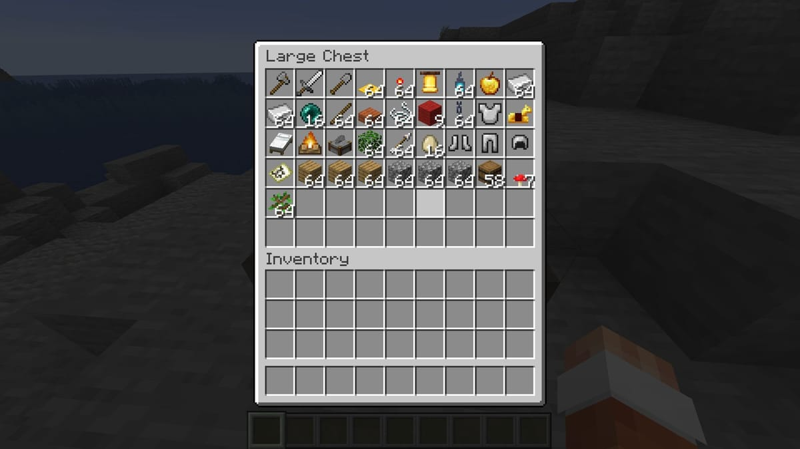

[Source page](https://www.sportskeeda.com/minecraft/features-mojang-needs-improve-minecraft-1-21-update) · [Detailed analysis](../games/minecraft.md) · [Image provenance](minecraft/manifest.json)

### MC05 — Furnace input, fuel, flame and output above player inventory; cursor holds coal.

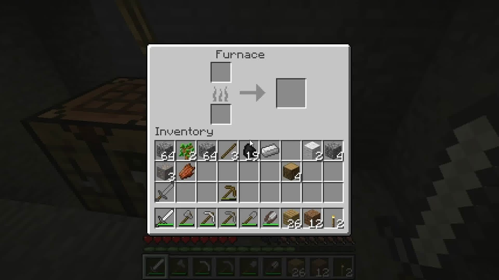

[Source page](https://therokuchannel.roku.com/details/32de5d18117f5eb39bd7e97abbbbd5ce/minecraft-tutorials-survive-and-thrive/season-1) · [Detailed analysis](../games/minecraft.md) · [Image provenance](minecraft/manifest.json)

### MC06 — Farmer trade offers beside payment/result cells and carried inventory.

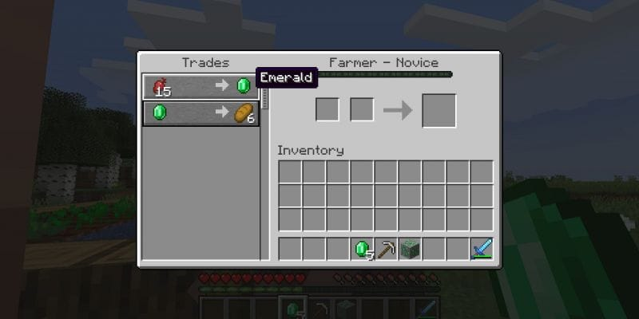

[Source page](https://www.sportskeeda.com/minecraft/emerald-ore-minecraft-all-need-know) · [Detailed analysis](../games/minecraft.md) · [Image provenance](minecraft/manifest.json)

### MC07 — Underwater survival HUD and an empty selected hotbar cell

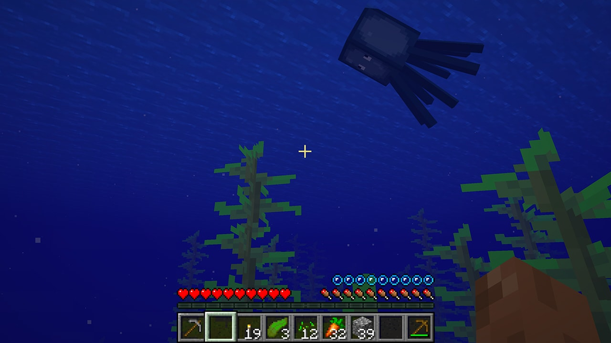

[Source page](https://www.minecraft.net/en-us/article/health-minecraft) · [Detailed analysis](../games/minecraft.md) · [Image provenance](minecraft/manifest.json)

### MC08 — A held map preserves the surrounding first-person world

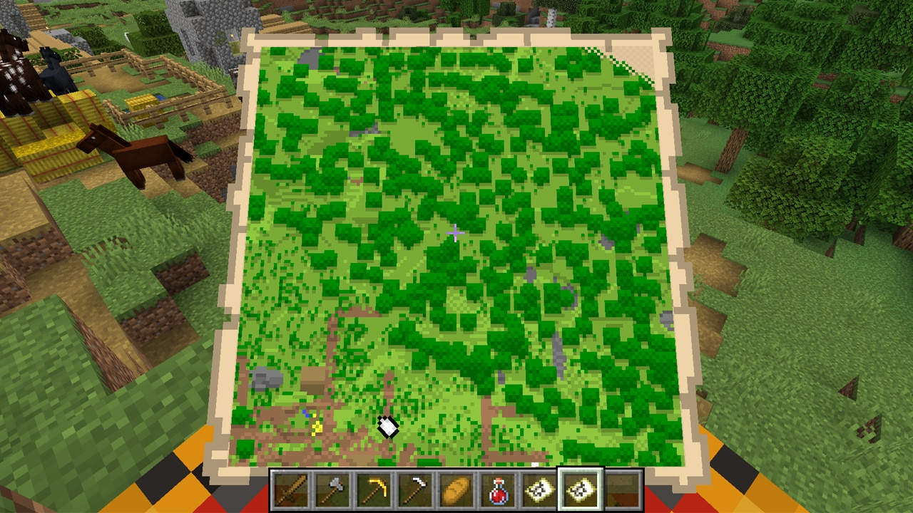

[Source page](https://www.minecraft.net/en-us/article/exploring-minecraft) · [Detailed analysis](../games/minecraft.md) · [Image provenance](minecraft/manifest.json)

## Valheim

[Detailed controls, workflows and critique](../games/valheim.md) · 9 digital screenshots

### VH01 — Workbench with Club selected, recipe requirements, Craft/Upgrade tabs and repair hover.

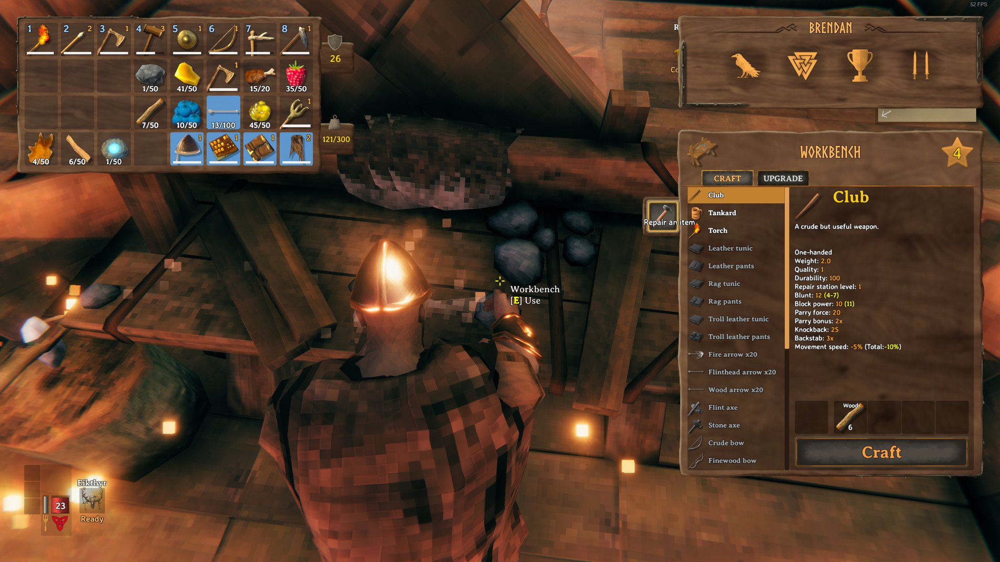

[Source page](https://www.windowscentral.com/valheim-workbench-guide-how-build-upgrade-and-use-repairs) · [Detailed analysis](../games/valheim.md) · [Image provenance](valheim/manifest.json)

### VH02 — Carried inventory above cart storage with Take all and Place stacks.

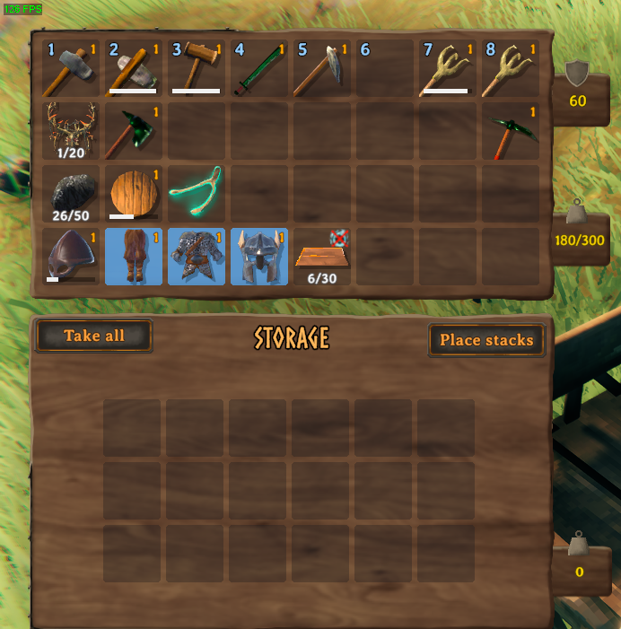

[Source page](https://gamever.io/knowledge-base/how-to-make-a-cart-in-valheim) · [Detailed analysis](../games/valheim.md) · [Image provenance](valheim/manifest.json)

### VH03 — Build-piece palette over world with category tabs and placement controls.

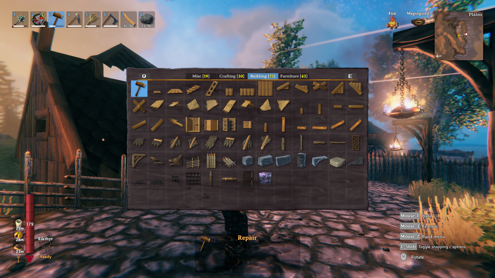

[Source page](https://www.gamesradar.com/valheim-hearth-and-home-tar-pits-darkwood-furniture/) · [Detailed analysis](../games/valheim.md) · [Image provenance](valheim/manifest.json)

### VH04 — Pause menu and controller diagram with PlayStation-style symbols while the world prompt shows an Xbox-style glyph.

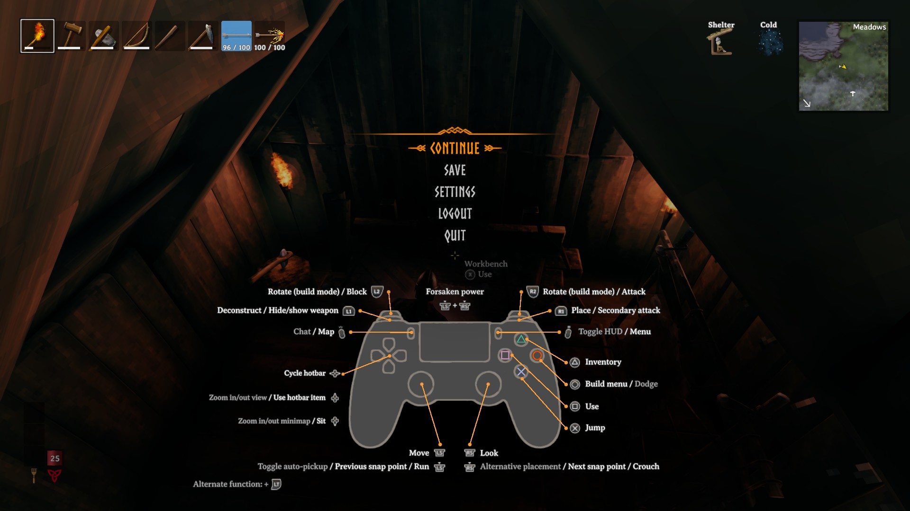

[Source page](https://steamcommunity.com/sharedfiles/filedetails/?id=3227775644) · [Detailed analysis](../games/valheim.md) · [Image provenance](valheim/manifest.json)

### VH05 — Controller workbench with Torch selected, active-pane outline and local action bindings.

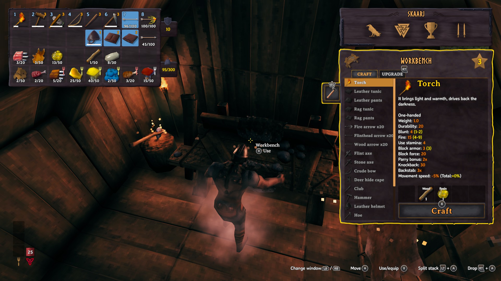

[Source page](https://steamcommunity.com/sharedfiles/filedetails/?id=3227777540) · [Detailed analysis](../games/valheim.md) · [Image provenance](valheim/manifest.json)

### VH06 — Leather tunic recipe with unavailable Craft, material requirement, repair hover and mouse hints.

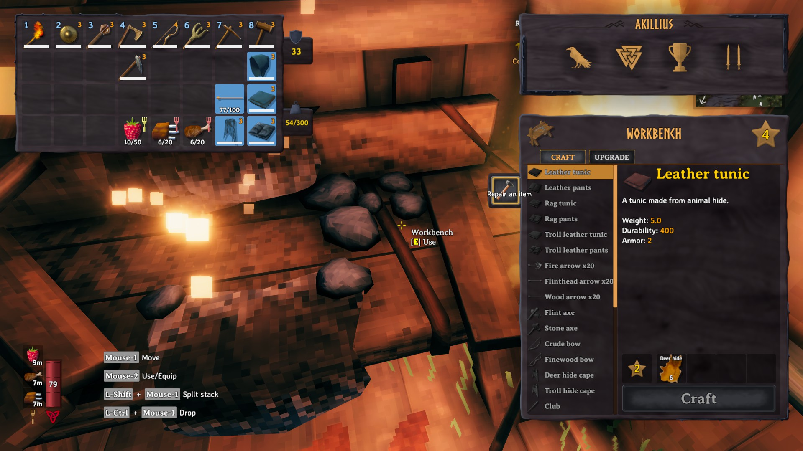

[Source page](https://steamcommunity.com/sharedfiles/filedetails/?id=2915973134) · [Detailed analysis](../games/valheim.md) · [Image provenance](valheim/manifest.json)

### VH07 — World storage room with player-made category signs above chest rows and the normal HUD.

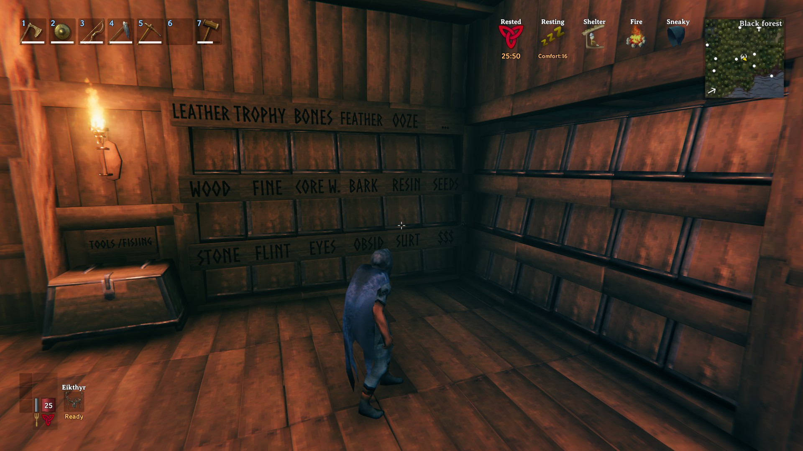

[Source page](https://steamcommunity.com/sharedfiles/filedetails/?id=2432979999) · [Detailed analysis](../games/valheim.md) · [Image provenance](valheim/manifest.json)

### VH08 — Player map with explored coastlines and personal notes

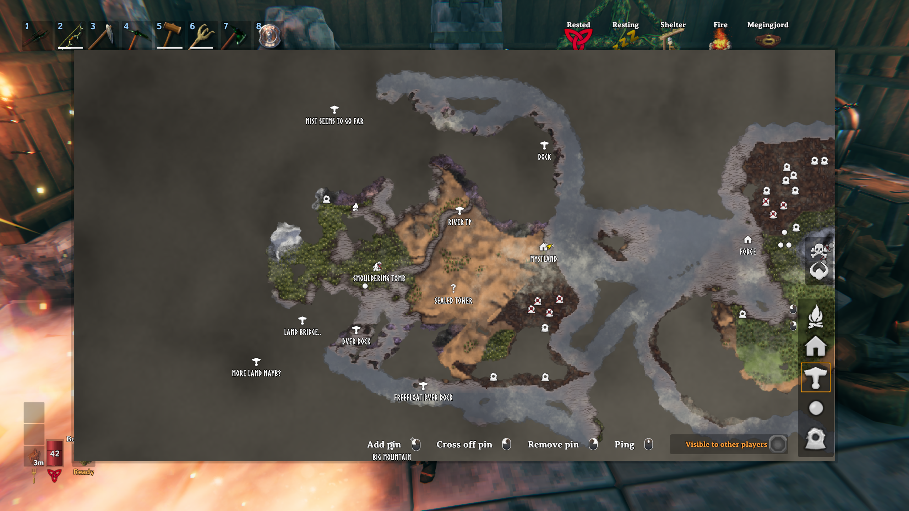

[Source page](https://www.reddit.com/r/valheim/comments/152klr0/plains_base_any_tips_for_choosing_the_location/) · [Detailed analysis](../games/valheim.md) · [Image provenance](valheim/manifest.json)

### VH09 — Building context with selected beam, unavailable workbench and local bindings

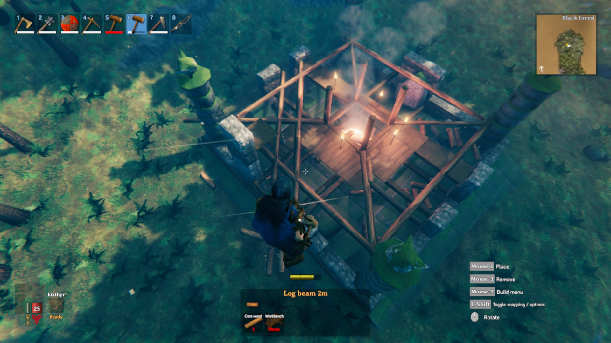

[Source page](https://imgur.com/gallery/valheim-base-on-elders-fire-I8bj5TC) · [Detailed analysis](../games/valheim.md) · [Image provenance](valheim/manifest.json)

## Terraria

[Detailed controls, workflows and critique](../games/terraria.md) · 10 digital screenshots

### TR01 — Metals chest below carried inventory with a full set of explicit bulk actions.

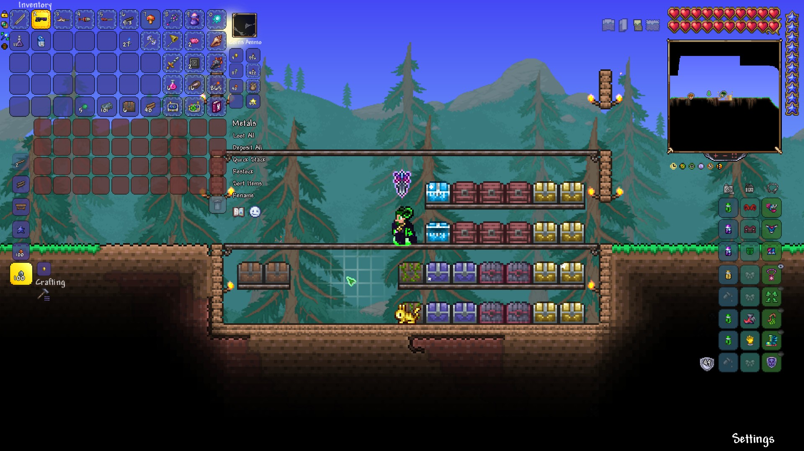

[Source page](https://steamcommunity.com/sharedfiles/filedetails/?id=2460463327) · [Detailed analysis](../games/terraria.md) · [Image provenance](terraria/manifest.json)

### TR02 — Optional Quick stack to nearby chests tooltip with a large physical storage room visible.

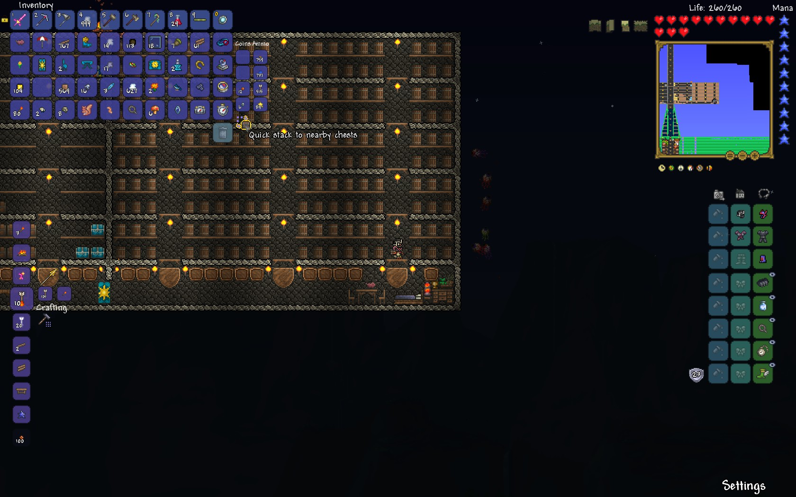

[Source page](https://steamcommunity.com/sharedfiles/filedetails/?id=473657041) · [Detailed analysis](../games/terraria.md) · [Image provenance](terraria/manifest.json)

### TR03 — Guide recipe discovery using Platinum Crown with Required objects: Demon Altar.

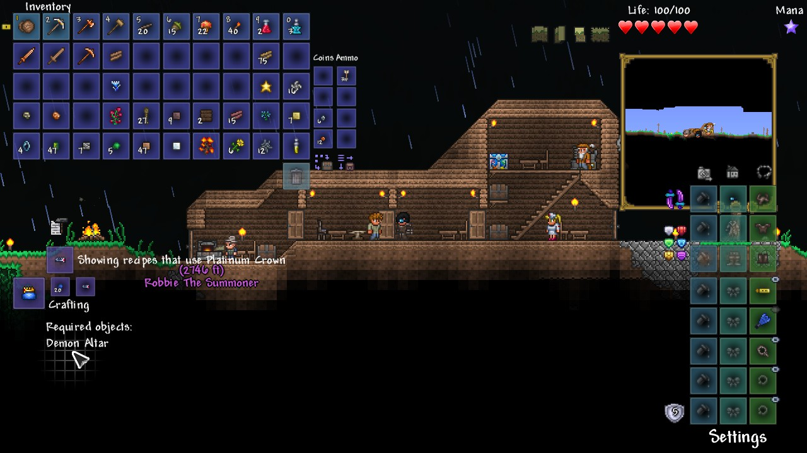

[Source page](https://steamcommunity.com/sharedfiles/filedetails/?id=935942639) · [Detailed analysis](../games/terraria.md) · [Image provenance](terraria/manifest.json)

### TR04 — In-place chest naming with Potion Materials and Save/Cancel.

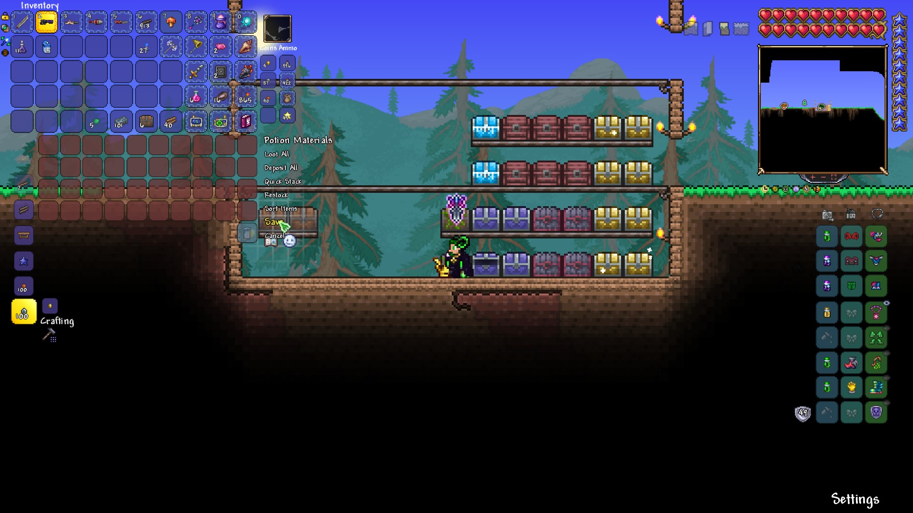

[Source page](https://steamcommunity.com/sharedfiles/filedetails/?id=2460463327) · [Detailed analysis](../games/terraria.md) · [Image provenance](terraria/manifest.json)

### TR05 — Shop inventory and Minishark tooltip combining use facts and a contextual buy price.

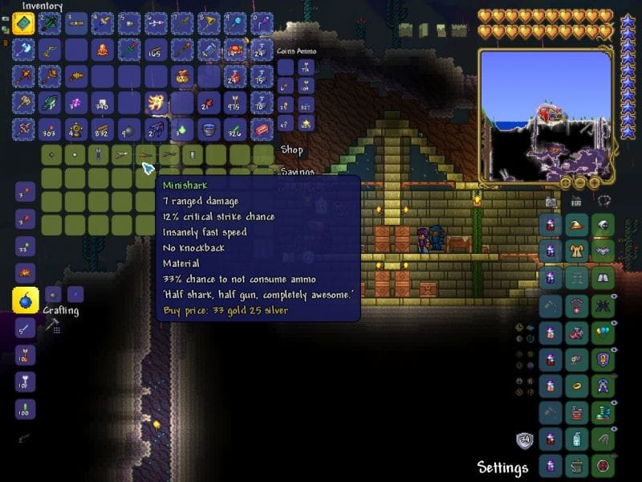

[Source page](https://wiki.sportskeeda.com/terraria/how-to-obtain-minishark-terraria) · [Detailed analysis](../games/terraria.md) · [Image provenance](terraria/manifest.json)

### TR06 — Tavernkeep dialogue with Shop, Close, Eternia Crystal and Happiness choices; separate Merchant-arrival notification.

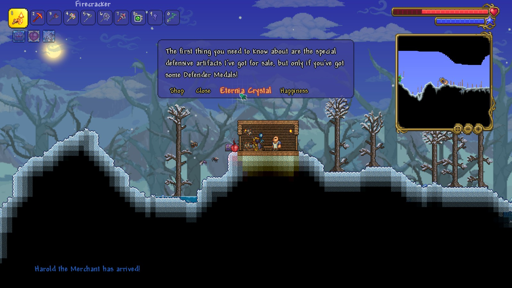

[Source page](https://steamcommunity.com/sharedfiles/filedetails/?id=2284900730) · [Detailed analysis](../games/terraria.md) · [Image provenance](terraria/manifest.json)

### TR07 — Developer WIP HUD groups inventory hints near hotbar and map/chat hints near minimap.

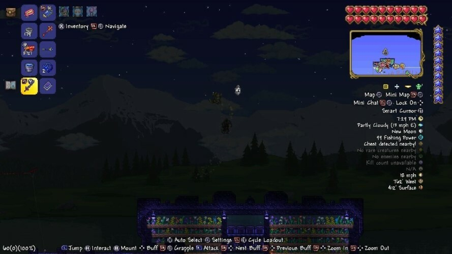

[Source page](https://store.steampowered.com/news/posts/?appids=105600&enddate=1717286400&feed=steam_community_announcements) · [Detailed analysis](../games/terraria.md) · [Image provenance](terraria/manifest.json)

### TR08 — Developer WIP inventory places Use, Pickup, Take One, Favorite and Close next to items; crafting has separate hints.

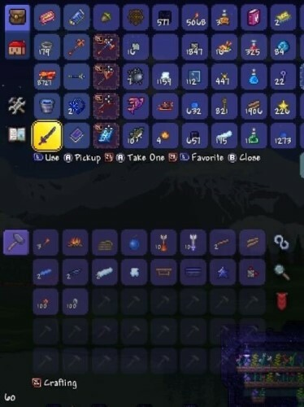

[Source page](https://store.steampowered.com/news/posts/?appids=105600&enddate=1717286400&feed=steam_community_announcements) · [Detailed analysis](../games/terraria.md) · [Image provenance](terraria/manifest.json)

### TR09 — Journey character creation with compatibility explanation

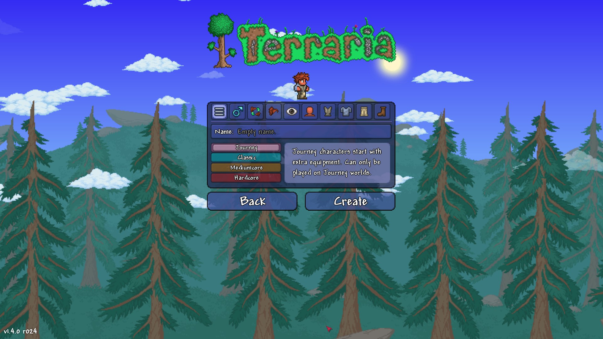

[Source page](https://forums.terraria.org/index.php?threads/with-great-power-comes-great-accessibility-introducing-terrarias-new-journey-mode.88233/) · [Detailed analysis](../games/terraria.md) · [Image provenance](terraria/manifest.json)

### TR10 — Optional Journey time controls beside the world

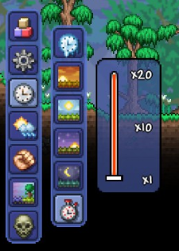

[Source page](https://forums.terraria.org/index.php?threads/with-great-power-comes-great-accessibility-introducing-terrarias-new-journey-mode.88233/) · [Detailed analysis](../games/terraria.md) · [Image provenance](terraria/manifest.json)

## Factorio

[Detailed controls, workflows and critique](../games/factorio.md) · 6 digital screenshots

### FACT-01 — Simultaneous character, logistics and crafting

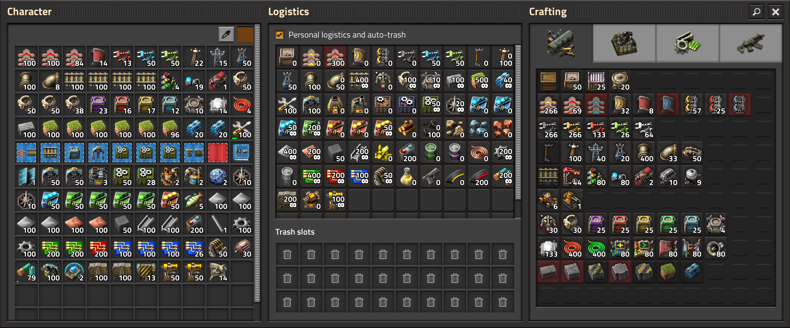

[Source page](https://www.factorio.com/blog/post/fff-363) · [Detailed analysis](../games/factorio.md) · [Image provenance](factorio/manifest.json)

### FACT-02 — Inserter object status

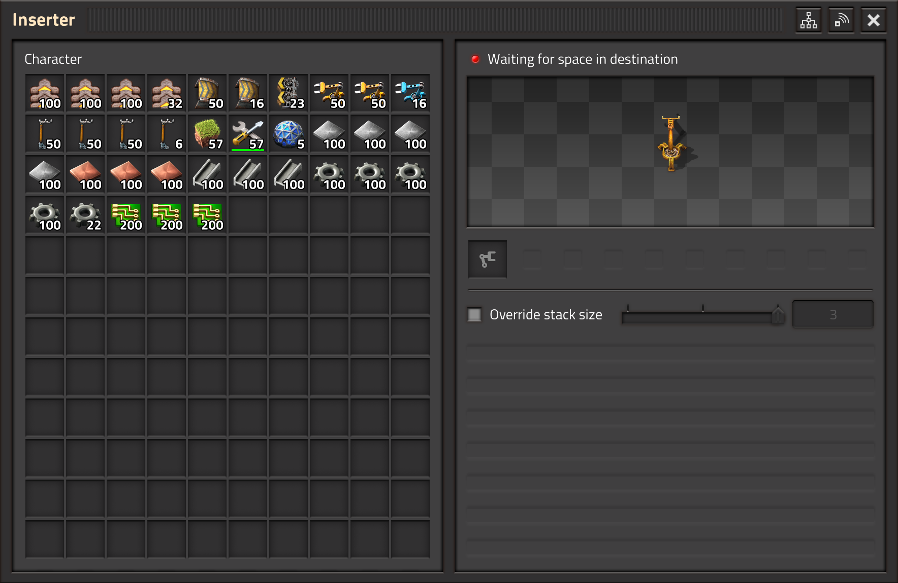

[Source page](https://www.factorio.com/blog/post/fff-363) · [Detailed analysis](../games/factorio.md) · [Image provenance](factorio/manifest.json)

### FACT-03 — Storage chest object panel

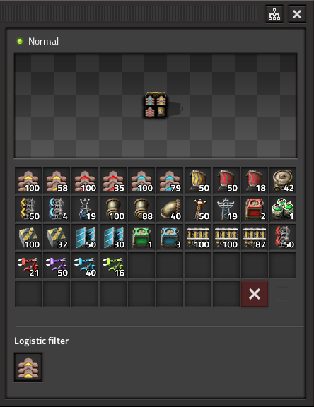

[Source page](https://wiki.factorio.com/File:Storage_chest_gui.png) · [Detailed analysis](../games/factorio.md) · [Image provenance](factorio/manifest.json)

### FACT-04 — Quickbar page selection

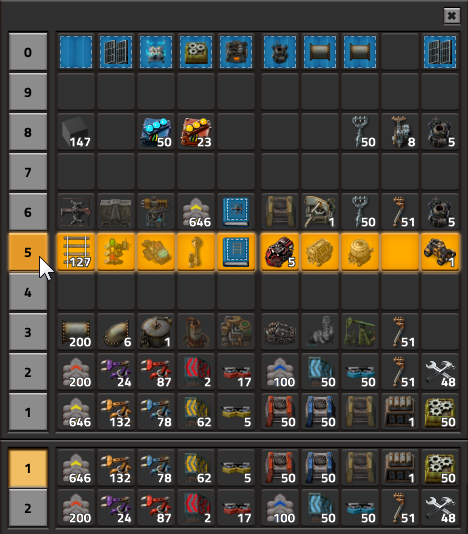

[Source page](https://factorio.com/blog/post/fff-278) · [Detailed analysis](../games/factorio.md) · [Image provenance](factorio/manifest.json)

### FACT-05 — Recipe discovery badges

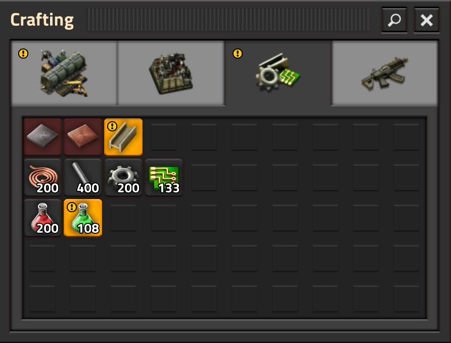

[Source page](https://www.factorio.com/blog/post/fff-363) · [Detailed analysis](../games/factorio.md) · [Image provenance](factorio/manifest.json)

### FACT-06 — Name icon picker

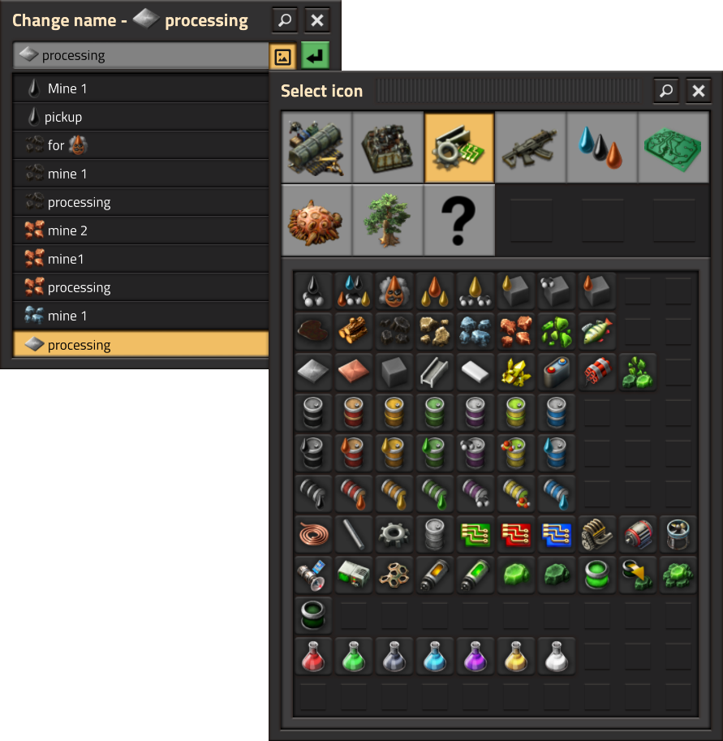

[Source page](https://www.factorio.com/blog/post/fff-363) · [Detailed analysis](../games/factorio.md) · [Image provenance](factorio/manifest.json)

## Stardew Valley

[Detailed controls, workflows and critique](../games/stardew-valley.md) · 6 digital screenshots · 1 excluded display photograph

### SDV-01 — Standard chest and backpack

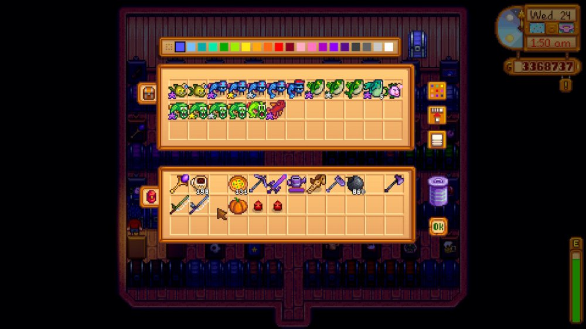

[Source page](https://forums.stardewvalley.net/threads/is-silver-quality-legend-possible.13784/) · [Detailed analysis](../games/stardew-valley.md) · [Image provenance](stardew-valley/manifest.json)

### SDV-02 — Large chest before reported capacity replacement problem

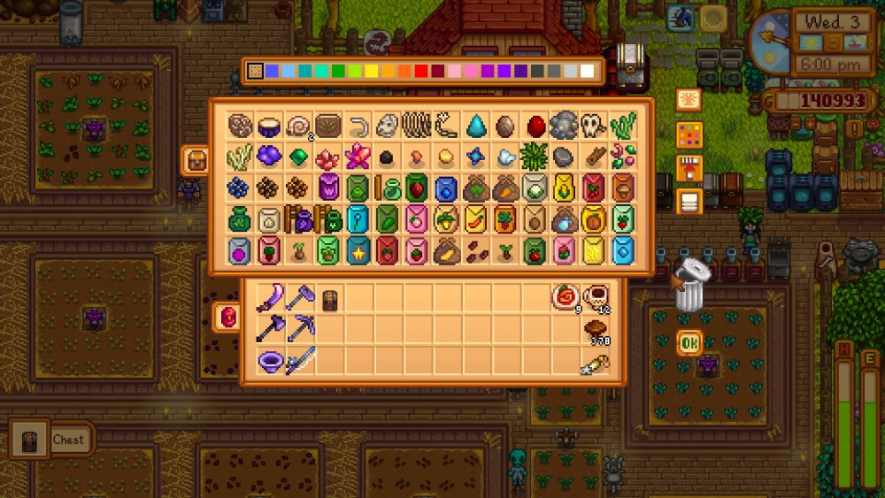

[Source page](https://forums.stardewvalley.net/threads/report-1-6-issues-here.27915/page-77) · [Detailed analysis](../games/stardew-valley.md) · [Image provenance](stardew-valley/manifest.json)

### SDV-03 — Inventory and equipped Dark Boots

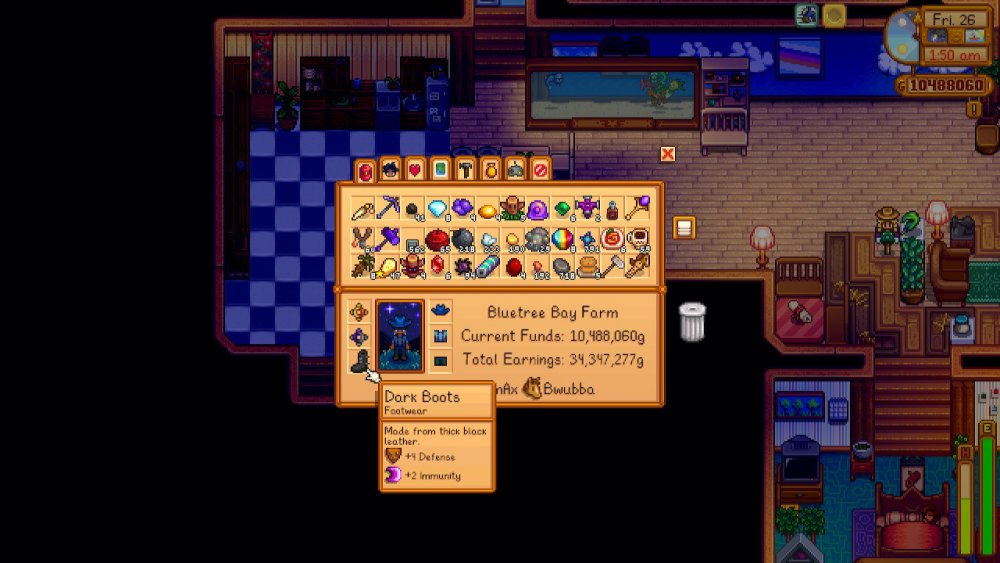

[Source page](https://forums.stardewvalley.net/threads/prismatic-shard-skull-cave.9440/) · [Detailed analysis](../games/stardew-valley.md) · [Image provenance](stardew-valley/manifest.json)

### SDV-04 — Crafting panel accompanying missing learned-recipes report — display photograph, excluded from screenshot count

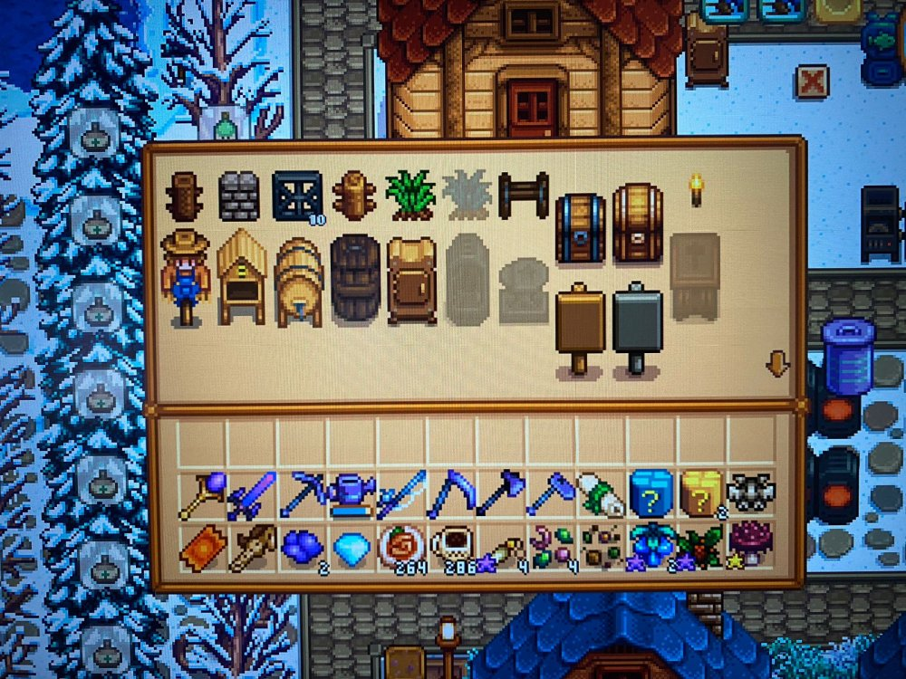

[Source page](https://forums.stardewvalley.net/threads/report-1-6-issues-here.27915/page-67) · [Detailed analysis](../games/stardew-valley.md) · [Image provenance](stardew-valley/manifest.json)

### SDV-05 — Collections Cooking reference and overflowing Omelet tooltip

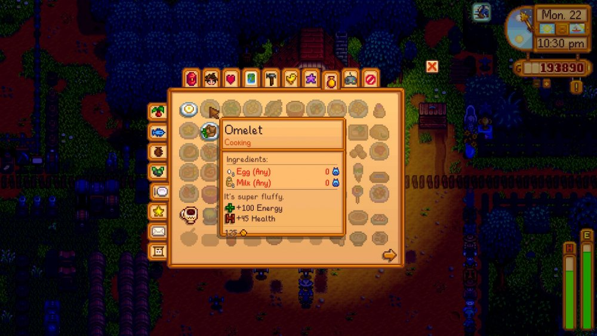

[Source page](https://forums.stardewvalley.net/threads/report-1-6-issues-here.27915/page-80) · [Detailed analysis](../games/stardew-valley.md) · [Image provenance](stardew-valley/manifest.json)

### SDV-06 — Skills and character progress

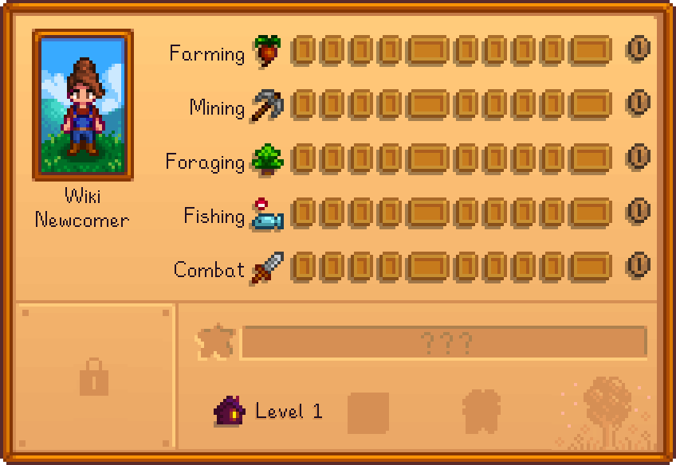

[Source page](https://stardewvalleywiki.com/File:Skills_Tab.png) · [Detailed analysis](../games/stardew-valley.md) · [Image provenance](stardew-valley/manifest.json)

### SDV-07 — Android map with underused panel space

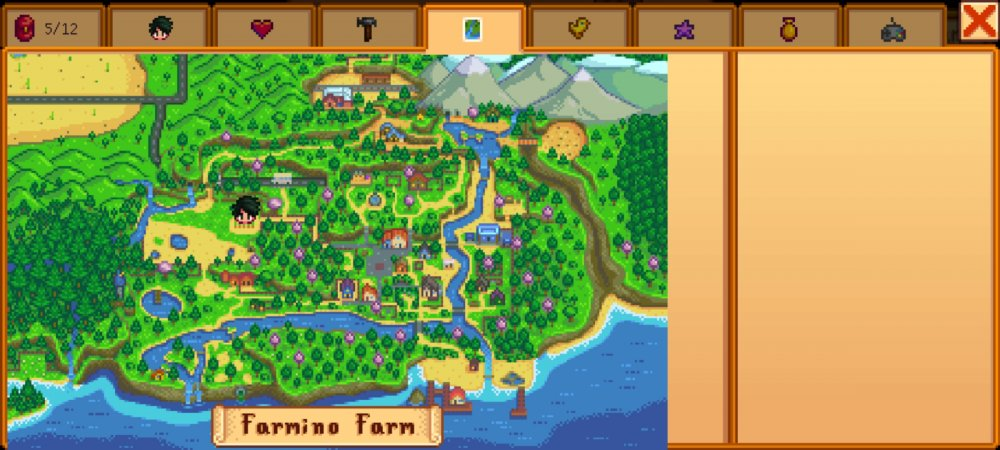

[Source page](https://forums.stardewvalley.net/threads/annoying-ui.36870/) · [Detailed analysis](../games/stardew-valley.md) · [Image provenance](stardew-valley/manifest.json)

## Project Zomboid

[Detailed controls, workflows and critique](../games/project-zomboid.md) · 6 digital screenshots

### PZ-01 — World refrigerator, loot list and character health

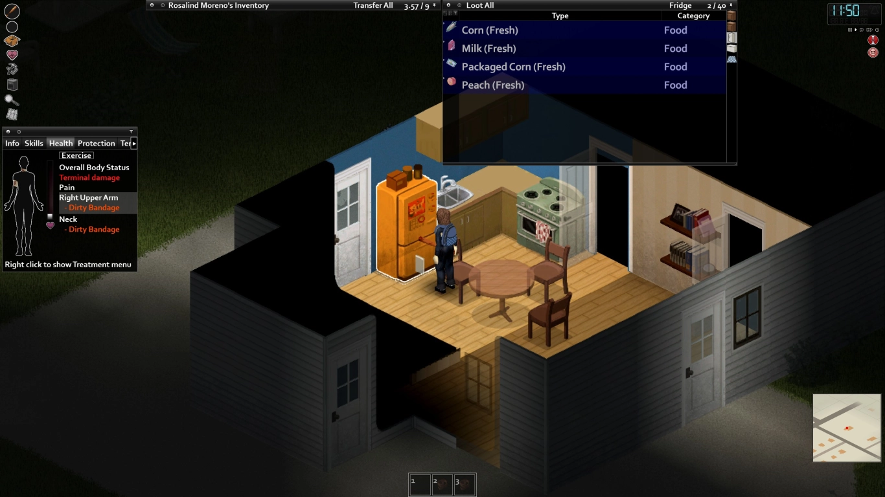

[Source page](https://www.4netplayers.com/en/blog/project-zomboid/why-play-project-zomboid/) · [Detailed analysis](../games/project-zomboid.md) · [Image provenance](project-zomboid/manifest.json)

### PZ-02 — Build 42 work-in-progress Crafting on Desk

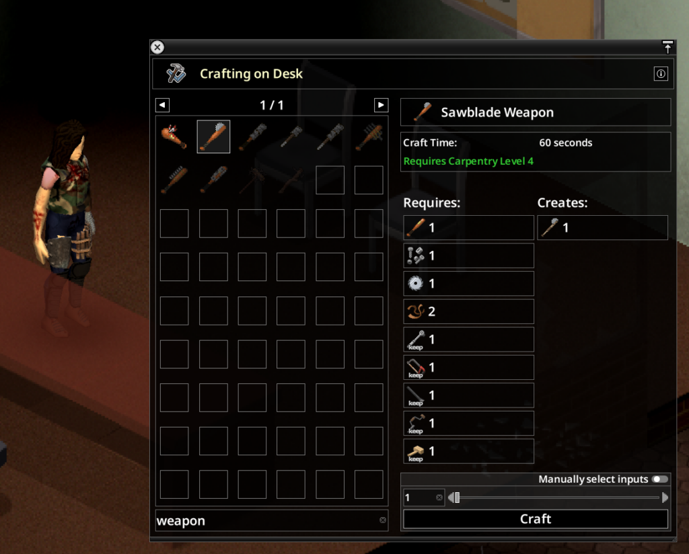

[Source page](https://projectzomboid.com/blog/news/2024/06/the-biomic-man/) · [Detailed analysis](../games/project-zomboid.md) · [Image provenance](project-zomboid/manifest.json)

### PZ-03 — Build 42.20 Crafting on Table overview screenshot

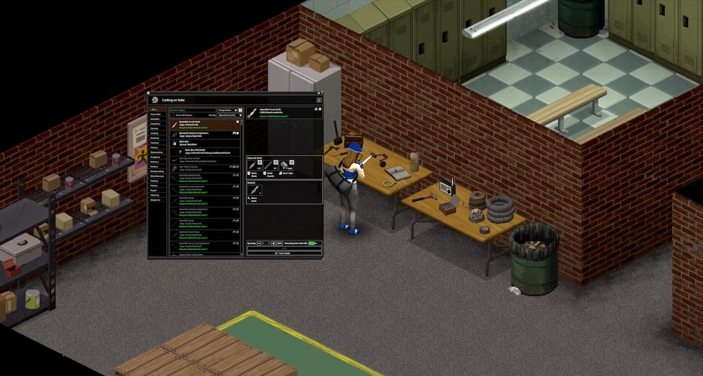

[Source page](https://projectzomboid.com/blog/features-overview-build-42-20/) · [Detailed analysis](../games/project-zomboid.md) · [Image provenance](project-zomboid/manifest.json)

### PZ-04 — Build 42.20 building overview with Plank Barricade

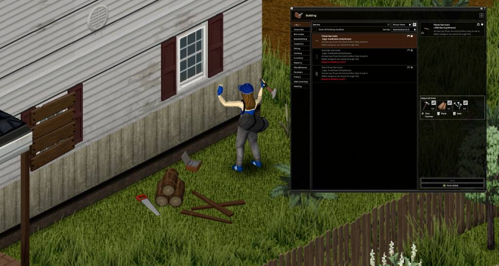

[Source page](https://projectzomboid.com/blog/features-overview-build-42-20/) · [Detailed analysis](../games/project-zomboid.md) · [Image provenance](project-zomboid/manifest.json)

### PZ-05 — Build 42 fluid-transfer prototype with two bottles

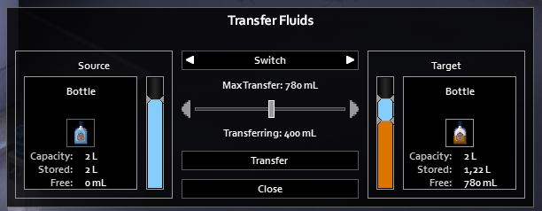

[Source page](https://projectzomboid.com/blog/news/2022/07/liquid-zedball/) · [Detailed analysis](../games/project-zomboid.md) · [Image provenance](project-zomboid/manifest.json)

### PZ-06 — Build 42 fluid-transfer prototype from world cooler to bottle

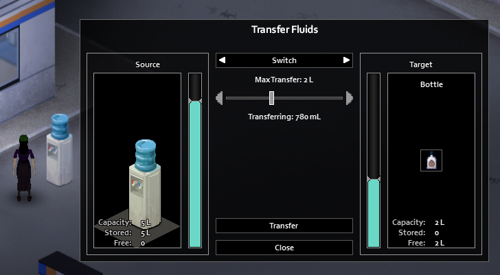

[Source page](https://projectzomboid.com/blog/news/2022/07/liquid-zedball/) · [Detailed analysis](../games/project-zomboid.md) · [Image provenance](project-zomboid/manifest.json)

## Final Fantasy XIV

[Detailed controls, workflows and critique](../games/final-fantasy-xiv.md) · 8 digital screenshots

### FFXIV-01 — 01 hud gamepad

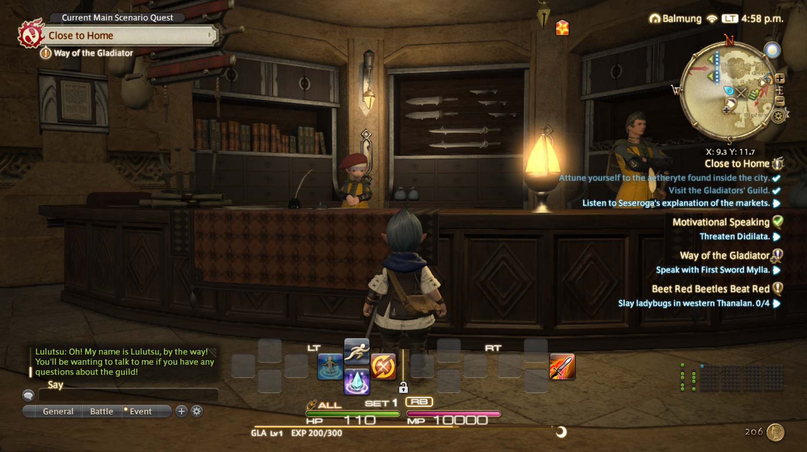

[Source page](https://na.finalfantasyxiv.com/uiguide/) · [Detailed analysis](../games/final-fantasy-xiv.md) · [Image provenance](ffxiv/manifest.json)

### FFXIV-02 — 02 inventory layouts

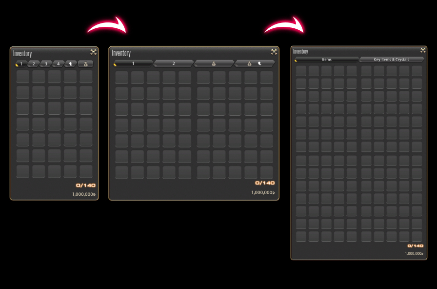

[Source page](https://na.finalfantasyxiv.com/uiguide/equipment/equipment-bag/setting_itemsort.html) · [Detailed analysis](../games/final-fantasy-xiv.md) · [Image provenance](ffxiv/manifest.json)

### FFXIV-03 — 03 chat audience

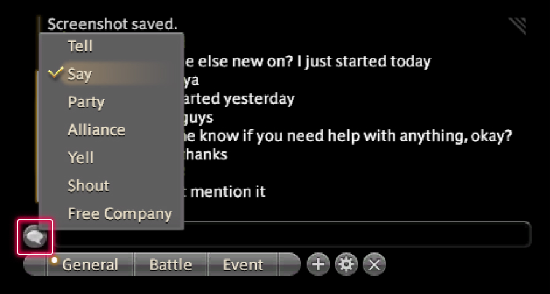

[Source page](https://na.finalfantasyxiv.com/uiguide/communication/communication-chat/chat_how_to.html) · [Detailed analysis](../games/final-fantasy-xiv.md) · [Image provenance](ffxiv/manifest.json)

### FFXIV-04 — 04 item context menu

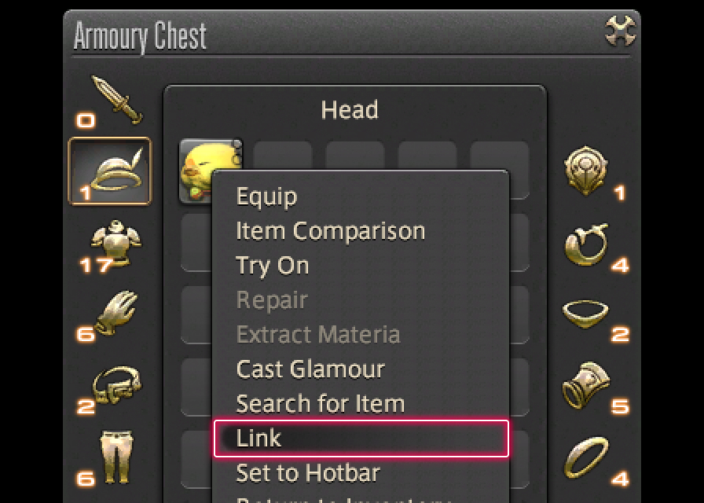

[Source page](https://na.finalfantasyxiv.com/uiguide/communication/communication-chat/chat_iteminfo.html) · [Detailed analysis](../games/final-fantasy-xiv.md) · [Image provenance](ffxiv/manifest.json)

### FFXIV-05 — 05 crafting log

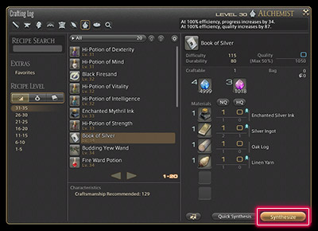

[Source page](https://na.finalfantasyxiv.com/crafting_gathering_guide/alchemist/) · [Detailed analysis](../games/final-fantasy-xiv.md) · [Image provenance](ffxiv/manifest.json)

### FFXIV-06 — 06 custom log tab

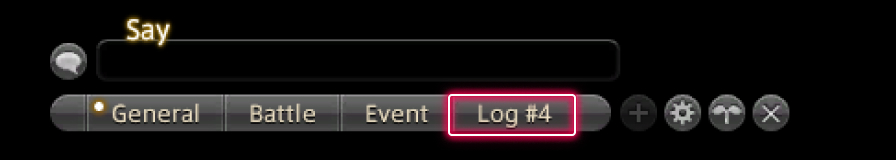

[Source page](https://na.finalfantasyxiv.com/uiguide/communication/communication-chat/chat_owntab.html) · [Detailed analysis](../games/final-fantasy-xiv.md) · [Image provenance](ffxiv/manifest.json)

### FFXIV-07 — A map is a reference surface with an explicit persistence control

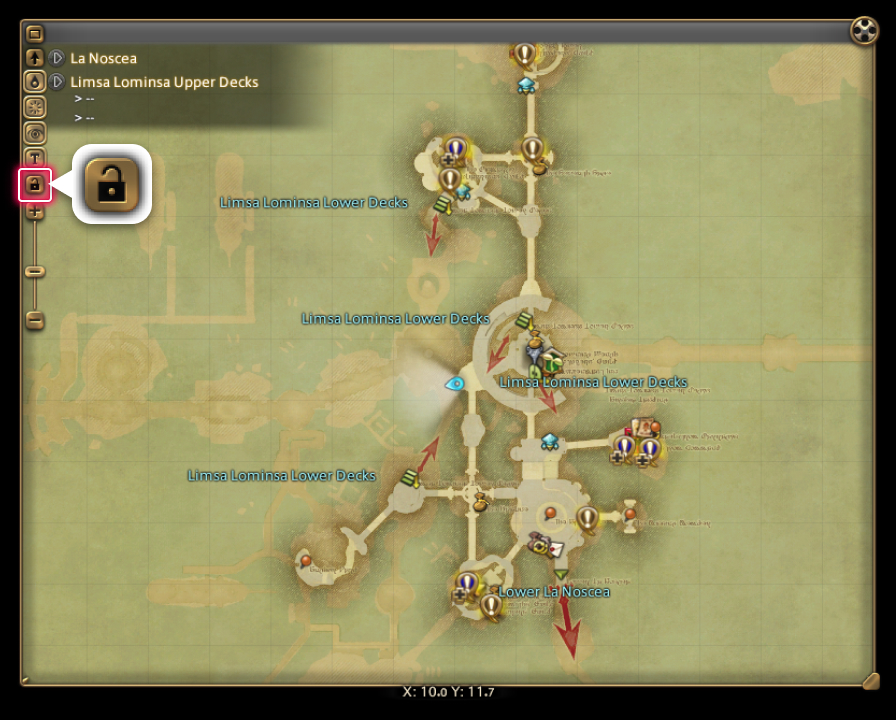

[Source page](https://na.finalfantasyxiv.com/uiguide/know/know-hud/hud_map_lock.html) · [Detailed analysis](../games/final-fantasy-xiv.md) · [Image provenance](ffxiv/manifest.json)

### FFXIV-08 — Separate the selected subject, secondary attention and current action

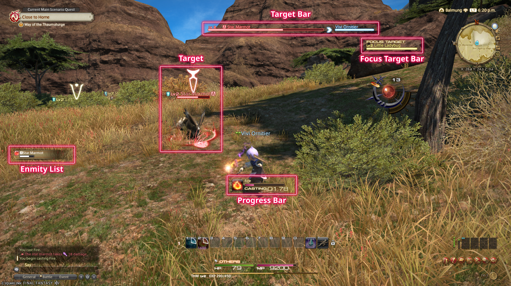

[Source page](https://na.finalfantasyxiv.com/uiguide/know/know-hud/hud-name.html) · [Detailed analysis](../games/final-fantasy-xiv.md) · [Image provenance](ffxiv/manifest.json)

## Guild Wars 2

[Detailed controls, workflows and critique](../games/guild-wars-2.md) · 8 digital screenshots

### GW2-01 — 01 inventory guide

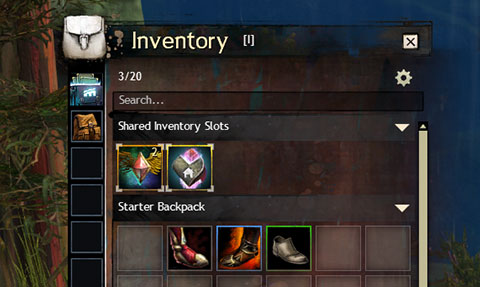

[Source page](https://www.guildwars2.com/en/new-player-guide/) · [Detailed analysis](../games/guild-wars-2.md) · [Image provenance](gw2/manifest.json)

### GW2-02 — 02 trading post

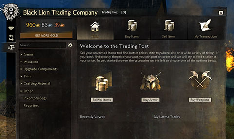

[Source page](https://www.guildwars2.com/en/new-player-guide/) · [Detailed analysis](../games/guild-wars-2.md) · [Image provenance](gw2/manifest.json)

### GW2-03 — 03 currency wallet

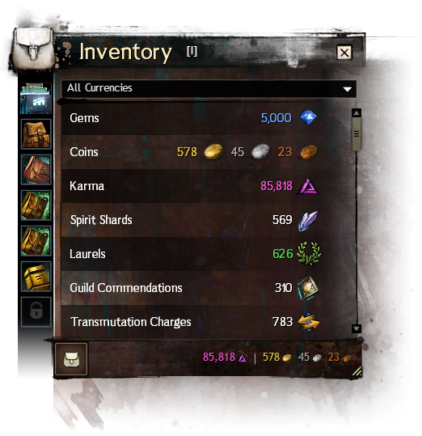

[Source page](https://help.guildwars2.com/hc/en-us/articles/230429967-FAQ-In-Game-Currency-Wallet) · [Detailed analysis](../games/guild-wars-2.md) · [Image provenance](gw2/manifest.json)

### GW2-04 — 04 crafting discovery

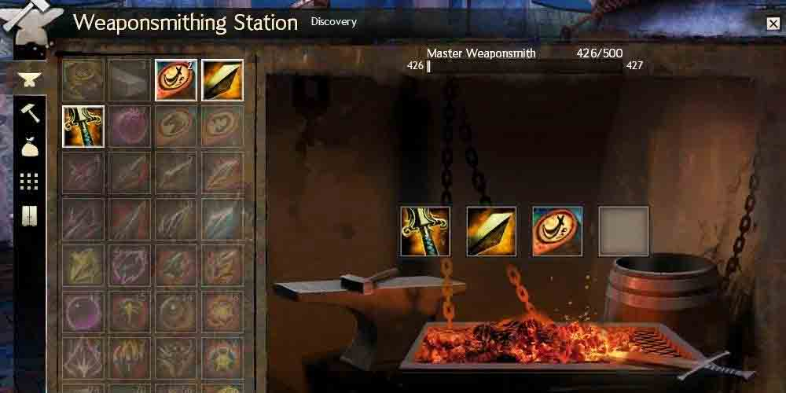

[Source page](https://mmoauctions.com/news/guild-wars-2-weaponsmith-guide-make-your-own-swords-and-axes) · [Detailed analysis](../games/guild-wars-2.md) · [Image provenance](gw2/manifest.json)

### GW2-05 — 05 bank account vault

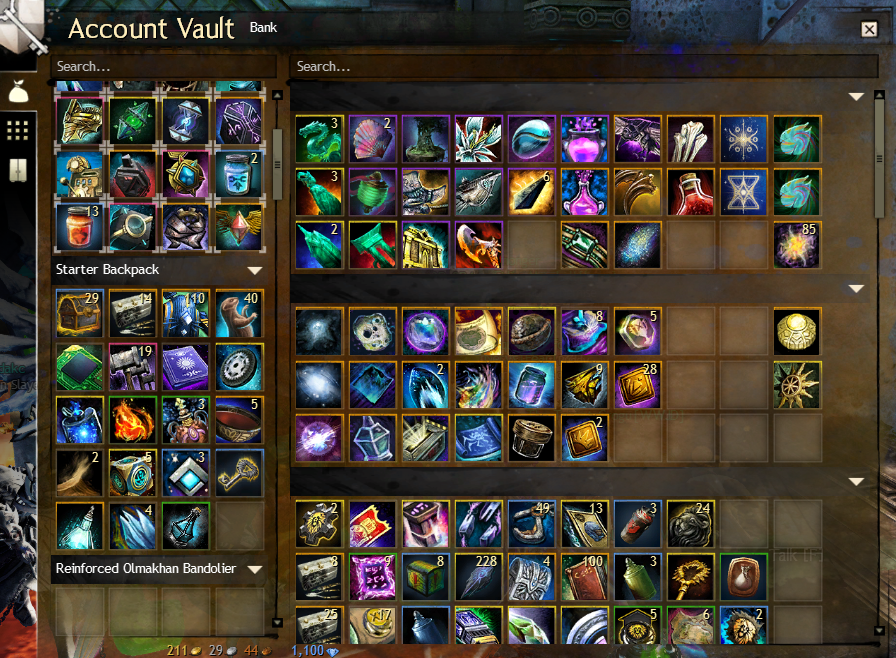

[Source page](https://projektdyad.com/guides-list/guild-wars-2-inventory-management) · [Detailed analysis](../games/guild-wars-2.md) · [Image provenance](gw2/manifest.json)

### GW2-06 — Give the player an immediate, named next step

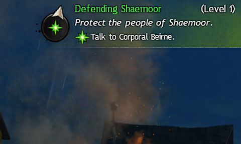

[Source page](https://www.guildwars2.com/en/new-player-guide/) · [Detailed analysis](../games/guild-wars-2.md) · [Image provenance](gw2/manifest.json)

### GW2-07 — A level notification can teach the next opportunity

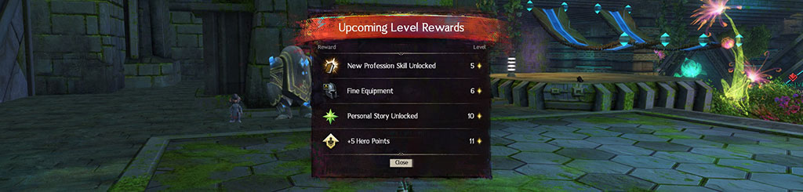

[Source page](https://www.gaisciochmagazine.com/guides/new_adventures_in_gw2.html) · [Detailed analysis](../games/guild-wars-2.md) · [Image provenance](gw2/manifest.json)

### GW2-08 — The journal makes current story, archive and unavailability distinct

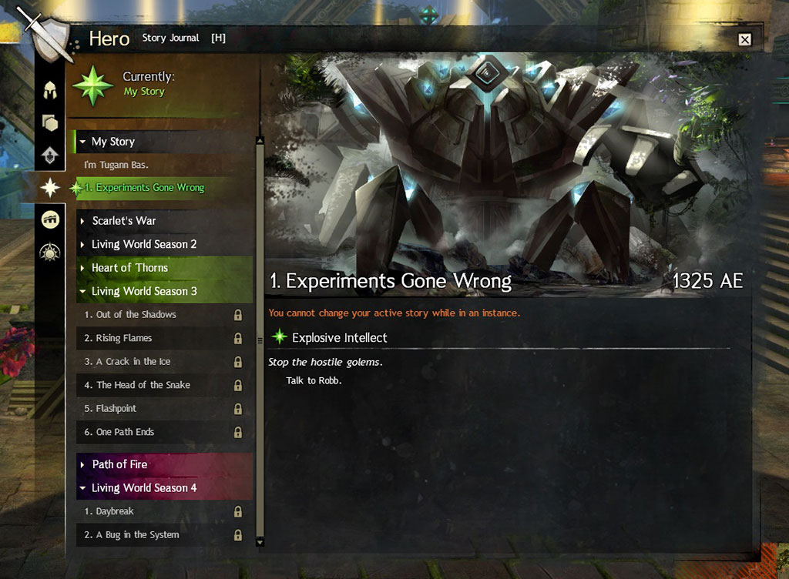

[Source page](https://www.gaisciochmagazine.com/guides/new_adventures_in_gw2.html) · [Detailed analysis](../games/guild-wars-2.md) · [Image provenance](gw2/manifest.json)

## World of Warcraft

[Detailed controls, workflows and critique](../games/world-of-warcraft.md) · 5 digital screenshots

### WOW-01 — 01 separated combined bags

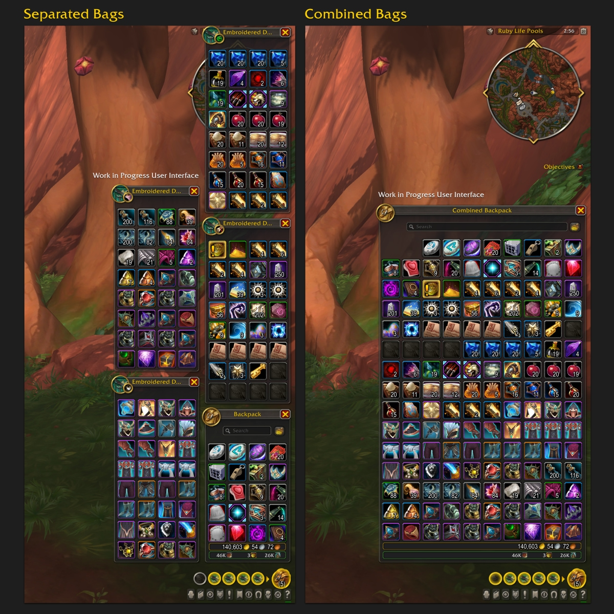

[Source page](https://worldofwarcraft.blizzard.com/en-us/news/23841481) · [Detailed analysis](../games/world-of-warcraft.md) · [Image provenance](wow/manifest.json)

### WOW-02 — 02 hud edit layout

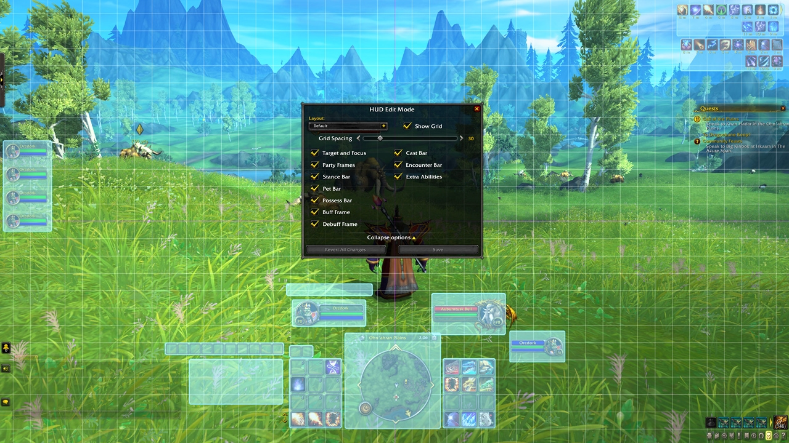

[Source page](https://worldofwarcraft.blizzard.com/en-us/news/23841481) · [Detailed analysis](../games/world-of-warcraft.md) · [Image provenance](wow/manifest.json)

### WOW-03 — 03 frame edit preview

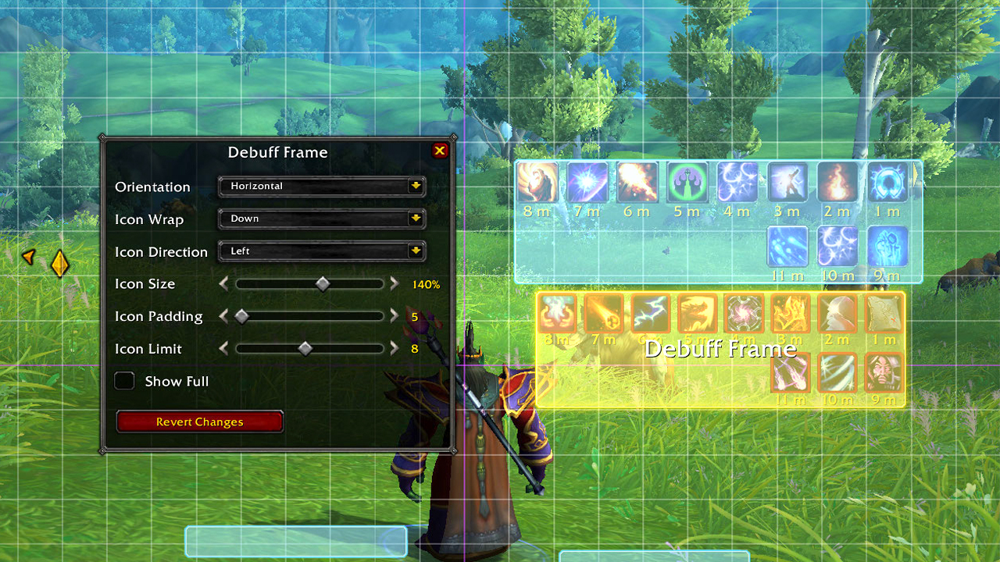

[Source page](https://worldofwarcraft.blizzard.com/en-us/news/23841481) · [Detailed analysis](../games/world-of-warcraft.md) · [Image provenance](wow/manifest.json)

### WOW-04 — Explain the symbols where the player needs to read them

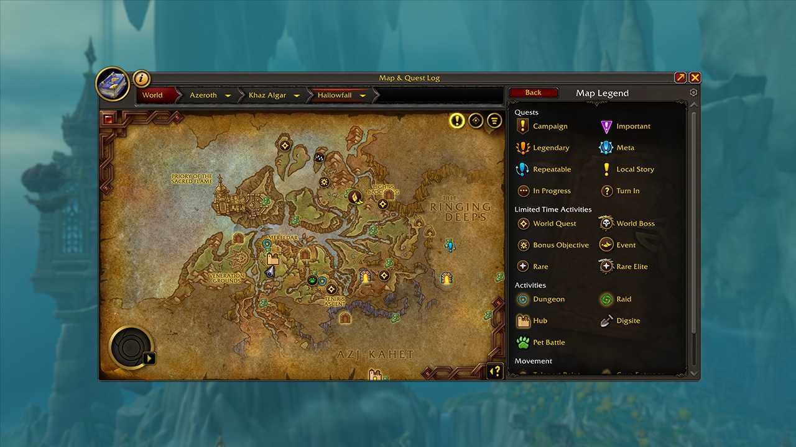

[Source page](https://news.blizzard.com/en-gb/article/24117139/user-interface-and-quest-updates-in-the-war-withintm) · [Detailed analysis](../games/world-of-warcraft.md) · [Image provenance](wow/manifest.json)

### WOW-05 — A learned-action catalogue and a quick-action bar serve different goals

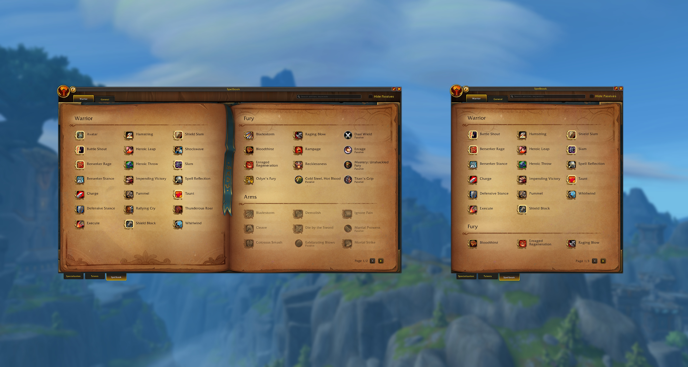

[Source page](https://news.blizzard.com/en-gb/article/24117139/user-interface-and-quest-updates-in-the-war-withintm) · [Detailed analysis](../games/world-of-warcraft.md) · [Image provenance](wow/manifest.json)

## Disco Elysium

[Detailed controls, workflows and critique](../games/disco-elysium.md) · 6 digital screenshots

### DISCO-01 — 01 dialogue morale

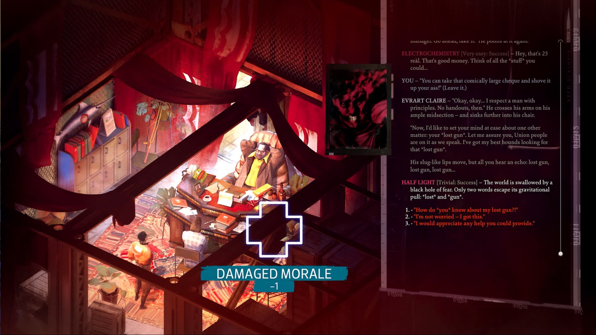

[Source page](https://discoelysium.com/media) · [Detailed analysis](../games/disco-elysium.md) · [Image provenance](disco/manifest.json)

### DISCO-02 — 02 check world overlay

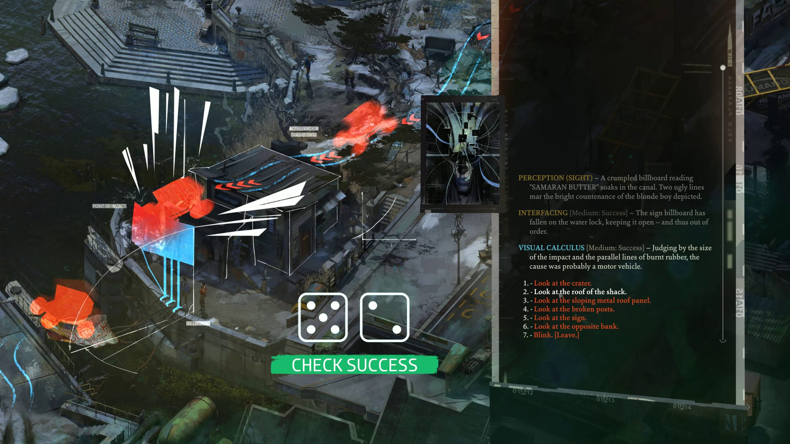

[Source page](https://discoelysium.com/media) · [Detailed analysis](../games/disco-elysium.md) · [Image provenance](disco/manifest.json)

### DISCO-03 — 03 thought cabinet ps5

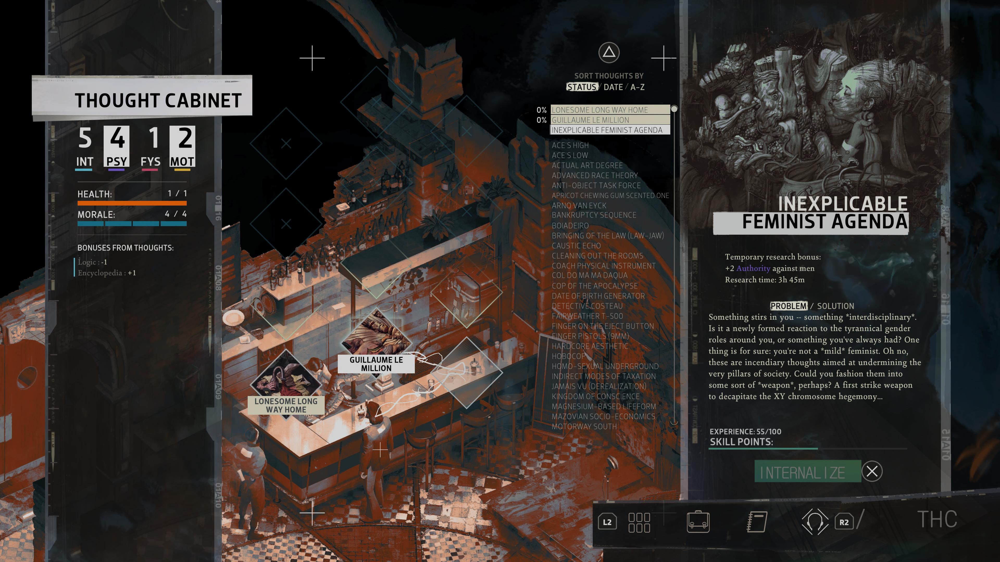

[Source page](https://caniplaythat.com/2021/03/31/disco-elysium-the-final-cut-can-i-play-that-accessibility-review/) · [Detailed analysis](../games/disco-elysium.md) · [Image provenance](disco/manifest.json)

### DISCO-04 — 04 equipment inventory

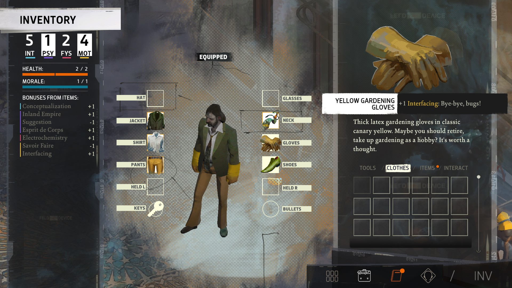

[Source page](https://planita13.github.io/Final-Project/disco.html) · [Detailed analysis](../games/disco-elysium.md) · [Image provenance](disco/manifest.json)

### DISCO-05 — A map can remember opportunities without prescribing every move

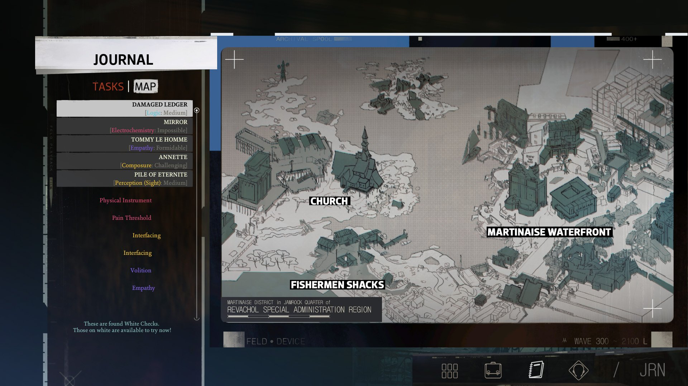

[Source page](https://www.shacknews.com/article/114689/where-to-get-a-map-in-disco-elysium) · [Detailed analysis](../games/disco-elysium.md) · [Image provenance](disco/manifest.json)

### DISCO-06 — Help must connect physical controls to player intentions

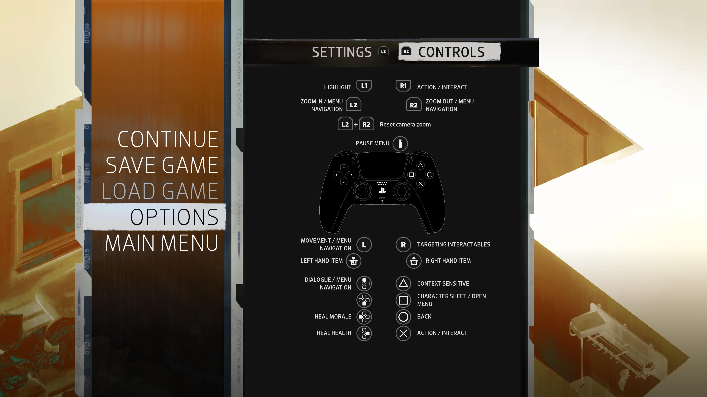

[Source page](https://caniplaythat.com/2021/03/31/disco-elysium-the-final-cut-can-i-play-that-accessibility-review/) · [Detailed analysis](../games/disco-elysium.md) · [Image provenance](disco/manifest.json)
