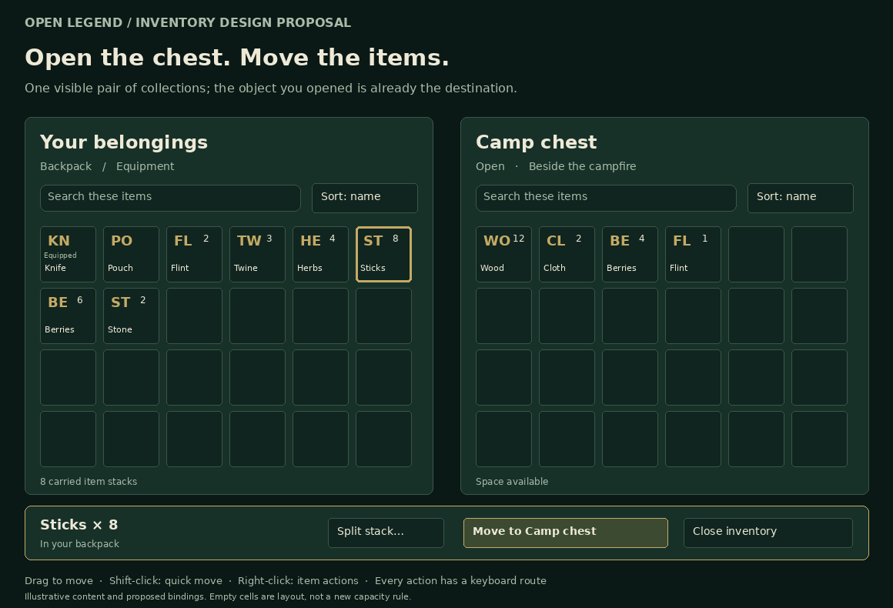
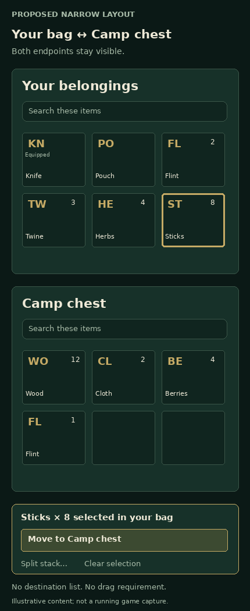
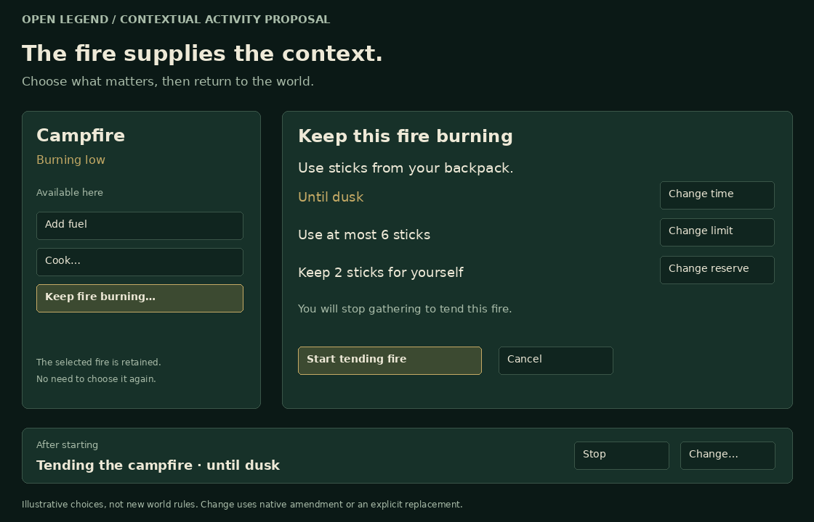
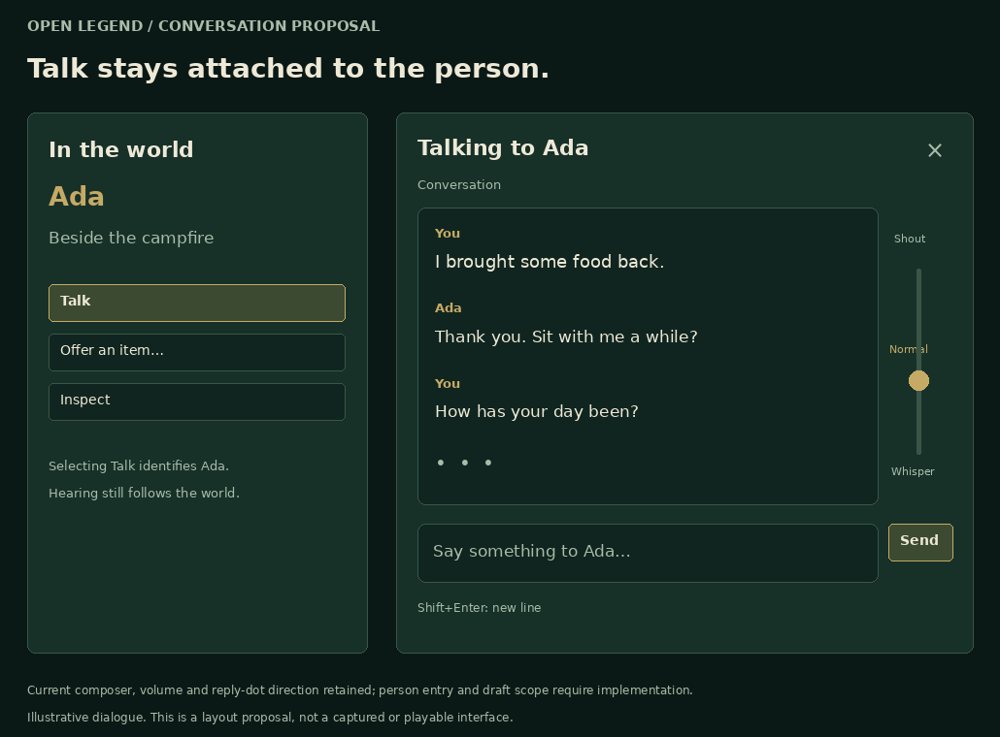

# Open Legend interaction layout proposals

[Feature specification](../../projects/game-interaction-redesign-feature-spec.md) · [Technical design](../../projects/game-interaction-redesign-tech-design.md) · [Actual game screenshot gallery](../screenshots/gallery.md)

These four original diagrams make the proposed interaction concrete. They are static design illustrations, not a running game, new game artwork or screenshots of implemented behavior. They contribute **zero** to the 71-game-screenshot count. Item initials stand in for eventual semantic artwork, while readable names demonstrate the fallback requirement. Illustrative objects, amounts and times do not define world mechanics.

## Desktop: keep both collections visible

Opening the object identifies the right-hand collection. Both grids remain while a selected stack exposes an explicit Move action. Dragging and quick-move are equivalent conveniences, not the only routes. A requested split remains local; routine transfer has no destination dropdown or second review. Sorting and search are per collection. Grid cells are display organization, not a new capacity model. [Editable vector](inventory-desktop.svg)

## Narrow: preserve the same two endpoints

The layout stacks two readable collections instead of squeezing columns or restoring the picker. The selected item and named destination stay clear, with an explicit non-drag action. This illustration is not a fixed minimum screen height: the implementation must manage actual available space, scrolling, enlarged text and short-window adaptation under the feature specification. [Editable vector](inventory-narrow.svg)

## Activity: selected object and consequential choices

The chosen fire is already bound. Ordinary Add fuel is a short item/amount action; the illustrated longer care task presents a readable plan with change controls for meaningful limits. Starting explains replacement of current work. The bottom strip illustrates later ongoing status rather than a second simultaneous state. Change requires a supported native amendment or deliberate replacement; editing the plan does not restart work. [Editable vector](fire-care.svg)

## Conversation: person, audience and readable history

Talk starts from Ada and keeps that identity beside the transcript. History, volume and input have separate stable regions. The current growing composer, dots-only reply treatment and vertical volume direction are retained. Recipient/world/control draft transitions remain implementation work. Nothing in this picture proves a listener cannot overhear or that another character's thoughts are available. [Editable vector](conversation.svg)

## Review scope

PNG versions were rendered and visually inspected for fit, readable labels, control placement and correspondence to the written proposal. SVG versions retain the same original layout for further design work. These diagrams establish neither real input behavior nor accessibility; the actual-game J01–J16 journeys remain required before runtime completion. The drawings intentionally defer texture, item artwork, animation, exact production dimensions and implementation to the existing theme/component owners.
