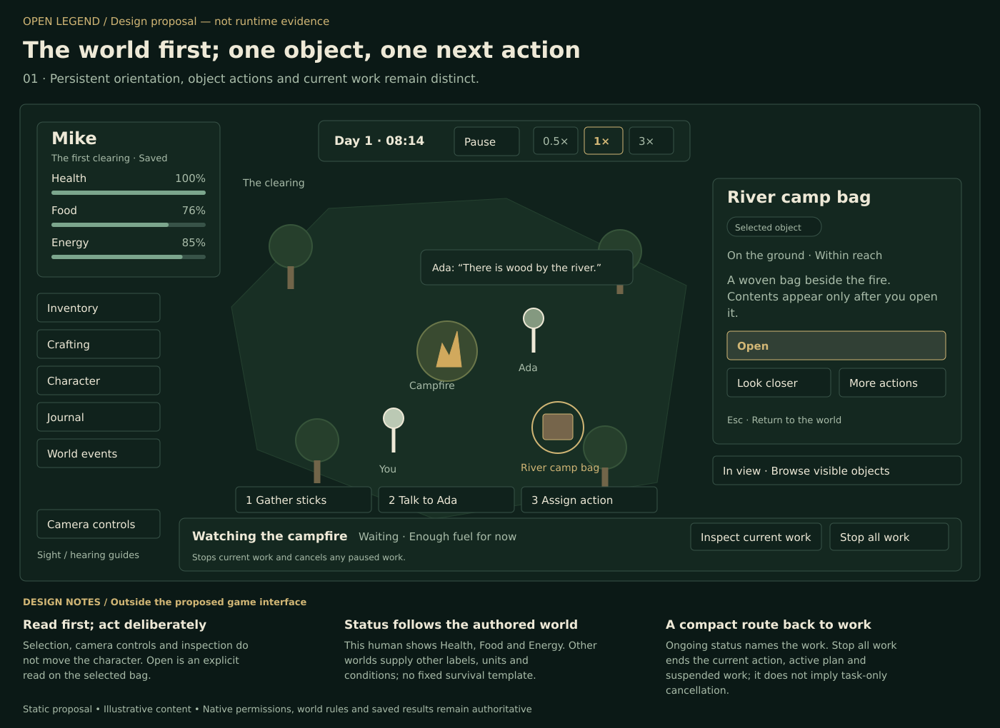
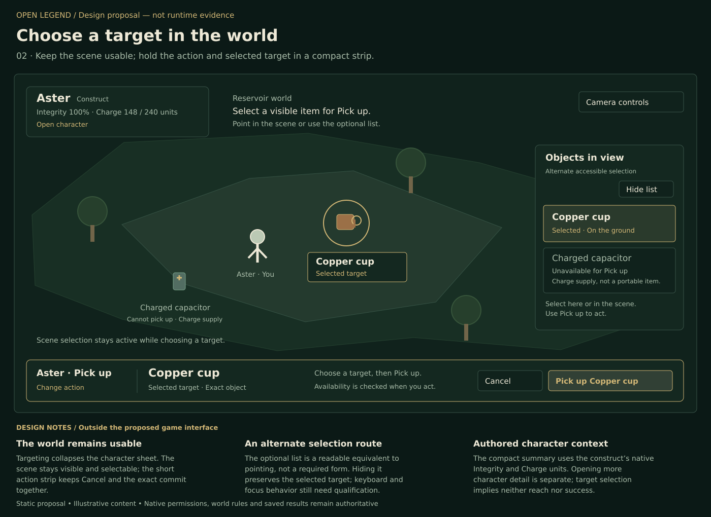
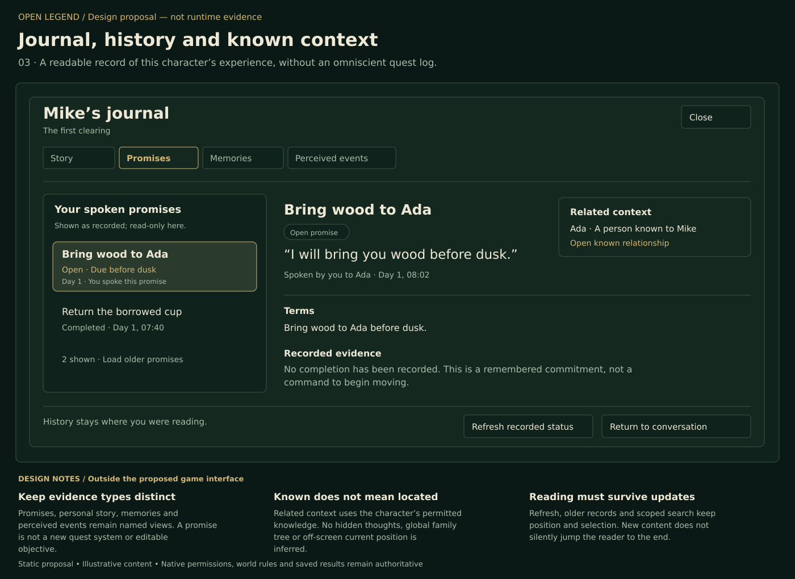
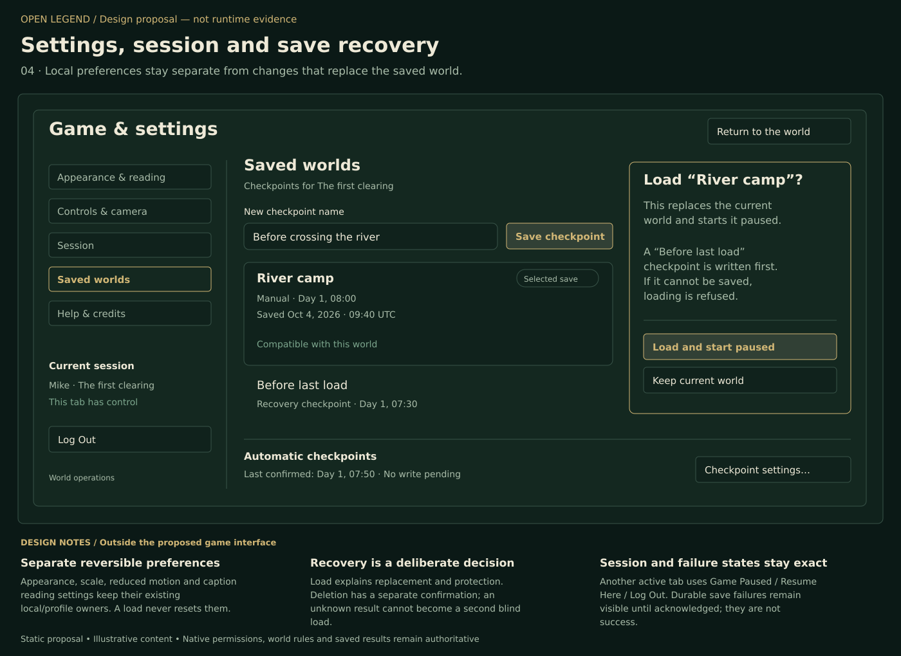
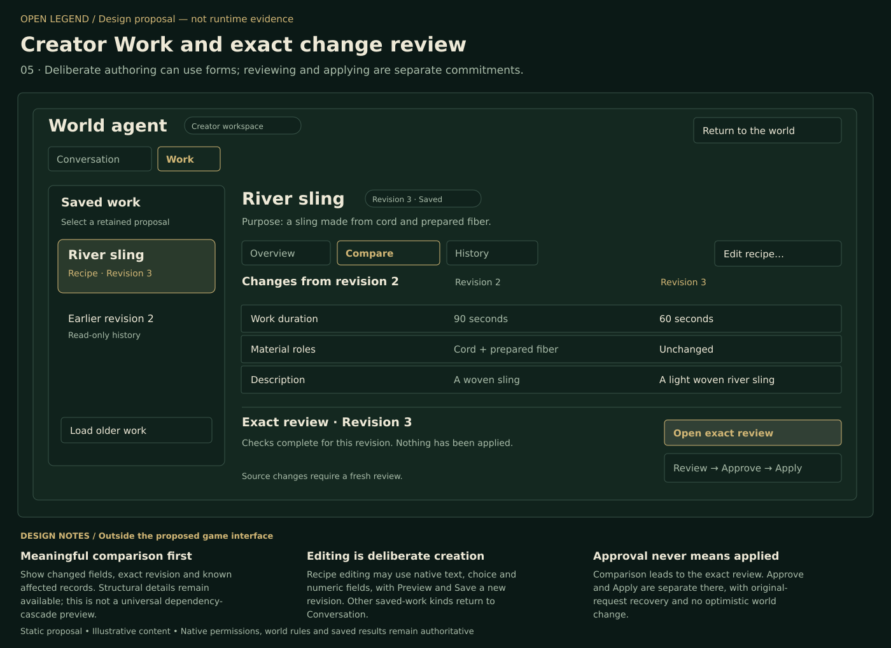

# Open Legend interaction layout proposals

[Feature specification](../../projects/game-interaction-redesign-feature-spec.md) · [Technical design](../../projects/game-interaction-redesign-tech-design.md) · [Actual game screenshot gallery](../screenshots/gallery.md)

These nine original diagrams make the proposed interaction concrete. They are static design illustrations, not a running game, new game artwork or screenshots of implemented behavior. They contribute **zero** to the reference-game screenshot count. Item initials and schematic figures stand in for eventual semantic artwork, while readable names demonstrate the fallback requirement. Illustrative objects, amounts and times do not define world mechanics. The five whole-interface proposals below use the [58-surface inventory](../interface-coverage.md) to distinguish current capabilities from proposed organization; they do not claim to illustrate every state of every surface.

## Desktop: keep both collections visible

Opening the object identifies the right-hand collection. Both grids remain while a selected stack exposes an explicit Move action. Dragging and quick-move are equivalent conveniences, not the only routes. A requested split remains local; routine transfer has no destination dropdown or second review. Sorting and search are per collection. Grid cells are display organization, not a new capacity model. [Editable vector](inventory-desktop.svg)

## Narrow: preserve the same two endpoints

The layout stacks two readable collections instead of squeezing columns or restoring the picker. The selected item and named destination stay clear, with an explicit non-drag action. This illustration is not a fixed minimum screen height: the implementation must manage actual available space, scrolling, enlarged text and short-window adaptation under the feature specification. [Editable vector](inventory-narrow.svg)

## Activity: selected object and consequential choices

The chosen fire is already bound. Ordinary Add fuel is a short item/amount action; the illustrated longer care task presents a readable plan with change controls for meaningful limits. Starting explains replacement of current work. The bottom strip illustrates later ongoing status rather than a second simultaneous state. Change requires a supported native amendment or deliberate replacement; editing the plan does not restart work. [Editable vector](fire-care.svg)

## Conversation: person, audience and readable history

Talk starts from Ada and keeps that identity beside the transcript. History, volume and input have separate stable regions. The current growing composer, dots-only reply treatment and vertical volume direction are retained. Recipient/world/control draft transitions were implementation work when this proposal was drawn; the [current implementation evidence](../../verification/game-interaction-redesign.md#conversation-and-item-mention) records delivered scope and remaining gameplay qualification. Nothing in this picture proves a listener cannot overhear or that another character's thoughts are available. [Editable vector](conversation.svg)

## World HUD: inspect an object while keeping work visible

The scene remains the primary workspace. The selected bag has a readable identity and **Open** action, while ongoing fire-care work has a separate inspection route and **Stop all work** control. The adjacent consequence states its current native scope: it ends the current action, active plan and suspended work. This proposal does not imply task-only cancellation for queued or waiting plans, which lack a projected stable task identifier. Looking at the bag or opening its permitted contents does not silently replace that work. A small persistent set of named destinations makes menus discoverable; the three quick-action positions remain distinct from contextual suggestions. The schematic clearing is the main scene, not a proposed minimap. Camera bindings, permission-safe sight/hearing guides and simulation-time controls retain their existing meanings. The human example uses Health, Food and Energy only because those labels belong to that authored body. [Editable vector](world-hud-actions.svg)

**Coverage:** HUD-01–HUD-09 and PLAY-01/PLAY-05. This is a proposed arrangement of existing capabilities. It does not assert that the illustrated compact work strip or entire HUD is implemented, and it does not change the gesture contract in [World interaction](../world-interaction.md).

## Character: choose an action, then its missing target

Targeting collapses the character sheet to a small summary and leaves the scene substantially visible and selectable. The already chosen **Pick up** action, exact selected object, Cancel and named commit stay together in a compact bottom strip. The selected portable object is highlighted in the world; the optional readable list offers alternate accessible selection of those same permitted candidates. The reservoir preset's Charged capacitor is explicitly unavailable for Pick up because it is a charge supply, not a portable item; it receives no eligible-target highlight. Hiding the list preserves the current selection. Neither route starts the action before **Pick up Copper cup**. The summary uses the existing construct preset's Integrity and Charge units; it adds no universal hunger, class, skill tree or action-point economy. Opening the full character sheet or choosing a different action remains a separate deliberate step. Describing another action can still require the existing clarification or configured-AI path. [Editable vector](character-targeting.svg)

**Coverage:** PLAY-07–PLAY-08, HUD-06–HUD-08 and SHARED-02. This is a replacement presentation proposal for the current general action-intention form, not a delivered replacement. The target list must use permitted visible projections; it cannot infer reach, remote contents or success. [Existing action owner](../../targeted-actions.md) · [Construct preset](../../../packages/domain/src/world-presets.ts)

## Journal: distinct records, readable context

Personal story, spoken promises, memories and perceived events are named views within a common reading workspace. A promise is shown as recorded terms, status and evidence; there is no invented quest checkbox, edit command, movement instruction or map marker. The related person is known to this character, which does not disclose their current location or private thoughts. Cross-links to a relationship or conversation are proposed navigation and appear only when the existing permitted record is available. Refresh and older-history controls retain the current selection and reading position. [Editable vector](journal-context.svg)

**Coverage:** READ-03–READ-06 and the ordinary private-knowledge route within CREATE-13. Combining navigation does not merge their authorities, imply one universal search endpoint, make promise status editable or expose the creator's objective family data. [Knowledge owner](../../knowledge.md) · [Memory architecture](../../memory-architecture.md)

## Settings and recovery: explain what a load replaces

Readability, controls and session navigation stay separate from replacing saved gameplay. The save workspace identifies the selected checkpoint, simulation time, real capture time and compatibility, then explains the existing **Before last load** protection and paused restart before committing. A failed protection write refuses the load. Deleting a checkpoint requires its own separate confirmation; it is not a second meaning for Load. Forms remain appropriate for a checkpoint name and deliberate settings. [Editable vector](settings-recovery.svg)

**Coverage:** LIFE-03–LIFE-10 and SHARED-03–SHARED-04. This is an inline confirmation composition proposal, not a change to save authority or guarantees. Save controls are capability-gated. The separate blocking tab state retains the exact **Game Paused** / **OpenLegend is open in another tab.** / **Resume Here** / **Log Out** contract; no screenshot here claims to qualify that dialog. Durable save failure stays visible until acknowledged, and an unknown result requires original-request recovery. [Save/load owner](../../save-and-load.md) · [Feedback and recovery](../system-feedback.md)

## Creator Work: compare before opening exact review

The authorized creator chooses saved Work, keeps its exact revision visible and compares meaningful fields with retained history. This illustration does not allow approval directly from a short comparison. **Open exact review** leads to the existing review owner, where candidate, affected records, checks and required versions are inspected before separate Approve and Apply actions. No world change is implied by saving, comparing or approving a proposal. [Editable vector](creator-work-review.svg)

**Coverage:** CREATE-01–CREATE-05 and SHARED-03. Deliberate recipe editing may use installed text/choice/numeric fields, Preview and Save a new revision. Other saved-work kinds retain their Conversation route. The three displayed fields are illustrative; this is not a universal dependency-cascade preview or a claim that every kind supports inline editing. Original Save/Prepare/Apply receipt recovery and changed-source review remain required. [Creator work owner](../../world-agent-inspection-and-edits.md) · [Workshop tools](../../invention-workshop-tools.md)

## Review scope

PNG versions were rendered and visually inspected individually for fit, readable labels, control placement and correspondence to the written proposal. SVG versions retain the same original layout for further design work. The five whole-interface additions are 1400 × 1020 desktop illustrations with design notes clearly outside the proposed game interface; Inkscape rendered their code-native SVG sources to PNG without external assets. These dimensions are drawing space, not production size or a minimum viewport.

These diagrams establish neither real input behavior nor accessibility. Keyboard/focus behavior, local child dismissal, narrow/short layouts, enlarged text, uncertainty, concurrent changes and native authority need implementation-specific verification. The actual-game J01–J16 journeys remain required for the prior runtime slice, and broader design acceptance must follow the full interface inventory. The drawings intentionally defer texture, item artwork, animation, exact production dimensions and implementation to the existing theme/component owners. No runtime source or test was changed to produce them.
