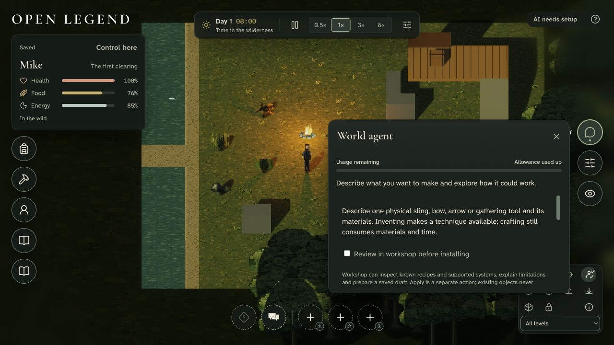

# Invention integration with current main

September 27, 2026. Integration inputs: main `412b5b480b4911d9977de73168c6072e2c023b83`, feature `b3a878638e7f1750f9676885890c024950711b2e`, common ancestor `fc01e19b30060e6c7213b1c5405be13df209297e`. The merge preserves both histories. [Plan](../projects/invention-production-integration.md), [runtime](../world-agent-runtime.md), and [WW tracker](../maintainers/world-agent-writes.md) define the scope.

## Current observations

All runtime scenarios used disposable PostgreSQL 14.17 databases with pgvector 0.8.6 in an isolated loopback cluster. Native checks used `AI_BUDGET_USD=0`. Accounting examples deliberately inserted synthetic reservations; cancellation injected only an executor. No live model/provider requests or paid charges occurred. [Structured observations and actual query plans](invention-main-integration.json) retain the results without credentials, private saves or temporary database locations.

- Fifteen HTTP/MCP/service journeys passed: immutable revisions and exact review digests; approval required before Apply; concurrent browser/MCP Apply and repeated Apply commit once; custom attribute definition/binding/value changes; recovery from an injected post-commit review-projection failure; stale revision refusal; MCP discovery of 20 tools; service-bearer and cross-account privacy; ordinary supplied workshop proposal followed by exact installation; zero native paid attempts; concurrent session and per-character reservations; exact-turn cancellation/replay; backup catalogue inclusion; PostgreSQL reopen and uncertain settlement; current-format gameplay restore; private body draft rejection before base fingerprints; immediate fencing after grant revocation. Some journeys combine related assertions.
- The actual `restore-world.ts` command restored a current backup into an empty disposable database, preserving authoring sessions, records, attempt-budget links and conservative accounting. No conversion or incompatible-save fixture was introduced.
- With 1,200 retained memory records and zero hot memory records, two ten-record evidence pages and exact inspection of the oldest source passed (25.8 ms total in this local sample). This is reader coverage, not a population-scale latency claim.
- With 1,000 additional retained sessions, numeric keyset pages remained bounded and non-overlapping. Recovery selected and cleared the three interrupted sessions. `EXPLAIN ANALYZE` used `world_agent_owner_order_numeric` (21 rows, 0.177 ms) and `world_agent_active` (empty after recovery, 0.013 ms). The tiny two-attempt budget fixture naturally used sequential scans (0.023 ms); it does not qualify mature financial histories.
- The actual player browser showed usage moving 75% → 50% → exhausted from synthetic held reservations. Accessible meter values matched the visible text. Creation displayed no money, compute explanation or invention count; an unconfigured request produced a plain-language owner-enablement message. Visual inspection corrected the default meter appearance and flex sizing to use the existing themed track/fill.
- The owner browser separately disclosed Run charges and shared Worker billing. It reopened a saved conversation, inspected the exact candidate, approved it, applied it and showed the durable applied result. Keyboard approval and Apply retain focus inside the review; Escape closes it and returns to conversation controls. Unsupported authoring kinds were rejected by the real local route. Browser checks cover these desktop paths; they do not qualify every mobile/assistive-device configuration or a live harness.

## Checks and review

- `pnpm typecheck` passed, including test sources.
- `pnpm build` passed. Existing PlayCanvas browser externalization and large-chunk warnings remain; neither is a new integration failure.
- Focused existing files: `store.test.ts`, `ai-director.test.ts`, `http.test.ts`, `cognition.test.ts`: 39 tests passed. The director test was rerun after its expected text was updated from “spending cap” to the approved usage wording; its no-dispatch assertions remain. The Worker fixture confirms current `worker_id`/worktree routing and no Worker/Sandbox lifecycle requests.
- Changed-file pinned Prettier, generated configuration, guidance and whitespace checks passed. Existing guidance size advisories remain unchanged. Full `pnpm check` is left to the normal, unsuppressed CI workflow.
- Full resulting diff review covered both textual conflicts and cleanly merged producers/consumers. Fixes include current scope/grant/privacy fences; private body checks before draft fingerprint creation; canonical PostgreSQL cold reads and persisted generation; one world mutation/receipt owner; session-before-world ordering to avoid browser/MCP deadlock; current backup catalogue; per-character invention charging; shared Worker admission and conservative uncertainty; scoped browser storage; player usage and review keyboard focus. No outstanding in-scope review finding is knowingly deferred.

## Reused evidence and limits

Historical [continuation](workshop-continuation.md), [transport](workshop-transport-funding.md), [navigation](workshop-navigation.md), [handoff](invention-handoff.md), and [graph/performance audit](invention-performance-review.json) remain useful for unchanged strict schemas, bounded UTF-8 envelopes, immutable draft comparisons, typed custom-attribute mutations and deterministic graph traversal. Their code assumptions were compared during review. They do not establish today's PostgreSQL authority, current Worker billing, human privacy or save/restore behavior; those joins received the focused checks above. Historical SQLite/Sandbox results are not current qualification.

Live Macrofold/MCP model behavior and provider-side enforcement, hosted/OIDC deployment qualification, sustained cold/warm population stress, mature ledger pressure, full mobile/accessibility coverage, generated art and later invention families remain their existing WW07/WW11, WAF, MW, PF and INV gates. They are broader roadmap/release work, not evidence that this integration ran those checks. No new paid experiment or blanket rerun was needed. Final publication/CI status belongs to the attached PR; required CI is not waived.

## Published CI reconciliation

The initial full CI run reproduced the exact main baseline (main run `36336027552`): three old hearing assertions and the AI-director fixture's database-cleanup deadline. PostgreSQL's own log shows the five-second `DROP DATABASE` deadline expiring during a 6.08-second cluster checkpoint. The spatial workflow also omitted its required database service. These findings justify the additional focused checks; they are not invention-runtime regressions.

Existing fixtures now explicitly whisper when verifying unheard words, allow permitted visual/indistinct speech evidence, and bind speech origin to the current ear anchor. Runtime acoustic policy is unchanged. The disposable administrative timeout is 30 seconds and teardown hook 60 seconds; no forced drops, connection termination or retry was added. The spatial CI gate receives the same loopback PostgreSQL service as full CI, and its browser fixture signs in and explicitly acquires control. All 31 retained domain/spatial HTTP tests passed across the selected runs after the fixture corrections; typecheck passed again. Final full/browser CI results are recorded on the PR.
